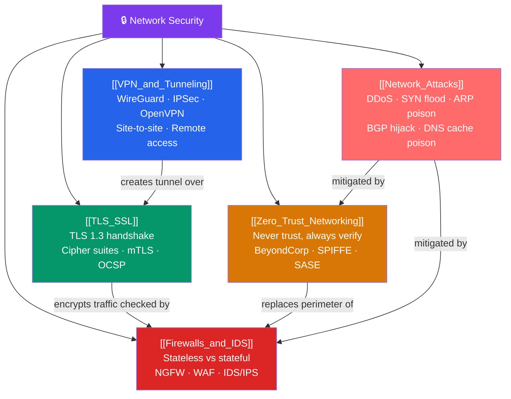

# 🗺️ Network Security — Map of Content

> [!abstract] What This Section Covers
> Network security protects data in transit, controls who can reach what, and defends infrastructure against attack. This section covers: **Firewalls and IDS/IPS** (stateless ACLs vs stateful connection tracking, NGFW deep packet inspection, WAF), **VPN and Tunneling** (WireGuard, IPSec, OpenVPN, site-to-site vs remote-access), **TLS/SSL** (TLS 1.3 handshake, cipher suites, certificate chain validation, mTLS), **Network Attacks** (DDoS taxonomy, SYN floods, ARP poisoning, BGP hijacking, defenses), and **Zero Trust Networking** (identity-aware proxy, BeyondCorp, SPIFFE/SPIRE, eBPF micro-segmentation, SASE).

## Concept Map

## Learning Path

1. [[TLS_SSL]] — Understand encryption first; everything else builds on it.
2. [[Firewalls_and_IDS]] — Traditional perimeter security mechanisms.
3. [[VPN_and_Tunneling]] — Extending secure networks over untrusted infrastructure.
4. [[Network_Attacks]] — The threats all these defenses protect against.
5. [[Zero_Trust_Networking]] — The modern paradigm that replaces perimeter trust.

## All Notes at a Glance

| Note | Difficulty | What You'll Learn |
|------|------------|-------------------|
| [[Firewalls_and_IDS]] | Intermediate | Stateless ACLs, stateful conntrack, NGFW/DPI, WAF (ModSecurity/OWASP CRS), IDS vs IPS |
| [[VPN_and_Tunneling]] | Intermediate | WireGuard (Curve25519/ChaCha20/BLAKE2s), IPSec (AH/ESP/IKEv2), OpenVPN, split tunneling |
| [[TLS_SSL]] | Intermediate → Advanced | TLS 1.3 handshake (1-RTT), AEAD cipher suites, ECDHE, certificate chain, OCSP stapling, mTLS |
| [[Network_Attacks]] | Intermediate → Advanced | DDoS (volumetric/protocol/application), SYN cookies, ARP poisoning, BGP hijacking, RPKI |
| [[Zero_Trust_Networking]] | Advanced | Identity-aware proxy, BeyondCorp, device trust, SPIFFE/SPIRE, OPA, eBPF/Cilium, SASE |

## Key Questions This Section Answers

- What is the difference between a stateless firewall ACL and a stateful firewall with connection tracking?
- How does a next-generation firewall differ from a traditional stateful firewall?
- How does the TLS 1.3 handshake achieve 1-RTT, and what was removed from TLS 1.2?
- What is the difference between AEAD and CBC cipher modes, and why does TLS 1.3 only allow AEAD?
- How does WireGuard differ from IPSec in terms of code complexity and cryptography?
- What is a SYN flood, and how do SYN cookies defend against it?
- What is Zero Trust, and how does it differ from traditional perimeter security?

## Related Sections

- [[_MOC_Networking_Master|↑ Networking Master MOC]]
- [[_MOC_TCPIP_Protocols|← TCP/IP Protocols]]
- [[_MOC_Application_Protocols|← Application Protocols]]
- [[_MOC_SDN_Cloud_Networking|→ SDN & Cloud Networking]]

#MOC #Networking #NetworkSecurity
