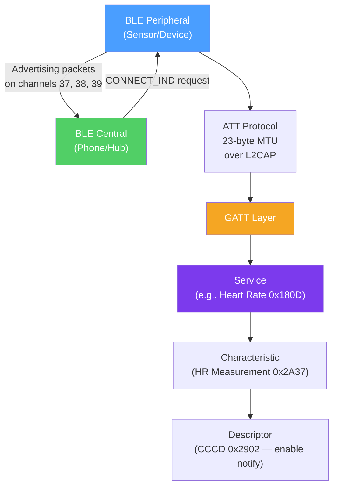

# 🔵 Bluetooth and BLE

> [!abstract] TL;DR
> Bluetooth operates in the 2.4 GHz ISM band. **Classic Bluetooth (BR/EDR)** uses FHSS (1600 hops/sec) for audio (A2DP) and serial profiles in piconet topology. **BLE (Bluetooth Low Energy)** uses 40 channels (3 advertising, 37 data) with the **GATT service → characteristic → descriptor** hierarchy over a 23-byte ATT MTU, targeting sub-milliwatt IoT devices. **BLE 5** doubled throughput (2M PHY) and extended range (Coded PHY at S8 = 125 kbps / ~1 km). **LE Secure Connections** uses ECDH pairing, eliminating the PIN-based attacks of BLE 4.x.

## Intuition — analogy FIRST

Think of the Bluetooth spectrum like a crowded parking lot shared by many devices. Classic Bluetooth (BR/EDR) uses **frequency hopping** — it changes its "parking spot" 1600 times per second, so even if someone parked in your spot, you've already moved. This makes it robust against interference.

BLE is like using specific reserved parking spots (3 advertising channels) to announce your presence, then agreeing to meet in one of 37 private spots (data channels). It's extremely efficient because you only use the reserved spot briefly to shout "I'm here!", then disappear until called.

GATT is the "menu card" for BLE devices — when you connect to a Bluetooth device (a heart rate monitor, for example), GATT tells you what services it offers (Heart Rate Service), what you can read/write (heart rate measurement characteristic), and what format the data is in (descriptor).

---

## How It Works



## Key Concepts / Details

### Classic Bluetooth (BR/EDR)

**BR/EDR** = Basic Rate / Enhanced Data Rate

- **Frequency:** 2.4 GHz ISM band, 79 channels (1 MHz each, from 2402–2480 MHz)
- **FHSS (Frequency Hopping Spread Spectrum):** Hops through all 79 channels 1600 times/second (625 µs per hop). Makes the connection robust against interference and difficult to intercept.
- **Data rates:** BR = 1 Mbps, EDR = 2 or 3 Mbps
- **Range:** ~10 m (Class 2) to ~100 m (Class 1)

**Piconet topology:**
- **Picomaster** — The master device; controls timing and channel hopping sequence.
- **Piconets** — Up to 7 active slaves per master (255 parked).
- **Scatternet** — A device is master in one piconet and slave in another, bridging them.

**Classic Bluetooth profiles:**
- **A2DP (Advanced Audio Distribution Profile)** — Stereo audio streaming (speakers, headphones)
- **HFP/HSP (Hands-Free/Headset Profile)** — Voice calls
- **RFCOMM** — Serial port emulation (cable-replacement)
- **HID** — Keyboard, mouse
- **OBEX** — File transfer

### BLE (Bluetooth Low Energy)

BLE (introduced in Bluetooth 4.0, 2010) targets battery-operated devices:

**Designed for:** Sub-milliwatt average power consumption, enabling coin-cell batteries to last months or years.

**Key differences from Classic:**
- **40 channels** (2 MHz each): 3 advertising channels + 37 data channels
- **Advertising channels 37, 38, 39** — Chosen to minimize Wi-Fi 2.4 GHz channel 1/6/11 overlap
- **No FHSS** in the same way; uses adaptive frequency hopping (AFH) on data channels
- **Connectionless advertising** — Devices can broadcast without establishing a connection (Beacons)

**Connection parameters:**
- **Connection interval** — Time between connection events (7.5ms–4s)
- **Slave latency** — Number of consecutive events a peripheral can skip while still maintaining connection
- **Supervision timeout** — How long before declaring the connection lost (100ms–32s)

### GATT (Generic Attribute Profile)

GATT defines the data model for all BLE devices:

```
Server (peripheral) ← ATT Protocol (23B MTU) → Client (central)

GATT Hierarchy:
Profile
└── Service (UUID: e.g., 0x180D = Heart Rate Service)
    └── Characteristic (UUID: e.g., 0x2A37 = Heart Rate Measurement)
        ├── Value (actual data bytes)
        ├── Descriptor: CCCD (0x2902) — enable/disable notifications
        └── Descriptor: User Description (0x2901) — human-readable name
```

**GATT operations:**

| Operation | Direction | Description |
|-----------|-----------|-------------|
| **Read** | Client → Server → Client | Read a characteristic value |
| **Write (with response)** | Client → Server | Write value; server acknowledges |
| **Write without response** | Client → Server | Fire-and-forget write (no ACK) |
| **Notify** | Server → Client | Server sends unsolicited updates (client enables via CCCD) |
| **Indicate** | Server → Client | Like notify but requires ACK |

**Standard GATT Service UUIDs (SIG-defined):**
- 0x180D — Heart Rate
- 0x181A — Environmental Sensing (temperature, humidity)
- 0x1800 — Generic Access (device name, appearance)
- 0xFFF0 — Custom/vendor-specific (any 128-bit UUID for non-standard services)

### ATT Protocol

ATT (Attribute Protocol) is the underlying layer carrying GATT:
- **Default MTU:** 23 bytes (3 bytes header + 20 bytes value).
- **MTU negotiation:** Client can request a larger MTU via `ATT_EXCHANGE_MTU_REQ` (up to 517 bytes with DLE — Data Length Extension in BLE 4.2+).
- All attributes identified by 16-bit handles; reads/writes reference handles, not UUIDs directly.

### BLE 5 Features (2016)

| Feature | Description | Benefit |
|---------|-------------|---------|
| **2M PHY** | 2 Mbps data rate (vs 1M PHY) | 2× throughput; lower connection time |
| **Coded PHY (S2)** | 500 kbps with FEC | 4× longer range |
| **Coded PHY (S8)** | 125 kbps with heavy FEC | 8× longer range (~1 km in open field) |
| **Extended advertising** | Advertising packets up to 255 bytes | Larger payload in advertising |
| **Periodic advertising** | Synchronized, scheduled advertising | BLE mesh, time-synchronized data |
| **LE 2M PHY** | Higher data rate for connected mode | Faster firmware OTA updates |

**Range vs rate trade-off:** S8 coded PHY at 125 kbps achieves approximately -137 dBm sensitivity (~154 dB link budget) — enabling rural/outdoor ranges of 1+ km for small sensors.

### BLE Security: LE Secure Connections

**BLE 4.0–4.1 (Legacy Pairing):** Used 6-digit PIN or passkey for key derivation. Vulnerable to passive eavesdropping if the initial pairing is captured (offline brute-force of 6-digit PIN in ~1 second).

**BLE 4.2+ (LE Secure Connections):** Uses **ECDH (Elliptic Curve Diffie-Hellman)** for key agreement:
- Both devices generate ephemeral key pairs.
- DHKey (Diffie-Hellman shared key) computed locally — never transmitted.
- Even capturing the full pairing exchange gives no information about the session keys.
- **Passkey Entry** — Man-in-the-middle protection; user confirms number matches on both devices.
- **Numeric Comparison** — 6-digit number displayed on both devices for confirmation.
- **OOB (Out of Band)** — Key exchange via NFC or QR code for highest security.

**Bonding** — After pairing, devices store each other's Long-Term Key (LTK) for fast re-pairing on reconnect without going through full ECDH again.

### BLE Mesh

BLE Mesh (Bluetooth Mesh Profile 1.0) enables many-to-many communication:
- Based on BLE advertising (no connections required for routing).
- **Managed Flood** — Messages rebroadcast by relay nodes; TTL limits proliferation.
- **Publish/subscribe model** — Nodes publish to addresses; subscribers receive.
- **Provisioning** — Securely onboarding new nodes using ECDH.
- Use cases: smart building lighting, environmental sensor networks.

## Real-World Notes

- **BLE beacon protocols:** iBeacon (Apple) and Eddystone (Google) are advertising-only BLE protocols used for proximity detection, indoor positioning, and asset tracking. They broadcast UUID/major/minor or URL in advertising packets.
- **L2CAP CoC (Connection-Oriented Channels):** BLE 4.2+ allows direct L2CAP channels with larger MTU for bulk data transfer (e.g., firmware OTA) — faster than GATT notifications.
- **Audio over BLE (LE Audio):** Bluetooth 5.2+ introduces LE Audio with LC3 codec — lower power than Classic BR/EDR A2DP; enables hearing aids and broadcast audio (one source, many receivers simultaneously).

## Common Pitfalls

- Assuming BLE is low-latency — the minimum connection interval is 7.5ms; typical mobile apps set 20–200ms. Classic Bluetooth SCO for voice has lower latency.
- Not enabling CCCD (Client Characteristic Configuration Descriptor) before expecting notifications — peripheral will silently not send them.
- Forgetting MTU negotiation — default 23-byte ATT MTU limits throughput; negotiate to at least 247 bytes (DLE) for bulk transfers.
- BLE eavesdropping without LE Secure Connections — legacy pairing is trivially attacked with tools like Wireshark + BLE sniffer.

## Related Concepts

- [[WiFi_Standards_802_11]] — Complementary technology; both share 2.4 GHz
- [[IoT_Protocols]] — BLE is commonly used with MQTT for IoT data pipelines
- [[Physical_Layer]] — BLE is a wireless PHY technology

## Review Questions

1. Explain the BLE advertising process. What are the three advertising channels, why were they chosen, and what happens when a central wants to connect to a peripheral?
2. Describe the GATT service/characteristic/descriptor hierarchy. How does a central enable notifications from a peripheral's heart rate characteristic?
3. Compare BLE Legacy Pairing and LE Secure Connections. What specific attack does LE Secure Connections prevent, and what cryptographic mechanism makes it secure?

## Sources

- Bluetooth Core Specification 5.4 — https://www.bluetooth.com/specifications
- Townsend, Kevin, et al., *Getting Started with Bluetooth Low Energy*, O'Reilly
- Bluetooth SIG, "Bluetooth 5 Go Faster, Go Further" whitepaper

#networking #wireless-mobile #intermediate
