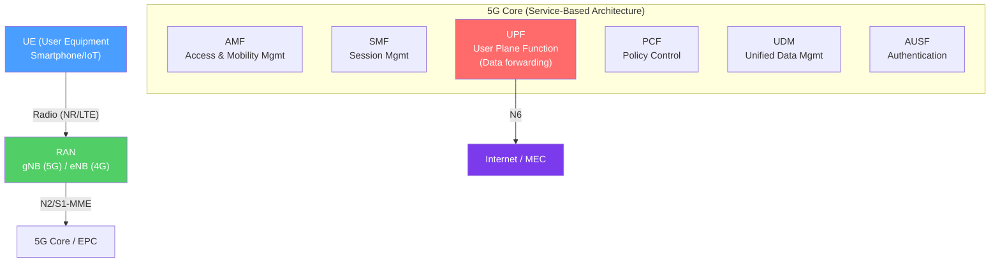

# 📱 Cellular 4G and 5G

> [!abstract] TL;DR
> Cellular networks provide wide-area mobile connectivity. **4G LTE** delivers 100+ Mbps via OFDMA (downlink) / SC-FDMA (uplink) through eNodeBs connected to the Evolved Packet Core (EPC). **5G NR (New Radio)** operates in sub-6 GHz (FR1) for coverage and mmWave (FR2, 28/39 GHz) for multi-Gbps throughput, using massive MIMO (64–256 antennas) and beamforming. The **5G Core (5GC)** uses a service-based architecture with HTTP/2 APIs, enabling **network slicing** (isolated virtual networks per use case: eMBB, URLLC, mMTC) and Multi-access Edge Computing (MEC).

## Intuition — analogy FIRST

Think of the cellular network as a system of radio towers (base stations) connected to a smart highway network (core network). When your phone calls or browses, a nearby tower relays your signal to the highway, which routes it to the destination.

**4G LTE** is like a four-lane highway — fast and reliable, enough for most traffic (HD video, browsing). The core network is a dedicated system of separate systems (billing, mobility, data) bolted together.

**5G** has three modes: a wide eight-lane highway in sub-6 GHz (same frequency, wider bandwidth), a laser-beam fiber-like connection for nearby devices (mmWave — Gbps speeds but short range), and a massive expansion of micro-roads (IoT connectivity). The 5G Core is a completely redesigned modular system exposed as microservices — any function can be updated independently.

**Network slicing** is like running separate virtual highways for different vehicle types — one for ambulances (URLLC: ultra-low latency), one for trucks (eMBB: enhanced mobile broadband), one for bicycle couriers (mMTC: IoT).

---

## How It Works



## Key Concepts / Details

### 4G LTE Architecture

**Radio Access Network (RAN):**
- **eNodeB (eNB)** — LTE base station; combines base station (BTS) and controller (BSC) functions.
- **X2 interface** — Direct eNB-to-eNB interface for handover signaling.
- **OFDMA (DL) / SC-FDMA (UL)** — Downlink uses OFDMA (same as Wi-Fi 6); uplink uses SC-FDMA (single-carrier, lower peak-to-average power ratio — better for phone batteries).

**Evolved Packet Core (EPC):**

| Entity | Role |
|--------|------|
| **MME** (Mobility Management Entity) | Authentication, security, mobility, tracking area |
| **SGW** (Serving Gateway) | User-plane anchor; routes traffic between eNBs and PGW |
| **PGW** (PDN Gateway) | Assigns UE IP address; connects to internet/IMS |
| **HSS** (Home Subscriber Server) | Subscriber database (IMSI, credentials, QoS profiles) |
| **PCRF** (Policy and Charging Rules Function) | QoS and charging policy |

**LTE peak data rates:** Category 4 UE: DL 150 Mbps / UL 50 Mbps. Cat 20 (LTE-A Pro): DL 2 Gbps / UL 200 Mbps.

### 5G NR Spectrum (FR1 and FR2)

**FR1 (sub-6 GHz):**
- Frequency: 410 MHz – 7.125 GHz
- Channel bandwidth: up to 100 MHz
- Characteristics: Similar range to LTE; deeper penetration; wider coverage
- Use cases: General mobile broadband, IoT, rural coverage

**FR2 (mmWave):**
- Frequency: 24.25 GHz – 52.6 GHz (commonly 28 GHz, 39 GHz, 60 GHz)
- Channel bandwidth: up to 400 MHz (aggregated to 800 MHz)
- Characteristics: Multi-Gbps throughput; very short range (100–300m LOS); blocked by walls, foliage, rain
- Use cases: Fixed wireless access, stadiums, dense urban hotspots

**5G NR key radio technologies:**
- **Massive MIMO:** 64–256 antenna elements per sector (vs LTE's 2–8). Enables simultaneous beamforming to many UEs.
- **Beamforming (BF):** Phased array focuses beam toward each UE; 3D beamforming (elevation + azimuth).
- **Sub-carrier spacing (SCS):** 5G NR supports multiple numerologies (15/30/60/120/240 kHz SCS) allowing different use cases on the same spectrum.

### 5G Core Service-Based Architecture (SBA)

The 5G Core completely redesigns the core network as **microservices** communicating over **HTTP/2 + JSON (REST)** via the **Service-Based Interface (SBI)**:

| Network Function | Abbreviation | Role |
|-----------------|-------------|------|
| Access and Mobility Management | AMF | Registration, mobility, reachability |
| Session Management | SMF | PDU session setup, IP allocation |
| User Plane Function | UPF | Data forwarding, QoS enforcement |
| Policy Control | PCF | Policy decisions (QoS, charging) |
| Unified Data Management | UDM | Subscriber database (replaces HSS) |
| Authentication Server | AUSF | EAP-AKA' authentication |
| Network Repository | NRF | Service discovery (like DNS for 5G functions) |
| Network Slice Selection | NSSF | Selects appropriate slice for UE |

All control-plane functions communicate via the SBI using HTTP/2 GET/POST/PATCH/DELETE to each other's REST APIs — enabling cloud-native deployment on Kubernetes.

**UPF** is the only function in the **user plane** (data traffic). The control plane (AMF/SMF/PCF/UDM) is entirely separate — fulfilling the control/data plane separation principle.

### Network Slicing

5G supports multiple **virtual networks** on the same physical infrastructure, each with isolated resources and different SLAs:

```
Physical 5G Infrastructure
├── Slice 1: eMBB (Enhanced Mobile Broadband)
│   - High throughput, typical consumer mobile service
│   - S-NSSAI: SST=1
│   - UPF config: high bandwidth, moderate latency
│
├── Slice 2: URLLC (Ultra-Reliable Low Latency Communication)
│   - Sub-1ms latency, 99.999% reliability
│   - S-NSSAI: SST=2
│   - UPF deployed at MEC (edge compute)
│   - Use cases: autonomous vehicles, remote surgery, Industry 4.0
│
└── Slice 3: mMTC (Massive Machine Type Communications)
    - Millions of low-power IoT devices
    - S-NSSAI: SST=3
    - Narrow-band, infrequent, small packets
```

**S-NSSAI (Single Network Slice Selection Assistance Information):** The slice identifier consisting of SST (Slice/Service Type) + optional SD (Slice Differentiator).

### O-RAN (Open RAN)

Traditional RAN equipment is proprietary (Nokia, Ericsson, Huawei). **O-RAN Alliance** defines open interfaces to disaggregate the base station:

```
O-RAN disaggregation:
  O-RU (Radio Unit) — radio hardware (antennas, RF)
  O-DU (Distributed Unit) — PHY layer, MAC, RLC
  O-CU (Centralized Unit) — RRC, PDCP; can be split into CU-CP and CU-UP
```

**Benefits:** Multi-vendor interoperability, software-defined RAN, cloud-native deployment, AI/ML-driven optimization via Non-RT/Near-RT RICs (RAN Intelligent Controllers).

### Mobile Edge Computing (MEC)

MEC (Multi-access Edge Computing) deploys compute resources at or near the base station:
- Reduces RTT for latency-sensitive applications (from 50–100ms to <5ms).
- Enables: AR/VR, gaming, autonomous vehicle coordination, industrial automation.
- UPF can be deployed at the edge to keep user-plane traffic local.

### Deployment Modes: NSA vs SA

| Mode | Description |
|------|-------------|
| **NSA (Non-Standalone)** | 5G NR radio + 4G LTE core (EPC); faster deployment by reusing LTE core |
| **SA (Standalone)** | 5G NR radio + 5G Core (5GC); full network slicing, URLLC, MEC capabilities |

Most early 5G deployments were NSA (5G anchor on LTE). SA is required for full 5G feature set.

## Real-World Notes

- **5G indoor challenge:** mmWave 5G doesn't penetrate walls — requires indoor small cells or Distributed Antenna Systems (DAS).
- **eSIM (embedded SIM):** Remotely provisioned SIM; enables switching carriers without physical SIM swap. Standardized by GSMA (RSP architecture).
- **5G private networks:** Enterprises deploy private 5G using CBRS (Citizens Broadband Radio Service, 3.5 GHz in the US) with their own small cells and local 5GC for factory automation.

## Common Pitfalls

- Assuming mmWave 5G is the default — most consumer 5G in coverage is sub-6 GHz NR (FR1), not mmWave. mmWave requires being within ~100m LOS of a cell.
- Confusing NSA and SA 5G — NSA 5G uses the 4G core; network slicing and sub-1ms URLLC require SA 5G.
- Missing that URLLC latency targets require MEC — a UPF in a central data center will never achieve sub-1ms.

## Related Concepts

- [[WiFi_Standards_802_11]] — Complementary local wireless; Wi-Fi offloads cellular traffic
- [[Mobile_IP]] — How IP mobility works as devices roam between cells
- [[Software_Defined_Networking]] — 5G Core SBA applies SDN principles to mobile networks

## Review Questions

1. Explain the difference between 5G FR1 and FR2. What are the trade-offs in terms of range, throughput, and penetration, and what use cases suit each?
2. Describe the 5G Core service-based architecture. How does it differ from the 4G EPC, and what does the UPF do?
3. What is a 5G network slice? Explain the three standard slice types (eMBB, URLLC, mMTC) and give a real-world application for each.

## Sources

- 3GPP TS 23.501 — System architecture for the 5G System
- 3GPP TS 38.300 — NR overall description
- Dahlman, Erik et al., *5G NR: The Next Generation Wireless Access Technology*, Academic Press

#networking #wireless-mobile #advanced
