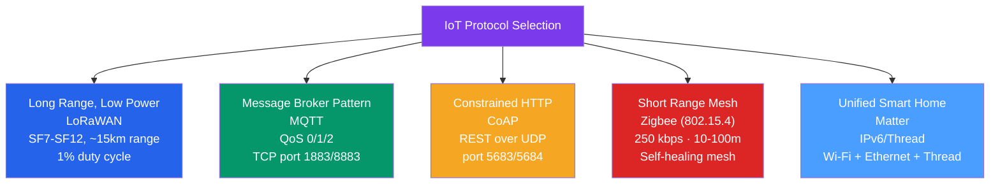

# 🏠 IoT Protocols

> [!abstract] TL;DR
> IoT protocols are optimized for constrained devices (low CPU, limited RAM, small battery) connecting billions of sensors and actuators. **LoRaWAN** uses chirp-spread-spectrum for LPWAN connectivity (SF7–SF12, 125 kbps to 250 bps, up to 15 km). **MQTT** is a lightweight publish-subscribe protocol (QoS 0/1/2, Last Will, retained messages) for device-to-broker messaging. **CoAP** is a REST-like protocol over UDP for resource-constrained web services. **Zigbee/802.15.4** provides 250 kbps mesh networking for smart home. **Matter** is the new unified smart home standard unifying Apple, Google, and Amazon ecosystems.

## Intuition — analogy FIRST

IoT protocols are designed like different postal services for different types of mail:

**LoRaWAN** is like using a very powerful megaphone to shout a short message across 15 km — the message is slow and short (low data rate), but it reaches everywhere with almost no power, and the sender doesn't need to wait for a reply.

**MQTT** is like a post office with bulletin boards (topics). Sensors post notices ("Temperature: 22°C") to the board. Any subscriber who signed up for that board receives the notice. The broker (post office) handles routing — sensors don't need to know who's reading their posts.

**CoAP** is like a simplified postal service where the letter format is very similar to HTTP mail (GET/PUT/POST/DELETE), but written on a postcard (tiny packet) and delivered via UDP instead of TCP — much faster and smaller for simple requests.

**Zigbee** is like a neighborhood watch network: each house relays messages for neighbors, creating a self-healing mesh where messages hop from node to node until reaching the coordinator.

---

## How It Works



## Key Concepts / Details

### LoRa and LoRaWAN

**LoRa (Long Range)** is the physical layer — a proprietary Semtech chirp-spread-spectrum (CSS) modulation technique:

**Chirp-spread-spectrum:** Data is encoded as chirps (sweeping frequency signals from low to high or high to low). The spreading factor (SF) determines how much the signal is spread:

| SF | Bit Rate | Range (typ.) | Sensitivity | Use Case |
|----|---------|-------------|-------------|---------|
| SF7 | ~5.5 kbps | ~2 km urban | -123 dBm | Nearby devices, high throughput |
| SF9 | ~1.76 kbps | ~5 km | -129 dBm | Medium range |
| SF12 | ~250 bps | ~15 km rural | -137 dBm | Maximum range; minimum data rate |

SF12 has a ~154 dB link budget — the most robust mode, surviving the worst propagation conditions.

**LoRaWAN** is the MAC/network layer protocol on top of LoRa (by the LoRa Alliance):

**Architecture:**
```
End Device ──LoRa──> Gateway ──IP──> Network Server ──> Application Server
```

**Device activation:**
- **OTAA (Over-The-Air Activation):** Device sends Join Request → Network Server sends Join Accept with session keys. More secure.
- **ABP (Activation By Personalization):** Session keys pre-provisioned at manufacture. Simpler but less secure (no join exchange).

**Device classes:**
| Class | Description | Use Case |
|-------|-------------|---------|
| **Class A** | Downlink only after uplink; lowest power | Most sensors |
| **Class B** | Scheduled downlink slots (synchronized beacons) | Actuators needing predictable downlink |
| **Class C** | Always listening for downlink (highest power) | Mains-powered actuators |

**Duty cycle constraint:** LoRaWAN operates on ISM bands with a 1% duty cycle restriction (EU868) — a device using SF12 can only send ~36 bytes every ~10 minutes. This is by design: the spectrum is shared; excessive transmissions would jam the network.

**ADR (Adaptive Data Rate):** Network Server adjusts the device's SF based on signal quality — close devices use SF7 (high throughput), far devices use SF12 (maximum range).

### MQTT (Message Queuing Telemetry Transport)

MQTT is a **publish-subscribe** protocol designed for IoT over unreliable networks:

**Architecture:**
```
Publisher (Sensor) → MQTT Broker → Subscriber (Backend/Dashboard)
```

**Connection:** TCP port 1883 (plain), 8883 (TLS). MQTT 5.0 also supports WebSocket transport.

**Topic structure (hierarchical, `/` delimiter):**
```
sensors/building_a/floor_3/room_201/temperature
sensors/+/floor_3/#         → + matches one level; # matches everything remaining
```

**QoS levels:**

| Level | Description | Guarantee | Overhead |
|-------|-------------|----------|---------|
| **QoS 0** | At most once (fire-and-forget) | May be lost | Lowest |
| **QoS 1** | At least once | May be delivered multiple times | ACK |
| **QoS 2** | Exactly once | Exactly one delivery | 4-way handshake |

**Special MQTT features:**

- **Retained messages:** Broker stores the last message on a topic. New subscribers receive it immediately without waiting for the next publish.
- **Last Will and Testament (LWT):** Client declares a message the broker will publish on its behalf if it disconnects unexpectedly. Used to signal device offline status.
- **Persistent sessions (Clean Session = false):** Broker stores subscriptions and missed QoS 1/2 messages while client is offline.

**Example MQTT interaction:**
```
# Publisher (sensor):
CONNECT clientId=sensor_001 will_topic=sensors/status will_msg=offline
PUBLISH topic=sensors/temp payload=22.5 qos=1

# Subscriber (dashboard):
SUBSCRIBE topic=sensors/# qos=1
RECEIVE: sensors/temp → 22.5
```

### CoAP (Constrained Application Protocol)

CoAP (RFC 7252) is a **RESTful protocol over UDP** for resource-constrained devices:

- **Port:** 5683 (CoAP), 5684 (CoAPS over DTLS)
- **Message types:** CON (confirmable, requires ACK), NON (non-confirmable), ACK, RST
- **Methods:** GET, POST, PUT, DELETE (same semantics as HTTP)
- **URI format:** `coap://sensor.example.com/temperature`

**CoAP vs HTTP:**

| Feature | HTTP | CoAP |
|---------|------|------|
| Transport | TCP | UDP |
| Header size | 200-800B | 4B fixed + options |
| Default port | 80/443 | 5683/5684 |
| Caching | Via Cache-Control | Via Max-Age option |
| Multicast | No | Yes (239.255.0.0) |
| Observe | No | Yes (push notifications) |

**CoAP Observe (RFC 7641):** Client registers to observe a resource; server pushes updates when value changes — eliminates polling.

```
GET coap://sensor/temp  Observe: 0 (subscribe)
← 2.05 Content: 22.5   Observe: 1 (sequence number)
← 2.05 Content: 22.8   Observe: 2 (pushed update)
← 2.05 Content: 23.1   Observe: 3 (pushed update)
GET coap://sensor/temp  Observe: 1 (cancel)
```

**CoAP Gateway:** CoAP→HTTP proxies translate between the IoT device network and cloud backends.

### Zigbee / IEEE 802.15.4

**IEEE 802.15.4** is the PHY/MAC layer for low-rate wireless personal area networks (LR-WPAN):
- **Frequency:** 2.4 GHz (globally), 868/915 MHz (regional)
- **Data rate:** 250 kbps (2.4 GHz)
- **Range:** 10–100m
- **Power:** Ultra-low; sleep current < 1 µA typical

**Zigbee** is the network/application layer built on 802.15.4:
- **Mesh networking:** Devices relay messages; self-healing topology.
- **Device types:** Coordinator (one per network), Router (relay), End Device (leaf, can sleep).
- **Star, tree, or mesh topology.**
- **Use cases:** Smart home (Philips Hue, Samsung SmartThings), industrial sensors, building automation.

**Z-Wave:** Proprietary alternative to Zigbee operating at 908.42 MHz (US) — better wall penetration, shorter range, fewer interference issues with Wi-Fi.

### Matter (Project CHIP)

Matter (formerly Project Connected Home over IP) is the **unified smart home standard** backed by Apple, Google, Amazon, Samsung, and others:

- **Layer:** Application layer standard running over IPv6
- **Transport:** Wi-Fi, Ethernet, and Thread (mesh networking protocol)
- **Thread:** IPv6-based 802.15.4 mesh protocol (O-RAN-like disaggregation of Zigbee's roles)
- **Security:** Mandatory certificate-based device authentication; AES-128 encryption
- **Commissioning:** Device is added via QR code scan; credentials provisioned securely
- **Controller:** Local control via hub (HomePod, Google Nest, Echo) — no cloud dependency

**Matter device types:** Lights, plugs, locks, thermostats, sensors, bridges (translate Zigbee/Z-Wave to Matter).

### IoT Protocol Comparison

| Protocol | Range | Data Rate | Power | Topology | Transport |
|----------|-------|-----------|-------|----------|-----------|
| LoRaWAN | 2–15 km | 0.25–5.5 kbps | Ultra-low | Star of stars | LoRa PHY |
| Sigfox | 10–50 km | 100 bps | Ultra-low | Star | UNB |
| NB-IoT | LTE coverage | 26 kbps | Low | Cellular | LTE |
| MQTT | Any (IP) | Any | IP overhead | Hub-spoke | TCP |
| CoAP | Any (IP) | Any | Low overhead | Any | UDP |
| Zigbee | 10–100m | 250 kbps | Low | Mesh | 802.15.4 |
| BLE | 10–1000m | 125k–2M bps | Very low | GATT | 802.15.4 |
| Wi-Fi 6 (TWT) | 10–150m | 100M–9.6G bps | Moderate | Star | 802.11 |

## Real-World Notes

- **LoRaWAN network servers:** The Things Network (TTN) is the public community LoRaWAN network. AWS IoT Core for LoRaWAN and Actility are commercial options.
- **MQTT brokers:** Eclipse Mosquitto (open source), HiveMQ (enterprise), AWS IoT Core, Azure IoT Hub, Google Cloud IoT Core.
- **MQTT over WebSocket:** Allows browser-based dashboards to subscribe to MQTT topics directly via WebSocket → MQTT broker.

## Common Pitfalls

- Exceeding LoRaWAN duty cycle limits — sending too frequently at high SF causes regulatory violations and network congestion.
- Using MQTT QoS 2 for all IoT data — the 4-way handshake overhead negates IoT efficiency gains; use QoS 0 for telemetry (some loss acceptable) and QoS 1 for commands.
- Not using DTLS for CoAP — plain CoAP is unencrypted; use CoAPS (port 5684) for sensitive data.
- Thread vs Zigbee confusion in Matter — Matter uses Thread for mesh, but Thread is a different protocol from Zigbee (though both use 802.15.4 PHY).

## Related Concepts

- [[WiFi_Standards_802_11]] — Wi-Fi 6 TWT enables IoT devices; Wi-Fi is common IoT transport
- [[Bluetooth_and_BLE]] — BLE is widely used for short-range IoT; BLE mesh competes with Zigbee
- [[UDP_Protocol]] — CoAP and LoRaWAN application layer use UDP-like transport

## Review Questions

1. Explain LoRaWAN spreading factors. Why does SF12 achieve longer range than SF7, and what is the trade-off in terms of data rate and duty cycle?
2. A temperature sensor publishes readings every minute using MQTT QoS 0. A new subscriber connects and wants the current temperature immediately. How would you configure the broker to support this, and what MQTT feature enables it?
3. Compare Zigbee and Thread. What do they have in common at the PHY layer, and why does Matter use Thread instead of Zigbee for mesh networking?

## Sources

- LoRa Alliance, "LoRaWAN Specification v1.0.4"
- RFC 7252 — The Constrained Application Protocol (CoAP)
- OASIS Standard — MQTT Version 5.0
- Matter specification — https://csa-iot.org/developer-resource/specifications-download-request/

#networking #wireless-mobile #intermediate
