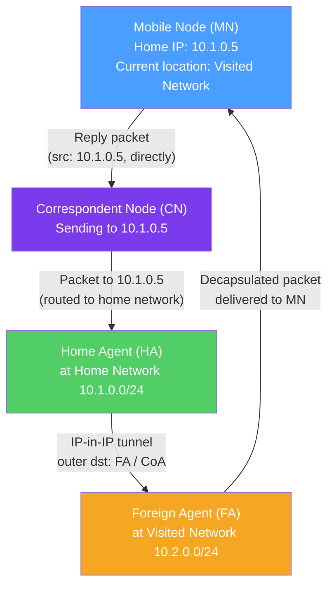

# 📡 Mobile IP

> [!abstract] TL;DR
> Mobile IP (MIP) solves the fundamental problem of IP mobility: IP addresses encode network location, so moving between networks requires a new IP — breaking all active TCP connections. **MIPv4** uses a Home Agent (HA) at the home network and Foreign Agent (FA) at the visited network; traffic is tunneled from HA to FA, and the mobile node retains its home IP. **MIPv6** eliminates the FA (IPv6's vast address space allows a Care-of Address from the visited network); **Proxy MIP (PMIP)** moves mobility management to the network, making the mobile node unaware of the process.

## Intuition — analogy FIRST

Your IP address is like your home mailing address — routers use it to decide where to deliver packets, much like postal codes route physical mail. When you travel to another city (move to a different network), your home address doesn't change, but you're no longer there to receive mail.

**Mobile IP** is like setting up mail forwarding: you tell your home post office (Home Agent) your current hotel address (Care-of Address). All mail addressed to you is still sent to your home; your home post office forwards it to your current location in a sealed envelope (IP-in-IP tunnel). When you write back, you can use your home address as the return address so correspondents can still reach you the same way.

**Route optimization** is like giving your current address directly to frequent correspondents so they don't have to go through your home post office every time — they mail directly to the hotel.

---

## How It Works



## Key Concepts / Details

### The IP Mobility Problem

Standard IP routing is **location-dependent**:
- An IP address like `192.168.1.50` means "host 50 on network 192.168.1.0/24."
- When a device moves to a different network (e.g., changes from home Wi-Fi to 4G), it must get a new IP address.
- Changing IP address breaks all active TCP connections (identified by 4-tuple including src/dst IP).
- Mobile IP preserves the home IP address while physically moving.

### MIPv4 (Mobile IPv4 — RFC 3344)

**Components:**

| Entity | Role |
|--------|------|
| **Mobile Node (MN)** | The moving device; retains its Home Address |
| **Home Agent (HA)** | Router on the home network; intercepts packets destined for MN |
| **Foreign Agent (FA)** | Router on the visited network; delivers tunneled packets to MN |
| **Home Address (HoA)** | MN's permanent IP (unchanged as MN moves) |
| **Care-of Address (CoA)** | IP address at the visited network (FA's IP or collocated CoA) |

**Registration process:**
1. MN arrives at visited network; receives FA's CoA via Agent Advertisements.
2. MN registers with HA: "I'm currently at CoA [FA's IP]."
3. HA creates a mobility binding: HoA → CoA (tunneling endpoint).

**Packet flow (triangle routing):**
```
CN → HA (packet to HoA):
  CN sends to MN's Home Address → routed to Home Network → intercepted by HA
  
HA → FA (tunneled):
  HA encapsulates in IP-in-IP: outer dst = CoA (FA)
  FA strips outer header; delivers inner packet to MN

MN → CN (direct):
  MN replies directly to CN (using CoA as src or Reverse Tunneling via HA)
```

**Disadvantage — triangle routing:** CN→HA→FA→MN path is longer than the direct CN→MN path, especially if CN and MN are on the same network.

**Collocated CoA:** Instead of using FA's IP, the MN obtains its own CoA (via DHCP on the visited network) and performs its own decapsulation — no FA required.

### Route Optimization (MIPv4)

To avoid triangle routing, the HA can notify the CN of the MN's CoA via a Binding Update:
- CN installs a binding cache entry: HoA → CoA.
- CN tunnels subsequent packets directly to the CoA, bypassing the HA.
- Reduces latency significantly for direct communication.

**Security concern:** Route optimization requires the CN to trust Binding Updates — exploitable if not secured with IPSEC Return Routability.

### MIPv6 (RFC 6275)

MIPv6 simplifies the architecture by eliminating the Foreign Agent:

**Key differences from MIPv4:**

| Feature | MIPv4 | MIPv6 |
|---------|-------|-------|
| Foreign Agent | Required | Not needed |
| Care-of Address | FA address or collocated | Stateless autoconfiguration or DHCPv6 |
| Route optimization | Optional (Binding Update to CN) | Built-in (default path) |
| Security | Optional | IPSec mandatory (Return Routability test) |
| Binding Update | Via HA | Directly to CN |

**MIPv6 packet flow:**
```
MN obtains CoA at visited network via SLAAC/DHCPv6
MN sends Binding Update (BU) to HA: "HoA → CoA"
MN sends BU to CNs directly

CN → MN: sends to HoA; if binding cache exists, routes to CoA with Type 2 Routing Header
MN → CN: sends with home address option (appears as HoA to CN)
```

### PMIP (Proxy Mobile IPv6 — RFC 5213)

PMIP moves mobility management from the device to the network — the device doesn't need a Mobile IP stack:

**Network-based mobility — no MIP required on the device:**

| Entity | Role |
|--------|------|
| **LMA (Local Mobility Anchor)** | Equivalent to Home Agent; allocates and anchors MN's IP |
| **MAG (Mobile Access Gateway)** | Equivalent to Foreign Agent; detects MN attachment; signals LMA |

**How PMIP works:**
1. MN attaches to network (e.g., connects to an AP/eNB).
2. MAG (edge router) detects MN (via MAC/IMSI), sends Proxy Binding Update to LMA.
3. LMA allocates/confirms MN's IP; creates binding; sets up GRE/IPv6 tunnel to MAG.
4. MN sees the same IP at every location (prefix delegation to MN is the same regardless of attachment point).

**PMIP in 4G LTE:**
- P-GW acts as LMA.
- S-GW acts as MAG.
- PMIP or GTP-based mobility used between eNB-S-GW and S-GW-P-GW.

### Handoff Types

| Type | Description | Latency |
|------|-------------|---------|
| **Hard handoff (break-before-make)** | Disconnects from old AP before connecting to new | ~100ms |
| **Soft handoff (make-before-break)** | Connected to both simultaneously during transition | ~10ms |
| **Fast handoff (IEEE 802.11r)** | Cached security keys for fast re-association (Wi-Fi) | ~50ms |
| **Seamless handoff** | No perceptible disruption; requires PMIP + MEC | <1ms |

**Layer 2 vs Layer 3 handoff:**
- **L2 handoff** — Moving between APs in the same subnet; IP doesn't change; PMIP/MAG handles.
- **L3 handoff** — Moving between subnets; requires Mobile IP or PMIP re-registration.

## Real-World Notes

- **4G/5G handover** — In LTE, handovers between eNBs are managed by the X2 interface (direct) or S1 interface (via MME). The UPF path is updated but the UE keeps its IP (PMIP or GTP handles it).
- **QUIC connection migration** — QUIC (HTTP/3) has built-in connection migration: if the device's IP changes (Wi-Fi to cellular), the QUIC connection can continue using the Connection ID without re-establishing. This is the application-layer solution to the same problem Mobile IP solves at L3.
- **WebRTC ICE** — Real-time communication (video calls) uses ICE (Interactive Connectivity Establishment) to establish peer connections despite NAT and IP changes — another application-layer mobility solution.

## Common Pitfalls

- Triangle routing in MIPv4 without route optimization — unnecessary latency; implement Binding Update support.
- PMIP without sufficient MAG-LMA tunnel capacity — creating many GRE tunnels from a single MAG to LMA can become a bottleneck.
- Assuming QUIC eliminates the need for Mobile IP — QUIC handles application-layer mobility but doesn't prevent the IP change at the network layer; Mobile IP/PMIP is still needed for seamless IP-level mobility.

## Related Concepts

- [[Cellular_4G_5G]] — PMIP and GTP are used in 4G/5G for UE mobility
- [[IP_Addressing_CIDR]] — Care-of addresses and home addresses are standard IP addresses
- [[Routing_Protocols]] — HA intercepts routes; Home Network must advertise the mobile node's subnet

## Review Questions

1. Explain the triangle routing problem in MIPv4. A mobile node is in New York (home in San Francisco), and its correspondent is in Boston. Describe the inefficient packet path without route optimization.
2. What is the key architectural difference between MIPv4 and MIPv6 that eliminates the need for a Foreign Agent in IPv6?
3. Explain Proxy Mobile IPv6. How is it transparent to the mobile device, and what network entities replace the Home Agent and Foreign Agent from standard MIPv4?

## Sources

- RFC 3344 — IP Mobility Support for IPv4 (MIPv4)
- RFC 6275 — Mobility Support in IPv6 (MIPv6)
- RFC 5213 — Proxy Mobile IPv6 (PMIPv6)

#networking #wireless-mobile #intermediate
