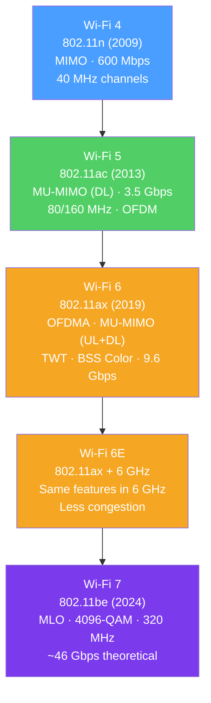

# 📶 Wi-Fi Standards 802.11

> [!abstract] TL;DR
> Wi-Fi (IEEE 802.11) provides wireless LAN connectivity using shared radio spectrum. **Wi-Fi 6 (802.11ax)** introduced **OFDMA** (subdividing channels into resource units for simultaneous multi-user transmission), **MU-MIMO** (spatial multiplexing to multiple users), **TWT** (Target Wake Time for IoT battery efficiency), and **BSS Coloring** (reducing unnecessary deferrals in dense environments). **Wi-Fi 6E** opens the 6 GHz band. **Wi-Fi 7 (802.11be)** adds Multi-Link Operation for simultaneous multi-band transmission. **WPA3** (SAE) replaces WPA2-PSK with forward-secret key exchange.

## Intuition — analogy FIRST

Early Wi-Fi (802.11a/b/g) was like a single-lane road: only one car (device) could use the highway at a time. If you had 50 cars (devices), they all had to take turns, causing congestion.

**OFDM in Wi-Fi 5** was like widening the road: the same number of cars, but each could go faster. But still, only one direction at a time.

**Wi-Fi 6's OFDMA** is like converting the road into a multi-lane highway where different sized vehicles (packets of different sizes) can occupy different lanes simultaneously. The access point schedules all transmissions precisely, like a traffic controller with a perfect view of all intersections.

**Wi-Fi 7's Multi-Link Operation** is like having three parallel highways (2.4, 5, and 6 GHz) that a single car can use simultaneously — the fastest available lanes at any moment.

---

## How It Works



## Key Concepts / Details

### Wi-Fi Standards Comparison

| Standard | Name | Year | Max Speed | Frequency | Key Feature |
|----------|------|------|-----------|-----------|-------------|
| 802.11b | Wi-Fi 1 | 1999 | 11 Mbps | 2.4 GHz | First mainstream Wi-Fi |
| 802.11a | Wi-Fi 2 | 1999 | 54 Mbps | 5 GHz | OFDM |
| 802.11g | Wi-Fi 3 | 2003 | 54 Mbps | 2.4 GHz | OFDM on 2.4 GHz |
| 802.11n | Wi-Fi 4 | 2009 | 600 Mbps | 2.4/5 GHz | MIMO, 40 MHz channels |
| 802.11ac | Wi-Fi 5 | 2013 | 3.5 Gbps | 5 GHz | MU-MIMO (DL only), 80/160 MHz |
| 802.11ax | Wi-Fi 6 | 2019 | 9.6 Gbps | 2.4/5 GHz | OFDMA, MU-MIMO UL+DL, TWT |
| 802.11ax | Wi-Fi 6E | 2020 | 9.6 Gbps | 6 GHz | 6 GHz band (1200 MHz spectrum) |
| 802.11be | Wi-Fi 7 | 2024 | ~46 Gbps | 2.4/5/6 GHz | MLO, 4096-QAM, 320 MHz |

### OFDMA (Orthogonal Frequency Division Multiple Access)

Wi-Fi 6's most significant innovation:

**OFDM (Wi-Fi 5 and earlier):** The entire channel bandwidth carries data for one device at a time. With 20 MHz channel = 64 subcarriers → all for one client per slot.

**OFDMA (Wi-Fi 6+):** The channel is divided into **Resource Units (RUs)** — groups of subcarriers — assigned to different clients simultaneously:

```
Wi-Fi 5 (OFDM): One transmission per time slot
[======================== Client A ========================] time→

Wi-Fi 6 (OFDMA): Multiple transmissions per time slot
[=== Client A ===][= Client B =][=== Client C ===][=Client D=] time→
   (large RU)        (26-sc RU)      (large RU)     (small RU)
```

**Resource Unit sizes:**
- 26 subcarriers (2 MHz equivalent) — smallest; for small frames (IoT, ACKs)
- 52 subcarriers (4 MHz)
- 106 subcarriers (8 MHz)
- 242 subcarriers (20 MHz equivalent)
- 484 subcarriers (40 MHz equivalent)
- 996 subcarriers (80 MHz equivalent)

**Key benefit:** In dense environments (stadium, office) where many devices send small frames (IoT sensors, ACKs), OFDMA eliminates per-device contention. The AP schedules many devices in a single PPDU (Physical Protocol Data Unit).

### MU-MIMO (Multi-User MIMO)

**MIMO** — Multiple-input, multiple-output: uses multiple antennas to send/receive multiple spatial streams simultaneously.

**MU-MIMO** — Spatial multiplexing to multiple clients simultaneously using beamforming:
- Wi-Fi 5: **DL only** MU-MIMO (4 spatial streams to 4 clients downlink)
- Wi-Fi 6: **UL + DL** MU-MIMO (8 spatial streams, uplink and downlink)

**Beamforming** — AP focuses the radio beam toward each client using phased antenna arrays, improving signal quality and reducing interference.

### Target Wake Time (TWT)

TWT allows the AP to schedule when IoT devices wake up and transmit:
- AP negotiates specific wake intervals with each device.
- Device sleeps for the rest of the time (deep sleep = microamps vs active = hundreds of milliamps).
- Result: **~7–10× battery life improvement** for IoT sensors vs Wi-Fi 5.
- Enables Wi-Fi 6 as a viable protocol for battery-powered sensors.

### BSS Coloring

Problem: In dense deployments, devices from neighboring Wi-Fi networks (different BSSIDs) cause unnecessary CSMA/CA deferrals ("I hear another transmission → must wait").

**BSS Color** — A 6-bit identifier in every packet marking which BSS (network) it belongs to:
- Devices only defer for packets with the **same BSS Color** as theirs.
- Overlapping networks with different colors can transmit simultaneously if RSSI is below a threshold.
- Dramatically reduces hidden-node interference in apartment buildings, conventions, stadiums.

### Frequency Bands and Channel Planning

| Band | Frequency | Non-overlapping Channels | Range | Throughput |
|------|-----------|--------------------------|-------|-----------|
| 2.4 GHz | 2.4–2.5 GHz | 3 (1, 6, 11) | ~150m (indoor) | Low (more interference) |
| 5 GHz | 5.1–5.9 GHz | 25+ (20 MHz) | ~80m (indoor) | High |
| 6 GHz | 5.925–7.125 GHz | 59 (20 MHz) / 7 (160 MHz) | ~40m (indoor) | Highest, cleanest |

**Channel bonding:** Combining adjacent 20 MHz channels for higher throughput:
- 40 MHz = 2 × 20 MHz
- 80 MHz = 4 × 20 MHz (Wi-Fi 5+)
- 160 MHz = 8 × 20 MHz (Wi-Fi 5/6)
- 320 MHz = 16 × 20 MHz (Wi-Fi 7 only)

**2.4 GHz channel planning:** Only channels 1, 6, and 11 are non-overlapping (at 20 MHz channel width). APs on adjacent channels will interfere.

### WPA3 and 802.1X Enterprise Auth

**WPA2 PSK weaknesses:**
- 4-way handshake is capturable and offline-brute-forceable.
- No forward secrecy (all sessions encrypted with same PSK).

**WPA3 improvements:**
- **SAE (Simultaneous Authentication of Equals)** — Replaces PSK 4-way handshake with Dragonfly key exchange (Diffie-Hellman-based). Each session uses a unique key — forward secret. Resistant to offline dictionary attacks.
- **OWE (Opportunistic Wireless Encryption)** — Encrypts open (no-password) Wi-Fi connections; protects against passive eavesdropping on hotspots.
- **192-bit security mode** — For government/enterprise; uses GCMP-256 and HMAC-SHA-384.

**802.1X Enterprise Authentication:**
- Devices must authenticate via **EAP (Extensible Authentication Protocol)** before joining the network.
- **RADIUS server** validates credentials (certificate-based EAP-TLS, or username/password EAP-PEAP/EAP-TTLS).
- Each device gets a unique session key — no shared PSK.
- Provides centralized authentication, per-user VLAN assignment, and audit logging.

### Wi-Fi 7 Key Features

| Feature | Description |
|---------|-------------|
| **MLO (Multi-Link Operation)** | Single client uses 2+ bands simultaneously (e.g., 5 + 6 GHz) |
| **4096-QAM** | 12 bits/symbol vs 10 bits/symbol (Wi-Fi 6) — 20% more throughput |
| **320 MHz channels** | Double Wi-Fi 6's 160 MHz max in 6 GHz |
| **Multi-RU** | Client can be assigned multiple RUs across the channel |
| **Punctured channel** | Operate with interference in part of channel (use rest) |

## Real-World Notes

- **Site survey essentials:** RSSI (signal strength, dBm — higher is better, e.g., -65 dBm), SNR (signal-to-noise ratio — higher is better, 20+ dB), noise floor (environmental noise level, dBm — lower is better). Use Ekahau or NetAlly for professional surveys.
- **Roaming (802.11r, k, v):** 802.11r (Fast BSS Transition) reduces re-association time from ~100ms to ~50ms; 802.11k (neighbor reports) helps client select the best AP; 802.11v (BSS Transition Management) allows AP to suggest roaming.

## Common Pitfalls

- Using only channels 1, 6, 11 at 2.4 GHz but deploying APs too close together (co-channel interference is worse than adjacent-channel on nearby APs).
- Enabling 160 MHz channels in a busy 5 GHz environment — 160 MHz channels are hard to allocate without overlap in the 5 GHz band.
- Using WPA2-PSK with a simple password in enterprise settings — brute-forceable; use 802.1X/WPA3.
- Forgetting TWT requires AP and client support — older IoT devices won't benefit.

## Related Concepts

- [[Physical_Layer]] — Wi-Fi is L1/L2 wireless technology
- [[Bluetooth_and_BLE]] — Complementary short-range wireless for personal area networks
- [[IoT_Protocols]] — Wi-Fi 6 TWT enables IoT; LoRaWAN for longer range

## Review Questions

1. Explain how OFDMA in Wi-Fi 6 improves performance in a stadium with 500 connected devices compared to the OFDM used in Wi-Fi 5.
2. What is BSS Coloring, and how does it reduce the impact of co-channel interference in dense apartment buildings?
3. Compare WPA2-PSK and WPA3-SAE. What specific attack does SAE prevent that PSK is vulnerable to?

## Sources

- IEEE 802.11ax — High Efficiency WLAN Amendment
- Wi-Fi Alliance, "Wi-Fi 6 Technology Overview" — https://www.wi-fi.org
- Gast, Matthew S., *802.11ac: A Survival Guide*

#networking #wireless-mobile #intermediate
