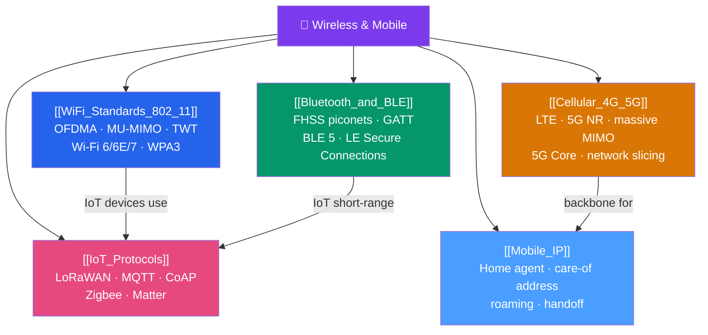

# 🗺️ Wireless & Mobile — Map of Content

> [!abstract] What This Section Covers
> Wireless networking trades the physical cable for a shared, noisy, interference-prone medium. This section covers the full wireless landscape: **Wi-Fi 6/6E/7 (802.11ax/be)** (OFDMA, MU-MIMO, TWT, BSS Coloring, WPA3), **Bluetooth and BLE** (FHSS piconets, GATT hierarchy, BLE 5 features, LE Secure Connections), **Cellular 4G/5G** (LTE architecture, 5G NR spectrum, massive MIMO, 5G Core service-based architecture, network slicing), **Mobile IP** (home agent, foreign agent, care-of address, route optimization), and **IoT Protocols** (LoRaWAN, MQTT, CoAP, Zigbee, Matter). Each family trades throughput, range, power, and latency differently.

## Concept Map

## Learning Path

1. [[WiFi_Standards_802_11]] — The dominant local wireless standard; OFDMA and MU-MIMO are essential for modern dense environments.
2. [[Bluetooth_and_BLE]] — Short-range personal area networking; BLE is ubiquitous in IoT and wearables.
3. [[Cellular_4G_5G]] — Wide-area mobile connectivity; 5G architecture and network slicing are increasingly important.
4. [[Mobile_IP]] — How IP routing handles mobile devices that change networks.
5. [[IoT_Protocols]] — LPWAN and lightweight messaging protocols for constrained devices.

## All Notes at a Glance

| Note | Difficulty | What You'll Learn |
|------|------------|-------------------|
| [[WiFi_Standards_802_11]] | Intermediate | OFDMA, MU-MIMO, TWT, BSS Coloring, Wi-Fi 6E/7, WPA3/SAE, 802.1X/RADIUS |
| [[Bluetooth_and_BLE]] | Intermediate | BR/EDR FHSS piconets, BLE GATT hierarchy, 40-channel advertising, BLE 5 PHY modes, pairing |
| [[Cellular_4G_5G]] | Advanced | LTE eNodeB/EPC, 5G NR FR1/FR2, massive MIMO, 5G Core SBA (AMF/SMF/UPF), network slicing |
| [[Mobile_IP]] | Intermediate | Home agent, foreign agent, care-of address, tunneling, route optimization, PMIP |
| [[IoT_Protocols]] | Intermediate | LoRa chirp-spread-spectrum, LoRaWAN MAC, MQTT QoS/LWT, CoAP observe, Zigbee, Matter |

## Key Questions This Section Answers

- How does OFDMA in Wi-Fi 6 differ from the OFDM in Wi-Fi 5, and why does it improve dense deployments?
- What is the difference between 2.4 GHz, 5 GHz, and 6 GHz Wi-Fi bands in terms of range, interference, and throughput?
- How does BLE's GATT service/characteristic/descriptor hierarchy work?
- What is the difference between 5G FR1 (sub-6 GHz) and FR2 (mmWave) in terms of coverage and throughput?
- How does a 5G network slice work, and what are the three standard slice types?
- How does LoRaWAN's spreading factor trade data rate for range?
- What is MQTT's QoS 0/1/2 system, and when should you use each?

## Related Sections

- [[_MOC_Networking_Master|↑ Networking Master MOC]]
- [[_MOC_TCPIP_Protocols|← TCP/IP Protocols]]
- [[_MOC_Network_Security|← Network Security]]
- [[_MOC_SDN_Cloud_Networking|→ SDN & Cloud Networking]]

#MOC #Networking #Wireless
