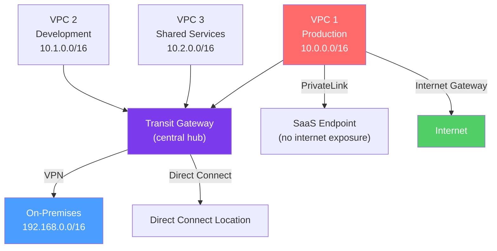

# ☁️ Cloud Networking — AWS, GCP, and Azure

> [!abstract] TL;DR
> Cloud networking implements traditional network concepts as software-defined services. **AWS VPC** (Virtual Private Cloud) provides isolated L3 networks with per-subnet route tables, security groups, and NACLs. **Transit Gateway** enables hub-and-spoke multi-VPC connectivity. **PrivateLink** provides private access to SaaS endpoints. **GCP's global VPC** spans all regions on Google's private network. **Azure VNet** uses peering and Virtual WAN. The key across all clouds: plan non-overlapping RFC 1918 address space before provisioning, because CIDR overlaps make VPC peering and VPN connections fail silently.

## Intuition — analogy FIRST

A VPC is like leasing a private floor of a building that only your company occupies. You can lay out the interior however you want (subnets), control who can enter (security groups / NACLs), and decide which doors connect to the outside world (Internet Gateway) or to a service elevator only employees use (NAT Gateway / PrivateLink).

**VPC Peering** is like cutting a hole through the wall to an adjacent company's floor — you're directly connected, but it's a fixed 1:1 connection, and you can't use the other company's floor to reach a third floor (non-transitive).

**Transit Gateway** is like building a central lobby that all floors connect to — everyone can reach everyone through the common lobby, and the lobby (TGW route table) controls who can talk to whom.

**PrivateLink** is like having a waiter from another restaurant slide dishes through a slot in the wall — the food arrives, but you never enter their kitchen, they never enter yours, and the connection can't be used to reach other places.

---

## How It Works



## Key Concepts / Details

### AWS VPC Architecture

**VPC (Virtual Private Cloud):**
- A logically isolated virtual network within an AWS region.
- CIDR block: /16 to /28 (e.g., 10.0.0.0/16 = 65,536 addresses).
- Spans all Availability Zones in the region.

**Subnets:**
- AZ-specific (one subnet → one AZ; can have multiple subnets per AZ).
- **Public subnet:** Route table has a route to the Internet Gateway (IGW).
- **Private subnet:** No IGW route; outbound internet via NAT Gateway in a public subnet.
- AWS reserves 5 IP addresses per subnet (network, router, DNS, future, broadcast).

**Route Tables:**
```
# Public subnet route table:
Destination        Target
10.0.0.0/16       local          ← VPC-internal
0.0.0.0/0         igw-xxxxx      ← Internet Gateway (all traffic to internet)

# Private subnet route table:
Destination        Target
10.0.0.0/16       local
0.0.0.0/0         nat-xxxxx      ← NAT Gateway (outbound only)
```

**Internet Connectivity Options:**

| Gateway | Direction | Purpose |
|---------|-----------|---------|
| **Internet Gateway (IGW)** | Bidirectional | Public subnet → internet; public IPs required |
| **NAT Gateway** | Outbound only | Private subnet → internet; source NAT to Elastic IP |
| **Egress-Only IGW** | Outbound IPv6 only | Private IPv6 subnets → internet |
| **VPN Gateway (VGW)** | Bidirectional | VPC ↔ on-premises via IPSec |

**Security Controls:**

| Control | Level | State | Rules |
|---------|-------|-------|-------|
| **Security Group** | Instance/ENI | Stateful | Allow-only (no explicit deny) |
| **NACL (Network ACL)** | Subnet | Stateless | Allow + Deny; numbered rules, lowest first |

Security groups are stateful (return traffic automatic); NACLs are stateless (must allow both directions).

### AWS VPC Connectivity

**VPC Peering:**
- Direct L3 connection between two VPCs (same or different accounts/regions).
- **Non-transitive:** VPC A peered with B, B peered with C → A cannot reach C through B.
- Requires non-overlapping CIDRs.
- No bandwidth limits; no additional hop latency.
- Best for: small number of VPCs (< 10). Doesn't scale to many VPCs.

**Transit Gateway (TGW):**
- Hub-and-spoke model: all VPCs and on-premises connections attach to a central TGW.
- **Transitive routing:** Traffic flows between any two attachments via the TGW.
- **Route tables per attachment:** Fine-grained segmentation (prod and dev VPCs on separate TGW route tables can't reach each other).
- Supports: VPC attachments, VPN connections, Direct Connect Gateway, SD-WAN peering.
- Multi-region: Inter-region TGW peering for global hub-and-spoke.
- Cost: Per attachment-hour + per-GB data processing.

**AWS PrivateLink:**
- Expose a service (your own or AWS service) as a private endpoint in consumer VPCs.
- Uses **Interface Endpoint** (ENI with private IP in consumer subnet) connected via **NLB** in the provider VPC.
- Consumer never has direct network access to provider's VPC — traffic flows through AWS fabric.
- **Gateway Endpoint:** Free version for S3 and DynamoDB (route table entry, not ENI).

**AWS Direct Connect:**
- Dedicated physical connection (1/10/100 Gbps) from data center to AWS.
- More consistent bandwidth and lower latency than VPN over internet.
- **Private VIF:** Access VPC resources.
- **Transit VIF:** Connect to Transit Gateway.

### AWS Subnet Design Best Practices

```
VPC: 10.0.0.0/16 (65,536 addresses)
├── Public subnets (per AZ): /24 each
│   ├── 10.0.0.0/24 (us-east-1a) — ELB, NAT GW, Bastion
│   ├── 10.0.1.0/24 (us-east-1b) — ELB, NAT GW
│   └── 10.0.2.0/24 (us-east-1c)
├── Private App subnets (per AZ): /22 each (1022 hosts)
│   ├── 10.0.4.0/22 (us-east-1a) — EC2 App servers
│   ├── 10.0.8.0/22 (us-east-1b)
│   └── 10.0.12.0/22 (us-east-1c)
└── Private DB subnets (per AZ): /24 each
    ├── 10.0.16.0/24 (us-east-1a) — RDS, ElastiCache
    ├── 10.0.17.0/24 (us-east-1b)
    └── 10.0.18.0/24 (us-east-1c)
```

### GCP Cloud Networking

**GCP VPC (Global, not regional):**
- Unlike AWS (regional VPC), GCP VPC spans all global regions.
- **Subnets are regional** (not zonal); can span multiple zones in a region.
- Routes are global by default — a VM in us-central1 can reach a VM in europe-west1 over Google's private backbone without going through the public internet.
- **VPC Firewall Rules:** Global, applied to all subnets unless targeted by tags/service accounts.

**GCP connectivity:**
- **VPC Network Peering:** Like AWS VPC peering; non-transitive.
- **Shared VPC:** A host project's VPC is shared with service projects — centralized network management for organizations.
- **Private Service Connect (PSC):** GCP equivalent of AWS PrivateLink.
- **Cloud Interconnect:** Dedicated (10G/100G) or Partner (1–50G) physical connections.

**GCP Private Google Access:** VMs without external IPs can access Google APIs (Cloud Storage, BigQuery) through the VPC without NAT.

### Azure VNet Networking

**Azure VNet (Virtual Network):**
- Regional (not global like GCP).
- CIDR: /8 to /29.
- **Subnets:** Not AZ-specific; availability defined per-resource.
- **NSG (Network Security Group):** Stateful; attached to subnets or NICs.
- **UDR (User-Defined Route):** Override default routes; force traffic through NVA (Network Virtual Appliance).

**Azure connectivity:**
- **VNet Peering:** Non-transitive; global (cross-region) peering supported.
- **Azure Virtual WAN (vWAN):** Hub-and-spoke like AWS TGW; managed hub with routing automation.
- **ExpressRoute:** Dedicated connection to Azure (equivalent of AWS Direct Connect).
- **Private Link / Private Endpoint:** NIC with private IP in VNet for PaaS services (Azure SQL, Storage, etc.).
- **Azure Firewall:** Cloud-native managed firewall; routes all traffic through it via UDR.

### Multi-Cloud and Hybrid Networking

| Connectivity | AWS | GCP | Azure |
|-------------|-----|-----|-------|
| Direct physical | Direct Connect | Cloud Interconnect | ExpressRoute |
| Site-to-site VPN | AWS VPN (IKEv2) | Cloud VPN | Azure VPN Gateway |
| SD-WAN integration | Transit Gateway | Cloud SD-WAN | Virtual WAN |
| Inter-cloud peering | Third-party (Megaport, Equinix) | Same | Same |

## Real-World Notes

- **CIDR planning is critical:** VPC peering and TGW connections require non-overlapping CIDRs. Plan the entire enterprise IP scheme (on-premises + all VPCs) before provisioning. The `10.0.0.0/8` space (16M IPs) is commonly used: divide into `/16` VPCs (65K IPs each → 256 VPCs max).
- **PrivateLink for SaaS isolation:** Using PrivateLink means the SaaS provider cannot initiate connections to your network, traffic never traverses the internet, and you don't need to whitelist CIDRs (just the endpoint).
- **Network Firewall (AWS):** For stateful, deep-packet inspection at VPC perimeter, AWS Network Firewall (managed Suricata) is deployed in a central inspection VPC with TGW routing.

## Common Pitfalls

- Non-overlapping CIDR oversight — provisioning VPCs with `10.0.0.0/16` and `10.0.1.0/16` (these overlap if peering — the second must be at least `10.1.0.0/16`).
- Security group vs NACL confusion — NACL is stateless (must allow both directions for TCP); Security Group is stateful (only need to allow one direction).
- Missing "DNS resolution" flag for VPC peering — by default, private DNS names of VMs in the peered VPC don't resolve. Enable `allowDnsResolutionFromRemoteVpc`.
- Asymmetric routing with NACLs — NACL rule 100 allows inbound TCP 443, but rule 200 denies outbound 443; return traffic hits rule 200 (lower number first) and is denied.

## Related Concepts

- [[IP_Addressing_CIDR]] — CIDR planning is the foundation of VPC design
- [[Software_Defined_Networking]] — Cloud VPCs are SDN implementations
- [[Routing_Protocols]] — BGP used at VPN/Direct Connect attachment points
- [[Service_Mesh]] — Runs on top of cloud networking

## Review Questions

1. Explain the difference between AWS VPC Peering and Transit Gateway. When would you choose each, and why is VPC peering non-transitive?
2. A private subnet's EC2 instance needs to download packages from the internet but should not be reachable from the internet. Draw the route table and the required gateway component.
3. You need to ensure that traffic between your VPC and an AWS service (like S3) never traverses the public internet. What two AWS mechanisms support this, and when would you use each?

## Sources

- AWS Documentation — Amazon VPC User Guide
- GCP Documentation — VPC Network Overview
- Azure Documentation — Azure Virtual Network concepts
- AWS re:Invent 2022 — Transit Gateway Design Patterns

#networking #sdn-cloud #advanced
