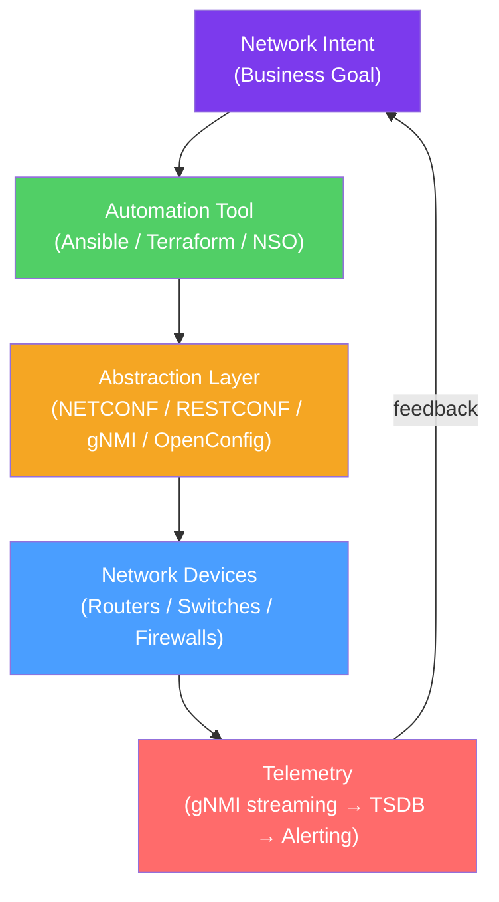

# ⚙️ Network Automation

> [!abstract] TL;DR
> Network automation replaces manual CLI-based device configuration with programmatic, repeatable, and version-controlled infrastructure-as-code. Key tools: **Ansible** (agentless, YAML playbooks, network modules for IOS/NXOS/EOS), **Terraform** (declarative, cloud network resources, state management), **NETCONF/YANG** (RFC 6241/6020 — structured configuration via XML/RESTCONF/JSON with device-defined data models), **gNMI** (gRPC-based streaming telemetry and configuration), and **Intent-Based Networking (IBN)** (Cisco DNA Center, Apstra — translate business intent to device configuration automatically).

## Intuition — analogy FIRST

Manual network configuration is like managing a 500-person company's HR records with handwritten paper forms — each change must be physically made on each person's file, mistakes are easy, consistency is impossible, and there's no way to quickly roll back.

**Ansible** is like having HR templates: you fill out a standard form once ("all employees in the engineering department need policy A applied"), and a runner delivers it to every matching person's file simultaneously. If you need to change it, update the template and run it again.

**Terraform** is like having an architect's blueprint for the whole building. The architect describes the desired state (number of rooms, doors, windows) and Terraform compares it to the current building, calculates the minimum changes needed, and applies exactly those changes — no more, no less.

**NETCONF/YANG** is like having a standardized HR form format that all companies worldwide agree on — so any HR software can read and fill any company's forms without translation.

**Intent-Based Networking** is like telling the architect "we need to expand engineering by 50 people" and having the architect automatically design the new rooms and schedule the construction — you state the business goal, not the implementation details.

---

## How It Works



## Key Concepts / Details

### Ansible for Network Automation

Ansible (Red Hat) is an **agentless, SSH-based** automation tool — no agent software required on managed devices:

**Architecture:**
- **Control Node:** Where Ansible runs (engineer's laptop or CI/CD server)
- **Managed Nodes:** Network devices (SSH-capable: Cisco IOS, Arista EOS, Juniper JunOS, Palo Alto)
- **Inventory:** YAML or INI file listing devices and connection info
- **Playbook:** YAML file defining tasks to run
- **Modules:** Python code implementing specific tasks (ios_config, eos_config, nxos_config)

**Ansible inventory:**
```yaml
# inventory.yml
all:
  children:
    core_switches:
      hosts:
        sw-core-01:
          ansible_host: 10.1.1.1
          ansible_network_os: cisco.ios.ios
          ansible_user: admin
          ansible_ssh_pass: "{{ vault_password }}"
    distribution_switches:
      hosts:
        sw-dist-01:
          ansible_host: 10.1.1.10
```

**Ansible network playbook:**
```yaml
# configure_vlans.yml
---
- name: Configure VLANs on all core switches
  hosts: core_switches
  gather_facts: false
  
  tasks:
    - name: Configure VLAN 100
      cisco.ios.ios_vlans:
        config:
          - vlan_id: 100
            name: Engineering
          - vlan_id: 200
            name: HR
        state: merged     # Only add; don't remove existing VLANs
    
    - name: Save configuration
      cisco.ios.ios_config:
        save_when: modified
    
    - name: Verify VLAN exists
      cisco.ios.ios_vlans:
        state: gathered
      register: vlans_output
    
    - name: Assert VLAN 100 is present
      assert:
        that:
          - vlans_output.gathered | selectattr('vlan_id', 'equalto', 100) | list | length > 0
```

**Idempotency:** Ansible network modules support `state: merged/replaced/overridden/deleted` to ensure only the desired changes are applied — running twice doesn't break anything.

### Terraform for Cloud Networking

Terraform (HashiCorp) is a **declarative infrastructure-as-code** tool for provisioning cloud resources:

**Workflow:**
```
Write HCL → terraform init → terraform plan → terraform apply → terraform destroy
```

**AWS VPC with Terraform:**
```hcl
# main.tf
provider "aws" {
  region = "us-east-1"
}

resource "aws_vpc" "main" {
  cidr_block           = "10.0.0.0/16"
  enable_dns_hostnames = true
  tags = { Name = "production-vpc" }
}

resource "aws_subnet" "public" {
  for_each = {
    "us-east-1a" = "10.0.1.0/24"
    "us-east-1b" = "10.0.2.0/24"
  }
  vpc_id            = aws_vpc.main.id
  cidr_block        = each.value
  availability_zone = each.key
  map_public_ip_on_launch = true
}

resource "aws_internet_gateway" "main" {
  vpc_id = aws_vpc.main.id
}

resource "aws_route_table" "public" {
  vpc_id = aws_vpc.main.id
  route {
    cidr_block = "0.0.0.0/0"
    gateway_id = aws_internet_gateway.main.id
  }
}
```

**Terraform state:** Terraform tracks actual cloud state in a `.tfstate` file (or remote state in S3/Terraform Cloud). The plan computes `desired state - current state = delta` and applies only the delta.

**Key difference from Ansible:** Terraform manages **state**; Ansible runs **tasks**. Terraform is better for immutable infrastructure; Ansible is better for configuration management.

### NETCONF and YANG

**NETCONF (RFC 6241):** A protocol for configuring and retrieving network device state:
- **Transport:** SSH (port 830), TLS (port 6513)
- **Data format:** XML
- **Operations:** `<get-config>`, `<edit-config>`, `<commit>`, `<lock>`, `<unlock>`, `<validate>`
- **Datastores:** running (active config), candidate (staged changes), startup (saved config)

**NETCONF session example:**
```xml
<!-- Client request: get all interfaces -->
<rpc message-id="1" xmlns="urn:ietf:params:xml:ns:netconf:base:1.0">
  <get-config>
    <source><running/></source>
    <filter type="subtree">
      <interfaces xmlns="urn:ietf:params:xml:ns:yang:ietf-interfaces"/>
    </filter>
  </get-config>
</rpc>

<!-- Device response -->
<rpc-reply message-id="1" xmlns="urn:ietf:params:xml:ns:netconf:base:1.0">
  <data>
    <interfaces xmlns="urn:ietf:params:xml:ns:yang:ietf-interfaces">
      <interface>
        <name>GigabitEthernet0/0/0</name>
        <type xmlns:ianaift="urn:ietf:params:xml:ns:yang:iana-if-type">
          ianaift:ethernetCsmacd
        </type>
        <enabled>true</enabled>
        <ipv4>
          <address>
            <ip>10.0.0.1</ip>
            <prefix-length>24</prefix-length>
          </address>
        </ipv4>
      </interface>
    </interfaces>
  </data>
</rpc-reply>
```

**YANG (Yet Another Next Generation — RFC 6020/7950):** A data modeling language that defines the structure, types, and constraints of configuration and operational data:

```yang
module ietf-interfaces {
  namespace "urn:ietf:params:xml:ns:yang:ietf-interfaces";
  prefix "if";
  
  container interfaces {
    list interface {
      key "name";
      leaf name {
        type string;
        description "Device interface name";
      }
      leaf enabled {
        type boolean;
        default "true";
      }
    }
  }
}
```

**RESTCONF (RFC 8040):** HTTP+JSON alternative to NETCONF; uses REST semantics (GET/PUT/POST/DELETE/PATCH) with YANG data models encoded in JSON.

### gNMI (gRPC Network Management Interface)

gNMI (OpenConfig) uses **gRPC + Protocol Buffers** for high-performance configuration and **streaming telemetry**:

**gNMI operations:**

| RPC | Purpose |
|-----|---------|
| `Get` | Retrieve current state (one-shot) |
| `Set` | Modify configuration |
| `Subscribe` | Streaming telemetry (SAMPLE, ON_CHANGE, TARGET_DEFINED) |
| `Capabilities` | Discover what the device supports |

**gNMI streaming telemetry:**
```
Device → gNMI Subscribe → Telemetry Collector (gnmic) → Prometheus → Grafana

Subscribe modes:
  SAMPLE: Push metrics every 10s regardless of change
  ON_CHANGE: Push only when value changes (events)
  TARGET_DEFINED: Device decides
```

**OpenConfig YANG models:** Vendor-neutral YANG models (openconfig-interfaces, openconfig-bgp, openconfig-routing-policy) enabling multi-vendor automation without vendor-specific modules.

### Intent-Based Networking (IBN)

IBN translates **high-level business intent** into low-level device configuration automatically:

**IBN components:**
1. **Translation layer:** Maps intent to device-level policies (using templates, ML, or rules engines)
2. **Activation layer:** Pushes configuration to devices (NETCONF/REST/CLI)
3. **Assurance layer:** Continuously validates actual network state matches intent; alerts on deviation

**Cisco DNA Center IBN:**
- Engineer declares: "All users in VLAN 100 should have access to the internet but not to HR servers."
- DNA Center translates this to ACLs/QoS/VXLAN policy across all switches.
- DNA Center continuously monitors and remediates drift.

**Apstra (Juniper):** Intent-based fabric automation for data center networking:
- Define: device roles, interconnections, IP pools, routing protocols.
- Apstra generates and pushes device configurations.
- Continuously validates graph state; alerts on deviations.

### GitOps for Network Configuration

**Network-as-Code / GitOps pattern:**
```
Engineer writes Ansible playbook / Terraform HCL
  → Git commit → pull request → code review
  → CI pipeline:
      - Lint (ansible-lint, terraform validate)
      - Dry-run (ansible --check, terraform plan)
      - Integration tests (containerlab, GNS3)
  → Merge → CD pipeline applies changes to devices
  → GitOps controller detects drift and remediates
```

Tools: **Containerlab** (spin up network topologies in containers for testing), **Batfish** (network configuration analysis and verification without physical hardware).

## Real-World Notes

- **Ansible Collections for networking:** `cisco.ios`, `arista.eos`, `junipernetworks.junos`, `ansible.netcommon`. Use `ansible-galaxy collection install`.
- **Terraform state locking:** When multiple engineers run Terraform simultaneously, state locking (S3 + DynamoDB for AWS) prevents concurrent state corruption.
- **gNMI rate limits:** Streaming telemetry at 1-second intervals from 1,000 devices generates significant traffic — plan collector capacity (gnmic, Telegraf, OpenTelemetry Collector).

## Common Pitfalls

- Not using Ansible Vault for credentials — storing plaintext passwords in playbooks is a security risk; use `ansible-vault encrypt_string`.
- Terraform state drift — manual changes outside Terraform cause plan to show unexpected changes; avoid CLI modifications on Terraform-managed resources.
- NETCONF without locking — concurrent edits without `<lock>` can corrupt device configuration; always lock the candidate datastore before editing.
- Intent without assurance — defining intent but not continuously validating actual state means drift goes undetected; assurance is as important as activation.

## Related Concepts

- [[Software_Defined_Networking]] — SDN provides the programmable interfaces that network automation uses
- [[Cloud_Networking_AWS_Azure]] — Terraform is the primary tool for cloud network provisioning
- [[Routing_Protocols]] — OSPF, BGP configuration is a primary use case for NETCONF/Ansible

## Review Questions

1. Explain the difference between Ansible and Terraform for network configuration management. Give a scenario where you would use each, and explain why the other would be a poor choice.
2. Describe the NETCONF candidate datastore workflow. Why is it better than editing the running configuration directly, and what happens during a `<commit>` operation?
3. What is gNMI Subscribe mode ON_CHANGE, and how does it differ from SAMPLE mode? Give a use case where ON_CHANGE is preferable to 10-second SAMPLE telemetry.

## Sources

- RFC 6241 — Network Configuration Protocol (NETCONF)
- RFC 6020 — YANG — A Data Modeling Language for NETCONF
- RFC 8040 — RESTCONF Protocol
- OpenConfig Working Group — https://www.openconfig.net
- Ansible Network Documentation — https://docs.ansible.com/ansible/latest/network

#networking #sdn-cloud #advanced
