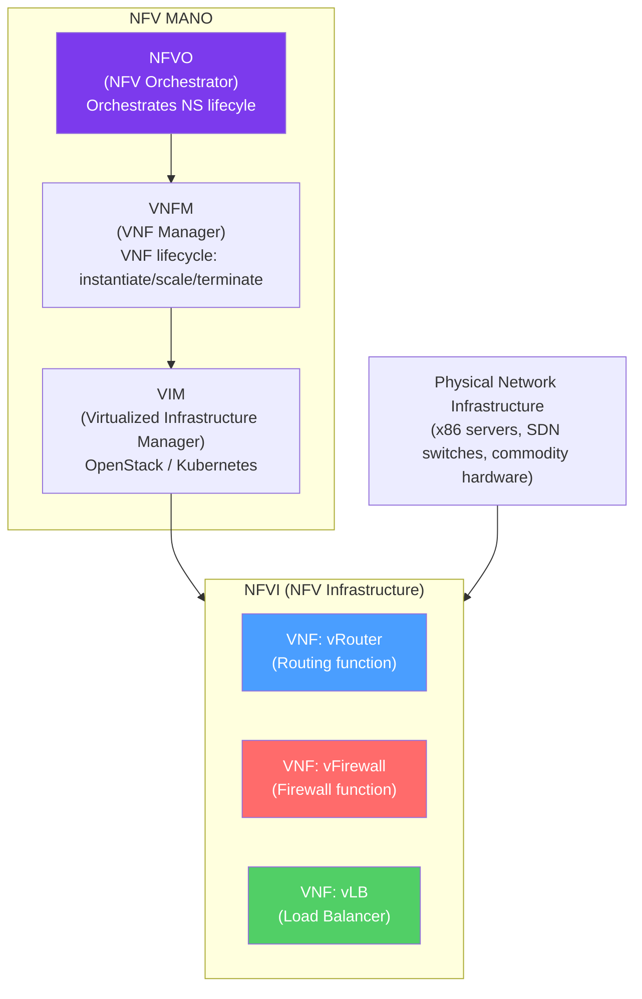

# 📦 Network Function Virtualization

> [!abstract] TL;DR
> NFV (Network Function Virtualization) moves network functions traditionally implemented in dedicated hardware appliances (routers, firewalls, load balancers, DPI engines) into software running on commodity x86 servers. A **VNF (Virtual Network Function)** is the software equivalent of a hardware appliance. **ETSI NFV MANO** (Management and Orchestration) provides the orchestration framework (NFV Orchestrator, VNF Manager, VIM). **Service Function Chaining (SFC)** orders VNFs in a pipeline; **NSH (Network Service Header)** carries metadata through the chain. NFV enables elastic scaling, faster deployment, and cost reduction.

## Intuition — analogy FIRST

Traditional networking is like a factory with specialized, purpose-built machines bolted to the floor — a router-machine, a firewall-machine, a load-balancer-machine. Each is expensive, takes months to procure, can't be moved or resized, and does exactly one job.

**NFV** is like replacing those bolted machines with software applications running on generic computing platforms (like running Word and Excel on the same laptop instead of buying a "word processor machine" and a "spreadsheet machine"). The same x86 servers can run any network function — a firewall today, a load balancer tomorrow. Scale up by adding more instances; scale down by removing them. Deploy in minutes via software provisioning, not months of hardware procurement.

**Service Function Chaining** is like a conveyor belt through the factory: packets enter at one end, get processed by each function in order (firewall → DPI → load balancer → NAT), and exit at the other end.

---

## How It Works



## Key Concepts / Details

### NFV vs Traditional Network Hardware

| Aspect | Traditional PNF (Physical Network Function) | VNF (Virtual Network Function) |
|--------|-------------------------------------------|--------------------------------|
| Hardware | Purpose-built ASIC appliance | Commodity x86/ARM server |
| Deployment | Weeks/months (procure, ship, rack) | Minutes (VM/container instantiation) |
| Scaling | Manual hardware addition | Horizontal auto-scaling |
| Cost | High CapEx, low OpEx | Low CapEx, higher OpEx (but total lower) |
| Flexibility | Single function per device | Multiple VNFs on same server |
| Upgrades | Hardware replacement | Software version update |
| Performance | Line-rate (specialized ASIC) | Near line-rate with DPDK/SmartNIC |

### ETSI NFV Architecture

ETSI (European Telecommunications Standards Institute) defined the NFV reference architecture:

**Three main layers:**

1. **NFVI (NFV Infrastructure)** — The physical and virtual resources:
   - **Hardware resources:** x86 servers, SDN switches, storage
   - **Virtualization layer:** Hypervisor (KVM, VMware) or container runtime (Docker, containerd)
   - **Virtual resources:** VMs, containers, virtual networks (vSwitch, OVS)

2. **VNFs (Virtual Network Functions)** — Software implementations:
   - vRouter (Cisco CSR, Juniper vMX, FRR)
   - vFirewall (Fortinet FortiGate-VM, Palo Alto VM-Series)
   - vLoadBalancer (HAProxy, NGINX, F5 BIG-IP VE)
   - vDPI (Deep Packet Inspection)
   - vCDN, vEPC (virtualized LTE core), vIMS

3. **NFV MANO (Management and Orchestration):**

| Component | Abbreviation | Role |
|-----------|-------------|------|
| **NFV Orchestrator** | NFVO | Orchestrates network services (NS); manages VNFM and VIM |
| **VNF Manager** | VNFM | Manages VNF lifecycle: instantiate, configure, scale, update, terminate |
| **Virtualized Infrastructure Manager** | VIM | Manages the underlying compute/network/storage resources (OpenStack, Kubernetes) |
| **OSS/BSS** | — | Operations/Business Support Systems; existing telecom management systems |

**Network Service (NS):** A composition of VNFs connected in a graph, defining how traffic flows through them.

**VNF Package:** A software artifact containing: VNF Descriptor (VNFD), disk images, configuration scripts, monitoring scripts.

### Service Function Chaining (SFC)

SFC (RFC 7665) defines ordered sequences of service functions that packets must traverse:

```
Traffic flow:
  Client → [vFW] → [vDPI] → [vLB] → Server

Service Function Chain:
  SF1 (vFirewall) → SF2 (DPI Engine) → SF3 (Load Balancer)
```

**NSH (Network Service Header — RFC 8300):**
NSH is an encapsulation header carrying metadata through the SFC:

```
NSH Header:
  Base Header (4B): Version, OAM, TTL, Length
  Service Path Header (4B): Service Path Identifier (SPI) + Service Index (SI)
  Context Headers (variable): Metadata (tenant ID, traffic classification, etc.)

SPI = which service chain to follow
SI = which step in the chain we're at (decremented by each SF)
```

**SFC components:**
- **SFC Classifier** — Attaches NSH to matching traffic; determines which SFC to apply
- **SFF (Service Function Forwarder)** — Switches packets between SFs based on NSH
- **SF (Service Function)** — The actual VNF processing the packet

### VNF Scaling Patterns

**Horizontal scaling (scale out/in):**
```
Load increases → NFVO instructs VNFM → VNFM instantiates additional VNF instance
Load decreases → NFVO → VNFM terminates excess instances

Example: 
  vLB cluster: 2 instances → 4 instances (during traffic spike)
```

**Vertical scaling (scale up/down):**
```
VNF allocated more CPU/RAM/NIC bandwidth
Less disruptive than horizontal in some cases but limited by server capacity
```

**Affinity/anti-affinity rules:**
- Affinity: Co-locate VNFs that communicate frequently (reduces latency)
- Anti-affinity: Spread VNF instances across physical servers (fault tolerance)

### CNF (Cloud-Native Network Functions)

CNFs modernize VNFs by replacing VM-based deployment with containers/Kubernetes:

| Aspect | VNF (VM-based) | CNF (Container/Kubernetes) |
|--------|----------------|---------------------------|
| Deployment | OpenStack VM | Kubernetes Pod |
| Startup time | Minutes | Seconds |
| Density | 10–20 VMs/server | 100+ Pods/server |
| Lifecycle | VNFM/NFVO | Kubernetes operators |
| Networking | VirtIO/SR-IOV | CNI plugins (Multus, SR-IOV CNI) |
| Examples | Cisco CSR, Juniper vMX | FRR, OVS-DPDK, Cilium |

**Kubernetes multi-network (Multus CNI):** Standard Kubernetes pods have one network interface. Multus enables multiple CNI plugins simultaneously, allowing a CNF to have: management interface (Flannel/Calico) + high-speed data-plane interface (SR-IOV/DPDK).

### Key VNF Performance Considerations

**Data plane performance bottlenecks:**
1. **Kernel bypass:** Use DPDK or RDMA to avoid kernel networking stack overhead.
2. **NUMA awareness:** Allocate VNF vCPUs and NIC buffers from the same NUMA node (same memory bus).
3. **CPU pinning:** Pin vCPUs to dedicated physical cores to avoid scheduler jitter.
4. **Huge pages:** Pre-allocate large memory pages (2MB/1GB) to avoid TLB misses.
5. **SR-IOV or virtio:** Avoid hypervisor vSwitch bottleneck.

## Real-World Notes

- **Telco NFV (Telecom):** Mobile network EPC (Evolved Packet Core) components are prime NFV targets: S-GW, P-GW, MME, HSS. 5G core was designed cloud-native from the start.
- **SD-WAN is NFV:** SD-WAN appliances (Cisco Viptela, VMware VeloCloud, Silver Peak) are vCPE (virtual Customer Premise Equipment) — VNFs deployed at branch sites.
- **OSM (Open Source MANO):** ETSI-hosted open-source NFV MANO implementation; commercial alternatives include Cisco NSO, Nokia CloudBand.

## Common Pitfalls

- VNF vendor lock-in: VNFDs are supposed to be standard but often have vendor-specific extensions that prevent portability between MANOs.
- Performance gap: Naive VM-based VNFs can be 5–10× slower than PNF hardware without DPDK/SR-IOV optimization.
- SFC ordering errors: Misconfigured SPI/SI routing sends traffic through functions in the wrong order or skips security functions.
- Not testing VNF failure modes: VNF crash should trigger VNFM restart; if VNFM doesn't detect failure, traffic black-holes silently.

## Related Concepts

- [[Software_Defined_Networking]] — SDN provides the programmable data plane and control plane that NFV relies on
- [[Cloud_Networking_AWS_Azure]] — Cloud providers use NFV principles for all their virtual network services
- [[Service_Mesh]] — Service mesh is essentially NFV applied to L7 application traffic

## Review Questions

1. Explain the ETSI NFV MANO architecture. What are the roles of the NFVO, VNFM, and VIM? How do they interact to instantiate a new VNF instance?
2. What is Service Function Chaining, and what problem does the NSH (Network Service Header) solve? Trace a packet through a 3-function chain (firewall → DPI → load balancer) including the NSH SPI and SI values.
3. Compare VNF (VM-based) and CNF (container-based) deployment. What operational advantages do CNFs provide, and what Kubernetes feature enables a CNF to have multiple network interfaces?

## Sources

- ETSI GS NFV 002 — Network Functions Virtualisation Architecture Framework
- RFC 7665 — Service Function Chaining Architecture
- RFC 8300 — Network Service Header (NSH)
- ETSI OSM (Open Source MANO) — https://osm.etsi.org

#networking #sdn-cloud #advanced
