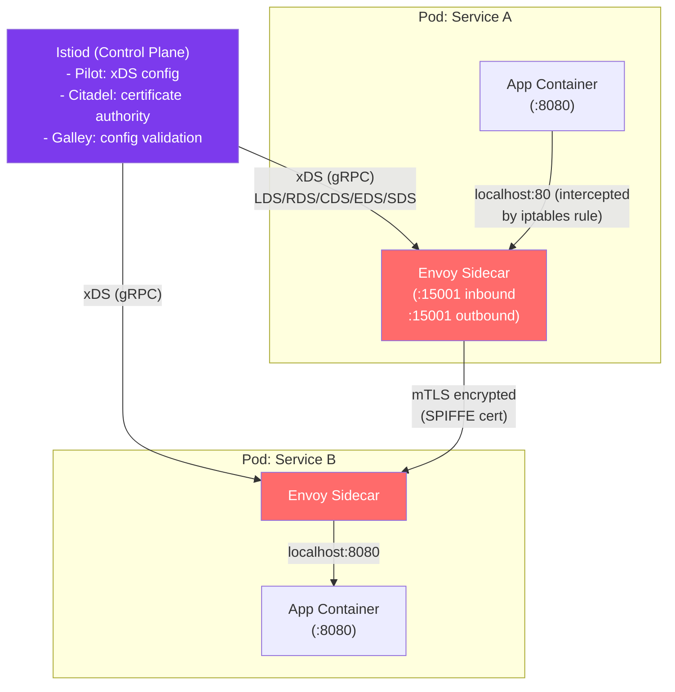

# 🕸️ Service Mesh

> [!abstract] TL;DR
> A service mesh is an infrastructure layer that handles **service-to-service communication** transparently — injecting a sidecar proxy (Envoy) into every pod, intercepting all traffic via iptables, and enforcing mTLS, traffic policies, and observability without any application code changes. The **control plane** (Istio's istiod / Linkerd's control plane) pushes **xDS configuration** (LDS/RDS/CDS/EDS/SDS) to sidecar proxies. Capabilities: mTLS (zero trust), traffic management (canary, circuit breaking), and deep observability (metrics, traces, logs) per service. Overhead: ~1ms per hop.

## Intuition — analogy FIRST

Without a service mesh, services communicate directly — like a city where every car needs its own GPS, knows traffic rules, enforces speed limits, and keeps a personal drive log. Each app team reinvents retry logic, TLS setup, circuit breakers, and metrics independently.

A **service mesh** is like installing smart traffic management infrastructure: every car (service) gets a co-pilot robot (sidecar proxy) that handles navigation, traffic rule enforcement, and logging automatically. The central traffic authority (control plane) programs all robots with the current rules. The app drivers (developers) just say "I want to go to Service B" — the robot handles everything else.

**xDS** is the communication protocol between the traffic authority and all robots — a dynamic configuration system that can change routing rules, traffic weights, and certificates without restarting any service.

---

## How It Works



## Key Concepts / Details

### Sidecar Proxy Pattern

**Traffic interception via iptables:**
When a pod has an Envoy sidecar injected (by the istio-proxy webhook), init containers add iptables rules:

```
iptables -t nat -A OUTPUT -p tcp ! --dport 15001 -j REDIRECT --to-port 15001
# All outbound TCP traffic (except to Envoy's own port) is redirected to Envoy's outbound port (15001)

iptables -t nat -A PREROUTING -p tcp -j REDIRECT --to-port 15006
# All inbound TCP traffic redirected to Envoy's inbound port (15006)
```

Result: Applications never know they're talking to a proxy. They make a normal socket call to `Service-B:80`, iptables redirects it to Envoy, Envoy handles service discovery, mTLS, retry, and load balancing.

**Envoy proxy capabilities:**
- L4 (TCP) and L7 (HTTP/1.1, HTTP/2, gRPC, Kafka, MongoDB, Redis) protocol support
- Service discovery via EDS (Endpoint Discovery Service)
- Load balancing (round-robin, least-request, ring-hash, random)
- Health checking (active and passive)
- Circuit breaking
- Retry logic (with backoff)
- Rate limiting
- mTLS with automatic certificate rotation
- Detailed metrics + distributed tracing

### xDS API (Discovery Services)

xDS is the collection of gRPC APIs the control plane uses to dynamically configure Envoy:

| xDS API | Abbreviation | What It Configures |
|---------|-------------|-------------------|
| **Listener Discovery Service** | LDS | Envoy listeners (ports to listen on, filter chains) |
| **Route Discovery Service** | RDS | HTTP routing rules (which route → which cluster) |
| **Cluster Discovery Service** | CDS | Upstream clusters (service backends, circuit breaker settings) |
| **Endpoint Discovery Service** | EDS | Pod IP:port endpoints in each cluster |
| **Secret Discovery Service** | SDS | TLS certificates, private keys (rotated without restart) |

**Envoy config flow:**
```
Request comes in:
  → LDS: "I'm listening on :80, using filter chain X"
  → RDS: "Route /api/users → cluster 'user-service'"
  → CDS: "Cluster 'user-service' uses EDS for endpoints, circuit breaker: 100 pending"
  → EDS: "Endpoints: 10.0.0.5:8080, 10.0.0.6:8080, 10.0.0.7:8080"
  → SDS: "mTLS: use this SPIFFE cert + private key"
```

All xDS APIs support **streaming updates** — the control plane pushes changes to Envoy in real-time without restart.

### mTLS in Istio

**PeerAuthentication (enforcing mTLS):**
```yaml
apiVersion: security.istio.io/v1beta1
kind: PeerAuthentication
metadata:
  name: default
  namespace: default
spec:
  mtls:
    mode: STRICT  # All pod-to-pod traffic must use mTLS
```

**Authorization (what can talk to what):**
```yaml
apiVersion: security.istio.io/v1beta1
kind: AuthorizationPolicy
metadata:
  name: allow-frontend-to-backend
  namespace: default
spec:
  selector:
    matchLabels:
      app: backend
  action: ALLOW
  rules:
  - from:
    - source:
        principals: ["cluster.local/ns/default/sa/frontend"]  # SPIFFE ID
    to:
    - operation:
        methods: ["GET"]
        paths: ["/api/*"]
```

**Certificate management:**
- Istiod acts as the certificate authority (or integrates with external CA).
- Each service gets a SPIFFE X.509 certificate: `spiffe://cluster.local/ns/namespace/sa/serviceaccount`
- Certificates automatically rotated every 24 hours (configurable).
- SDS delivers new certificates to Envoy without any restart.

### Traffic Management

**VirtualService (routing rules):**
```yaml
apiVersion: networking.istio.io/v1alpha3
kind: VirtualService
metadata:
  name: reviews
spec:
  hosts:
  - reviews
  http:
  - match:
    - headers:
        end-user:
          exact: jason
    route:
    - destination:
        host: reviews
        subset: v3         # Jason sees version 3 (canary)
  - route:
    - destination:
        host: reviews
        subset: v1
        weight: 90         # 90% → v1
    - destination:
        host: reviews
        subset: v2
        weight: 10         # 10% → v2 (canary)
```

**DestinationRule (load balancing + circuit breaking):**
```yaml
apiVersion: networking.istio.io/v1alpha3
kind: DestinationRule
metadata:
  name: reviews
spec:
  host: reviews
  trafficPolicy:
    connectionPool:
      tcp:
        maxConnections: 100
      http:
        h2UpgradePolicy: UPGRADE
        http1MaxPendingRequests: 100
    outlierDetection:           # Circuit breaker: passive health check
      consecutiveGatewayErrors: 5
      interval: 30s
      baseEjectionTime: 30s    # Eject failing pod for 30s
  subsets:
  - name: v1
    labels: {version: v1}
  - name: v2
    labels: {version: v2}
  - name: v3
    labels: {version: v3}
```

**Retry and timeout:**
```yaml
http:
- route:
  - destination:
      host: my-service
  retries:
    attempts: 3
    perTryTimeout: 2s
    retryOn: gateway-error,connect-failure,retriable-4xx
  timeout: 10s
```

### Observability

**Metrics (Prometheus):**
Envoy exports detailed metrics per-service:
- `istio_requests_total{source_app, destination_app, response_code, ...}` — Request count
- `istio_request_duration_milliseconds` — Latency histogram (p50/p99/p999)
- `istio_tcp_connections_opened_total`

**Distributed Tracing:**
Envoy propagates trace headers (b3: `x-b3-traceid`, `x-b3-spanid`, `x-b3-parentspanid`) or W3C Trace Context (`traceparent`). Applications must forward these headers for end-to-end trace correlation. Traces sent to Jaeger, Zipkin, or Lightstep.

**Access Logs:**
Envoy generates per-request access logs with: source/destination service, request method, path, response code, duration, bytes in/out.

### Linkerd vs Istio

| Feature | Istio + Envoy | Linkerd |
|---------|--------------|---------|
| Proxy | Envoy (C++) | Linkerd2-proxy (Rust) |
| Memory overhead | ~50 MB/proxy | ~10 MB/proxy |
| Performance overhead | ~1ms | <1ms |
| Control plane | istiod (~300 MB) | Small Go binaries |
| mTLS | Yes | Yes |
| Traffic management | Rich (VirtualService/DestinationRule) | Basic |
| Protocol support | HTTP, gRPC, TCP, Kafka, MongoDB | HTTP, gRPC, TCP |
| Ambient mode | Yes (2023) | No |
| Use case | Feature-rich enterprise | Lightweight simplicity |

**Istio Ambient Mesh:** Removes the per-pod sidecar in favor of a per-node proxy (ztunnel for L4) and waypoint proxies for L7 — reduces overhead significantly.

## Real-World Notes

- **Istio overhead:** ~1ms per hop added by Envoy for HTTP request processing. For 5-hop microservice chains: +5ms. For 99th-percentile sensitive SLOs, measure before mandating mesh everywhere.
- **Ingress vs Gateway:** Istio Gateway (backed by Envoy) replaces Kubernetes Ingress for L7 load balancing at the mesh boundary. Kubernetes Gateway API is the newer standard.
- **Progressive rollout (canary):** Using Istio VirtualService weights (90/10 split) combined with Flagger or Argo Rollouts for automated canary promotion based on Prometheus metrics (error rate, latency).

## Common Pitfalls

- Not propagating trace headers in application code — distributed traces are broken if the app doesn't forward b3/W3C headers.
- Enabling STRICT mTLS without verifying all services are on the mesh — non-mesh services (jobs, scripts) can no longer reach mesh services.
- Ignoring Envoy proxy resource limits — Envoy needs CPU for TLS and routing; add resource requests/limits to sidecar containers.
- VirtualService host must match service DNS name — a typo in `hosts:` causes silent routing failures.

## Related Concepts

- [[Zero_Trust_Networking]] — Service mesh enforces mTLS and AuthorizationPolicy for workload-level zero trust
- [[TLS_SSL]] — mTLS with SPIFFE certificates is the cryptographic foundation
- [[Cloud_Networking_AWS_Azure]] — Service meshes run on cloud Kubernetes clusters
- [[Software_Defined_Networking]] — xDS is a southbound API like OpenFlow — control plane programmatically configures data plane

## Review Questions

1. Explain how Istio intercepts all pod-to-pod traffic using iptables and Envoy. Why doesn't the application code need to be changed to participate in the mesh?
2. Describe the xDS API. Name the five main discovery services, what each configures, and explain why dynamic xDS (streaming) is better than static Envoy config files for cloud-native environments.
3. Design a canary deployment for a new version of a payment service. Use Istio VirtualService and DestinationRule YAML to route 5% of traffic to v2 while keeping v1 as primary, with circuit breaking if v2's error rate spikes.

## Sources

- Envoy Proxy documentation — https://envoyproxy.io
- Istio documentation — https://istio.io/docs
- Klein, Christian et al., "An Analysis of Microservice Performance with Service Meshes" — IEEE 2020
- Linkerd documentation — https://linkerd.io/docs

#networking #sdn-cloud #advanced
