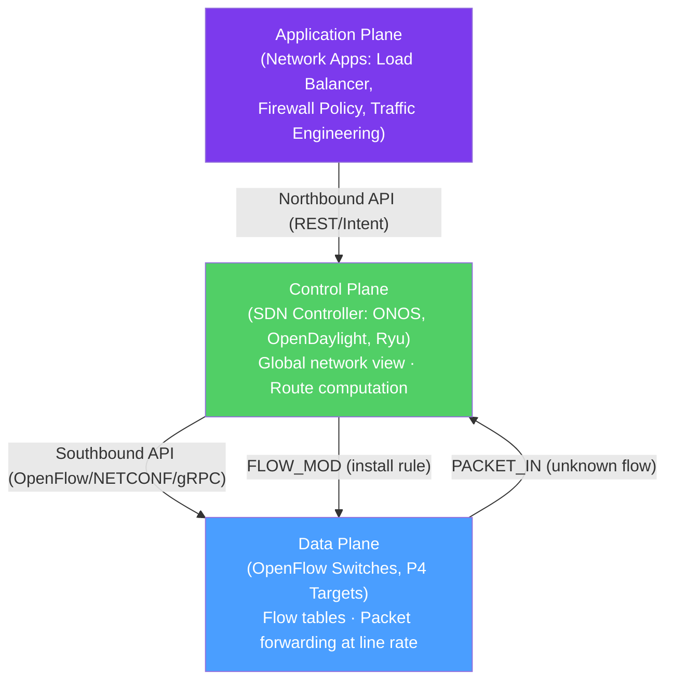

# 🖥️ Software Defined Networking

> [!abstract] TL;DR
> SDN (Software-Defined Networking) decouples the **control plane** (where routing decisions are made) from the **data plane** (where packets are actually forwarded), centralizing the control plane in a software controller with a global view of the network. **OpenFlow** programs switch flow tables (match fields + actions) via a centralized controller. **P4** (Programming Protocol-Independent Packet Processors) enables fully programmable parse→match-action→deparse pipelines at line rate. Hardware acceleration via DPDK (kernel-bypass, 14.88 Mpps) and SmartNIC/DPU (NVIDIA BlueField) offloads data-plane work from CPUs.

## Intuition — analogy FIRST

Traditional networking is like a city where every traffic light has its own independent intelligence — it observes local conditions and makes decisions without coordination. Traffic jams propagate unpredictably because no single entity sees the whole picture.

**SDN** is like installing a unified traffic management center with cameras on every intersection (flow statistics) and a central computer that programs all traffic lights simultaneously. The controller has a global view and can optimize traffic flow across the entire city. The traffic lights (switches) just execute instructions — they don't need intelligence of their own.

**OpenFlow** is the language (protocol) the control center uses to program individual traffic lights: "When you see a car going North on 5th Ave, turn it onto Broadway."

**P4** goes further — instead of just programming the rules, you can reprogram the traffic light's internal logic itself: "Here's how to parse the license plates, here's what to do based on sticker color, here's how to forward based on a combination of time-of-day and destination."

---

## How It Works



## Key Concepts / Details

### Three-Plane Architecture

| Plane | Location | Role | Interface |
|-------|----------|------|-----------|
| **Application plane** | Controller apps | Network apps (firewall, LB, monitoring) | Northbound API |
| **Control plane** | SDN Controller | Computes paths, installs flows, maintains topology | Northbound (to apps) + Southbound (to devices) |
| **Data plane** | Network devices | Forwards packets per flow table entries | Southbound (from controller) |

**Key insight:** In traditional networking, control and data planes are co-located on each device (distributed). In SDN, the control plane is centralized (or logically centralized) — a single controller has a complete view of the topology.

### OpenFlow

OpenFlow is the original SDN southbound protocol (IEEE standard) for programming switch flow tables:

**Flow table entry structure:**
```
Match Fields         │ Priority │ Counters  │ Instructions / Actions
─────────────────────┼──────────┼───────────┼──────────────────────────
in_port=1            │ 100      │ pkts=1000 │ output(port=2)
eth_type=0x0800      │          │ bytes=64K │
ip_dst=10.0.0.5/32   │          │           │
─────────────────────┼──────────┼───────────┼──────────────────────────
in_port=3            │ 50       │ pkts=200  │ mod_dl_dst(AA:BB:...) + output(port=4)
ip_dst=10.0.0.0/24   │          │           │
```

**Match fields:** in_port, eth_src/dst, eth_type, vlan_id, ip_src/dst, ip_proto, tcp/udp port, etc.

**Actions:**
- `output(port)` — Forward to a specific port
- `drop` — Discard the packet
- `output(CONTROLLER)` — Send to controller (PACKET_IN)
- `mod_*` — Modify header fields (NAT, VLAN tagging)
- `group` — Apply a group action (multipath, failover)

**Reactive vs Proactive programming:**
- **Reactive:** Default flow → PACKET_IN to controller → controller installs FLOW_MOD → future packets hit the table rule. High initial latency.
- **Proactive:** Controller pre-populates flow tables before traffic arrives. Zero first-packet latency.

**Multiple flow tables (pipeline):**
OpenFlow 1.3+ supports multiple tables processed in order:
```
Table 0 (ACL) → Table 1 (Routing) → Table 2 (QoS) → Output
```

**OpenFlow Controllers:**
- **ONOS** (Open Network Operating System) — Carrier-grade; used by AT&T, Comcast; supports clustering for HA
- **OpenDaylight** — Modular; enterprise-focused; supports NETCONF, BGP, OpenFlow
- **Ryu** — Lightweight Python controller; popular for research and prototyping
- **Faucet** — Production-grade OpenFlow controller for enterprise campus networks

### P4 (Programming Protocol-Independent Packet Processors)

P4 goes beyond OpenFlow — instead of just configuring what the switch does with packets, P4 lets you **define how the switch parses and processes packets**:

**P4 program structure:**

```p4
// 1. Headers — define packet format
header ethernet_t {
    bit<48> dstAddr;
    bit<48> srcAddr;
    bit<16> etherType;
}

// 2. Parser — how to extract headers from bits
parser MyParser(packet_in pkt, out headers hdr) {
    state start {
        pkt.extract(hdr.ethernet);
        transition select(hdr.ethernet.etherType) {
            0x0800: parse_ipv4;
            default: accept;
        }
    }
}

// 3. Match-Action pipeline
control MyIngress(inout headers hdr, ...) {
    action forward(PortId_t port) {
        standard_metadata.egress_spec = port;
    }
    table ipv4_lpm {
        key = { hdr.ipv4.dstAddr: lpm; }
        actions = { forward; drop; }
    }
    apply { ipv4_lpm.apply(); }
}

// 4. Deparser — reassemble packet
control MyDeparser(packet_out pkt, in headers hdr) {
    apply { pkt.emit(hdr.ethernet); pkt.emit(hdr.ipv4); }
}
```

**P4 targets:**
- **bmv2 (Behavioral Model v2)** — Software reference implementation; research/testing
- **Intel Tofino ASIC** — Hardware P4 switch achieving Tbps line rate
- **SmartNIC P4** — NVIDIA/Mellanox data path programming

**P4 use cases:**
- Custom telemetry (INT — In-band Network Telemetry): Embed latency/queue depth into packet headers
- Custom routing protocols
- Heavy hitter detection at line rate
- Network measurement without sending packets to controller

### Hardware Acceleration

**DPDK (Data Plane Development Kit):**
- Intel open-source framework for kernel-bypass user-space packet processing
- Bypasses the Linux kernel networking stack (eliminates ~25 µs context-switch overhead per packet)
- Poll-mode drivers (PMD) — dedicated CPU cores busy-poll NICs instead of using interrupts
- **Performance:** Up to 14.88 Mpps (million packets per second) at 64-byte frames on a 10G NIC
- **Use cases:** vRouter, vFirewall, VNF data planes, OVS-DPDK

**SmartNIC / DPU (Data Processing Unit):**
Modern network cards with embedded ARM CPUs/FPGAs that can run network functions:

| Vendor | Product | Capabilities |
|--------|---------|-------------|
| NVIDIA | BlueField-3 | Arm Cortex A78, 400GbE, DOCA SDK |
| Intel | IPU (Infrastructure Processing Unit) | Custom ARM, 200G |
| Marvell | OCTEON 10 | 36 cores, 100GbE |
| Pensando | DSC | Custom RISC-V |

**SmartNIC offloads:** OVS (Open vSwitch) flows, TLS encryption/decryption, firewall (connection tracking), RDMA, storage (NVMe-oF), telemetry.

**SR-IOV (Single-Root I/O Virtualization):**
- One physical NIC presents multiple virtual NIC instances (VFs — Virtual Functions) to VMs
- VMs get near-bare-metal NIC performance by bypassing the hypervisor I/O path
- Used in cloud bare-metal instances and high-throughput VMs

## Real-World Notes

- **OVS (Open vSwitch):** The most widely deployed SDN data plane — used in KVM/QEMU hypervisors, OpenStack, and Kubernetes (OVN = Open Virtual Network). OVS-DPDK achieves 10× better performance than kernel OVS.
- **AWS VPC hyperplane:** AWS runs a custom OpenFlow-like SDN fabric for VPC — each hypervisor runs a local distributed flow table programmed by the central VPC control plane. No traditional network hardware is visible to customers.
- **SONiC (Software for Open Networking in the Cloud):** Microsoft's open-source NOS (Network Operating System) used in Azure and many hyperscaler switches; Linux-based; supports OpenFlow, gNMI, and native applications.

## Common Pitfalls

- Centralized controller as a single point of failure — production controllers must run in clustered mode (ONOS supports 3-5 node clusters with Raft consensus).
- Reactive flow installation latency — for high-frequency short-lived flows, the PACKET_IN/FLOW_MOD round-trip is too slow; use proactive rules or local fast-path tables.
- P4 not replacing OpenFlow in all scenarios — P4 requires recompilation and reloading for changes to the parser; for rule-based policies without format changes, OpenFlow is more operational.
- DPDK pinning CPU cores — DPDK busy-poll cores are 100% busy; must be isolated from OS scheduler with CPU affinity (cpu isolation kernel parameter).

## Related Concepts

- [[Network_Function_Virtualization]] — NFV uses SDN control plane to connect VNF chains
- [[Cloud_Networking_AWS_Azure]] — Cloud VPC fabrics are SDN implementations
- [[Routing_Protocols]] — SDN can replace or augment traditional routing protocols

## Review Questions

1. Explain the control plane / data plane separation in SDN. What does the controller know that individual switches don't, and how does this enable more sophisticated network policies?
2. Describe an OpenFlow reactive flow installation. What happens when a packet doesn't match any flow table entry? Trace the sequence from PACKET_IN to the packet being forwarded.
3. What is P4, and how does it differ from OpenFlow? Give an example of something you can do with P4 that OpenFlow cannot support.

## Sources

- McKeown, Nick et al., "OpenFlow: Enabling Innovation in Campus Networks" — SIGCOMM CCR 2008
- Bosshart, Pat et al., "P4: Programming Protocol-Independent Packet Processors" — SIGCOMM CCR 2014
- DPDK documentation — https://www.dpdk.org

#networking #sdn-cloud #advanced
