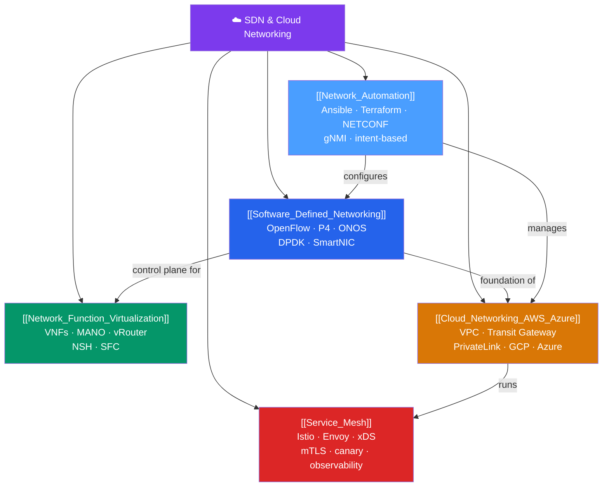

# 🗺️ SDN & Cloud Networking — Map of Content

> [!abstract] What This Section Covers
> Software-defined networking decouples the control plane from the data plane so networks become programmable at scale — the model underneath cloud VPC fabrics, CDNs, and service meshes. This section covers: **Software-Defined Networking** (OpenFlow, P4, controllers like ONOS/OpenDaylight, DPDK, SmartNIC/DPU), **Network Function Virtualization** (NFV, VNFs, MANO, vRouter/vFW/vLB), **Cloud Networking** (AWS VPC architecture, Transit Gateway, PrivateLink, GCP/Azure, SD-WAN), **Service Mesh** (Istio/Linkerd, Envoy xDS config, mTLS, traffic management, observability), and **Network Automation** (Ansible, Terraform, NETCONF/YANG, gNMI, intent-based networking).

## Concept Map

## Learning Path

1. [[Software_Defined_Networking]] — Understand control/data plane separation first; it's the foundation of everything else.
2. [[Network_Function_Virtualization]] — How network functions move from dedicated hardware to software.
3. [[Cloud_Networking_AWS_Azure]] — How SDN principles manifest in AWS/GCP/Azure VPC networking.
4. [[Service_Mesh]] — How Istio/Linkerd apply SDN/Zero Trust to microservice communication.
5. [[Network_Automation]] — How to programmatically manage all the above at scale.

## All Notes at a Glance

| Note | Difficulty | What You'll Learn |
|------|------------|-------------------|
| [[Software_Defined_Networking]] | Advanced | Control/data/application plane, OpenFlow flow tables, P4, controllers, DPDK, SmartNIC |
| [[Network_Function_Virtualization]] | Advanced | VNF taxonomy, ETSI NFV architecture, MANO, service function chaining, NSH |
| [[Cloud_Networking_AWS_Azure]] | Intermediate → Advanced | AWS VPC subnets/routes/IGW/NAT GW, Transit Gateway, PrivateLink, GCP/Azure VNet, SD-WAN |
| [[Service_Mesh]] | Advanced | Sidecar proxy (Envoy), istiod, xDS (LDS/RDS/CDS/EDS/SDS), mTLS, traffic management, observability |
| [[Network_Automation]] | Intermediate → Advanced | Ansible network modules, Terraform providers, NETCONF/YANG, gNMI, intent-based networking |

## Key Questions This Section Answers

- What is the difference between the control plane and the data plane, and why does separating them enable programmable networks?
- How does an OpenFlow flow table match packets, and what actions can it take?
- What is P4, and how does it differ from OpenFlow?
- What is the difference between a VNF and a PNF, and what is MANO?
- How does AWS VPC peering differ from Transit Gateway?
- How does Envoy's xDS API enable dynamic service discovery without restarting the proxy?
- What is the difference between Ansible and Terraform for network configuration management?

## Related Sections

- [[_MOC_Networking_Master|↑ Networking Master MOC]]
- [[_MOC_Network_Security|← Network Security]]
- [[_MOC_TCPIP_Protocols|← TCP/IP Protocols]]

#MOC #Networking #SDN #CloudNetworking
