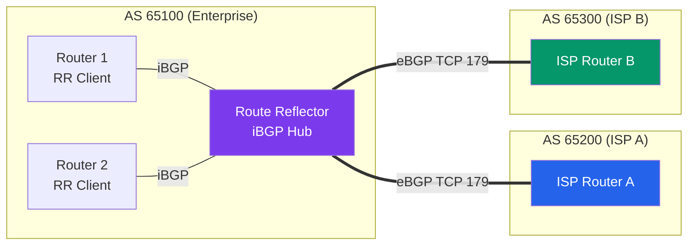

# BGP Protocol

> [!abstract] TL;DR
> BGP (Border Gateway Protocol) is the **path-vector** protocol that routes traffic across the entire internet. Every organization connecting to the internet runs eBGP with its ISPs. BGP is policy-driven — it is intentionally not optimal, trading raw efficiency for **controllability**. Key attributes drive path selection: **WEIGHT** (local preference, Cisco), **LOCAL_PREF** (prefer exit points), **AS_PATH** (loop detection + length), **MED** (hint to neighbors for entry). BGP peers over **TCP port 179**; route reflectors and confederations solve the iBGP full-mesh scalability problem.

## BGP Session Types



| Session Type | Between | AS_PATH Behavior | Next-hop |
|-------------|---------|-----------------|---------|
| **eBGP** (external) | Different AS numbers | Prepends own AS | Changed to self |
| **iBGP** (internal) | Same AS number | Not modified | Preserved (next-hop unchanged) |

## BGP Path Selection Algorithm

When BGP receives multiple paths to the same prefix, it runs through these attributes **in order** — first decisive attribute wins:

| Step | Attribute | Prefer | Scope |
|------|-----------|--------|-------|
| 1 | **WEIGHT** | Highest | Cisco proprietary — local to router only |
| 2 | **LOCAL_PREF** | Highest | Shared within AS via iBGP |
| 3 | **Locally originated** | Prefer | network/aggregate vs redistributed |
| 4 | **AS_PATH length** | Shortest | Fewer ASes traversed |
| 5 | **ORIGIN** | IGP < EGP < Incomplete | How the route entered BGP |
| 6 | **MED** | Lowest | Hint to neighbor for entry point |
| 7 | **eBGP vs iBGP** | eBGP preferred | External over internal path |
| 8 | **IGP metric to next-hop** | Lowest | Internal cost to reach BGP next-hop |
| 9 | **Router ID** | Lowest | Final tiebreaker |

**Memory aid:** "We Love Oranges As Oranges Mean Pure Refreshment" (Weight, Local-pref, Originate, AS-path, Origin, MED, Prefer-eBGP, RID).

## BGP Attributes Deep Dive

### AS_PATH

The AS_PATH attribute is a list of all AS numbers a route has traversed. It serves two purposes:

1. **Loop detection** — if a router sees its own AS in AS_PATH, it discards the route
2. **Path length metric** — shorter AS_PATH is preferred (Step 4 above)

**AS_PATH prepending**: Operators artificially inflate AS_PATH length to make a route less preferred:
```
! Make inbound traffic prefer ISP-A by prepending to ISP-B announcement
route-map PREPEND_TO_ISPB permit 10
 set as-path prepend 65100 65100 65100   ! add own AS 3 times

Router(config-router)# neighbor 203.0.113.2 route-map PREPEND_TO_ISPB out
```

### LOCAL_PREF

Shared within an AS via iBGP. Higher = preferred. Used to control **outbound** traffic (which exit point to use when leaving the AS).

```
! Prefer ISP-A for outbound traffic (set higher LOCAL_PREF on routes from ISP-A)
route-map FROM_ISPA permit 10
 set local-preference 200         ! default is 100

Router(config-router)# neighbor 198.51.100.1 route-map FROM_ISPA in
```

### MED (Multi-Exit Discriminator)

A hint sent to a **neighboring AS** about preferred entry points. Lower = preferred. Only compared between paths from the same neighboring AS.

```
! Signal to ISP-B to prefer entering via this router
route-map SET_MED permit 10
 set metric 50

Router(config-router)# neighbor 203.0.113.2 route-map SET_MED out
```

### BGP Communities

Communities are 32-bit tags attached to routes for policy tagging. Standard communities: `AS:VALUE` (e.g., `65100:200`).

Well-known communities:
- `NO_EXPORT` — don't advertise beyond the local AS
- `NO_ADVERTISE` — don't advertise to any BGP peer
- `LOCAL_AS` — don't advertise outside the local confederation

```
! Tag routes from customer with community for traffic shaping
route-map CUSTOMER_IN permit 10
 set community 65100:100 additive

! Match and apply policy based on community
ip community-list 1 permit 65100:100
route-map POLICY permit 10
 match community 1
 set local-preference 150
```

## BGP Configuration Examples

### Basic eBGP Peering

```
! Router in AS 65100 peering with ISP in AS 65200
Router(config)# router bgp 65100
Router(config-router)# bgp router-id 1.1.1.1
Router(config-router)# neighbor 203.0.113.1 remote-as 65200   ! eBGP peer (different AS)
Router(config-router)# neighbor 203.0.113.1 description ISP-A
Router(config-router)# network 198.51.100.0 mask 255.255.255.0  ! advertise own prefix

! Verification
Router# show bgp summary
Router# show bgp neighbors 203.0.113.1
Router# show ip bgp                     ! full BGP table
```

### iBGP with Route Reflectors

iBGP requires all BGP speakers in an AS to be in a **full mesh** (every speaker peers with every other). For N routers: N×(N−1)/2 sessions — unscalable for large networks.

**Route Reflectors** solve this: RR clients only peer with the RR, which reflects routes to all clients.

```
! Configure Route Reflector
RR(config)# router bgp 65100
RR(config-router)# neighbor 10.0.0.2 remote-as 65100
RR(config-router)# neighbor 10.0.0.2 route-reflector-client
RR(config-router)# neighbor 10.0.0.3 remote-as 65100
RR(config-router)# neighbor 10.0.0.3 route-reflector-client

! RR Clients — only peer with RR (no direct peering with each other)
Client1(config)# router bgp 65100
Client1(config-router)# neighbor 10.0.0.1 remote-as 65100    ! peer with RR only
```

## Prefix Filtering and Route Policies

Unfiltered BGP is dangerous — a misconfigured peer can inject routes affecting global routing:

```
! Only accept specific prefixes from a peer (prefix-list)
ip prefix-list CUSTOMER_PREFIXES permit 192.0.2.0/24
ip prefix-list CUSTOMER_PREFIXES permit 198.51.100.0/24
ip prefix-list CUSTOMER_PREFIXES deny 0.0.0.0/0 le 32       ! deny everything else

Router(config-router)# neighbor 203.0.113.1 prefix-list CUSTOMER_PREFIXES in

! Filter outbound — only advertise own prefixes
ip prefix-list MY_PREFIXES permit 203.0.113.0/24
Router(config-router)# neighbor 203.0.113.1 prefix-list MY_PREFIXES out
```

## BGP in Cloud Environments

BGP is how cloud providers connect to enterprise networks:

| Cloud | BGP Use Case |
|-------|-------------|
| **AWS** | VPN Gateway and Direct Connect use BGP for route exchange; supports both static and dynamic BGP routing |
| **GCP** | Cloud Router uses BGP to exchange routes with on-prem via Cloud VPN or Dedicated Interconnect |
| **Azure** | ExpressRoute uses BGP with Microsoft's AS 12076; supports BGP communities for routing control |

```
! AWS VPN — BGP peer with Virtual Private Gateway
neighbor 169.254.x.x remote-as 64512    ! AWS uses private AS 64512
neighbor 169.254.x.x timers 10 30
```

## BGP Security — RPKI

BGP has no built-in authentication of route origins. **RPKI (Resource Public Key Infrastructure)** adds cryptographic origin validation:

- **ROA (Route Origin Authorization)** — cryptographically signed certificate stating which AS is authorized to originate a prefix
- **ROV (Route Origin Validation)** — routers verify incoming routes against RPKI and drop INVALID routes

Famous BGP hijacks: Pakistan Telecom (2008, YouTube), Rostelecom (2020, Google/AWS routes).

## Common Pitfalls

- iBGP does not change the next-hop attribute — RR clients must reach the eBGP next-hop via IGP (OSPF/EIGRP); always run `next-hop-self` on iBGP peers
- BGP holds timer mismatch causes session teardown — both peers must agree; default Hold=180s, Keepalive=60s
- Accepting all routes from a peer (no prefix-list) — a misconfigured or malicious peer can poison your routing table
- MED is only compared between paths from the **same** neighboring AS by default; `bgp always-compare-med` changes this

## Review Questions

1. A BGP router receives two routes to 10.0.0.0/8. Route A has LOCAL_PREF=200 and AS_PATH [65200, 65300]. Route B has LOCAL_PREF=100 and AS_PATH [65400]. Which route is preferred, and why?
2. Your company has two ISP connections. You want all outbound traffic to prefer ISP-A and all inbound traffic (from the internet) to prefer entry via ISP-A's PoP. Which BGP attributes do you manipulate for each, and on which direction (inbound/outbound policy)?
3. Why does iBGP require a full mesh, and how do route reflectors solve this? What is the CLUSTER_LIST attribute, and why does it exist?

#Networking #routing-protocols #bgp
