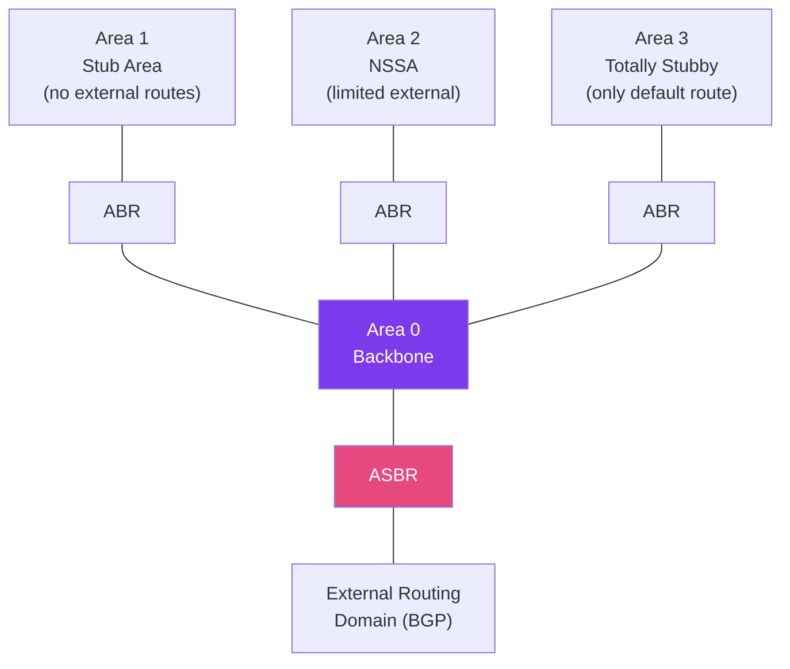

# OSPF Protocol

> [!abstract] TL;DR
> OSPF (Open Shortest Path First) is a **link-state** interior gateway protocol that gives every router in an area a complete map of the topology, then runs Dijkstra's SPF algorithm to compute optimal paths independently. Key concepts: **area 0 backbone** (all areas must connect to it), **LSA flooding** to synchronize the LSDB, **DR/BDR election** on multi-access segments to reduce flooding overhead, and a **cost metric** of 10⁸ / bandwidth. OSPFv3 extends the protocol to support IPv6 with per-link rather than per-network instance operation.

## OSPF Neighbor States (State Machine)

```mermaid
stateDiagram-v2
    [*] --> Down
    Down --> Init : Hello received
    Init --> 2Way : Own router-ID seen in neighbor's Hello
    2Way --> ExStart : DR/BDR elected; start DD exchange
    ExStart --> Exchange : Master/slave determined; DBD packets sent
    Exchange --> Loading : LSR/LSU exchange begins
    Loading --> Full : LSDB synchronized
    Full --> [*]

    note right of 2Way : Non-DR/BDR neighbors\nstop here (2Way state)
    note right of Full : Adjacency fully formed\nroutes can be computed
```



## How OSPF Works — Step by Step

### 1. Hello Protocol and Neighbor Discovery

OSPF routers send **Hello packets** every 10 seconds (default) on each OSPF-enabled interface, multicast to 224.0.0.5 (AllSPFRouters). Hello packets contain:

- Router ID (highest loopback IP, or manually configured)
- Area ID
- Hello/Dead intervals (must match to form adjacency)
- Authentication type
- Neighbor list (seen router IDs)
- DR/BDR addresses

```
! Enable OSPF on Cisco IOS
Router(config)# router ospf 1
Router(config-router)# router-id 1.1.1.1
Router(config-router)# network 192.168.1.0 0.0.0.255 area 0
Router(config-router)# network 10.0.0.0 0.0.0.3 area 1
Router(config-router)# passive-interface GigabitEthernet0/2  ! no OSPF on this link

! Tune Hello/Dead timers for fast convergence
Router(config-if)# ip ospf hello-interval 1
Router(config-if)# ip ospf dead-interval 3
```

### 2. DR/BDR Election on Multi-Access Networks

On Ethernet (multi-access) segments, flooding every LSA to every router would generate O(N²) messages. OSPF elects a **Designated Router (DR)** and **Backup Designated Router (BDR)** to act as central collection/distribution points.

- All other routers (DROthers) form adjacency only with DR and BDR
- Multicast 224.0.0.6 (AllDRouters) used for DR/BDR updates

**Election criteria:**
1. Highest OSPF **priority** (default 1; set to 0 to exclude from election)
2. Tiebreak: Highest **Router ID**

The election is non-preemptive — a new router with higher priority does NOT displace the existing DR.

```
! Set OSPF priority on an interface
Router(config-if)# ip ospf priority 100   ! high priority = likely DR
Router(config-if)# ip ospf priority 0     ! never become DR
```

### 3. LSA Types and the LSDB

Each router floods **Link State Advertisements** to describe its directly connected links. All routers in an area store identical LSDBs.

| LSA Type | Name | Generated By | Scope |
|----------|------|--------------|-------|
| Type 1 | Router LSA | Every router | Within area |
| Type 2 | Network LSA | DR on multi-access segment | Within area |
| Type 3 | Summary LSA | ABR | Between areas |
| Type 4 | ASBR Summary LSA | ABR | Between areas |
| Type 5 | AS External LSA | ASBR | Entire OSPF domain |
| Type 7 | NSSA External LSA | ASBR in NSSA | NSSA area only |

### 4. SPF Calculation

With a complete LSDB, each router independently runs **Dijkstra's Shortest Path First** algorithm:

1. Place the local router at the root of the SPF tree with cost 0
2. Add all directly connected links to the candidate list
3. Select the lowest-cost candidate — add to the SPF tree
4. Process that node's LSA — add its links to the candidate list
5. Repeat until all reachable nodes are in the tree
6. Build the routing table from the SPF tree

**Cost metric:** `Cost = 10⁸ / interface_bandwidth_bps`

| Interface Speed | OSPF Cost |
|----------------|-----------|
| 10 Gbps | 1 (same as 100 Mbps — adjust reference bandwidth) |
| 1 Gbps | 1 (with default ref bandwidth) |
| 100 Mbps | 1 |
| 10 Mbps | 10 |
| 1.544 Mbps (T1) | 64 |
| 128 Kbps | 781 |

```
! Fix cost granularity for high-speed links
Router(config-router)# auto-cost reference-bandwidth 10000  ! 10 Gbps = cost 1

! Or set cost manually per interface
Router(config-if)# ip ospf cost 5
```

## OSPF Area Design



### Area Types

| Area Type | LSA Type 5 Allowed? | Type 3 Summaries | Default Route |
|-----------|--------------------|--------------------|---------------|
| Backbone (Area 0) | Yes | Yes | No |
| Standard | Yes | Yes | No |
| Stub | No | Yes | Yes (auto) |
| Totally Stubby | No | No (except default) | Yes (auto) |
| NSSA | No (uses Type 7) | Yes | Optional |

### OSPF Router Roles

| Role | Description |
|------|-------------|
| **Internal Router** | All interfaces within a single area |
| **ABR (Area Border Router)** | Interfaces in two or more areas; generates Type 3 LSAs |
| **ASBR (AS Boundary Router)** | Redistributes routes from external sources into OSPF |
| **DR (Designated Router)** | Central LSA hub on multi-access segments |
| **BDR (Backup Designated Router)** | Hot standby for DR |

## OSPFv3 for IPv6

OSPFv3 extends OSPF to support IPv6. Key differences:

- Runs over IPv6 link-local addresses (not IPv4)
- Uses per-link instances (not per-network)
- Removes address semantics from LSAs — topology and addressing are separated
- Can carry both IPv4 and IPv6 prefixes via address family support (RFC 5838)

```
! Enable OSPFv3 on Cisco IOS
Router(config)# ipv6 router ospf 1
Router(config-rtr)# router-id 1.1.1.1

! Enable on interface (instead of network command)
Router(config-if)# ipv6 ospf 1 area 0
```

## Verification Commands

```
Router# show ip ospf neighbor          ! adjacency table
Router# show ip ospf database          ! LSDB contents
Router# show ip ospf interface brief   ! per-interface state, DR/BDR
Router# show ip route ospf             ! OSPF-learned routes
Router# debug ip ospf events           ! live neighbor/SPF events (use with care)
```

## Common Pitfalls

- All non-backbone areas must connect to Area 0 — missing this requires a **virtual link** (workaround, not recommended for permanent design)
- Mismatched Hello/Dead timers between neighbors block adjacency formation (no error message — neighbor stays in Init state)
- Not setting `auto-cost reference-bandwidth` on high-speed links — 1 Gbps and 10 Gbps both get cost 1 by default
- Running OSPF without MD5 authentication exposes the network to rogue router injection

## Review Questions

1. A new Cisco router with priority 200 joins an Ethernet segment where a DR (priority 100) is already elected. Does the new router preempt the DR? Explain the election rules.
2. What LSA type does an ABR generate to summarize Area 1 routes for Area 0? What LSA type carries external (BGP-redistributed) routes into the OSPF domain?
3. You have a 10 Gbps link and a 1 Gbps link. With default OSPF reference bandwidth, both show cost=1. How do you fix this, and what command sets it globally?

#Networking #routing-protocols #ospf
