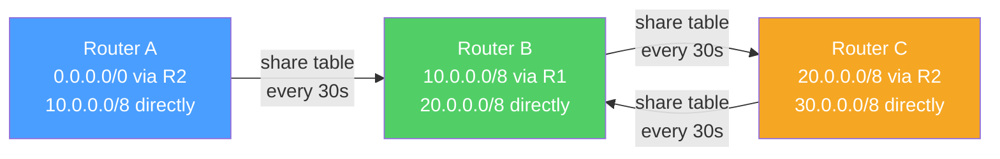
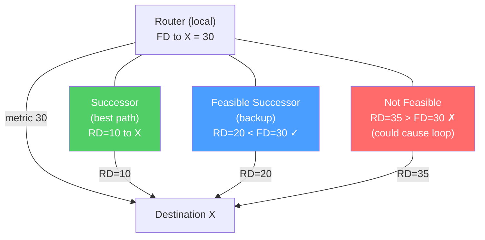

# RIP and EIGRP

> [!abstract] TL;DR
> RIP (Routing Information Protocol) is the classic **distance-vector** protocol — simple, low overhead, but limited to 15-hop networks and slow to converge. EIGRP (Enhanced IGRP) is Cisco's advanced distance-vector protocol using the **DUAL algorithm** for loop-free, fast convergence without the count-to-infinity problem. EIGRP's composite metric accounts for bandwidth and delay; it maintains neighbor, topology, and routing tables, with **feasible successors** as pre-computed backup routes for instant failover. RIPng and EIGRP both support IPv6.

## Distance-Vector Routing Overview



Distance-vector routers share their entire routing table with directly connected neighbors periodically. Each router adds its own metric and passes the table along — "routing by rumor."

## RIP — Routing Information Protocol

### RIP v1 vs v2

| Feature | RIPv1 | RIPv2 |
|---------|-------|-------|
| Classful/Classless | Classful (no subnet mask) | Classless (sends subnet mask) |
| Updates | Broadcast (255.255.255.255) | Multicast (224.0.0.9) |
| Authentication | None | MD5 or plain text |
| VLSM support | No | Yes |
| Auto-summarization | Yes (forced) | Yes (but can disable) |

### RIP Metrics and Limitations

- **Metric:** Hop count — each router hop adds 1
- **Maximum metric:** 15 — a destination with hop count 16 is **unreachable (infinite)**
- **Routing update interval:** 30 seconds (periodic, full table)
- **Invalid timer:** 180s — route marked invalid if not refreshed
- **Flush timer:** 240s — route removed from routing table
- **Holddown timer:** 180s — ignore metric-increasing updates after a route goes bad

The 15-hop limit makes RIP unsuitable for large networks. Convergence is slow — a network can take several minutes to stabilize after a topology change.

### Count-to-Infinity Problem

```
R1 --[link]-- R2 -- R3 -- network X (1 hop from R3)

After link R2-R3 fails:
1. R2 marks X as unreachable
2. But R1 still advertises X with metric 2 (R1 → R2 → R3)
3. R2 accepts R1's route: X is 3 hops via R1
4. R1 hears R2 has X at 3, updates to 4
5. This increments to infinity (16)... slowly
```

**Solutions:**
- **Split horizon** — don't advertise X back to R2 (R1 learned X from R2)
- **Poison reverse** — advertise X back to R2 with metric=16 immediately
- **Triggered updates** — send immediate update when a route changes, don't wait 30s

### RIP Configuration

```
! Configure RIPv2
Router(config)# router rip
Router(config-router)# version 2
Router(config-router)# network 192.168.1.0
Router(config-router)# network 10.0.0.0
Router(config-router)# no auto-summary          ! disable classful summarization
Router(config-router)# passive-interface Gi0/2  ! don't send RIP updates here

! Verification
Router# show ip rip database
Router# show ip protocols
Router# debug ip rip                            ! live RIP updates
```

### RIPng for IPv6

RIPng is RIP adapted for IPv6 — same distance-vector mechanics, hop count metric, max 15 hops.

```
! Enable RIPng on Cisco IOS
Router(config)# ipv6 router rip RIPNG-PROCESS
Router(config-if)# ipv6 rip RIPNG-PROCESS enable
```

## EIGRP — Enhanced Interior Gateway Routing Protocol

EIGRP is Cisco's proprietary advanced distance-vector protocol. It combines aspects of link-state (fast partial updates, neighbor relationships) with distance-vector (no full topology view) and uses **DUAL** for guaranteed loop-free paths.

### EIGRP Tables

| Table | Contents | Command |
|-------|----------|---------|
| **Neighbor table** | Directly connected EIGRP routers (IP, interface, hold timer) | `show ip eigrp neighbors` |
| **Topology table** | All routes learned from all neighbors (FD, AD for each) | `show ip eigrp topology` |
| **Routing table** | Best routes installed (successors only) | `show ip route eigrp` |

### DUAL Algorithm — Key Concepts

**Feasible Distance (FD):** The total metric from the local router to the destination via the best path (the successor).

**Reported Distance (RD) / Advertised Distance (AD):** The metric that a neighbor reports for reaching the destination (the neighbor's own cost).

**Feasibility Condition:** A neighbor's route is a **feasible successor** (valid loop-free backup) if its **RD < FD** of the current best path.



When the successor fails, if a feasible successor exists, EIGRP immediately promotes it — **instant failover without recomputation**. If no feasible successor exists, EIGRP enters **Active state** and queries all neighbors.

### EIGRP Composite Metric

```
Metric = [K1*Bandwidth + (K2*Bandwidth)/(256-Load) + K3*Delay] * [K5/(Reliability+K4)]
```

Default K-values: K1=1, K2=0, K3=1, K4=0, K5=0 — simplifies to:

```
Metric = (10^7 / minimum_bandwidth_kbps + cumulative_delay_tens_of_microseconds) * 256
```

- **Bandwidth** — minimum bandwidth on the path (bottleneck)
- **Delay** — sum of delays on all interfaces on the path

```
! View EIGRP metric components
Router# show interfaces GigabitEthernet0/0 | include BW|DLY
  MTU 1500 bytes, BW 1000000 Kbit/sec, DLY 10 usec

! Tune interface delay to influence path selection
Router(config-if)# delay 100    ! delay in tens of microseconds
```

### EIGRP Configuration

```
! Basic EIGRP configuration
Router(config)# router eigrp 100          ! AS number — must match on all routers
Router(config-router)# network 10.0.0.0
Router(config-router)# network 192.168.1.0 0.0.0.255
Router(config-router)# no auto-summary
Router(config-router)# passive-interface default    ! silence all interfaces
Router(config-router)# no passive-interface Gi0/0  ! re-enable on specific interfaces

! EIGRP for IPv6 (named mode — modern syntax)
Router(config)# router eigrp MYPROCESS
Router(config-router)# address-family ipv6 unicast autonomous-system 100
Router(config-router-af)# network 2001:DB8::/32

! Verification
Router# show ip eigrp neighbors
Router# show ip eigrp topology            ! all routes including feasible successors
Router# show ip eigrp topology all-links  ! includes non-feasible paths
```

## EIGRP vs OSPF Comparison

| Feature | EIGRP | OSPF |
|---------|-------|------|
| Type | Advanced distance-vector | Link-state |
| Algorithm | DUAL | Dijkstra SPF |
| Updates | Partial, triggered | Partial (LSA flooding) |
| Convergence | Very fast (FS instant) | Fast (SPF-based) |
| Metric | Composite (BW+delay) | Cost (10⁸/BW) |
| Scalability | Good (AS-based) | Excellent (area hierarchy) |
| Vendor support | Cisco (now open as RFC 7868) | Multi-vendor (RFC 2328) |
| IPv6 support | EIGRPv6 / named mode | OSPFv3 |
| Authentication | MD5, SHA-256 | MD5, SHA (OSPFv3) |
| Suitable for | Medium enterprise, all-Cisco shops | Large multi-vendor enterprise |

## Common Pitfalls

- EIGRP K-values must match on all routers in the same AS — mismatched K-values prevent neighbor relationships
- RIP auto-summary causes routing black holes in discontiguous networks (e.g., 10.1.0.0/24 and 10.2.0.0/24 on different sides of a 172.16.0.0/16 network — both summarize to 10.0.0.0/8)
- EIGRP in Active state (stuck active) — if a query is not answered within the active timer (default 3 minutes), the neighbor is dropped; avoid large flat EIGRP domains, use route summarization to limit query scope
- RIP's 30-second update interval means a topology change can take up to 5 minutes to propagate through a multi-hop network

## Review Questions

1. EIGRP has a feasible distance of 100 to network X. Two neighbors report: Neighbor A with RD=80, Neighbor B with RD=110. Which neighbor becomes the successor? Which becomes the feasible successor, if any? Explain.
2. A RIP network has a link failure. Describe the count-to-infinity sequence step by step for a three-router chain. Which timers are involved, and how does poison reverse accelerate convergence?
3. Why does EIGRP's partial update mechanism reduce bandwidth consumption compared to RIP's full table updates? What triggers an EIGRP update?

#Networking #routing-protocols #eigrp #rip
