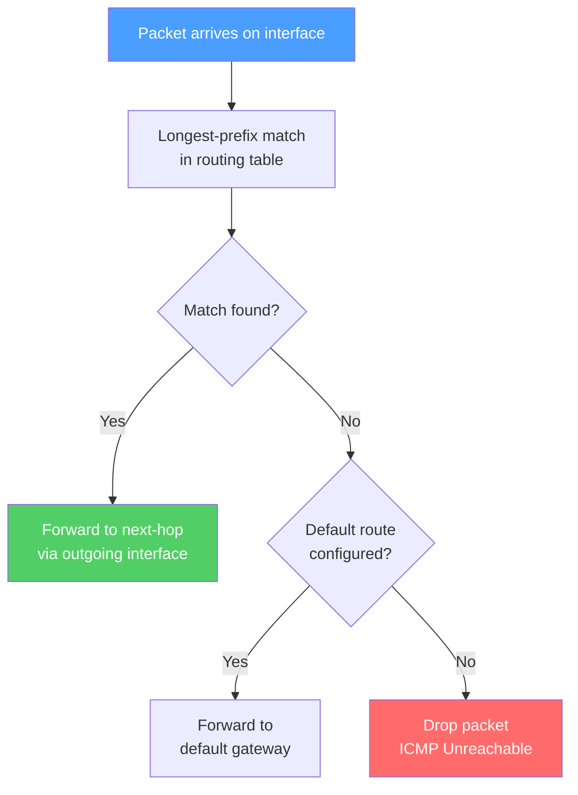

# Routing Fundamentals

> [!abstract] TL;DR
> Routing is the process of selecting paths through a network to forward packets from source to destination. Routers maintain a **routing table** populated by static configuration, directly connected interfaces, and dynamic routing protocols. When multiple sources offer the same destination, **administrative distance** picks the most trusted source; within a protocol, the **metric** picks the best path. Dynamic protocols are classified as **distance-vector** (share routing tables with neighbors — RIP, EIGRP) or **link-state** (share topology maps with all routers — OSPF, IS-IS), trading simplicity for convergence speed.

## How Routing Works



## Routing Table Concepts

The routing table (RIB — Routing Information Base) is the master list of all known routes. Each entry contains:

| Field | Description | Example |
|-------|-------------|---------|
| **Destination** | Network prefix + mask | 192.168.10.0/24 |
| **Next-hop** | IP of the next router | 10.0.0.1 |
| **Interface** | Outgoing interface | GigabitEthernet0/1 |
| **Metric** | Protocol-specific path cost | 110 (OSPF cost) |
| **Administrative Distance** | Source trustworthiness | 110 (OSPF) |
| **Age** | Time since route was learned | 00:05:32 |

```
! Cisco IOS — View routing table
Router# show ip route

Codes: C - connected, S - static, R - RIP, O - OSPF, B - BGP

C    10.0.0.0/8 is directly connected, GigabitEthernet0/0
S    0.0.0.0/0 [1/0] via 203.0.113.1          ! default route, AD=1
O    192.168.10.0/24 [110/2] via 10.0.0.2      ! OSPF, AD=110, metric=2
B    172.16.0.0/12 [20/0] via 198.51.100.1     ! eBGP, AD=20
```

**Longest-prefix match:** A packet for 192.168.10.5 matches both 192.168.10.0/24 and 0.0.0.0/0, but the /24 wins — the longer (more specific) prefix always takes priority.

## Static vs Dynamic Routing

### Static Routes

Manually configured; no protocol overhead; ideal for stub networks or default routes.

```
! Static route: send 10.20.0.0/16 traffic to next-hop 192.168.1.1
Router(config)# ip route 10.20.0.0 255.255.0.0 192.168.1.1

! Default static route (gateway of last resort)
Router(config)# ip route 0.0.0.0 0.0.0.0 203.0.113.1

! Floating static route: higher AD than OSPF (110), acts as backup
Router(config)# ip route 10.20.0.0 255.255.0.0 192.168.2.1 150
```

A **floating static route** has a manually elevated AD so it only activates if the dynamic route is withdrawn (failover backup).

### Dynamic Routing

Protocols automatically exchange reachability information and adapt to topology changes.

| Property | Distance-Vector | Link-State |
|----------|-----------------|------------|
| What is shared | Routing table (distance + direction) | Link state advertisements (topology) |
| Algorithm | Bellman-Ford | Dijkstra SPF |
| View of network | Partial (neighbors' perspective) | Complete map |
| Convergence | Slower | Faster |
| CPU/Memory | Lower | Higher |
| Examples | RIP, EIGRP | OSPF, IS-IS |

## Administrative Distance (AD)

When the same destination is learned from multiple protocols, AD determines which route is installed:

| Route Source | Default AD |
|--------------|-----------|
| Directly connected | 0 |
| Static route | 1 |
| EIGRP summary route | 5 |
| eBGP | 20 |
| EIGRP (internal) | 90 |
| OSPF | 110 |
| RIP | 120 |
| EIGRP (external) | 170 |
| iBGP | 200 |
| Unknown / unreachable | 255 |

Lower AD = more preferred. A route with AD=255 is never installed in the routing table.

## Convergence

**Convergence** is the time it takes for all routers in a network to have a consistent, accurate view of the topology after a change (link failure, new route, etc.).

Factors affecting convergence speed:
- **Hello/Dead timers** — how quickly a neighbor failure is detected (OSPF defaults: Hello=10s, Dead=40s; can be tuned to 1s/3s for fast failover)
- **BFD (Bidirectional Forwarding Detection)** — sub-second failure detection, independent of routing protocol
- **SPF/DUAL calculation time** — time to recompute shortest paths
- **LSA propagation** — how fast topology updates flood through the network

## Split Horizon and Route Poisoning

**Split horizon**: Do not advertise a route back out the interface from which it was learned. Prevents routing loops in distance-vector protocols.

**Split horizon with poison reverse**: Advertise the route back but with an infinite metric (metric=16 for RIP). More explicit loop prevention.

**Route poisoning**: When a route becomes unreachable, immediately advertise it with an infinite metric to speed up convergence rather than waiting for the holddown timer to expire.

**Holddown timer**: After learning a route is unreachable, ignore updates that show it as reachable for a holddown period. Prevents accepting stale route information.

## Path Selection Criteria Summary

Within a single routing protocol, the **metric** determines the best path:

| Protocol | Metric | Calculation |
|----------|--------|-------------|
| RIP | Hop count | Count of routers traversed |
| OSPF | Cost | 10⁸ / interface bandwidth (bps) |
| EIGRP | Composite | f(bandwidth, delay, reliability, load) |
| BGP | Multiple attributes | AS_PATH, LOCAL_PREF, MED, etc. |
| IS-IS | Cost | Admin-configured (default 10/link) |

## Common Pitfalls

- Forgetting longest-prefix match — a /32 host route always beats a /24 network route regardless of AD or metric
- Recursive routing loops with static routes — ensure the next-hop is reachable through a connected interface, not another static route pointing back
- Asymmetric routing in BGP — inbound and outbound paths may traverse different routers, complicating stateful firewall behavior
- Confusing metric and AD — AD compares different protocols; metric compares paths within the same protocol

## Review Questions

1. Router A learns 10.0.0.0/8 via OSPF (AD=110) and 10.0.0.0/8 via RIP (AD=120). A static route to 10.0.0.0/24 also exists (AD=1). Which route does the router use for a packet destined to 10.0.0.5? Why?
2. What is the purpose of a floating static route, and how does its AD value make it work as a backup?
3. Explain how split horizon with poison reverse differs from simple split horizon. In what topology does plain split horizon fail to prevent loops?

#Networking #routing-protocols
