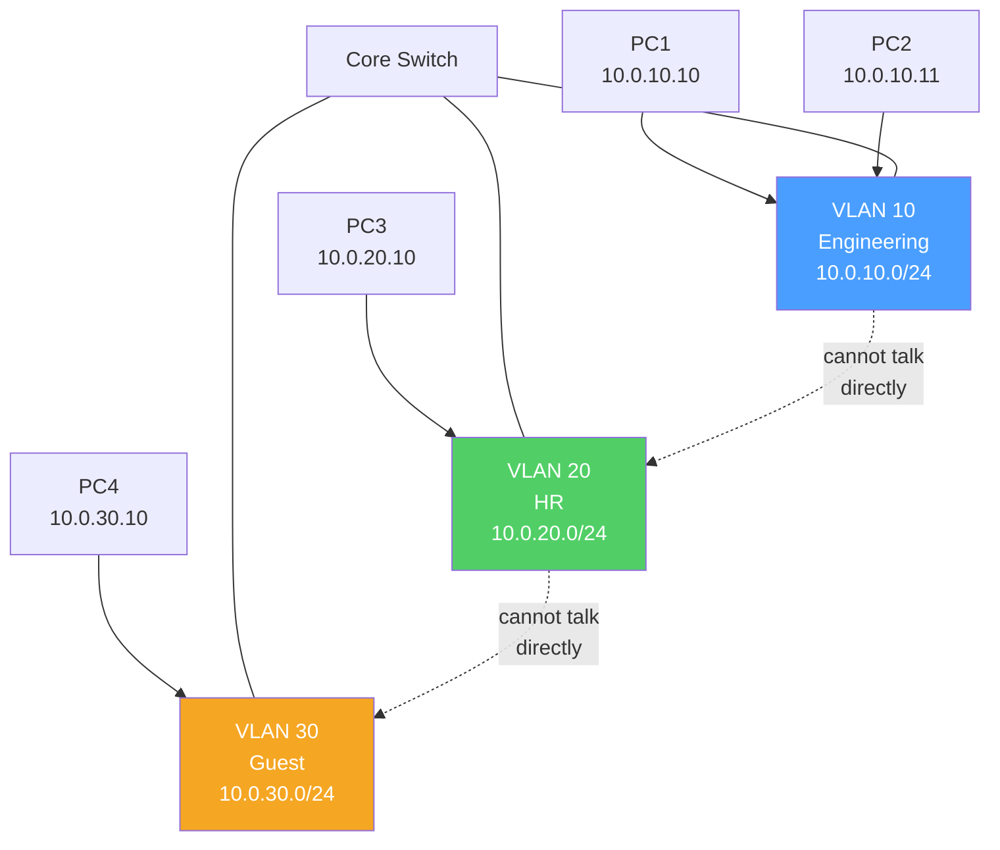

# VLAN and Switching

> [!abstract] TL;DR
> VLANs (Virtual LANs) logically segment a physical network into isolated broadcast domains — hosts in different VLANs cannot communicate without a Layer 3 router. IEEE **802.1Q** trunking carries multiple VLANs over a single link using a 4-byte tag. **Spanning Tree Protocol (STP)** prevents Layer 2 loops by blocking redundant paths; **RSTP** (802.1w) achieves sub-second convergence. Inter-VLAN routing is done via a **router-on-a-stick** (subinterfaces) or a **Layer 3 switch** (SVIs). PortFast and BPDUGuard protect edge ports from STP manipulation.

## VLAN Concepts



### IEEE 802.1Q Trunking

A trunk port carries traffic for multiple VLANs. The switch inserts a **4-byte VLAN tag** into the Ethernet frame between the Source MAC and EtherType fields:

```
[Dest MAC 6B][Src MAC 6B][802.1Q Tag 4B][EtherType 2B][Payload][FCS]
                          ^ ^           ^
                          | 12-bit VLAN ID (0-4095)
                          3-bit PCP (priority)
```

**Native VLAN:** Traffic on the native VLAN is sent **untagged** on trunk links. Both ends must agree on the native VLAN — mismatch causes a VLAN hopping security vulnerability.

### Access vs Trunk Ports

| Port Type | Description | Frame Handling |
|-----------|-------------|----------------|
| **Access port** | Assigned to a single VLAN | Frames stripped of tag when leaving; tag added when received |
| **Trunk port** | Carries multiple VLANs | 802.1Q tags preserved across the link |
| **Voice VLAN** | Access port with a secondary VLAN for IP phones | Untagged (data) + tagged (voice) on same port |

```
! Configure access port
Switch(config-if)# switchport mode access
Switch(config-if)# switchport access vlan 10

! Configure trunk port
Switch(config-if)# switchport mode trunk
Switch(config-if)# switchport trunk encapsulation dot1q
Switch(config-if)# switchport trunk allowed vlan 10,20,30
Switch(config-if)# switchport trunk native vlan 99    ! change native VLAN from default 1

! Create VLANs
Switch(config)# vlan 10
Switch(config-vlan)# name Engineering
Switch(config)# vlan 20
Switch(config-vlan)# name HR

! Verification
Switch# show vlan brief
Switch# show interfaces trunk
```

## Inter-VLAN Routing

VLANs are isolated at Layer 2 — routing is required for cross-VLAN communication.

### Option 1: Router-on-a-Stick

One physical router port configured with logical subinterfaces, one per VLAN:

```
! Router-on-a-stick configuration
Router(config)# interface GigabitEthernet0/0.10       ! subinterface for VLAN 10
Router(config-subif)# encapsulation dot1Q 10
Router(config-subif)# ip address 10.0.10.1 255.255.255.0

Router(config)# interface GigabitEthernet0/0.20       ! subinterface for VLAN 20
Router(config-subif)# encapsulation dot1Q 20
Router(config-subif)# ip address 10.0.20.1 255.255.255.0

Router(config)# interface GigabitEthernet0/0          ! enable physical interface
Router(config-if)# no shutdown
```

### Option 2: Layer 3 Switch with SVIs

More scalable — switch performs routing in hardware via **Switched Virtual Interfaces (SVIs)**:

```
! Layer 3 switch SVI configuration
Switch(config)# ip routing                   ! enable IP routing on L3 switch

Switch(config)# interface vlan 10
Switch(config-if)# ip address 10.0.10.1 255.255.255.0
Switch(config-if)# no shutdown

Switch(config)# interface vlan 20
Switch(config-if)# ip address 10.0.20.1 255.255.255.0
Switch(config-if)# no shutdown
```

## Spanning Tree Protocol (STP)

Layer 2 networks with redundant links create **broadcast storms** — a broadcast frame loops endlessly. STP prevents loops by putting redundant ports into a blocking state.

### STP Port States (802.1D)

```mermaid
stateDiagram-v2
    [*] --> Blocking : Port initialized
    Blocking --> Listening : Port selected as designated/root
    Listening --> Learning : Forward delay expires (15s)
    Learning --> Forwarding : Forward delay expires (15s)
    Forwarding --> Blocking : Topology change / BPDUs indicate loop

    note right of Blocking : Receives BPDUs only
    note right of Listening : Sends BPDUs; no MAC learning
    note right of Learning : Builds MAC table; no forwarding
    note right of Forwarding : Normal operation
```



Total convergence time (802.1D): **30-50 seconds** (2× forward delay + max age).

### Root Bridge Election

The switch with the **lowest Bridge ID** becomes the Root Bridge:
- Bridge ID = Priority (16-bit) + MAC Address (48-bit)
- Default priority: 32768 (+ VLAN ID for PVST+)

```
! Set root bridge for VLAN 10
Switch(config)# spanning-tree vlan 10 priority 4096      ! lower than default 32768
Switch(config)# spanning-tree vlan 10 root primary       ! auto-sets priority lower

! Verify
Switch# show spanning-tree vlan 10
Switch# show spanning-tree summary
```

### BPDUs (Bridge Protocol Data Units)

STP routers exchange **BPDUs** (hello messages) every 2 seconds. BPDUs contain:
- Root Bridge ID
- Root path cost
- Sender Bridge ID
- Port ID and timers

### RSTP (802.1w) — Rapid STP

RSTP reduces convergence from 30-50s to **1-2 seconds** through:
- **New port roles:** Root, Designated, Alternate, Backup
- **Proposal/Agreement mechanism** — negotiated port activation instead of timer-based
- Ports move directly to Forwarding if they qualify (no Listening/Learning wait)

```
! Enable RSTP
Switch(config)# spanning-tree mode rapid-pvst    ! per-VLAN RSTP (Cisco)
```

### PortFast and BPDUGuard

**PortFast**: Skips Listening/Learning states on access ports connected to end devices. No STP delay when a PC boots.

**BPDUGuard**: If a PortFast port receives a BPDU, it immediately error-disables the port. Prevents rogue switches being plugged in to edge ports.

```
! Enable on individual interface
Switch(config-if)# spanning-tree portfast
Switch(config-if)# spanning-tree bpduguard enable

! Enable globally for all access ports
Switch(config)# spanning-tree portfast default
Switch(config)# spanning-tree portfast bpduguard default

! Recover from err-disabled state
Switch(config-if)# shutdown
Switch(config-if)# no shutdown
! Or auto-recovery:
Switch(config)# errdisable recovery cause bpduguard
Switch(config)# errdisable recovery interval 30
```

## Key Concepts Summary

| Concept | Description |
|---------|-------------|
| **VLAN** | Layer 2 broadcast domain isolation — hosts in different VLANs need L3 routing |
| **802.1Q** | Standard trunk encapsulation — 4-byte tag inserted into Ethernet frame |
| **Native VLAN** | Untagged VLAN on trunk — mismatch = security risk |
| **STP root bridge** | Lowest Bridge ID (priority + MAC) — all paths calculated relative to root |
| **Designated port** | Forwarding port on each segment toward non-root switches |
| **Root port** | Single port per non-root switch — best path toward root bridge |
| **Blocked port** | Redundant port placed in blocking state to prevent loops |
| **PortFast** | Skip STP delays on end-host ports |
| **BPDUGuard** | Disable port if BPDU received on PortFast port |

## Common Pitfalls

- Native VLAN mismatch between trunk endpoints — traffic silently crosses VLAN boundaries (VLAN hopping attack vector)
- Leaving default VLAN 1 as native VLAN — attackers can send double-tagged frames to jump into VLAN 1
- Not enabling PortFast on access ports — hosts experience 30s delay before connectivity after connecting
- Forgetting `ip routing` on Layer 3 switches — SVIs come up but packets aren't forwarded between VLANs
- STP topology change flooding — when a port transitions, the switch flushes MAC tables and floods unicast traffic until re-learned

## Review Questions

1. A host in VLAN 10 (10.0.10.0/24) wants to communicate with a host in VLAN 20 (10.0.20.0/24) on the same physical switch. What Layer 3 component is required, and what are the two ways to implement it on Cisco hardware?
2. Two switches are connected with redundant links. Describe the STP root bridge election process. If Switch A has priority 32768 + MAC 00:00:00:00:00:01 and Switch B has priority 32768 + MAC 00:00:00:00:00:02, which becomes root?
3. A network admin plugs a consumer switch into a PortFast-enabled access port. What happens if BPDUGuard is enabled? How does the admin recover the port?

#Networking #routing-protocols #vlan #switching #stp
