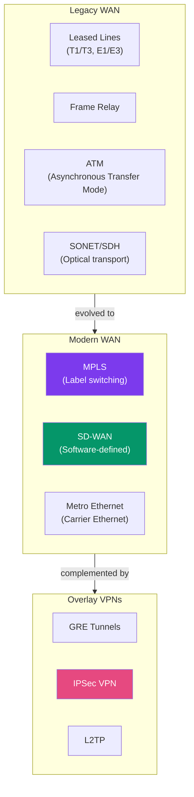
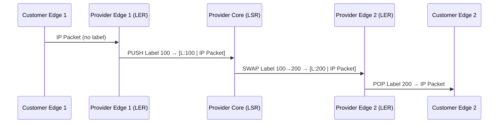
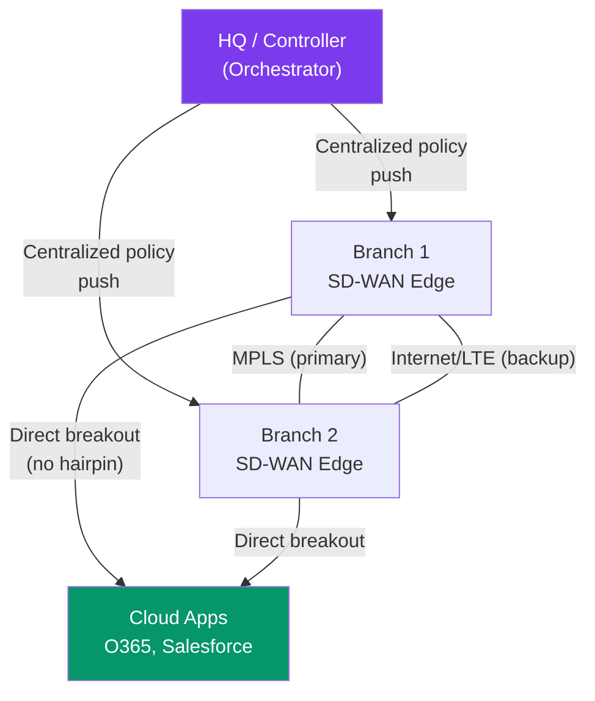

# WAN and MPLS

> [!abstract] TL;DR
> WAN technologies connect geographically dispersed sites. **MPLS** (Multiprotocol Label Switching) replaced traditional WAN circuits by forwarding packets using short **labels** rather than IP lookups — achieving wire-speed switching and enabling Layer 2/L3 VPN services. **SD-WAN** builds on commodity broadband + MPLS + LTE links with intelligent, software-driven path selection, dramatically reducing costs vs pure MPLS. **VPN tunneling** (IPSec, GRE, L2TP) provides encrypted overlays over public internet infrastructure.

## WAN Technologies Overview



| Technology | Speed | Typical Use | Cost |
|------------|-------|-------------|------|
| Leased line (T1) | 1.544 Mbps | Point-to-point, SLA-guaranteed | High |
| SONET/SDH | 51 Mbps–10 Gbps | Carrier backbone, optical rings | Very High |
| MPLS | 1 Mbps–100 Gbps | Enterprise branch connectivity | High |
| Metro Ethernet | 10 Mbps–10 Gbps | Urban enterprise connectivity | Medium |
| SD-WAN | Variable (broadband) | Modern branch with policy routing | Low–Medium |

## MPLS — Multiprotocol Label Switching

### Core Concept: Label-Based Forwarding

Traditional IP routing performs a longest-prefix match in the routing table for every packet — CPU intensive. MPLS replaces this with a simple **label lookup** at each hop.

A **4-byte MPLS label** is inserted between Layer 2 and Layer 3 headers (a "shim" header):

```
[Ethernet Header][MPLS Label 4B][IP Header][Payload]
                  ^ ^ ^ ^ ^ ^
                  20-bit label value
                  3-bit Traffic Class (QoS)
                  1-bit Stack bit (bottom-of-stack indicator)
                  8-bit TTL
```

### MPLS Forwarding Terminology

| Term | Description |
|------|-------------|
| **LSR (Label Switch Router)** | Core MPLS router — swaps labels and forwards |
| **LER (Label Edge Router)** | Ingress: adds label (PUSH); Egress: removes label (POP) |
| **LSP (Label Switched Path)** | Predetermined path through the MPLS network |
| **FEC (Forwarding Equivalence Class)** | Group of packets forwarded the same way (e.g., same destination prefix) |
| **LDP (Label Distribution Protocol)** | Protocol routers use to exchange label-to-FEC bindings |
| **Penultimate Hop Popping (PHP)** | Last LSR before egress removes the label early — egress does IP lookup |



### MPLS VPN

MPLS enables Layer 2 and Layer 3 VPN services for enterprise customers sharing the same provider infrastructure.

**MPLS L3VPN (RFC 4364):**
- Provider maintains separate **VRF (Virtual Routing and Forwarding)** tables per customer
- Customer routes are isolated — two customers can use overlapping address space
- Uses **BGP (MP-BGP)** to distribute customer routes between PE routers with **Route Distinguishers (RD)** to keep them unique

```
! Configure VRF on PE router
PE1(config)# ip vrf CUSTOMER_A
PE1(config-vrf)# rd 65100:1            ! Route Distinguisher — makes routes globally unique
PE1(config-vrf)# route-target export 65100:1
PE1(config-vrf)# route-target import 65100:1

! Bind customer interface to VRF
PE1(config)# interface GigabitEthernet0/1
PE1(config-if)# ip vrf forwarding CUSTOMER_A
PE1(config-if)# ip address 10.0.1.1 255.255.255.252
```

**MPLS L2VPN / Pseudowires:**
- Emulates a direct Layer 2 circuit between two customer sites
- Customer receives what appears to be a dedicated Ethernet or SONET link
- Technologies: VPLS (Virtual Private LAN Service), EoMPLS (Ethernet over MPLS)

## SD-WAN

### Why SD-WAN Replaced Pure MPLS

Traditional MPLS WAN drawbacks:
- Expensive dedicated circuits with long provisioning lead times (weeks to months)
- Traffic must backhaul through HQ/data center even for cloud apps (SaaS)
- No intelligent path selection across multiple WAN links
- Centralized control is manual and error-prone

**SD-WAN** overlays policy-based intelligence on multiple WAN transports (MPLS, broadband, LTE/5G):



| Feature | MPLS | SD-WAN |
|---------|------|--------|
| Cost | High | Low–Medium |
| Provisioning | Weeks–months | Hours (software) |
| Transport | Single provider circuit | Any (MPLS + broadband + LTE) |
| Path selection | Static routing | Application-aware, real-time |
| Cloud optimization | No direct breakout | Direct SaaS breakout |
| Visibility | Minimal | Per-flow application telemetry |

**Key SD-WAN vendors:** Cisco Viptela, VMware VeloCloud, Fortinet SD-WAN, Palo Alto Prisma SD-WAN.

## VPN Tunneling Technologies

### GRE (Generic Routing Encapsulation)

GRE creates a virtual point-to-point link between routers. It encapsulates the original IP packet in a new IP packet with a GRE header. GRE alone provides **no encryption**.

```
! GRE tunnel configuration
Router(config)# interface Tunnel0
Router(config-if)# ip address 172.16.0.1 255.255.255.252
Router(config-if)# tunnel source GigabitEthernet0/0    ! physical source interface
Router(config-if)# tunnel destination 203.0.113.2      ! remote endpoint IP
Router(config-if)# tunnel mode gre ip
```

### IPSec VPN

IPSec provides encryption, authentication, and integrity for IP traffic. Two modes:

| Mode | What's Protected | Use Case |
|------|-----------------|---------|
| **Transport** | IP payload only; original IP header preserved | Host-to-host encryption |
| **Tunnel** | Entire original IP packet encapsulated in new IP header | Site-to-site VPN |

IPSec protocols:
- **AH (Authentication Header)** — authentication + integrity, no encryption
- **ESP (Encapsulating Security Payload)** — authentication + integrity + encryption

GRE over IPSec is common for site-to-site VPNs: GRE provides the tunnel (multicast, routing protocols), IPSec provides encryption.

```
! IPSec site-to-site VPN (simplified)
! Phase 1 — IKE SA (authenticate peers, negotiate encryption)
crypto isakmp policy 10
 encryption aes 256
 hash sha256
 authentication pre-share
 group 14
crypto isakmp key S3cretKey address 203.0.113.2

! Phase 2 — IPSec SA (data encryption parameters)  
crypto ipsec transform-set TS esp-aes 256 esp-sha256-hmac
 mode tunnel

crypto map SITE_TO_SITE 10 ipsec-isakmp
 set peer 203.0.113.2
 set transform-set TS
 match address VPN_TRAFFIC

interface GigabitEthernet0/0
 crypto map SITE_TO_SITE
```

### L2TP (Layer 2 Tunneling Protocol)

L2TP encapsulates PPP frames and tunnels them over IP networks. Commonly used for remote-access VPNs (L2TP/IPSec). Does not provide encryption itself — typically combined with IPSec.

## WAN Optimization

Techniques to improve WAN performance without upgrading circuits:

- **Compression** — reduce data size (HTTP, file transfer)
- **Deduplication / WAN Optimization Controllers (WOC)** — cache and send deltas instead of full files
- **QoS (Quality of Service)** — prioritize latency-sensitive traffic (VoIP, video) over bulk transfers
- **TCP optimization** — proxy TCP connections to hide WAN latency from applications
- **Application acceleration** — protocol-specific optimizations (CIFS, MAPI)

## Common Pitfalls

- GRE tunnels without IPSec encrypt nothing — all traffic is readable on the public internet
- MPLS PHP (Penultimate Hop Popping) can break QoS if the PE router removes the MPLS EXP/TC bits before the egress router can apply per-class treatment
- SD-WAN application-aware routing requires accurate application signatures — miscategorized traffic misses its policy
- MTU issues with tunneling — GRE adds 24+ bytes overhead; set MSS clamping on tunnel interfaces to avoid fragmentation
  ```
  Router(config-if)# ip tcp adjust-mss 1452   ! on GRE tunnel interface
  ```

## Review Questions

1. Explain the difference between an LSR and an LER in an MPLS network. What operations (PUSH/SWAP/POP) does each perform?
2. A company has two branches connected via MPLS L3VPN. Both branches use 10.0.0.0/8 address space (overlap). How does MPLS VPN prevent routing confusion between the two customers?
3. A branch router has both an MPLS link (SLA-guaranteed, 20 Mbps) and a broadband internet link (50 Mbps, variable quality). In an SD-WAN deployment, how would you configure policy to route VoIP over MPLS and backup bulk file transfers to broadband?

#Networking #routing-protocols #wan #mpls #sdwan
