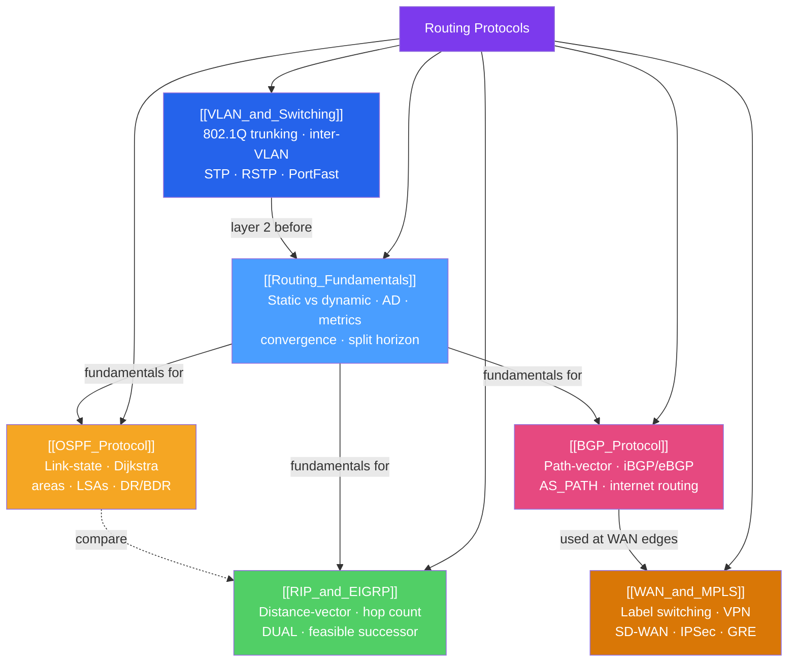

# Routing Protocols — Map of Content

> [!abstract] What This Section Covers
> This section covers the full spectrum of routing and switching technologies used in enterprise and service provider networks. From **static routes and administrative distance** to **OSPF's Dijkstra SPF** algorithm across area hierarchies, **BGP's policy-driven path-vector** internet routing, **EIGRP's DUAL** algorithm for fast convergence, **VLAN segmentation** with 802.1Q trunking and STP loop prevention, and **WAN/MPLS** label-switched paths with SD-WAN overlays. These protocols collectively determine how every packet traverses networks from a branch office to the global internet.

## Concept Map

## Learning Path

1. [[Routing_Fundamentals]] — Start here: routing tables, static routes, administrative distance, metrics, convergence, split horizon.
2. [[RIP_and_EIGRP]] — Distance-vector protocols; understand count-to-infinity before link-state.
3. [[OSPF_Protocol]] — Link-state, areas, LSA types, SPF calculation, DR/BDR election.
4. [[BGP_Protocol]] — Path-vector, iBGP/eBGP, AS_PATH manipulation, route policies, internet routing.
5. [[VLAN_and_Switching]] — Layer 2 VLANs, 802.1Q, STP, inter-VLAN routing.
6. [[WAN_and_MPLS]] — MPLS forwarding, VPNs, SD-WAN, IPSec, GRE tunnels.

## All Notes at a Glance

| Note | Difficulty | What You'll Learn |
|------|------------|-------------------|
| [[Routing_Fundamentals]] | Intermediate | Routing table, static routes, AD, metrics, split horizon, convergence |
| [[OSPF_Protocol]] | Intermediate | Link-state, Dijkstra SPF, areas, LSA types, DR/BDR, OSPFv3 |
| [[BGP_Protocol]] | Intermediate | Path-vector, iBGP/eBGP, best-path algorithm, communities, RPKI |
| [[RIP_and_EIGRP]] | Intermediate | RIPv1/v2, hop count, DUAL, feasible successor, EIGRP metric |
| [[VLAN_and_Switching]] | Intermediate | VLANs, 802.1Q trunk, inter-VLAN routing, STP, RSTP, PortFast |
| [[WAN_and_MPLS]] | Intermediate | MPLS labels, LSPs, L3VPN, SD-WAN, IPSec, GRE, WAN optimization |

## Key Questions This Section Answers

- Why does a router prefer an OSPF route over a RIP route for the same destination even when RIP's hop count is lower?
- What is the OSPF DR/BDR election process, and why is it needed on Ethernet segments?
- How does BGP's AS_PATH attribute prevent routing loops across the internet?
- What is EIGRP's feasibility condition, and why does it guarantee a loop-free backup path?
- What is a native VLAN, and why does a native VLAN mismatch create a security vulnerability?
- How does MPLS avoid per-packet IP lookups in the core, and what is Penultimate Hop Popping?

## Related Sections

- [[_MOC_Networking_Master|↑ Networking Master MOC]]
- [[_MOC_TCPIP_Protocols|← TCP/IP Protocols]]
- [[_MOC_Network_Security|→ Network Security]]
- [[_MOC_Network_Automation|→ Network Automation]]
- [[_MOC_SDN_Cloud_Networking|→ SDN and Cloud Networking]]

#MOC #Networking #routing-protocols
