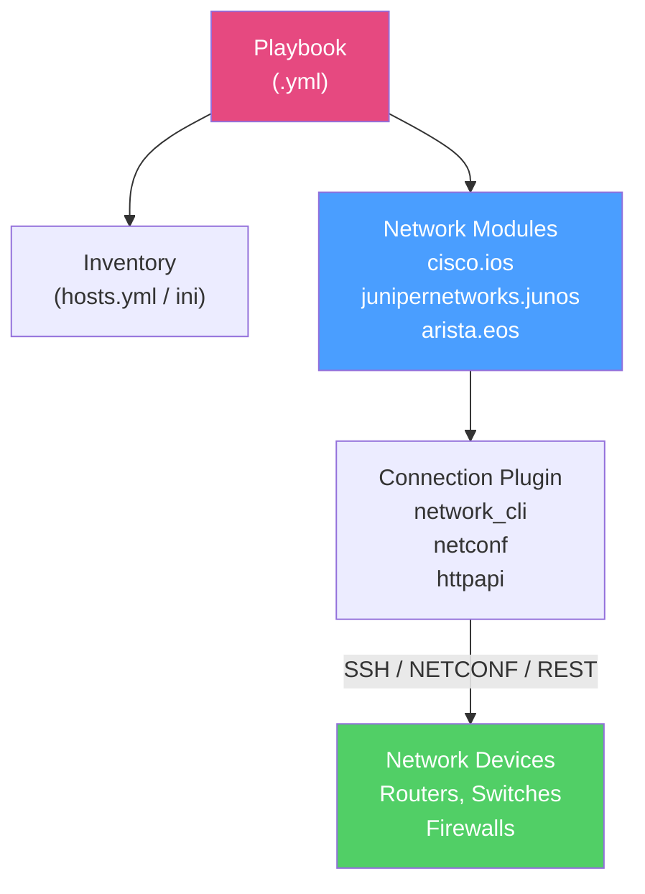

# Ansible for Networks

> [!abstract] TL;DR
> Ansible applies **agentless, idempotent configuration management** to network devices. Network modules (cisco.ios, junipernetworks.junos, arista.eos) connect via SSH or NETCONF, gather facts, and push configuration without any software installed on the device. A **playbook** describes the desired state; Ansible computes the diff and applies only what's needed. **Ansible Tower / AWX** adds a GUI, role-based access, scheduling, and audit logging for enterprise use.

## How Ansible Works for Network Devices



Ansible **does not require an agent** on managed devices — it connects from the control node (or AWX) directly via SSH or API.

## Inventory for Network Devices

The inventory defines which devices to manage and how to connect to them.

```yaml
# inventory/hosts.yml
all:
  children:
    cisco_routers:
      hosts:
        router1:
          ansible_host: 192.168.1.1
          ansible_network_os: cisco.ios.ios
          ansible_user: admin
          ansible_password: "{{ vault_password }}"  # from Ansible Vault
          ansible_connection: network_cli
          ansible_become: yes
          ansible_become_method: enable
          ansible_become_password: "{{ vault_enable }}"
        router2:
          ansible_host: 192.168.1.2
          ansible_network_os: cisco.ios.ios
    juniper_switches:
      hosts:
        switch1:
          ansible_host: 192.168.2.1
          ansible_network_os: junipernetworks.junos.junos
          ansible_connection: netconf
    arista_switches:
      hosts:
        eos1:
          ansible_host: 192.168.3.1
          ansible_network_os: arista.eos.eos
          ansible_connection: httpapi
          ansible_httpapi_use_ssl: true
```

## Connection Types

| Connection Type | Protocol | Best For |
|-----------------|----------|---------|
| **network_cli** | SSH → CLI | Cisco IOS/IOS-XE, most traditional devices |
| **netconf** | NETCONF (SSH port 830) | Juniper JunOS, Cisco IOS-XE with NETCONF, structured data |
| **httpapi** | HTTPS REST API | Arista EOS, Cisco NX-OS, F5 BIG-IP |
| **local** | Delegate to control node | Legacy — avoid for new playbooks |

## Playbook Structure for Network Tasks

```yaml
# playbooks/configure_ospf.yml
---
- name: Configure OSPF on Cisco routers
  hosts: cisco_routers
  gather_facts: false     # skip Linux facts — network devices don't support them

  vars:
    ospf_process_id: 1
    ospf_router_id: "{{ inventory_hostname_short }}.1.1.1"

  tasks:
    - name: Gather device facts
      cisco.ios.ios_facts:
        gather_subset: all

    - name: Configure OSPF process
      cisco.ios.ios_ospf_interfaces:
        config:
          - name: GigabitEthernet0/0
            address_family:
              - afi: ipv4
                process:
                  id: "{{ ospf_process_id }}"
                  area_id: 0
        state: merged    # only add/change; don't remove existing config

    - name: Save running config to startup
      cisco.ios.ios_command:
        commands:
          - write memory
```

## Idempotent Configuration Management

Ansible network modules support **resource states**:

| State | Behavior |
|-------|---------|
| `merged` | Add/update specified config; preserve existing unspecified config |
| `replaced` | Replace the specified resource entirely; remove unspecified sub-items |
| `deleted` | Remove specified configuration |
| `gathered` | Read device config into Ansible variables |
| `rendered` | Generate config without connecting to device (testing) |
| `parsed` | Parse a config string into structured data |

```yaml
# Idempotent VLAN configuration — safe to run multiple times
- name: Ensure VLANs exist
  cisco.ios.ios_vlans:
    config:
      - vlan_id: 10
        name: Engineering
      - vlan_id: 20
        name: HR
      - vlan_id: 30
        name: Guest
    state: merged
```

## Backup and Restore Configs

```yaml
# playbooks/backup_configs.yml
---
- name: Backup all network device configurations
  hosts: all
  gather_facts: false

  tasks:
    - name: Backup Cisco IOS config
      cisco.ios.ios_config:
        backup: yes
        backup_options:
          filename: "{{ inventory_hostname }}_{{ ansible_date_time.date }}.cfg"
          dir_path: /backups/network/
      when: ansible_network_os == "cisco.ios.ios"

    - name: Backup Juniper config
      junipernetworks.junos.junos_config:
        backup: yes
        backup_options:
          filename: "{{ inventory_hostname }}_{{ ansible_date_time.date }}.cfg"
          dir_path: /backups/network/
      when: ansible_network_os == "junipernetworks.junos.junos"
```

## Gathering Network Facts

Ansible can collect structured device information and register it for use in later tasks:

```yaml
- name: Collect interface information
  hosts: cisco_routers
  gather_facts: false

  tasks:
    - name: Gather interface facts
      cisco.ios.ios_facts:
        gather_subset:
          - interfaces
          - default
      register: device_facts

    - name: Display all interfaces
      ansible.builtin.debug:
        msg: "{{ device_facts.ansible_facts.ansible_net_interfaces }}"

    - name: Check for interfaces with no description
      ansible.builtin.debug:
        msg: "Interface {{ item.key }} has no description!"
      loop: "{{ device_facts.ansible_facts.ansible_net_interfaces | dict2items }}"
      when: item.value.description is not defined or item.value.description == ""
```

## Jinja2 Templates for Config Generation

Use Jinja2 templates to generate device-specific configs from shared templates + per-device variables:

```jinja2
{# templates/router_base.j2 #}
hostname {{ hostname }}
!

interface {{ interface.name }}
 description {{ interface.description }}
 ip address {{ interface.ip }} {{ interface.mask }}
 
 ip ospf {{ ospf_process }} area {{ interface.ospf_area }}
 
 no shutdown
!

!
router ospf {{ ospf_process }}
 router-id {{ router_id }}
```

```yaml
# host_vars/router1.yml
hostname: router1
ospf_process: 1
router_id: 1.1.1.1
interfaces:
  - name: GigabitEthernet0/0
    description: "Uplink to Core"
    ip: 10.0.0.1
    mask: 255.255.255.252
    ospf_area: 0
```

```yaml
# playbook task to render and push template
- name: Push base configuration
  cisco.ios.ios_config:
    src: templates/router_base.j2
```

## Ansible Tower / AWX

**Ansible Tower** (commercial) and **AWX** (open-source upstream) provide:

- **Web GUI** for running playbooks without CLI access
- **Role-Based Access Control (RBAC)** — teams can only run approved playbooks
- **Scheduling** — run backups nightly, compliance checks weekly
- **Audit logging** — every job run recorded with user, time, and output
- **Credential management** — SSH keys and passwords stored encrypted, not in playbooks
- **Inventory synchronization** — dynamic inventory from CMDB, NetBox, or cloud

Typical enterprise workflow:
1. Network engineer writes playbook → pushes to Git
2. CI pipeline lints playbook (`ansible-lint`, `yamllint`)
3. Peer review via pull request
4. AWX syncs playbook from Git, runs on approval
5. Audit log records change for compliance

## Common Pitfalls

- Using `ios_command` (sends raw CLI) instead of resource modules like `ios_vlans` — raw commands are not idempotent
- `gather_facts: true` on network devices causes playbook failure — always set `gather_facts: false` and use `ios_facts` explicitly
- Not using Ansible Vault for credentials — never put passwords in plaintext in inventory or playbooks
- Forgetting `state: merged` vs `state: replaced` — `replaced` will remove VLANs/routes not listed in the task

## Review Questions

1. What is the difference between `ios_command` and `ios_config` modules? Which is idempotent, and when would you use each?
2. A playbook configures VLANs on a switch with `state: replaced`. The task lists VLANs 10, 20, 30. The switch currently has VLANs 10, 20, 40. What happens to VLAN 40?
3. Your team uses AWX. A junior engineer requests access to deploy OSPF configs but should not be able to modify BGP policies. How does AWX's RBAC model accommodate this?

#Networking #network-automation #ansible
