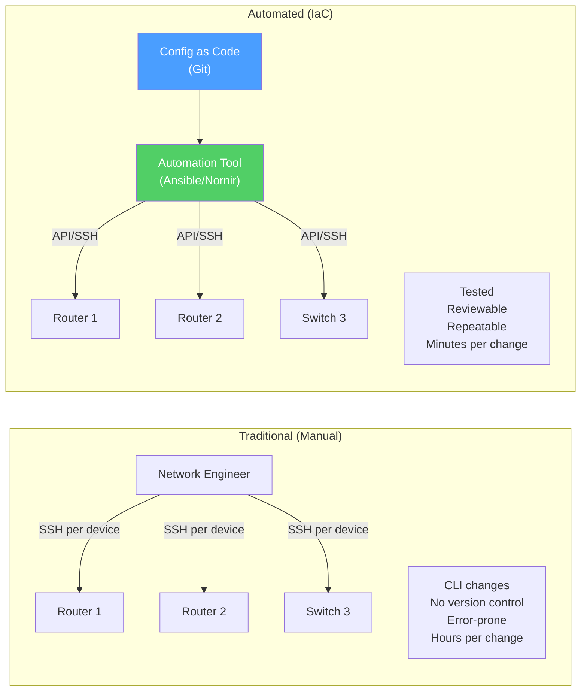
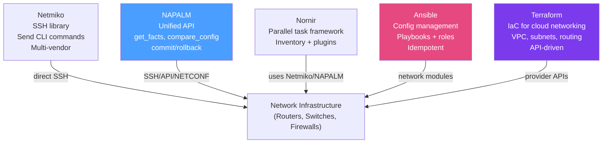

# Network Automation Overview

> [!abstract] TL;DR
> Network automation replaces manual CLI-per-device configuration with **programmatic, repeatable, version-controlled** workflows. Key principles: **idempotency** (running automation twice produces the same result as running it once), **declarative** definitions (describe desired state; the tool figures out how), and **Infrastructure as Code** (network configs in Git, reviewed like software). The automation toolchain spans SSH-based scripting (Netmiko), unified APIs (NAPALM), configuration management (Ansible), parallel task frameworks (Nornir), and IaC platforms (Terraform for cloud networking).

## Traditional vs Automated Network Management



### Pain Points Solved by Automation

| Problem | Manual Approach | Automated Approach |
|---------|----------------|-------------------|
| **Scale** | Log in to each device | Inventory-driven — run once against thousands |
| **Consistency** | Human typos, forgotten devices | Template-rendered configs applied uniformly |
| **Speed** | Hours to days for large changes | Minutes with parallel execution |
| **Auditability** | No record of who changed what | Git history, change approval, CI/CD pipelines |
| **Recovery** | Manual re-config from runbooks | Re-apply known-good config from code |
| **Testing** | Manual verification on each box | Automated post-change verification |

## Infrastructure as Code (IaC) for Networking

IaC applies software engineering practices to network configuration:

1. **Version control** — network configs in Git; every change is a commit with author and message
2. **Code review** — changes reviewed via pull requests before deployment
3. **CI/CD pipelines** — automated testing (config syntax check, linting) before merge
4. **Idempotency** — safe to re-run; only actual differences are applied
5. **Rollback** — revert a commit and re-apply to restore previous state

### Declarative vs Imperative Automation

**Imperative:** Specify the exact sequence of commands to execute.

```python
# Imperative — tell the device what commands to run
device.send_command("interface GigabitEthernet0/1")
device.send_command("ip address 10.0.1.1 255.255.255.0")
device.send_command("no shutdown")
```

**Declarative:** Specify the desired end state; the tool determines the required changes.

```yaml
# Declarative — describe what the interface SHOULD look like
interfaces:
  GigabitEthernet0/1:
    ip_address: 10.0.1.1/24
    state: up
    description: "Uplink to Core"
```

Declarative is generally preferred for IaC — it is idempotent by nature and easier to reason about.

## Idempotency

A function is **idempotent** if applying it multiple times produces the same result as applying it once.

```python
# Non-idempotent — adds the ACL entry every time, creating duplicates
def add_acl_entry(device, entry):
    device.send_command(f"ip access-list extended WEB-ACL")
    device.send_command(f"permit tcp any host {entry} eq 80")

# Idempotent — checks before acting; safe to re-run
def ensure_acl_entry(device, entry):
    current = device.send_command("show ip access-lists WEB-ACL")
    if entry not in current:
        device.send_command(f"ip access-list extended WEB-ACL")
        device.send_command(f"permit tcp any host {entry} eq 80")
```

Ansible and NAPALM are designed with idempotency as a core principle.

## The Network Automation Tool Landscape



| Tool | Type | Best For | Execution |
|------|------|---------|-----------|
| **Netmiko** | Python library | SSH to any device; send/receive CLI | Sequential (by default) |
| **NAPALM** | Python library | Unified multi-vendor API; config comparison | Sequential |
| **Nornir** | Python framework | Parallel execution across large inventories | Parallel (threaded) |
| **Ansible** | Config management | Agentless config management; CI/CD integration | Sequential per host (parallelizable) |
| **Terraform** | IaC platform | Cloud networking (AWS VPC, Azure VNet, GCP) | Declarative state management |
| **Scapy** | Packet library | Packet crafting, network testing, security research | N/A |

## Python's Role in Network Automation

Python dominates network automation because:
- **Rich library ecosystem** — Netmiko, NAPALM, Nornir, Scapy, textfsm, ntc-templates
- **Jinja2 templating** — generate device configs from templates + variables
- **JSON/YAML/XML** — native parsing of modern API responses
- **Widespread adoption** — vendor support, community resources

```python
# Minimal example: connect and collect info from 10 devices
from netmiko import ConnectHandler
import yaml

with open("inventory.yml") as f:
    devices = yaml.safe_load(f)

for device in devices:
    with ConnectHandler(**device) as conn:
        output = conn.send_command("show version")
        print(f"{device['host']}: {output[:50]}")
```

## Common Pitfalls

- Running non-idempotent scripts in automation pipelines — duplicate ACL entries, duplicate route statements accumulate over time
- No pre-change backup — always capture device state before applying changes so you can diff and roll back
- Hardcoding credentials in scripts — use Ansible Vault, environment variables, or HashiCorp Vault for secrets management
- Assuming all devices respond identically to the same command — multi-vendor environments need abstraction layers (NAPALM, Ansible network modules)

## Review Questions

1. Explain the difference between declarative and imperative network automation. Give a concrete example of each for configuring an OSPF neighbor.
2. Why is idempotency critical for network automation? What could go wrong if a configuration script is not idempotent and is re-run after a partial failure?
3. A network team manages 500 routers across 10 vendors. They need to collect interface statistics every hour. Which tool from the landscape best fits this use case, and why?

#Networking #network-automation
