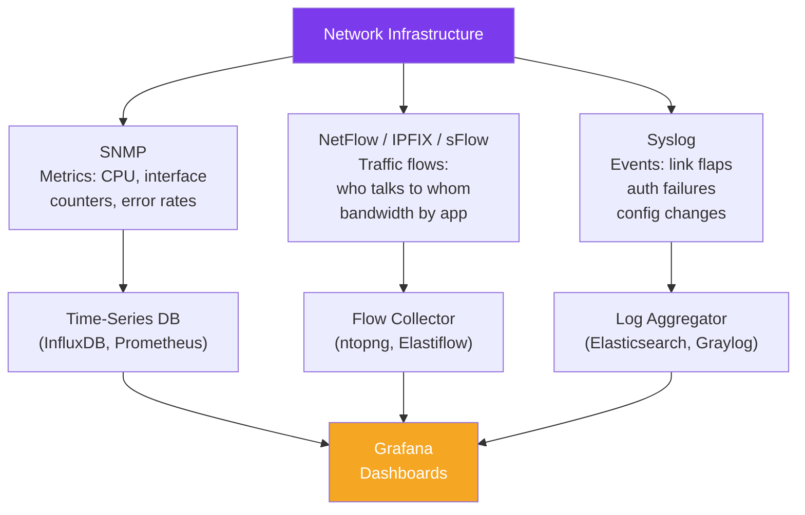

# SNMP and Network Monitoring

> [!abstract] TL;DR
> **SNMP** (Simple Network Management Protocol) is the standard protocol for reading and setting network device parameters. **NetFlow/sFlow/IPFIX** provide per-flow traffic analysis. **Syslog** captures device events. Together, these three pillars — metrics (SNMP), flows (NetFlow), logs (syslog) — form the foundation of network observability. Tools like **Zabbix**, **Nagios**, and **LibreNMS** aggregate SNMP polls; **Grafana + Prometheus** with exporters provide modern dashboards; **Wireshark/tcpdump** analyze individual packets.

## Network Monitoring Pillars



## SNMP — Simple Network Management Protocol

### SNMP Architecture

| Component | Role |
|-----------|------|
| **NMS (Network Management Station)** | Polling station — sends SNMP requests, receives traps |
| **Agent** | Software on managed device — responds to polls, sends traps |
| **MIB (Management Information Base)** | Hierarchical database of manageable objects (OIDs) |
| **OID (Object Identifier)** | Unique dotted-notation identifier for each metric |

### SNMP Versions

| Version | Security | Key Feature |
|---------|----------|-------------|
| **SNMPv1** | Community string (plaintext) | Original; avoid — no encryption |
| **SNMPv2c** | Community string (plaintext) | 64-bit counters (critical for 10G+ links), bulk operations |
| **SNMPv3** | USM (User-based Security Model) | Authentication (MD5/SHA) + encryption (DES/AES) |

Always use **SNMPv3** on production networks. SNMPv1/v2c community strings are transmitted in plaintext — any sniffer on the network can read them.

### SNMP Operations

```
NMS                    Agent (Device)
 |                          |
 |-- GET(OID) -----------> |   Read single value
 |<-- GET-Response --------|
 |                          |
 |-- GET-NEXT(OID) ------> |   Walk the MIB tree
 |<-- GET-Response --------|
 |                          |
 |-- GET-BULK(OID, max) -> |   Efficient bulk read (v2c/v3)
 |<-- GET-Response --------|
 |                          |
 |-- SET(OID, value) ----> |   Write a value (e.g., shutdown interface)
 |<-- SET-Response --------|
 |                          |
 |<-- TRAP (async) --------|   Device-initiated alert (link down, temp high)
```

### Common OIDs

| OID | Description |
|-----|-------------|
| `1.3.6.1.2.1.1.5.0` | sysName — device hostname |
| `1.3.6.1.2.1.2.2.1.8.x` | ifOperStatus — interface x operational state |
| `1.3.6.1.2.1.2.2.1.10.x` | ifInOctets — bytes received on interface x |
| `1.3.6.1.2.1.2.2.1.16.x` | ifOutOctets — bytes sent on interface x |
| `1.3.6.1.4.1.9.9.109.1.1.1.1.6.x` | Cisco CPU utilization (5-min) |
| `1.3.6.1.4.1.9.9.48.1.1.1.5.1` | Cisco free memory |

### SNMP Configuration

```
! Cisco IOS — SNMPv3 configuration (preferred)
Router(config)# snmp-server group NETOPS v3 priv           ! group with auth+encryption
Router(config)# snmp-server user MONITOR NETOPS v3 \
  auth sha AuthP@ssw0rd \
  priv aes 256 PrivP@ssw0rd

! Allow NMS to poll from specific host
Router(config)# snmp-server host 10.0.1.100 version 3 priv MONITOR

! Enable interface traps for link up/down events
Router(config)# snmp-server enable traps snmp linkdown linkup
Router(config)# snmp-server enable traps bgp

! SNMPv2c (legacy — use only if v3 not supported)
Router(config)# snmp-server community PUBLIC_RO ro     ! read-only
Router(config)# snmp-server community PRIVATE_RW rw    ! read-write (risky)
```

### SNMP with Python

```python
from pysnmp.hlapi import *

# Poll a single OID — interface operational status
def get_snmp_value(host, community, oid):
    iterator = getCmd(
        SnmpEngine(),
        CommunityData(community, mpModel=1),    # mpModel=1 = SNMPv2c
        UdpTransportTarget((host, 161)),
        ContextData(),
        ObjectType(ObjectIdentity(oid))
    )
    error_indication, error_status, error_index, var_binds = next(iterator)
    if not error_indication:
        for var_bind in var_binds:
            return var_bind[1]

status = get_snmp_value("192.168.1.1", "PUBLIC_RO", "1.3.6.1.2.1.2.2.1.8.1")
print(f"Interface 1 status: {status}")  # 1=up, 2=down
```

## NetFlow / sFlow / IPFIX — Traffic Analysis

### NetFlow

NetFlow (Cisco) and IPFIX (IETF standard) export **flow records** — summaries of conversations between IPs.

A **flow** is a unidirectional sequence of packets sharing the same:
- Source/destination IP
- Source/destination port
- Protocol (TCP/UDP/ICMP)
- DSCP / ToS marking

Flow records are exported to a **flow collector** for analysis.

```
! Enable NetFlow on Cisco IOS interface
Router(config)# interface GigabitEthernet0/0
Router(config-if)# ip flow ingress
Router(config-if)# ip flow egress

! Export to collector
Router(config)# ip flow-export destination 10.0.1.200 9995   ! UDP port 9995
Router(config)# ip flow-export version 9                      ! NetFlow v9 or IPFIX (v10)
Router(config)# ip flow-export source Loopback0
```

### sFlow

sFlow samples 1 in N packets (e.g., 1 in 1000) and exports the raw sampled packet header + interface counters. Lower overhead than NetFlow (no flow state), but statistical approximation.

| Protocol | Method | State on Device | Accuracy |
|----------|--------|-----------------|---------|
| NetFlow | Track all flows, export summaries | Flow cache (CPU/memory) | Exact |
| IPFIX | NetFlow v10 (standardized) | Flow cache | Exact |
| sFlow | Sample 1-in-N packets | Stateless | Statistical |

### Key Use Cases for Flow Data

- **Top talkers** — which hosts generate the most bandwidth?
- **Application breakdown** — HTTPS vs video streaming vs backup traffic by port
- **DDoS detection** — sudden volume spike from many sources to one destination
- **Capacity planning** — bandwidth trending per circuit over time

## Syslog — Event Logging

```
! Cisco IOS syslog configuration
Router(config)# logging host 10.0.1.150
Router(config)# logging trap informational      ! severity 0-6 (debug=7)
Router(config)# logging facility local6
Router(config)# service timestamps log datetime msec   ! add timestamps
```

Syslog severity levels (0=most critical):

| Level | Name | Example |
|-------|------|---------|
| 0 | Emergency | System unusable |
| 1 | Alert | Immediate action needed |
| 2 | Critical | Critical conditions |
| 3 | Error | Error conditions (interface down) |
| 4 | Warning | Warning conditions |
| 5 | Notice | Normal but significant |
| 6 | Informational | Config changes, neighbor state |
| 7 | Debug | Verbose per-packet debug |

## Monitoring Platforms

| Platform | Type | Strengths |
|---------|------|-----------|
| **Nagios** | Active polling | Industry standard; plugin ecosystem; alerting |
| **Zabbix** | Active + passive | Enterprise features; auto-discovery; built-in dashboards |
| **LibreNMS** | SNMP-based | Auto-discovery; free; syslog + NetFlow integration |
| **Prometheus + Grafana** | Pull metrics + visualization | Modern; rich dashboards; alerting rules |
| **PRTG** | Commercial | All-in-one; easy setup; flow + SNMP + ping |

### Prometheus + SNMP Exporter

```yaml
# prometheus/scrape_configs in prometheus.yml
- job_name: "network_snmp"
  static_configs:
    - targets:
        - 192.168.1.1    # router
        - 192.168.1.2    # switch
  metrics_path: /snmp
  params:
    module: [if_mib]           # interface MIB module
  relabel_configs:
    - source_labels: [__address__]
      target_label: __param_target
    - target_label: __address__
      replacement: snmp-exporter:9116    # SNMP exporter address
```

## Network Baselining

A **baseline** documents normal behavior — used to detect deviations:

1. Collect 2-4 weeks of SNMP counters and flow data
2. Calculate average and peak utilization per interface, per hour, per day
3. Set alert thresholds at e.g. 80% of peak (utilization), 3× standard deviation (packet loss)
4. Store baselines in version control — compare after network changes

## Common Pitfalls

- Using SNMPv2c with default community string `public` — change immediately; this is the most common misconfiguration
- 32-bit interface counters wrap at ~4 GB — on 10 Gbps links this happens in under an hour; always use SNMPv2c/v3 with 64-bit counters (`ifHCInOctets`, `ifHCOutOctets`)
- Polling interval too low — polling 1000 devices every 30 seconds generates significant CPU load on devices; default 5-minute polling is standard
- NetFlow cache exhaustion on high-traffic devices — tune `ip flow-cache entries` appropriately for the traffic profile

## Review Questions

1. Explain the difference between an SNMP TRAP and a GET operation. Which is device-initiated? Why would you configure both polling and traps for interface monitoring?
2. A router has a 10 Gbps WAN interface. Your NetFlow collector shows average 4 Gbps utilization, but users report slowness. What does sFlow offer that NetFlow doesn't in this scenario, and what would you investigate?
3. Your team discovers the router has SNMPv2c with community string "public" accessible from the internet. What are the security risks, and what are the three immediate remediation steps?

#Networking #network-automation #snmp #monitoring
