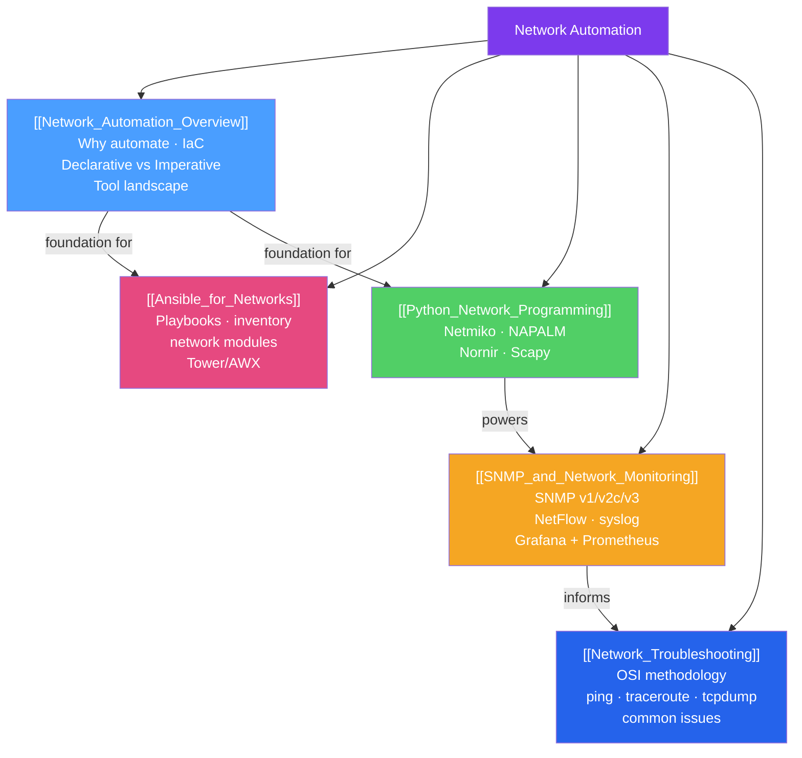

# Network Automation — Map of Content

> [!abstract] What This Section Covers
> Network automation eliminates manual, error-prone CLI management of individual devices by applying software engineering practices — version control, code review, testing, and CI/CD — to network configuration and operations. This section covers the **philosophy** (IaC, idempotency, declarative vs imperative), the **Python toolkit** (Netmiko, NAPALM, Nornir, Scapy), **Ansible** for agentless config management, **SNMP/NetFlow/syslog** for observability, and systematic **troubleshooting methodology** with the essential diagnostic toolkit.

## Concept Map

## Learning Path

1. [[Network_Automation_Overview]] — Start here: understand why automation matters, IaC principles, idempotency, and the tool landscape.
2. [[Python_Network_Programming]] — Learn the Python libraries (Netmiko, NAPALM, Nornir) hands-on.
3. [[Ansible_for_Networks]] — Apply declarative config management with Ansible network modules.
4. [[SNMP_and_Network_Monitoring]] — Set up monitoring: SNMP polls, NetFlow collection, syslog aggregation, Grafana dashboards.
5. [[Network_Troubleshooting]] — Master the diagnostic methodology and command toolkit.

## All Notes at a Glance

| Note | Difficulty | What You'll Learn |
|------|------------|-------------------|
| [[Network_Automation_Overview]] | Intermediate | IaC, idempotency, declarative vs imperative, tool comparison |
| [[Ansible_for_Networks]] | Intermediate | Network modules, inventory, playbooks, Jinja2 templates, AWX |
| [[Python_Network_Programming]] | Intermediate | Netmiko SSH, NAPALM unified API, Nornir parallel tasks, Scapy |
| [[SNMP_and_Network_Monitoring]] | Intermediate | SNMPv1/v2c/v3, OIDs/MIBs, NetFlow, syslog, Grafana+Prometheus |
| [[Network_Troubleshooting]] | Intermediate | OSI methodology, ping/traceroute/tcpdump, common issues, documentation |

## Key Questions This Section Answers

- What makes an automation script idempotent, and why does it matter for network operations?
- How does Ansible's `state: merged` differ from `state: replaced` when managing VLAN configs?
- What is NAPALM's compare/commit workflow, and how does it differ from raw Ansible `ios_command`?
- Why must you use SNMPv3 instead of v2c on production networks?
- What are 64-bit SNMP counters (`ifHCInOctets`), and when do 32-bit counters become a problem?
- How do you use tcpdump to capture only OSPF traffic, and what filter would you write?

## Related Sections

- [[_MOC_Networking_Master|↑ Networking Master MOC]]
- [[_MOC_Routing_Protocols|← Routing Protocols]]
- [[_MOC_SDN_Cloud_Networking|← SDN and Cloud Networking]]
- [[_MOC_Network_Security|→ Network Security]]

#MOC #Networking #network-automation
