# 🌐 Networking — Master Map of Content

> [!abstract] About This Vault
> A production-focused computer networking reference: **48 notes across 8 sections**, covering the full stack from physical signaling and Ethernet framing up through TCP/IP internals, application protocols, transport security, wireless/cellular, software-defined cloud networking, routing protocols (OSPF, BGP, EIGRP, VLANs, MPLS), and network automation (Ansible, Python, SNMP, monitoring). Every note pairs an intuition-first analogy with detailed diagrams, configuration snippets, trade-off tables, and review questions.

## Vault Architecture

```mermaid
graph TD
    Master["🌐 Networking Master"]

    Master --> S01["01 OSI Model Fundamentals"]
    Master --> S02["02 TCP/IP Protocols"]
    Master --> S03["03 Application Protocols"]
    Master --> S04["04 Network Security"]
    Master --> S05["05 Wireless & Mobile"]
    Master --> S06["06 SDN & Cloud Networking"]
    Master --> S07["07 Routing Protocols"]
    Master --> S08["08 Network Automation"]

    S07 --> R1["Routing Fundamentals"]
    S07 --> R2["OSPF"]
    S07 --> R3["BGP"]
    S07 --> R4["RIP & EIGRP"]
    S07 --> R5["VLAN & Switching"]
    S07 --> R6["WAN & MPLS"]

    S08 --> A1["Automation Overview"]
    S08 --> A2["Ansible for Networks"]
    S08 --> A3["Python Network Programming"]
    S08 --> A4["SNMP & Monitoring"]
    S08 --> A5["Troubleshooting"]

    style Master fill:#7c3aed,color:#fff
    style S01 fill:#2563eb,color:#fff
    style S02 fill:#2563eb,color:#fff
    style S03 fill:#059669,color:#fff
    style S04 fill:#dc2626,color:#fff
    style S05 fill:#d97706,color:#fff
    style S06 fill:#0891b2,color:#fff
    style S07 fill:#059669,color:#fff
    style S08 fill:#7c3aed,color:#fff
```

## Sections at a Glance

| # | Section | Notes | Entry Point | Difficulty |
|---|---------|-------|-------------|------------|
| 01 | OSI Model Fundamentals | 5 | [[_MOC_OSI_Fundamentals]] | Beginner |
| 02 | TCP/IP Protocols | 5 | [[_MOC_TCPIP_Protocols]] | Beginner → Intermediate |
| 03 | Application Protocols | 5 | [[_MOC_Application_Protocols]] | Intermediate |
| 04 | Network Security | 5 | [[_MOC_Network_Security]] | Intermediate → Advanced |
| 05 | Wireless & Mobile | 5 | [[_MOC_Wireless_Mobile]] | Intermediate |
| 06 | SDN & Cloud Networking | 5 | [[_MOC_SDN_Cloud_Networking]] | Advanced |
| 07 | Routing Protocols | 6 | [[_MOC_Routing_Protocols]] | Intermediate → Advanced |
| 08 | Network Automation | 5 | [[_MOC_Network_Automation]] | Intermediate → Advanced |

---

## Learning Paths

### Path 1 — Network Engineer

> Best for: engineers who configure, operate, and troubleshoot physical and logical network infrastructure.

**OSI Fundamentals → TCP/IP → Routing → Wireless**

[[_MOC_OSI_Fundamentals]] → [[OSI_Reference_Model]] → [[Physical_Layer]] → [[Data_Link_Layer]] → [[_MOC_TCPIP_Protocols]] → [[IP_Addressing_CIDR]] → [[Routing_Protocols]] → [[TCP_Protocol]] → [[ARP_ICMP]] → [[_MOC_Wireless_Mobile]] → [[WiFi_Standards_802_11]] → [[Cellular_4G_5G]]

---

### Path 2 — Security Engineer

> Best for: engineers hardening networks, implementing zero-trust, and protecting data in transit.

**OSI → TCP/IP → Security**

[[OSI_Reference_Model]] → [[Transport_Layer]] → [[_MOC_TCPIP_Protocols]] → [[TCP_Protocol]] → [[_MOC_Network_Security]] → [[TLS_SSL]] → [[Firewalls_and_IDS]] → [[VPN_and_Tunneling]] → [[Network_Attacks]] → [[Zero_Trust_Networking]]

---

### Path 3 — Cloud Architect

> Best for: architects designing VPC topologies, service meshes, and cloud-native networking.

**TCP/IP → Application Protocols → SDN & Cloud**

[[_MOC_TCPIP_Protocols]] → [[IP_Addressing_CIDR]] → [[Routing_Protocols]] → [[_MOC_Application_Protocols]] → [[DNS_Protocol]] → [[HTTP_HTTPS]] → [[_MOC_SDN_Cloud_Networking]] → [[Software_Defined_Networking]] → [[Cloud_Networking_AWS_Azure]] → [[Service_Mesh]] → [[Network_Automation]]

---

### Path 4 — Software Developer

> Best for: developers who need to understand the protocols their code uses over the wire.

**Application Protocols → Security → TCP/IP**

[[_MOC_Application_Protocols]] → [[HTTP_HTTPS]] → [[DNS_Protocol]] → [[DHCP_Protocol]] → [[_MOC_Network_Security]] → [[TLS_SSL]] → [[_MOC_TCPIP_Protocols]] → [[TCP_Protocol]] → [[UDP_Protocol]] → [[ARP_ICMP]]

---

## Cross-Vault Links

This vault is the networking deep dive that grounds systems-level design and protocol knowledge:

- **System Design vault** — Architecture-level companions: load balancers, CDNs, API gateways, service discovery. Where System Design frames the *decision*, this vault covers the *protocol mechanics*.
- **Database vault** — [[_MOC_Database_Master]] — Databases communicate over networks; TCP connections, TLS, connection pooling, and DNS resolution all apply to database access patterns.
- **AI-ML vault** — [[_MOC_AI_ML_Master]] — Distributed ML training, gRPC inference endpoints, and model serving all rely on the networking concepts covered here.

---

## Section MOC Index

- [[_MOC_OSI_Fundamentals]] — The seven-layer reference model: physical signaling, Ethernet framing, IP routing, and TCP transport — the shared vocabulary of all networking.
- [[_MOC_TCPIP_Protocols]] — The internet's load-bearing core: IP addressing and subnetting, TCP reliability and congestion control, UDP, routing protocols, and ICMP diagnostics.
- [[_MOC_Application_Protocols]] — The contracts applications speak: DNS, HTTP/1.1/2/3, SMTP/IMAP, FTP/SFTP, and DHCP.
- [[_MOC_Network_Security]] — Protecting data in transit: TLS 1.3 handshake, firewalls, VPN protocols, DDoS mitigation, and zero-trust architecture.
- [[_MOC_Wireless_Mobile]] — Shared, unlicensed air: Wi-Fi 6/6E/7, Bluetooth/BLE, 5G NR architecture, Mobile IP, and IoT protocols.
- [[_MOC_SDN_Cloud_Networking]] — Programmable networks at scale: SDN/OpenFlow, NFV, cloud VPC networking, service mesh, and network automation.
- [[_MOC_Routing_Protocols]] — Dynamic routing at depth: static vs dynamic routing, OSPF neighbor states and LSA types, BGP path-vector and best-path algorithm, EIGRP DUAL, VLANs/STP/802.1Q, MPLS label switching, and SD-WAN.
- [[_MOC_Network_Automation]] — Automating the network: IaC principles, Ansible network modules, Netmiko/NAPALM/Nornir in Python, SNMP/NetFlow/sFlow monitoring, Prometheus SNMP Exporter, and systematic troubleshooting methodology.

#MOC #Networking #MasterMOC
