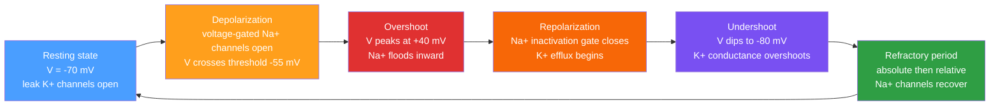

# ⚡ Action Potentials and Resting Membrane Potential

> [!abstract] TL;DR
> The **resting membrane potential** (~−70 mV) arises from asymmetric ion distributions actively maintained by the Na⁺/K⁺-ATPase and from selective membrane permeability, together quantified by the Goldman–Hodgkin–Katz equation; it is the neuron's stored electrochemical potential energy. An **action potential** is an all-or-nothing electrical pulse fired when depolarization crosses threshold (~−55 mV), driven by a regenerative Na⁺ influx through voltage-gated channels and terminated by Na⁺ inactivation plus K⁺ efflux. The **Hodgkin-Huxley model** captures the full dynamics through three gating variables (*m*, *h*, *n*) that govern conductances and accurately predict spike shape, conduction velocity, refractory periods, and the 100-fold speed advantage of myelinated axons.

---

## Intuition — analogy FIRST

Picture a row of dominoes, but each tile has a self-resetting mechanism: the moment it falls, it releases enough stored energy to topple the next tile forward — and after ~2 milliseconds it stands itself back up. The first nudge must be hard enough: flick too gently and the tile wobbles and springs back (subthreshold depolarization); flick hard enough and the chain reaction is unstoppable. Once any tile topples past **threshold**, a self-regenerating wave sweeps the entire row at constant height. No tile falls backward, because the tiles behind are still resetting (the **refractory period**).

This is an axon. Every patch of membrane amplifies and re-fires the signal, so a nerve impulse arrives at the synapse with exactly the same amplitude it had at the cell body — unlike a passive cable, which would attenuate to nothing over millimetres. Myelination is like spacing the domino tiles far apart and only letting them fall at the gaps (nodes of Ranvier), so the wave *jumps* across the insulated stretches at a fraction of the energy cost and 100× the speed.

---

## How It Works

### Core Mechanics: From Rest to Spike and Back

**Step 1 — Resting state.** The Na⁺/K⁺-ATPase continuously pumps 3 Na⁺ out and 2 K⁺ in per ATP hydrolysed, maintaining steep concentration gradients. K⁺ leaks outward through resting (leak) K⁺ channels, carrying positive charge out and leaving the inside negative. At equilibrium between electrostatic pull and diffusion, V_m settles at ~−70 mV.

**Step 2 — Depolarization.** An arriving synaptic current (or injected current) raises V_m. Below threshold the net channel response is insufficient to sustain itself. Above ~−55 mV, voltage-gated Na⁺ channels begin opening faster than K⁺ channels can compensate — the positive feedback becomes self-sustaining.

**Step 3 — Overshoot.** Rapid Na⁺ influx drives V_m toward the Na⁺ Nernst potential (~+50 mV). Peak membrane potential reaches ~+40 mV.

**Step 4 — Repolarization.** Na⁺ channels self-inactivate (inactivation gate *h* closes) while voltage-gated K⁺ channels finally open (activation gate *n* reaches maximum). K⁺ efflux restores V_m to rest.

**Step 5 — Undershoot / Afterhyperpolarization.** K⁺ channels close slowly; their continued conductance transiently hyperpolarizes the membrane to ~−80 mV.

**Step 6 — Refractory period.** During the **absolute** refractory period, Na⁺ channels are inactivated (*h* = 0) and cannot open regardless of stimulus strength. During the **relative** refractory period, elevated K⁺ conductance means only a suprathreshold stimulus can re-fire — this enforces one-directional propagation and limits maximum firing rate.

### Phases of an Action Potential



---

## Key Concepts

### Secondary Level

**Resting Membrane Potential (~−70 mV)**
At rest the neuron interior is ~70 mV more negative than the extracellular fluid. This is not a passive equilibrium; it requires constant ATP expenditure. The Na⁺/K⁺ pump and the differential resting permeability to K⁺ versus Na⁺ (K⁺ leaks freely; Na⁺ barely enters) together establish this voltage.

| Ion | Intracellular (mM) | Extracellular (mM) | Resting Permeability |
|-----|--------------------|--------------------|----------------------|
| K⁺  | 140                | 5                  | High (leak channels) |
| Na⁺ | 10                 | 145                | Low                  |
| Cl⁻ | 4–30               | 110                | Moderate             |
| Ca²⁺| 0.0001             | 1.2                | Very low             |

**Threshold (~−55 mV)**
The critical voltage above which positive feedback between Na⁺ channel opening and depolarization becomes self-sustaining. Below threshold, small depolarizations are passively discharged. At threshold, the inward Na⁺ current just exceeds the outward K⁺ + leak current — the "tipping point."

**All-or-Nothing Principle**
Every action potential in a given neuron fires with the same stereotyped shape and amplitude. Stimulus *intensity* is encoded in **firing rate** (frequency coding) and in the **number of recruited neurons** (population coding) — not in spike amplitude. This digital-like encoding makes neural signals robust over long distances.

**Depolarization vs. Repolarization vs. Hyperpolarization**
*Depolarization* = V_m rises toward 0 or above. *Repolarization* = V_m returns to rest after a spike. *Hyperpolarization* = V_m falls below rest. A graded EPSP is a subthreshold depolarization; it is not an action potential.

---

### Undergraduate Level

**Na⁺/K⁺-ATPase**
A P-type ion-motive ATPase that uses one ATP to export 3 Na⁺ and import 2 K⁺. The stoichiometric imbalance generates a small net outward current (~−3 mV contribution to rest) but, more importantly, continuously restores ion gradients dissipated by activity (see [[Membranes_and_Cell_Signaling]] for full mechanism). Block it with ouabain: gradients collapse and the neuron becomes inexcitable within minutes.

**Nernst Equation**
The equilibrium potential for a single permeant ion X at temperature T:

$$E_X = \frac{RT}{zF}\ln\frac{[X]_o}{[X]_i}$$

At 37°C, $RT/F \approx 26.7$ mV. Applying to the main contributors:

$$E_K = 26.7\ln\frac{5}{140} \approx -91\text{ mV}, \qquad E_{Na} = 26.7\ln\frac{145}{10} \approx +67\text{ mV}$$

The resting potential (−70 mV) lies between these — biased toward $E_K$ because resting $P_K \gg P_{Na}$ (see [[Electrochemistry]] for the thermodynamic derivation from electrochemical potential).

**Goldman–Hodgkin–Katz (GHK) Equation**
When multiple ions carry current simultaneously, membrane potential is the permeability-weighted log mean:

$$V_m = \frac{RT}{F}\ln\frac{P_K[K^+]_o + P_{Na}[Na^+]_o + P_{Cl}[Cl^-]_i}{P_K[K^+]_i + P_{Na}[Na^+]_i + P_{Cl}[Cl^-]_o}$$

At rest: $P_K : P_{Na} : P_{Cl} \approx 1 : 0.04 : 0.45$ → $V_m \approx -70$ mV. At spike peak: $P_{Na} \gg P_K$, so $V_m$ transiently approaches $E_{Na}$. The GHK equation is the general case; the Nernst equation is the special case of a single permeant ion.

**Voltage-Gated Na⁺ and K⁺ Channels**
Na⁺ channels have **two** gates: the activation gate (*m*) opens rapidly on depolarization (~0.5 ms), and the inactivation gate (*h*) closes on sustained depolarization (~2 ms). K⁺ channels have **one** gate: the activation gate (*n*) opens slowly (~2–5 ms). This kinetic separation — fast Na⁺ on, slow K⁺ on, Na⁺ auto-off — sculpts the spike shape and enables repolarization.

**Absolute vs. Relative Refractory Periods**

| Period | Mechanism | Duration (typical) | Effect |
|--------|-----------|-------------------|--------|
| Absolute | Na⁺ channels inactivated (h = 0) | ~1–2 ms | No stimulus can fire AP |
| Relative | K⁺ channels still elevated | ~3–5 ms | Suprathreshold stimulus required |

The absolute refractory period sets an upper bound on firing frequency (~500–1000 Hz); it also ensures unidirectional propagation.

---

### Graduate Level

**Hodgkin-Huxley Model (1952)**
The quantitative description of the squid giant axon action potential, for which Hodgkin and Huxley received the 1963 Nobel Prize. Total membrane current:

$$I = C_m\frac{dV}{dt} + \bar{g}_{Na}m^3h(V-E_{Na}) + \bar{g}_K n^4(V-E_K) + \bar{g}_L(V-E_L)$$

Each gating variable follows first-order kinetics between open (1) and closed (0) states:

$$\frac{dm}{dt} = \alpha_m(V)(1-m) - \beta_m(V)m$$
$$\frac{dh}{dt} = \alpha_h(V)(1-h) - \beta_h(V)h$$
$$\frac{dn}{dt} = \alpha_n(V)(1-n) - \beta_n(V)n$$

The voltage-dependent rate constants $\alpha_X(V)$ and $\beta_X(V)$ are empirically fitted sigmoidal or exponential functions. The $m^3$ and $n^4$ powers reflect cooperativity among subunit gates — a channel opens only when all required subunits are in the open state.

**Gating Variable Summary**

| Variable | Channel | Role | Peak time after depolarisation |
|----------|---------|------|-------------------------------|
| m | Na⁺ activation | Opens rapidly — initiates spike | ~0.3 ms |
| h | Na⁺ inactivation | Closes slowly — terminates Na⁺ influx | ~2 ms |
| n | K⁺ activation | Opens slowly — drives repolarisation | ~2–5 ms |

The momentary Na⁺ current is maximal when $m^3 h$ is maximum: *m* has risen but *h* has not yet fallen. By the time *n* peaks and *h* approaches zero, repolarisation is complete.

**Patch-Clamp Electrophysiology**
The technique (Neher and Sakmann, Nobel 1991) that verified HH predictions at single-channel resolution. A fire-polished borosilicate pipette (~1 µm tip) forms a gigaohm seal (GΩ) against the membrane. Configurations:
- **Cell-attached**: single-channel currents in an intact cell
- **Inside-out / outside-out**: isolated patches for solution exchange experiments
- **Whole-cell**: total membrane current or V_m recording

**Voltage clamp** fixes V_m at a command potential and measures the resulting ionic current, isolating individual conductances; from these data the HH rate constants were originally derived.

**Conduction Velocity and Myelination**
Unmyelinated C fibres: 0.5–2 m/s (continuous active conduction, $v \propto \sqrt{d}$). Myelinated Aα fibres: 70–120 m/s (**saltatory conduction** between nodes of Ranvier spaced ~1 mm apart, $v \propto d$). Myelin reduces membrane capacitance and increases axial resistance per unit length, forcing current to jump to the next node rather than leak through the internodal membrane. Each node of Ranvier is densely packed with ~1200 Na⁺ channels/µm² (vs. ~3/µm² on the internodal membrane).

**Cable Theory**
The space constant $\lambda = \sqrt{r_m / r_a}$ determines how far a passive voltage signal decays to $1/e$; typical values 0.1–1 mm for unmyelinated axons. The membrane time constant $\tau_m = R_m C_m$ determines the charging time (~1–20 ms). Active propagation continuously re-amplifies the signal, overcoming cable attenuation. Demyelination (as in multiple sclerosis) reduces $r_m$ and increases $C_m$ at internodal segments, collapsing $\lambda$ and causing conduction block or severe slowing.

---

## Python Demo

```python
# Hodgkin-Huxley model — action potential simulation
# Uses: numpy, scipy.integrate.odeint, matplotlib only
# Output: V(t) and gating variables m, h, n under tonic current injection

import numpy as np
from scipy.integrate import odeint
import matplotlib.pyplot as plt

# ---------- Parameters (Hodgkin & Huxley 1952, squid giant axon) ----------
C_m  = 1.0      # membrane capacitance  (uF / cm^2)
g_Na = 120.0    # max Na+ conductance   (mS / cm^2)
g_K  = 36.0     # max K+  conductance   (mS / cm^2)
g_L  = 0.3      # leak conductance      (mS / cm^2)
E_Na = 50.0     # Na+ reversal potential (mV)
E_K  = -77.0    # K+  reversal potential (mV)
E_L  = -54.387  # leak reversal potential (mV)

# ---------- Voltage-dependent rate constants ----------
# Singularity-safe: L'Hopital limit applied where denominator -> 0
def alpha_m(V):
    dV = V + 40.0
    return 1.0 if abs(dV) < 1e-7 else 0.1 * dV / (1.0 - np.exp(-dV / 10.0))

def beta_m(V):
    return 4.0 * np.exp(-(V + 65.0) / 18.0)

def alpha_h(V):
    return 0.07 * np.exp(-(V + 65.0) / 20.0)

def beta_h(V):
    return 1.0 / (1.0 + np.exp(-(V + 35.0) / 10.0))

def alpha_n(V):
    dV = V + 55.0
    return 0.1 if abs(dV) < 1e-7 else 0.01 * dV / (1.0 - np.exp(-dV / 10.0))

def beta_n(V):
    return 0.125 * np.exp(-(V + 65.0) / 80.0)

# ---------- ODE system ----------
def hh_model(y, t, I_amp):
    """
    Hodgkin-Huxley equations.
    y       = [V (mV), m, h, n]
    I_amp   = injected current amplitude in uA/cm^2 (applied 5–30 ms)
    Returns dy/dt = [dV/dt, dm/dt, dh/dt, dn/dt]
    """
    V, m, h, n = y
    I_ext = I_amp if 5.0 <= t <= 30.0 else 0.0
    I_Na  = g_Na * m**3 * h * (V - E_Na)
    I_K   = g_K  * n**4     * (V - E_K)
    I_L   = g_L              * (V - E_L)
    dVdt  = (I_ext - I_Na - I_K - I_L) / C_m
    dmdt  = alpha_m(V) * (1.0 - m) - beta_m(V) * m
    dhdt  = alpha_h(V) * (1.0 - h) - beta_h(V) * h
    dndt  = alpha_n(V) * (1.0 - n) - beta_n(V) * n
    return [dVdt, dmdt, dhdt, dndt]

# ---------- Steady-state initial conditions at rest (V = -65 mV) ----------
V0 = -65.0
m0 = alpha_m(V0) / (alpha_m(V0) + beta_m(V0))
h0 = alpha_h(V0) / (alpha_h(V0) + beta_h(V0))
n0 = alpha_n(V0) / (alpha_n(V0) + beta_n(V0))
y0 = [V0, m0, h0, n0]

# ---------- Integrate (10 uA/cm^2 tonic current -> repetitive firing) ----------
t = np.linspace(0, 50, 10000)   # 0 to 50 ms, 10 000 steps
sol = odeint(hh_model, y0, t, args=(10.0,))
V, m, h, n = sol[:, 0], sol[:, 1], sol[:, 2], sol[:, 3]

# ---------- Plot ----------
fig, (ax1, ax2) = plt.subplots(2, 1, figsize=(10, 6), sharex=True)

ax1.plot(t, V, color='royalblue', linewidth=2, label='V(t)')
ax1.axhline(-55, color='tomato', linestyle='--', linewidth=1,
            label='Threshold (-55 mV)')
ax1.axvspan(5, 30, alpha=0.08, color='gold', label='I_ext applied')
ax1.set_ylabel('Membrane Potential (mV)', fontsize=11)
ax1.set_title('Hodgkin-Huxley Model: Repetitive Action Potentials', fontsize=13)
ax1.legend(loc='upper right', fontsize=9)
ax1.set_ylim(-90, 60)

ax2.plot(t, m, color='cyan',      linewidth=1.5, label='m  — Na+ activation')
ax2.plot(t, h, color='tomato',    linewidth=1.5, label='h  — Na+ inactivation')
ax2.plot(t, n, color='limegreen', linewidth=1.5, label='n  — K+ activation')
ax2.set_ylabel('Gating Variable', fontsize=11)
ax2.set_xlabel('Time (ms)',       fontsize=11)
ax2.legend(loc='upper right', fontsize=9)
ax2.set_ylim(0, 1.05)

plt.tight_layout()
plt.show()
```

**What to observe:**
- Under 10 µA/cm² tonic injection (5–30 ms), the model fires ~4–5 repetitive action potentials — illustrating frequency coding.
- Each spike: *m* rises first (Na⁺ activation), then *h* falls (Na⁺ inactivation), then *n* rises (K⁺ activation, repolarisation), then *h* recovers (Na⁺ channels re-available).
- The undershoot is visible as V dipping below −70 mV after each spike.

---

## Real-World Applications

**Local Anaesthetics — Targeted Na⁺ Channel Block**
Lidocaine, bupivacaine, and procaine are amphipathic amines that diffuse through the membrane in their uncharged form and then, after reprotonation inside the channel vestibule, physically occlude the Na⁺ channel pore. They exhibit **use-dependence** (more effective on rapidly firing fibres) because they access the inactivated state preferentially. Since small-diameter Aδ and C fibres (pain, temperature) are more sensitive than large-diameter Aα motor fibres (proprioception), properly dosed local anaesthesia abolishes pain while preserving voluntary movement.

**Neurotoxins — High-Affinity Channel Probes**
**Tetrodotoxin (TTX)** from pufferfish and **saxitoxin (STX)** from dinoflagellates bind with picomolar affinity to the outer mouth of voltage-gated Na⁺ channels, physically blocking Na⁺ influx without affecting K⁺ channels. They are invaluable research tools for pharmacologically isolating $I_{Na}$. Batrachotoxin (arrow-poison frog) does the opposite: it locks Na⁺ channels open, preventing repolarisation and causing sustained depolarisation leading to cardiac arrest.

**Epilepsy — Runaway Excitability**
Epileptic seizures are synchronised bursts of action potentials across neuronal populations. Molecular causes include: loss-of-function mutations in K⁺ channels (reducing the repolarising brake); gain-of-function mutations in Na⁺ channels that slow inactivation (SCN1A in Dravet syndrome, SCN8A in EIEE13), enabling high-frequency firing that propagates through cortical circuits. Anticonvulsants like **phenytoin** and **carbamazepine** stabilise the Na⁺ channel inactivated state (state-dependent block), reducing repetitive firing without blocking single APs or impairing normal activity.

**Multiple Sclerosis — Conduction Block by Demyelination**
Autoimmune destruction of oligodendrocyte-derived myelin eliminates the low-capacitance, high-resistance insulation at internodal segments. The cable-theory consequence: $C_m$ increases and $\lambda$ collapses, so the local current ahead of the wavefront can no longer charge the next active node to threshold — **conduction block**. K⁺ channel blocker **4-aminopyridine (4-AP)** partially restores conduction in some MS patients by prolonging the action potential and increasing longitudinal current spread, compensating for the reduced space constant.

**Cardiac Arrhythmias — Action Potential Re-entry**
Cardiac myocytes have a prolonged (~300 ms) action potential with a plateau phase sustained by L-type Ca²⁺ channels. Re-entry circuits arise when a wave front encounters a region still in relative refractory period (e.g., from unidirectional ischaemic block) and loops back, re-firing tissue — the substrate for atrial fibrillation and ventricular tachycardia. Class I antiarrhythmics (Na⁺ blockers) and Class III antiarrhythmics (K⁺ blockers) target specific ionic currents to terminate or prevent re-entry.

---

## Common Pitfalls

- **"The action potential can travel in both directions"** — The membrane immediately behind the active front is in absolute refractory period (Na⁺ channels inactivated); it cannot be re-excited. Backward propagation is physically prevented. Antidromic conduction can be forced experimentally by stimulating mid-axon, but under normal conditions APs travel only from soma toward synaptic terminals.

- **"A stronger stimulus produces a bigger action potential"** — In a single neuron, all spikes are identical in amplitude (all-or-nothing). Intensity is encoded in **firing rate** and **number of recruited fibres**, not spike height. Confusing graded receptor potentials (proportional to stimulus) with action potentials (threshold events) is a frequent error.

- **"Faster conduction velocity means a more urgent signal"** — Conduction speed is determined by axon diameter and myelination — structural properties. A fast Aα fibre carries proprioceptive information; a slow C fibre carries burning pain. Speed governs *latency*, not *importance or strength* of the signal.

- **"Each action potential depletes the ion gradients"** — Only ~10⁻¹² mol/cm² of Na⁺ enters per spike, a negligible fraction (~0.001%) of the resting reserve. Gradients persist for thousands of spikes without pump activity. The Na⁺/K⁺-ATPase restores balance gradually between bursts, not spike-by-spike.

- **"Threshold is a fixed voltage"** — Threshold is context-dependent. Recent spiking activity elevates K⁺ conductance (relative refractory period) and inactivates Na⁺ channels, effectively raising the threshold above −55 mV. Slow depolarisations (ramps) allow Na⁺ channel inactivation to accumulate, also raising effective threshold — a phenomenon called **accommodation**.

---

## Related Concepts

- [[_MOC_Cellular_and_Molecular_Neuroscience|↑ Cellular and Molecular Neuroscience MOC]] — section entry point and concept map for this topic cluster

**Neuroscience Vault (same vault):**
- [[Neuron_Structure_and_Function]] — the structural substrate: axon diameter, myelin sheath, nodes of Ranvier, and axon initial segment where action potentials are initiated
- [[Ion_Channels_and_Receptor_Pharmacology]] — molecular architecture of voltage-gated Na⁺/K⁺ channels, selectivity filters, gating mechanisms, and pharmacological targeting at the channel level
- [[Synaptic_Transmission_and_Neurotransmitters]] — the downstream consequence: action potentials trigger Ca²⁺ influx at the presynaptic terminal, driving vesicle fusion and neurotransmitter release
- [[Neural_Coding_and_Spike_Trains]] — how trains of action potentials encode stimulus magnitude, timing, and identity; rate codes, temporal codes, and population codes

**Cross-vault:**
- [[Electrochemistry]] (Chemistry) — the Nernst equation in its general electrochemical form; the relationship between ionic concentration gradients and electrical work ($\Delta G = -nF\Delta E$); half-reaction framework
- [[Membranes_and_Cell_Signaling]] (Chemistry/Biochemistry) — full treatment of the Goldman–Hodgkin–Katz equation, Na⁺/K⁺-ATPase transport cycle, and receptor-mediated second-messenger cascades that modulate excitability
- [[Faradays_Law_and_Induction]] (Physics) — the axon membrane behaves as a parallel RC circuit; membrane capacitance is charged by ionic current exactly as in Faraday's RC analogy; cable equation is a transmission-line model
- [[Biological_Basis_of_Behavior]] (Psychology) — action potentials as the physical basis of sensation, perception, motor commands, and all cognition; links between ion channel mutations and psychiatric/neurological phenotypes

---

## Review Questions

**Secondary Level**
1. A neuron at rest has V_m = −70 mV. Explain in terms of ion movements and membrane permeability why the inside is negative rather than positive, without using the word "potential."
2. You apply a brief depolarising pulse. Pulse A raises V_m to −60 mV; pulse B raises it to −50 mV. Describe what happens for each, and explain the mechanism that makes the outcomes different.
3. If the all-or-nothing principle means every spike is identical in amplitude, how does a louder sound produce a different neural response than a quiet sound?

**Undergraduate Level**
1. Use the Nernst equation to calculate $E_K$ at 37°C for [K⁺]_i = 140 mM, [K⁺]_o = 5 mM. The measured resting potential is −70 mV, not $E_K$. Identify two quantitative reasons for this discrepancy.
2. A toxin selectively blocks voltage-gated K⁺ channels without affecting Na⁺ channels. Predict the effect on (a) spike amplitude, (b) repolarisation rate, (c) absolute refractory period duration, and (d) maximum sustainable firing frequency. Justify each prediction.
3. The Goldman equation predicts that raising extracellular [K⁺] from 5 mM to 20 mM depolarises the resting potential. Calculate the new $E_K$ and use this to explain why severe hyperkalaemia (elevated blood K⁺) causes cardiac arrhythmias rather than hyperexcitability.

**Graduate Level**
1. The HH model uses $m^3$ for Na⁺ activation and $n^4$ for K⁺ activation rather than first-order variables. What does each power imply about the number of independent subunit gates, and how did cryo-EM structural studies of Na_v1.2 and K_v1.2 subsequently confirm or refine this inference?
2. In a whole-cell voltage-clamp experiment, the membrane is held at −65 mV and stepped to +20 mV. Sketch the expected time course of total ionic current $I_{Na} + I_K$, labelling (a) the transient inward peak, (b) the zero-crossing, and (c) the sustained outward plateau. How would the trace change if 1 µM TTX were added to the bath?
3. A demyelinating lesion abolishes myelin over a 3 mm segment of an optic nerve axon. Using cable theory (space constant $\lambda$, time constant $\tau_m$), explain mechanistically why conduction fails, and evaluate whether application of the K⁺ channel blocker 4-aminopyridine is expected to restore conduction — including conditions under which it would and would not succeed.

---

## Sources

- [Kandel, E.R. et al. — *Principles of Neural Science*, 6th ed. (McGraw-Hill, 2021)](https://www.mhprofessional.com/9781259642234-usa-principles-of-neural-science-sixth-edition-group)
- [Hille, B. — *Ion Channels of Excitable Membranes*, 3rd ed. (Sinauer, 2001)](https://www.sinauer.com/ion-channels-of-excitable-membranes.html)
- [Johnston, D. & Wu, S.M.S. — *Foundations of Cellular Neurophysiology* (MIT Press, 1995)](https://mitpress.mit.edu/9780262100533/foundations-of-cellular-neurophysiology/)
- [Hodgkin, A.L. & Huxley, A.F. — A quantitative description of membrane current and its application to conduction and excitation in nerve. *J. Physiol.* 117, 500–544 (1952)](https://doi.org/10.1113/jphysiol.1952.sp004764)
- [Neher, E. & Sakmann, B. — Single-channel currents recorded from membrane of denervated frog muscle fibres. *Nature* 260, 799–802 (1976)](https://doi.org/10.1038/260799a0)

---

#Neuroscience #CellularNeuroscience #Electrophysiology
