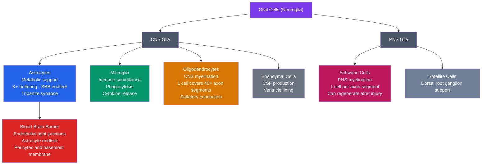

# Glial Cells and the Blood-Brain Barrier

> [!abstract] TL;DR
> Glial cells outnumber neurons by approximately 3–10:1 and perform indispensable active roles — metabolic support, immune surveillance, myelination, and neurovascular regulation — that are anything but passive scaffolding. The four principal types (astrocytes, microglia, oligodendrocytes, and Schwann cells) each carry out specialized functions that neurons cannot perform alone. The blood-brain barrier (BBB) is a precisely engineered selective gateway formed by endothelial tight junctions, astrocyte endfeet, and pericytes that shields the brain from pathogens and toxins while admitting essential nutrients — and its breakdown underlies Alzheimer's disease, stroke, and neuroinflammation.

---

## Intuition — analogy FIRST

Think of the brain as a walled medieval city:

**Astrocytes** are the city's infrastructure and support staff. They lay the pipes that deliver nutrients from blood vessels to every building (neuron), repair the streets after damage, and run the sanitation service — taking up toxic waste (excess glutamate, K⁺) before it accumulates. They also hold the city together structurally.

**Microglia** are the city's police and immune guard. At rest they patrol every neighbourhood in a ramified, surveillance form. When they detect a threat — an invading pathogen, a dead cell, misfolded protein — they transform: retract their branches, rush to the site, and either eliminate the threat by engulfing it or sound the alarm by releasing chemical signals (cytokines).

**Oligodendrocytes** are the insulation engineers. Every high-speed electrical cable (axon) that carries messages between city districts must be wrapped in insulating tape (myelin) to prevent signal loss and short-circuits. One oligodendrocyte can insulate 40 or more separate cables simultaneously.

**Schwann cells** do the same job on the roads outside the city walls (the peripheral nervous system), but they assign one worker per stretch of cable, and their insulation can be repaired after injury.

**The blood-brain barrier** is the city's customs gate — the single checkpoint where the wall meets the blood supply. Everything entering must pass inspection: oxygen and glucose get fast-track entry; pathogens, many drugs, and most large molecules are turned away. The gate is staffed by three security layers: the endothelial wall (tight junctions), the astrocyte endfeet that wrap each vessel, and pericytes that sit between them and can tighten or relax the gate.

---

## How It Works



---

## Key Concepts

### Secondary Level

**The four main glial types and their roles**

| Cell Type | Location | Primary Role |
|-----------|----------|--------------|
| Astrocyte | CNS (grey and white matter) | Metabolic support, K⁺/glutamate homeostasis, BBB formation |
| Microglia | CNS (throughout) | Immune surveillance, phagocytosis, synaptic pruning |
| Oligodendrocyte | CNS white matter | Myelinate CNS axons (saltatory conduction) |
| Schwann cell | PNS | Myelinate PNS axons; can regenerate |
| Ependymal cell | Ventricle lining | Produce and circulate cerebrospinal fluid (CSF) |
| Radial glia | Developing brain | Scaffolding for neuronal migration; neural progenitors |

**The myelin sheath**

Myelin is a lipid-rich membrane wrapped tightly around an axon in concentric layers by an oligodendrocyte (CNS) or Schwann cell (PNS). Unmyelinated gaps between successive wrappings are called **nodes of Ranvier**. Rather than conducting the action potential as a continuous wave, the electrical signal "jumps" from node to node — **saltatory conduction** — achieving conduction velocities up to 120 m/s versus 0.5–2 m/s in unmyelinated fibres. Multiple sclerosis destroys this insulation, causing dramatic slowing and failure of neural signalling.

**Blood-brain barrier basics**

The brain is enclosed by a specialised vascular interface that prevents free passage of molecules from the blood. Unlike capillaries elsewhere in the body (which have gaps), brain capillary endothelial cells are sealed with tight junctions, forcing all entry to occur via specific transporters. Glucose enters via GLUT1; amino acids via specific carriers; ions via tightly regulated channels.

---

### Undergraduate Level

**The tripartite synapse**

Classical synaptic transmission was modelled as a two-party interaction (presynaptic → postsynaptic). Astrocytes form a **tripartite synapse**: their fine processes ensheath the synaptic cleft, detect neurotransmitter spillover via metabotropic receptors, and respond by releasing **gliotransmitters** (ATP, D-serine, glutamate). This three-way conversation modulates synaptic strength and integrates signals across multiple synapses simultaneously.

**K⁺ spatial buffering**

Neuronal firing releases K⁺ into the extracellular space. If K⁺ accumulates (above ~12 mM), it depolarises neighbouring neurons — the mechanism of spreading depolarisation and seizure. Astrocytes express Kir4.1 inward-rectifying K⁺ channels densely at their endfeet. Excess K⁺ is taken up locally and transferred through gap junctions to distant endfeet, where it exits into the perivascular space (**spatial buffering**). This prevents localised K⁺ accumulation from triggering runaway excitation.

**Glutamate-glutamine cycle**

Neurons release glutamate at excitatory synapses. Unrecovered glutamate is excitotoxic. Astrocytes express **GLT-1** and **GLAST** high-affinity transporters that take up ~80% of released glutamate. Astrocytic glutamine synthetase converts it to glutamine, which is shuttled back to neurons via transporters, where it is reconverted to glutamate by glutaminase — completing the cycle. Failure of this cycle is central to excitotoxic injury in stroke and epilepsy.

**Reactive astrogliosis**

After CNS injury, astrocytes undergo dramatic morphological and molecular changes: upregulation of GFAP (glial fibrillary acidic protein), process hypertrophy, and proliferation. Severe reactive astrogliosis forms a **glial scar** that seals the lesion (beneficial short-term) but also blocks axon regeneration (detrimental long-term) by secreting inhibitory chondroitin sulfate proteoglycans.

**Microglia M1/M2 polarisation**

Microglia adopt functionally distinct activation states, loosely analogous to peripheral macrophage polarisation:

| State | Trigger | Markers | Effect |
|-------|---------|---------|--------|
| M1 (classical) | LPS, IFN-γ | iNOS, TNF-α, IL-1β | Pro-inflammatory; pathogen killing; can cause bystander neuronal damage |
| M2 (alternative) | IL-4, IL-13 | Arg-1, CD206, TGF-β | Anti-inflammatory; phagocytosis of debris; tissue repair; synaptic pruning |

Note: M1/M2 is a simplification — in vivo microglia exist on a continuum of states with substantial heterogeneity depending on brain region and disease stage.

**Oligodendrocyte myelination**

Oligodendrocyte precursor cells (OPCs) migrate throughout the CNS during development, contact axons, and begin wrapping. Each oligodendrocyte extends processes that spiral around 40–60 axon segments. Myelination occurs in waves from caudal to rostral and posterior to anterior during postnatal development, continuing into the third decade of life in humans (important for executive function development). The signal that instructs myelination includes electrical activity: electrically active axons are preferentially myelinated.

**BBB tight junction proteins**

The BBB tight junction complex consists of:
- **Claudin-5**: the dominant claudin in brain endothelium; knockdown causes BBB permeability to small molecules
- **Occludin**: regulates paracellular ion flow; phosphorylation state controls junction tightness
- **JAM-A**: junction adhesion molecule; assists tight junction assembly
- **ZO-1 / ZO-2**: cytoplasmic scaffolding proteins (zonula occludens) that anchor claudins and occludin to the actin cytoskeleton

Together, these proteins achieve a transendothelial electrical resistance of ~1,500–2,000 Ω·cm², compared to ~3–33 Ω·cm² for peripheral capillaries.

---

### Graduate Level

**Gliotransmission controversy**

Whether astrocytes release glutamate and other gliotransmitters through Ca²⁺-dependent vesicular exocytosis to genuinely modulate synaptic transmission remains debated. Concerns include: (1) artefacts from astrocyte IP₃ receptor overexpression in early studies; (2) most gliotransmission studies used non-physiological stimulation; (3) the vesicular machinery in astrocytes differs from neurons. Emerging consensus: astrocytes release D-serine (a co-agonist at NMDA receptors) and ATP in a regulated manner, but the magnitude of glutamate release and its synaptic impact vary strongly by brain region and state.

**Astrocyte calcium waves and neurovascular coupling**

Astrocytes communicate via propagating intracellular Ca²⁺ waves, mediated by IP₃ diffusion through gap junctions (connexin-43 hemichannels) and extracellular ATP release triggering P2Y receptors. At the vascular interface, Ca²⁺ signals in endfeet activate phospholipase A₂ → arachidonic acid → prostaglandins/epoxyeicosatrienoic acids (EETs) → arteriolar dilation, or alternatively → 20-HETE → arteriolar constriction. This **neurovascular coupling** (functional hyperemia) is the physiological basis of the BOLD signal measured by fMRI: the haemodynamic response reflects astrocyte-mediated vasodilation following neuronal activity, not the electrical activity itself.

**Pericyte regulation of cerebral blood flow**

Pericytes are contractile cells embedded in the basement membrane of CNS capillaries (coverage ~22% of the abluminal surface). They express smooth muscle actin (aSMA) and can constrict or dilate capillaries in response to:
- Neuronal glutamate → pericyte NMDA receptors → dilation
- Noradrenaline (from locus coeruleus) → α₁ receptors → constriction
- Lactate/CO₂ → metabolic vasodilation

Pericyte loss is an early event in Alzheimer's disease, preceding amyloid plaques in some models, and correlates with BBB breakdown and cognitive decline.

**BBB breakdown in neurodegeneration**

In Alzheimer's disease, BBB dysfunction is multifactorial:
- Amyloid-β oligomers directly disrupt tight junction proteins and trigger reactive oxygen species in endothelium
- RAGE (receptor for advanced glycation end products) on endothelium mediates influx of circulating Aβ, amplifying cerebral Aβ load
- Pericyte loss reduces TGF-β signalling, which normally maintains tight junction integrity
- MMP-2 and MMP-9 (matrix metalloproteinases) cleave extracellular matrix and claudin-5

This creates a feed-forward loop: BBB leak → entry of serum proteins (fibrinogen, thrombin) → microglial activation → neuroinflammation → more BBB damage.

**Glioblastoma and BBB disruption**

Glioblastoma multiforme (GBM) is derived from glial cells (most likely transformed astrocytes or OPCs) and actively remodels the BBB through VEGF-driven angiogenesis producing leaky, fenestrated vessels. Paradoxically, the tumour core (BBB disrupted, enhancing on MRI) is surrounded by infiltrating tumour cells that remain behind an intact BBB, making those cells inaccessible to most chemotherapeutics. This is a primary reason GBM is nearly uniformly fatal.

**Drug delivery strategies across the BBB**

| Strategy | Mechanism | Example |
|----------|-----------|---------|
| Lipophilic prodrugs | Passive transcellular diffusion | Lipopolysaccharide-camouflaged drugs |
| Nanoparticles | Receptor-mediated transcytosis; exploiting leaky tumour BBB | PLGA nanoparticles functionalised with transferrin receptor antibody |
| Focused ultrasound (FUS) + microbubbles | Acoustic cavitation transiently opens tight junctions; reversible within hours | Clinical trials for Alzheimer's, GBM |
| Receptor-mediated transcytosis (RMT) | Hijack endogenous transcytosis pathways (transferrin receptor, LRP-1) | Bispecific antibodies (anti-transferrin-R × anti-target) |
| Intranasal delivery | Bypass BBB via olfactory/trigeminal nerve routes | Insulin for Alzheimer's trials |

See [[Nanomedicine_and_Drug_Delivery_Systems]] for materials-science detail on nanocarrier design.

---

## Python Demo

```python
import numpy as np
import matplotlib.pyplot as plt

# Simulate extracellular K+ dynamics with and without astrocyte spatial buffering.
# Model: 1-D diffusion with a point source (active synapse) and linear astrocyte uptake.
# Stability check: CFL condition dt <= dx^2 / (2*D) = 0.01 / 1.0 = 0.01 -> dt=0.001 is safe.

dx = 0.1          # spatial resolution (mm)
dt = 0.001        # time step (s)
L  = 5.0          # domain length (mm)
D  = 0.5          # K+ diffusion coefficient (mm^2/s)
T  = 2.0          # total simulation time (s)
K_rest    = 3.0   # resting extracellular [K+] (mM)
K_source  = 12.0  # [K+] clamped at active synapse during firing burst (mM)
k_uptake  = 2.0   # astrocyte uptake rate constant (1/s)
burst_end = 0.5   # synapse fires for 0.5 s then goes silent

x   = np.arange(0, L, dx)
n   = len(x)
nt  = int(T / dt)
src = n // 2      # synapse at domain centre

K_free = np.full(n, K_rest)   # no astrocyte buffering
K_buff = np.full(n, K_rest)   # with astrocyte buffering

snap_times = [0.25, 0.5, 1.0, 2.0]
snaps_free: dict = {}
snaps_buff: dict = {}

for step in range(1, nt + 1):
    t = step * dt

    # Finite-difference Laplacian with no-flux boundary conditions
    lap_free = np.zeros(n)
    lap_buff = np.zeros(n)
    lap_free[1:-1] = (K_free[:-2] - 2*K_free[1:-1] + K_free[2:]) / dx**2
    lap_buff[1:-1] = (K_buff[:-2] - 2*K_buff[1:-1] + K_buff[2:]) / dx**2

    K_free += dt * D * lap_free
    K_buff += dt * (D * lap_buff - k_uptake * (K_buff - K_rest))

    # Clamp source: synaptic K+ release during burst
    if t <= burst_end:
        K_free[src] = K_source
        K_buff[src] = K_source

    # Record snapshots at specified times (first pass within half a time-step)
    for st in snap_times:
        key = f"t = {st:.2f} s"
        if key not in snaps_free and abs(t - st) < dt * 0.5:
            snaps_free[key] = K_free.copy()
            snaps_buff[key] = K_buff.copy()

# Plot comparison
fig, (ax1, ax2) = plt.subplots(1, 2, figsize=(12, 5), sharey=True)
colors = ["#1f77b4", "#ff7f0e", "#2ca02c", "#d62728"]

for ax, snaps, title in [
    (ax1, snaps_free, "Without Astrocyte Buffering"),
    (ax2, snaps_buff, "With Astrocyte K+ Buffering"),
]:
    for col, (lbl, K) in zip(colors, snaps.items()):
        ax.plot(x, K, color=col, linewidth=1.8, label=lbl)
    ax.axhline(K_rest, color="gray", linestyle="--", alpha=0.7, label="Resting [K+] = 3 mM")
    ax.axhline(10.0,   color="red",  linestyle=":",  alpha=0.7, label="Seizure threshold ~10 mM")
    ax.set_xlabel("Distance from synapse (mm)")
    ax.set_ylabel("Extracellular [K+] (mM)")
    ax.set_title(title)
    ax.set_ylim(1.5, 14)
    ax.legend(fontsize=8)

plt.suptitle("Astrocyte K+ Spatial Buffering Simulation", fontsize=13, fontweight="bold")
plt.tight_layout()
plt.savefig("k_buffering.png", dpi=150)

# Summary statistics
peak_free = max(snaps_free["t = 0.50 s"])
peak_buff = max(snaps_buff["t = 0.50 s"])
print(f"Peak [K+] without astrocytes: {peak_free:.2f} mM")
print(f"Peak [K+] with astrocytes:    {peak_buff:.2f} mM")
print(f"Buffering reduces peak by:    {(peak_free - peak_buff) / peak_free * 100:.1f}%")
```

**What the demo shows:** Without astrocyte buffering, K⁺ diffuses outward but remains elevated (approaching the ~10 mM seizure threshold) well after the burst ends. With astrocyte uptake active, the extracellular K⁺ is rapidly clamped back toward the 3 mM resting level — preventing the surrounding neurons from being hyperexcited and illustrating how astrocyte K⁺ clearance is a seizure-suppressive mechanism.

---

## Real-World Applications

**Multiple sclerosis (demyelination)**

MS is an autoimmune disease in which T-cells and macrophages attack myelin, destroying the oligodendrocyte sheaths in the CNS. The result is slowed or blocked conduction in demyelinated axons — producing the characteristic relapsing-remitting pattern of weakness, sensory loss, and optic neuritis. Remyelination can occur (mediated by OPC differentiation) but is incomplete in progressive disease. Current research targets OPC activation to enhance repair.

**Alzheimer's disease — glial and BBB involvement**

Microglia are the primary phagocytes for amyloid-β plaques. In early AD, microglia are protective (M2-like, clearing Aβ). As disease progresses, chronic microglial activation (M1-like, driven by TREM2 and APOE pathways) releases TNF-α, IL-1β, and reactive oxygen species, causing bystander neuronal damage. Simultaneously, reactive astrogliosis around plaques impairs metabolic support. BBB leakage allows serum proteins to enter, further amplifying inflammation — creating the "glial firestorm" hypothesis of AD progression.

**Brain tumours (glioblastoma)**

GBM is the most malignant primary brain tumour (median survival ~15 months). Being of glial origin, GBM cells exploit astrocytic and microglial biology: they recruit microglia to a tumour-promoting M2 state (tumour-associated microglia/macrophages), exploit the disrupted BBB for nutrient delivery while the infiltrating front remains BBB-protected, and even form direct gap-junction connections with neurons to co-opt electrical activity for proliferation signals.

**Drug delivery across the BBB**

The BBB excludes >98% of small-molecule drugs and nearly all biologics. Focused ultrasound (FUS) combined with intravenously injected microbubbles causes transient (minutes-to-hours) tight-junction opening, allowing co-administered therapeutics to enter. Clinical trials are underway for Alzheimer's (clearing amyloid) and GBM. The technology requires precise targeting and careful dosing to avoid haemorrhagic complications.

**Neuroinflammation in psychiatric disease**

Post-mortem and PET imaging studies find activated microglia (measured by TSPO ligands) in depression, schizophrenia, and PTSD. The direction of causality remains debated — microglial activation may be a consequence of stress-induced glucocorticoid signalling altering microglial physiology, a cause via pro-inflammatory cytokines disrupting monoamine synthesis, or both. This is a basis for trials of anti-inflammatory agents (e.g., minocycline, COX-2 inhibitors) in depression.

---

## Common Pitfalls

- **Glia as passive scaffolding** — The historical view that glia merely hold neurons in place and provide metabolic housekeeping has been overturned. Astrocytes actively modulate synaptic strength at the tripartite synapse, regulate cerebral blood flow via neurovascular coupling, and gate neuronal excitability through K⁺ and glutamate homeostasis. Treating glia as inert cells leads to an incomplete model of CNS function.

- **Microglia as brain macrophages** — Microglia and peripheral macrophages perform overlapping phagocytic functions but are fundamentally different cells. Microglia derive from yolk-sac erythromyeloid progenitors (a distinct wave of primitive haematopoiesis), not bone marrow monocytes. They enter the CNS at E8.5 (mouse), before the BBB forms, and self-renew locally throughout life. Their transcriptome is distinct from peripheral macrophages (expressing Tmem119, P2ry12, Sall1). This distinction matters for disease: microglial identity is lost ("homeostatic signature erasure") in neurodegeneration, which is a disease hallmark, not a generic macrophage response.

- **BBB as an absolute barrier** — The BBB is selective, not impermeable. Lipophilic molecules (general anaesthetics, ethanol, most psychoactive drugs, nicotine) cross freely by transcellular diffusion, proportional to their lipid–water partition coefficient. Glucose, amino acids, and some hormones have dedicated transporters. Size alone is not the criterion: a small charged molecule may be excluded while a lipophilic molecule many times larger crosses freely. Drug discovery must account for lipophilicity and P-glycoprotein efflux (an active BBB pump that expels certain molecules back into blood).

- **M1/M2 as a clean binary** — The M1/M2 microglial polarisation framework, borrowed from macrophage biology, is a useful shorthand but oversimplifies. Single-cell RNA-seq reveals a continuous spectrum of microglial states, with disease-associated microglia (DAM), lipid-droplet-accumulating microglia (LDAM), and region-specific homeostatic subtypes. Therapeutic strategies that simply "switch M1 to M2" are likely to be too blunt for complex neurological diseases.

- **Myelination as a static process** — Myelin is not laid down once and forgotten. Active neuronal firing promotes ongoing myelination throughout life (adaptive myelination), and myelin thickness and internode length are tuned to optimise conduction velocity for the circuit. The discovery that optogenetic activation of axons promotes OPC differentiation and myelination added a new dimension to understanding learning-related white matter changes.

---

## Related Concepts

- [[_MOC_Cellular_and_Molecular_Neuroscience|↑ Cellular and Molecular Neuroscience MOC]] — section entry point and concept map for this topic cluster
- [[Neuron_Structure_and_Function]] — Neurons and glia form an inseparable functional unit; understanding action potentials and synaptic transmission is prerequisite to understanding why astrocyte K⁺ buffering and glutamate uptake matter
- [[Neurodegenerative_Diseases]] — Alzheimer's, Parkinson's, ALS, and MS all involve pathological glial activation and BBB dysfunction as central, not peripheral, features
- [[Neuroplasticity_and_Rehabilitation]] — Adaptive myelination, reactive astrogliosis, and microglial synaptic pruning are the cellular mechanisms that implement plasticity, both beneficial and maladaptive
- [[Membranes_and_Cell_Signaling]] — The BBB tight junction proteins, astrocyte ion channels (Kir4.1, AQP4), and gliotransmitter receptors are all membrane-embedded molecules; the Goldman–Hodgkin–Katz equation and transporter thermodynamics underlie astrocyte K⁺ and glutamate homeostasis
- [[Nanomedicine_and_Drug_Delivery_Systems]] — Nanoparticle and lipid nanoparticle strategies for crossing the BBB, exploiting receptor-mediated transcytosis and focused-ultrasound-assisted opening
- [[Biological_Basis_of_Behavior]] — Provides the neuroanatomical and neurotransmitter context within which glial cells operate; myelin (oligodendrocytes) and the glymphatic system (astrocytes) are mentioned there; this note provides the cellular mechanism behind those facts

---

## Review Questions

**Secondary**
1. A patient with multiple sclerosis loses feeling in one arm for several weeks, then partially recovers. Explain the cellular events that cause both the loss and the partial recovery, naming the specific cell types involved.

**Undergraduate**
2. After a prolonged seizure, extracellular K⁺ in the hippocampus is measured at 8 mM (normally 3 mM). Outline three distinct astrocyte mechanisms that should have prevented this accumulation from occurring, and explain which molecular components are involved in each. Why does failure of these mechanisms create a positive-feedback loop toward further seizure activity?

**Graduate**
3. You are designing a therapeutic antibody (150 kDa) to clear amyloid-β plaques in the Alzheimer's brain. The BBB normally excludes molecules larger than ~500 Da via paracellular pathways. (a) Name three strategies you could use to deliver the antibody across the BBB and describe the mechanism of each. (b) In early versus late-stage AD, BBB integrity differs — how does this affect your strategy choice? (c) What is the risk that enhanced amyloid clearance via an immune mechanism could exacerbate neuroinflammation, and which glial cell type is most relevant to this risk?

---

## Sources

- Kandel ER, Koester JD, Mack SH, Siegelbaum SA (eds.) — *Principles of Neural Science*, 6th ed. (McGraw-Hill, 2021), Chapters 8–9 (Glia), Chapter 37 (Blood-Brain Barrier)
- Verkhratsky A & Butt AM — *Glial Physiology and Pathophysiology* (Wiley-Blackwell, 2013) — comprehensive reference on glial cell biology across all types
- Abbott NJ, Patabendige AAK, Dolman DEM, Yusof SR, Begley DJ — "Structure and function of the blood-brain barrier", *Brain Research Reviews* 35(2):S25–S34 (2010)
- Sofroniew MV & Vinters HV — "Astrocytes: biology and pathology", *Acta Neuropathologica* 119(1):7–35 (2010)
- Nimmerjahn A, Kirchhoff F, Helmchen F — "Resting microglial cells are highly dynamic surveillants of brain parenchyma in vivo", *Science* 308:1314–1318 (2005)
- Ginhoux F et al. — "Fate mapping analysis reveals that adult microglia derive from primitive macrophages", *Science* 330:841–845 (2010) — the yolk-sac origin paper
- Bhatt DL (ed.) — *Neurovascular Unit in Health and Disease* (reference for pericyte-endothelial-astrocyte crosstalk at the BBB)

---

#Neuroscience #CellularNeuroscience #GlialCells #BloodBrainBarrier
