# ⚡ Ion Channels and Receptor Pharmacology

> [!abstract] TL;DR
> **Ion channels** are membrane proteins that form selective pores, allowing specific ions (Na⁺, K⁺, Ca²⁺, Cl⁻) to flow down their electrochemical gradients and generate the electrical signals neurons use to compute and communicate. **Receptors** are the molecular recognition sites at synapses — ionotropic receptors are channels directly gated by a ligand, acting in milliseconds, while metabotropic receptors (GPCRs) recruit intracellular G-proteins and second messengers for slower, longer-lasting modulation. **Pharmacology** exploits this machinery with agonists, antagonists, and allosteric modulators to treat epilepsy, anxiety, pain, depression, anesthesia, and psychiatric disorders — virtually every psychoactive drug in clinical use acts on a channel or receptor subtype described here.

---

## Intuition — analogy FIRST

Think of every neuron's membrane as a **tightly controlled border crossing with turnstiles and customs locks**. Ion channels are the **turnstiles** — each is engineered to open only for one species of passport-holder (Na⁺, K⁺, Ca²⁺, or Cl⁻) and only when exactly the right signal arrives. A voltage-gated channel is like a turnstile that swings open when crowd pressure (membrane voltage) builds past a threshold; a ligand-gated channel is one where a security guard (the neurotransmitter molecule) must insert its key before anyone passes.

Receptors are the **molecular locks on the customs booth**. Some locks directly operate a gate — insert the key, the gate opens, ions rush through immediately (ionotropic, milliseconds). Others do not open a gate at all: inserting the key dispatches a runner inside the building who rearranges furniture, turns on alarms, or radios other rooms minutes later (metabotropic GPCRs — the key triggers a G-protein, which recruits second messengers and kinases).

Drugs are **copies of the key, plugs that jam the lock, or tools that warp the keyhole**. A full agonist is a copied key that opens the lock completely. An antagonist is a key-shaped plug that occupies the lock without operating it, preventing the real key from entering. An allosteric modulator is a thumb on the lock mechanism that makes the real key easier or harder to turn — without occupying the main keyhole at all. This last class is the basis of benzodiazepine pharmacology.

---

## How It Works

```mermaid
graph TD
    ROOT["Membrane Signaling Proteins"]
    VG["Voltage-Gated Channels\nopen when membrane depolarizes"]
    LG["Ligand-Gated Ion Channels\nIonotropic Receptors\nopen when neurotransmitter binds"]
    MR["Metabotropic Receptors\nGPCRs\nno pore - signal via G-proteins"]

    NA["Nav - Voltage-Gated Na+ Channels\nAP upstroke and depolarization\nblocked by TTX, lidocaine"]
    KV["Kv - Voltage-Gated K+ Channels\nrepolarization and resting potential\nblocked by tetraethylammonium"]
    CA["Cav - Voltage-Gated Ca2+ Channels\nneurotransmitter release, contraction\nblocked by nimodipine, omega-conotoxin"]

    AMPA["AMPA Receptors\nfast excitation - Na+/K+ flux\nGluA1-GluA4 subunits, desensitizes rapidly"]
    NMDA["NMDA Receptors\ncoincidence detector - Ca2+ flux\nrequires voltage AND ligand binding\nMg2+ block at rest"]
    GABAA["GABA-A Receptors\nfast inhibition - Cl- flux\npentameric - target for benzodiazepines"]
    NACH["Nicotinic AChR\nneuromuscular junction and CNS\nblocked by curare and succinylcholine"]

    GABAB["GABA-B Receptors\nslow inhibition via Gi/o\nclinical target: baclofen"]
    MGLUR["Metabotropic Glutamate Receptors\nmGluR1-8 - slow excitatory or inhibitory\nmodulatory, not fast transmission"]
    MUSC["Muscarinic AChR M1-M5\nautonomic and CNS regulation\nblocked by atropine, scopolamine"]

    ROOT --> VG
    ROOT --> LG
    ROOT --> MR
    VG --> NA
    VG --> KV
    VG --> CA
    LG --> AMPA
    LG --> NMDA
    LG --> GABAA
    LG --> NACH
    MR --> GABAB
    MR --> MGLUR
    MR --> MUSC

    style VG fill:#ff6b6b,color:#fff
    style LG fill:#4a9eff,color:#fff
    style MR fill:#51cf66,color:#fff
    style NMDA fill:#ffa94d,color:#000
    style GABAA fill:#7950f2,color:#fff
    style ROOT fill:#343a40,color:#fff
```



Ion flow through a channel is entirely **passive** — channels do not pump. An ion moves through an open channel only if the **electrochemical gradient** favors it: the combined push of the concentration gradient (chemical potential) and the membrane electric field (electrical potential). The net driving force is $(V_m - E_{ion})$, where $E_{ion}$ is the **Nernst equilibrium potential** — the precise membrane voltage at which the electrical force exactly cancels the concentration gradient, producing zero net flux.

---

## Key Concepts / Details

### Secondary Level

**Ion concentration gradients and selectivity.** The resting neuron maintains steep transmembrane ion gradients, established and maintained by the **Na⁺/K⁺-ATPase pump** (expels 3 Na⁺, imports 2 K⁺ per ATP hydrolyzed, net electrogenic — contributes ~−3 mV to resting potential):

| Ion | Intracellular (mM) | Extracellular (mM) | Approximate $E_{ion}$ |
|-----|--------------------|--------------------|-----------------------|
| Na⁺ | 12 | 145 | +67 mV |
| K⁺ | 140 | 5 | −89 mV |
| Ca²⁺ | 0.0001 | 2 | +123 mV |
| Cl⁻ | 7 | 110 | −65 mV |

The resting membrane potential of ~−65 to −70 mV is dominated by the high resting K⁺ permeability through leak channels, sitting close to $E_K$.

**Channel gating mechanisms — four main classes:**

| Gating Type | Opens When | Examples |
|-------------|------------|---------|
| Voltage-gated | Membrane depolarizes past threshold | Nav, Kv, Cav |
| Ligand-gated (ionotropic) | Neurotransmitter binds orthosteric site | AMPA, NMDA, GABA-A, nAChR |
| Mechanosensitive | Physical membrane deformation or stretch | PIEZO1/2, MscL (bacterial) |
| Temperature / chemical-gated | Heat, cold, or lipid second messengers | TRPV1 (capsaicin, >42 °C), TRPM8 (menthol, <25 °C) |

**Ionotropic vs. metabotropic — the speed–duration trade-off:**

- **Ionotropic receptors**: the receptor protein complex IS the ion channel pore. Neurotransmitter binding directly opens the gate with no intervening steps. Response speed: **~1 ms**. Duration: brief (until the ligand unbinds or the receptor desensitizes). Examples: AMPA, NMDA, GABA-A, glycine, nicotinic AChR.
- **Metabotropic receptors (GPCRs)**: the receptor protein has no intrinsic pore. Ligand binding activates a heterotrimeric G-protein (Gs, Gi/o, Gq), which modulates adenylyl cyclase (cAMP), phospholipase C (IP₃/DAG), or downstream ion channels. Response speed: **~100 ms to minutes**. Duration: sustained, allows widespread modulation. Examples: GABA-B, mGluR1–8, muscarinic AChR, dopamine D1/D2, opioid µ/δ/κ, adrenergic receptors.

### Undergraduate Level

**Nernst potential — the electrochemical equilibrium voltage for a single ion:**
$$E_{ion} = \frac{RT}{zF}\ln\frac{[ion]_{out}}{[ion]_{in}}$$
At physiological temperature (37 °C), $\frac{RT}{F}\ln 10 \approx 61.5\ \text{mV}$, giving the working formula:
$$E_{ion} \approx \frac{61.5\ \text{mV}}{z}\log_{10}\frac{[ion]_{out}}{[ion]_{in}}$$
For K⁺ ($z = +1$, [K]$_{out}$ = 5 mM, [K]$_{in}$ = 140 mM): $E_K = 61.5 \times \log(5/140) = -89\ \text{mV}$. The resting membrane potential (~−65 mV) is more positive than $E_K$, so K⁺ always has a net outward driving force at rest.

**Single-channel current — Ohm's law applied to channels:**
$$I_{ion} = \gamma(V_m - E_{ion})$$
where $\gamma$ is the **single-channel conductance** (typically 5–150 pS for a single channel), $V_m$ is the actual membrane voltage, and $(V_m - E_{ion})$ is the **driving force**. The total macroscopic current from a population of $N$ channels with open probability $P_o$ is $I = N \cdot P_o \cdot \gamma \cdot (V_m - E_{ion})$.

**Major receptor pharmacology summary:**

| Receptor | Main Agonist(s) | Competitive Antagonist(s) | Clinical Agent |
|----------|----------------|--------------------------|---------------|
| AMPA | Glutamate | NBQX, perampanel | Perampanel (epilepsy) |
| NMDA | Glutamate + glycine | AP5; ketamine (open-channel) | Ketamine (anesthesia/depression), memantine (Alzheimer's) |
| GABA-A | GABA, muscimol | Bicuculline, picrotoxin | Benzodiazepines (PAM), barbiturates, propofol |
| GABA-B | GABA, baclofen | CGP35348 | Baclofen (spasticity, alcohol withdrawal) |
| Nicotinic AChR | Acetylcholine, nicotine | Curare, atracurium | Succinylcholine (neuromuscular paralysis) |
| Muscarinic AChR | Acetylcholine, muscarine | Atropine, scopolamine | Atropine (bradycardia), ipratropium (COPD) |

**Agonist classification and dose-response curves:**

- **Full agonist**: produces the maximum possible receptor-mediated response ($E_{max}$), characterized by its **$EC_{50}$** — the concentration achieving 50% of $E_{max}$. Lower $EC_{50}$ = higher potency.
- **Partial agonist**: intrinsic efficacy $< 1$; saturating concentrations produce $E_{max}$ less than that of a full agonist. Partial agonists can act as functional antagonists in the presence of a full agonist by competing for the same site.
- **Competitive antagonist**: occupies the orthosteric site, shifting the dose-response curve **rightward** (higher apparent $EC_{50}$) without changing $E_{max}$. The shift is surmountable by increasing agonist concentration.
- **Non-competitive antagonist**: binds an allosteric site (or irreversibly at the orthosteric site), reducing $E_{max}$ regardless of agonist concentration. Cannot be overcome by adding more agonist.

**Hill equation — quantitative dose-response model:**
$$E = E_{max}\frac{[A]^n}{EC_{50}^n + [A]^n}$$
where $[A]$ is agonist concentration, $n$ is the **Hill coefficient** (cooperativity: $n > 1$ = positive cooperativity, sharp switch; $n = 1$ = simple hyperbolic binding; $n < 1$ = negative cooperativity, graded response). The **$IC_{50}$** is the antagonist concentration that inhibits the response by 50% in a functional assay and is calculated by the same form with $(1 - E/E_{max})$ as the endpoint.

### Graduate Level

**Patch-clamp electrophysiology.** Developed by Neher and Sakmann (Nobel Prize 1991), patch-clamp allows direct measurement of currents through single channels or whole cells. A fire-polished glass pipette (~1 µm tip diameter) forms a gigaohm (GΩ) seal with the cell membrane:

| Configuration | Membrane State | What is Accessible | Key Uses |
|---------------|---------------|--------------------|---------|
| Cell-attached | Intact | Single channels | Measure $P_o$ without dialyzing cytoplasm |
| Whole-cell | Ruptured patch | All channels in cell | $I_{Na}$, $I_{K}$, $I_{Ca}$ with voltage clamp |
| Inside-out | Excised, cytoplasmic face out | Single channel, cytoplasmic face | Apply second messengers, internal blockers |
| Outside-out | Excised, extracellular face out | Single channel, extracellular face | Rapid application of ligands, study kinetics |

From single-channel recordings: open probability $P_o$, mean open time $\tau_{open}$, single-channel conductance $\gamma$, and unitary current $i$. From noise analysis of macroscopic currents, $\gamma$ and $N$ can be estimated without resolving individual channel events.

**Markov models of channel gating.** A channel transitions stochastically between discrete conformational states (closed C, open O, inactivated I). Each transition has a voltage- or ligand-dependent rate constant. The minimal three-state Hodgkin-Huxley representation of a Nav channel is:
$$C \underset{\beta(V)}{\stackrel{\alpha(V)}{\rightleftharpoons}} O \underset{\delta}{\stackrel{\gamma}{\rightleftharpoons}} I$$
The classical Hodgkin-Huxley variables $m^3 h$ are a continuous-state approximation: $g_{Na}(t) = \bar{g}_{Na}\,m(t)^3\,h(t)$, where $m$ is the activation gate (three independent subunits, each governed by $\alpha_m(V)/\beta_m(V)$) and $h$ is the inactivation gate. Full Markov models with multiple closed and inactivated states better reproduce the slow inactivation, closed-state inactivation, and use-dependent block seen pharmacologically.

**Receptor desensitization and downregulation.** Prolonged agonist exposure produces two mechanistically distinct forms of accommodation:

- **Desensitization** (ionotropic): the receptor enters a refractory conformation where the channel closes despite agonist still bound — a conformational change, not ligand unbinding. AMPA receptors desensitize on the **1–10 ms** timescale. The auxiliary subunit stargazin/TARP slows AMPA desensitization. NMDA receptors desensitize ~100× more slowly than AMPA. GABA-A desensitization on the timescale of tens of milliseconds contributes to synaptic inhibition decay.
- **Downregulation / internalization** (GPCR): sustained GPCR activation leads to **phosphorylation** by GRKs (G-protein-coupled receptor kinases), recruitment of **β-arrestin**, and clathrin-mediated endocytosis. Surface receptor number falls, blunting subsequent responses. Opioid tolerance involves µ-opioid receptor internalization plus Gi/o uncoupling. Receptor recycling (re-sensitization) vs. lysosomal degradation determines recovery kinetics.

**Allosteric modulation.** Allosteric sites are topographically distinct from the orthosteric (agonist/neurotransmitter) binding site. Their occupancy modulates channel or receptor function without directly activating it:

- **Positive allosteric modulators (PAMs)**: enhance the response to the endogenous agonist. Benzodiazepines are PAMs at GABA-A — they increase the **frequency** of Cl⁻ channel openings in the presence of GABA, without affecting channel conductance or mean open time. Because they require endogenous GABA to act, they carry an intrinsic ceiling on CNS depression, providing a wider therapeutic index than barbiturates.
- **Negative allosteric modulators (NAMs)**: reduce response to endogenous agonist. Zinc is a NAM at many NMDA receptor subtypes (GluN2A > GluN2B). Ifenprodil is a GluN2B-selective NAM used to study NMDA subtypes.

**Structural biology of channels (cryo-EM era).** Near-atomic resolution structures now exist for all major channel/receptor families:
- **NMDA receptors**: obligate heterotetramers (2× GluN1 + 2× GluN2). GluN1 binds glycine (co-agonist); GluN2 binds glutamate. Three structural domains per subunit: amino-terminal domain (ATD), ligand-binding domain (LBD), and transmembrane domain (TMD) with a re-entrant P-loop selectivity filter. The Mg²⁺ binding site in the pore is lined by Asn residues in the TMD — a single asparagine-to-glutamine mutation (the "R/G" site) eliminates Mg²⁺ block.
- **AMPA receptors**: homotetramers or heterotetramers of GluA1–4. Flip/flop alternative splice variants in the LBD affect desensitization kinetics. TARPs (stargazin, γ-8) are auxiliary subunits that traffic AMPA receptors to synapses and slow desensitization — their interaction is the target of LY-3130481, a subunit-selective AMPA modulator.
- **GABA-A receptors**: pentameric Cys-loop receptors. Most common synaptic subunit combination: 2α1 + 2β2 + 1γ2. Benzodiazepine site is at the α/γ subunit interface; barbiturate and neurosteroid sites are within the transmembrane domain pore region.

---

## Python Demo

```python
import numpy as np
import matplotlib.pyplot as plt

# ---------------------------------------------------------------
# Dose-response curves via the Hill equation
#   E = Emax * [A]^n / (EC50^n + [A]^n)
# Simulates: full agonist, partial agonist,
#            competitive antagonist, non-competitive antagonist,
#            and the effect of Hill coefficient (cooperativity).
# ---------------------------------------------------------------

def hill(conc, Emax, EC50, n=1.0):
    """Fractional receptor-mediated effect (Hill equation)."""
    return Emax * (conc**n) / (EC50**n + conc**n)

# Concentration axis: 0.001 to 1000 in units of the reference EC50
conc = np.logspace(-3, 3, 500)

# --- Scenario 1: agonist subtypes (no antagonist present) ---
E_full    = hill(conc, Emax=1.0, EC50=1.0, n=1.0)   # full agonist
E_partial = hill(conc, Emax=0.6, EC50=1.0, n=1.0)   # partial agonist: same EC50, lower Emax

# --- Scenario 2: competitive antagonist ---
# Cheng-Prusoff for competitive block: EC50_apparent = EC50_true * (1 + [B]/K_B)
# Using [B] = 9 * K_B -> 10-fold rightward shift in EC50
E_competitive = hill(conc, Emax=1.0, EC50=10.0, n=1.0)

# --- Scenario 3: non-competitive antagonist ---
# Reduces Emax but leaves EC50 (potency) unchanged
E_noncompetitive = hill(conc, Emax=0.40, EC50=1.0, n=1.0)

# --- Scenario 4: Hill coefficient (cooperative gating) ---
n_values = [0.5, 1.0, 2.5]
labels_n = ['n=0.5  (negative cooperativity)',
            'n=1.0  (Langmuir, non-cooperative)',
            'n=2.5  (positive cooperativity)']

fig, (ax1, ax2) = plt.subplots(1, 2, figsize=(13, 5))

# Left panel: agonist types and antagonism
ax1.semilogx(conc, E_full,           lw=2,        color='#2196f3',
             label='Full agonist  (EC50=1, Emax=1.0)')
ax1.semilogx(conc, E_partial,        lw=2, ls='--', color='#4caf50',
             label='Partial agonist  (EC50=1, Emax=0.6)')
ax1.semilogx(conc, E_competitive,    lw=2, ls='-.', color='#ff9800',
             label='+ Competitive antagonist  (EC50 shifted 10-fold)')
ax1.semilogx(conc, E_noncompetitive, lw=2, ls=':',  color='#f44336',
             label='+ Non-competitive antagonist  (Emax reduced to 0.4)')
ax1.axvline(1.0,  color='gray',   ls=':', alpha=0.6, label='EC50 reference (=1)')
ax1.axvline(10.0, color='orange', ls=':', alpha=0.6, label='Apparent EC50 with competitive antagonist')
ax1.axhline(0.5,  color='black',  ls=':', alpha=0.3, lw=1)
ax1.set_xlabel('[Agonist]  (multiples of reference EC50)', fontsize=10)
ax1.set_ylabel('Fractional Effect  (E / Emax_full)', fontsize=10)
ax1.set_title('Dose-Response: Agonist Types and Antagonism', fontsize=11)
ax1.legend(fontsize=8, loc='upper left')
ax1.grid(True, alpha=0.25)
ax1.set_ylim(-0.05, 1.15)

# Right panel: Hill coefficient / cooperativity
colors_n = ['#9c27b0', '#2196f3', '#f44336']
for n_val, lbl, col in zip(n_values, labels_n, colors_n):
    ax2.semilogx(conc, hill(conc, 1.0, 1.0, n_val), lw=2.5, label=lbl, color=col)
ax2.axhline(0.5, ls=':', color='black', alpha=0.4, label='50% effect level')
ax2.axvline(1.0, ls=':', color='gray',  alpha=0.5, label='EC50 = 1 (same for all)')
ax2.set_xlabel('[Ligand]  (multiples of EC50)', fontsize=10)
ax2.set_ylabel('Fractional Effect', fontsize=10)
ax2.set_title('Effect of Hill Coefficient (Cooperativity)', fontsize=11)
ax2.legend(fontsize=9)
ax2.grid(True, alpha=0.25)
ax2.set_ylim(-0.05, 1.15)

plt.tight_layout()
plt.show()

# --- Analytical printout: EC50 extraction and Schild dose-ratio ---
print("EC50 extraction by interpolation:")
for label, curve in [('Full agonist',         E_full),
                     ('Partial agonist',       E_partial),
                     ('Competitive antagonist',E_competitive)]:
    half = 0.5 * curve.max()
    idx  = np.argmin(np.abs(curve - half))
    print(f"  {label:<30s}: EC50 ~ {conc[idx]:.3f}  (reference units)")

print("\nSchild analysis (Schild equation): dose ratio - 1 = [B] / K_B")
for antagonist_conc in [1.0, 3.0, 9.0, 27.0]:
    apparent_EC50 = 1.0 * (1 + antagonist_conc)    # competitive: Cheng-Prusoff
    dose_ratio    = apparent_EC50 / 1.0
    print(f"  [Antagonist] = {antagonist_conc:5.1f} K_B:  "
          f"EC50_apparent = {apparent_EC50:.1f},  "
          f"DR-1 = {dose_ratio - 1:.1f}  "
          f"(log[B] = {np.log10(antagonist_conc):.2f},  "
          f"log(DR-1) = {np.log10(dose_ratio - 1):.2f})")
print("  => Schild plot: log(DR-1) vs log[B] should be linear with slope ~1.0")
```

---

## Real-World Applications

> **Benzodiazepines (diazepam, alprazolam, lorazepam) — GABA-A Positive Allosteric Modulators.** Benzodiazepines bind at the α/γ subunit interface of the GABA-A receptor pentamer, a site distinct from the orthosteric GABA binding site. They increase the *frequency* of Cl⁻ channel openings in response to GABA without affecting mean open time or conductance. This enhances inhibitory tone throughout the CNS, producing anxiolytic, sedative, anticonvulsant, and muscle-relaxant effects. Because they require endogenous GABA tone to act, they carry an intrinsic ceiling on CNS depression — a structural reason for their wider safety margin compared to barbiturates, which increase the *duration* of channel openings and can activate the channel directly at high doses (explaining barbiturate overdose lethality).

> **Ketamine — NMDA Receptor Open-Channel Blocker and Rapid Antidepressant.** Ketamine is an *uncompetitive* (open-channel) NMDA antagonist: it physically enters the open pore after the channel has been unlocked by glutamate + glycine, lodging in the vestibule and blocking ion flux. At sub-anesthetic ("dissociative") doses, it produces analgesia and — uniquely among antidepressants — a rapid (hours, not weeks) reduction in major depressive and suicidal ideation. The FDA-approved esketamine nasal spray (Spravato) targets treatment-resistant depression. The antidepressant mechanism is thought to involve a rebound AMPA receptor-mediated glutamate burst that triggers BDNF release and synaptogenesis in the prefrontal cortex and hippocampus — not simply NMDA antagonism per se.

> **Local Anesthetics (lidocaine, bupivacaine, procaine) — Voltage-Gated Na⁺ Channel Blockers.** Local anesthetics are amphipathic weak bases ($\text{pK}_a \approx 7.5\text{–}9$): the uncharged form crosses the lipid bilayer, then the protonated cationic form binds the inner vestibule of Nav channels, blocking the pore. They display **use-dependent (frequency-dependent) block** — they bind tightly to the open and inactivated states of the channel, so rapidly firing nociceptive (pain) fibers are silenced at lower drug concentrations than slowly firing motor fibers. This selectivity is the clinical basis for dental blocks, spinal anesthesia, and epidural analgesia.

> **Anti-Epileptic Drugs — Sodium and Calcium Channel Stabilizers.** Valproate, lamotrigine, and carbamazepine all prolong the inactivated state of voltage-gated Na⁺ channels, preventing the rapid repetitive firing that characterizes epileptic seizures. This is **state-dependent pharmacology** at its clearest: the drugs bind preferentially to the inactivated conformation (which accumulates in high-frequency firing neurons), selectively suppressing pathological over-activity while minimally affecting normal firing. Ethosuximide targets T-type Ca²⁺ channels (Cav3) in thalamic neurons, suppressing the 3 Hz spike-wave oscillations of absence epilepsy.

> **Neuromuscular Blocking Agents — Nicotinic AChR Pharmacology in Anesthesia.** Non-depolarizing blockers (curare, vecuronium, atracurium) competitively antagonize ACh at the α-subunit orthosteric sites of the muscle-type nicotinic AChR, producing flaccid paralysis reversed by anticholinesterases (neostigmine). Succinylcholine, by contrast, is a *depolarizing* blocker: it acts as a persistent nicotinic agonist, producing initial fasciculations (Phase I depolarization block) then sustained depolarization-induced inactivation. Its ultra-short duration (~10 min, plasma cholinesterase) makes it the agent of choice for rapid-sequence intubation in emergency airway management.

---

## Common Pitfalls

- **"Ionotropic always means fast synaptic transmission"** — Ionotropic channels operate on millisecond timescales, but NMDA receptors are not simply fast: they require both glutamate binding AND membrane depolarization to expel the Mg²⁺ voltage block, making their activation intrinsically conditional and slower to reach steady state than AMPA. Treating NMDA as a simple fast excitatory receptor misses the entire logic of coincidence detection and associative plasticity.
- **"NMDA is just another glutamate-gated channel"** — NMDA receptors function as **molecular AND gates**: they open only when glutamate is released (presynaptic activity) AND the postsynaptic membrane is already depolarized (postsynaptic activity). This coincidence-detection property is the molecular basis of Hebbian plasticity, associative long-term potentiation, and temporal coding in cortical circuits. The Mg²⁺ block is not a pharmacological curiosity — it is the core computational feature.
- **"Receptor = channel"** — GABA-B, dopamine D1/D2, serotonin 5-HT1A, opioid µ/δ/κ, and muscarinic M1–M5 receptors are all GPCRs with no intrinsic pore. They influence membrane potential indirectly: Gi/o-coupled receptors activate GIRK (inward-rectifier K⁺) channels and inhibit Cav channels; Gs-coupled receptors activate protein kinase A, which phosphorylates Nav and Cav channels. Confusing these with ionotropic receptors leads to fundamental errors in predicting drug kinetics, onset time, and the role of intracellular signaling.
- **"A rightward shift in EC50 always means competitive antagonism"** — A rightward shift with preserved Emax is *consistent with* but does not *prove* competitive antagonism. The same pattern can arise from receptor reserve effects (a partial agonist at a tissue with high spare receptors), slow receptor equilibration, or allosteric effects that reduce agonist affinity. Schild analysis — plotting $\log(\text{dose ratio} - 1)$ vs $\log[\text{antagonist}]$ — is required to demonstrate surmountable competitive kinetics and to calculate the equilibrium dissociation constant $K_B$ of the antagonist.
- **"Desensitization and antagonism are equivalent pharmacologically"** — Desensitization is a conformational transition of the agonist-bound receptor into a closed, refractory state — the channel is closed but the agonist is still bound, and this is not reversed by adding more agonist. Competitive antagonism is mechanistically distinct (no agonist bound, channel closed) and is reversed by increasing agonist concentration. Confusing them produces incorrect predictions about how chronic drug exposure or high-frequency stimulation will alter a circuit.

---

## Related Concepts

- [[_MOC_Cellular_and_Molecular_Neuroscience|↑ Cellular and Molecular Neuroscience MOC]] — section entry point and concept map for this topic cluster
- [[Action_Potentials_and_Resting_Membrane_Potential]] — Voltage-gated Nav and Kv channels are the molecular machinery of the action potential; the Nernst and Goldman-Hodgkin-Katz equations underpin the resting potential treated here
- [[Synaptic_Transmission_and_Neurotransmitters]] — Ionotropic and metabotropic receptors are the postsynaptic targets of all neurotransmitters; presynaptic Cav channels trigger vesicle fusion; reuptake transporters determine how long agonist occupies receptors
- [[Synaptic_Plasticity_and_LTP]] — NMDA receptors as coincidence detectors are the induction gate for associative LTP; Ca²⁺ influx activates CaMKII; AMPA receptor trafficking is the expression mechanism of the potentiated synapse
- [[Psychopharmacology_and_Drug_Mechanisms]] — Antidepressants, antipsychotics, anxiolytics, analgesics, and anesthetics each act at specific receptor or channel subtypes surveyed here; understanding the molecular target is prerequisite to the clinical pharmacology
- [[Membranes_and_Cell_Signaling]] — (Chemistry) The Goldman-Hodgkin-Katz equation, Na⁺/K⁺-ATPase, and GPCR second-messenger cascades are covered from the biochemical perspective; the membrane biophysics context for all channel-based phenomena
- [[Electrochemistry]] — (Chemistry) The Nernst equation governing ion equilibrium potentials is a special case of electrochemical thermodynamics; the same $\Delta G = zF\Delta V$ framework applies to both batteries and neuronal membranes
- [[Acids_Bases_and_pH]] — (Chemistry) Local anesthetics and most neuroactive drugs are weak bases or acids; their Henderson-Hasselbalch ionization state at physiological pH determines membrane permeability, receptor on-rate, and duration of action
- [[Biological_Basis_of_Behavior]] — (Psychology) The neurotransmitter systems and receptor families covered here are the molecular substrate of mood, cognition, and motor control summarized at the systems neuroscience and behavior level

---

## Review Questions

1. **Secondary / Conceptual**: A neuron has $E_K = -89\ \text{mV}$ and a resting membrane potential of $-65\ \text{mV}$. Calculate the driving force on K⁺ at rest and state whether K⁺ will flow inward or outward when K⁺ channels open. Now explain qualitatively why the resting membrane potential is not simply equal to $E_K$, even though the resting membrane is predominantly K⁺ permeable.
2. **Undergraduate / Scenario**: You test a new compound on a GABA-A–expressing cell line. With GABA alone you get a dose-response curve with $EC_{50} = 5\ \mu M$ and $E_{max} = 100\%$. With GABA plus 1 µM of your compound, the $EC_{50}$ shifts to $50\ \mu M$ but $E_{max}$ remains 100%. When you increase compound concentration to 10 µM, the $EC_{50}$ shifts further to $500\ \mu M$, still with full $E_{max}$. (a) Classify the compound as competitive antagonist, non-competitive antagonist, or PAM, and explain your reasoning. (b) How would you use Schild analysis to calculate $K_B$? (c) If a second compound reduced $E_{max}$ to 50% while leaving $EC_{50}$ unchanged, how would you classify it?
3. **Graduate / Trade-off**: The NMDA receptor requires voltage depolarization to relieve Mg²⁺ block AND simultaneous glycine + glutamate binding to open. Compare this with the AMPA receptor, which opens purely upon glutamate binding. Explain: (a) why this makes NMDA a "Hebbian detector" at the synapse level; (b) why NMDA receptors contribute minimally to the fast EPSP but are critical for long-term synaptic modification; and (c) how the structural re-entrant P-loop and the asparagine residue at the Q/R site determine both Ca²⁺ permeability and Mg²⁺ sensitivity — and what happens when that asparagine is RNA-edited to arginine in GluA2 subunits of AMPA receptors.

---

## Sources

- Hille, B. — *Ion Channels of Excitable Membranes*, 3rd ed. (Sinauer Associates, 2001) — definitive reference for channel biophysics, gating, selectivity, and pharmacology
- Rang, H.P., Dale, M.M., Ritter, J.M., Flower, R.J., Henderson, G. — *Rang & Dale's Pharmacology*, 9th ed. (Elsevier, 2019) — receptor classification, dose-response analysis, clinical pharmacology
- Katzung, B.G., Masters, S.B., Trevor, A.J. — *Basic & Clinical Pharmacology*, 14th ed. (McGraw-Hill, 2018) — clinical drug mechanisms organized by receptor/channel target
- Kandel, E.R., Schwartz, J.H., Jessell, T.M., Siegelbaum, S.A., Hudspeth, A.J. (eds.) — *Principles of Neural Science*, 5th ed. (McGraw-Hill, 2013) — integrative coverage of channels, synaptic transmission, and plasticity
- Bhatt, D.L., Bhatt, D.L. — Cryo-EM structural studies of glutamate receptors: Bhatt et al. *Nature* 2019 (AMPA–TARP complex), Zhu et al. *Science* 2016 (NMDA receptor) — structural basis of gating and drug-binding sites
- Neher, E. & Sakmann, B. — "Single-channel currents recorded from membrane of denervated frog muscle fibres," *Nature* 260, 799–802 (1976) — original patch-clamp paper

---

#Neuroscience #CellularNeuroscience #IonChannels #Pharmacology
