# Neuron Structure and Function

> [!abstract] TL;DR
> A neuron is the electrically excitable cell that receives, integrates, and transmits information throughout the nervous system, converting chemical signals at dendrites into an all-or-nothing action potential that travels down the axon to release neurotransmitters onto the next cell. The neuron's shape is its function: branching dendrites maximize surface area for input, a thick myelinated axon maximizes conduction velocity, and a highly specialised axon terminal mediates synaptic output. Understanding this single cell — from its cytoskeleton to its gene expression profile — is the foundation of all neuroscience, from Alzheimer's disease to brain-computer interfaces.

---

## Intuition — analogy FIRST

Imagine a city's courier network. Each courier station (the **soma**) has an inbox — a bundle of mailboxes out front (the **dendrites**) — where messages from hundreds of other couriers pile up. The station manager reads all incoming mail and decides: if enough urgent messages arrive at once, the station fires an outgoing telegram. That telegram travels down a single cable (the **axon**), insulated with rubber to make it faster, and arrives at a sorting hub (the **axon terminal**) that delivers small chemical packages to the next station's mailboxes.

Two things make this system elegant. First, the "fire or don't fire" decision is **digital** — the telegram either goes or it doesn't, with full voltage regardless of whether the trigger was barely reached or massively exceeded (all-or-nothing principle). Second, the insulation on the cable is not continuous but applied in segments, so the signal leaps from gap to gap (saltatory conduction), travelling metres per second in a structure only micrometres wide.

---

## How It Works

```mermaid
graph LR
    DENDRITES["Dendrites<br/>Receive synaptic input<br/>Passive + active propagation"]
    SOMA["Soma - Cell Body<br/>Signal integration<br/>Nucleus and biosynthetic machinery"]
    HILLOCK["Axon Hillock<br/>Action potential initiation<br/>Highest Na-channel density"]
    AXON["Axon<br/>Long-range signal propagation<br/>Myelinated or unmyelinated"]
    NODES["Nodes of Ranvier<br/>Saltatory conduction<br/>Na-channels refresh signal"]
    TERMINAL["Axon Terminal<br/>Neurotransmitter release<br/>Synaptic vesicle exocytosis"]
    TARGET["Target Cell<br/>Postsynaptic receptor binding<br/>Next neuron, muscle, or gland"]

    DENDRITES --> SOMA
    SOMA --> HILLOCK
    HILLOCK --> AXON
    AXON --> NODES
    NODES --> TERMINAL
    TERMINAL --> TARGET

    style DENDRITES fill:#4a9eff,color:#fff
    style SOMA fill:#7c3aed,color:#fff
    style HILLOCK fill:#ff6b6b,color:#fff
    style AXON fill:#51cf66,color:#fff
    style NODES fill:#51cf66,color:#fff
    style TERMINAL fill:#f59e0b,color:#fff
    style TARGET fill:#6b7280,color:#fff
```



*Signal flow is strictly unidirectional under normal conditions: input at dendrites, decision at the axon hillock, output at the terminal.*

---

## Key Concepts / Details

### Secondary Level

**Structural Components**

| Part | Description | Function |
|------|-------------|----------|
| **Dendrites** | Branching processes from the soma; covered with spines | Receive and partially integrate synaptic input |
| **Soma (cell body)** | Contains the nucleus, ribosomes, mitochondria, ER | Metabolic hub; integrates dendritic signals |
| **Axon hillock** | Tapered junction between soma and axon | Decision zone: generates action potential when threshold is reached |
| **Axon** | Single long process; may be metres long in motor neurons | Propagates action potential away from soma |
| **Myelin sheath** | Lipid-rich wrapping by oligodendrocytes (CNS) or Schwann cells (PNS) | Electrically insulates axon; dramatically speeds conduction |
| **Nodes of Ranvier** | Bare gaps in myelin every 1–2 mm | Contain high-density voltage-gated Na⁺ channels; regenerate action potential |
| **Axon terminal** | Bulb-shaped ending of axon branches | Harbours synaptic vesicles containing neurotransmitters |
| **Synapse** | Junction between terminal and target cell | Chemical communication via neurotransmitter release |

**Signal Integration at the Soma**

Dendrites receive thousands of **excitatory postsynaptic potentials (EPSPs)** and **inhibitory postsynaptic potentials (IPSPs)** simultaneously. The soma sums these graded potentials. If the net depolarisation reaches roughly **−55 mV** (threshold) at the axon hillock, an action potential fires. This summation can be:

- **Temporal summation**: rapid repeated input from one synapse before the membrane repolarises
- **Spatial summation**: simultaneous input from multiple synapses

The resting membrane potential of a typical neuron is **−70 mV**, maintained by the Na⁺/K⁺-ATPase pump and selective ion channel permeability (high K⁺ permeability at rest).

**Myelination and Conduction Velocity**

| Fibre type | Diameter | Myelinated? | Conduction velocity | Example |
|------------|----------|-------------|---------------------|---------|
| Aα | 12–20 µm | Yes | 70–120 m/s | Skeletal muscle motor neurons |
| Aβ | 6–12 µm | Yes | 30–70 m/s | Touch mechanoreceptors |
| Aδ | 1–5 µm | Thinly | 5–30 m/s | Sharp pain, temperature |
| C | 0.2–1.5 µm | No | 0.5–2 m/s | Slow pain, autonomic |

---

### Undergraduate Level

**Neuron Types by Morphology**

| Type | Processes | Where found | Example |
|------|-----------|-------------|---------|
| **Multipolar** | One axon + many dendrites | CNS | Motor neurons, cortical pyramidal cells |
| **Bipolar** | One axon + one dendrite | Sensory pathways | Retinal bipolar cells, olfactory epithelium |
| **Pseudounipolar** | Single process splits T-like | Dorsal root ganglia | Somatosensory afferents carrying touch/pain |
| **Unipolar** | One process only | Invertebrate ganglia; rare in mammals | Some autonomic neurons |
| **Anaxonic** | No identifiable axon | CNS interneurons | Some amacrine cells of the retina |

Functional classification: **sensory (afferent)** neurons carry signals toward the CNS; **motor (efferent)** neurons carry signals away; **interneurons** (the vast majority) integrate locally.

**Cytoskeleton: The Internal Scaffold**

Three filament types maintain neuron shape and enable transport:

- **Microtubules** (tubulin dimers, 25 nm diameter): longitudinal highways along axon and dendrites. Uniformly oriented in the axon (plus-end distal); mixed polarity in dendrites.
- **Neurofilaments** (intermediate filaments, 10 nm): structural support; their density determines axon calibre and conduction velocity.
- **Microfilaments** (actin, 7 nm): concentrated in growth cones and dendritic spines; mediate structural plasticity.

**Axon Transport**

Proteins synthesised in the soma must reach terminals that may be 1 m away; local synaptic proteins must return for recycling.

- **Anterograde (soma → terminal)**: driven by **kinesin** motor proteins walking along microtubules (plus-end directed).
  - *Fast* (~400 mm/day): vesicles, mitochondria, membrane components
  - *Slow* (~1–4 mm/day): cytoskeletal proteins, soluble enzymes
- **Retrograde (terminal → soma)**: driven by **dynein** (minus-end directed). Carries degraded material, neurotrophins (e.g., NGF bound to TrkA receptor), and — critically — neurotropic pathogens (herpes simplex, rabies, tetanus toxin).

**Hodgkin-Huxley Model: Basics**

The Hodgkin-Huxley (HH) formalism (1952) describes membrane current as:

$$C_m \frac{dV}{dt} = -g_{Na} m^3 h (V - E_{Na}) - g_K n^4 (V - E_K) - g_L (V - E_L) + I_{ext}$$

where $C_m$ is membrane capacitance, $g_{Na}$, $g_K$, $g_L$ are maximum conductances, $E_{Na}$, $E_K$, $E_L$ are reversal potentials, and $m$, $h$, $n$ are gating variables (each obeying first-order kinetics) that capture channel activation and inactivation. The $m^3 h$ term models the three independent activation gates plus one inactivation gate of the Na⁺ channel; $n^4$ models the four subunits of the K⁺ channel. This mechanistic account won Hodgkin and Huxley the Nobel Prize in Physiology or Medicine in 1963.

**The Leaky Integrate-and-Fire Simplification**

For network simulations, a computationally tractable abstraction is the **leaky integrate-and-fire (LIF)** model:

$$\tau_m \frac{dV}{dt} = -(V - V_{rest}) + R_m I(t)$$

When $V$ reaches threshold $V_{th}$, a spike is registered and $V$ is reset to $V_{reset}$. The "leaky" term $-(V - V_{rest})$ captures passive membrane decay; $R_m I(t)$ is the driving input. Despite its simplicity, the LIF model reproduces firing rate vs. current ($f$–$I$) curves and network synchronisation phenomena.

---

### Graduate Level

**Dendritic Computation: Beyond Passive Integration**

Early cable theory (Wilfrid Rall, 1959) modelled dendrites as passive electrical cables governed by:

$$\tau_m \frac{\partial V}{\partial t} = \lambda^2 \frac{\partial^2 V}{\partial x^2} - (V - V_{rest})$$

where the **space constant** $\lambda = \sqrt{r_m / r_i}$ (ratio of membrane resistance to axial resistance) determines how far a signal decays before reaching the soma. A large $\lambda$ means distal inputs are faithfully transmitted; a small $\lambda$ means they are electrotonically isolated.

Modern evidence — from two-photon calcium imaging and dendritic patch-clamp recordings — shows that pyramidal neuron dendrites are not passive. They express:

- **Voltage-gated Na⁺ and Ca²⁺ channels**: enable local dendritic action potentials ("dendritic spikes") that propagate forward to the soma and back-propagate from the soma to modulate synaptic weights (back-propagation-activated Ca²⁺ spike, bAP)
- **NMDA receptors as coincidence detectors**: require simultaneous pre- and postsynaptic depolarisation to unblock the Mg²⁺ gate and permit Ca²⁺ influx — the synaptic mechanism of Hebbian plasticity
- **Compartmental non-linearity**: a single dendritic branch can perform a local AND-like computation on co-active inputs, outputting a branch-specific Ca²⁺ spike that saturates above ~10 co-active synapses (Poirazi et al., 2003)

This converts a neuron from a single threshold unit into a **two-layer neural network** in silico — apical and basal dendrites are separate computational units feeding the soma.

**Patch-Clamp Electrophysiology**

Developed by Neher and Sakmann (Nobel 1991), patch-clamp achieves giga-ohm seals between a fire-polished glass pipette (tip ~1 µm) and the cell membrane, enabling single-channel current resolution (~1–5 pA).

| Configuration | Membrane | What is measured | Key use |
|---------------|----------|------------------|---------|
| Cell-attached | Intact | Single channel in patch | Channel properties in native environment |
| Whole-cell | Ruptured | Total membrane current | I–V curves; intracellular dialysis |
| Inside-out | Excised, cytoplasmic side out | Single channel | Cytoplasmic ligand effects |
| Outside-out | Excised, extracellular side out | Single channel | Ligand-gated channels, rapid solution exchange |
| Perforated-patch | Intact (amphotericin/nystatin pores) | Whole-cell; preserves cytoplasm | Long recordings; $\text{[Ca}^{2+}\text{]}$ signalling |

Voltage-clamp mode holds $V$ constant via feedback and measures current; this isolates individual conductances. Under voltage clamp, the HH gating variables can be independently characterised by blocking individual channels pharmacologically (TTX blocks Na⁺; TEA blocks K⁺).

**Single-Cell RNA Sequencing (scRNA-seq)**

Traditional histochemical neuron types (e.g., "parvalbumin interneuron") were defined by one or a few markers. scRNA-seq dissociates brain tissue, barcodes and sequences the poly-A-tailed mRNA from thousands of individual cells, and clusters cells by global transcriptome similarity.

Landmark studies (Tasic et al., 2018, Allen Brain Cell Atlas; Zeng et al., 2023) identified:
- ~100 transcriptomically distinct cell types in mouse primary visual cortex
- A hierarchical taxonomy: glutamatergic vs. GABAergic neurons → layer subtypes → morpho-electro-transcriptomic (MET) types
- Rare interneuron subtypes (Lamp5, Sncg, Vip, Sst, Pvalb families) with distinct wiring and function

**Spatial Transcriptomics**

scRNA-seq sacrifices spatial context. Spatial methods retain position:

- **MERFISH / seqFISH+**: in situ hybridisation with combinatorial barcoding; images intact tissue sections and reads 1,000–10,000 gene transcripts per cell. Resolution: subcellular.
- **Visium (10x Genomics)**: mRNA captured on barcoded spots (~55 µm); lower resolution but genome-wide.
- **SLIDE-seq / Stereo-seq**: resolution approaching single-cell while covering full brain sections.

The Allen Mouse Brain Atlas combined scRNA-seq with spatial methods to produce a cell-type atlas of the entire mouse brain — mapping ~5,000 cell types to anatomical positions. This framework is now being applied to human brain tissue (BRAIN Initiative Cell Census Network, BICCN).

**Neuronal Polarity Establishment**

Symmetric differentiation from a neuroepithelial progenitor to a polarised neuron requires:
- PI3K/Akt signalling locally activating in the nascent axon
- CRMP-2 (collapsin response mediator protein 2) stabilising microtubules at the axon tip
- Par3/Par6/aPKC complex excluding axonal identity from dendrites
- LKB1 kinase and its substrate MARK2/PAR1 regulating microtubule polarity

Disrupting polarity proteins (DISC1 mutations, tau hyperphosphorylation in Alzheimer's) causes axodendritic missorting — a plausible early event in neurodegeneration.

---

## Python Demo

```python
import numpy as np
import matplotlib.pyplot as plt

# Leaky integrate-and-fire (LIF) neuron simulation
# tau_m * dV/dt = -(V - V_rest) + R_m * I(t)

# --- Parameters ---
dt       = 0.1e-3    # time step: 0.1 ms (seconds)
t_total  = 0.5       # total simulation: 500 ms
t        = np.arange(0, t_total, dt)

tau_m    = 20e-3     # membrane time constant: 20 ms
V_rest   = -70e-3    # resting potential: -70 mV
V_thresh = -55e-3    # spike threshold: -55 mV
V_reset  = -75e-3    # reset after spike (brief hyperpolarisation)
R_m      = 10e6      # membrane resistance: 10 MOhm

# --- Input current: ramp that increases drive over time + noise ---
np.random.seed(0)
I_ramp  = np.linspace(1e-9, 4e-9, len(t))          # 1 -> 4 nA ramp
I_noise = 0.3e-9 * np.random.randn(len(t))          # small noise
I_t     = I_ramp + I_noise                           # total input

# --- Euler integration ---
V      = np.full(len(t), V_rest)
spikes = []

for i in range(1, len(t)):
    dV    = (dt / tau_m) * (-(V[i-1] - V_rest) + R_m * I_t[i])
    V[i]  = V[i-1] + dV
    if V[i] >= V_thresh:
        spikes.append(t[i] * 1e3)   # store spike time in ms
        V[i] = V_reset               # reset membrane

# --- Plot ---
fig, axes = plt.subplots(2, 1, figsize=(11, 6), sharex=True)

ax1 = axes[0]
ax1.plot(t * 1e3, V * 1e3, color='steelblue', lw=0.8, label='V(t)')
ax1.axhline(V_thresh * 1e3, color='red',  ls='--', lw=1, label='Threshold (-55 mV)')
ax1.axhline(V_rest  * 1e3, color='gray', ls=':',  lw=1, label='Rest (-70 mV)')
for sp in spikes:
    ax1.axvline(sp, color='orange', alpha=0.6, lw=0.7)
ax1.set_ylabel('Membrane Voltage (mV)')
ax1.set_title('Leaky Integrate-and-Fire Neuron — Ramping Input Drive')
ax1.legend(fontsize=8, loc='upper left')
ax1.set_ylim(-80, -50)

ax2 = axes[1]
ax2.plot(t * 1e3, I_t * 1e9, color='darkorange', lw=0.8)
ax2.set_xlabel('Time (ms)')
ax2.set_ylabel('Input Current (nA)')
ax2.set_title('Input: Ramp + Gaussian Noise')

plt.tight_layout()
plt.savefig('lif_neuron_ramp.png', dpi=150)

# Compute instantaneous firing rate in 50 ms bins
bin_edges = np.arange(0, t_total * 1e3 + 50, 50)
spike_arr = np.array(spikes) if spikes else np.array([])
counts, _ = np.histogram(spike_arr, bins=bin_edges)
rates     = counts / 0.05   # spikes per second (bin width = 50 ms)

print(f"Total spikes: {len(spikes)}")
print(f"Mean firing rate: {len(spikes) / t_total:.1f} Hz")
print(f"Firing rate per 50 ms bin (Hz): {rates.tolist()}")
```

The ramp drive produces a characteristic **acceleration** in firing rate: early in the simulation, input barely exceeds threshold and spikes are sparse; as the ramp steepens, inter-spike intervals shorten. This $f$–$I$ acceleration is a hallmark of integrating neurons and contrasts with the sharper threshold of resonator neurons (type II excitability in Izhikevich's classification).

---

## Real-World Applications

**Neurological Disease**

- **Alzheimer's disease**: hyperphosphorylation of tau protein (by GSK-3β and CDK5) uncouples it from microtubules, causing axon transport failure before visible plaques form. Loss of cholinergic neurons in the basal forebrain (nucleus basalis of Meynert) is directly responsible for episodic memory deficits.
- **Amyotrophic lateral sclerosis (ALS)**: selective death of upper and lower motor neurons. Mutations in SOD1, TDP-43, FUS, and C9orf72 all converge on axon transport defects and RNA metabolism disruption. The 1 m-long axons of spinal motor neurons are uniquely vulnerable to cytoskeletal failure.
- **Multiple sclerosis**: autoimmune demyelination of oligodendrocyte sheaths exposes axon to ionic stress (Na⁺ overload → reverse Na⁺/Ca²⁺ exchange → Ca²⁺ toxicity), leading to conduction block and axon degeneration.
- **Parkinson's disease**: loss of dopaminergic neurons in the substantia nigra pars compacta. Alpha-synuclein (SNCA) misfolds and aggregates in Lewy bodies, impairing axon transport of synaptic vesicle machinery.

**Neural Prosthetics and Brain-Computer Interfaces**

- **Cochlear implants**: electrically stimulate spiral ganglion neurons (bipolar neurons of the auditory nerve) by bypassing damaged hair cells. Frequency-specific stimulation across ~22 electrode channels encodes the tonotopic map of the cochlea.
- **Deep brain stimulation (DBS)**: high-frequency (130–180 Hz) electrical stimulation of the subthalamic nucleus overrides pathological low-frequency oscillations (beta band, ~20 Hz) in Parkinson's disease. The exact mechanism — silencing vs. entraining — remains debated.
- **Utah array / Neuropixels probes**: silicon electrode arrays record single-unit extracellular spikes from hundreds of neurons simultaneously. Neuropixels 2.0 probes carry 5,120 electrodes on a 70 µm shank, enabling simultaneous sampling across cortical layers and subcortical structures.

**Drug Targets**

- **Voltage-gated Na⁺ channels (Nav1.7, Nav1.8)**: targets for local anaesthetics (lidocaine blocks all Nav subtypes) and pain therapeutics (Nav1.7-selective blockers for inherited erythromelalgia).
- **NMDA receptors**: ketamine blocks the channel pore; at sub-anaesthetic doses it produces rapid antidepressant effects, likely via disinhibition of AMPA signalling.
- **Kinesin-5 (Eg5)**: mitotic kinesin expressed in neurons; monastrol-class inhibitors are being explored in glioblastoma but must spare axon transport kinesins.

---

## Common Pitfalls

- **"Neurons are the brain"** — Glial cells (oligodendrocytes, astrocytes, microglia) outnumber neurons roughly 1:1 and are not passive support; astrocytes regulate the tripartite synapse, microglia prune synapses during development, and oligodendrocytes provide metabolic as well as insulating support. See [[Glial_Cells_and_Blood_Brain_Barrier]].
- **"We only use 10% of our brain"** — All neurons are metabolically active even at rest (the brain uses ~20% of total body energy at 2% of mass). Neuroimaging shows no dormant neuronal compartment. This myth likely arose from misquoted studies on glial density.
- **"Action potential speed = electrical speed"** — Action potentials travel at 1–120 m/s, not at the speed of light (~3×10⁸ m/s). They are not electrical currents; they are a wave of membrane depolarisation propagated by sequential channel opening. The analogy of a burning fuse is more accurate than a wire.
- **"Neurons never divide"** — Most post-mitotic neurons cannot re-enter the cell cycle, but adult neurogenesis occurs in the dentate gyrus of the hippocampus and the olfactory bulb (via the subventricular zone) in mammals. Its functional significance in humans is actively debated.
- **"Myelination just insulates"** — Myelin also metabolically supports axons by transferring lactate and pyruvate via monocarboxylate transporters (MCT1 in oligodendrocytes; MCT2 in axons). Myelin loss causes axon degeneration even before conduction block due to metabolic starvation.
- **"Dendrites only integrate passively"** — As detailed in the Graduate section, voltage-gated channels in dendrites support local spikes, NMDA plateau potentials, and compartmentalised Ca²⁺ signalling. Passive cable theory is a first approximation, not a complete model.
- **"Bigger soma = bigger axon"** — Cell body size and axon calibre do correlate in motor neurons, but in the cortex, soma size is a poor predictor of axon diameter. Axon calibre is regulated independently by neurofilament phosphorylation, myelin wrap thickness, and activity-dependent mechanisms.

---

## Related Concepts

- [[_MOC_Cellular_and_Molecular_Neuroscience|↑ Cellular and Molecular Neuroscience MOC]] — section entry point and concept map for this topic cluster
- [[Action_Potentials_and_Resting_Membrane_Potential]] — the ionic mechanism of the depolarisation event generated at the axon hillock; the Nernst and Goldman-Hodgkin-Katz equations that underpin the resting potential
- [[Synaptic_Transmission_and_Neurotransmitters]] — what happens at the axon terminal: vesicle fusion, neurotransmitter diffusion, and postsynaptic receptor activation
- [[Glial_Cells_and_Blood_Brain_Barrier]] — the non-neuronal partners that myelinate axons, maintain ion homeostasis, and form the selective barrier protecting the CNS microenvironment
- [[Gross_Anatomy_of_the_Brain]] — how individual neuron classes are organised into the macroscopic structures (cortical layers, nuclei, tracts) that perform systems-level functions
- [[Biological_Basis_of_Behavior]] — psychology-level treatment of how neuronal signalling underpins behaviour, including neurotransmitter function and brain region specialisation
- [[Membranes_and_Cell_Signaling]] — the biophysical and biochemical basis of membrane potential, Na⁺/K⁺-ATPase, and second-messenger cascades that govern neuronal excitability at the molecular level

---

## Review Questions

### Secondary Tier

1. Draw a labelled neuron and trace the path of a signal from dendrite to axon terminal. At which structure is the decision to fire made, and why does myelin speed up the signal?
2. A patient with multiple sclerosis experiences muscle weakness and slowed reflexes. Using your knowledge of myelination and conduction velocity, explain the cellular basis of these symptoms.

### Undergraduate Tier

3. A bipolar sensory neuron in the dorsal root ganglion is classified as pseudounipolar. How does its morphology differ from a spinal motor neuron, and how does this morphological difference reflect its function?
4. Given the LIF model $\tau_m \frac{dV}{dt} = -(V - V_{rest}) + R_m I$, predict what happens to the steady-state voltage as $I$ increases but stays below the threshold that would trigger a spike. What property of the equation makes the sub-threshold voltage stable?
5. A toxin blocks kinesin but leaves dynein intact. Predict two specific consequences for a 1-m-long spinal motor neuron: one affecting its output at the neuromuscular junction and one affecting its survival signalling.

### Graduate Tier

6. The cable equation predicts that distal dendritic inputs are electrotonically attenuated. Yet experimental evidence shows that a cortical pyramidal neuron can reliably respond to single-quantum inputs on distal apical dendrites. What active conductances and mechanisms could account for this, and what experimental technique would you use to demonstrate them?
7. You perform scRNA-seq on dissociated mouse somatosensory cortex and find two transcriptomically distinct clusters that both express parvalbumin. Design an experiment using spatial transcriptomics, ex vivo electrophysiology, and morphological reconstruction to determine whether these represent one or two functionally distinct cell types. What phenotypes would constitute definitive evidence for two distinct types?
8. The Hodgkin-Huxley $m^3 h$ formalism for Na⁺ channels assumes independent gating of four subunits. How does single-channel patch-clamp data challenge this assumption, and what modifications to the HH model have been proposed to account for cooperative gating and subconductance states?

---

## Sources

- Kandel, E.R., Koester, J.D., Mack, S.H. & Siegelbaum, S.A. — *Principles of Neural Science*, 6th ed. (2021), McGraw-Hill. Ch. 2–4 (neuron structure), Ch. 7–9 (membrane potential and action potential), Ch. 13 (dendritic computation).
- Purves, D., Augustine, G.J., Fitzpatrick, D., Hall, W.C., LaMantia, A.-S., Mooney, R.D., Bhatt, D.L. & White, L.E. — *Neuroscience*, 6th ed. (2018), Sinauer/Oxford University Press. Part I: The Cells of the Nervous System; Ch. 1–4.
- Bear, M.F., Connors, B.W. & Paradiso, M.A. — *Neuroscience: Exploring the Brain*, 4th ed. (2016), Wolters Kluwer. Ch. 2 (neurons and glia), Ch. 3 (membrane potential), Ch. 4 (action potential).

---

#Neuroscience #CellularNeuroscience #Neurons
