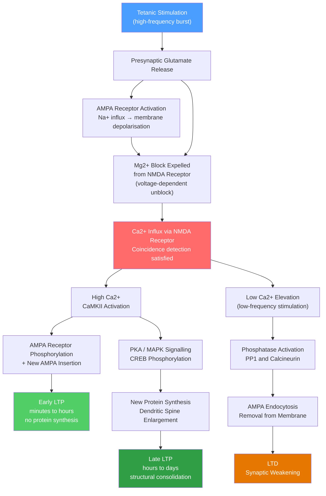

# 🧠 Synaptic Plasticity and LTP

> [!abstract] TL;DR
> Synaptic plasticity is the ability of a synapse to strengthen or weaken over time in response to activity — it is the cellular basis of learning and memory. Long-Term Potentiation (LTP) is the best-characterised form: persistent strengthening driven by Ca²⁺ influx through the NMDA receptor, which acts as a molecular coincidence detector requiring simultaneous pre- and postsynaptic activity. Its mirror image, Long-Term Depression (LTD), weakens synapses via lower Ca²⁺ elevations, and together the two processes let neural circuits encode, store, and update information.

## Intuition — analogy FIRST

Imagine a dirt path through a field. The first time you walk it, you barely disturb the grass. Walk it every day and a clear trail forms — it becomes easier to follow and increasingly hard to erase. Leave it unused for months and it fades. Synapses work exactly this way: repeated co-activation "wears in" the connection, making future signalling more efficient; disuse lets it fade.

Donald Hebb captured this in 1949: **"neurons that fire together, wire together."** The NMDA receptor is the molecular implementation of that rule — it opens only when both the presynaptic terminal releases glutamate *and* the postsynaptic membrane is already depolarised, making it a biological AND gate that detects correlation in time.

---

## How It Works

**LTP pathway** (high-frequency / tetanic stimulation):
1. Presynaptic burst releases glutamate into the cleft.
2. Glutamate activates AMPA receptors → Na⁺ influx → partial depolarisation.
3. Sufficient depolarisation expels the Mg²⁺ ion that normally blocks the NMDA channel at rest.
4. With Mg²⁺ gone and glutamate still bound, the NMDA channel opens → **Ca²⁺ influx**.
5. High Ca²⁺ activates **CaMKII** (Ca²⁺/calmodulin-dependent protein kinase II).
6. CaMKII phosphorylates existing AMPA receptors (increasing conductance) and triggers vesicle exocytosis to insert *new* AMPA receptors into the postsynaptic density → **early LTP** (minutes to hours; no gene expression needed).
7. Parallel PKA → MAPK signalling phosphorylates **CREB**, a transcription factor, driving new protein synthesis and dendritic spine enlargement → **late LTP** (hours to days; protein-synthesis-dependent).

**LTD pathway** (low-frequency stimulation, ~1 Hz):
- Lower-frequency input produces a modest, prolonged Ca²⁺ rise (not a sharp, high spike).
- Low Ca²⁺ preferentially activates **protein phosphatases** (PP1, calcineurin).
- Phosphatases dephosphorylate AMPA receptors and trigger their endocytosis (clathrin-mediated removal from the membrane).
- Fewer AMPA receptors → smaller EPSP → synaptic weakening.



---

## Key Concepts / Details

### Secondary Level

**Synaptic strengthening and weakening:** Synapses are not fixed wires; their efficacy changes continuously. A stronger synapse produces a larger excitatory postsynaptic potential (EPSP) from the same presynaptic stimulus. LTP makes synapses stronger; LTD makes them weaker. This bidirectional modifiability is the foundation of adaptive neural circuits.

**Hebb's Rule:** Donald Hebb proposed in *The Organization of Behavior* (1949) that when neuron A repeatedly causes neuron B to fire, the connection from A to B is selectively strengthened. This "fire together, wire together" principle predates the molecular discovery of LTP by over two decades but accurately predicted its activity dependence.

**LTP vs LTD — the calcium hypothesis:** Both processes are triggered by Ca²⁺ entry through NMDA receptors, but the *pattern* matters. A sharp, high-amplitude Ca²⁺ transient (from high-frequency stimulation) drives LTP; a slower, lower-amplitude rise (from low-frequency stimulation) activates different downstream enzymes and drives LTD. The synapse reads a Ca²⁺ signal and decides whether to strengthen or weaken.

**Role in memory:** LTP is not the memory itself — it is the cellular mechanism that makes a synaptic pathway more responsive. Repeated activation of a hippocampal pathway during an experience encodes that experience through a distributed pattern of LTP across many synapses. Blocking NMDA receptors (with AP5) prevents LTP and also prevents spatial learning in rodents (Morris Water Maze), providing causal evidence for the link.

---

### Undergraduate Level

**NMDA receptor as coincidence detector:** The NMDA receptor is both ligand-gated (requires glutamate + glycine/serine co-agonist) and voltage-gated (Mg²⁺ block relieved only by depolarisation). Both conditions must be met simultaneously for the channel to conduct Ca²⁺. This AND-gate property means the synapse opens only when presynaptic activity coincides with strong postsynaptic activation — precisely Hebb's rule in molecular form.

**Mg²⁺ block in detail:** At resting membrane potential (~−70 mV), Mg²⁺ (extracellular Mg²⁺ concentration ~1 mM) occludes the NMDA channel pore in a voltage-dependent manner. Depolarisation to approximately −30 mV or beyond relieves the block by electrostatic repulsion. This is not a gating event in the classical sense — the channel is already open to Mg²⁺; depolarisation simply clears the blocker.

**CaMKII — the molecular switch:** CaMKII is the primary Ca²⁺ sensor for LTP induction. It has a remarkable auto-phosphorylation property: once activated, it can phosphorylate itself at Thr286, rendering it constitutively active even after Ca²⁺ returns to baseline. This molecular "memory" persists after the stimulus and drives continued AMPA trafficking. Transgenic mice with a non-autophosphorylatable CaMKII (T286A mutation) show normal synaptic transmission but impaired LTP and spatial learning.

**AMPA trafficking:** Early LTP is mechanistically a redistribution of AMPA receptors. GluA1-containing AMPA receptors are stored in recycling endosomes within the dendritic spine. CaMKII phosphorylation of GluA1 Ser831 increases single-channel conductance; phosphorylation also triggers exocytosis, inserting more AMPA receptors into the postsynaptic density. The result: the same glutamate release from the presynaptic terminal now activates more receptors.

**Tetanic stimulation and early vs late LTP:** In slice electrophysiology, LTP is induced by delivering 1–4 trains of 100 Hz stimulation for 1 second (tetanus). A single tetanus gives early LTP that decays within 1–3 hours. Multiple spaced tetanic trains, or pairing with a protein synthesis inducer, convert early to late LTP. The distinction maps onto the consolidation of short-term memory into long-term memory.

**Spike-Timing Dependent Plasticity (STDP):** STDP is a synaptic learning rule discovered in cortical and hippocampal neurons that refines the temporal resolution of Hebbian learning. Whether a synapse strengthens or weakens depends on the *order* and *time difference* between the pre- and postsynaptic spikes:
- **Pre before post** (Δt > 0, up to ~40 ms): LTP — the presynaptic spike arrives and depolarises the dendrite just in time for the backpropagating action potential to complete the NMDA unblock.
- **Post before pre** (Δt < 0): LTD — the postsynaptic neuron fires before the presynaptic input arrives; the window for Ca²⁺ coincidence is missed, leading to phosphatase-driven weakening.

---

### Graduate Level

**Protein synthesis and late LTP:** Late LTP (L-LTP) requires de novo mRNA translation and is blocked by protein synthesis inhibitors (anisomycin, cycloheximide) applied during the induction window. The proteins synthesised include new AMPA subunits, scaffolding proteins (Homer, Shank), and structural cytoskeletal elements (Arc/Arg3.1) that remodel the dendritic spine. Arc mRNA is unique in being rapidly localised to recently activated synapses within minutes of induction — a form of synaptic address labelling.

**CREB and transcription-dependent consolidation:** The transcription factor CREB (cAMP response element-binding protein) is phosphorylated at Ser133 downstream of PKA and MAPK cascades activated during LTP induction. Phospho-CREB recruits CBP (CREB-binding protein / histone acetyltransferase) to target gene promoters, opening chromatin and driving transcription of *BDNF*, *c-fos*, *zif268*, and synaptic structural genes. Mice with forebrain-specific CREB knockdown show normal LTP at 1 hour but fail to maintain it beyond 3 hours and show profound long-term memory deficits.

**Synaptic tagging and capture (STC):** A single weak tetanus to pathway A sets a "synaptic tag" at recently activated synapses — the tag is a local, protein-synthesis-independent molecular marker (possibly CaMKII, PKMζ, or phosphorylated GluA1). Within ~1–2 hours, if a strong stimulus induces protein synthesis *anywhere* in the same neuron, the tag at pathway A captures the newly synthesised proteins and converts early to late LTP even at a synapse that was only weakly stimulated. STC provides a cellular mechanism for how an emotionally salient experience can consolidate memory traces in disparate pathways activated around the same time.

**Structural plasticity and spine remodelling:** LTP is not only biochemical; it is architectural. Two-photon time-lapse imaging in vivo shows that LTP induction causes dendritic spines to increase in head volume (correlating with AMPA receptor content) and neck width (decreasing electrical isolation from the dendrite shaft). New filopodia can also sprout and mature into mushroom spines over hours. Conversely, LTD correlates with spine shrinkage and occasional retraction. These structural changes are mediated by actin polymerisation (Rac1/Rho GTPase pathways, cofilin regulation) and provide the physical substrate for durable memory traces.

**Optogenetics to dissect plasticity circuits:** Channelrhodopsin-2 (ChR2) expressed in specific neuron populations allows millisecond-precision light-evoked firing. Pairing light-evoked presynaptic ChR2 activation with postsynaptic current injection in defined temporal windows can induce STDP ex vivo in a cell-type-specific manner that classical electrical stimulation cannot achieve. The 2016 Roy et al. and 2019 Nabavi et al. studies used optogenetics to demonstrate that fear memories can be artificially implanted and erased in the amygdala by controlling synapse-specific LTP and LTD, providing the clearest causal link between synaptic plasticity and behavioural memory.

**STDP learning rules — formal description:** For the canonical pair-based rule, the weight change Δw for a synapse as a function of the timing difference Δt = t_post − t_pre is:

$$\Delta w =
\begin{cases}
A_+ \, e^{-\Delta t / \tau_+} & \Delta t > 0 \quad \text{(LTP, pre before post)} \\
-A_- \, e^{+\Delta t / \tau_-} & \Delta t < 0 \quad \text{(LTD, post before pre)}
\end{cases}$$

Typical values: A₊ ≈ 0.01, A₋ ≈ 0.0105 (slight LTD dominance ensures net weight stability), τ₊ ≈ τ₋ ≈ 17–25 ms. The slight asymmetry A₋ > A₊ prevents runaway potentiation and implements a form of weight normalisation. Higher-order rules (triplet STDP, Pfister & Gerstner 2006) improve agreement with rate-coded experiments but reduce tractability.

---

## Python Demo

```python
import numpy as np
import matplotlib.pyplot as plt

# STDP canonical pair-based rule
A_plus  = 0.010   # LTP amplitude
A_minus = 0.0105  # LTD amplitude (slight excess for weight stability)
tau_plus  = 20.0  # ms — LTP time constant
tau_minus = 20.0  # ms — LTD time constant

# Spike timing difference Δt = t_post - t_pre in ms
dt = np.linspace(-100, 100, 2000)

# Weight change rule
delta_w = np.where(
    dt > 0,
     A_plus  * np.exp(-dt / tau_plus),   # pre before post → LTP
    -A_minus * np.exp( dt / tau_minus)   # post before pre → LTD
)

fig, ax = plt.subplots(figsize=(8, 4))
ax.fill_between(dt[dt > 0], 0, delta_w[dt > 0], alpha=0.25, color='steelblue')
ax.fill_between(dt[dt < 0], 0, delta_w[dt < 0], alpha=0.25, color='tomato')
ax.plot(dt[dt > 0], delta_w[dt > 0], color='steelblue', lw=2,
        label=r'LTP: $\Delta w = A_+ e^{-\Delta t/\tau_+}$   (pre before post)')
ax.plot(dt[dt < 0], delta_w[dt < 0], color='tomato', lw=2,
        label=r'LTD: $\Delta w = -A_- e^{+\Delta t/\tau_-}$  (post before pre)')
ax.axhline(0, color='k', lw=0.8)
ax.axvline(0, color='k', lw=0.8, ls='--')
ax.set_xlabel(r'Spike timing difference  $\Delta t = t_{post} - t_{pre}$  (ms)')
ax.set_ylabel(r'Synaptic weight change  $\Delta w$')
ax.set_title('STDP Learning Window  —  canonical pair-based rule')
ax.legend(fontsize=9)
plt.tight_layout()
plt.show()
```

The plot reproduces the asymmetric "Mexican hat" shape first published by Markram et al. (1997) and Bi & Poo (1998): a sharp LTP peak for small positive Δt decaying over ~20 ms, and a slightly larger-amplitude LTD wing for negative Δt. The zero-crossing at Δt = 0 embodies Hebb's rule.

---

## Real-World Applications

**Memory and learning — hippocampus:** Spatial and episodic memories require hippocampal LTP. Rats given NMDA antagonist AP5 infused into the hippocampus cannot acquire the Morris Water Maze (spatial navigation) but can still perform previously learned routes. Human patients with hippocampal lesions (patient H.M., following bilateral hippocampectomy) lose the ability to form new declarative memories, consistent with a disrupted plasticity-dependent encoding mechanism.

**Addiction — aberrant plasticity in reward circuits:** Repeated exposure to drugs of abuse (cocaine, opioids) drives LTP-like potentiation at glutamatergic synapses onto ventral tegmental area (VTA) dopamine neurons and nucleus accumbens medium spiny neurons. This aberrant plasticity re-weights reward circuitry, making drug-associated cues disproportionately salient. Blocking AMPA receptor insertion at these synapses (experimental) reduces reinstatement of drug-seeking in rodent models.

**Chronic pain — spinal LTP:** The spinal dorsal horn exhibits NMDA-dependent LTP at C-fibre synapses following peripheral tissue injury — a phenomenon called "wind-up" and central sensitisation. This spinal LTP amplifies pain signals after inflammation or nerve injury, contributing to allodynia (pain from normally innocuous stimuli). NMDA antagonists (ketamine at sub-anaesthetic doses) partially reverse central sensitisation in clinical settings.

**Fear memory — amygdala LTP:** Conditioned fear learning (pairing a tone with a footshock) drives LTP at thalamo-amygdala and cortico-amygdala synapses in the basolateral amygdala (BLA). LTP here is required for the formation of the fear memory trace: NMDA receptor blockade in the amygdala during conditioning prevents fear acquisition. Optogenetic LTD induction at the same synapses can erase the fear memory (Nabavi et al., Nature 2014), establishing a direct causal link.

**Cognitive decline — therapeutic targets:** Alzheimer's disease is associated with synaptic loss and impaired LTP before significant neuronal death. Amyloid-β oligomers selectively depress hippocampal LTP by facilitating AMPA receptor endocytosis via a pathway that mimics LTD induction. Strategies to prevent GluA1 internalisation or to restore CaMKII activity are active drug discovery targets.

---

## Common Pitfalls

- **LTP is not memory — it is a mechanism.** LTP demonstrated in a brain slice is a cellular phenomenon. Whether a given behavioural memory is stored by LTP at specific synapses requires additional evidence (pharmacological block during learning, synapse-specific optogenetic manipulation). Assuming the two are equivalent without further evidence is a logical leap still debated in the field.
- **NMDA-receptor block by Mg²⁺ is voltage-dependent, not ligand-gated only.** Students often describe NMDA receptors as "requiring both glutamate and glycine to open." That is necessary but not sufficient — the Mg²⁺ block must also be relieved by depolarisation. A synapse that receives glutamate while the postsynaptic membrane is at rest will not produce significant Ca²⁺ influx, regardless of glutamate concentration.
- **Correlation ≠ causation in Hebbian learning.** Hebb's rule states that correlated activity strengthens connections; it does not state *why* the correlation occurs. STDP refines this to a causal window (pre before post = pre *caused* post), but even STDP correlations can be driven by common third-party inputs rather than true monosynaptic causation. Interpreting correlations in network recordings as evidence of Hebbian weight changes requires ruling out alternative sources of correlated firing.
- **Early LTP and late LTP are mechanistically distinct.** Blocking protein synthesis after a single tetanus does not impair the first ~1–2 hours of LTP. Experiments that test only early time points (e.g., 30–60 min post-induction) may miss the protein-synthesis-dependent late phase, leading to under-estimation of drug effects on memory consolidation.
- **LTP magnitude is not linear with stimulation intensity.** There is a non-linear relationship between NMDA Ca²⁺ influx and CaMKII activation due to cooperativity in calmodulin binding. Very strong stimulation can saturate LTP, masking differences between conditions in over-stimulated ex vivo preparations.

---

## Related Concepts

- [[_MOC_Cellular_and_Molecular_Neuroscience|↑ Cellular and Molecular Neuroscience MOC]] — section entry point and concept map for this topic cluster
- [[Neural_Network_Basics]] — Artificial neural networks are mathematically inspired by Hebbian plasticity; weight updates in backpropagation are a computational analogue of STDP (cross-vault: AI-ML)
- [[Memory_Systems]] — Synaptic plasticity provides the cellular substrate for the hippocampus-dependent declarative memory systems described in cognitive psychology (cross-vault: Psychology)
- [[Biological_Basis_of_Behavior]] — Neurochemical and structural foundations of behaviour, including the role of neurotransmitters in plasticity induction (cross-vault: Psychology)

> **Forward links (notes planned for this vault):**
> - `Synaptic_Transmission_and_Neurotransmitters` — glutamate receptor subtypes (AMPA, NMDA, mGluR) that mediate plasticity induction
> - `Ion_Channels_and_Receptor_Pharmacology` — voltage-gated Ca²⁺ channels and the pharmacology of NMDA antagonists (AP5, ketamine, memantine)
> - `Learning_and_Memory_Systems` — systems-level consolidation: how synaptic LTP in the hippocampus is transformed into neocortical engrams during sleep
> - `Hippocampus_and_Spatial_Navigation` — place cells and the spatial map as an in vivo readout of hippocampal LTP
> - `Neural_Coding_and_Spike_Trains` — rate codes vs temporal codes; how STDP implements temporal coding at the synaptic level

---

## Review Questions

1. **(Secondary)** Explain in plain language why a glutamate-releasing synapse does NOT produce Ca²⁺ influx through NMDA receptors when the postsynaptic neuron is at rest, but does when the neuron is strongly active. What structural feature of the receptor accounts for this?
2. **(Undergraduate)** A researcher applies a protein synthesis inhibitor to a hippocampal slice and then delivers four spaced tetanic trains. She observes robust LTP at 30 minutes but no LTP at 3 hours. (a) What phase of LTP is blocked? (b) Which signalling molecules upstream of protein synthesis are unaffected? (c) What does this tell us about the mechanism of memory consolidation?
3. **(Graduate)** In the synaptic tagging and capture model, a weak stimulus to pathway A sets a tag but not late LTP; a strong stimulus to a different pathway B induces protein synthesis. Describe the molecular sequence by which pathway A captures B's proteins to achieve late LTP, and propose an experiment using pathway-specific optogenetics to test whether the captured proteins are required at pathway A specifically or merely in the postsynaptic neuron globally.

---

## Sources

- Bliss, T.V.P. & Collingridge, G.L. (1993). "A synaptic model of memory: long-term potentiation in the hippocampus." *Nature*, 361, 31–39.
- Kandel, E.R., Schwartz, J.H., Jessell, T.M., Siegelbaum, S.A. & Hudspeth, A.J. (2013). *Principles of Neural Science*, 5th ed. McGraw-Hill.
- Malenka, R.C. & Bear, M.F. (2004). "LTP and LTD: An embarrassment of riches." *Neuron*, 44(1), 5–21.
- Bi, G.-Q. & Poo, M.-M. (1998). "Synaptic modifications in cultured hippocampal neurons: dependence on spike timing, synaptic strength, and postsynaptic cell type." *Journal of Neuroscience*, 18(24), 10464–10472.
- Sjöström, P.J. & Gerstner, W. (2010). "Spike-timing dependent plasticity." *Scholarpedia*, 5(2), 1362. [https://lcnwww.epfl.ch/gerstner/PUBLICATIONS/STDP-Scholarpedia2010.pdf](https://lcnwww.epfl.ch/gerstner/PUBLICATIONS/STDP-Scholarpedia2010.pdf)
- Nabavi, S. et al. (2014). "Engineering a memory with LTD and LTP." *Nature*, 511, 348–352.
- Bhattacharyya, A. & Bhattacharyya, K. (2015). "Memory consolidation: synaptic and systems-level mechanisms." *Frontiers in Systems Neuroscience*, review.

---

#Neuroscience #CellularNeuroscience #SynapticPlasticity #Memory
