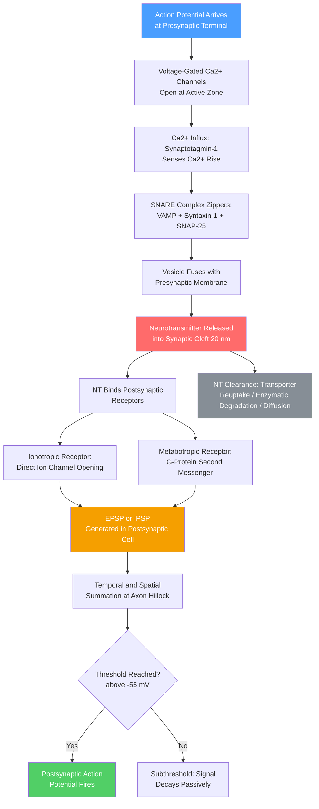

# ⚡ Synaptic Transmission and Neurotransmitters

> [!abstract] TL;DR
> A chemical synapse is a one-way junction between two neurons: the presynaptic cell packages neurotransmitters into vesicles, and an action potential triggers a Ca²⁺-dependent SNARE-protein-driven fusion event that releases those molecules into a 20 nm cleft, where they bind postsynaptic receptors and generate either a depolarizing EPSP or a hyperpolarizing IPSP. Whether that graded potential produces a new action potential depends on the algebraic summation of hundreds of synaptic inputs arriving across time and dendritic space — a computation performed continuously at every neuron in the brain. This process underlies all neural computation from spinal reflexes to working memory, and its molecular machinery is the target of nearly every clinically used psychiatric and neurological drug.

## Intuition — analogy FIRST

Imagine the synapse as a **chemical mailbox system**. The presynaptic terminal is the sender: it packs a letter (neurotransmitter molecules) into a padded envelope (synaptic vesicle) and slides it through a mail slot (the synaptic cleft, a 20 nm gap too narrow for direct contact). The postsynaptic membrane is the recipient's front door, fitted with specialized mailboxes (receptors) that only accept certain envelope shapes. Once a letter drops in, the recipient decides whether the message is important enough to act on — to fire its own action potential — or to simply absorb it.

The key insight is that **no single letter triggers action**. The postsynaptic neuron simultaneously collects mail from hundreds or thousands of senders. Only when enough excitatory letters pile up — and inhibitory "stop" letters do not cancel them — does the cell act. This is summation, and it is the elementary unit of decision-making in the nervous system.

---

## How It Works



---

## Key Concepts / Details

### Secondary Level

**The Four Structural Components of a Chemical Synapse**

| Component | Location | Role |
|-----------|----------|------|
| Presynaptic terminal (bouton) | Axon terminal of sending neuron | Synthesizes, stores, and releases NT |
| Synaptic cleft | 20–40 nm extracellular gap | NT diffusion space; no direct cytoplasmic contact |
| Postsynaptic membrane | Dendrite or cell body of receiving neuron | Bears receptors; generates PSP |
| Postsynaptic density (PSD) | Protein scaffold under postsynaptic membrane | Anchors receptors and downstream signaling proteins |

**Excitatory vs Inhibitory Neurotransmitters**

A neurotransmitter is not intrinsically excitatory or inhibitory — it is the *receptor* that determines the effect. By convention, NTs are classified by their predominant action at their major synaptic targets:

| NT | Predominant Effect | Key Receptors | Primary Function |
|----|--------------------|---------------|-----------------|
| **Glutamate** | Excitatory | AMPA, NMDA, Kainate, mGluR | Main CNS excitatory NT; learning and memory |
| **GABA** | Inhibitory | GABA-A (ionotropic), GABA-B (metabotropic) | Main CNS inhibitory NT; anxiety and sedation target |
| **Dopamine** | Modulatory | D1–D5 (all metabotropic) | Reward, motor control, working memory |
| **Serotonin (5-HT)** | Modulatory | 5-HT₁–₇ (mostly metabotropic), 5-HT₃ (ionotropic) | Mood, sleep, appetite, gut motility |
| **Acetylcholine** | Excitatory (NMJ); modulatory (CNS) | nAChR (ionotropic), mAChR (metabotropic) | Motor command, attention, memory consolidation |
| **Norepinephrine** | Modulatory | α₁, α₂, β₁, β₂ (all metabotropic) | Arousal, fight-or-flight response, attention |
| **Glycine** | Inhibitory | GlyR (ionotropic Cl⁻ channel) | Fast inhibition in spinal cord and brainstem |

**The Basic Sequence of Synaptic Transmission**

1. An action potential invades the presynaptic axon terminal.
2. Depolarization opens voltage-gated Ca²⁺ channels at the active zone.
3. Ca²⁺ rushes in, binding synaptotagmin-1 on synaptic vesicles.
4. Synaptic vesicles fuse with the presynaptic membrane; NT molecules are expelled into the cleft.
5. NT diffuses the 20 nm gap in ~50 µs and binds postsynaptic receptors.
6. Receptor activation changes postsynaptic membrane conductance, producing a PSP.
7. NT is removed by reuptake transporters, enzymatic degradation, or simple diffusion.

---

### Undergraduate Level

**Ionotropic vs Metabotropic Receptors**

| Feature | Ionotropic | Metabotropic (GPCR) |
|---------|-----------|---------------------|
| Structure | Ligand-gated ion channel (single protein complex) | G-protein-coupled receptor (7-TM) |
| Speed | Fast (1–10 ms onset) | Slow (100 ms to seconds) |
| Primary effect | Direct ion flow → immediate change in Vm | Activates G-protein → second messengers |
| Signal amplification | None; current set by channel conductance | High: one GPCR activates many G-proteins |
| Examples | AMPA, NMDA, GABA-A, nAChR, 5-HT₃, GlyR | mGluR1–8, GABA-B, D1–D5, all adrenoceptors, mAChR |

**EPSP and IPSP Summation**

A single EPSP depolarizes the membrane by only ~0.5–2 mV — far below the action potential threshold of ~−55 mV from a resting potential of ~−70 mV. The neuron therefore acts as a **linear integrator** over short time windows:

- **Temporal summation**: the same synapse fires multiple times in rapid succession. If the inter-stimulus interval is shorter than the PSP decay time constant (~5–20 ms), successive PSPs ride on top of each other and accumulate.
- **Spatial summation**: many synapses on different parts of the dendritic tree activate simultaneously. Their PSPs spread passively toward the axon hillock, where they sum algebraically.
- **Shunting inhibition**: inhibitory conductance inputs (Cl⁻ or K⁺) reduce the driving force for EPSPs even without large hyperpolarization, clamping Vm near the inhibitory reversal potential and effectively dividing excitatory input.

The decision point is the **axon hillock (initial segment)**, which has the highest density of voltage-gated Na⁺ channels and the lowest action potential threshold — it is the site of integration and binary decision.

**Quantal Release and Miniature EPSPs**

NT is released in discrete *quanta* — the content of one synaptic vesicle (~2,000–5,000 NT molecules). Even in the absence of action potentials, vesicles randomly fuse with the membrane, producing **miniature EPSPs (mEPSPs)** of uniform amplitude. This quantal size $q$ reveals the single-vesicle contribution. The mean quantal content per action potential follows binomial statistics (del Castillo and Katz, 1954):

$$m = n \cdot p$$

where $n$ is the number of docked vesicles (release sites) and $p$ is the release probability per site per AP. Quantal analysis at the frog neuromuscular junction established this framework and remains the gold standard for characterizing synaptic strength.

**SNARE Proteins and Vesicle Fusion**

Three core proteins drive membrane fusion:

1. **Synaptobrevin / VAMP-2** — v-SNARE on the vesicle membrane
2. **Syntaxin-1** — t-SNARE on the presynaptic plasma membrane
3. **SNAP-25** — second t-SNARE contributing two helices

The four helices (one from synaptobrevin, one from syntaxin, two from SNAP-25) zipper from the N-terminus to the C-terminus, drawing the two membranes into contact and overcoming the hydration barrier. Regulatory proteins that shape this process include:

- **Munc18-1** — essential chaperone that escorts syntaxin into a fusion-competent open conformation
- **Munc13** — primes vesicles by displacing the Munc18 closed conformation of syntaxin
- **Complexin** — stabilizes the partially-zippered SNARE complex in a "cocked" prefusion state
- **Synaptotagmin-1** — the Ca²⁺ sensor; its tandem C2A/C2B domains bind Ca²⁺ and membrane phospholipids to release the complexin clamp and trigger fusion within ~0.2 ms of Ca²⁺ entry

**Ca²⁺ Dependence**

Exocytosis has a steep, highly cooperative dependence on local Ca²⁺ concentration: the release rate scales approximately as $[\text{Ca}^{2+}]^4$ near the active zone. Voltage-gated Ca²⁺ channels (primarily Cav2.1/P-type and Cav2.2/N-type) are clustered within ~20 nm of docked vesicles. Their opening creates transient microdomains of 100–300 µM Ca²⁺ that collapse within microseconds, ensuring the remarkable temporal precision (~0.2 ms jitter) of fast synaptic transmission.

---

### Graduate Level

**SNARE Complex Architecture and Energetics**

The assembled *trans*-SNARE complex forms a parallel four-helix coiled-coil bundle with 16 hydrophobic layers. Single-molecule force spectroscopy estimates the energy released per SNARE complex at ~35 $k_BT$. The energy barrier for merging two lipid bilayers is ~40–80 $k_BT$, implying that two to five SNARE complexes cooperate per vesicle fusion event. After exocytosis, the stuck *cis*-SNARE complex (both membranes now fused) is disassembled by **NSF** (an AAA⁺ ATPase) using ~1 ATP, assisted by α-SNAP as an adaptor, recycling all three components for the next cycle.

**Vesicle Pools**

Active zone vesicles are organized into three functionally distinct pools distinguished by their mobilization kinetics:

| Pool | Fraction of Total | Mobilization Timescale | Function |
|------|-------------------|------------------------|----------|
| Readily Releasable Pool (RRP) | ~1–5% | Milliseconds (single AP) | Immediate fast transmission at rest |
| Recycling Pool | ~10–20% | Seconds (moderate stimulation) | Replenishes RRP during sustained activity |
| Reserve (Resting) Pool | ~75–85% | Minutes (intense stimulation) | Long-term reservoir; requires actin cytoskeleton remodeling |

High-frequency stimulation depletes the RRP faster than it can be refilled, producing **synaptic depression**. The refilling rate at physiological temperature (~37 °C) is ~1–2 s, setting a fundamental upper bound on the reliable transmission frequency for depressing synapses.

**Short-Term Synaptic Plasticity**

Activity-dependent changes in synaptic efficacy lasting milliseconds to minutes arise from changes in the three quantal parameters ($n$, $p$, or $q$):

- **Facilitation**: residual Ca²⁺ from the previous AP adds to the next Ca²⁺ transient, raising $p$ transiently. Dominant at synapses with low basal $p$ (e.g., cerebellar granule → Purkinje cell parallel fiber synapse, calyx of Held at low frequencies). Time constant ~50–200 ms.
- **Depression**: RRP depletion reduces available $n$. Dominant at high-$p$ synapses (e.g., climbing fiber → Purkinje cell). Time constant for recovery ~1–2 s.
- **Augmentation**: intermediate enhancement (seconds) thought to involve a secondary Ca²⁺-binding site distinct from synaptotagmin-1. Overlaps temporally with PTP.
- **Post-Tetanic Potentiation (PTP)**: minutes-long enhancement following tetanic bursts, driven by PKC activation via residual Ca²⁺ and diacylglycerol. Distinct from long-term potentiation (LTP) because it does not require postsynaptic mechanisms.

Computationally, facilitating synapses function as high-pass temporal filters; depressing synapses as low-pass (or gain-control) filters.

**Retrograde Signaling: Endocannabinoids**

Postsynaptic neurons can signal *backward* across the synapse — retrograde signaling. Strong postsynaptic depolarization or group I mGluR activation triggers synthesis of endocannabinoids (2-arachidonoylglycerol, 2-AG; anandamide/AEA) via phospholipase C → diacylglycerol lipase (DAGL). Being lipophilic, these molecules diffuse through the membrane and across the cleft to bind presynaptic **CB1 receptors** (Gi/o-coupled GPCRs), which suppress VGCC activity and activate inwardly-rectifying K⁺ channels, thereby reducing NT release. This mechanism produces:

- **Depolarization-induced Suppression of Inhibition (DSI)**: endocannabinoids suppress presynaptic GABA release → disinhibition.
- **Depolarization-induced Suppression of Excitation (DSE)**: suppress presynaptic glutamate release → reduced excitation.

These phenomena are widespread in the hippocampus, cerebellum, and striatum and represent a fundamental form of activity-dependent gain control distinct from standard Hebbian plasticity.

**Electrical Synapses: Gap Junctions**

Not all synapses are chemical. Gap junctions formed by **connexins** (vertebrates) or **innexins** (invertebrates) directly couple the cytoplasm of adjacent cells through hexameric hemichannels (connexons). Ion flow is bidirectional, instantaneous (no synaptic delay), and passes ions and small molecules up to ~1 kDa. Electrical synapses enable millisecond-precision synchronization and occur in:

- Retina (AII amacrine cell networks, horizontal cells)
- Inferior olive (coupled climbing fiber neurons; important for cerebellar timing)
- Brainstem escape circuits (Mauthner cell network in fish)
- Neonatal cortex (during oscillatory network maturation)
- Thalamic reticular nucleus (gamma oscillations)

Connexin-36 (Cx36) is the dominant neuronal gap junction protein in the mammalian CNS. Gap junctions are dynamically regulated by intracellular Ca²⁺, pH, voltage, and phosphorylation by PKA/PKC.

---

## Python Demo

```python
import numpy as np
import matplotlib.pyplot as plt

def psp(t, t_onset, amplitude, tau_rise=1.0, tau_decay=8.0):
    """Double-exponential PSP model (ms timescale).
    Simulates EPSP summation at a postsynaptic neuron.
    Returns membrane potential change in mV."""
    dt = t - t_onset
    raw = np.where(dt > 0, np.exp(-dt / tau_decay) - np.exp(-dt / tau_rise), 0.0)
    # Normalize so peak equals the specified amplitude
    t_peak = (tau_rise * tau_decay) / (tau_decay - tau_rise) * np.log(tau_decay / tau_rise)
    norm = np.exp(-t_peak / tau_decay) - np.exp(-t_peak / tau_rise)
    return (amplitude / norm) * raw

t = np.linspace(0, 120, 2000)   # 120 ms simulation window
V_REST    = -70.0                # mV resting membrane potential
THRESHOLD = -55.0                # mV action potential threshold
EPSP_AMP  =  3.5                 # mV peak depolarization per single EPSP

fig, axes = plt.subplots(1, 3, figsize=(15, 5))
fig.suptitle("EPSP Summation at a Postsynaptic Neuron", fontsize=14, fontweight="bold")

# --- Panel 1: single EPSP — subthreshold ---
v1 = V_REST + psp(t, 10, EPSP_AMP)
axes[0].plot(t, v1, color="steelblue", lw=2, label="Vm")
axes[0].axhline(THRESHOLD, color="red", ls="--", lw=1.5, label="Threshold (−55 mV)")
axes[0].axhline(V_REST,    color="gray", ls=":",  lw=1,   label="Resting Vm (−70 mV)")
axes[0].set(title="Single EPSP — Subthreshold",
            xlabel="Time (ms)", ylabel="Membrane Potential (mV)", ylim=(-75, -50))
axes[0].legend(fontsize=8)

# --- Panel 2: temporal summation — one synapse firing at 50 Hz ---
onsets_t = [10, 30, 50, 70, 90]           # inter-stimulus interval = 20 ms
v2 = V_REST + sum(psp(t, o, EPSP_AMP) for o in onsets_t)
axes[1].plot(t, v2, color="darkorange", lw=2, label="Vm")
axes[1].axhline(THRESHOLD, color="red", ls="--", lw=1.5, label="Threshold")
axes[1].axhline(V_REST,    color="gray", ls=":",  lw=1,   label="Resting Vm")
axes[1].fill_between(t, THRESHOLD, v2,
                     where=(v2 >= THRESHOLD), color="red", alpha=0.25,
                     label="Above threshold")
for o in onsets_t:
    axes[1].axvline(o, color="purple", alpha=0.3, lw=1)
axes[1].set(title="Temporal Summation (50 Hz burst)",
            xlabel="Time (ms)", ylim=(-75, -50))
axes[1].legend(fontsize=8)

# --- Panel 3: spatial summation — N independent synapses firing simultaneously ---
input_counts = list(range(1, 9))
peaks = []
for n in input_counts:
    combined = np.zeros_like(t)
    for _ in range(n):
        combined += psp(t, 10, EPSP_AMP)
    peaks.append(float((V_REST + combined).max()))

bar_colors = ["green" if p >= THRESHOLD else "steelblue" for p in peaks]
axes[2].bar(input_counts, peaks, color=bar_colors, edgecolor="black", lw=0.7)
axes[2].axhline(THRESHOLD, color="red", ls="--", lw=1.5, label="Threshold")
axes[2].axhline(V_REST,    color="gray", ls=":",  lw=1,   label="Resting Vm")
for n, p in zip(input_counts, peaks):
    if p >= THRESHOLD:
        axes[2].text(n, p + 0.3, "AP!", ha="center", fontsize=8,
                     color="green", fontweight="bold")
axes[2].set(title="Spatial Summation (N simultaneous inputs)",
            xlabel="Number of simultaneous synaptic inputs",
            ylabel="Peak Membrane Potential (mV)", ylim=(-75, -47))
axes[2].legend(fontsize=8)

plt.tight_layout()
plt.savefig("epsp_summation.png", dpi=150)
plt.show()
```

The simulation shows three key results:

1. **Panel 1** — A single EPSP peaking at −66.5 mV never reaches the −55 mV threshold.
2. **Panel 2** — Five EPSPs from the same synapse at 50 Hz accumulate because the 8 ms decay constant is longer than the 20 ms interval; by the 4th stimulus the membrane briefly crosses threshold.
3. **Panel 3** — With simultaneous inputs, threshold is crossed with ~5 independent synapses each contributing 3.5 mV, illustrating the "voting" character of spatial integration.

---

## Real-World Applications

**Pharmacological Targets and Clinical Relevance**

| Drug / Condition | Synaptic Mechanism | Clinical Use |
|------------------|--------------------|--------------|
| **SSRIs** (fluoxetine, sertraline) | Block serotonin reuptake transporter (SERT) → prolonged 5-HT in cleft | Depression, anxiety, OCD |
| **SNRIs** (venlafaxine) | Block SERT and norepinephrine transporter (NET) | Depression, neuropathic pain |
| **Atypical antipsychotics** (clozapine) | D2/D4 receptor antagonism + 5-HT₂A blockade | Schizophrenia; less EPS than typical antipsychotics |
| **Benzodiazepines** (diazepam) | Positive allosteric modulation of GABA-A receptor | Anxiety, seizures, muscle spasm |
| **General anesthesia** (propofol) | Potentiates GABA-A; inhibits NMDA receptors | Loss of consciousness and analgesia |
| **Cocaine / amphetamines** | Block/reverse monoamine transporters → flood of DA, 5-HT, NE in cleft | Drugs of abuse; stimulant misuse |
| **Opioids** (morphine, fentanyl) | Agonists at µ-opioid receptors (Gi/o-coupled) → suppress NT release in pain circuits | Analgesia; severe dependence/overdose risk |
| **Myasthenia gravis** | Autoantibodies against nicotinic AChR (nAChR) at NMJ → NMJ transmission failure | Autoimmune fatigable muscle weakness |
| **Parkinson's disease** | Loss of dopaminergic neurons in substantia nigra → dopamine deficit at striatum | Bradykinesia, rigidity, tremor; treated with L-DOPA |
| **Botulinum toxin (Botox)** | Cleaves SNAP-25 (SNARE protein) → blocks ACh release at NMJ | Cosmetic; also spasticity and hyperhidrosis |

---

## Common Pitfalls

- **NTs do not directly cause action potentials** — They produce graded PSPs (EPSPs or IPSPs). An action potential fires only if the summed PSPs at the axon hillock cross threshold. Saying "glutamate fires the neuron" is an imprecise shortcut.
- **Reuptake is not degradation** — Reuptake returns NT to the presynaptic terminal for repackaging and re-release (e.g., dopamine via DAT, serotonin via SERT). Degradation destroys the NT in the cleft (e.g., AChE cleaves ACh at the NMJ; MAO degrades monoamines intracellularly). SSRIs block reuptake, not degradation.
- **Ionotropic does not always mean fast** — Ionotropic receptors open in milliseconds, but downstream effects (e.g., Ca²⁺ through NMDA receptors activating kinases) can last minutes. Conversely, some metabotropic cascades produce rapid changes in membrane conductance via βγ subunits opening GIRK channels.
- **Excitatory vs inhibitory is receptor-specific, not NT-specific** — GABA is inhibitory at GABA-A in adult neurons (Cl⁻ influx) but can be excitatory in neonatal neurons where the Cl⁻ gradient is reversed (high intracellular Cl⁻ before KCC2 expression). Glycine is inhibitory centrally but acetylcholine is excitatory at the NMJ — both use ionotropic receptors that are structurally homologous (Cys-loop superfamily).
- **Synaptic delay is not just diffusion time** — The ~0.3–1 ms synaptic delay is dominated by the time for Ca²⁺ entry, SNARE assembly, and vesicle fusion, not diffusion across the 20 nm cleft (which takes ~50 µs). Electrical synapses are faster precisely because they skip all of this.

---

## Related Concepts

- [[_MOC_Cellular_and_Molecular_Neuroscience|↑ Cellular and Molecular Neuroscience MOC]] — section entry point and concept map for this topic cluster
- [[Neuron_Structure_and_Function]] — the morphological substrate of the presynaptic and postsynaptic elements; dendrite geometry determines summation properties
- [[Action_Potentials_and_Resting_Membrane_Potential]] — the trigger (presynaptic AP) and the output (postsynaptic AP) that flank synaptic transmission
- [[Ion_Channels_and_Receptor_Pharmacology]] — the biophysical basis of how ionotropic receptors convert NT binding into ionic current
- [[Synaptic_Plasticity_and_LTP]] — how repeated synaptic activity permanently changes synaptic strength; short-term plasticity here feeds into long-term mechanisms there
- [[Psychopharmacology_and_Drug_Mechanisms]] — detailed pharmacology of every receptor class introduced here, including drug kinetics and side-effect profiles

Cross-vault links:
- [[Protein_Structure_and_Function]] (Chemistry) — receptor proteins and SNARE complex proteins are precisely folded structures whose function derives from their 3D conformation
- [[Membranes_and_Cell_Signaling]] (Chemistry) — the lipid bilayer, GPCR signal transduction cascades, and the electrochemical gradient framework that underlies PSP generation
- [[Biomolecules_Overview]] (Chemistry) — amino acid building blocks of NT-synthesizing enzymes, transporters, and receptor proteins
- [[Biological_Basis_of_Behavior]] (Psychology) — neurotransmitter systems (dopamine reward, serotonin mood, ACh attention) mapped onto behavioral functions and psychological disorders

---

## Review Questions

**Secondary**
1. A patient is treated with a drug that blocks voltage-gated Ca²⁺ channels specifically at presynaptic terminals. What happens to NT release, and what symptoms would you expect?
2. Explain why an EPSP from a single synapse is not enough to fire a postsynaptic neuron. What two mechanisms allow weak inputs to eventually trigger an action potential?
3. Compare and contrast glutamate and GABA in terms of the type of PSP each produces and the receptor families through which they act.

**Undergraduate**
1. At the neuromuscular junction, a single motor neuron action potential reliably produces an action potential in the muscle fiber. But at central synapses, a single presynaptic AP often does not fire the postsynaptic cell. Using quantal parameters ($n$, $p$, $q$) and the concept of the safety factor, explain this difference.
2. A researcher blocks GABA-A receptors with bicuculline in a cortical slice and observes epileptiform bursting. She then also applies an mGluR5 antagonist and the bursting is reduced. Construct a mechanistic explanation for why blocking a metabotropic receptor attenuates the bursting even though GABA-A is already blocked.
3. Design an experiment to distinguish between presynaptic and postsynaptic expression of long-term depression (LTD) at a glutamatergic synapse, using only electrophysiological recordings in a paired recording (pre + postsynaptic).

**Graduate**
1. The SNARE hypothesis predicts that botulinum neurotoxin (BoNT/A), which cleaves SNAP-25, should abolish fast Ca²⁺-triggered exocytosis but leave spontaneous miniature EPSPs intact at low toxin doses. What does the persistence (or loss) of minis at high BoNT/A doses tell us about whether SNAP-25 is required for spontaneous fusion?
2. Depolarization-induced suppression of inhibition (DSI) is eliminated by CB1 receptor knockout but only partially reduced by blocking 2-AG synthesis (DAGL inhibitor). What does this suggest about the identity of the endocannabinoid mediating DSI, and how would you experimentally determine whether anandamide or 2-AG is the dominant retrograde messenger at a given synapse?
3. A synapse shows paired-pulse facilitation at 50 Hz stimulation but paired-pulse depression at 100 Hz. Construct a model based on the three quantal parameters and two competing processes (residual Ca²⁺ vs RRP depletion) that explains this frequency-dependent sign reversal of short-term plasticity.

---

## Sources

- Kandel, E.R., Schwartz, J.H., Jessell, T.M., Siegelbaum, S.A., Hudspeth, A.J. (eds.) — *Principles of Neural Science*, 6th ed. (2021), Chapters 8–10 (Synaptic Transmission), Chapter 15 (Neurotransmitters)
- Südhof, T.C. — "Neurotransmitter Release: The Last Millisecond in the Life of a Synaptic Vesicle," *Neuron* 80(3): 675–690 (2013)
- Südhof, T.C. & Rizo, J. — "Synaptic Vesicle Exocytosis," *Cold Spring Harbor Perspectives in Biology* 3(12): a005637 (2011)
- del Castillo, J. & Katz, B. — "Quantal Components of the End-Plate Potential," *Journal of Physiology* 124(3): 560–573 (1954)
- Abbott, L.F. & Regehr, W.G. — "Synaptic Computation," *Nature* 431: 796–803 (2004)
- Bhattacharyya, S. — *Neuropharmacology: Drugs, the Brain, and Behavior*, 2nd ed., Chapters 3–5

---

#Neuroscience #CellularNeuroscience #Synapses #Neurotransmitters
