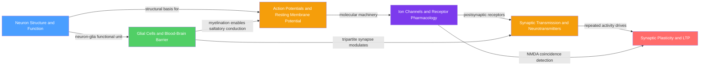

# Cellular and Molecular Neuroscience — Map of Content

> [!abstract] What this section covers
> This section builds neuroscience from the ground up, starting with the single neuron and its structural specialisations, moving through the ionic and molecular machinery that generates electrical signals, and arriving at synaptic communication and its long-term modification. It also covers the non-neuronal glial cells and the blood-brain barrier that together constitute the CNS microenvironment without which neurons cannot function. Mastery here provides the cellular and molecular vocabulary for every other section of the vault.

> [!info] How to use this map
> Start with **Neuron Structure**, follow the arrows through the learning path, and return to this map when you need to locate where a concept sits. Blue = foundational entry point, Red = most advanced, Green = infrastructure/support strand.

---

## Concept Map

*(Blue = foundational entry point; Orange = core signal-transmission notes; Purple = molecular pharmacology bridge; Red = advanced plasticity; Green = support infrastructure. Arrows mean "leads to" or "is required for".)*

---

## Learning Path

Recommended order for a first pass through this section:

1. [[Neuron_Structure_and_Function]] — start here; establishes the cell architecture, signal flow from dendrite to axon terminal, myelination, and the leaky integrate-and-fire intuition. Every subsequent note assumes this vocabulary.
2. [[Action_Potentials_and_Resting_Membrane_Potential]] — builds directly on neuron structure; covers the ionic mechanism of the resting potential, the all-or-nothing spike, Hodgkin-Huxley gating variables, and saltatory conduction. The essential physics of neural signalling.
3. [[Ion_Channels_and_Receptor_Pharmacology]] — zooms in to the molecular scale; explains voltage-gated and ligand-gated channel families, the Nernst equation, dose-response pharmacology, and the structural biology of NMDA and GABA-A receptors. Sets up the receptor vocabulary needed for synaptic transmission and plasticity.
4. [[Synaptic_Transmission_and_Neurotransmitters]] — brings it back to the cell-to-cell level; covers the complete presynaptic release cycle (SNARE proteins, Ca2+ dependence), all major neurotransmitter systems, EPSP/IPSP summation, and clinically relevant pharmacological targets.
5. [[Synaptic_Plasticity_and_LTP]] — the section's most advanced note; shows how repeated synaptic activity permanently rewires connections via NMDA-dependent Ca2+ signalling, CaMKII, AMPA trafficking, CREB-driven gene expression, and spike-timing-dependent plasticity. The cellular basis of learning and memory.
6. [[Glial_Cells_and_Blood_Brain_Barrier]] — a parallel strand that can also be read after note 1; covers astrocytes, microglia, oligodendrocytes, and the BBB in depth. Best appreciated after notes 2–4 because K+ buffering, glutamate clearance, and the tripartite synapse make most sense once the neuronal side is understood.

---

## All Notes in This Section

| Note | Core Concept | Difficulty |
|------|-------------|------------|
| [[Neuron_Structure_and_Function]] | Neuron architecture, signal flow, cytoskeleton, axon transport, LIF model | Beginner |
| [[Action_Potentials_and_Resting_Membrane_Potential]] | Ionic basis of resting potential and the spike; Hodgkin-Huxley model; myelination | Intermediate |
| [[Ion_Channels_and_Receptor_Pharmacology]] | Voltage-gated and ligand-gated channels; receptor pharmacology; dose-response analysis | Intermediate |
| [[Synaptic_Transmission_and_Neurotransmitters]] | Chemical synapse mechanics; SNARE proteins; neurotransmitter systems; clinical pharmacology | Intermediate |
| [[Synaptic_Plasticity_and_LTP]] | NMDA-dependent LTP and LTD; CaMKII; CREB; STDP; cellular basis of memory | Advanced |
| [[Glial_Cells_and_Blood_Brain_Barrier]] | Astrocytes, microglia, oligodendrocytes; K+ buffering; BBB tight junctions; neuroinflammation | Intermediate |

---

## Key Questions This Section Answers

- How does a neuron decide to fire? What ionic currents generate the resting potential and the action potential, and why is the spike all-or-nothing?
- What are the molecular machines (channels and receptors) that underlie electrical signalling, and how do drugs exploit them for anaesthesia, analgesia, epilepsy treatment, and psychiatric care?
- How does a presynaptic action potential translate into a chemical signal that alters the electrical state of the postsynaptic cell?
- How do synapses permanently strengthen or weaken in response to activity patterns, and why does this constitute a cellular mechanism for learning and memory?
- What do glial cells actually do, and why is the blood-brain barrier simultaneously protective and a major obstacle for drug delivery?
- Why do diseases such as multiple sclerosis, Alzheimer's disease, and epilepsy each trace back to failures in the cellular and molecular machinery covered here?

---

## Connections to Other Topics

- [[_MOC_Neuroscience_Master]] — master entry point for the full Neuroscience vault; this section feeds into every other section as the molecular foundation
- Systems and Circuits neuroscience sections — action potentials and synaptic transmission here scale up to neural circuits, sensory coding, and motor control
- Cognitive and Behavioural neuroscience sections — synaptic plasticity and LTP are the cellular implementation of the memory and learning systems covered there
- Neurological Disease and Pharmacology sections — MS (demyelination), Alzheimer's (synaptic loss, BBB breakdown, microglial activation), epilepsy (channel mutations), and Parkinson's (dopaminergic synapse loss) all mechanistically originate in this section's content
- Cross-vault (Chemistry): [[Membranes_and_Cell_Signaling]], [[Electrochemistry]] — Nernst equation, Goldman-Hodgkin-Katz, Na+/K+-ATPase, and GPCR cascades
- Cross-vault (Psychology): [[Biological_Basis_of_Behavior]], [[Memory_Systems]] — the molecular substrate for behaviour, mood, and cognition
- Cross-vault (AI-ML): [[Neural_Network_Basics]] — artificial neural networks are inspired by Hebbian plasticity and the integrate-and-fire model; STDP maps to backpropagation conceptually

---

#MOC #Neuroscience #CellularNeuroscience #SectionMOC
