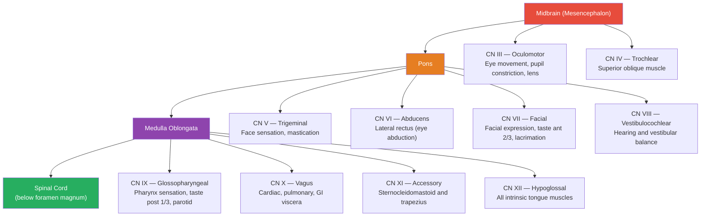

# 🧠 Brainstem and Cranial Nerves

> [!abstract] TL;DR
> The brainstem — comprising the midbrain, pons, and medulla oblongata — is the anatomical stalk linking the cerebral hemispheres to the spinal cord; it harbors nuclei controlling breathing, heart rate, blood pressure, and the arousal circuits that underlie consciousness itself. It is the origin of cranial nerves III through XII, providing direct neural wiring between the brain and the face, neck, and thoracoabdominal viscera without routing through the spinal cord. Because all descending motor tracts and ascending sensory tracts are compressed through this thumb-sized structure, even a small brainstem lesion can produce catastrophic, paradoxically crossed deficits — weakness on one side of the body with sensory loss on the opposite side of the face.

---

## Intuition

**Analogy:** Think of a modern high-rise. Every floor is furnished and functional — offices, apartments, restaurants — yet the entire building depends invisibly on a central utility core: the shaft running floor to floor that contains the electrical conduit, water pipes, HVAC ducts, and fire-suppression lines. No floor can function if this core fails, yet occupants rarely see it. The cranial nerves are the building's direct phone lines — not internal extensions routed through the main switchboard, but dedicated outside lines connecting the building's operations center to specific sensors and actuators: the smoke detectors on each floor (olfactory epithelium), the security cameras (retina), the lobby sprinklers (lacrimal glands), the boiler-room thermostat (sinoatrial pacemaker), and the intercom system (larynx).

In the nervous system, the brainstem is that utility core — the anatomical bottleneck through which all descending motor commands and ascending sensory signals pass between brain and body. Rather than routing everything through the spinal cord, the cranial nerves offer dedicated high-bandwidth channels directly between brainstem nuclei and the structures of the head and viscera. This architecture reflects evolutionary antiquity: the brainstem is the oldest part of the vertebrate brain, and its vital reflexes run without any cortical involvement.

---

## How It Works



> **Note on CN I and II:** The olfactory nerve (CN I) arises from the olfactory bulb in the telencephalon; the optic nerve (CN II) is a diencephalic outgrowth (a tract of the brain, not a true peripheral nerve). Neither originates from the brainstem proper.

---

## Key Concepts

### Secondary Level

**Brainstem Divisions and Landmarks**

| Division | Location | Key Visible Structures | Cranial Nerves |
|---|---|---|---|
| Midbrain | Rostral; immediately below diencephalon | Cerebral peduncles, superior/inferior colliculi, cerebral aqueduct | CN III, IV |
| Pons | Middle segment; bulge on ventral surface | Basis pontis (transverse fibers), middle cerebellar peduncle | CN V, VI, VII, VIII |
| Medulla Oblongata | Caudal; merges with spinal cord at foramen magnum | Pyramids, olives, dorsal vagal triangle (floor of 4th ventricle) | CN IX, X, XI, XII |

**All 12 Cranial Nerves**

| # | Name | Modality | Key Function | Skull Exit |
|---|------|----------|--------------|------------|
| I | Olfactory | Special sensory | Smell | Cribriform plate |
| II | Optic | Special sensory | Vision | Optic canal |
| III | Oculomotor | Motor + parasympathetic | 4 extraocular muscles, eyelid elevation, pupil constriction, lens accommodation | Superior orbital fissure |
| IV | Trochlear | Pure motor | Superior oblique (intorsion, depression of adducted eye) | Superior orbital fissure |
| V | Trigeminal | Mixed | Face/scalp sensation (V1/V2/V3); jaw muscles (V3 only) | V1: SOF; V2: Foramen rotundum; V3: Foramen ovale |
| VI | Abducens | Pure motor | Lateral rectus (eye abduction) | Superior orbital fissure |
| VII | Facial | Mixed | Facial expression; taste anterior 2/3 tongue; lacrimation; submandibular/sublingual salivation | Stylomastoid foramen (enters via IAM) |
| VIII | Vestibulocochlear | Special sensory | Hearing (cochlear division); equilibrium (vestibular division) | Internal acoustic meatus |
| IX | Glossopharyngeal | Mixed | Taste/sensation posterior 1/3 tongue; carotid body/sinus; parotid gland (parasympathetic) | Jugular foramen |
| X | Vagus | Mixed | Pharynx/larynx motor; heart, lungs, GI tract to splenic flexure; visceral afferents | Jugular foramen |
| XI | Accessory | Pure motor | Sternocleidomastoid (head rotation), trapezius (shoulder elevation) | Jugular foramen |
| XII | Hypoglossal | Pure motor | All intrinsic tongue muscles plus genioglossus | Hypoglossal canal |

**Memory Aids**

- **Names in order:** "Oh, Oh, Oh, To Touch And Feel Very Good Velvet, Ah, Heaven"
- **Modality (S = sensory, M = motor, B = both):** "Some Say Marry Money But My Brother Says Big Brains Matter More"

**Decussation of the Pyramids**

At the caudal medulla, approximately 90% of corticospinal tract fibers cross the midline — this is the pyramidal decussation (decussatio pyramidum). The consequence is that the left motor cortex controls the right limbs and vice versa. This crossing point is the anatomical reason why a stroke in the left hemisphere causes right-sided body weakness. Most cranial nerve motor nuclei, by contrast, receive bilateral cortical input and so a unilateral cortical lesion usually does not fully eliminate their function — a critical exception is explained in the next section.

---

### Undergraduate Level

**Reticular Formation**

The reticular formation is not a discrete nucleus but a diffuse network of neurons interspersed throughout the brainstem tegmentum (the region dorsal to the basilar/pyramidal surface). It is organized into functional columns:

- **Ascending reticular activating system (ARAS):** Cholinergic nuclei (pedunculopontine nucleus, PPN; laterodorsal tegmental nucleus, LDT) project to the thalamus, activating thalamocortical relay neurons. Monoaminergic nuclei (locus coeruleus → noradrenaline; dorsal raphe → serotonin; tuberomammillary nucleus → histamine) project directly to the cortex. Together these maintain wakefulness. Bilateral ARAS lesions cause coma.
- **Descending reticulospinal tracts:** The medial (pontine) reticulospinal tract facilitates extensor tone; the lateral (medullary) reticulospinal tract facilitates flexors. Both modulate spinal interneurons and alpha motor neurons below the level of voluntary control.
- **Autonomic and respiratory centers:** Pre-Bötzinger complex (inspiration rhythm), Bötzinger complex (expiration), nucleus tractus solitarius (visceral afferent integration), and rostral ventrolateral medulla (sympathetic vasomotor control).

**Locus Coeruleus**

The locus coeruleus (LC) sits in the dorsal pontine tegmentum near the floor of the fourth ventricle. Despite containing only approximately 15,000 neurons per hemisphere in humans, it is the brain's dominant source of noradrenaline (norepinephrine) and projects to virtually every brain region: prefrontal cortex, hippocampus, amygdala, cerebellum, and spinal cord. Functions: focused attention, arousal, working memory gating, and stress/fear responses. Degeneration of LC neurons is an early pathological event in both Parkinson's disease and Alzheimer's disease — preceding dopaminergic cell loss in the substantia nigra.

**Raphe Nuclei**

A chain of midline nuclei (dorsal raphe, median raphe, raphe magnus, raphe pallidus, raphe obscurus) extend from the midbrain through the medulla. They are the primary source of serotonin (5-HT) for the entire CNS. Ascending projections reach the limbic system (mood, anxiety, emotional memory) and prefrontal cortex (executive functions). Descending projections reach the spinal dorsal horn, where they inhibit pain transmission — the pharmacological basis of SSRIs' analgesic effects in chronic pain. Raphe neurons fire tonically during wakefulness, slow during NREM sleep, and are nearly silent during REM sleep.

**Periaqueductal Gray (PAG)**

Surrounding the cerebral aqueduct in the midbrain tegmentum, the PAG is a critical hub for:

- **Endogenous analgesia:** PAG neurons (especially opioid-receptor-rich cells) project to the rostral ventromedial medulla (RVM), which sends serotonergic and opioidergic fibers to the spinal dorsal horn, gating ascending pain signals before they reach consciousness. Stimulation-produced analgesia (SPA) from PAG activation was demonstrated clinically before endogenous opioids were characterized.
- **Defensive behaviors:** Dorsolateral PAG mediates active defense (fight/flight with tachycardia and hypertension); ventrolateral PAG mediates passive coping (freezing, bradycardia, stress-induced analgesia).
- **REM/NREM switching:** Ventrolateral PAG acts as a REM-off region and is inhibited at REM onset, permitting the sublaterodorsal nucleus to activate.

**Cranial Nerve Nuclei Locations**

| Nucleus | Cranial Nerve | Function | Brainstem Level |
|---|---|---|---|
| Edinger-Westphal nucleus | CN III (parasympathetic) | Pupil constriction, lens accommodation | Midbrain |
| Oculomotor nucleus | CN III (motor) | Medial, superior, inferior rectus; inferior oblique; levator palpebrae | Midbrain |
| Trochlear nucleus | CN IV (motor) | Superior oblique | Caudal midbrain |
| Mesencephalic nucleus of V | CN V (proprioception) | Jaw muscle proprioception (unique: primary afferent cell bodies inside CNS) | Midbrain to pons |
| Main (principal) sensory nucleus of V | CN V (touch/pressure) | Fine touch and pressure from face | Pons |
| Motor nucleus of V | CN V (motor) | Temporalis, masseter, pterygoids, tensor tympani | Pons |
| Spinal nucleus of V | CN V (pain/temperature) | Pain and temperature from face; extends to C2 | Pons → medulla → C2 |
| Abducens nucleus | CN VI (motor) | Lateral rectus; contains interneurons for conjugate horizontal gaze (PPRF) | Caudal pons (floor of 4th ventricle) |
| Facial nucleus | CN VII (motor) | Muscles of facial expression (all) | Pons |
| Superior salivatory nucleus | CN VII (parasympathetic) | Lacrimal gland, submandibular, sublingual glands | Pons |
| Cochlear nuclei | CN VIII (hearing) | Frequency analysis of sound | Pontomedullary junction |
| Vestibular nuclei | CN VIII (balance) | Head position, linear/angular acceleration; VOR | Pontomedullary junction |
| Nucleus ambiguus | CN IX, X, XI (motor) | Pharynx, larynx, upper esophagus, palatine muscles | Medulla |
| Dorsal motor nucleus of vagus | CN X (parasympathetic) | Preganglionic fibers to thoracic/abdominal viscera | Medulla |
| Nucleus tractus solitarius (NTS) | CN VII, IX, X (visceral/taste afferents) | Taste (rostral NTS); visceral sensation from thorax/abdomen (caudal NTS) | Medulla |
| Inferior salivatory nucleus | CN IX (parasympathetic) | Parotid gland via otic ganglion | Medulla |
| Hypoglossal nucleus | CN XII (motor) | All tongue muscles | Medulla |

**UMN vs LMN Cranial Nerve Lesions and the Forehead Rule**

Most cranial nerve motor nuclei receive bilateral corticobulbar input, meaning a unilateral cortical stroke does not fully denervate them. The critical exception is the lower face:

- **Upper facial nucleus neurons** (forehead, brow) receive bilateral cortical input — both hemispheres contribute.
- **Lower facial nucleus neurons** (cheek, lip, chin) receive predominantly contralateral cortical input.

Consequence: A unilateral UMN lesion (e.g., left hemisphere stroke) produces contralateral lower face weakness with **forehead sparing**. A unilateral LMN lesion (e.g., Bell's palsy, right facial nerve) produces ipsilateral weakness of the **entire face including the forehead**. This single clinical finding separates central from peripheral CN VII lesions at the bedside.

**Tongue deviation:** In a CN XII LMN lesion, the tongue deviates toward the weak side on protrusion (the intact contralateral genioglossus pushes the tongue away from its side). Memorize: the tongue "licks its wound" — points toward the lesion.

**Cranial Nerve Examination**

| CN | Bedside Test |
|---|---|
| I | Smell identification (coffee, vanilla) each nostril separately |
| II | Snellen chart, visual fields by confrontation, direct/consensual pupillary light reflex |
| III, IV, VI | Extraocular movements in the "H" pattern; ptosis; pupil size and reactivity |
| V | Light touch and pinprick over V1/V2/V3 territories; corneal reflex (afferent limb); jaw opening/clenching |
| VII | Forehead furrow, eye closure against resistance, smile, corneal reflex (efferent limb) |
| VIII | Whisper test or tuning fork (512 Hz); Rinne/Weber for conductive vs sensorineural loss; Romberg |
| IX, X | Gag reflex (CN IX afferent, CN X efferent); soft palate elevation on "ah"; voice quality (dysphonia = CN X); swallowing |
| XI | Shoulder shrug against resistance (trapezius); head turn against resistance (SCM) |
| XII | Tongue protrusion (note direction of deviation); rapid alternating movements ("la-la-la") |

---

### Graduate Level

**Brainstem Vascular Syndromes**

The brainstem is supplied by the vertebrobasilar system. Perforating vessels supply compact bundles of long tracts and cranial nerve nuclei; occlusions produce stereotyped, highly localizable syndromes — the foundation of clinical neuroanatomy.

| Syndrome | Occluded Vessel | Structures Damaged | Clinical Features |
|---|---|---|---|
| **Wallenberg (Lateral Medullary)** | PICA or distal vertebral artery | Lateral medulla: spinothalamic tract, descending sympathetics, inferior cerebellar peduncle, nucleus ambiguus, spinal nucleus/tract CN V | Ipsilateral: Horner's (ptosis/miosis/anhidrosis), face pain/temp loss, ataxia, hoarse voice/dysphagia; Contralateral: body pain/temp loss. Pyramids (motor) spared — no hemiplegia. |
| **Weber (Midbrain Ventral)** | Posterior cerebral artery perforators | Cerebral peduncle (corticospinal tract) + CN III fascicles | Ipsilateral CN III palsy (ptosis, "down-and-out" eye, dilated pupil) + contralateral hemiplegia |
| **Benedikt (Midbrain Tegmental)** | Basilar perforators to midbrain | Red nucleus + superior cerebellar peduncle (brachium conjunctivum) + CN III fascicles | Ipsilateral CN III palsy + contralateral choreoathetosis/tremor (red nucleus and dentato-rubro-thalamic tract lesion) |
| **Parinaud (Dorsal Midbrain)** | Posterior cerebral artery; often pineal tumor compression | Superior colliculus, posterior commissure, pretectal nuclei | Upgaze palsy, convergence-retraction nystagmus on attempted upgaze, light-near dissociation (pupils accommodate but do not constrict to light) |
| **Millard-Gubler (Ventral Pons)** | Basilar artery perforators | Basis pontis (corticospinal tract) + CN VI and VII fascicles | Ipsilateral CN VI palsy (failure of abduction) + ipsilateral CN VII palsy + contralateral hemiplegia |
| **Locked-in Syndrome** | Basilar artery (occlusion of ventral pontine perforators) | Bilateral basis pontis: corticospinal + corticobulbar tracts | Quadriplegia, anarthria, aphonia, lower CN paralysis; consciousness fully intact (dorsal tegmentum/ARAS spared); only vertical eye movements and blinking are preserved (CN III/IV nuclei in midbrain tegmentum unaffected) |

**Locked-in Syndrome: Anatomy and Communication**

In locked-in syndrome, the occlusion targets perforating arteries supplying the ventral pons (basis pontis). Corticospinal tracts (to limbs) and corticobulbar tracts (to face, pharynx, larynx) are destroyed bilaterally. The dorsal tegmentum — housing the ARAS cholinergic nuclei, locus coeruleus, raphe nuclei, and the CN III/IV nuclei — is supplied by different vessels and typically survives. The result: total voluntary paralysis coexists with fully intact consciousness and cognition. The only preserved output is vertical gaze (superior colliculus/CN III in intact midbrain) and blinking (CN VII above the pontine lesion via facial nucleus). Jean-Dominique Bauby dictated his memoir *The Diving Bell and the Butterfly* by blinking — one blink for yes, two for no.

**Reticular Activating System and Consciousness**

The ARAS uses two parallel pathways to maintain wakefulness:

1. **Dorsal pathway (via thalamus):** PPN and LDT (cholinergic, in pons/midbrain junction) activate thalamic relay and reticular nuclei → thalamocortical projections desynchronize the EEG. Active during both REM sleep and wakefulness.
2. **Ventral pathway (bypassing thalamus):** Locus coeruleus (noradrenaline), dorsal raphe (serotonin), tuberomammillary nucleus in the hypothalamus (histamine), and VTA (dopamine) project directly to the basal forebrain and cortex. Active during wakefulness; largely suppressed during sleep.

In the "flip-flop" model of sleep-wake switching: wake-promoting nuclei (LC, raphe, TMN) mutually inhibit sleep-promoting neurons in the ventrolateral preoptic nucleus (VLPO) of the hypothalamus, and vice versa. The orexin/hypocretin system (lateral hypothalamus) stabilizes the flip-flop by reinforcing the wake side. Loss of orexin neurons causes narcolepsy — the flip-flop becomes unstable, causing sudden transitions into REM sleep.

**REM Atonia Circuit**

Normal REM sleep requires complete suppression of voluntary muscle tone (atonia), preventing acting out of dreams. The circuit:

1. At REM onset, the ventrolateral PAG (a REM-off gate) is inhibited, permitting the **sublaterodorsal nucleus (SLD)** in the dorsal pons (homologue of the subcoeruleus) to activate.
2. SLD sends glutamatergic projections to the **ventromedial medullary reticular formation** (gigantocelullar/magnocellular nuclei).
3. Medullary reticular formation sends **GABAergic and glycinergic** projections to spinal anterior horn cells → tonic active inhibition of alpha motor neurons = atonia.

Failure of this circuit (alpha-synuclein pathology preferentially damages SLD neurons) causes **REM sleep behavior disorder (RBD)** — patients act out vivid dreams with punching, kicking, and shouting. RBD often precedes Parkinson's disease by 10–15 years, making it a powerful prodromal biomarker: SLD degeneration occurs before the substantia nigra is affected.

**Central Pattern Generators (CPGs)**

Rhythmic brainstem behaviors — breathing and swallowing — are generated by CPGs: neural circuits producing patterned rhythmic output without requiring rhythmic sensory input.

*Respiratory CPG:*
- **Pre-Bötzinger complex (preBötC):** Cluster of ~600 neurons in the rostral ventrolateral medulla (ventral respiratory group). Generates the basic inspiratory rhythm via voltage-gated persistent Na⁺ currents (I_NaP) and mutual inhibition among interneurons. Lesion of preBötC in mice abolishes breathing.
- **Bötzinger complex:** Immediately rostral; generates expiratory drive via inhibitory interneurons.
- **Parafacial respiratory group (pFRG):** Active expiration during exercise.
- **Pontine respiratory group** (Kölliker-Fuse nucleus, parabrachial complex): Switches inspiration to expiration; shapes cycle depth and duration.

*Swallowing CPG:*
Located in the dorsal swallowing group (nucleus tractus solitarius) and ventral swallowing group (nucleus ambiguus and surrounding reticular formation). Swallowing is a sequential, all-or-none program executing approximately 25 paired muscles over ~1 second. It is triggered by sensory input from the pharynx via CN IX/X afferents and, once initiated, runs to completion automatically — cortical inhibition (to prevent swallowing while speaking) is the active process, not the swallow itself.

**CN X — The Underestimated Nerve**

The vagus is the most anatomically extensive cranial nerve. Its fiber composition:
- **Somatic motor (20%):** Nucleus ambiguus → soft palate, pharynx, larynx, upper esophagus.
- **Parasympathetic preganglionic (10%):** Dorsal motor nucleus of vagus → intramural ganglia in heart (rate control), bronchi (bronchoconstriction), esophagus, stomach, small intestine, ascending and transverse colon, liver, pancreas, kidneys.
- **Visceral sensory (70%):** NTS ← mechanoreceptors, chemoreceptors, thermoreceptors from all thoracic and abdominal viscera. The vagus is predominantly an afferent nerve — the brain reads gut state, and this is the anatomical substrate of the gut-brain axis.
- **Somatic sensory (small branch):** Arnold's nerve (auricular branch) innervates skin near the ear — stimulation can trigger cough reflex or vasovagal syncope; the basis of transcutaneous vagal nerve stimulation therapy at the ear.

Vagus nerve stimulation (VNS, implanted or transcutaneous) is FDA-approved for drug-resistant epilepsy and depression, exploiting the extensive vagal afferent projections to NTS → LC → amygdala → cortex.

---

## Python Demo

```python
import matplotlib.pyplot as plt
import matplotlib.patches as mpatches

# Complete cranial nerve reference data
# Columns: CN number, Name, Modality, Key Function, Skull Exit, Brainstem Origin
cranial_nerve_data = [
    ["I",    "Olfactory",         "Sensory",    "Smell",                              "Cribriform plate",      "Telencephalon"],
    ["II",   "Optic",             "Sensory",    "Vision",                             "Optic canal",           "Diencephalon"],
    ["III",  "Oculomotor",        "Motor+Para", "Eye movement, pupil, lens",          "Sup. orbital fissure",  "Midbrain"],
    ["IV",   "Trochlear",         "Motor",      "Superior oblique muscle",            "Sup. orbital fissure",  "Midbrain"],
    ["V",    "Trigeminal",        "Mixed",      "Face sensation (V1-V3), jaw",        "SOF / FR / FO",         "Pons"],
    ["VI",   "Abducens",          "Motor",      "Lateral rectus (abduction)",         "Sup. orbital fissure",  "Pons"],
    ["VII",  "Facial",            "Mixed",      "Facial expression, taste ant 2/3",   "Stylomastoid foramen",  "Pons"],
    ["VIII", "Vestibulocochlear", "Sensory",    "Hearing and balance",                "Int. acoustic meatus",  "Pons"],
    ["IX",   "Glossopharyngeal",  "Mixed",      "Pharynx, taste post 1/3, parotid",   "Jugular foramen",       "Medulla"],
    ["X",    "Vagus",             "Mixed",      "Cardiac, pulmonary, GI viscera",     "Jugular foramen",       "Medulla"],
    ["XI",   "Accessory",         "Motor",      "Sternocleidomastoid, trapezius",     "Jugular foramen",       "Medulla"],
    ["XII",  "Hypoglossal",       "Motor",      "All intrinsic tongue muscles",       "Hypoglossal canal",     "Medulla"],
]

columns = ["CN", "Name", "Modality", "Key Function", "Skull Exit", "Origin"]

# Color rows by brainstem origin region
region_colors = {
    "Telencephalon": "#aed6f1",
    "Diencephalon":  "#a9cce3",
    "Midbrain":      "#f9e79f",
    "Pons":          "#a9dfbf",
    "Medulla":       "#f5cba7",
}

row_colors = [
    [region_colors[row[5]]] * len(columns)
    for row in cranial_nerve_data
]

fig, ax = plt.subplots(figsize=(17, 7))
ax.axis("off")

table = ax.table(
    cellText=cranial_nerve_data,
    colLabels=columns,
    cellLoc="center",
    loc="center",
    cellColours=row_colors,
)
table.auto_set_font_size(False)
table.set_fontsize(9)
table.scale(1, 1.9)

# Style header row
for j in range(len(columns)):
    cell = table[(0, j)]
    cell.set_facecolor("#2c3e50")
    cell.set_text_props(color="white", fontweight="bold")

# Bold the CN number column
for i in range(1, len(cranial_nerve_data) + 1):
    table[(i, 0)].set_text_props(fontweight="bold")

# Legend for brainstem origin
legend_patches = [
    mpatches.Patch(color=color, label=region)
    for region, color in region_colors.items()
]
ax.legend(
    handles=legend_patches,
    loc="lower center",
    bbox_to_anchor=(0.5, -0.10),
    ncol=5,
    fontsize=9,
    title="Origin Region",
    title_fontsize=9,
    framealpha=0.9,
)

ax.set_title(
    "The 12 Cranial Nerves: Number, Name, Modality, Function, Exit Foramen, and Brainstem Origin",
    fontsize=12,
    fontweight="bold",
    pad=15,
)

plt.tight_layout()
plt.savefig("cranial_nerves_reference.png", dpi=150, bbox_inches="tight")
plt.show()
```

---

## Real-World Applications

> **Locked-in Syndrome (Basilar Artery Occlusion):** Thrombosis of the basilar artery infarcts the ventral pons, bilaterally destroying corticospinal and corticobulbar tracts. The patient is fully conscious — the dorsal tegmentum, ARAS, and midbrain are perfused by different vessels — but is quadriplegic and mute. Only vertical gaze and blinking are preserved (CN III/IV nuclei in the midbrain tegmentum). This is one of the most devastating outcomes in neurology and underscores why "unresponsive" should never be equated with "unconscious" without examining vertical eye movements.

> **Brainstem Death Testing:** In the UK, brain death is defined as irreversible cessation of all brainstem function in an apnoeic comatose patient with a known structural cause. Each test maps directly to a cranial nerve arc: pupillary light reflex (CN II afferent, CN III efferent), corneal reflex (CN V afferent, CN VII efferent), oculocephalic/vestibulo-ocular reflex (CN III, IV, VI), gag reflex (CN IX, X), and apnea test (medullary respiratory centers). Absence of all reflexes confirms brainstem death. Spinal reflexes (knee jerk, plantar response) may persist — brainstem death does not require absent spinal reflexes.

> **Wallenberg (Lateral Medullary) Syndrome:** The lateral medulla receives blood from the PICA. Occlusion produces the archetypal "crossed" brainstem syndrome: ipsilateral face pain/temperature loss (spinal nucleus of CN V), ipsilateral Horner's syndrome (descending hypothalamospinal sympathetic fibers), ipsilateral limb ataxia (inferior cerebellar peduncle), ipsilateral dysphagia/hoarseness (nucleus ambiguus), and contralateral body pain/temperature loss (lateral spinothalamic tract). No hemiplegia because the pyramids lie medially and are supplied by anterior spinal artery. It is the most common brainstem stroke and is clinically teachable at the bedside.

> **Acoustic Neuroma (Vestibular Schwannoma, CN VIII):** A benign Schwann-cell tumor arising on the vestibular portion of CN VIII within the internal acoustic meatus. It first causes progressive unilateral sensorineural hearing loss and tinnitus. As it expands into the cerebellopontine angle, it compresses CN VII (ipsilateral LMN facial palsy), CN V (ipsilateral facial numbness and abolished corneal reflex), the cerebellum (ipsilateral ataxia), and eventually the brainstem. Gadolinium-enhanced MRI shows characteristic "ice cream cone" enhancement at the IAM. Bilateral acoustic neuromas are pathognomonic of neurofibromatosis type 2 (NF2, NF2 gene on chromosome 22).

> **Bell's Palsy (CN VII LMN Lesion):** Acute unilateral facial nerve palsy, most commonly caused by herpes simplex virus-1 reactivation in the geniculate ganglion, producing inflammation and edema within the rigid bony facial canal (facial canal compression neuropathy). Because the lesion is peripheral (LMN), the entire ipsilateral face is weak — including the forehead — distinguishing it from a central (UMN, cortical) lesion where the forehead is spared. Additional features: hyperacusis (nerve to stapedius), loss of taste anterior 2/3 (chorda tympani), reduced ipsilateral lacrimation (greater petrosal nerve), all proximal to the stylomastoid foramen. Treatment: oral prednisolone ± aciclovir within 72 hours. Most cases recover within 3–6 months.

---

## Common Pitfalls

- **CN X is not just a cardiac nerve** — The vagus supplies the pharynx, larynx, esophagus, trachea, bronchi, stomach, small intestine, ascending and transverse colon, liver, pancreas, and kidneys. Its afferent fibers constitute roughly 70–80% of all vagal fibers. Isolated vagal lesions can cause hoarseness (larynx), aspiration (pharynx), gastroparesis (stomach), or bradycardia depending on which branch is injured. Treating it as "the heart nerve" causes clinicians to miss the full deficit pattern.
- **Brainstem reflexes differ fundamentally from spinal reflexes** — Tendon jerks (knee, ankle, biceps) test spinal cord arcs and are fully preserved in brainstem death. The pupillary, corneal, oculocephalic, gag, and cough reflexes test brainstem nuclei and are specifically abolished in brainstem death. Conflating the two misinterprets the neurological examination and leads to diagnostic error.
- **Forehead sparing identifies UMN facial lesions; its absence identifies LMN** — The upper facial nucleus subgroup receives bilateral cortical input; the lower facial nucleus subgroup receives predominantly contralateral input. A cortical stroke therefore spares the forehead. Bell's palsy and any other LMN CN VII lesion involves the entire ipsilateral face. Forgetting this rule leads to incorrectly attributing a Bell's palsy presentation to a stroke, or missing a cortical lesion in a patient with incomplete lower-face weakness.
- **Tongue deviation identifies the level of CN XII lesion** — The tongue deviates toward the side of a LMN lesion (the intact contralateral genioglossus pushes it away) but may deviate away from a UMN lesion side. The directions are opposite and must be matched to clinical context. Assuming deviation always indicates the UMN side leads to incorrect lesion localization.
- **The "corticospinal decussation rule" does not uniformly apply to cranial nerve nuclei** — Most brainstem motor nuclei receive bilateral corticobulbar input. Assuming that a cranial nerve deficit always points to the contralateral hemisphere will generate wrong localizations for brainstem lesions (e.g., ipsilateral Horner's in Wallenberg syndrome comes from an ipsilateral medullary lesion, not a contralateral hemisphere lesion).

---

## Related Concepts

- [[_MOC_Neuroanatomy_and_Brain_Structure|↑ Neuroanatomy and Brain Structure MOC]] — section map and recommended learning path for this topic cluster
- [[Gross_Anatomy_of_the_Brain]] — provides the cortical and diencephalic context from which corticobulbar tracts descend and from which CN I and CN II arise; essential for understanding UMN vs LMN lesion patterns
- [[Cerebellum_and_Basal_Ganglia]] — the cerebellum attaches to the brainstem via three peduncles (inferior, middle, superior); basal ganglia output projects through the substantia nigra, a midbrain structure visible on the ventral midbrain surface
- [[Autonomic_Nervous_System]] — all cranial parasympathetic outflow (CN III, VII, IX, X) originates in brainstem nuclei (Edinger-Westphal, superior/inferior salivatory, dorsal motor nucleus of vagus); brainstem also contains the key sympathetic relay stations (rostral ventrolateral medulla)
- [[Spinal_Cord_and_Peripheral_Nervous_System]] — the medulla oblongata continues as the spinal cord below the foramen magnum; the pyramidal decussation is the precise anatomical boundary; spinal nucleus of CN V extends to C2
- [[Motor_System_and_Motor_Control]] — corticospinal and corticobulbar tracts originate in motor and premotor cortex and synapse on brainstem and spinal cord motor neurons; the UMN/LMN distinction is operationalized through brainstem and spinal cord anatomy

---

## Review Questions

1. **Secondary:** Name all 12 cranial nerves in order and state whether each is primarily sensory, primarily motor, or mixed. Which two cranial nerves do not originate from the brainstem, and where do they arise instead?

2. **Undergraduate:** A 70-year-old woman wakes with sudden vertigo, falls to the right, and cannot swallow or speak clearly. Examination shows loss of pain and temperature over the right face, a right Horner's syndrome (ptosis, miosis), right limb ataxia, and loss of pain and temperature sensation over the left arm and leg, with no limb weakness. Identify the syndrome, name the vessel most likely occluded, and map each clinical sign to the specific anatomical structure damaged.

3. **Graduate:** A 55-year-old man with a 5-year history of vivid dream enactment (punching and shouting during sleep) is now developing a resting tremor and cogwheel rigidity. Describe the circuit responsible for normal REM atonia, explain which structure is dysfunctional in his sleep disorder, and explain why REM sleep behavior disorder emerges a decade or more before parkinsonian motor signs — using the Braak staging hypothesis of alpha-synuclein spread to justify the temporal sequence.

---

## Sources

- Purves, D., Augustine, G.J., et al. — *Neuroscience*, 6th ed., Oxford University Press / Sinauer Associates
- Fitzgerald, M.J.T., Gruener, G., Mtui, E. — *Clinical Neuroanatomy and Neuroscience*, 7th ed., Elsevier
- Duus, P. — *Topical Diagnosis in Neurology: Anatomy, Physiology, Signs, Symptoms*, 5th ed., Thieme
- Kandel, E.R., Schwartz, J.H., et al. — *Principles of Neural Science*, 6th ed., McGraw-Hill
- Smith, J.C., Ellenberger, H.H., et al. — "Pre-Bötzinger complex: a brainstem region that may generate respiratory rhythm in mammals", *Science* 254: 726–729 (1991)

---

#Neuroscience #Neuroanatomy #Brainstem #CranialNerves
