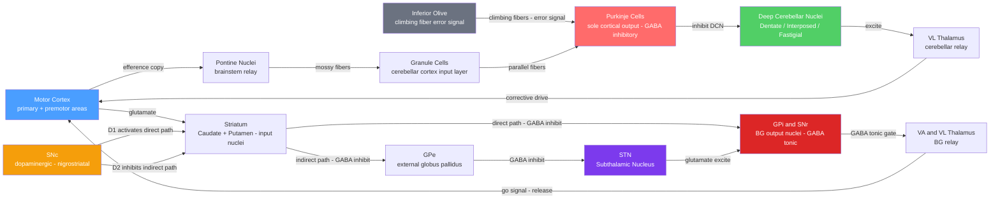

# 🧠 Cerebellum and Basal Ganglia

> [!abstract] TL;DR
> The cerebellum is the brain's real-time movement error corrector — it compares a copy of the motor command with incoming sensory feedback and issues corrective signals, keeping movements smooth and precisely timed. The basal ganglia act as a go/no-go gatekeeper, using competing direct and indirect pathways to selectively release intended actions while suppressing all competing ones. Both structures exert their influence not by commanding muscles directly but by modulating the motor cortex through the thalamus, making thalamic disinhibition the final common output of both circuits.

---

## Intuition — analogy FIRST

**Cerebellum as movement autocorrect.** When you type on a phone, autocorrect silently monitors every letter, compares what you typed to what it predicts you meant, and fixes errors before you even notice them. The cerebellum does exactly the same for movement: as soon as your motor cortex sends a command, the cerebellum receives a copy ("efference copy"), predicts the expected sensory outcome, and watches the actual limb trajectory arriving via proprioceptors. Any mismatch triggers an immediate correction signal — all without conscious awareness. Remove autocorrect and your typing becomes full of unchecked errors; damage the cerebellum and movements become "past-pointing" and oscillatory for the same reason.

**Basal ganglia as an approval committee for actions.** Imagine every possible action you could take right now is a proposal on the committee's table — reach for your coffee, scratch your nose, stand up. All proposals start blocked (tonically inhibited). The direct pathway is the "approve" vote: when the committee endorses a specific action, it removes the thalamic block on that movement. The indirect pathway is the standing "veto": it actively amplifies the suppression of all competing proposals, ensuring that only one action wins cleanly. Dopamine is the mood of the room — when dopamine is high (reward expected), approvals come easily; when dopamine drops as in Parkinson's disease, the room deadlocks and even routine movements require enormous effort to initiate.

---

## How It Works



*Both loops feed back onto motor cortex via separate thalamic relays. The cerebellar loop corrects ongoing movement in real time; the BG loop gates movement initiation. CTX appears at both ends of the diagram — these are the same structure, completing both feedback loops.*

---

## Key Concepts / Details

### Secondary Level

**Cerebellum — the "little brain"**

Located at the posterior base of the skull, the cerebellum accounts for only ~10% of brain volume but contains over half of all neurons (primarily granule cells). Its core job is **movement coordination**: ensuring that actions are smooth, accurately timed, and continuously adapted to unexpected perturbations. It also contributes to balance, gaze stabilisation, and in humans to some aspects of timing in cognition and speech.

| Function | Behavioural example | Sign if damaged |
|----------|-------------------|----------------|
| Limb coordination | Precisely reaching for a glass | Limb ataxia, intention tremor, past-pointing |
| Balance and gait | Walking in a straight line | Truncal ataxia, wide-based gait |
| Fine motor learning | Learning a new instrument fingering | Impaired procedural motor learning |
| Movement timing | Tapping at a precisely set rhythm | Loss of beat accuracy, dysdiadochokinesia |

**Basal ganglia — the action selector**

The basal ganglia are a collection of subcortical nuclei embedded deep in the cerebral hemispheres and midbrain. They do not initiate movement directly; instead they **select and suppress** action programs. The key insight is that the basal ganglia maintain constant tonic inhibition on the thalamus via GABA: releasing that inhibition for one candidate action (while maintaining it for all competitors) is what enables a single, clean movement to emerge from the cortex.

| Pathway | Effect on GPi/SNr | Effect on thalamus | Movement result |
|---------|------------------|--------------------|-----------------|
| **Direct** | Inhibited (via D1-MSN GABA) | Disinhibited | Desired movement facilitated |
| **Indirect** | Excited (via STN) | Over-inhibited | Competing movements suppressed |

**Clinical snapshots:**
- **Parkinson's disease** — loss of dopaminergic neurons in SNc → direct pathway weakened, indirect pathway over-active → thalamus chronically over-inhibited → bradykinesia, rigidity, resting tremor (4–6 Hz)
- **Cerebellar ataxia** — Purkinje cell or DCN degeneration → loss of movement error correction → uncoordinated, dysmetric movements with intention tremor that worsens near the target

---

### Undergraduate Level

**Cerebellar cortex layers**

The cerebellar cortex has three precisely laminated layers, unusual in the brain for their crystalline regularity across all regions:

| Layer | Position | Key cells and elements |
|-------|---------|----------------------|
| **Molecular layer** | Outermost | Parallel fiber axons (from granule cells), Purkinje cell spiny dendrites, basket cells, stellate cells |
| **Purkinje cell layer** | Middle | Purkinje cell somata — each ~150,000 dendritic spines, receiving ~150,000 parallel fiber contacts and exactly 1 climbing fiber |
| **Granular layer** | Innermost | Granule cells (~70 billion — more than rest of brain combined), mossy fiber synaptic glomeruli, Golgi cell feedback inhibition |

Purkinje cells are the **sole output of the cerebellar cortex** and are purely GABAergic. They project to the deep cerebellar nuclei (DCN), whose glutamatergic projections to the thalamus constitute the only cerebellar output channel. Understanding that Purkinje cells inhibit the DCN — and the DCN excite the thalamus — is the key to understanding net cerebellar output direction.

**Cerebellar functional zones**

| Zone | Anatomy | Primary input | Core function |
|------|---------|--------------|---------------|
| **Vestibulocerebellum** | Flocculonodular lobe | Vestibular organs; visual motion | Balance, oculomotor control, VOR adaptation |
| **Spinocerebellum** | Vermis + intermediate hemisphere | Spinocerebellar tracts (proprioception, touch) | Real-time limb coordination; gait |
| **Cerebrocerebellum** | Lateral hemisphere | Pontine nuclei (cortical relay) | Planning, sequencing, and learning of skilled movements |

**Basal ganglia nuclei in detail**

| Nucleus | Division | Transmitter | Role in circuit |
|---------|---------|------------|----------------|
| **Caudate nucleus** | Input (striatum) | GABA (MSNs) | Cognitive and oculomotor action selection |
| **Putamen** | Input (striatum) | GABA (MSNs) | Limb motor action selection |
| **GPe** | Intrinsic | GABA | Relay in indirect path; inhibits STN |
| **GPi** | Output | GABA | Tonic inhibitor of thalamus; primary BG output |
| **STN** | Intrinsic / hyperdirect input | Glutamate | Excites GPi/SNr; receives direct cortical "hyperdirect" pathway |
| **SNc** | Modulator | Dopamine | Nigrostriatal projection; D1/D2 modulation of striatum |
| **SNr** | Output | GABA | Functionally analogous to GPi; projects to superior colliculus and thalamus |
| **Nucleus accumbens** | Ventral striatum | GABA (MSNs) | Reward, motivation, addiction; mesolimbic target |

**Direct and indirect pathway — step by step**

*Direct pathway* (movement facilitation via double inhibition):
1. Cortex → Striatum D1-MSNs (glutamate, excite)
2. D1-MSNs → GPi/SNr (GABA, **inhibit**) — reduces GPi activity
3. Reduced GPi → less GABA onto thalamus (**disinhibition**)
4. Thalamus → Motor cortex (glutamate, excite) → movement facilitated

*Indirect pathway* (movement suppression via triple sign-flip):
1. Cortex → Striatum D2-MSNs (glutamate, excite)
2. D2-MSNs → GPe (GABA, **inhibit**) — reduces GPe activity
3. Reduced GPe → less GABA on STN → STN more active
4. STN → GPi/SNr (glutamate, **excite**) — increases GPi activity
5. Increased GPi → more GABA onto thalamus — movement suppressed

**Dopamine receptor pharmacology:**
- **D1 receptors** (Gs-coupled, raise cAMP): on direct-pathway MSNs; dopamine → facilitates direct path → promotes movement
- **D2 receptors** (Gi-coupled, lower cAMP): on indirect-pathway MSNs; dopamine → suppresses indirect path → promotes movement
- Net effect of dopamine: tips the balance toward movement by simultaneously boosting direct and suppressing indirect pathways

---

### Graduate Level

**Cerebellar forward models and internal models**

The dominant computational account of the cerebellum (Wolpert & Kawato, 1998) holds that it implements **forward internal models** — representations that predict the expected sensory consequences of a motor command. The cerebellum receives an efference copy of the outgoing motor command via pontine nuclei (mossy fiber route), computes the predicted sensory state, and compares this prediction with the actual sensory state carried by climbing fibers from the inferior olive. The climbing fiber signal encodes a **sensory prediction error**: whenever a movement does not produce its expected sensory consequences, climbing fiber activity rises. This error signal drives **long-term depression (LTD) at parallel fiber → Purkinje cell synapses**, adjusting the internal model over trials to minimise future errors. The MOSAIC framework (Haruno et al., 2001) extends this to multiple paired forward-inverse model pairs across the lateral cerebellar hemispheres, each responsible for a different motor context.

**Mechanism of cerebellar LTD**

LTD requires temporal coincidence of:
1. **Parallel fiber activation** → glutamate acts on AMPA and **mGluR1** receptors → IP₃ production → Ca²⁺ release from ER + PKC activation
2. **Climbing fiber activation** → massive Purkinje cell depolarisation → voltage-gated Ca²⁺ influx

The convergence of elevated cytoplasmic Ca²⁺ and PKC activation phosphorylates GluA2-containing AMPA receptors, triggering their endocytosis via the PICK1/GRIP scaffold. Fewer AMPA receptors at the PF–Purkinje synapse → smaller EPSPs → reduced Purkinje firing for that granule cell input pattern → reduced inhibition of DCN → net facilitation of the movement that produced the error. This is the cellular substrate of cerebellar motor learning and contrasts with hippocampal LTP (see [[Synaptic_Plasticity_and_LTP]]) in using mGluR1 rather than NMDA receptors as the coincidence detector.

**Dopamine prediction error — Schultz 1997**

Wolfram Schultz's landmark experiments recorded SNc dopamine neurons in monkeys during classical conditioning. Three phases:

| Phase | CS present? | Reward delivered? | Dopamine response |
|-------|------------|------------------|-------------------|
| Naive (pre-training) | No | Yes (unpredicted) | **Burst at reward time** |
| After learning | Yes (tone) | Yes (predicted) | **Burst shifts to CS onset** |
| After learning | Yes (tone) | No (omitted) | **Suppression at predicted reward time** |

This profile — phasic firing at positive prediction errors, pause at negative prediction errors — precisely matches the **temporal difference (TD) error signal**: δ = r + γV(s′) − V(s). Dopamine release encodes how much better or worse the current moment is than predicted, updating BG synaptic weights via D1/D2-mediated plasticity. Dopamine is therefore a **value learning signal**, not a motor command.

**DBS mechanisms in Parkinson's disease**

High-frequency (130–180 Hz) stimulation of the STN or GPi dramatically alleviates PD symptoms. Four non-exclusive mechanisms are debated:
1. **Depolarisation block** — sustained high-frequency input inactivates local neurons, functionally lesioning the target
2. **Beta-band disruption** — pathological 13–30 Hz synchrony in BG-cortical loops is overridden by irregular high-frequency output from the stimulated nucleus
3. **Antidromic axonal activation** — stimulating STN axons orthodromically drives GPi while antidromically activating cortex, bypassing the dysfunctional local circuit
4. **Synaptic depletion** — sustained high-frequency stimulation exhausts vesicle pools at STN output synapses onto GPi

Adaptive (closed-loop) DBS systems now titrate stimulation in real time based on recorded subthalamic LFPs, delivering current only during detected pathological beta bursts, reducing stimulation-induced side effects substantially.

**Optogenetics in BG circuits**

Selective expression of channelrhodopsin (ChR2) in D1-Cre or D2-Cre mice enabled direct causal dissection of pathway function (Kravitz et al., 2010):
- Optical activation of **D1-MSNs** (direct path): increased locomotion, reduced freezing
- Optical activation of **D2-MSNs** (indirect path): catalepsy-like freezing, reduced spontaneous movement
- In a PD model (6-OHDA lesion), activation of D1-MSNs rescued locomotion; D2-MSN activation worsened the deficit

These experiments confirmed the opposing functional roles of the two pathways beyond pharmacological prediction and revealed BG involvement in approach/avoidance decision-making beyond simple motor gating.

---

## Python Demo

```python
import numpy as np
import matplotlib.pyplot as plt

# Simulate direct/indirect BG pathway balance as a function of dopamine level.
# Dopamine = 0.0 → severe Parkinson's (SNc fully degenerated)
# Dopamine = 1.0 → healthy state
# Model: linear approximation of D1 (Gs) and D2 (Gi) receptor effects on MSN firing

dopamine = np.linspace(0.0, 1.0, 200)

# Direct pathway activity scales with dopamine (D1 Gs: raises cAMP, facilitates MSN firing)
direct_activity = dopamine

# Indirect pathway activity inversely scales with dopamine (D2 Gi: lowers cAMP, reduces MSN firing)
indirect_activity = 1.0 - dopamine

# Net GPi/SNr activity:
# - Indirect contribution raises GPi (via STN excitation, since GPe is inhibited)
# - Direct contribution lowers GPi (D1-MSNs directly inhibit GPi via GABA)
baseline_gpi = 0.5
gpi_activity = np.clip(
    baseline_gpi + 0.5 * indirect_activity - 0.5 * direct_activity,
    0.0, 1.0
)

# Thalamo-cortical drive is inversely proportional to GPi tonic inhibition of thalamus
thalamo_cortical = 1.0 - gpi_activity

# Clinical threshold: symptoms emerge after ~70-80% SNc cell loss -> ~0.2-0.3 residual dopamine
pk_threshold = 0.20

fig, axes = plt.subplots(1, 3, figsize=(15, 5))
fig.suptitle("Basal Ganglia Pathway Balance vs Dopamine Level", fontsize=13, fontweight='bold')

# Panel 1: Direct vs Indirect pathway activity
axes[0].plot(dopamine, direct_activity,   color='#2563eb', lw=2.5, label="Direct pathway (D1-MSNs)")
axes[0].plot(dopamine, indirect_activity, color='#dc2626', lw=2.5, label="Indirect pathway (D2-MSNs)")
axes[0].axvline(pk_threshold, color='#6b7280', ls='--', lw=1.5, label=f"PD onset threshold ({pk_threshold})")
axes[0].fill_betweenx([0, 1], 0, pk_threshold, alpha=0.08, color='red')
axes[0].set_xlabel("Dopamine level (normalised)")
axes[0].set_ylabel("Pathway activity (normalised)")
axes[0].set_title("Direct vs Indirect Pathway")
axes[0].legend(fontsize=9)
axes[0].set_xlim(0, 1)
axes[0].set_ylim(0, 1.05)
axes[0].text(0.02, 0.92, "Parkinson's\nzone", fontsize=8, color='red',
             transform=axes[0].transAxes)

# Panel 2: GPi/SNr inhibitory output onto thalamus
pk_mask = dopamine <= pk_threshold
axes[1].plot(dopamine, gpi_activity, color='#7c3aed', lw=2.5)
axes[1].fill_between(dopamine, gpi_activity, where=pk_mask, alpha=0.25,
                     color='red', label="Parkinson's zone")
axes[1].axvline(pk_threshold, color='#6b7280', ls='--', lw=1.5)
axes[1].set_xlabel("Dopamine level (normalised)")
axes[1].set_ylabel("GPi / SNr inhibitory output")
axes[1].set_title("GPi/SNr Output\n(inhibits thalamus)")
axes[1].legend(fontsize=9)
axes[1].set_xlim(0, 1)

# Panel 3: Thalamo-cortical drive (movement facilitation)
axes[2].plot(dopamine, thalamo_cortical, color='#059669', lw=2.5)
axes[2].fill_between(dopamine, thalamo_cortical, where=pk_mask, alpha=0.25,
                     color='red', label="Parkinson's zone")
axes[2].axvline(pk_threshold, color='#6b7280', ls='--', lw=1.5)
axes[2].set_xlabel("Dopamine level (normalised)")
axes[2].set_ylabel("Thalamo-cortical drive")
axes[2].set_title("Movement Facilitation\n(Thalamo-cortical Output)")
axes[2].legend(fontsize=9)
axes[2].set_xlim(0, 1)

plt.tight_layout()
plt.savefig("basal_ganglia_dopamine_model.png", dpi=150, bbox_inches='tight')

# Report key values at three landmark dopamine levels
for da_val, label in [(1.0, "Normal (DA=1.0)"),
                      (pk_threshold, f"PD threshold (DA={pk_threshold})"),
                      (0.05, "Severe PD (DA=0.05)")]:
    idx = np.argmin(np.abs(dopamine - da_val))
    print(f"{label:35s}: GPi={gpi_activity[idx]:.2f}  |  "
          f"Thalamo-cortical drive={thalamo_cortical[idx]:.2f}")
```

The simulation shows that dopamine depletion shifts the GPi/SNr from moderate balanced activity to maximal tonic inhibition of the thalamus, progressively extinguishing the thalamo-cortical drive for movement. The Parkinson's zone (red shading) marks where residual dopamine can no longer sustain sufficient direct pathway activity to overcome the over-active indirect pathway — consistent with the clinical observation that symptoms emerge after ~70–80% SNc neuronal loss, reflecting the considerable compensatory capacity of the remaining system.

---

## Real-World Applications

**Parkinson's Disease**

Idiopathic PD involves progressive alpha-synuclein aggregation and death of dopaminergic neurons in SNc (Braak staging: brainstem → substantia nigra → cortex). Striatal dopamine falls by >80% before significant motor symptoms appear, owing to compensatory sprouting of surviving axons. The loss tips the direct/indirect balance toward thalamic over-inhibition, producing the cardinal motor triad: resting tremor (4–6 Hz, "pill-rolling"), cogwheel rigidity, and bradykinesia/akinesia. L-DOPA (crosses the blood-brain barrier; converted to dopamine in surviving neurons) remains first-line treatment; DBS of STN or GPi is used when L-DOPA-induced dyskinesias become unmanageable.

**Huntington's Disease**

Autosomal dominant CAG repeat expansion in the *HTT* gene causes selective early degeneration of **D2-MSNs** (indirect pathway neurons). With the indirect pathway weakened, GPi activity drops, the thalamus is over-released, and unwanted movements leak through cortex — producing the characteristic early **choreiform hyperkinesia** (dance-like involuntary movements). As degeneration progresses to D1-MSNs, hypokinesia and rigidity eventually predominate. This natural experiment in human disease is the strongest clinical evidence for the push-pull model of direct and indirect pathways.

**Cerebellar Ataxia**

Damage to cerebellar circuits (stroke of PICA/SCA territories; spinocerebellar ataxias SCAs 1–3, FRDA; alcohol toxicity) removes error-correction feedback, producing:
- **Dysmetria** — past-pointing (reaching beyond the target) because trajectory errors are not corrected mid-flight
- **Dysdiadochokinesia** — impaired rapid alternating movements (pronation-supination)
- **Intention tremor** — oscillation that worsens as the limb nears the target (orthogonal to Parkinson's resting tremor)
- **Ataxic gait** — wide-based, lurching; the patient walks as if on the deck of a ship in rough seas

**Deep Brain Stimulation (DBS) Targets**

| Target | Primary indication | Mechanism |
|--------|------------------|-----------|
| **STN** (subthalamic nucleus) | Parkinson's disease | Normalises GPi output by disrupting pathological STN-GPi excitation |
| **GPi** (globus pallidus internus) | Parkinson's disease; dystonia | Direct suppression of the overactive BG output nucleus |
| **VIM thalamus** (ventral intermediate) | Essential tremor; parkinsonian tremor | Disrupts the oscillating thalamo-cerebellar tremor loop |

**Essential Tremor**

The most common adult movement disorder (~5% prevalence over age 65), essential tremor involves a 4–12 Hz kinetic and postural tremor driven by abnormal oscillation in the thalamo-cerebellar loop. Unlike Parkinson's, there is no resting tremor component and no bradykinesia. DBS of VIM thalamus or magnetic resonance-guided focused ultrasound (MRgFUS) thalamotomy are highly effective, confirming that the thalamic node in the cerebellar loop is the critical oscillator.

---

## Common Pitfalls

- **"Basal ganglia initiate movement"** — The BG do not fire motor commands. They modulate thalamo-cortical gating — deciding whether and when to allow a cortically selected action by releasing tonic inhibition. The movement command originates in the motor cortex and descends via the corticospinal tract; the BG determine if the cortex gets the thalamic go-signal. Conflating gatekeeping with initiation leads to confused accounts of both normal function and Parkinson's pathophysiology.
- **"All cerebellar output is inhibitory"** — Purkinje cells (the cerebellar cortex output neurons) are indeed all GABAergic and inhibitory, but they project onto the deep cerebellar nuclei, which are glutamatergic and excitatory. The DCN provide all cerebellar output to the thalamus, and that output is excitatory. Confusing the sign of the cortical output (inhibitory) with the sign of the whole-structure output (excitatory via DCN) is a classic error that reverses the predicted effect of Purkinje cell damage.
- **"Dopamine is a direct motor neurotransmitter"** — Dopamine in the BG is a neuromodulator, not a direct motor signal. Dopamine neurons do not fire lock-step with individual movements; they fire in response to prediction errors (Schultz 1997). Striatal dopamine biases the thresholds and weights of D1 and D2 MSN populations, changing the probability that future cortical inputs will tip the direct or indirect pathway. There are no dopamine synapses on spinal motor neurons. Oversimplifying dopamine as a "movement chemical" obscures both normal BG computation and the actual mechanism of L-DOPA therapy.

---

## Related Concepts

- [[_MOC_Neuroanatomy_and_Brain_Structure|↑ Neuroanatomy and Brain Structure MOC]] — section map and recommended learning path for this topic cluster
- [[Motor_System_and_Motor_Control]] — the upper motor neuron pathway from motor cortex to spinal cord that both the cerebellum and basal ganglia ultimately modulate; the corticospinal tract is the final effector both circuits influence
- [[Gross_Anatomy_of_the_Brain]] — macroscopic location of the cerebellum (posterior fossa), basal ganglia nuclei (deep telencephalon and midbrain), and their thalamic relay stations (VL, VA)
- [[Decision_Making_and_Reward_Circuits]] — the mesolimbic dopamine pathway (VTA → nucleus accumbens) that parallels the nigrostriatal system; both encode prediction errors but in motivational vs motor action spaces
- [[Neurodegenerative_Diseases]] — Parkinson's, Huntington's, and spinocerebellar ataxias as prototypical disorders of BG and cerebellar circuits, with mechanistic links to alpha-synuclein, huntingtin, and ataxin aggregation
- [[Neuron_Structure_and_Function]] — cellular properties of Purkinje cells, medium spiny neurons, and dopaminergic neurons that underpin all circuit-level computations described here
- [[Synaptic_Plasticity_and_LTP]] — LTD at parallel fiber → Purkinje cell synapses is the cerebellar learning mechanism; it uses mGluR1 as the coincidence detector in contrast to hippocampal LTP's NMDA receptor
- [[Biological_Basis_of_Behavior]] — psychology-level overview mapping dopamine, basal ganglia, and motor areas onto behaviour, habit formation, and movement disorders

---

## Review Questions

### Secondary Tier

1. A patient with Parkinson's disease has great difficulty initiating movements but, once moving, can sometimes be "unlocked" by external cues — a line of tape on the floor, a rhythmic beat. Using the go/no-go model of the basal ganglia, explain why movement initiation is impaired and suggest why an external sensory cue might partially bypass the deficit.
2. Compare cerebellar ataxia and Parkinson's bradykinesia: both impair movement, yet the quality of impairment is completely different. What does each symptom pattern reveal about the normal function of the damaged structure?

### Undergraduate Tier

3. Trace the full sequence of events in the indirect pathway that suppresses a competing movement. Start from a glutamatergic cortical input to D2-MSNs in the putamen and end at reduced thalamo-cortical drive. Identify every synapse sign (excitatory/inhibitory).
4. Huntington's disease kills D2-MSNs before D1-MSNs. Predict the motor phenotype at early vs late disease stages based on the pathway model. How does this prediction match the clinical reality of early chorea followed by late akinesia?
5. LTD at the parallel fiber–Purkinje cell synapse requires coincident activation of parallel fibers and climbing fibers. Design a cerebellar slice stimulation protocol that would selectively induce LTD (not LTP) at these synapses. What molecular events would you verify with pharmacological blockers to confirm the mechanism?

### Graduate Tier

6. Schultz (1997) showed that SNc dopamine neurons fire at unexpected rewards and are suppressed when a predicted reward is omitted. Map these two responses onto the temporal difference prediction error δ = r + γV(s′) − V(s). What computational role does the suppression signal (negative δ) play in updating BG synaptic weights, and what would be the behavioural consequence of pharmacologically blocking the depression of dopamine release at omission?
7. DBS of the STN relieves Parkinson's symptoms, and yet surgical lesioning (pallidotomy, subthalamotomy) also relieves symptoms. Given that the STN normally drives excitatory glutamate onto GPi, both "silencing" and "high-frequency stimulating" the STN produce the same clinical outcome. What does this apparent paradox reveal about the nature of pathological BG activity in PD, and what does it imply about the actual therapeutic mechanism of DBS beyond simple local inhibition?
8. Propose an experiment using Cre-dependent optogenetics in D1-Cre and D2-Cre transgenic mice to dissociate whether the direct and indirect BG pathways contribute differentially to **motor learning** (acquiring a new skilled reaching task) vs **motor performance** (executing an already-learned movement at asymptote). Specify dependent variables, controls, expected results under each hypothesis, and one confound you would need to rule out.

---

## Sources

- Purves, D., Augustine, G.J., Fitzpatrick, D., Hall, W.C., LaMantia, A.-S., Mooney, R.D., Bhatt, D.L. & White, L.E. — *Neuroscience*, 6th ed. (2018), Sinauer/Oxford University Press. Ch. 18 (Modulation of movement by the basal ganglia), Ch. 19 (Modulation of movement by the cerebellum).
- Kandel, E.R., Koester, J.D., Mack, S.H. & Siegelbaum, S.A. — *Principles of Neural Science*, 6th ed. (2021), McGraw-Hill. Ch. 42 (The Cerebellum), Ch. 43 (The Basal Ganglia).
- Schultz, W., Dayan, P. & Montague, P.R. — "A neural substrate of prediction and reward." *Science*, 275(5306): 1593–1599. (1997). https://doi.org/10.1126/science.275.5306.1593
- Wolpert, D.M. & Kawato, M. — "Multiple paired forward and inverse models for motor control." *Neural Networks*, 11(7–8): 1317–1329. (1998). https://doi.org/10.1016/S0893-6080(98)00066-5
- Kravitz, A.V., Freeze, B.S., Parker, P.R.L., Kay, K., Thwin, M.T., Deisseroth, K. & Kreitzer, A.C. — "Regulation of parkinsonian motor behaviours by optogenetic control of basal ganglia circuitry." *Nature*, 466: 622–626. (2010). https://doi.org/10.1038/nature09159

---

#Neuroscience #Neuroanatomy #Cerebellum #BasalGanglia #MotorControl
