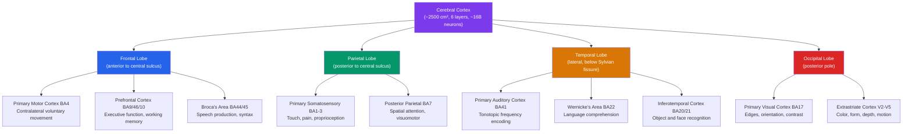

# 🧠 Cerebral Cortex and Lobes

> [!abstract] TL;DR
> The cerebral cortex is the deeply folded outer mantle of the brain — a 2–4 mm sheet containing ~16 billion neurons — that underlies conscious perception, voluntary movement, language, and every form of higher cognition. Its surface is partitioned into four lobes (frontal, parietal, temporal, occipital) whose primary and association areas are further catalogued into 52 Brodmann cytoarchitectural zones and organised into six laminar layers with distinct input/output roles. Focal damage to specific cortical territories produces predictable clinical syndromes — Broca's aphasia, hemispatial neglect, cortical blindness — making the cortex the central map in clinical neurology and systems neuroscience.

---

## Intuition — analogy FIRST

Imagine a large broadsheet newspaper — roughly the area of a dining table (~2,500 cm²) — crumpled up and stuffed inside a bag the size of a coconut. The crumpling creates ridges (gyri) and furrows (sulci) so that a vast printed surface fits inside a skull that stops growing in early childhood. Crucially, each section of the newspaper carries a different story: the sports pages handle movement, the news section handles language, the crossword handles spatial reasoning, and the picture pages handle vision. Fold the paper tightly enough and all those sections are present and functional in a space not much bigger than both fists held together.

The cerebral cortex works exactly like this. The folding is not random — it is genetically constrained so that the same sulci appear at the same location in every human brain, like a newspaper whose fold lines are printed in. Different territories do different jobs, yet every section remains part of one continuous sheet, all talking to each other through axons that run beneath the surface and across the midline.

---

## How It Works

### The Six-Layer Neocortex

The neocortex — which makes up ~90% of the total cortex — is organised into six horizontal layers visible under a Nissl-stained microscope. The layers are numbered from the pial surface (outside) inward toward white matter.

| Layer | Name | Predominant Cells | Key Connectivity |
|-------|------|-------------------|-----------------|
| I | Molecular | Few neurons; mostly neuropil | Receives long-range modulatory input (ACh, DA, 5-HT) |
| II | External Granular | Small pyramidal + stellate | Short-range corticocortical (local circuits) |
| III | External Pyramidal | Medium pyramidal | **Corticocortical output** — ipsilateral and callosal projections |
| IV | Internal Granular | Densely packed stellate cells | **Primary thalamic input** — absent in motor cortex (agranular) |
| V | Internal Pyramidal | Large pyramidal (Betz cells in M1) | **Subcortical output** — spinal cord, striatum, brainstem |
| VI | Multiform / Fusiform | Mixed morphology | **Corticothalamic feedback** — closes the thalamocortical loop |

**Key rule:** Layer IV is the main sensory input gate; layers V and VI are the main output highways. Layer III connects cortical areas to one another. This laminar logic is conserved across all cortical regions — what changes between areas is the relative thickness and cell density of each layer.

### The Motor and Somatosensory Homunculus

Both the primary motor cortex (precentral gyrus, Brodmann Area 4) and the primary somatosensory cortex (postcentral gyrus, BA 1/2/3) contain a complete, continuous map of the contralateral body — but the map is grotesquely distorted. Body regions requiring fine motor control or dense sensory discrimination (face, lips, tongue, hands) receive enormous cortical territory; the trunk and proximal limbs receive very little. The hand alone accounts for roughly 20% of the motor strip. This distortion reflects a simple principle: **cortical area is allocated proportional to computational demand, not body-part size**.

### Mermaid: Lobes and Their Primary Functional Areas



---

## Key Concepts / Details

### Secondary Level

**The Four Lobes and Their Primary Functions**

| Lobe | Location | Primary Area | Core Function | Landmark Sulcus/Gyrus |
|------|----------|--------------|---------------|----------------------|
| **Frontal** | Anterior to central sulcus | Primary Motor Cortex (BA4) | Voluntary movement, planning, personality, speech production | Precentral gyrus |
| **Parietal** | Between central sulcus and parieto-occipital sulcus | Primary Somatosensory (BA1/2/3) | Touch, pain, proprioception, spatial integration | Postcentral gyrus |
| **Temporal** | Below Sylvian (lateral) fissure | Primary Auditory Cortex (BA41) | Hearing, language comprehension, object recognition, memory | Heschl's gyri (transverse temporal) |
| **Occipital** | Posterior pole | Primary Visual Cortex V1 (BA17) | Visual feature detection — edges, orientation, contrast | Calcarine sulcus |

**Primary Sensory and Motor Areas in Brief**

- **Primary Motor Cortex (M1, BA4):** Precentral gyrus. Controls contralateral voluntary movement. Layer V Betz cells send the corticospinal tract directly to spinal motor neurons.
- **Primary Somatosensory Cortex (S1, BA1/2/3):** Postcentral gyrus. Receives thalamo-cortical relays from the ventral posterior nucleus. BA3a receives proprioception; BA3b, BA1, BA2 receive touch and texture.
- **Primary Visual Cortex (V1, BA17):** Calcarine sulcus. Receives input from the lateral geniculate nucleus (LGN) via the optic radiation. Neurons are tuned to orientation, spatial frequency, and local contrast. Retinotopic organisation with extreme foveal magnification.
- **Primary Auditory Cortex (A1, BA41):** Heschl's gyri on the superior temporal plane. Receives input from the medial geniculate nucleus. Organised tonotopically — low frequencies represented anterolaterally, high frequencies posteromedially.
- **Broca's Area (BA44/45, left IFG):** Pars opercularis (BA44) and pars triangularis (BA45) of the left inferior frontal gyrus. Essential for speech production and syntactic assembly. Damage → Broca's aphasia: non-fluent speech, good comprehension.
- **Wernicke's Area (BA22, left STG):** Posterior superior temporal gyrus. Essential for language comprehension. Damage → Wernicke's aphasia: fluent but incoherent speech, poor comprehension.

---

### Undergraduate Level

**Brodmann Areas (Cytoarchitectural Map)**

Korbinian Brodmann (1909) divided the cortex into 52 regions based on cell density, layer thickness, and neuron morphology under the microscope. The numbering is roughly chronological, not anatomical. Key areas:

| Brodmann Area | Location | Function |
|---------------|----------|----------|
| BA4 | Precentral gyrus | Primary motor cortex |
| BA6 | Premotor + supplementary motor area | Motor planning, sequence learning |
| BA1, 2, 3 | Postcentral gyrus | Primary somatosensory cortex |
| BA7 | Superior parietal lobule | Visuospatial processing, tool use |
| BA9, 46 | Dorsolateral prefrontal cortex (DLPFC) | Working memory, cognitive flexibility |
| BA10 | Frontopolar cortex | Prospective memory, multitasking |
| BA11/12 | Orbitofrontal cortex | Reward valuation, impulse control |
| BA17 | Calcarine cortex | Primary visual cortex (V1) |
| BA18, 19 | Peristriate cortex | Secondary visual processing (V2, V3) |
| BA20, 21 | Inferior/middle temporal gyri | Object recognition, semantic memory |
| BA22 | Superior temporal gyrus | Wernicke's area / auditory association |
| BA24, 32 | Anterior cingulate cortex (ACC) | Conflict monitoring, error detection |
| BA41, 42 | Transverse temporal / superior temporal | Primary and secondary auditory cortex |
| BA44, 45 | Inferior frontal gyrus | Broca's area |

> **Critical caveat:** Brodmann areas are defined by *cytoarchitecture*, not by function. Functional mapping (fMRI, lesion studies) often divides or unites Brodmann areas differently. BA22, for instance, extends well beyond the classic Wernicke's territory.

**Topographic Maps: Somatotopic, Retinotopic, Tonotopic**

The cortex does not process information from arbitrary input combinations — it preserves the topological structure of the sensory sheet it represents.

- **Somatotopic map (S1, M1):** Adjacent body parts are represented adjacently on the cortical strip. Distortion (the homunculus) reflects receptor density and motor precision requirements.
- **Retinotopic map (V1, V2, V3, V5):** Visual space is continuously mapped across the occipital cortex. The central 5° of vision (fovea) occupies ~50% of V1 cortical area, governed by the *cortical magnification factor* M(e) ≈ M₀ / (1 + e/e₂) where e is eccentricity in degrees and e₂ ≈ 2.3°.
- **Tonotopic map (A1):** Frequency is systematically mapped across Heschl's gyrus. This reflects the tonotopy of the basilar membrane in the cochlea, preserved through all subcortical relay stations.

**Cortical Columns**

David Hubel and Torsten Wiesel's Nobel Prize-winning work in the 1960s revealed that V1 neurons responding to the same orientation preference are stacked radially in *orientation columns* (~50 µm wide). A *hypercolumn* (~1 mm²) contains a complete cycle of orientation columns plus ocular dominance columns for one retinal location. Columnar organisation is now considered a general cortical principle: barrel cortex in rodents represents individual whiskers in ~200 µm columns; auditory cortex has tonotopic micro-columns. The radial unit hypothesis (Rakic, 1988) proposes that ontogenetic columns of ~80–100 neurons, derived from a single progenitor in the ventricular zone, form the developmental basis of adult columns.

**Prefrontal Cortex and Executive Function**

The prefrontal cortex (PFC, BA9/10/11/12/24/32/44/45/46/47) is the largest cortical expansion unique to primates. It integrates information from almost every other cortical area and projects back to all of them, making it the seat of executive function:

- **Dorsolateral PFC (BA9/46):** Working memory (holding information "online"), cognitive flexibility, rule-based reasoning, top-down attentional control
- **Ventromedial PFC / OFC (BA11/12):** Value-based decision-making, somatic marker integration (Damasio), reward prediction error
- **Anterior cingulate cortex (BA24/32):** Performance monitoring, conflict detection, pain affect
- **Frontopolar cortex (BA10):** Multitasking, prospective memory, integrating sub-goals

**Multimodal Association Areas**

Beyond primary areas, three major association zones integrate information across modalities:

1. **Prefrontal association cortex:** Integrates temporal, parietal, and limbic inputs for goal-directed behaviour
2. **Parieto-temporal-occipital junction (PTO/TPJ):** At the junction of parietal, temporal, and occipital lobes; critical for multisensory integration, body schema, theory of mind, and directed spatial attention
3. **Paralimbic cortex (cingulate, parahippocampal, insula):** Bridges neocortex and limbic system; insula integrates interceptive signals and contributes to emotion, pain, and self-awareness

---

### Graduate Level

**Cortical Layers I–VI: Connectivity in Detail**

The canonical laminar circuit can be understood as a feedforward-feedback loop:

1. **Thalamic afferents** terminate predominantly in **layer IV** (and to a lesser extent layers I, III, VI) of primary sensory areas. In motor cortex, layer IV is vestigial (agranular cortex), and thalamic input lands in layers III and V.
2. **Layer IV** excites **layers II/III** via vertical excitatory connections — this is the main signal amplification stage.
3. **Layers II/III** project horizontally within the same area (local association) and send long-range callosal/ipsilateral corticocortical axons to other cortical areas — primarily terminating in **layers II/III** of the target area (feedforward projection).
4. **Layer V** provides the principal **descending output** to the striatum, thalamus (non-specific), superior colliculus, red nucleus, and spinal cord.
5. **Layer VI** sends the principal **corticothalamic feedback** back to the specific thalamic relay nucleus, implementing a modulatory gain control on sensory input.

Feedforward connections (V1→V2→V4→IT) typically originate from layers II/III and terminate in layer IV of the target. Feedback connections (IT→V4→V2→V1) originate from layers V/VI and terminate in layers I and VI, bypassing the granular input layer — a key anatomical distinction used to define cortical hierarchy.

**Cortical Oscillations**

Neural population activity in the cortex oscillates across a wide frequency range, each band associated with distinct computational roles:

| Band | Frequency | Role |
|------|-----------|------|
| Delta (δ) | 1–4 Hz | Deep slow-wave sleep, large-scale synchrony |
| Theta (θ) | 4–8 Hz | Hippocampal-cortical memory encoding, navigation |
| Alpha (α) | 8–12 Hz | Cortical idling/inhibition; gates sensory processing (occipital during eyes-closed) |
| Beta (β) | 13–30 Hz | Sensorimotor processing, maintenance of current motor/cognitive state ("status quo") |
| Gamma (γ) | 30–80 Hz | Local assembly binding, feature integration, attentional selection |

Gamma oscillations are generated by the interaction between fast-spiking parvalbumin-positive (PV+) interneurons and pyramidal cells (PING/ING models). Alpha oscillations likely reflect inhibitory rhythms coordinated by the thalamus and layer I projections.

**Predictive Coding and Cortical Hierarchy**

Rao and Ballard (1999) proposed that the cortex implements a *hierarchical generative model*: higher areas hold predictions about lower-area activity, and lower areas send back prediction errors rather than raw sensory data. Under this framework:

- **Top-down connections** carry predictions (encoded as activity in deep layers, V/VI)
- **Bottom-up connections** carry prediction errors (encoded in superficial layers, II/III)
- The brain minimises free energy (surprise) by updating either its predictions (perception) or its sensory input (action) — the **free energy principle** (Friston, 2005)

This architecture explains why cortical responses to expected stimuli are suppressed (repetition suppression / mismatch negativity) and why attention modulates sensory cortex activity through top-down gain control.

**Canonical Microcircuit**

Douglas and Martin (1989, 2004) identified a stereotyped recurrent circuit motif repeated across all cortical areas — the *canonical microcircuit*:

1. Thalamic input activates **excitatory spiny stellate cells** in layer IV
2. Layer IV excites **superficial pyramidal cells** (II/III) through recurrent excitatory collaterals — this recurrence provides substantial gain amplification
3. Superficial pyramidals excite **deep pyramidal cells** (V/VI) which produce output and provide feedback
4. **Inhibitory interneurons** (PV+, SST+, VIP+) modulate all stages: PV+ provides perisomatic feed-forward inhibition (sharpening); SST+ provides dendritic inhibition (top-down gating); VIP+ disinhibits by targeting SST+ cells (attention-related gain)

**fMRI BOLD Signal and Its Cortical Source**

The blood-oxygen-level-dependent (BOLD) signal measured in fMRI arises from *neurovascular coupling*:

1. Neural activity (particularly excitatory synaptic input and local field potentials, not just spikes) creates a metabolic demand for ATP
2. Astrocyte calcium waves and retrograde messengers (NO, arachidonic acid metabolites) trigger vasodilation of upstream arterioles
3. Cerebral blood flow (CBF) increases ~30–50% above baseline in active regions, overshooting oxygen demand
4. Local oxyhaemoglobin (oxyHb) concentration increases relative to deoxyhaemoglobin (deoxyHb)
5. DeoxyHb is paramagnetic; oxyHb is diamagnetic. Reduced deoxyHb → increased T2* MRI signal → positive BOLD response

The haemodynamic response function (HRF) peaks ~5–6 seconds after neural onset and lasts ~12–15 seconds. BOLD is therefore an indirect and temporally blurred measure. Layer-specific fMRI (laminar fMRI at 7T) can resolve input layers (layer IV BOLD dip) from output layers, opening a window onto the feedforward/feedback architecture of cortical circuits.

---

## Python Demo

```python
import numpy as np
import matplotlib.pyplot as plt

# ── Cortical Magnification in Primary Visual Cortex (V1) ─────────────────────
# Empirical formula: M(e) = M0 / (1 + e/e2)
# M0 = cortical magnification at fovea (mm/deg)
# e2 = eccentricity at which M halves (~2.3° in humans)
# Source: van Essen et al. (1984), Horton & Hoyt (1991)

M0 = 23.0    # mm/deg at the fovea
e2 = 2.3     # degrees — half-magnification eccentricity

eccentricities = np.linspace(0.1, 60.0, 600)
M_of_e = M0 / (1.0 + eccentricities / e2)

# ── Cortical area per eccentricity ring ───────────────────────────────────────
# A small annular strip at eccentricity e with width de covers:
#   visual field area   dA_vf = 2*pi*e * de  (degrees^2)
#   cortical area       dA_c  = M(e)^2 * dA_vf
# We integrate over 5-degree bins to get relative V1 allocation.

band_edges = np.arange(0, 65, 5)
band_centers = (band_edges[:-1] + band_edges[1:]) / 2
cortical_area = []
for lo, hi in zip(band_edges[:-1], band_edges[1:]):
    e_ring = np.linspace(lo + 0.01, hi, 200)
    M_ring = M0 / (1.0 + e_ring / e2)
    area = np.trapz(M_ring**2 * 2 * np.pi * e_ring, e_ring)
    cortical_area.append(area)

cortical_area = np.array(cortical_area)
cortical_pct = cortical_area / cortical_area.sum() * 100

# ── Plotting ──────────────────────────────────────────────────────────────────
fig, axes = plt.subplots(1, 2, figsize=(12, 5))

# Left panel: M(e) curve
axes[0].plot(eccentricities, M_of_e, color='steelblue', linewidth=2.5)
axes[0].fill_between(eccentricities, M_of_e, alpha=0.15, color='steelblue')
axes[0].axvline(e2, color='darkorange', linestyle='--',
                label=f'e₂ = {e2}° (M halves here)')
axes[0].set_xlabel('Eccentricity (degrees from fovea)', fontsize=11)
axes[0].set_ylabel('Cortical Magnification Factor (mm/deg)', fontsize=11)
axes[0].set_title('Cortical Magnification M(e) in Human V1', fontsize=12)
axes[0].legend(fontsize=10)
axes[0].grid(True, alpha=0.3)

# Right panel: bar chart of V1 area allocation
bar_colors = ['firebrick' if c < 15 else 'steelblue' for c in band_centers]
axes[1].bar(band_centers, cortical_pct, width=4.5,
            color=bar_colors, edgecolor='white', linewidth=0.6)
axes[1].set_xlabel('Eccentricity Band Center (degrees)', fontsize=11)
axes[1].set_ylabel('Percentage of Total V1 Area (%)', fontsize=11)
axes[1].set_title('V1 Area Devoted to Each 5° Eccentricity Band', fontsize=12)
axes[1].grid(True, alpha=0.3, axis='y')

plt.suptitle('Cortical Magnification: Why the Fovea Dominates V1',
             fontsize=13, fontweight='bold')
plt.tight_layout()
plt.savefig('cortical_magnification.png', dpi=150)
plt.show()

central_5 = cortical_pct[0]
central_10 = cortical_pct[:2].sum()
peripheral = cortical_pct[-1]
print(f"Central 0-5 degrees:  {central_5:.1f}% of V1 area")
print(f"Central 0-10 degrees: {central_10:.1f}% of V1 area")
print(f"Peripheral 55-60 deg: {peripheral:.2f}% of V1 area")
```

**What this demonstrates:** The foveal 5° of visual angle — roughly the width of your thumb at arm's length — monopolises a disproportionate fraction of V1. The bar chart makes viscerally clear why lesions to the occipital pole (tip of the occipital lobe, where the fovea maps) destroy fine-detail vision while leaving peripheral awareness intact, and why a macular-sparing pattern of homonymous hemianopia indicates a posterior cerebral artery infarct sparing the occipital pole's collateral supply.

---

## Real-World Applications

**Stroke Syndromes by Lobe**

| Lobe Affected | Artery (typical) | Key Syndrome | Hallmark Feature |
|---------------|-----------------|--------------|-----------------|
| Frontal (dominant) | MCA superior division | Broca's aphasia | Non-fluent speech, telegraphic output, intact comprehension |
| Frontal (non-dominant) | MCA superior division | Frontal lobe syndrome | Personality change, disinhibition, poor planning (cf. Phineas Gage) |
| Parietal (non-dominant) | MCA inferior division | Hemispatial neglect | Patient ignores left half of space/body; cannot copy left side of drawings |
| Parietal (dominant) | MCA inferior division | Gerstmann syndrome | Finger agnosia + acalculia + agraphia + left-right confusion |
| Temporal (dominant) | MCA inferior/posterior | Wernicke's aphasia | Fluent but paraphasic speech, poor comprehension, jargon |
| Temporal (bilateral) | PCA bilateral | Dense amnesia | Inability to form new declarative memories (cf. patient H.M.) |
| Occipital | PCA | Homonymous hemianopia | Visual field loss in contralateral hemifield of both eyes |
| Occipital (bilateral) | Bilateral PCA | Cortical blindness / Anton syndrome | Patient denies blindness despite no V1 input |

**Epilepsy Surgery**

Intractable focal epilepsy often arises from abnormal cortical tissue (heterotopia, cortical dysplasia, gliosis). Pre-surgical workup uses:
- **Stereo-EEG (sEEG) / ECoG** to localise the seizure onset zone with subdural grid electrodes laid directly on cortical surface
- **Cortical stimulation mapping** to identify eloquent cortex (motor, language, sensory) that must be preserved during resection
- **fMRI language lateralisation** to determine dominant hemisphere before temporal lobectomy

**Transcranial Magnetic Stimulation (TMS)**

A pulsed magnetic field creates an induced cortical current, transiently disrupting (single pulse) or modulating (repetitive rTMS) the targeted area. Applications:
- **Motor cortex TMS** → motor evoked potentials (MEPs) in contralateral muscles; used to map the motor homunculus non-invasively and measure corticospinal tract integrity
- **rTMS to left DLPFC** at high frequency (10 Hz) is FDA-cleared for treatment-resistant major depression
- **TMS to parietal cortex** can transiently induce neglect-like spatial biases in healthy subjects, confirming the causal role of the right posterior parietal cortex in directed attention

**Neurofeedback**

Real-time fMRI and EEG neurofeedback allow subjects to learn volitional control over their own cortical activity:
- **SMR/theta neurofeedback (EEG):** Training sensorimotor rhythm (12–15 Hz) up and theta (4–7 Hz) down improves attention and impulse control in ADHD
- **Alpha neurofeedback:** Upregulating occipital alpha enhances pain tolerance and reduces anxiety
- **Real-time fMRI:** Subjects can learn to upregulate anterior insula or motor cortex activity by watching a bar that reflects the BOLD signal from that region — a direct demonstration of volitional top-down cortical control

---

## Common Pitfalls

- **Brodmann areas are cytoarchitectural, not functional units.** They were defined by cell morphology and layer proportions under a microscope in post-mortem brains. Modern fMRI parcellations (e.g., Glasser et al. HCP 2016 multimodal parcellation with 180 areas per hemisphere) do not align one-to-one with Brodmann's 52 areas. Citing "BA9 is the working memory area" is a category error.

- **Hemispheric dominance is function-specific, not a global property of the hemisphere.** Left-hemisphere dominance for language holds for ~95% of right-handers and ~70% of left-handers — but the same individuals show right-hemisphere dominance for facial emotion recognition, coarse prosodic processing, and global visuospatial attention. Speaking of the "dominant hemisphere" as if it dominates everything oversimplifies Roger Sperry's split-brain findings.

- **V1 is not the only, or even the primary, substrate for visual perception.** Blindsight patients with complete V1 destruction can still detect motion and emotion in stimuli they claim not to see, via a colliculo-pulvinar pathway bypassing V1. Conscious visual experience requires not just V1 activity but reentrant signals from higher areas (V4, IT) feeding back to V1 — consistent with predictive coding and global workspace theory.

- **The homunculus is not static.** Cortical maps reorganise (neuroplasticity) throughout life. Amputees develop phantom limb sensations because adjacent body representations (e.g., the face) invade the now-silent hand territory. Braille readers who read with their index finger show an enlarged cortical representation of that finger within weeks.

- **BOLD signal ≠ neural firing rate.** The haemodynamic response is driven primarily by *synaptic input* and local field potentials, not by the output spiking of pyramidal cells. An area can show strong BOLD activation from intense inhibitory input (which is metabolically costly) even if pyramidal output is suppressed. Interpreting fMRI activation maps as "this area is more active" conflates metabolic demand with excitatory output.

---

## Related Concepts

- [[_MOC_Neuroanatomy_and_Brain_Structure|↑ Neuroanatomy and Brain Structure MOC]] — section map and recommended learning path for this topic cluster
- [[Gross_Anatomy_of_the_Brain]] — Provides the macro-level context: sulci, gyri, lobar boundaries, and white-matter tracts within which the cortex sits
- [[Motor_System_and_Motor_Control]] — Deep dive into the motor homunculus, corticospinal tract, basal ganglia loops, and cerebellar contributions to movement initiated by M1
- [[Visual_System_and_Visual_Cortex]] — Detailed treatment of the retinotopic hierarchy V1→V2→V4→MT/V5→IT, the dorsal/ventral stream division, and cortical magnification
- [[Language_and_the_Brain]] — Full coverage of the Broca-Wernicke-Geschwind model, the arcuate fasciculus, and modern dual-stream language frameworks
- [[Attention_and_Executive_Function]] — DLPFC and parietal cortex in top-down attentional control, fronto-parietal networks, and prefrontal executive function systems
- [[Biological_Basis_of_Behavior]] — Psychology-level overview of brain regions and neurotransmitters; good entry-point for neuroscience newcomers
- [[Sensation_and_Perception]] — Bridges the physics of sensory stimuli to cortical processing and psychophysical thresholds
- [[Memory_Systems]] — Hippocampal-cortical interactions, declarative memory consolidation, and the temporal cortex's role in semantic storage

---

## Review Questions

1. **Secondary:** A patient suffers a stroke affecting the left inferior frontal gyrus. Describe the speech and language deficits you would expect, distinguishing them from the pattern you would see if the left posterior superior temporal gyrus were damaged instead. What does this double dissociation tell us about cortical organisation?

2. **Undergraduate:** The motor and somatosensory homunculi both devote disproportionate cortex to the hands and face. Explain the functional principle behind this distortion. A neurosurgeon stimulates a site on the postcentral gyrus and the patient reports tingling in the thumb — but stimulating 2 cm laterally elicits nothing. What does this imply about the somatotopic map, and how does cortical reorganisation after limb amputation challenge our understanding of it?

3. **Graduate:** Compare feedforward and feedback projections in the cortical hierarchy: how do they differ in laminar origin and termination, and what functional role does each serve in predictive coding? A 7T laminar fMRI study shows that a surprising stimulus produces a BOLD response in V1 layers II/III but not layer IV. Is this consistent with prediction error signalling? What would you predict about the direction of information flow in this scenario?

---

## Sources

- Purves, D. et al. — *Neuroscience*, 6th ed., Sinauer Associates (2018), Ch. 25–27
- Kandel, E.R. et al. — *Principles of Neural Science*, 6th ed., McGraw-Hill (2021), Part IV (Perception) and Part V (Movement)
- Zeki, S. — *A Vision of the Brain*, Blackwell Scientific (1993)
- Brodmann, K. — *Vergleichende Lokalisationslehre der Grosshirnrinde* (1909); translated excerpts in Garey (2006)
- Douglas, R.J. & Martin, K.A.C. — "A functional microcircuit for cat visual cortex," *J. Physiology* 440 (1989): 735–769
- Rao, R.P.N. & Ballard, D.H. — "Predictive coding in the visual cortex," *Nature Neuroscience* 2 (1999): 79–87
- Glasser, M.F. et al. — "A multi-modal parcellation of human cerebral cortex," *Nature* 536 (2016): 171–178
- Horton, J.C. & Hoyt, W.F. — "The representation of the visual field in human striate cortex," *Archives of Ophthalmology* 109 (1991): 816–824

---

#Neuroscience #Neuroanatomy #CerebralCortex #CorticalFunction
