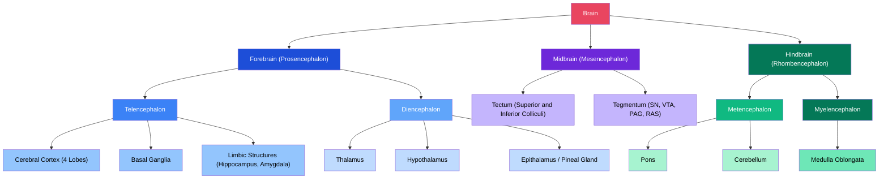

# 🧠 Gross Anatomy of the Brain

> [!abstract] TL;DR
> The human brain is a 1.4 kg organ divided into three embryologically distinct regions — forebrain, midbrain, and hindbrain — each further subdivided into structures with specialized but highly interconnected functions. Gross anatomy provides the spatial coordinate system that anchors everything else in neuroscience: you cannot localize a lesion, interpret an MRI, or understand a clinical syndrome without it. From the brainstem keeping you alive to the cortex reading this sentence, every function maps onto identifiable tissue.

---

## Intuition — analogy FIRST

Think of the brain as a city with specialized districts that evolved over hundreds of millions of years, with older infrastructure buried under newer construction.

The **brainstem** is the city's utility district — the buried pipes, electrical grid, and water treatment plant running 24/7 without conscious supervision. Lose it and the city dies (breathing, heart rate, blood pressure all collapse). The **cerebellum** is the traffic control center, refining every movement and ensuring cars arrive at the right destination at the right speed without conscious routing. The **limbic system** is emotional city hall — the mayor's office where survival priorities (hunger, fear, reproduction, memory) are set and where the emotional color of every experience is determined. The **cerebral cortex** is the business district: the glass-and-steel towers of language, planning, abstract reasoning, and conscious perception that make humans distinctly human.

Just as a city's districts overlap and communicate through roads and transit lines, brain regions communicate through white matter tracts — the fiber-optic cables of the nervous system. Damage one tract and a whole district can be cut off even if its tissue is intact.

---

## How It Works

The brain develops from the neural tube along a head-to-tail axis. Three primary vesicles — prosencephalon, mesencephalon, rhombencephalon — expand into five secondary vesicles that become the adult brain regions. Understanding this ontogeny is the shortest path to understanding adult gross anatomy.

**Forebrain (Prosencephalon)** divides into:
- **Telencephalon**: cerebral hemispheres, cerebral cortex (neocortex + allocortex), basal ganglia, amygdala, hippocampus — the most recently evolved and most distinctively mammalian tissue.
- **Diencephalon**: thalamus, hypothalamus, subthalamus, epithalamus (pineal gland, habenula) — the deep relay and regulatory core buried between the hemispheres.

**Midbrain (Mesencephalon)** remains relatively compact in adults:
- **Tectum**: superior colliculi (visual reflexes) and inferior colliculi (auditory reflexes).
- **Tegmentum**: reticular activating system, substantia nigra, ventral tegmental area, red nucleus, periaqueductal gray.

**Hindbrain (Rhombencephalon)** divides into:
- **Metencephalon**: pons (cranial nerve nuclei V–VIII, motor and sensory relay) and cerebellum (coordination, motor learning).
- **Myelencephalon**: medulla oblongata (cranial nerves IX–XII, vital cardiovascular and respiratory centers).



---

## Key Concepts

### Secondary Level

**The Three Major Divisions**

| Division | Embryonic Origin | Key Structures | Core Functions |
|---|---|---|---|
| **Forebrain** | Prosencephalon | Cortex, thalamus, hypothalamus, basal ganglia, limbic system | Cognition, sensation relay, homeostasis, emotion, memory |
| **Midbrain** | Mesencephalon | Colliculi, substantia nigra, VTA, PAG | Reflex arcs, motor control, reward, pain modulation |
| **Hindbrain** | Rhombencephalon | Pons, medulla, cerebellum | Vital autonomic functions, cranial nerve nuclei, coordination |

**The Cerebrum** comprises the two cerebral hemispheres, connected by the corpus callosum. Each hemisphere is divided into four lobes by prominent sulci:

| Lobe | Borders | Primary Functions |
|---|---|---|
| **Frontal** | Anterior to central sulcus | Motor control (primary motor cortex), executive function, Broca's area (speech production), personality |
| **Parietal** | Between central and parieto-occipital sulci | Somatosensory processing, spatial integration, body schema |
| **Temporal** | Inferior to lateral (Sylvian) fissure | Auditory processing, language comprehension (Wernicke's area), memory consolidation (hippocampus) |
| **Occipital** | Posterior pole | Primary and associative visual processing |

**The Cerebellum** sits posterior to the brainstem. It contains more neurons than the rest of the brain combined (~69 billion) and is responsible for motor timing, error correction, procedural learning, and increasingly recognized roles in cognitive function. It does not initiate movement — it refines it.

**The Brainstem** (midbrain + pons + medulla) is phylogenetically the oldest region. All 12 cranial nerves emerge from the brainstem (CN I and CN II attach above it; CN III–XII attach at brainstem levels). Brainstem death = clinical brain death even with an intact cortex.

**Gray Matter vs. White Matter**

- **Gray matter**: contains neuronal cell bodies, dendrites, unmyelinated axons, and synapses. Forms the cortical surface (2–4 mm thick) and deep nuclei (basal ganglia, thalamic nuclei, cerebellar nuclei).
- **White matter**: contains myelinated axon tracts. Myelin (from oligodendrocytes) gives it its pale color and dramatically speeds signal conduction (up to 120 m/s in large myelinated fibers vs. <1 m/s unmyelinated).

**Cerebrospinal Fluid (CSF)** is produced by choroid plexus in the lateral ventricles (~500 mL/day, ~150 mL in circulation at any time). It circulates through the ventricular system and subarachnoid space, providing buoyancy (brain "weighs" ~50 g in CSF vs. 1,400 g in air), shock absorption, nutrient delivery, and waste clearance via the glymphatic system (predominantly during sleep).

**Meninges** are the three protective membrane layers:
1. **Dura mater** — tough outer layer; folds form the falx cerebri (separating hemispheres) and tentorium cerebelli (separating cerebrum from cerebellum).
2. **Arachnoid mater** — middle, spiderweb-like; subarachnoid space below it contains CSF.
3. **Pia mater** — delicate inner layer adhering directly to brain surface, dipping into every sulcus.

Epidural, subdural, and subarachnoid hematomas are defined by which meningeal spaces are involved.

---

### Undergraduate Level

**Sulci, Gyri, and Surface Landmarks**

Cortical folding (gyrification) expands surface area ~3-fold within the skull. Key landmarks:

| Sulcus / Fissure | Location | Significance |
|---|---|---|
| **Central sulcus (of Rolando)** | Runs roughly coronal from vertex | Divides primary motor cortex (precentral gyrus) from primary somatosensory cortex (postcentral gyrus) |
| **Lateral sulcus (Sylvian fissure)** | Horizontal, lateral surface | Separates frontal/parietal from temporal lobe; insula lies deep within it |
| **Calcarine sulcus** | Medial occipital lobe | Primary visual cortex (V1/BA17) lines both banks |
| **Cingulate sulcus** | Medial surface, above corpus callosum | Borders cingulate gyrus — part of the limbic system |
| **Superior temporal sulcus** | Lateral temporal lobe | Involved in social cognition, biological motion processing |

**Brodmann Areas (Cytoarchitectural Map)**

Korbinian Brodmann (1909) divided the cortex into 52 areas based on laminar cytoarchitecture (neuronal layer composition and density). Key areas:

| Brodmann Area | Region | Function |
|---|---|---|
| BA4 | Precentral gyrus | Primary motor cortex |
| BA3,1,2 | Postcentral gyrus | Primary somatosensory cortex |
| BA17 | Calcarine cortex | Primary visual cortex (V1) |
| BA41,42 | Transverse temporal gyri (Heschl) | Primary auditory cortex |
| BA44,45 | Left inferior frontal gyrus | Broca's area (speech production) |
| BA22 | Left superior temporal gyrus | Wernicke's area (speech comprehension) |
| BA9,10,46 | Prefrontal cortex | Executive function, working memory |

**Corpus Callosum** is the largest white matter commissure (~200 million axons). Subdivisions from anterior to posterior: rostrum, genu (connects prefrontal regions), body (connects motor/somatosensory cortices), splenium (connects visual/posterior association areas). Callosotomy ("split brain") for intractable epilepsy was the basis of Sperry and Gazzaniga's lateralization research.

**Internal Capsule** is a compact white matter structure flanked by the basal ganglia and thalamus. It carries almost all cortical efferents and afferents:
- **Anterior limb**: thalamocortical fibers from medial dorsal nucleus to prefrontal cortex; frontopontine tracts.
- **Posterior limb**: corticospinal (motor) and thalamocortical (somatosensory) tracts. Strokes here cause contralateral pure motor or sensorimotor deficits.
- **Genu**: corticobulbar fibers to brainstem motor nuclei.

**Ventricular System**

| Ventricle | Location | Connects to |
|---|---|---|
| Lateral ventricles (left + right) | Within each cerebral hemisphere | 3rd ventricle via interventricular foramina (of Monro) |
| 3rd ventricle | Midline diencephalon, flanked by thalami | 4th ventricle via cerebral aqueduct (of Sylvius) |
| 4th ventricle | Between pons/medulla and cerebellum | Subarachnoid space via foramina of Luschka and Magendie |

Blockage at the aqueduct causes obstructive hydrocephalus (enlarged lateral and 3rd ventricles under increased pressure).

**Basal Ganglia Overview**: Subcortical nuclei forming a motor loop with cortex and thalamus. Components: caudate nucleus + putamen (= striatum), globus pallidus (interna + externa), substantia nigra (pars compacta + pars reticulata), subthalamic nucleus. The direct pathway facilitates movement; the indirect pathway suppresses it. Dopamine from SNpc biases toward facilitation — its loss causes Parkinson's disease.

**Limbic System Overview**: Originally Papez circuit (hippocampus → fornix → mammillary bodies → anterior thalamus → cingulate cortex → entorhinal cortex → hippocampus), now broadly includes amygdala, hippocampus, parahippocampal gyrus, cingulate gyrus, hypothalamus, and parts of the basal forebrain. Functions span emotion, motivation, memory consolidation, and autonomic regulation.

---

### Graduate Level

**White Matter Tracts: Three Classes**

| Class | Definition | Examples |
|---|---|---|
| **Projection fibers** | Connect cortex to subcortical structures | Corticospinal tract, corticobulbar tract, thalamocortical radiations, optic radiations |
| **Association fibers** | Connect cortical regions within the same hemisphere | Superior longitudinal fasciculus (SLF), arcuate fasciculus, uncinate fasciculus, cingulum, inferior fronto-occipital fasciculus (IFOF) |
| **Commissural fibers** | Cross the midline between hemispheres | Corpus callosum, anterior commissure, posterior commissure, hippocampal commissure |

The **arcuate fasciculus** connects Broca's and Wernicke's areas; damage causes conduction aphasia (intact production and comprehension, impaired repetition).

**Diffusion Tensor Imaging (DTI) and Tractography**

Water diffuses preferentially along axon bundles (fractional anisotropy, FA). DTI measures this directional diffusion in each voxel, and tractography algorithms reconstruct fiber tract trajectories in 3D. Limitations: cannot resolve crossing fibers at the voxel level (addressed by HARDI, DSI, and spherical deconvolution methods); tract reconstructions are probabilistic, not anatomically ground truth.

**Functional Connectivity and the Default Mode Network (DMN)**

The DMN (medial prefrontal cortex, posterior cingulate/precuneus, angular gyrus, medial temporal lobe) is a large-scale network most active at rest and deactivated during externally directed tasks. It underlies self-referential thought, episodic memory retrieval, and prospection. Disruption of DMN connectivity is an early biomarker in Alzheimer's disease and is altered in schizophrenia, depression, and autism spectrum disorder.

**Lesion-Deficit Mapping**

Classic methodology: identify a patient's behavioral deficit → localize the lesion (autopsy or MRI) → infer function from the overlap across many patients (voxel-based lesion-symptom mapping, VLSM). Foundational cases: Broca's patient "Tan" (inferior frontal damage → expressive aphasia), H.M. (hippocampal resection → anterograde amnesia), Phineas Gage (orbitofrontal damage → personality change). Limitations: lesions are rarely focal; plasticity confounds chronic deficits; rare lesions are underpowered.

**Brain Atlases**

- **MNI space (Montreal Neurological Institute)**: standard coordinate system for human neuroimaging. MNI152 is the average of 152 T1 MRI scans. Coordinates reported as MNI (x, y, z) in mm.
- **Allen Human Brain Atlas**: gene expression data mapped to neuroanatomical regions; enables linking functional imaging targets to transcriptomic profiles.
- **Brodmann Atlas**: cytoarchitectural parcellation; still the standard for reporting fMRI activations despite imprecision when applied to MNI space.
- **HCP Multi-Modal Parcellation (MMP1.0)**: 360 cortical areas per hemisphere defined by combining myelin maps, cortical thickness, fMRI task activation, and resting-state connectivity.

---

## Python Demo

```python
import matplotlib.pyplot as plt
import matplotlib.patches as mpatches

# Visualize the major brain divisions as a color-coded hierarchy tree
# Uses only matplotlib (no networkx required)

fig, ax = plt.subplots(figsize=(14, 8))
ax.set_xlim(-0.5, 14.5)
ax.set_ylim(-0.8, 5.2)
ax.axis('off')
ax.set_title('Gross Anatomy of the Brain: Major Divisions', 
             fontsize=13, color='white', pad=10, fontweight='bold')
fig.patch.set_facecolor('#12122a')
ax.set_facecolor('#12122a')


def draw_box(axis, x, y, label, color, fontsize=8.5, text_color='white'):
    axis.annotate(
        label, xy=(x, y), ha='center', va='center',
        fontsize=fontsize, color=text_color, fontweight='bold',
        bbox=dict(boxstyle='round,pad=0.45', facecolor=color,
                  edgecolor='white', linewidth=0.9, alpha=0.92)
    )


def draw_edge(axis, x1, y1, x2, y2):
    axis.plot([x1, x2], [y1, y2], color='#7a7a9a', linewidth=1.1, zorder=0)


# ---- Level 0: root ----
draw_box(ax, 7.0, 4.8, 'Brain', '#e94560', fontsize=11)

# ---- Level 1: three major divisions ----
level1 = [
    (2.5, 3.5, 'Forebrain\n(Prosencephalon)', '#1d4ed8', 7.0),
    (7.0, 3.5, 'Midbrain\n(Mesencephalon)', '#6d28d9', 7.0),
    (11.5, 3.5, 'Hindbrain\n(Rhombencephalon)', '#047857', 7.0),
]
for (x, y, lbl, col, px) in level1:
    draw_edge(ax, px, 4.55, x, 3.75)
    draw_box(ax, x, y, lbl, col)

# ---- Level 2: subdivisions ----
level2 = [
    (1.0, 2.1, 'Telencephalon', '#3b82f6', 2.5),
    (4.0, 2.1, 'Diencephalon', '#60a5fa', 2.5),
    (7.0, 2.1, 'Tectum +\nTegmentum', '#8b5cf6', 7.0),
    (9.8, 2.1, 'Metencephalon', '#10b981', 11.5),
    (13.2, 2.1, 'Myelencephalon', '#065f46', 11.5),
]
for (x, y, lbl, col, px) in level2:
    draw_edge(ax, px, 3.2, x, 2.35)
    draw_box(ax, x, y, lbl, col)

# ---- Level 3: leaf structures ----
level3 = [
    (0.3, 0.7, 'Cerebral Cortex\n(4 lobes)', '#93c5fd', 1.0, '#000'),
    (1.7, 0.7, 'Basal Ganglia\n+ Limbic', '#93c5fd', 1.0, '#000'),
    (3.3, 0.7, 'Thalamus', '#bfdbfe', 4.0, '#000'),
    (4.7, 0.7, 'Hypothalamus', '#bfdbfe', 4.0, '#000'),
    (6.2, 0.7, 'Colliculi', '#c4b5fd', 7.0, '#000'),
    (7.8, 0.7, 'SN / VTA\n/ PAG', '#c4b5fd', 7.0, '#000'),
    (9.1, 0.7, 'Pons', '#a7f3d0', 9.8, '#000'),
    (10.5, 0.7, 'Cerebellum', '#a7f3d0', 9.8, '#000'),
    (13.2, 0.7, 'Medulla\nOblongata', '#6ee7b7', 13.2, '#000'),
]
for (x, y, lbl, col, px, tc) in level3:
    draw_edge(ax, px, 1.85, x, 0.95)
    draw_box(ax, x, y, lbl, col, fontsize=7.8, text_color=tc)

# ---- Legend ----
legend_items = [
    mpatches.Patch(facecolor='#1d4ed8', label='Forebrain'),
    mpatches.Patch(facecolor='#6d28d9', label='Midbrain'),
    mpatches.Patch(facecolor='#047857', label='Hindbrain'),
]
ax.legend(handles=legend_items, loc='lower left', facecolor='#1e1e3a',
          edgecolor='white', labelcolor='white', fontsize=9, framealpha=0.8)

plt.tight_layout()
plt.savefig('brain_hierarchy.png', dpi=150, bbox_inches='tight',
            facecolor='#12122a')
plt.show()
```

---

## Real-World Applications

**Stroke Localization (Middle Cerebral Artery Territory)**
The MCA supplies most of the lateral cortical surface. Occlusion of the left MCA main stem causes contralateral hemiplegia (motor cortex), contralateral hemisensory loss (somatosensory cortex), and aphasia (Broca's and Wernicke's areas — both MCA territory). The arm is affected more than the leg (the MCA does not supply the paramedian strip served by the anterior cerebral artery). Gross anatomy knowledge lets a clinician localize the likely occlusion site from the bedside exam within minutes — before imaging.

**Traumatic Brain Injury (TBI)**
Coup-contrecoup injury explains why frontal and temporal lobe contusions dominate TBI even with occipital impact — the inferior frontal and temporal poles strike the rough orbital roof and sphenoid ridges as the brain decelerates. Diffuse axonal injury preferentially shears long white matter tracts (corpus callosum, internal capsule, corticospinal tract) at gray-white matter junctions because of tissue density differences. Understanding the three-dimensional anatomy predicts which deficits (executive dysfunction, memory impairment, motor weakness) to expect.

**Neurosurgical Planning**
Pre-operative fMRI and DTI tractography map eloquent cortex (motor, speech) and critical white matter tracts relative to a tumor. A glioma invading near Broca's area requires the neurosurgeon to know whether the arcuate fasciculus is displaced, infiltrated, or intact before deciding on resection margins. Awake craniotomy with cortical stimulation mapping remains the gold standard — direct electrical stimulation identifies functional sites gross anatomy predicts.

**fMRI Region of Interest (ROI) Analysis**
Functional imaging studies extract signal from anatomically defined parcels (e.g., "left hippocampus", "bilateral amygdala", "right superior temporal sulcus"). These parcels are defined in MNI space using atlas labels grounded in gross neuroanatomy. An experimenter who conflates the posterior parahippocampal gyrus with the hippocampus proper will draw incorrect conclusions about memory encoding — the distinction only makes sense if you understand the gross anatomy of the medial temporal lobe.

---

## Common Pitfalls

- **The "Triune Brain" model is a myth** — Paul MacLean's 1960s reptilian/paleomammalian/neomammalian hierarchy is scientifically discredited. The basal ganglia are not a "reptile brain" operating independently; they are deeply integrated with the cortex and thalamus at every level. No region "takes over" another in a hierarchical sense. The model persists in pop-psychology but should never appear in a clinical or neuroscience context.

- **Left brain / right brain "dominance" is mostly false** — While language is lateralized to the left hemisphere in ~95% of right-handers, nearly every cognitive function (attention, creativity, logic, emotion) is served by bilateral networks. The notion of "left-brained logical" vs. "right-brained creative" personalities has no empirical support in healthy individuals. Lateralization is real and specific; pop-psychology extrapolation is not.

- **Brain weight does not index intelligence** — Sperm whales (~8 kg) and elephants (~5 kg) have heavier brains than humans (~1.4 kg). Even within humans, brain size correlates weakly with IQ (r ~ 0.24) after correcting for body size. Cortical surface area, white matter organization, and synaptic density are more informative than gross weight.

- **"Higher" does not mean "more important"** — The medulla oblongata is phylogenetically ancient and anatomically small, but medullary lesions are immediately lethal. The hierarchy of clinical urgency inverts the evolutionary one: brainstem first, cortex second.

- **Sulcal variability is enormous** — Standard atlas labels assume average anatomy. The location of the central sulcus can vary by >1 cm across individuals, and many secondary/tertiary sulci are highly variable. Functional localization based on structural landmarks alone is unreliable — this is why task-based fMRI or direct cortical stimulation is required for surgical planning.

---

## Related Concepts

- [[_MOC_Neuroanatomy_and_Brain_Structure|↑ Neuroanatomy and Brain Structure MOC]] — section map and recommended learning path for this topic cluster
- [[Cerebral_Cortex_and_Lobes]] — detailed cytoarchitecture, laminar organization, and functional maps of each lobe
- [[Limbic_System_and_Diencephalon]] — deep dive into hippocampus, amygdala, thalamus, and hypothalamus circuitry
- [[Brainstem_and_Cranial_Nerves]] — cranial nerve anatomy, brainstem syndromes, and reticular formation
- [[Cerebellum_and_Basal_Ganglia]] — cerebellar circuits, basal ganglia loops, Parkinson's and Huntington's disease
- [[Neuroimaging_Methods]] — MRI, fMRI, DTI, PET; how gross anatomy is visualized in vivo
- [[Biological_Basis_of_Behavior]] — psychology-level overview of how brain regions generate behavior and mental states

---

## Review Questions

1. **Secondary level** — A patient presents with sudden-onset inability to speak but can understand speech normally and has right facial and arm weakness. Which hemisphere is affected, which lobe, which artery, and which Brodmann area is likely involved? Justify each step using gross anatomy.

2. **Undergraduate level** — The corpus callosum is severed for seizure control. Predict what happens when a visual stimulus is flashed exclusively to the left visual field. Explain your answer by tracing the anatomical pathway from retina to cortex to the behavioral output, accounting for hemispheric lateralization of language.

3. **Graduate level** — A DTI study reports reduced fractional anisotropy in the superior longitudinal fasciculus bilaterally in patients with schizophrenia. (a) What specific white matter class and connectivity does the SLF represent? (b) What cognitive symptoms might this predict, and why? (c) What are two methodological reasons why this finding should be interpreted cautiously before concluding causal disruption of a specific tract?

---

## Sources

- Purves, D. et al. — *Neuroscience*, 6th ed. (Sinauer/Oxford, 2018) — Ch. 1, 25, 26; comprehensive gross anatomy and functional systems
- Fitzgerald, M.J.T. & Folan-Curran, J. — *Clinical Neuroanatomy and Related Neuroscience*, 5th ed. (Saunders, 2012) — clinical correlates, cranial nerves, brainstem
- Duus, P., Baehr, M. & Frotscher, M. — *Topical Diagnosis in Neurology*, 5th ed. (Thieme, 2012) — topographic lesion-deficit mapping, gold standard clinical atlas
- Kandel, E.R. et al. — *Principles of Neural Science*, 6th ed. (McGraw-Hill, 2021) — cellular and systems neuroscience grounding
- Glasser, M.F. et al. (2016) — "A multi-modal parcellation of human cerebral cortex" — *Nature* 536, 171–178 — HCP MMP1.0 atlas

---

#Neuroscience #Neuroanatomy #BrainAnatomy
