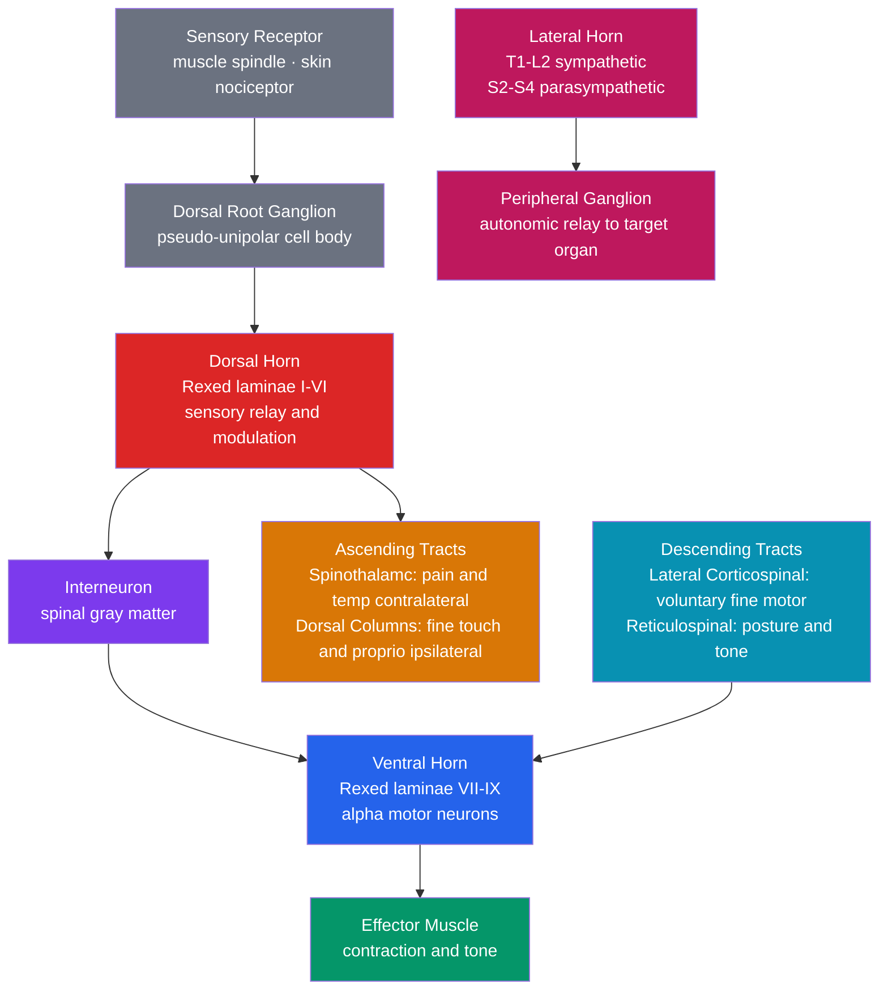

# Spinal Cord and Peripheral Nervous System

> [!abstract] TL;DR
> The spinal cord is the CNS highway that relays motor commands from the brain to muscles and sensory information from the body to the brain, while also performing local computation through reflex arcs entirely independent of conscious control. The peripheral nervous system (PNS) comprises 31 pairs of spinal nerves, 12 pairs of cranial nerves, the autonomic nervous system (sympathetic, parasympathetic), and the enteric nervous system — the collective wiring between the CNS and every organ, muscle, and gland in the body. Damage anywhere along these pathways produces precisely predictable deficits that neurologists read like a map to localize lesions.

## Intuition — analogy FIRST

Imagine a national fiber-optic highway system running from the capital (brain) to every city (organ or muscle group). The spinal cord is that trunk highway — a bundled cable of millions of individual fibers organized into dedicated lanes: northbound lanes carry sensory information (what the body is experiencing) and southbound lanes carry motor commands (what the brain wants the body to do).

At every exit (each vertebral level), a ring-road interchange handles local traffic without needing to contact the capital. A pothole suddenly appearing under your foot triggers an immediate swerve before your brain has even processed the sensation — that is the reflex arc, the interchange's local logic. The peripheral nerves are the on- and off-ramps: somatic ramps go to skeletal muscle for voluntary movement, autonomic ramps go to smooth muscle, the heart, and glands for involuntary regulation.

---

## How It Works

The spinal cord occupies the vertebral canal from the foramen magnum (junction with the medulla oblongata) to roughly L1–L2 in adults, where it tapers into the **conus medullaris**. Below that, the remaining nerve roots descend as the **cauda equina** ("horse's tail") before exiting through their respective foramina.

**Cross-sectional architecture** follows a consistent H-shaped plan of gray matter (cell bodies) surrounded by white matter (myelinated axons):

1. **Dorsal horn** (posterior) — receives incoming sensory signals from the body; Rexed laminae I–VI. Lamina I and II (substantia gelatinosa) modulate pain; lamina V relays wide-dynamic-range neurons for the spinothalamic tract.
2. **Ventral horn** (anterior) — houses alpha motor neurons (Rexed laminae VIII–IX) whose axons form the final common pathway to skeletal muscle.
3. **Lateral horn** — present only at T1–L2 (sympathetic) and S2–S4 (parasympathetic); contains preganglionic autonomic neurons.

**White matter columns** contain the long-distance tracts:
- **Dorsal columns** (posterior funiculus): carry fine touch, vibration, and proprioception *ipsilaterally* up to the nucleus gracilis and cuneatus in the medulla, where they cross to form the medial lemniscus.
- **Spinothalamic tract** (anterolateral funiculus): carries pain and temperature; afferent fibers enter the dorsal horn, synapse in lamina I/V, cross the *midline within 1–2 segments*, then ascend to the ventral posterolateral (VPL) thalamus contralaterally.
- **Lateral corticospinal tract**: descending voluntary motor commands that decussated at the medullary pyramids; synapses on ventral horn alpha motor neurons.
- **Reticulospinal and vestibulospinal tracts**: medial descending pathways governing posture, tone, and axial muscle control.

**PNS divisions:**
- **Somatic PNS**: spinal and cranial nerves carrying conscious sensation and voluntary motor commands.
- **Autonomic PNS**: two-neuron chains (preganglionic → postganglionic) targeting smooth muscle, cardiac muscle, and glands. Sympathetic ("fight-or-flight") ganglia lie near the spinal cord in the paravertebral chain; parasympathetic ("rest-and-digest") ganglia lie near or within the target organ.
- **Enteric NS**: 200–600 million neurons embedded in the gut wall, capable of independent peristaltic control — sometimes called the "second brain."

**The reflex arc** is the shortest functional circuit in the nervous system. A monosynaptic stretch reflex (knee-jerk) involves just two neurons: a Ia sensory fiber from a muscle spindle synapses directly onto the alpha motor neuron in the ventral horn — total latency ~25–30 ms. Polysynaptic reflexes (flexor withdrawal) involve interneurons and cross-inhibition of antagonist muscles.



---

## Key Concepts / Details

### Secondary Level

**CNS vs PNS**

| Feature | CNS | PNS |
|---------|-----|-----|
| Components | Brain + spinal cord | Spinal nerves, cranial nerves, autonomic ganglia |
| Protective sheath | Blood-brain barrier; meninges | Epineurium, perineurium, endoneurium |
| Regeneration after injury | Very limited (CNS inhibitory environment, myelin debris) | Possible (Schwann cells guide regrowth via Bands of Büngner) |
| Glial support | Astrocytes, oligodendrocytes, microglia | Schwann cells, satellite cells |

**Spinal Segments and Levels**

The spinal cord has 31 segments: **C1–C8** (cervical), **T1–T12** (thoracic), **L1–L5** (lumbar), **S1–S5** (sacral), and **Co1** (coccygeal). Each segment gives rise to a pair of spinal nerves that exit through their respective intervertebral foramina. Because the vertebral column grows faster than the cord, adult spinal cord levels do not align with the same-numbered vertebrae — a T12 cord lesion produces L1 sensory and motor deficits.

**Dermatomes and Myotomes**

A **dermatome** is the patch of skin whose sensory neurons travel through a single spinal root. Key clinical landmarks:
- C4: top of shoulder ("cape distribution")
- T4: nipple line
- T10: umbilicus
- L1: inguinal ligament / groin
- S2–S4: perineum and genitals ("saddle area")

A **myotome** is the set of muscle fibers whose motor neurons travel through a single spinal root. Key exam myotomes: C5 (shoulder abduction), C6 (wrist extension), C7 (elbow extension), L4 (knee extension / ankle dorsiflexion), L5 (great toe extension), S1 (ankle plantarflexion).

**Somatic vs Autonomic PNS**

| Feature | Somatic | Autonomic |
|---------|---------|-----------|
| Target | Skeletal muscle | Smooth muscle, cardiac muscle, glands |
| Neuron chain | One neuron (motor neuron → NMJ) | Two neurons (preganglionic → postganglionic) |
| Conscious control | Yes | Largely no |
| Neurotransmitter at target | Acetylcholine (nicotinic) | ACh (parasympathetic, muscarinic) or norepinephrine (sympathetic, adrenergic) |

### Undergraduate Level

**Ascending Sensory Tracts**

| Tract | Modality | Crosses? | Route to cortex |
|-------|----------|----------|-----------------|
| Dorsal column-medial lemniscus (DCML) | Fine touch, vibration, 2-point discrimination, proprioception | At medulla (pyramidal decussation level) | Dorsal columns → nucleus gracilis/cuneatus → medial lemniscus → VPL thalamus → somatosensory cortex |
| Anterior spinothalamic | Crude touch, pressure | Within 1–2 spinal segments | Anterolateral funiculus → VPL thalamus |
| Lateral spinothalamic | Pain, temperature | Within 1–2 spinal segments | Anterolateral funiculus → VPL thalamus |
| Spinocerebellar (dorsal) | Unconscious proprioception (lower limb) | Ipsilateral (does not cross) | Lateral funiculus → cerebellum via inferior cerebellar peduncle |

**Descending Motor Tracts**

| Tract | Origin | Function | Location |
|-------|--------|----------|----------|
| Lateral corticospinal | Primary motor cortex (contralateral, decussated at medulla) | Fine voluntary movement, especially distal limb muscles | Lateral funiculus |
| Anterior corticospinal | Primary motor cortex (ipsilateral, crosses at cord level) | Axial and proximal muscle control | Anterior funiculus |
| Rubrospinal | Red nucleus (midbrain) | Limb flexor tone | Lateral funiculus (small in humans) |
| Reticulospinal (medial and pontine) | Reticular formation | Tone, posture, gait | Anterior and lateral funiculi |
| Vestibulospinal | Vestibular nuclei | Balance, extensor tone | Anterior funiculus |

**Upper Motor Neuron (UMN) vs Lower Motor Neuron (LMN) Lesions**

This distinction is the cornerstone of clinical neuroanatomy:

| Feature | UMN Lesion | LMN Lesion |
|---------|-----------|-----------|
| Location | Cortex, brainstem, or corticospinal tract in cord | Anterior horn, ventral root, peripheral nerve, NMJ |
| Tone | Spasticity (velocity-dependent hypertonia) | Flaccidity (hypotonia) |
| Reflexes | Hyperreflexia | Hyporeflexia or areflexia |
| Babinski sign | Present (extensor plantar response) | Absent |
| Fasciculations | Absent | Present (denervation) |
| Atrophy | Disuse atrophy (late, mild) | Neurogenic atrophy (early, severe) |
| Weakness distribution | Groups of muscles (pyramidal pattern) | Single muscles or myotomal distribution |
| Example conditions | Stroke, MS, cervical myelopathy | Poliomyelitis, radiculopathy, Guillain-Barré, peripheral neuropathy |

**Peripheral Nerve Structure**

A spinal nerve is formed by the union of the **dorsal root** (sensory, with dorsal root ganglion) and **ventral root** (motor). After exiting the foramen, it immediately divides into dorsal ramus (back muscles and skin) and ventral ramus (limbs and trunk). Multiple ventral rami form plexuses (cervical, brachial, lumbar, sacral), within which axons are re-sorted into named peripheral nerves. Histologically: individual axons wrapped in **endoneurium** → bundled into fascicles by **perineurium** → whole nerve wrapped in **epineurium**.

### Graduate Level

**Central Pattern Generators (CPGs) for Locomotion**

The lumbosacral spinal cord contains intrinsic neural circuits — CPGs — capable of generating rhythmic, coordinated locomotor patterns without descending input from the brain. CPGs consist of half-center oscillator networks: flexor and extensor neuron pools mutually inhibit each other through commissural interneurons, producing alternating activation that drives the step cycle. Evidence: (1) spinalized cats can be trained to walk on a treadmill; (2) epidural stimulation of L1–L2 in humans with complete SCI evokes locomotor-like leg movements. CPGs are modulated by proprioceptive feedback (load receptors, Golgi tendon organs) and descending commands that set speed and direction.

**Incomplete SCI Syndromes**

| Syndrome | Lesion site | Motor deficits | Sensory deficits |
|---------|------------|----------------|-----------------|
| Brown-Séquard | Hemicord (lateral half) | Ipsilateral UMN weakness below lesion | Ipsilateral loss of DCML modalities; contralateral loss of pain/temp (spinothalamic crosses within 1-2 levels) |
| Anterior cord | Anterior 2/3 of cord (anterior spinal artery occlusion) | Bilateral paraplegia (bilateral corticospinal damage) | Bilateral loss of pain/temp; DCML preserved (posterior columns intact) — worst prognosis |
| Central cord | Central gray and adjacent white matter (hyperextension injury in elderly) | Arms weaker than legs (cervical arm fibers run centrally; leg fibers peripherally in corticospinal tract) | Variable; sacral sparing common |
| Conus medullaris | S3–S5 cord segments | LMN bladder/bowel/sexual dysfunction; variable leg weakness | Saddle anesthesia (S2–S5 perineum) |
| Cauda equina | Below conus (lumbar/sacral nerve roots) | LMN flaccid paralysis, areflexia in multiple roots | Dermatomal sensory loss in saddle distribution; pain common |

**Neuropathic Pain Mechanisms**

Damage to peripheral nerves or the spinal cord itself generates pain that outlasts and is disproportionate to any ongoing tissue injury. Key mechanisms:
1. **Ectopic discharge**: injured Aδ and C-fibers develop sodium channel upregulation, firing spontaneously.
2. **Central sensitization**: repeated nociceptive input causes NMDA receptor-mediated "wind-up" in dorsal horn neurons — their receptive fields expand and pain threshold falls.
3. **Loss of inhibition**: damage to inhibitory interneurons (GABAergic, glycinergic) in lamina II removes the gate on pain transmission.
4. **Microglial activation**: spinal cord microglia release pro-inflammatory cytokines (TNF-α, IL-1β) that further sensitize dorsal horn neurons.
5. **Sympatho-afferent coupling**: in complex regional pain syndrome (CRPS), sympathetic efferents co-release norepinephrine at peripheral nerve injury sites, directly exciting nociceptors.

**Neuroplasticity After SCI and Epidural Stimulation**

After incomplete SCI, the injured cord reorganizes via: (1) **axonal sprouting** from spared fibers into denervated territory; (2) **unmasking of latent synapses** through LTP-like mechanisms; (3) **cortical map expansion** where representations of spared body parts invade regions previously representing the injured zone. Maladaptive plasticity underlies spasticity and neuropathic pain; adaptive plasticity underlies voluntary recovery.

**Epidural spinal cord stimulation (eSCS)** at the lumbosacral level (L1–L2) tonically depolarizes dorsal horn interneurons, lowering the threshold for CPG activation. In landmark trials, participants with motor-complete SCI regained volitional leg movements and, in some cases, standing and assisted walking during stimulation. The proposed mechanism is that eSCS re-engages dormant propriospinal and supraspinal circuitry that was silenced but not anatomically severed. High-frequency eSCS also significantly reduces spasticity by modulating inhibitory interneuron circuits.

---

## Python Demo

```python
import numpy as np
import matplotlib.pyplot as plt

# Simulate a monosynaptic stretch reflex arc
# A sudden muscle stretch activates Ia afferent fibers; their signal is delayed
# by synaptic transmission and motor nerve conduction, then drives muscle contraction
# that counteracts the stretch (negative feedback).

dt = 0.001           # time step (s)
t_end = 0.6          # simulation length (s)
t = np.arange(0, t_end, dt)
n = len(t)

# --- Parameters ---
delay_ms = 30        # monosynaptic reflex delay ~25-30 ms (Ia → α-MN → NMJ → contraction)
delay_steps = int(delay_ms / 1000 / dt)
spindle_gain = 50.0  # Ia firing rate gain (spikes/s per mm of stretch)
velocity_gain = 0.5  # additional dynamic sensitivity to stretch velocity
motor_gain = 0.7     # fraction of stretch corrected by reflex contraction
tau_muscle = 0.04    # muscle activation time constant (s) — ~40 ms twitch

# --- External perturbation: step stretch of 2 mm starting at t = 0.1 s ---
stretch_ext = np.zeros(n)
stretch_ext[int(0.1 / dt):int(0.25 / dt)] = 2.0   # 2 mm step for 150 ms

# --- Ia afferent firing rate (length + velocity components) ---
d_stretch = np.gradient(stretch_ext, dt)
ia_rate = spindle_gain * (stretch_ext + velocity_gain * np.maximum(d_stretch, 0))

# --- Alpha motor neuron output: delayed version of Ia signal ---
mn_output = np.zeros(n)
mn_output[delay_steps:] = ia_rate[: n - delay_steps]

# --- Muscle force: low-pass filter (mimics twitch kinetics) ---
muscle_force = np.zeros(n)
alpha_filt = dt / (tau_muscle + dt)
for i in range(1, n):
    muscle_force[i] = alpha_filt * mn_output[i] + (1 - alpha_filt) * muscle_force[i - 1]

# --- Net stretch after reflex compensation ---
correction = motor_gain * muscle_force / spindle_gain
net_stretch = stretch_ext - correction

# --- Plot ---
fig, axes = plt.subplots(3, 1, figsize=(10, 8), sharex=True)

axes[0].plot(t * 1000, stretch_ext, 'steelblue', lw=2, label='External stretch (mm)')
axes[0].plot(t * 1000, net_stretch, 'tomato', lw=2, linestyle='--', label='Net stretch after reflex (mm)')
axes[0].axhline(0, color='k', lw=0.5)
axes[0].set_ylabel('Stretch (mm)')
axes[0].set_title('Stretch Reflex Arc Simulation: Negative Feedback in the Spinal Cord')
axes[0].legend(fontsize=9)

axes[1].plot(t * 1000, ia_rate, 'seagreen', lw=2, label='Ia afferent firing rate (spikes/s)')
axes[1].set_ylabel('Firing Rate\n(spikes/s)')
axes[1].legend(fontsize=9)

axes[2].plot(t * 1000, muscle_force, 'mediumpurple', lw=2, label='Muscle activation (a.u.)')
axes[2].axvline(100 + delay_ms, color='k', linestyle=':', lw=1.5,
                label=f'Reflex onset (stimulus + {delay_ms} ms synaptic delay)')
axes[2].set_ylabel('Force (a.u.)')
axes[2].set_xlabel('Time (ms)')
axes[2].legend(fontsize=9)

plt.tight_layout()
plt.savefig('stretch_reflex.png', dpi=150)
plt.show()
# Key observation: muscle force rises ~30 ms after stretch onset, attenuating the net stretch.
# The delay (delay_ms) is the monosynaptic reflex latency. Polysynaptic reflexes add ~10-20 ms.
```

---

## Real-World Notes

- **Spinal cord injury (SCI)**: classified by the ASIA Impairment Scale (A = complete; B–D = incomplete with varying motor/sensory preservation; E = normal). Level of injury determines function — C4 lesion = ventilator-dependent; C6 = independent wheelchair; T10 = independent manual wheelchair with trunk stability.
- **Herniated nucleus pulposus (disc herniation)**: extruded disc compresses an exiting nerve root, producing **radiculopathy** — shooting pain, numbness, and weakness in a dermatomal/myotomal distribution. Most common at L4–L5 (L5 root: foot drop) and L5–S1 (S1 root: absent ankle reflex, weak plantarflexion).
- **Guillain-Barré Syndrome (GBS)**: acute autoimmune demyelination of peripheral nerves, classically ascending from legs upward, presenting as flaccid areflexic weakness — a pure LMN pattern. Life-threatening if respiratory muscles are affected (requires ICU monitoring of vital capacity). Treatment: IVIG or plasmapheresis.
- **Amyotrophic Lateral Sclerosis (ALS)**: simultaneous degeneration of both UMNs (corticospinal tract) and LMNs (anterior horn cells). Clinically: a hybrid of spasticity + fasciculations + atrophy in the same patient — pathognomonic because no other common condition damages both neuron types simultaneously.
- **Carpal tunnel syndrome**: compression of the median nerve at the wrist under the flexor retinaculum. Classic symptoms: nocturnal hand numbness (thumb, index, middle fingers — C6/C7 dermatomes), thenar wasting, positive Tinel's and Phalen's tests.
- **Epidural anesthesia**: local anesthetic injected into the epidural space blocks sensory (and at higher doses, motor) nerve roots as they traverse the epidural space. Obstetric epidurals target L2–L4 to block pain without completely abolishing motor function; surgical epidurals extend higher to achieve complete motor block.

---

## Common Pitfalls

- **Confusing UMN and LMN signs**: the mnemonic is "Upper = Up" — UMN lesions produce *up*-going plantar reflex (Babinski), *up*-regulated tone (spasticity), and *hyper*-reflexia. LMN lesions produce the opposite: flaccid, hyporeflexic, atrophied muscle.
- **Spinothalamic vs dorsal column crossing levels**: the spinothalamic tract crosses within 1–2 spinal segments; the dorsal columns cross only at the medulla. A unilateral cord lesion (Brown-Séquard) therefore produces *contralateral* pain/temperature loss starting 1–2 levels below the injury but *ipsilateral* loss of fine touch and proprioception.
- **C3, C4, C5 keeps the diaphragm alive**: the phrenic nerve (C3–C5) innervates the diaphragm. A cervical SCI at C3 or above eliminates spontaneous respiration and requires permanent mechanical ventilation. C5 injuries preserve diaphragmatic breathing but eliminate intercostal/abdominal muscle contribution.
- **Lumbar cord levels vs lumbar vertebral levels**: in adults, lumbar and sacral spinal cord segments lie at the T10–L1 vertebral level. Diagnosing cord-level injury from vertebral imaging requires accounting for this offset (roughly, add 2 segments for thoracic, add 3 for lumbar cord segments).
- **Cauda equina is always LMN**: below L1–L2 there is no cord — only nerve roots. Injuries here (cauda equina syndrome) always produce LMN signs (flaccid bladder, areflexia) and can mimic conus pathology. Emergent surgical decompression within 48 hours significantly improves recovery.
- **Peripheral nerve regeneration is slow**: axonal regrowth occurs at ~1 mm/day (~2.5 cm/month). A radial nerve injury at the axilla requires ~6–9 months for reinnervation of wrist extensors. This guides prognosis and rehabilitation timelines.

---

## Related Concepts

- [[_MOC_Neuroanatomy_and_Brain_Structure|↑ Neuroanatomy and Brain Structure MOC]] — section map and recommended learning path for this topic cluster
- [[Gross_Anatomy_of_the_Brain]] — the spinal cord is the caudal extension of the brainstem; understanding their junction (foramen magnum) is essential for interpreting high cervical and brainstem lesions
- [[Motor_System_and_Motor_Control]] — the corticospinal tract originates in the motor cortex; understanding voluntary motor control requires both the supraspinal command and the spinal cord relay
- [[Autonomic_Nervous_System]] — preganglionic autonomic neurons reside in the lateral horn of the spinal cord; their organization, pharmacology, and clinical syndromes extend the spinal cord story
- [[Pain_and_Nociception]] — nociceptive signals enter the dorsal horn and ascend via the spinothalamic tract; dorsal horn modulation (gate control theory, opioid receptors) bridges spinal anatomy and pain medicine
- [[Neuroplasticity_and_Rehabilitation]] — post-SCI plasticity, CPG-based locomotor training, and epidural stimulation represent the clinical translation of spinal neuroplasticity research

---

## Review Questions

1. **Secondary**: A patient complains of sharp pain radiating from the lower back down the posterior thigh and calf into the lateral foot, with a diminished ankle reflex. Which nerve root is compressed, and which intervertebral disc level is most likely responsible? Explain using dermatome and myotome maps.

2. **Undergraduate**: A patient presents with right-sided weakness and loss of vibration sense below T6, combined with left-sided loss of pain and temperature sense beginning at T8. Name the syndrome, explain why there is a two-segment offset between motor and sensory loss on the left, and identify which tracts are damaged on which side of the cord.

3. **Graduate**: A complete C6 SCI patient enrolled in an epidural stimulation trial begins to exhibit voluntary leg movements during L2 stimulation after 18 months of therapy. Using the concepts of CPGs, propriospinal relay neurons, and activity-dependent synaptic plasticity, propose two non-mutually-exclusive mechanisms that could account for this recovery. What would you predict about the patient's functional state if the stimulator were turned off one year after completing the protocol?

---

## Sources

- Purves D, Augustine GJ, et al. *Neuroscience*, 6th ed. Sinauer Associates, 2018. [https://www.ncbi.nlm.nih.gov/books/NBK11008/](https://www.ncbi.nlm.nih.gov/books/NBK11008/)
- Fitzgerald MJT, Gruener G, Mtui E. *Clinical Neuroanatomy and Neuroscience*, 7th ed. Elsevier, 2015.
- Kandel ER, et al. *Principles of Neural Science*, 6th ed. McGraw-Hill, 2021.
- Su Y, et al. "Central Pattern Generators in Spinal Cord Injury: Mechanisms, Modulation, and Therapeutic Strategies for Motor Recovery." *JOR Spine*, 2025. [https://pmc.ncbi.nlm.nih.gov/articles/PMC12338084/](https://pmc.ncbi.nlm.nih.gov/articles/PMC12338084/)
- Epidural Spinal Cord Stimulation for SCI: NIH Systematic Review, 2024. [https://www.ncbi.nlm.nih.gov/pmc/articles/PMC10889415/](https://www.ncbi.nlm.nih.gov/pmc/articles/PMC10889415/)
- StatPearls — Physiology, Spinal Cord. [https://www.ncbi.nlm.nih.gov/books/NBK544267/](https://www.ncbi.nlm.nih.gov/books/NBK544267/)
- TeachMeAnatomy — Grey Matter of the Spinal Cord. [https://teachmeanatomy.info/neuroanatomy/structures/spinal-cord-grey-matter/](https://teachmeanatomy.info/neuroanatomy/structures/spinal-cord-grey-matter/)

---

#Neuroscience #Neuroanatomy #SpinalCord #PeripheralNervousSystem
