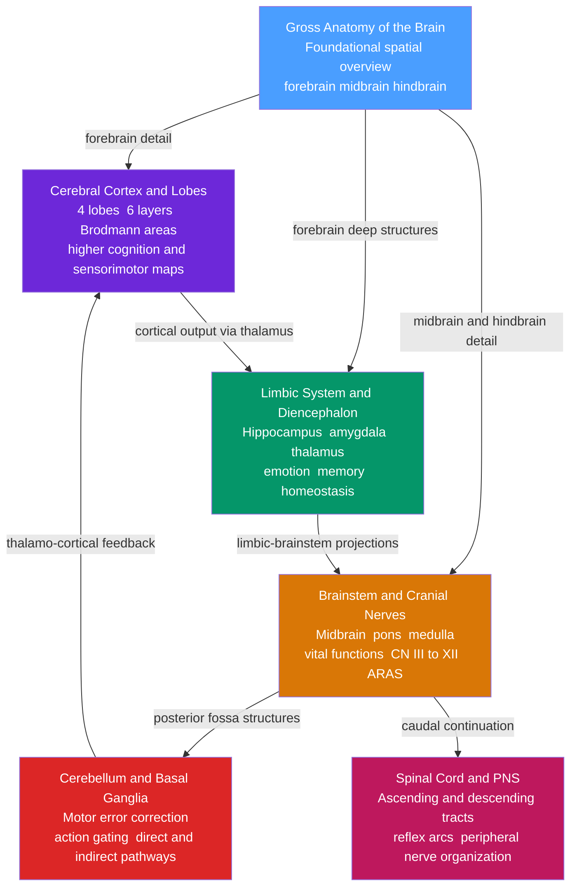

# Neuroanatomy and Brain Structure — Section MOC

> [!abstract]
> This section maps the physical architecture of the nervous system from the outermost cerebral cortex down through the deep limbic and diencephalic core, the brainstem, the cerebellar and basal ganglia motor loops, and finally the spinal cord and peripheral nerves. Each note zooms into a distinct anatomical tier, building a layered spatial model of where structures live, how they connect, and what clinical syndromes arise when they fail. Together the six notes provide the foundational anatomical coordinate system that anchors every other topic in neuroscience — you cannot interpret an MRI, localize a lesion, or understand a clinical syndrome without this map.

---

## Concept Map

*(Blue = fundamental entry point, Red = most advanced circuit detail, arrows = "leads to" or "provides detail for")*

---

## Learning Path

Recommended order for a first pass through this section:

1. [[Gross_Anatomy_of_the_Brain]] — Start here to build the three-division spatial map of the brain; every subsequent note is a zoom-in on a region introduced here.
2. [[Cerebral_Cortex_and_Lobes]] — Unpacks the outermost forebrain layer into four lobes, six laminar layers, Brodmann cytoarchitecture, and functional specialization.
3. [[Limbic_System_and_Diencephalon]] — Descends into the deep forebrain — hippocampus, amygdala, thalamus, hypothalamus — and the Papez circuit that binds emotion and memory.
4. [[Brainstem_and_Cranial_Nerves]] — Moves down to the midbrain, pons, and medulla; introduces all 12 cranial nerves, the reticular activating system, and brainstem vascular syndromes.
5. [[Cerebellum_and_Basal_Ganglia]] — Examines the two motor modulatory loops that attach to the brainstem and feed back onto motor cortex via the thalamus.
6. [[Spinal_Cord_and_Peripheral_Nervous_System]] — Closes the loop at the caudal end: ascending sensory tracts, descending motor tracts, reflex arcs, and the full peripheral nervous system.

---

## All Notes in This Section

| Note | Core Concept | Level |
|------|-------------|-------|
| [[Gross_Anatomy_of_the_Brain]] | Three-division brain hierarchy from embryonic vesicles to adult regions; lobes, white matter tracts, meninges, CSF | Beginner |
| [[Cerebral_Cortex_and_Lobes]] | Six-layer neocortex organized into four lobes with functional maps, Brodmann areas, and cortical oscillation bands | Intermediate |
| [[Limbic_System_and_Diencephalon]] | Papez circuit linking hippocampus and cingulate cortex; thalamic relay nuclei; hypothalamic HPA axis | Intermediate |
| [[Brainstem_and_Cranial_Nerves]] | Vital function hub housing cranial nerves III through XII, reticular formation, and classic crossed brainstem syndromes | Intermediate |
| [[Cerebellum_and_Basal_Ganglia]] | Real-time motor error correction via forward internal models; direct and indirect BG pathways gating thalamo-cortical drive | Advanced |
| [[Spinal_Cord_and_Peripheral_Nervous_System]] | Dorsal column and spinothalamic tracts, UMN vs LMN lesion patterns, reflex arcs, and peripheral nerve anatomy | Intermediate |

---

## Key Questions This Section Answers

- How is the adult brain spatially organized, and which embryonic vesicle gave rise to each region?
- What are the four cortical lobes, what primary function does each serve, and which Brodmann areas are clinically essential?
- How do the hippocampus, amygdala, thalamus, and hypothalamus form an integrated circuit for emotion, memory consolidation, and homeostasis?
- Where do each of the 12 cranial nerves originate, what do they do, and how does a small brainstem lesion produce crossed motor and sensory deficits?
- How do the cerebellum and basal ganglia each modulate movement without initiating it, and what happens to movement when each is damaged?
- How do ascending sensory and descending motor tracts traverse the spinal cord, where do they cross, and what clinical syndromes reveal their anatomy?

---

## Connections to Other Topics

- [[_MOC_Neuroscience_Master]] — Parent master MOC for the full Neuroscience vault; this section provides the anatomical foundation for every other section.
- Motor System and Motor Control — builds directly on the cerebellar and basal ganglia circuits described in this section.
- Autonomic Nervous System — the lateral horn of the spinal cord and brainstem parasympathetic nuclei detailed here are the structural substrate of autonomic control.
- Learning and Memory Systems — the hippocampal circuitry introduced in Limbic System and Diencephalon is expanded there with LTP, consolidation, and systems-level memory theory.
- Neurodegenerative Diseases — Parkinson's disease and Huntington's disease are the primary clinical illustrations of the basal ganglia circuit described in Cerebellum and Basal Ganglia.

---

[[_MOC_Neuroscience_Master]]

#MOC #Neuroscience #Neuroanatomy #SectionMOC
