# Auditory System and Sound Processing

> [!abstract] TL;DR
> The auditory system transforms mechanical pressure waves into neural signals through a precisely organized chain of anatomical stages, from the ear canal to the cerebral cortex. The cochlea performs biological frequency analysis: different positions along the basilar membrane resonate at different frequencies (tonotopy), converting sound into a spatial map that is preserved across every subsequent processing stage. This tonotopic representation enables pitch and loudness perception, sound localization via interaural time and level differences, speech comprehension, and the segregation of simultaneous sounds in a complex acoustic environment.

---

## Intuition — analogy FIRST

Imagine a grand piano lying on its side with the lid removed. Strike a high note and only the short, taut strings near the right end vibrate; strike a bass note and only the long, slack strings at the left end respond. The cochlea works exactly this way: it is a fluid-filled tube coiled 2.5 turns, and its internal partition — the **basilar membrane** — is stiff and narrow at the base (near the oval window) and flexible and wide at the apex. High-frequency sounds (treble) create a peak of vibration at the stiff base; low-frequency sounds (bass) travel all the way to the floppy apex before peaking. The **hair cells** sitting on top of this membrane are the piano hammers: they detect the vibration and convert it into electrical signals the brain can decode. Every neural station upstream — brainstem, thalamus, cortex — preserves this spatial frequency map (tonotopy), so that "where a neuron sits" encodes "what frequency it prefers," all the way from the ear to conscious hearing.

---

## How It Works

```mermaid
graph LR
    SW["Sound Wave\n(Pressure Oscillation)"] --> TM["Tympanic Membrane\n(Eardrum)"]
    TM --> OSS["Ossicles\nMalleus, Incus, Stapes"]
    OSS --> OW["Oval Window\nImpedance Matching"]
    OW --> BM["Basilar Membrane\nTraveling Wave (von Bekesy)"]
    BM --> IHC["Inner Hair Cells\nStereocilia Deflection"]
    IHC --> KPLUS["Tip Links Open\nK-plus Channel Influx"]
    KPLUS --> SG["Spiral Ganglion Neurons\nAction Potential"]
    SG --> CN8["CN VIII\nAuditory Nerve"]
    CN8 --> CNU["Cochlear Nuclei\nDorsal and Ventral"]
    CNU --> SOC["Superior Olivary Complex\nBinaural Processing"]
    SOC --> IC["Inferior Colliculus\nMidbrain Integration"]
    IC --> MGN["Medial Geniculate Nucleus\nThalamic Relay"]
    MGN --> A1["Primary Auditory Cortex\nA1 - Heschl's Gyrus"]

    style SW fill:#4a9eff,color:#fff
    style BM fill:#51cf66,color:#fff
    style IHC fill:#51cf66,color:#fff
    style CNU fill:#ffd43b,color:#333
    style SOC fill:#ffd43b,color:#333
    style IC fill:#ffd43b,color:#333
    style MGN fill:#ff922b,color:#fff
    style A1 fill:#ff6b6b,color:#fff
```



---

## Key Concepts

### Secondary Level

**Divisions of the ear:**

| Division | Structures | Function |
|---|---|---|
| Outer ear | Pinna, ear canal | Collect and funnel sound; pinna shape aids vertical localization |
| Middle ear | Tympanic membrane, malleus, incus, stapes | Impedance match air (low impedance) to cochlear fluid (high impedance) |
| Inner ear | Cochlea, vestibular organs | Frequency analysis; transduction to neural signals |

**Frequency and intensity.** Sound frequency is measured in **hertz (Hz)**; human hearing spans roughly 20 Hz to 20,000 Hz. Sound intensity is measured in **decibels (dB SPL)**, a logarithmic scale referenced to 20 µPa (the threshold of hearing):
$$L = 20 \log_{10}\!\left(\frac{p}{p_0}\right) \text{ dB}$$

Normal conversation: ~60 dB. Threshold of pain: ~130 dB. Because the scale is logarithmic, every +10 dB represents a 10-fold increase in acoustic intensity.

**Tonotopic map.** High frequencies are encoded at the **base** of the cochlea (near the oval window); low frequencies at the **apex**. This place-frequency relationship is preserved at every relay station up to auditory cortex and is called **tonotopy**.

**Hair cells and the organ of Corti.** The organ of Corti sits atop the basilar membrane inside the cochlea. It contains:
- **Inner hair cells (IHCs):** ~3,500 cells; the primary sensory transducers, contacted by 95% of afferent auditory nerve fibers.
- **Outer hair cells (OHCs):** ~12,000 cells; active amplifiers, contacted by 5% of afferent fibers and by efferent olivocochlear fibers.

**Auditory cortex location.** Primary auditory cortex (A1) lies within **Heschl's gyrus** (transverse temporal gyrus) in the superior temporal plane, buried in the lateral sulcus (Sylvian fissure), Brodmann areas 41 and 42.

---

### Undergraduate Level

**Basilar membrane mechanics and von Békésy's traveling wave.**
The basilar membrane is not under tension; instead, it is graded in stiffness and mass along its 35 mm length. When the stapes pushes on the oval window, it sets up a **traveling wave** that propagates from base to apex and builds to a maximum displacement at the resonant location for that frequency — then dies out abruptly. Georg von Békésy observed these waves directly in cadaver cochleas using stroboscopic illumination, earning the 1961 Nobel Prize in Physiology or Medicine. The characteristic frequency (CF) of each location determines which neurons are excited; bandwidth narrows logarithmically so that each octave of frequency occupies roughly equal basilar membrane length (~4 mm per octave in humans).

**Inner hair cells — transduction mechanism.**
Deflection of IHC stereocilia toward the tallest row stretches **tip links** (extracellular filaments connecting adjacent stereocilia tips) and mechanically gates **mechanosensitive K⁺/Ca²⁺ channels**. Because the endocochlear potential (+80 mV in the scala media) drives K⁺ into the hair cell, channel opening rapidly depolarizes the IHC. Depolarization opens basolateral **Ca²⁺ channels** and triggers glutamate release onto type I spiral ganglion dendrites, generating action potentials in CN VIII.

**Outer hair cells and the cochlear amplifier.**
OHCs express **prestin**, a voltage-sensitive motor protein in the lateral wall membrane. When the OHC is depolarized, prestin shortens the cell; when hyperpolarized, it elongates it. These length changes occur at acoustic frequencies (up to ~80 kHz), amplifying basilar membrane motion by ~40–50 dB. This **cochlear amplifier** explains why the healthy cochlea is ~100× more sensitive than a passive mechanical system and why OHC loss (from noise, ototoxic drugs, aging) produces sensorineural hearing loss.

**Sound localization — binaural cues.**

| Cue | Mechanism | Effective frequency range | Processing site |
|---|---|---|---|
| Interaural Time Difference (ITD) | Microsecond differences in wave arrival between ears | Low frequencies (<1500 Hz); phase-locking required | Medial superior olive (MSO) |
| Interaural Level Difference (ILD) | Head shadow attenuates high-frequency sound at far ear | High frequencies (>1500 Hz) | Lateral superior olive (LSO) |

**Olivocochlear feedback.**
The **medial olivocochlear (MOC)** bundle sends efferent fibers from the superior olive directly to OHCs, hyperpolarizing them and reducing their gain. Activation of MOC efferents shifts the dynamic range of the cochlea (useful in noise), attenuates the acoustic reflex, and provides protection against noise-induced hearing loss. The **lateral olivocochlear (LOC)** system modulates IHC afferents.

**Auditory brainstem response (ABR).**
A click stimulus evokes a series of far-field scalp potentials (waves I–V) within 10 ms. Wave I: distal CN VIII; II: cochlear nucleus; III: superior olive; IV–V: lateral lemniscus/inferior colliculus. ABR is used clinically to assess hearing thresholds in newborns and to localize brainstem lesions.

---

### Graduate Level

**Superior olivary complex and binaural computation.**
The MSO receives binaural excitatory input from both cochlear nuclei via delay lines — implementing a **Jeffress coincidence-detector model** in birds. In mammals the picture is more nuanced: glycinergic inhibitory inputs to MSO from the medial nucleus of the trapezoid body (MNTB) create a "best delay" through precisely timed inhibition, not just axonal conduction delays. Sub-millisecond precision is supported by Kv1 channels that prevent temporal summation, giant calyceal synapses (calyx of Held), and very fast AMPA receptors. The LSO computes ILD as an excitation (ipsilateral CN) minus inhibition (contralateral MNTB) difference.

**Inferior colliculus (IC).**
The IC in the midbrain is the primary convergence point for ascending auditory pathways and the obligatory relay before the thalamus. It maintains a precise tonotopic organization, integrates duration, frequency modulation, and amplitude modulation tuning, and plays a key role in the precedence effect (echo suppression). IC also receives descending input from auditory cortex, enabling top-down modulation of early processing.

**Auditory scene analysis and the cocktail party problem.**
When multiple sound sources overlap in time and frequency, the auditory system must segregate them into distinct perceptual streams — **auditory scene analysis** (Bregman, 1990). Cues include: common onset/offset, harmonicity (partials sharing a fundamental), spatial location, spectrotemporal continuity, and learned regularities. Cortical mechanisms involve **streaming** in A1 (sustained tonotopic responses) and higher-level attention-dependent processing in superior temporal sulcus. Deep learning models (attention-based speech separation) now explicitly mimic this multi-cue integration.

**Auditory cortex "what" and "where" streams.**
Analogous to visual dorsal/ventral streams, auditory cortex organizes along two axes:
- **Ventral "what" stream:** A1 → anterior superior temporal gyrus → temporal pole; specializes in sound identity, pitch, timbre, and speech phonology.
- **Dorsal "where" stream:** A1 → posterior superior temporal gyrus → parietal cortex; computes spatial location and interfaces with motor planning for speech production (Hickok & Poeppel dual-stream model).

**Tinnitus and cortical reorganization.**
Tinnitus (phantom ringing) arises when peripheral deafferentation (e.g., OHC loss in the 4-kHz range) reduces inhibitory restraint on auditory cortex neurons at the deprived CF. These neurons increase spontaneous firing rates, and neighboring representations expand into the silenced map region — analogous to **phantom limb pain**. Transcranial magnetic stimulation (TMS) or sound therapy targeting this map reorganization are under active investigation.

**Cochlear implant signal processing.**
A cochlear implant (CI) bypasses damaged hair cells by electrically stimulating spiral ganglion neurons directly. Signal processing pipeline: broadband microphone → 12–22-channel bandpass filterbank (logarithmically spaced, 200 Hz–8 kHz) → half-wave rectification and low-pass filtering to extract the **amplitude envelope** → amplitude mapping → biphasic current pulses delivered to intracochlear electrode array. The key limitation is loss of **temporal fine structure (TFS)** — the rapid phase fluctuations within each frequency channel that convey pitch in noise, voice separation, and tonal language. Continuous interleaved sampling (CIS) strategy fires electrodes sequentially to avoid channel interaction. Modern CI users reach ~80% open-set sentence understanding in quiet but struggle dramatically in noise precisely because of absent TFS.

---

## Python Demo

Simulate basilar membrane frequency selectivity using a gammatone-like filterbank. Generate a harmonic complex tone, pass it through a cochlear filterbank, extract amplitude envelopes, and display the result as a **cochleagram** — a visualization of how the basilar membrane would decompose the sound across tonotopic positions.

```python
import numpy as np
import matplotlib.pyplot as plt
from scipy.signal import butter, sosfilt, hilbert


def erb_bandwidth(cf):
    """Equivalent Rectangular Bandwidth (Moore & Glasberg, 1983)."""
    return 24.7 * (4.37 * cf / 1000.0 + 1.0)


def bandpass_filter_sos(cf, bw, fs, order=4):
    """Fourth-order Butterworth bandpass filter centred at cf with bandwidth bw."""
    nyq = fs / 2.0
    low = max((cf - bw / 2.0) / nyq, 1e-4)
    high = min((cf + bw / 2.0) / nyq, 0.9999)
    return butter(order, [low, high], btype='band', output='sos')


# --- 1. Synthesise a harmonic complex tone (F0 = 220 Hz, harmonics 1-8) ---
fs = 44100                     # sample rate (Hz)
duration = 0.30                # seconds
t = np.linspace(0, duration, int(fs * duration), endpoint=False)

f0 = 220.0
signal = sum(np.sin(2 * np.pi * n * f0 * t) / n for n in range(1, 9))
signal /= np.max(np.abs(signal))

# --- 2. Build a 40-channel auditory filterbank (200 Hz to 8 kHz, log-spaced) ---
n_channels = 40
center_freqs = np.logspace(np.log10(200), np.log10(8000), n_channels)
cochleagram = np.zeros((n_channels, len(t)))

for i, cf in enumerate(center_freqs):
    bw = erb_bandwidth(cf)
    sos = bandpass_filter_sos(cf, bw, fs)
    filtered = sosfilt(sos, signal)
    cochleagram[i, :] = np.abs(hilbert(filtered))   # amplitude envelope

# --- 3. Plot waveform and cochleagram ---
fig, axes = plt.subplots(2, 1, figsize=(10, 7))

# Waveform (first 45 ms for clarity)
n_show = int(0.045 * fs)
axes[0].plot(t[:n_show] * 1000, signal[:n_show], color='#4a9eff', lw=0.8)
axes[0].set_title('Input Signal: Harmonic Complex (F0 = 220 Hz, 8 harmonics)')
axes[0].set_xlabel('Time (ms, first 45 ms)')
axes[0].set_ylabel('Amplitude (normalized)')

# Cochleagram
img = axes[1].imshow(
    cochleagram,
    aspect='auto',
    origin='lower',
    extent=[0, duration * 1000, 0, n_channels - 1],
    cmap='magma'
)
tick_positions = np.linspace(0, n_channels - 1, 7)
tick_freqs = np.logspace(np.log10(200), np.log10(8000), 7)
axes[1].set_yticks(tick_positions)
axes[1].set_yticklabels([f'{int(f)} Hz' for f in tick_freqs])
axes[1].set_title('Cochleagram: Basilar Membrane Frequency Selectivity\n'
                  '(each row = one tonotopic channel; brightness = envelope amplitude)')
axes[1].set_xlabel('Time (ms)')
axes[1].set_ylabel('Tonotopic Position (Center Frequency)')
plt.colorbar(img, ax=axes[1], label='Envelope Amplitude')

plt.tight_layout()
plt.show()

# Expected output: the cochleagram shows bright horizontal bands at
# 220, 440, 660, 880 Hz etc. — each harmonic excites a different
# tonotopic position, exactly as the basilar membrane would.
```

---

## Real-World Applications

**Cochlear implants (CI).**
When inner hair cells are destroyed by noise, ototoxicity, or genetic factors, a CI electrode array is surgically inserted along the scala tympani and directly electrically stimulates spiral ganglion neurons. Over 700,000 people worldwide use CIs. The tonotopic placement of electrodes tries to restore the basilar membrane frequency map, but channel interaction and absent temporal fine structure limit music and speech-in-noise perception.

**Hearing aids.**
Digital hearing aids perform frequency-specific amplification tuned to the patient's audiogram (hearing threshold as a function of frequency). Modern aids include directional microphone arrays (spatial beamforming), dynamic range compression, and noise suppression algorithms inspired by the olivocochlear system's gain control.

**Noise-induced hearing loss (NIHL).**
Sustained exposure above ~80 dB SPL causes metabolic exhaustion and mechanical trauma preferentially to OHCs at the ~4-kHz region (one-quarter wavelength resonance of the ear canal). NIHL appears as a characteristic "notch" in the audiogram at 4 kHz. OHC loss is irreversible in mammals — a major research motivation for hair cell regeneration strategies.

**Auditory processing disorder (APD).**
APD patients have normal audiograms but impaired ability to process speech in noise, localize sounds, or discriminate fine temporal features. Underlying mechanisms implicate brainstem and cortical processing rather than peripheral sensitivity — highlighting that "hearing" is not merely cochlear.

**Automatic speech recognition (ASR).**
Classic ASR front-ends use **mel-frequency cepstral coefficients (MFCCs)**, which explicitly mimic the auditory filterbank: a mel-scale filterbank (inspired by tonotopy), log-compression (mimicking intensity coding), and discrete cosine transform. Deep learning-based ASR (wav2vec 2.0, Whisper) learns auditory-like hierarchical representations from raw waveforms.

**Tinnitus.**
Tinnitus (prevalence ~15% of adults) is treated with sound therapy (broadband noise masking, notched music therapy targeting cortical reorganization), cognitive behavioral therapy (CBT), and emerging neuromodulation approaches (transcranial direct current stimulation, vagus nerve stimulation paired with tones). Understanding cortical map plasticity is central to developing mechanistically grounded treatments.

---

## Common Pitfalls

- **OHCs amplify; IHCs transduce** — OHCs (via prestin electromotility) boost basilar membrane vibration by up to 50 dB and sharpen frequency tuning; they contact very few afferent fibers. IHCs are the actual sensory transducers, sending the signal to the brain via 95% of CN VIII fibers. Swapping these roles is one of the most common errors in auditory physiology.

- **Decibels are logarithmic, not linear** — A 10 dB increase means 10× the acoustic intensity (or ~3.16× the sound pressure). A 20 dB increase means 100× intensity. "Doubling the volume" perceptually corresponds to roughly +10 dB, but only a 10-fold physical intensity change. Treating dB as linear produces wildly wrong calculations.

- **Tonotopy is not the same as pitch perception** — Tonotopy is a physical place-frequency map; pitch is a perceptual quality. Pitch is influenced by harmonic relationships (missing fundamental — you can perceive F0 even when no energy is present at F0), temporal periodicity coding, and context. A pure tone at 440 Hz and a complex tone with harmonics at 880, 1320, 1760 Hz (no energy at 440 Hz) can produce the same perceived pitch of A4 — something place coding alone cannot explain.

- **Traveling waves go base-to-apex only** — The traveling wave always propagates from the stiff base toward the floppy apex, never in reverse. There is no "reflected" traveling wave under normal conditions (though oto-acoustic emissions involve a different wave mode propagating back outward).

- **Conductive vs. sensorineural hearing loss are fundamentally different** — Conductive loss (middle ear fluid, ossicular fixation) reduces sound transmission to the cochlea but leaves hair cells and nerves intact; it is often medically reversible. Sensorineural loss (OHC/IHC damage, CN VIII pathology) involves irreversible neural substrate damage. Audiometry and tympanometry distinguish these; confusing them misdirects treatment.

---

## Related Concepts

- [[_MOC_Systems_Neuroscience|↑ Systems Neuroscience MOC]] — section map; start here to orient across all sensory, motor, and autonomic notes in this section
- [[Sensory_Systems_and_Transduction]] — General principles of sensory receptor transduction that the auditory hair cell mechanism instantiates; comparison with photoreceptors and mechanoreceptors.
- [[Brainstem_and_Cranial_Nerves]] — CN VIII (vestibulocochlear nerve) anatomy; the cochlear nuclei, superior olivary complex, and inferior colliculus are all brainstem structures in the ascending auditory pathway.
- [[Language_and_the_Brain]] — Auditory cortex "what" and "where" streams feed into Wernicke's area (speech comprehension) in the superior temporal gyrus; the dorsal stream connects to Broca's area via the arcuate fasciculus.
- [[Neural_Coding_and_Spike_Trains]] — Phase-locking, rate coding versus temporal coding, coincidence detection in MSO, and the limits of temporal fine structure coding in CN VIII are central auditory coding questions.
- [[Waves_in_Fluids_and_Acoustics]] (Physics) — The physics of pressure waves, acoustic impedance, the impedance-matching function of the middle ear ossicles, and traveling wave mechanics derive directly from fluid acoustics.
- [[Fourier_Transform]] (Signals & Systems) — The cochlea performs a biological Fourier-like decomposition: each basilar membrane location extracts the amplitude of a frequency band, analogous to a single coefficient of the Fourier transform of the incoming sound.

---

## Review Questions

**Secondary level**
1. A patient has fluid in the middle ear (otitis media with effusion). Explain why this causes hearing loss even though the cochlea and auditory nerve are completely healthy. What type of hearing loss is this, and is it likely to be permanent?

**Undergraduate level**
2. A factory worker develops a hearing threshold shift specifically at 4 kHz after years of exposure to 90 dB machinery noise. Using basilar membrane traveling-wave mechanics, explain why 4 kHz is selectively vulnerable, why OHCs are damaged before IHCs, and why the audiogram shows a notch rather than a flat loss across all frequencies.

**Graduate level**
3. The medial superior olive (MSO) detects interaural time differences (ITDs) with sub-100-microsecond precision. Describe the biophysical adaptations that allow MSO neurons to achieve this temporal precision (ion channels, synapse geometry, myelination), and explain how contralateral glycinergic inhibition via the MNTB can create a "best ITD" without relying solely on axonal delay lines as in the classic Jeffress model.

---

## Sources

- Bear, M. F., Connors, B. W., & Paradiso, M. A. — *Neuroscience: Exploring the Brain*, 4th ed. (Wolters Kluwer, 2015) — Chapters 11–12 (Auditory System)
- Kandel, E. R., Schwartz, J. H., Jessell, T. M., et al. — *Principles of Neural Science*, 5th ed. (McGraw-Hill, 2013) — Chapters 30–31 (Hearing)
- Moore, B. C. J. — *An Introduction to the Psychology of Hearing*, 6th ed. (Brill, 2012) — Chapters 1–5 (psychoacoustics and cochlear mechanics)
- von Békésy, G. — *Experiments in Hearing* (McGraw-Hill, 1960) — Original traveling-wave measurements
- Bregman, A. S. — *Auditory Scene Analysis* (MIT Press, 1990) — Cocktail party problem and auditory streaming

---

#Neuroscience #SystemsNeuroscience #AuditorySystem #Hearing
