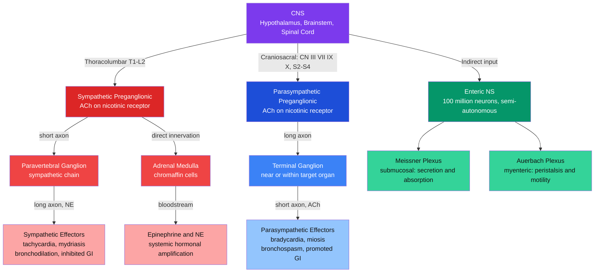

# 🫀 Autonomic Nervous System

> [!abstract] TL;DR
> The autonomic nervous system (ANS) governs involuntary visceral functions — heart rate, blood pressure, digestion, respiration, and glandular secretion — maintaining internal homeostasis without conscious effort. Its two antagonistic central divisions, the sympathetic ("fight-or-flight," thoracolumbar) and parasympathetic ("rest-and-digest," craniosacral), act through two-neuron preganglionic-to-postganglionic relays using different neurotransmitters to balance physiological state. A third division, the enteric nervous system embedded in the gut wall with over 100 million neurons, operates semi-independently of the brain — earning the gut the designation of the "second brain."

---

## Intuition — analogy FIRST

Think of the body's power infrastructure.

**The parasympathetic system** is the building's normal power grid: it runs continuously, delivering steady, efficient energy to all departments (heart, digestion, lungs) at the lowest possible cost. On an ordinary Tuesday afternoon, the grid handles everything — the HVAC hums, the elevators run, the cafeteria ovens stay warm.

**The sympathetic system** is the emergency generator: it sits dormant most of the time, but the moment a fire alarm sounds it slams online — overriding normal grid priorities, shedding non-essential loads (digestion, reproduction), and directing maximum power to the crisis systems (skeletal muscle, heart, lungs, alertness circuitry). Once the emergency passes, the generator cuts off and the normal grid resumes.

**The enteric nervous system** is the building's local automation controller — programmable logic controllers (PLCs) managing HVAC and elevator logic on each floor. They coordinate moment-to-moment operations of the building's internal machinery (gut motility, secretion, blood flow) independently. Even if the central building management system (the CNS) goes offline, the PLCs keep the building functional.

---

## How It Works

### Core Circuit

All three ANS divisions share a common architectural principle: **central neuron → ganglion → peripheral neuron → effector organ.** The preganglionic neuron originates in the CNS, synapses on a ganglion neuron outside the CNS, and that postganglionic neuron innervates the target tissue. The key variables between divisions are the ganglion location, the postganglionic neurotransmitter, and the receptor type on the effector.



---

## Key Concepts / Details

### Secondary Level

**Fight-or-Flight (Sympathetic)**

The sympathetic division prepares the body for immediate action. Activation produces a coordinated set of visceral responses:

| Organ | Sympathetic Effect | Mechanism |
|---|---|---|
| Heart | Tachycardia, increased contractility | NE on β1 receptors |
| Lungs | Bronchodilation | NE on β2 receptors |
| Pupils | Mydriasis (dilation) | NE on α1 receptors (radial muscle) |
| Blood vessels (skeletal muscle) | Vasodilation | NE on β2 receptors |
| Blood vessels (skin and viscera) | Vasoconstriction | NE on α1 receptors |
| GI tract | Inhibited motility and secretion | NE on α2 and β receptors |
| Adrenal medulla | Epinephrine + NE release | ACh on chromaffin cells |
| Sweat glands | Sweating (thermoregulatory) | ACh on muscarinic receptors (exception to NE rule) |
| Liver | Glycogenolysis, glucose release | NE on β2 receptors |

**Rest-and-Digest (Parasympathetic)**

The parasympathetic division restores and conserves resources during safe, calm conditions:

| Organ | Parasympathetic Effect | Mechanism |
|---|---|---|
| Heart | Bradycardia | ACh on muscarinic M2 receptors |
| Lungs | Bronchoconstriction | ACh on muscarinic M3 receptors |
| Pupils | Miosis (constriction) | ACh on M3 (sphincter pupillae muscle) |
| GI tract | Increased motility and secretion | ACh on muscarinic M3 receptors |
| Salivary glands | Increased watery saliva | ACh on muscarinic receptors |
| Bladder | Detrusor contraction (voiding) | ACh on muscarinic M3 receptors |
| Gonads | Vasodilation (erection) | Parasympathetic vasodilator fibers |

**The Adrenal Medulla as Sympathetic Amplifier**

The adrenal medulla is a modified sympathetic ganglion. Preganglionic sympathetic fibers directly synapse on chromaffin cells (which are modified postganglionic neurons that secreted into blood instead of onto a specific organ), releasing epinephrine (~80%) and norepinephrine (~20%) directly into the bloodstream. This provides systemic, long-duration hormonal amplification of the localized neural sympathetic response — the hormonal arm of the fight-or-flight reaction.

---

### Undergraduate Level

**Two-Neuron ANS Relay in Detail**

Every peripheral ANS pathway contains exactly two neurons between the CNS and the effector organ:

| Feature | Sympathetic | Parasympathetic |
|---|---|---|
| CNS origin | Thoracolumbar (T1–L2) IML column | Craniosacral: CN III, VII, IX, X; S2–S4 |
| Ganglion location | Paravertebral chain or prevertebral | Terminal (near or within target organ) |
| Preganglionic axon | Short | Long |
| Postganglionic axon | Long | Short |
| Preganglionic NT | ACh → nicotinic (N_N) receptor | ACh → nicotinic (N_N) receptor |
| Postganglionic NT | Norepinephrine → adrenergic receptors | ACh → muscarinic receptors (M1–M5) |
| Fiber type | Preganglionic B; postganglionic C | Preganglionic B; postganglionic C |

**Receptor Subtypes**

Adrenergic receptors (NE and epinephrine targets):
- **α1**: postsynaptic vasoconstriction, pupil dilation (radial muscle), urethral sphincter contraction
- **α2**: presynaptic autoreceptors (inhibit further NE release); also inhibit GI motility
- **β1**: increased heart rate and contractility; renin release from juxtaglomerular cells
- **β2**: bronchodilation, vasodilation in skeletal muscle, uterine relaxation, glycogenolysis in liver

Muscarinic receptors (ACh targets at parasympathetic postganglionic synapses and sympathetic sweat glands):
- **M1**: CNS neurons, gastric parietal cells (gastric acid); coupled to Gq/IP3
- **M2**: heart SA and AV node (bradycardia via K+ channel opening); coupled to Gi; also presynaptic autoreceptors
- **M3**: smooth muscle and exocrine glands — bronchospasm, GI motility, pupil constriction, bladder contraction, saliva; coupled to Gq
- **M4/M5**: predominantly CNS; M4 modulates dopaminergic activity; M5 at dopaminergic neurons

Nicotinic receptors (all preganglionic synapses and NMJ):
- **N_N (neuronal)**: at ANS ganglia — fast ionotropic Na+/K+ channel; also at adrenal medulla
- **N_M (muscle)**: at neuromuscular junction — blocked by curare, activated by succinylcholine

**Baroreflex Circuit**

The arterial baroreflex is the primary rapid negative-feedback loop for blood pressure regulation:
1. BP rises → baroreceptors (carotid sinus, aortic arch) stretch → increased afferent firing
2. Afferents travel via CN IX (Hering's nerve) and CN X to the nucleus tractus solitarius (NTS)
3. NTS activates the dorsal motor nucleus of vagus → increased cardiac vagal efferent output
4. Vagal ACh on M2 receptors → hyperpolarizes SA node pacemaker cells → HR decreases
5. Reduced cardiac output → blood pressure falls back toward setpoint
6. Simultaneously, NTS inhibits RVLM (rostral ventrolateral medulla) → reduces sympathetic tone to blood vessels

**Enteric Nervous System Independence**

The ENS contains approximately 100 million neurons organized into two concentric plexuses in the GI wall:
- **Meissner's (submucosal) plexus**: resides between the inner circular muscle and the mucosa; controls mucosal secretion, absorption, and local blood flow
- **Auerbach's (myenteric) plexus**: resides between the inner circular and outer longitudinal muscle layers; controls peristalsis and overall gut wall motility

The ENS employs over 30 neurotransmitters including ACh (motor excitation), NO (inhibitory motor neurons), substance P, VIP, serotonin (5-HT), and enkephalins. Critically, transplanted gut segments maintain coordinated peristalsis after complete extrinsic denervation — demonstrating true autonomous operation.

---

### Graduate Level

**Autonomic Integration: Hypothalamus and NTS**

The hypothalamus is the master autonomic coordinator. The **paraventricular nucleus (PVN)** integrates circulating hormonal signals (cortisol, leptin, angiotensin II, ghrelin) and projects directly to sympathetic preganglionic neurons in the intermediolateral (IML) cell column of the spinal cord and to dorsal vagal complex in the medulla. Key circuits:

- **NTS (nucleus tractus solitarius)**: primary central relay for all visceral sensory afferents (CN IX, X). Projects to the dorsal motor nucleus of vagus (parasympathetic output), the nucleus ambiguus (cardiac vagus), and the RVLM.
- **RVLM (rostral ventrolateral medulla)**: tonically active sympathoexcitatory nucleus. RVLM → IML → sympathetic preganglionic neurons — the principal driver of resting sympathetic tone and sympathoexcitatory reflexes.
- **Nucleus ambiguus**: primary source of cardiac vagal motoneurons (not the dorsal motor nucleus as formerly believed). Its activity tracks respiratory phase, generating respiratory sinus arrhythmia.

**Cardiac Vagal Tone and Heart Rate Variability (HRV)**

Resting cardiac vagal tone suppresses the intrinsic SA node rate (~100 bpm) to ~70 bpm. Beat-to-beat variations in RR intervals (HRV) reflect dynamic ANS modulation:

| HRV Component | Frequency Band | Physiological Origin |
|---|---|---|
| High frequency (HF) | 0.15–0.4 Hz | Respiratory sinus arrhythmia; pure vagal index |
| Low frequency (LF) | 0.04–0.15 Hz | Baroreflex loop oscillation (Mayer waves); mixed sympathetic + vagal |
| Very low frequency (VLF) | 0.003–0.04 Hz | Thermoregulation, renin-angiotensin system, intrinsic cardiac rhythm |
| RMSSD | Time domain | Root mean square of successive RR differences; best single vagal biomarker |

Chronic psychological stress, heart failure, and aging progressively reduce HRV by shifting ANS balance toward sympathetic dominance and reducing baroreflex gain. Low HRV independently predicts cardiovascular mortality and all-cause mortality.

**Autonomic Failure in Parkinson's and MSA**

- **Multiple System Atrophy (MSA)**: alpha-synucleinopathy selectively destroying preganglionic autonomic neurons (IML column, Onuf nucleus in S2–S4) alongside olivopontocerebellar or striatonigral degeneration. Produces severe orthostatic hypotension, urinary retention/incontinence, and anhidrosis. Unlike Parkinson's disease, plasma norepinephrine fails to rise on standing (preganglionic failure = intact postganglionic neurons).
- **Pure Autonomic Failure (PAF)**: postganglionic sympathetic degeneration with Lewy bodies confined to peripheral autonomic ganglia. Orthostatic hypotension is severe; NE is extremely low even supine — distinguishes from MSA.
- Both involve SNCA (alpha-synuclein) aggregation; PAF occasionally "converts" to Parkinson's disease or Lewy body dementia.

**Enteric Serotonin and the Gut-Brain Axis**

Approximately 95% of the body's serotonin (5-HT) is synthesized by enterochromaffin cells in the gut mucosa and used locally to coordinate peristalsis (via 5-HT4 receptors on ENS neurons). The gut-brain axis involves bidirectional signaling:
- **Vagal afferents** (~80% afferent): transmit gut state (distension, nutrient composition, inflammation, microbial metabolites) to NTS → parabrachial nucleus → insula and hypothalamus
- **Enteric 5-HT → mood**: vagal afferents relay gut serotonin signals to raphe nuclei (brainstem 5-HT synthesis center) and cortex; gut dysbiosis alters enteric 5-HT → altered affect, anxiety, visceral pain sensitivity
- **Microbiome**: gut bacteria produce SCFA (short-chain fatty acids) and neurotransmitter precursors (tryptophan → 5-HT); germ-free animal studies show profoundly altered stress axes and social behavior

**POTS and the Bezold-Jarisch Reflex**

- **POTS (Postural Orthostatic Tachycardia Syndrome)**: on standing, HR increases >30 bpm (or >40 bpm in patients under 19) within 10 minutes without the expected orthostatic hypotension. Mechanisms include: peripheral sympathetic denervation causing venous pooling in legs, autoimmune attack on adrenergic receptors (autoimmune POTS), hyperadrenergic state (elevated standing NE), and hypovolemia. Prevalence is ~0.2%, disproportionately affecting young women; dramatically elevated post-COVID-19.
- **Bezold-Jarisch reflex**: cardioinhibitory reflex triggered by ventricular C-fiber chemoreceptors (in response to serotonin, veratrum alkaloids, capsaicin, or severe ventricular underfilling). Produces paradoxical bradycardia, hypotension, and apnea via massive vagal activation. Mediates vasovagal syncope (neurocardiogenic syncope) in susceptible individuals during blood draw, pain, or prolonged standing.

---

## Python Demo

```python
import numpy as np
import matplotlib.pyplot as plt
from scipy.integrate import solve_ivp

# ── Baroreceptor Reflex: two-state negative-feedback ODE model ────────────────
# State vector: [BP (mmHg), HR (bpm)]
# Scenario: a sudden +25 mmHg blood pressure spike (isometric exercise)
# triggers the baroreflex: baroreceptors → NTS → vagal efferents → HR drops →
# cardiac output falls → BP recovers. The delayed negative feedback produces
# a damped oscillation analogous to real Mayer waves (~0.1 Hz) in HRV.

BP_set = 100.0  # blood pressure setpoint (mmHg)
HR_set =  70.0  # heart rate setpoint (bpm)
tau_BP =   8.0  # BP time constant (s) — vascular autoregulation lag
tau_HR =   4.0  # HR time constant (s) — vagal reflex latency
k_baro =   1.2  # baroreceptor gain: HR reduction (bpm) per mmHg excess BP
k_co   =   0.4  # cardiac coupling: BP rise (mmHg) per bpm excess HR

def baroreflex(t, state):
    """Two-state ODE: BP and HR coupled through the baroreceptor-vagal loop."""
    BP, HR = state
    BP_err = BP - BP_set
    HR_err = HR - HR_set
    # BP dynamics: cardiac output drives BP up; autoregulation pulls it down
    dBP = ( k_co * HR_err - BP_err) / tau_BP
    # HR dynamics: vagal activation (negative feedback) drives HR down when BP is high
    dHR = (-k_baro * BP_err - HR_err) / tau_HR
    return [dBP, dHR]

# Initial condition: +25 mmHg BP spike; HR at resting setpoint
t_span = (0, 80)
t_eval = np.linspace(0, 80, 800)
y0 = [BP_set + 25.0, HR_set]

sol = solve_ivp(baroreflex, t_span, y0, t_eval=t_eval, method='RK45')
BP_sol, HR_sol = sol.y[0], sol.y[1]

# Simplified baroreceptor firing rate: proportional to BP above setpoint
baro_fire = np.maximum(0.0, 0.6 * (BP_sol - BP_set))

fig, axes = plt.subplots(3, 1, figsize=(10, 8), sharex=True)

axes[0].plot(sol.t, BP_sol, color='crimson', lw=2)
axes[0].axhline(BP_set, color='gray', ls='--', alpha=0.7, label='Setpoint: 100 mmHg')
axes[0].set_ylabel('Blood Pressure (mmHg)')
axes[0].set_title('Baroreceptor Reflex — Autonomic Negative Feedback Simulation')
axes[0].legend()

axes[1].plot(sol.t, baro_fire, color='darkorange', lw=2, label='Baroreceptor firing')
axes[1].axhline(0, color='gray', ls='--', alpha=0.4)
axes[1].set_ylabel('Baro Activity (a.u.)')
axes[1].legend()

axes[2].plot(sol.t, HR_sol, color='steelblue', lw=2)
axes[2].axhline(HR_set, color='gray', ls='--', alpha=0.7, label='Setpoint: 70 bpm')
axes[2].set_ylabel('Heart Rate (bpm)')
axes[2].set_xlabel('Time (seconds)')
axes[2].legend()

plt.tight_layout()
plt.show()

# Expected output:
# Top panel:   BP spikes to 125 mmHg then decays with damped oscillation back to 100.
# Middle panel: Baroreceptor firing bursts immediately, then decays as BP normalizes.
# Bottom panel: HR dips below 70 bpm (vagal over-correction), recovers with oscillation.
# This oscillatory pattern mirrors real Mayer waves recorded in HRV time series.
```

---

## Real-World Applications

- **Beta-blockers (metoprolol, atenolol, propranolol)**: selectively block β1 adrenergic receptors on the heart, reducing HR and myocardial contractility. Indicated in heart failure, hypertension, angina, and post-MI arrhythmias. Propranolol is non-selective (β1 + β2) and is contraindicated in asthma because β2 blockade in the lungs prevents bronchodilation.
- **Atropine**: competitive muscarinic antagonist blocking all M subtypes. Removes the vagal brake on the SA node → tachycardia. Used clinically in symptomatic bradycardia, as a pre-anesthetic antisialagogue, and as an antidote in organophosphate (nerve agent) poisoning, which irreversibly inhibits acetylcholinesterase and causes cholinergic toxidrome (SLUDGE: salivation, lacrimation, urination, defecation, GI distress, emesis).
- **Epinephrine (adrenaline)**: activates all adrenergic receptors (α1, α2, β1, β2). Life-saving in anaphylaxis: α1-mediated peripheral vasoconstriction raises blood pressure; β2-mediated bronchodilation reopens airways; β1 increases cardiac output. Standard dose is 0.3–0.5 mg IM into the lateral thigh (EpiPen).
- **Autonomic neuropathy in diabetes**: chronic hyperglycemia damages small-diameter C and B fibers. Consequences include orthostatic hypotension (impaired sympathetic vasoconstriction), gastroparesis (impaired ENS-mediated gastric emptying), neurogenic bladder, erectile dysfunction, and cardiac autonomic neuropathy (fixed resting tachycardia, QT prolongation, increased sudden cardiac death risk).
- **POTS management**: increased salt and fluid intake (expand plasma volume), compression garments (reduce lower-limb venous pooling), fludrocortisone (mineralocorticoid; volume expansion), low-dose beta-blockers, or ivabradine (HCN channel block; reduces HR without affecting contractility or blood pressure).
- **IBS and the gut-brain axis**: irritable bowel syndrome involves ENS hypersensitivity and altered gut-brain serotonin signaling. 5-HT3 antagonists (alosetron) reduce diarrhea-predominant IBS by blocking serotonin-driven visceral hypersensitivity; 5-HT4 agonists (tegaserod) accelerate GI transit in constipation-predominant IBS.
- **HRV biofeedback**: structured breathing at approximately 0.1 Hz (resonance frequency — one breath every 10 seconds) synchronizes cardiac and respiratory rhythms, maximizes baroreflex gain, and measurably increases vagal tone. Applications include stress reduction, PTSD treatment, athletic recovery optimization, and cardiac rehabilitation.

---

## Common Pitfalls

- **"The ANS is entirely involuntary"** — The boundary between voluntary and involuntary is not absolute. Slow resonance-frequency breathing, biofeedback training, yoga, and meditation demonstrably modulate parasympathetic vagal tone and reduce sympathetic activation (measurable in HRV, skin conductance, and blood pressure). Elite athletes and practitioners of Wim Hof breathing can substantially alter autonomic balance. The distinction is that voluntary control is indirect — via respiratory patterning, ideation, and thermal stimulation — not via direct command of, say, SA node firing rate.
- **"Sympathetic postganglionic neurons release ACh"** — The standard postganglionic sympathetic neurotransmitter is norepinephrine acting on adrenergic receptors. The critical exception is sympathetic innervation of **eccrine (thermoregulatory sweat) glands**, which receive sympathetic fibers that release ACh onto muscarinic receptors. This exception appears repeatedly in pharmacology exams and has clinical relevance: atropine blocks sweating (anticholinergic side effect) despite sweat glands being sympathetically innervated; anticholinergic toxidrome produces hot, dry skin.
- **"The enteric NS is just the gut obeying the ANS"** — The ENS is a third, anatomically and functionally distinct division of the autonomic nervous system with its own complete sensory-interneuron-motor reflex arcs. It operates independently after complete vagotomy, and transplanted gut segments maintain coordinated peristalsis without any extrinsic innervation. Its ~100 million neurons outnumber the entire spinal cord. Calling it "gut control by the ANS" undersells its autonomy and misrepresents the pathophysiology of Hirschsprung disease (congenital absence of ENS ganglia in the distal colon, causing colonic obstruction — not a sympathetic or parasympathetic defect).

---

## Related Concepts

- [[_MOC_Systems_Neuroscience|↑ Systems Neuroscience MOC]] — section map; start here to orient across all sensory, motor, and autonomic notes in this section
- [[Spinal_Cord_and_Peripheral_Nervous_System]] — Preganglionic sympathetic neurons originate in the IML column (T1–L2) and sacral parasympathetic neurons in the intermediomedial column (S2–S4); peripheral autonomic nerves travel with spinal and cranial nerve trunks
- [[Limbic_System_and_Diencephalon]] — The hypothalamic paraventricular nucleus is the master autonomic regulator; the amygdala triggers sympathetic stress responses; the insula provides interoceptive cortical representation of ANS state
- [[Brainstem_and_Cranial_Nerves]] — The NTS, RVLM, nucleus ambiguus, and dorsal motor nucleus of vagus in the medulla generate and integrate autonomic drive; CN III, VII, IX, and X carry all cranial parasympathetic preganglionic outflow
- [[Psychiatric_Disorders_and_Neurobiology]] — Chronic anxiety, PTSD, and depression are associated with sympathetic hyperactivation and reduced HRV; autonomic dysregulation is increasingly recognized as a transdiagnostic biomarker and potential treatment target

---

## Review Questions

1. **Secondary level**: Trace the complete pathway from the CNS to the heart for both the sympathetic and parasympathetic divisions, naming at each step: (a) the spinal cord level or cranial nerve of origin, (b) the ganglion type and location, (c) the postganglionic neurotransmitter, and (d) the receptor subtype on the SA node with its effect on heart rate. Why does stimulating one division while the other is blocked produce a purer pharmacological response?
2. **Undergraduate level**: A patient is given propranolol (non-selective β-blocker) and atropine simultaneously. Predict the net effect on heart rate and bronchomotor tone, explaining the contribution of each drug through receptor subtypes and ANS pathways. Why is propranolol contraindicated in asthma, and why does atropine not cause bronchodilation despite relaxing the muscarinic brake?
3. **Graduate level**: HRV is increasingly used as a clinical biomarker. Explain the mechanistic origin of the high-frequency HRV component (0.15–0.4 Hz) in terms of the nucleus ambiguus, vagal efferents, and respiratory sinus arrhythmia. Why does HRV decrease with chronic stress, aging, and heart failure? What does reduced RMSSD imply about the baroreflex arc, and how does this translate into elevated cardiovascular risk?

---

## Sources

- Bear, M. F., Connors, B. W., & Paradiso, M. A. — *Neuroscience: Exploring the Brain*, 4th ed., Ch. 15 (The Autonomic Nervous System)
- Kandel, E. R. et al. — *Principles of Neural Science*, 6th ed., Ch. 49–50 (The Autonomic Motor System; The Hypothalamus)
- Jänig, W. — *The Integrative Action of the Autonomic Nervous System: Neurobiology of Homeostasis* (Cambridge University Press, 2006)

---

#Neuroscience #SystemsNeuroscience #AutonomicNervousSystem #Homeostasis
