# Motor System and Motor Control

> [!abstract] TL;DR
> The motor system translates intention into movement through a hierarchy of brain and spinal structures: the cortex sets the goal, the cerebellum and basal ganglia refine the plan, and spinal alpha motoneurons execute it at the muscle. Feedback loops operating at every level — from the millisecond stretch reflex in the spinal cord to cerebellar internal models operating over hundreds of milliseconds — keep movement accurate and adaptable. Disruption at any tier produces distinct clinical deficits, from spastic paralysis after stroke to the tremor-and-rigidity of Parkinson's disease.

---

## Intuition

**Analogy:** Think of a military command chain. A general (prefrontal cortex) decides the strategic objective: "take that hill." Brigade commanders (premotor cortex and SMA) translate that into operational plans: which units move, in what order, by which routes. Front-line soldiers (alpha motoneurons in the spinal cord) pull triggers and move vehicles. Intelligence officers running alongside (the cerebellum) receive constant battlefield reports and whisper corrections to the commanders in real time. A separate logistics staff (basal ganglia) gates which plans are approved before execution begins.

Each level receives feedback from the level below, so errors are caught and corrected before they compound. Remove any tier and the entire operation degrades in a characteristic way — which is exactly how neurologists localize lesions.

---

## How It Works

### Voluntary Movement Circuit

A voluntary reach unfolds in roughly four stages:

1. **Intention and planning** — The prefrontal cortex formulates the goal. The supplementary motor area (SMA) and premotor cortex (PMC) build a temporal and spatial plan: which muscles, in what order, with what timing. Mirror neurons in PMC also encode observed actions, contributing to imitation and action understanding.
2. **Execution** — Primary motor cortex (M1) fires the command. Layer V pyramidal (Betz) cells send long axons down the corticospinal tract (CST), which decussates at the medullary pyramids so left M1 controls the right body. Upper motor neurons (UMNs) synapse — mostly via interneurons — onto alpha motoneurons in the ventral horn of the spinal cord.
3. **NMJ and muscle contraction** — Each alpha motoneuron and all the muscle fibers it innervates form a motor unit. Acetylcholine (ACh) released at the neuromuscular junction (NMJ) depolarises the end-plate, triggering an action potential that propagates along the sarcolemma and releases calcium from the sarcoplasmic reticulum, causing cross-bridge cycling and force generation.
4. **Feedback and correction** — Muscle spindles (intrafusal fibres innervated by Ia and II afferents) report muscle length back to the spinal cord (stretch reflex) and up to the cerebellum. Golgi tendon organs (Ib afferents) report muscle tension and inhibit the agonist motoneuron via Ib interneurons, preventing damage from overload. The cerebellum integrates this sensory feedback with an efference copy of the motor command to compute error, then sends corrective signals via the thalamus back to M1.

### Flow / Architecture

```mermaid
flowchart LR
    PFC["Prefrontal Cortex\n(Intent / Goal)"]
    SMA["SMA & Premotor Cortex\n(Planning & Sequencing)"]
    BG["Basal Ganglia\n(Go / NoGo Gating)"]
    M1["Primary Motor Cortex M1\n(Execution — Betz Cells)"]
    CST["Corticospinal Tract\n(Decussates at Pyramids)"]
    AMN["Alpha Motoneuron\n(Spinal Ventral Horn — LMN)"]
    NMJ["Neuromuscular Junction\n(ACh → End-plate Potential)"]
    MF["Muscle Fiber\n(Cross-bridge Cycling)"]
    MS["Muscle Spindle / Ia Afferent\n(Length & Velocity Error)"]
    CB["Cerebellum\n(Error Correction via Thalamus)"]
    TH["Thalamus\n(VL Nucleus — Relay)"]

    PFC --> SMA
    SMA --> BG
    BG --> TH
    TH --> M1
    SMA --> M1
    M1 --> CST
    CST --> AMN
    AMN --> NMJ
    NMJ --> MF
    MF --> MS
    MS --> AMN
    MS --> CB
    M1 --> CB
    CB --> TH

    style PFC fill:#4a9eff,color:#fff
    style SMA fill:#4a9eff,color:#fff
    style BG fill:#9b59b6,color:#fff
    style M1 fill:#ff6b6b,color:#fff
    style CST fill:#ff6b6b,color:#fff
    style AMN fill:#e67e22,color:#fff
    style NMJ fill:#e67e22,color:#fff
    style MF fill:#e67e22,color:#fff
    style MS fill:#51cf66,color:#fff
    style CB fill:#51cf66,color:#fff
    style TH fill:#95a5a6,color:#fff
```



---

## Key Concepts

### Secondary Level

**Primary Motor Cortex (M1)**
M1 occupies the precentral gyrus (Brodmann area 4) and is the main output of the cortical motor system. It is somatotopically organised: neurons controlling the hand and face occupy disproportionately large territory relative to their body size, reflecting fine motor demands. This map — the **motor homunculus** — was charted by Penfield using intraoperative cortical stimulation.

**Upper vs Lower Motor Neurons**

| Feature | Upper Motor Neuron (UMN) | Lower Motor Neuron (LMN) |
|---------|--------------------------|--------------------------|
| Location | M1 and brainstem nuclei | Spinal ventral horn / cranial nerve nuclei |
| Axon target | Interneurons / LMNs | Muscle fibres directly |
| Lesion signs | Spasticity, hyperreflexia, Babinski sign | Flaccidity, atrophy, fasciculations, absent reflex |
| Examples | Stroke, MS | Polio, ALS (lower component), peripheral nerve injury |

**Corticospinal Tract (CST)**
The lateral CST carries ~90% of fibres and crosses at the medullary pyramids (pyramidal decussation), controlling fine voluntary movement of the contralateral limbs. The ventral CST (~10%) remains ipsilateral and controls axial/trunk muscles. Axons arise from M1 (~30%), premotor/SMA (~30%), and somatosensory cortex (~30%).

**Neuromuscular Junction (NMJ)**
The ACh is packaged in vesicles and released by exocytosis when Ca²⁺ enters the presynaptic terminal. ACh binds nicotinic receptors on the motor end plate, producing a large end-plate potential that reliably fires a muscle action potential. The NMJ is the target of disease (myasthenia gravis, botulinum toxin) and pharmacology (succinylcholine in anaesthesia).

---

### Undergraduate Level

**Motor Unit and the Size Principle**
A motor unit consists of one alpha motoneuron plus all the muscle fibres it innervates. Henneman's **size principle** (1957) states that motor units are recruited in order of increasing size: small, fatigue-resistant slow-twitch (Type I) units first, then larger fast-twitch (Type II) units for greater force demands. This orderly recruitment is determined by input resistance — smaller motoneurons have higher input resistance, so the same synaptic current depolarises them first. The result is smooth, graded force production.

**SMA and Premotor Cortex**
The SMA (medial premotor area) is critical for self-initiated movements and sequence learning; lesions cause the "alien hand" phenomenon and loss of internally-generated movement. The lateral premotor cortex is more involved in externally-cued movements (responding to a go-signal). Both project to M1 and send their own corticospinal fibres.

**Stretch Reflex Circuit**
The monosynaptic stretch reflex is the fastest feedback loop in the motor system:
1. Muscle is stretched → intrafusal fibres stretch → Ia afferent fires
2. Ia afferent synapses directly (no interneuron) on the homonymous alpha motoneuron
3. Alpha motoneuron fires → muscle contracts to resist the stretch
4. Ia afferent simultaneously inhibits the antagonist via an Ia inhibitory interneuron (reciprocal inhibition)

The knee-jerk reflex (patellar tendon tap) demonstrates this circuit. The brain modulates reflex gain via gamma motoneurons that control intrafusal fibre tension, keeping spindles taut across all muscle lengths (fusimotor drive).

**Golgi Tendon Organ (GTO) and Ib Inhibition**
GTOs (Ib afferents) are in series with muscle fibres at the musculotendinous junction and respond to muscle force (not length). High tension → Ib afferent fires → Ib interneuron inhibits the alpha motoneuron of the same muscle (autogenic inhibition). This protective reflex prevents tendon avulsion and contributes to the "clasp-knife" phenomenon in spasticity.

**NMJ Acetylcholine Physiology**
At rest, miniature end-plate potentials (MEPPs) occur spontaneously from single-vesicle ACh release. An action potential causes synchronous release of ~200 vesicles (quantal release). ACh binds nicotinic ACh receptors (nAChR), which are ligand-gated cation channels. After binding, ACh is hydrolysed by acetylcholinesterase (AChE) in the synaptic cleft, terminating the signal. AChE inhibitors (neostigmine) prolong ACh action and are used to treat myasthenia gravis.

---

### Graduate Level

**Population Vector Coding in M1 (Georgopoulos 1986)**
Individual M1 neurons are broadly tuned: each fires maximally for arm movements in a preferred direction and falls off with a cosine tuning curve. No single neuron unambiguously codes direction. Georgopoulos et al. (1986) showed that the **population vector** — the vector sum of all individual neuron vectors, each weighted by its firing rate — accurately predicts the direction of reaching movements in 3D space. This demonstrated that movement direction is encoded in the distributed activity of a neuronal population, not in any single cell. Population vector coding is the conceptual foundation of modern motor BCI decoders.

**Forward vs Inverse Models of Motor Control**
Shadmehr, Wolpert, and colleagues proposed that the CNS learns internal models of limb dynamics:
- **Inverse model**: maps desired movement → required motor command (open-loop controller)
- **Forward model**: maps motor command → predicted sensory consequence (predicts what will happen)

Forward models solve a key problem: sensory feedback has a 50–100 ms delay, too slow to correct fast movements in real time. By running the forward model in parallel with the motor command, the brain predicts the outcome without waiting for sensory feedback, enabling smooth and rapid movement.

**Cerebellar Internal Models and Efference Copy**
The cerebellum receives an efference copy (a copy of the descending motor command) via the pontine nuclei, and sensory feedback via the inferior olive (climbing fibres, which carry error signals) and mossy fibres. The cerebellum compares predicted and actual sensory consequences and computes a corrective signal sent back to motor cortex via the dentate nucleus → VL thalamus → M1 loop. Long-term depression (LTD) at parallel fibre-Purkinje cell synapses, driven by climbing fibre error signals, is the synaptic substrate for cerebellar motor learning. Wolpert et al. proposed that the cerebellum houses multiple paired forward and inverse models (MOSAIC framework) that are selected contextually.

**Corollary Discharge**
A corollary discharge is a copy of the motor command sent to sensory areas to predict and suppress the sensory consequences of self-generated movement. This prevents the brain from being "surprised" by the sensory reafference from its own actions — for example, you cannot tickle yourself because the corollary discharge attenuates the touch signal. Disruption of corollary discharge has been implicated in hallucinations (interpreting self-generated signals as externally caused) in schizophrenia.

**Mirror Neurons in Premotor Cortex**
Originally discovered in macaque F5 (premotor cortex), mirror neurons fire both when the animal executes a goal-directed action and when it observes the same action performed by another individual. In humans, a putative mirror system in the inferior frontal gyrus (pars opercularis) and inferior parietal lobule has been implicated in action understanding, imitation learning, and theory of mind. Their role in human cognition remains debated.

**Motor Cortex BCIs**
The Utah Array (96 electrodes penetrating M1) can record population spiking activity from a paralysed patient. Neural decoders (Kalman filters, recurrent neural networks) translate firing patterns into continuous cursor or robotic arm movements in real time. BrainGate trials demonstrated that tetraplegic patients can control a computer cursor and robotic arm with intracortical recordings from M1, exploiting the population-vector principle and the persistence of motor intention signals even after spinal cord injury.

**Motor Sequence Learning and the Striatum**
Novel movement sequences are initially dependent on the prefrontal and premotor cortices. With practice, sequence representation shifts to the striatum (especially the putamen) and motor cortex, becoming more automatic and less dependent on working memory. Dopamine signals in the striatum encode reward prediction errors that reinforce successful motor sequences (dopaminergic reinforcement learning applied to motor skills). This is why dopamine loss in Parkinson's disease impairs movement initiation and sequencing rather than sensation.

---

## Python Demo

```python
import numpy as np
import matplotlib.pyplot as plt

# Simulate the stretch reflex as a servo control loop
# Simplified first-order joint model:
#   dtheta/dt = (u - theta) / tau
# Closed-loop: u = Kp * (target - theta)  [Ia afferent drives alpha motoneuron]
# Open-loop:   u = fixed command           [no reflex feedback]

dt    = 0.005      # time step, s
t_end = 2.0
t     = np.arange(0, t_end, dt)
n     = len(t)

target = 30.0      # desired joint angle, degrees
tau    = 0.20      # mechanical time constant of joint/muscle system

# --- Closed-loop: stretch reflex active ---
Kp = 8.0           # spindle gain (Ia firing proportional to position error)
theta_cl = np.zeros(n)
for i in range(1, n):
    error        = target - theta_cl[i - 1]   # spindle reports length error
    u_reflex     = Kp * error                 # alpha motoneuron drive
    theta_cl[i]  = theta_cl[i - 1] + (u_reflex - theta_cl[i - 1]) / tau * dt

# --- Open-loop: fixed motor command, no reflex ---
u_open = 12.0      # constant descending command (below target)
theta_ol = np.zeros(n)
for i in range(1, n):
    theta_ol[i] = theta_ol[i - 1] + (u_open - theta_ol[i - 1]) / tau * dt

# --- Plot ---
fig, ax = plt.subplots(figsize=(9, 4))
ax.plot(t, theta_cl, color='steelblue', lw=2,
        label='Closed-loop: stretch reflex active')
ax.plot(t, theta_ol, color='tomato', lw=2, linestyle='--',
        label='Open-loop: no reflex feedback')
ax.axhline(target, color='black', linestyle=':', lw=1.5,
           label=f'Target angle ({target:.0f} deg)')
ax.set_xlabel('Time (s)')
ax.set_ylabel('Joint Angle (degrees)')
ax.set_title('Stretch Reflex as a Servo Control Loop')
ax.legend()
ax.set_ylim(bottom=0)
plt.tight_layout()
plt.savefig('stretch_reflex_servo.png', dpi=150)
plt.show()
```

The closed-loop curve converges to 30° because the Ia afferent continuously reports the position error and drives the alpha motoneuron proportionally — the spinal reflex arc functions as a proportional controller. The open-loop curve stalls at 12° (the steady state of the fixed command) because there is no mechanism to detect and correct the residual error.

---

## Real-World Applications

- **Stroke (hemiparesis / hemiplegia)**: Infarct or haemorrhage in M1 or the internal capsule (where CST fibres are tightly packed) produces contralateral weakness. Acute flaccidity gives way to spasticity over weeks as UMN signs develop (hyperreflexia, clonus, Babinski sign). Rehabilitation exploits cortical plasticity — adjacent cortical areas can partially take over function.
- **Amyotrophic Lateral Sclerosis (ALS)**: Degeneration of both UMNs and LMNs simultaneously, producing a mixed picture of spasticity and atrophy. Respiratory motoneuron loss is fatal. No disease-modifying therapy exists beyond riluzole/edaravone (modest benefit).
- **Parkinson's Disease**: Loss of dopaminergic neurons in the substantia nigra pars compacta → depletes striatal dopamine → excessive inhibition of thalamus via basal ganglia indirect pathway → reduced M1 activation. Clinical features: bradykinesia, rigidity (lead-pipe), rest tremor ("pill-rolling"), postural instability. Deep brain stimulation (DBS) of the subthalamic nucleus overrides the pathological oscillations.
- **Spinal Cord Injury (SCI)**: Complete SCI below the lesion level gives LMN signs at the level and UMN signs below. Above C4, respiratory paralysis is life-threatening. Epidural spinal cord stimulation can restore voluntary leg movements in incomplete SCI by enhancing residual descending signals.
- **Brain-Computer Interfaces (BCIs)**: Utah Array recordings from M1 of tetraplegic patients provide population-level firing patterns that decoders (Kalman filter, LSTM) translate into cursor or robotic arm movements in real time (BrainGate, Synchron Stentrode). High-density ECoG grids over sensorimotor cortex enable speech decoding from attempted articulation.
- **Deep Brain Stimulation (DBS)**: Delivers high-frequency electrical pulses to subthalamic nucleus or globus pallidus interna. Mechanism debated (inhibition vs desynchronisation of pathological beta oscillations). Highly effective for Parkinson's, dystonia, and essential tremor.
- **Motor Rehabilitation**: Constraint-induced movement therapy (CIMT) forces use of the paretic limb, driving Hebbian plasticity in perilesional cortex. Robot-assisted therapy and transcranial magnetic stimulation (TMS) of ipsilateral inhibitory motor cortex are adjuncts.

---

## Common Pitfalls

- **UMN lesion → spasticity, not immediate paralysis**: In the acute phase (spinal shock) UMN lesions can look flaccid. Spasticity with hyperreflexia emerges later as spinal circuits are released from descending inhibition. Confusing acute UMN flaccidity with LMN disease leads to misdiagnosis.
- **LMN lesion → flaccid weakness with atrophy**: LMN lesions (anterior horn cell, motor nerve root, peripheral nerve) produce flaccidity, hyporeflexia or areflexia, fasciculations, and eventual muscle atrophy. No Babinski sign. The distinction from UMN disease is fundamental to neurological localisation.
- **M1 is not the sole motor area**: The motor system is heavily distributed. SMA is critical for internally-generated sequences; premotor cortex for externally-cued movement; posterior parietal cortex for visuomotor transformation; cerebellum and basal ganglia for error correction and action selection. Lesions of any node produce specific deficits not explained by "M1 damage."
- **Cerebellum does NOT initiate movement**: A common misunderstanding. The cerebellum modulates the timing, accuracy, and coordination of ongoing movement — it does not start movements. Cerebellar lesions produce ataxia (dysmetria, intention tremor, dysdiadochokinesia) but not paralysis.
- **Population coding ≠ rate coding**: Individual M1 neurons are broadly tuned and their individual firing rate gives little information. Movement direction emerges from the population, not from the maximum-firing cell. Interpreting motor cortex as a simple rate-coded map is incorrect.
- **Stretch reflex gain is state-dependent**: Gamma motoneuron drive sets spindle sensitivity. During voluntary movement, gamma and alpha motoneurons co-activate (alpha-gamma coactivation) to keep the spindle taut and functional across all muscle lengths. Neglecting gamma drive leads to incorrect predictions about reflex behaviour during active movement.

---

## Related Concepts

- [[_MOC_Systems_Neuroscience|↑ Systems Neuroscience MOC]] — section map; start here to orient across all sensory, motor, and autonomic notes in this section
- [[Cerebellum_and_Basal_Ganglia]] — the two major subcortical systems that modulate motor commands; cerebellum corrects ongoing errors, basal ganglia gate action initiation and sequence learning
- [[Spinal_Cord_and_Peripheral_Nervous_System]] — contains alpha motoneurons, the final common pathway, as well as the segmental reflex circuits (stretch reflex, GTO reflex) that operate independently of the brain
- [[Cerebral_Cortex_and_Lobes]] — M1, SMA, and premotor cortex occupy the frontal lobe; understanding cortical organisation is prerequisite to localising motor lesions
- [[Brain_Computer_Interfaces]] — modern BCIs decode population activity from M1 to restore motor function in paralysed patients, applying Georgopoulos' population vector principle
- [[Sensorimotor_Integration_and_Feedback]] — the posterior parietal cortex and cerebellum integrate sensory and motor signals; the forward/inverse model framework requires understanding of sensorimotor prediction

---

## Review Questions

1. **Conceptual**: A patient presents with right arm weakness, spasticity, hyperreflexia, and a positive Babinski sign. Where in the motor hierarchy is the lesion most likely located, and which tract is affected? What would change in the clinical picture if the lesion were in the ventral horn of the spinal cord instead?

2. **Scenario**: You record from 200 M1 neurons while a monkey performs reaches to eight targets arranged in a circle. Each neuron fires maximally for one direction. How would you construct a population vector to predict the direction of an unreinforced reach to a novel intermediate target? Why does this approach work better than identifying the single most-active neuron?

3. **Trade-off**: Sensory feedback from proprioceptors arrives at the cerebellum with a 50–100 ms delay. Yet skilled pianists can play at 10 keystrokes per second, adjusting each keystroke in under 50 ms. How does the cerebellar forward model resolve this apparent contradiction, and what would happen to fast movements if the forward model were destroyed (as in cerebellar degeneration)?

---

## Sources

- [Kandel ER et al. — *Principles of Neural Science*, 6th ed., Chs. 33–38](https://www.mhprofessional.com/principles-of-neural-science-sixth-edition-9781259642234-usa)
- [Bear MF, Connors BW, Paradiso MA — *Neuroscience: Exploring the Brain*, 4th ed., Chs. 13–14](https://www.wolterskluwer.com/en/solutions/ovid/neuroscience-exploring-the-brain-22856)
- [Shadmehr R & Wise SP — *The Computational Neurobiology of Reaching and Pointing*, MIT Press 2005](https://mitpress.mit.edu/9780262693271/the-computational-neurobiology-of-reaching-and-pointing/)
- [Georgopoulos AP, Schwartz AB, Kettner RE (1986) — Neuronal population coding of movement direction. *Science* 233:1416–1419](https://pubmed.ncbi.nlm.nih.gov/3749885/)
- [Wolpert DM, Kawato M (1998) — Multiple paired forward and inverse models for motor control. *Neural Networks* 11:1317–1329](https://wolpertlab.neuroscience.columbia.edu/sites/default/files/content/papers/WolKaw98.pdf)
- [Henneman E (1957) — Relation between size of neurons and their susceptibility to discharge. *Science* 126:1345–1347](https://journals.physiology.org/doi/full/10.1152/classicessays.00025.2005)

---

#Neuroscience #SystemsNeuroscience #MotorSystem #MotorControl
