# Pain and Nociception

> [!abstract] TL;DR
> Pain is the brain's conscious interpretation of a threat signal — a protective alarm system that evolved to drive withdrawal from tissue damage — and it is fundamentally distinct from nociception, which is the neural detection and transmission of noxious stimuli without any conscious experience required. Nociceptors in peripheral tissue transduce thermal, mechanical, and chemical danger signals into action potentials that travel via Aδ and C fibers to the spinal dorsal horn, ascend the spinothalamic tract, and are relayed through the thalamus to the primary somatosensory cortex (the "where and how intense") and the anterior cingulate cortex (the "how unpleasant"). Critically, this system is under powerful modulation at every level — from descending opioidergic control through the periaqueductal grey, to spinal gate mechanisms, to top-down cognitive and emotional influences — which is why the same injury can produce vastly different pain experiences across individuals and contexts.

---

## Intuition — analogy FIRST

The nociceptive system is like a fire alarm network with adjustable sensitivity thresholds.

A standard fire alarm does exactly what it should: it detects smoke particles (the noxious stimulus), triggers a loud siren (the pain signal), and drives you to evacuate the building (the protective behavioural response). Once you leave and the fire is out, the alarm stops — **acute pain** works this way. But imagine the alarm's sensitivity dial is stuck at maximum after a small fire months ago. Now it screams every time someone makes toast. No fire exists, yet the alarm is deafening, relentless, and exhausting. This is **chronic pain** — the detector is not broken (or is, in a different way), but the system's gain has been pathologically amplified, a process called central sensitisation. Pharmacology, physical therapy, and even psychotherapy are all, in different ways, attempts to reach in and recalibrate that dial.

---

## How It Works

```mermaid
graph LR
    INJURY["Tissue Injury<br/>Thermal / Mechanical<br/>Chemical stimulus"]
    NOCI_AD["Aδ Nociceptors<br/>Fast, myelinated<br/>Sharp pricking pain"]
    NOCI_C["C Nociceptors<br/>Slow, unmyelinated<br/>Burning aching pain"]
    DH["Dorsal Horn<br/>Laminae I and II<br/>Glutamate and Substance P release"]
    STT["Spinothalamic Tract<br/>Decussates at spinal level<br/>Contralateral ascent"]
    VPL["Thalamus - VPL<br/>Ventral Posterolateral Nucleus<br/>Somatosensory relay"]
    S1["Primary Somatosensory Cortex<br/>Sensory-discriminative<br/>Location and intensity"]
    ACC["Anterior Cingulate Cortex<br/>Affective-motivational<br/>The suffering component"]
    PAG["Periaqueductal Grey<br/>Endogenous opioid gating<br/>Central command for analgesia"]
    RVM["RVM and Locus Coeruleus<br/>Serotonin and Norepinephrine<br/>Descending modulatory output"]
    DH2["Dorsal Horn<br/>Enkephalin interneurons<br/>Descending inhibition of noci signal"]

    INJURY --> NOCI_AD
    INJURY --> NOCI_C
    NOCI_AD --> DH
    NOCI_C --> DH
    DH --> STT
    STT --> VPL
    VPL --> S1
    VPL --> ACC
    ACC --> PAG
    PAG --> RVM
    RVM --> DH2

    style INJURY fill:#ff6b6b,color:#fff
    style NOCI_AD fill:#f59e0b,color:#fff
    style NOCI_C fill:#f59e0b,color:#fff
    style DH fill:#4a9eff,color:#fff
    style STT fill:#4a9eff,color:#fff
    style VPL fill:#7c3aed,color:#fff
    style S1 fill:#51cf66,color:#fff
    style ACC fill:#dc2626,color:#fff
    style PAG fill:#6b7280,color:#fff
    style RVM fill:#6b7280,color:#fff
    style DH2 fill:#059669,color:#fff
```



*The ascending pathway (left) carries the nociceptive signal to consciousness; the descending pathway (right) represents the brain's ability to modulate that signal — the biological basis of placebos, stress-induced analgesia, and opioid analgesia.*

---

## Key Concepts / Details

### Secondary Level

**Nociceptors: The Alarm Detectors**

Nociceptors are free nerve endings of primary afferent neurons whose cell bodies reside in the **dorsal root ganglia (DRG)** (for body) or **trigeminal ganglia** (for face and head). Unlike most sensory receptors, they have high activation thresholds — they respond only to stimuli intense enough to risk tissue damage. Three main classes:

| Nociceptor Type | Fiber | Diameter | Speed | Sensation Elicited |
|-----------------|-------|----------|-------|-------------------|
| Mechanical | Aδ (Group III) | 2–5 μm, myelinated | 5–30 m/s | Sharp, pricking, well-localised ("first pain") |
| Thermal / Polymodal | C (Group IV) | 0.2–1.5 μm, unmyelinated | 0.5–2 m/s | Burning, aching, diffuse ("second pain") |
| Chemical / Polymodal | C | 0.2–1.5 μm, unmyelinated | 0.5–2 m/s | Burning from acids, capsaicin, bradykinin |

The dual sensation when you burn your hand — first a sharp, localised sting (Aδ), then a dull spreading burn (C) — perfectly illustrates the two-wave system.

**Ascending Pain Pathway**

1. Nociceptor is activated by a noxious stimulus
2. Action potentials travel centrally along Aδ or C fibers
3. They synapse in **laminae I and II** (substantia gelatinosa) of the **spinal dorsal horn**, releasing **glutamate** (fast AMPA/NMDA-mediated EPSPs) and **Substance P** (slow NK1 receptor modulation)
4. Second-order neurons **decussate** (cross the midline) and ascend in the **anterolateral spinothalamic tract**
5. They synapse in the **ventral posterolateral (VPL) nucleus** of the thalamus
6. Third-order thalamocortical neurons project to **S1/S2** (sensory-discriminative: what hurts, where, how much) and the **anterior cingulate cortex (ACC)** (affective: how bad it feels emotionally)

**Referred Pain**

Visceral organs often have sparse sensory innervation and their afferents converge on the same dorsal horn neurons that receive input from somatic structures. The brain, having learned from experience that signals from that spinal segment come from the skin, misattributes the origin. Classic examples:
- **Cardiac ischaemia** → left arm and jaw pain (C8–T1)
- **Appendicitis** → initially periumbilical pain (T10), then right iliac fossa
- **Kidney stones** → flank, groin, and inner thigh (T10–L1)

---

### Undergraduate Level

**Gate Control Theory (Melzack & Wall, 1965)**

One of the most influential ideas in pain research. The substantia gelatinosa (SG) of the dorsal horn acts as a **gate** that modulates how much nociceptive signal passes to the brain:

- **Large-diameter Aβ fibers** (touch, pressure, vibration) activate SG inhibitory interneurons → **gate closes** → less pain transmission
- **Small-diameter Aδ/C fibers** (nociception) inhibit SG interneurons → **gate opens** → more pain transmission
- **Descending signals** from the brain can close (analgesia) or open (sensitisation) the gate

This explains: why rubbing an injured area reduces pain, why transcutaneous electrical nerve stimulation (TENS) works, and why psychological state influences pain experience.

**Endogenous Opioid System**

The brain produces its own pain-suppressing molecules:

| Peptide | Precursor | Primary Receptor | Distribution |
|---------|-----------|-----------------|--------------|
| Enkephalins | Proenkephalin | δ (delta) | Spinal cord, limbic system |
| β-Endorphin | POMC | μ (mu) | Hypothalamus, PAG |
| Dynorphins | Prodynorphin | κ (kappa) | Spinal cord, striatum |

Opioid receptors are **Gi-coupled GPCRs** that hyperpolarise neurons (increase K⁺ outward current, decrease Ca²⁺ inward current), thereby suppressing both presynaptic neurotransmitter release and postsynaptic excitability. Morphine and fentanyl exploit the μ-opioid receptor.

**PAG-RVM Descending Modulation Axis**

The **periaqueductal grey (PAG)** in the midbrain is a critical hub for endogenous analgesia. When activated (by stress, opioids, ACC input), the PAG projects to the **rostral ventromedial medulla (RVM)** and the **locus coeruleus (LC)**:

- RVM **serotonergic ON/OFF cells** project to the dorsal horn: OFF cells are inhibited (disinhibition releases serotonin-mediated inhibition of pain transmission); this is the net analgesic effect
- LC **noradrenergic** projections activate α2-adrenergic receptors on dorsal horn neurons → inhibit nociceptive transmission (the mechanism of tramadol's NE component and of α2 agonists like clonidine in pain management)

**Neurogenic Inflammation**

When nociceptors fire, they release **Substance P** and **CGRP** (calcitonin gene-related peptide) not only centrally but also antidromically (back into the periphery) via axon reflex branches. This causes:
- Vasodilation → redness (flare)
- Plasma extravasation → oedema (wheal)
- Mast cell degranulation → further sensitisation

This peripheral loop amplifies the original stimulus and is the basis of the flare response visible around a skin injury.

**TRPV1 and TRP Channel Family**

**TRPV1** (Transient Receptor Potential Vanilloid 1) is the molecular smoke detector of nociception. It is a non-selective cation channel on C-fiber nociceptors that is gated by:
- Heat > 43°C (the thermal pain threshold)
- Low pH (tissue acidosis in injury/inflammation)
- Capsaicin (the active compound in chili peppers)
- Endocannabinoids (anandamide)

Inflammation (via prostaglandins, bradykinin, nerve growth factor) lowers the TRPV1 activation threshold from 43°C to ~37°C — this is why inflamed tissue hurts at body temperature (peripheral sensitisation, a molecular mechanism of hyperalgesia). TRPV1 antagonists and TRPA1 antagonists are active drug-discovery targets.

---

### Graduate Level

**Central Sensitisation: Wind-Up and Spinal LTP**

With repetitive C-fiber input, dorsal horn neurons progressively increase their firing rate — a phenomenon called **wind-up** — and can enter a state of **central sensitisation** that outlasts the peripheral stimulus:

1. Repeated Substance P binding to NK1 receptors removes Mg²⁺ block from NMDA receptors
2. Ca²⁺ influx through NMDA receptors activates **PKC and CaMKII**
3. This phosphorylates AMPA receptors (increasing conductance) and NMDA receptors (reducing Mg²⁺ sensitivity)
4. Long-term potentiation (LTP)-like changes are induced in dorsal horn synapses
5. Threshold for pain drops: **allodynia** (normally innocuous stimuli become painful) and **hyperalgesia** (normally painful stimuli become more painful)

Wind-up and LTP share mechanisms (NMDA receptor activation, Ca²⁺ signalling, kinase cascades) but are distinct: wind-up occurs within seconds of repeated stimulation and requires ongoing input; spinal LTP can persist for hours to days and represents a synaptic memory for pain.

**Glial Involvement in Chronic Pain**

Pain was long conceptualised as purely neuronal. The past two decades have revealed that **microglia** and **astrocytes** are active participants in chronic pain states:

- Peripheral nerve injury activates spinal microglia (within hours to days) → ATP-triggered P2X4 receptor signalling → BDNF release from microglia → shifts GABA response from inhibitory to excitatory in lamina I neurons (KCC2 downregulation) — this is why inhibitory neurotransmission paradoxically becomes excitatory in neuropathic pain
- **Astrocytes** upregulate connexin 43 hemichannels and release glutamate, ATP, and D-serine → amplify excitatory drive on dorsal horn neurons
- Microglia respond sexually dimorphically: spinal microglia are important for pain hypersensitivity in male mice; adaptive immune cells (T cells) drive the same hypersensitivity in female mice — this may partly explain the epidemiological difference in chronic pain prevalence (more common in women)

**Epigenetic Changes in Chronic Pain**

Sustained nociceptive input produces chromatin-level changes in DRG neurons and spinal neurons:
- **Histone deacetylase (HDAC) inhibitors** reduce chronic pain in animal models by restoring silenced analgesic gene expression
- **DNA methylation** changes in the promoters of pain-relevant genes (e.g., OPRM1 encoding the μ-opioid receptor) persist long after the initial injury
- **miRNA dysregulation** in DRG neurons modulates voltage-gated sodium channel (Nav1.7, Nav1.8) expression — these channels are key targets for selective analgesics

**CGRP in Migraine and the Erenumab Story**

Calcitonin gene-related peptide (CGRP) is a 37-amino-acid neuropeptide co-released with Substance P from trigeminal nociceptors. Its role in migraine:
1. Trigeminovascular fibres release CGRP onto meningeal blood vessels → vasodilation → inflammation
2. CGRP released centrally in the trigeminal nucleus caudalis → central sensitisation of second-order neurons
3. Plasma CGRP levels are elevated during migraine attacks and normalised by sumatriptan

**Erenumab** (Aimovig, 2018) — the first FDA-approved CGRP pathway therapy for migraine prevention — is a monoclonal antibody targeting the **CGRP receptor** (rather than CGRP itself). Anti-CGRP antibodies (fremanezumab, galcanezumab) followed. These biologics transformed migraine management for patients refractory to traditional preventives, validating the CGRP hypothesis that was proposed by Edvinsson and colleagues in 1985.

**Nociplastic Pain: The Third Mechanistic Category**

The International Association for the Study of Pain (IASP) recognised in 2017 a third mechanistic descriptor alongside nociceptive pain and neuropathic pain:

- **Nociceptive pain** — ongoing tissue damage drives nociceptor activation (e.g., osteoarthritis, post-surgical pain)
- **Neuropathic pain** — direct lesion or disease of the somatosensory nervous system (e.g., diabetic neuropathy, postherpetic neuralgia)
- **Nociplastic pain** — altered nociception despite no clear evidence of tissue damage or somatosensory lesion (e.g., fibromyalgia, chronic widespread pain, IBS)

Nociplastic pain is characterised by: widespread pressure hyperalgesia on quantitative sensory testing (QST), reduced descending inhibition (DNIC impairment), altered pain brain states on fMRI (increased default mode network-sensorimotor connectivity), and poor response to anti-inflammatory / neuropathic analgesics but better response to centrally-acting drugs (duloxetine, pregabalin) and CBT.

---

## Python Demo

```python
import numpy as np
import matplotlib.pyplot as plt

# Gate Control Theory Simulation (Melzack & Wall, 1965)
# Models the dorsal horn gate as a dynamic system
# Large Aβ fibers (touch/pressure) CLOSE the gate -> reduce pain transmission
# Small Aδ/C fibers (nociception) OPEN the gate -> increase pain transmission

np.random.seed(42)
time = np.linspace(0, 10, 1000)  # 10 seconds
dt = time[1] - time[0]
gate_tau = 0.5  # gate time constant (seconds)

# --- Nociceptive input: injury starts at t=2, sustained ---
noci_input = np.where(time >= 2.0, 1.0, 0.0)

# --- Aβ touch fiber input: baseline noise + rubbing burst t=4 to t=6 ---
touch_input = np.where(
    (time >= 4.0) & (time <= 6.0),
    0.75,   # rubbing the injured area
    0.05    # baseline mechanoreceptor activity
)

def simulate_gate(noci, touch, tau, dt, touch_weight=1.5):
    """Simulate dorsal horn gate dynamics.
    Gate openness in [0,1]: higher = more pain transmitted.
    Touch CLOSES the gate (weight > 1 means touch is more effective than noci).
    """
    gate = np.zeros(len(noci))
    for i in range(1, len(noci)):
        target = np.clip(noci[i] - touch_weight * touch[i], 0.0, 1.0)
        gate[i] = gate[i-1] + (dt / tau) * (target - gate[i-1])
    return gate

# With touch modulation (Aβ active)
gate_with_touch = simulate_gate(noci_input, touch_input, gate_tau, dt)

# Without touch modulation (rubbing has no effect - Aβ blocked)
gate_no_touch = simulate_gate(noci_input, np.full_like(touch_input, 0.05), gate_tau, dt)

# Transmitted pain = nociceptive input filtered by gate
pain_with_touch = noci_input * gate_with_touch
pain_no_touch = noci_input * gate_no_touch

# --- Plotting ---
fig, axes = plt.subplots(3, 1, figsize=(10, 8), sharex=True)

axes[0].plot(time, noci_input, color='#ff6b6b', lw=2.5, label='Nociceptive input (Aδ/C fibers)')
axes[0].plot(time, touch_input, color='#4a9eff', lw=2.5, label='Touch input (Aβ fibers — rubbing at t=4–6 s)')
axes[0].axvspan(4, 6, alpha=0.12, color='#4a9eff')
axes[0].set_ylabel('Fiber Activity\n(normalised)')
axes[0].legend(fontsize=9, loc='upper right')
axes[0].set_title('Gate Control Theory: Dorsal Horn Modulation of Pain', fontsize=12)
axes[0].set_ylim(-0.1, 1.3)
axes[0].grid(True, alpha=0.3)

axes[1].plot(time, gate_no_touch, color='#ff6b6b', lw=2.5, ls='--', label='Gate openness — no touch')
axes[1].plot(time, gate_with_touch, color='#4a9eff', lw=2.5, label='Gate openness — with touch')
axes[1].axvspan(4, 6, alpha=0.12, color='#4a9eff')
axes[1].set_ylabel('Gate Openness\n(0=closed, 1=open)')
axes[1].legend(fontsize=9, loc='upper right')
axes[1].set_ylim(-0.05, 1.1)
axes[1].grid(True, alpha=0.3)

axes[2].fill_between(time, pain_no_touch, alpha=0.35, color='#ff6b6b')
axes[2].fill_between(time, pain_with_touch, alpha=0.35, color='#4a9eff')
axes[2].plot(time, pain_no_touch, color='#ff6b6b', lw=2.5, ls='--', label='Transmitted pain — no touch')
axes[2].plot(time, pain_with_touch, color='#4a9eff', lw=2.5, label='Transmitted pain — with touch')
axes[2].axvspan(4, 6, alpha=0.12, color='#4a9eff')
axes[2].set_xlabel('Time (s)', fontsize=11)
axes[2].set_ylabel('Pain Signal\nTransmitted to Brain')
axes[2].legend(fontsize=9, loc='upper right')
axes[2].set_ylim(-0.05, 1.1)
axes[2].grid(True, alpha=0.3)

plt.tight_layout()
plt.show()

# Summary statistics
touch_period = (time >= 4.0) & (time <= 6.0)
pain_reduction = pain_no_touch[touch_period].mean() - pain_with_touch[touch_period].mean()
print(f"Mean pain reduction during rubbing period: {pain_reduction:.3f} (normalised units)")
print(f"That represents a {100 * pain_reduction / pain_no_touch[touch_period].mean():.1f}% reduction in transmitted pain signal")
```

*The simulation shows that activating Aβ touch fibers (rubbing an injury) partially closes the dorsal horn gate, reducing transmitted pain signal by roughly 50–60% during the touch period. This matches the clinical observation that gentle rubbing or vibration provides temporary pain relief.*

---

## Real-World Applications

**Pharmacological Interventions**

| Drug Class | Target | Mechanism | Example |
|------------|--------|-----------|---------|
| **Opioids** | μ-opioid receptor (Gi-GPCR) | Hyperpolarise dorsal horn neurons; suppress Substance P release presynaptically | Morphine, fentanyl, oxycodone |
| **NSAIDs** | COX-1 / COX-2 enzymes | Reduce prostaglandin synthesis → reduce peripheral sensitisation | Ibuprofen, naproxen, celecoxib |
| **Gabapentinoids** | α2δ subunit of voltage-gated Ca²⁺ channels | Reduce presynaptic glutamate and Substance P release in dorsal horn | Gabapentin, pregabalin |
| **SNRIs / TCAs** | Serotonin and norepinephrine reuptake | Augment descending inhibition (PAG-RVM axis) | Duloxetine, amitriptyline |
| **CGRP pathway** | CGRP receptor or CGRP peptide | Block trigeminovascular sensitisation | Erenumab (migraine prevention) |
| **Local anaesthetics** | Voltage-gated Na⁺ channels (Nav1.7) | Block action potential conduction in peripheral nociceptors | Lidocaine, nerve blocks |
| **Capsaicin (topical)** | TRPV1 | Depletes Substance P from C-fibers; desensitises nociceptors with repeated exposure | High-dose patch (Qutenza) for neuropathic pain |

**Neuromodulatory Interventions**

- **Spinal Cord Stimulation (SCS)**: epidural electrodes deliver electrical pulses (typically 40–80 Hz) to the dorsal columns, activating Aβ large-fibers → gate control mechanism → approved for failed back surgery syndrome, complex regional pain syndrome (CRPS). High-frequency (10 kHz) SCS does not produce paresthesias and may work via different inhibitory mechanisms.
- **Transcranial Magnetic Stimulation (TMS)**: repetitive TMS over M1 or DLPFC modulates the "pain matrix" and provides moderate analgesia in fibromyalgia — demonstrating top-down cortical control of pain.
- **Cognitive-Behavioural Therapy (CBT)**: directly alters prefrontal cortex and ACC activity, reducing the catastrophising cognitions that amplify pain-related distress. fMRI studies show CBT reduces functional connectivity between the ACC and sensorimotor cortex in chronic pain patients.

---

## Common Pitfalls

- **Pain is not the same as nociception** — nociception is the neural detection of a noxious stimulus; pain is the conscious experience, requiring cortical processing and interpretation. A patient under general anaesthesia can show nociceptive reflexes (spinal arc withdrawal) without experiencing pain. Conversely, phantom limb pain demonstrates pain in the complete absence of peripheral nociception from the missing limb. Conflating the two leads to poor clinical reasoning.

- **Opioid tolerance is not opioid addiction** — tolerance (diminishing analgesic effect requiring dose escalation) is a pharmacological adaptation (μ-receptor internalisation, G-protein uncoupling, opioid-induced hyperalgesia via NMDA receptor upregulation). Physical dependence (withdrawal on abrupt cessation) co-occurs. Addiction (compulsive use despite harm, craving-driven behaviour) is a distinct neurobiological phenomenon involving dopaminergic reward circuit remodelling. Patients with legitimate chronic pain can be tolerant and dependent without being addicted — the conflation of these terms contributes to under-treatment of pain.

- **Wind-up is not spinal LTP** — wind-up is a short-term, activity-dependent increase in action potential output from dorsal horn WDR (wide dynamic range) neurons, driven by temporal summation of C-fiber inputs and requiring ongoing stimulation to maintain. Spinal LTP involves lasting synaptic weight changes (AMPA receptor trafficking, structural changes) that persist after the triggering stimulus ends. Both require NMDA receptor activation, but they operate on different timescales and have different mechanistic requirements. Confusing them leads to incorrect predictions about treatment durability.

- **The pain "matrix" is not a dedicated pain region** — S1, S2, ACC, insular cortex, prefrontal cortex, and thalamus all activate during painful stimulation, but they are not pain-specific. The ACC activates in social rejection, empathy, and cognitive conflict; S1 activates in any somatosensory stimulation. Pain arises from the pattern of activation across this network in the context of threat evaluation, not from a dedicated pain centre. This matters clinically: you cannot "remove" pain by lesioning any single area.

---

## Related Concepts

- [[_MOC_Systems_Neuroscience|↑ Systems Neuroscience MOC]] — section map; start here to orient across all sensory, motor, and autonomic notes in this section
- [[Neuron_Structure_and_Function]] — the cellular hardware underlying nociceptive signalling; action potentials, axon conduction velocity, and synaptic transmission at the dorsal horn
- [[Sensory_Systems_and_Transduction]] — nociception is a specialised branch of somatosensory transduction; TRPV1 fits within the broader framework of receptor potential generation and stimulus encoding
- [[Spinal_Cord_and_Peripheral_Nervous_System]] — the anatomical substrate of the ascending spinothalamic tract, dorsal horn laminar organisation, and the dorsal root ganglia
- [[Ion_Channels_and_Receptor_Pharmacology]] — Nav1.7/Nav1.8 sodium channels, TRPV1, NMDA receptors, and μ-opioid GPCRs are all central to pain pharmacology
- [[Psychopharmacology_and_Drug_Mechanisms]] — opioids, gabapentinoids, SNRIs, and CGRP antagonists are major drug classes with mechanisms rooted in pain neuroscience

---

## Review Questions

1. **Secondary — Conceptual**: A patient with a myocardial infarction (heart attack) reports pain in the left arm and jaw, not in the chest. Explain the neural mechanism responsible for this referred pain, and identify the spinal segments involved.

2. **Undergraduate — Scenario**: A soldier in combat sustains a significant battlefield wound but reports feeling no pain until hours later, after being evacuated. Using the PAG-RVM descending modulation axis and the endogenous opioid system, explain the neurobiology of stress-induced analgesia. Why might this system have been advantageous evolutionarily?

3. **Graduate — Trade-off**: A patient with post-herpetic neuralgia (neuropathic pain from varicella-zoster nerve damage) experiences allodynia — light touch triggers severe burning pain. Explain, at the level of dorsal horn synaptic mechanisms and glial biology, why this occurs even though the original viral infection is resolved. Then discuss why gabapentin helps (targeting α2δ Ca²⁺ channel subunits) but why it is only partially effective, given the glial component of central sensitisation.

---

## Sources

- Bear MF, Connors BW, Paradiso MA — *Neuroscience: Exploring the Brain*, 4th ed., Lippincott Williams & Wilkins (2015) — Chapters 12 (somatic sensation) and 16 (pain)
- Basbaum AI, Bautista DM, Scherrer G, Julius D — "Cellular and molecular mechanisms of pain," *Cell* 139(2): 267–284 (2009) — the definitive contemporary review
- Woolf CJ — "Central sensitization: Implications for the diagnosis and treatment of pain," *Pain* 152(3 Suppl): S2–S15 (2011) — graduate-level deep dive into central sensitisation
- Melzack R, Wall PD — "Pain mechanisms: A new theory," *Science* 150(3699): 971–979 (1965) — original gate control theory paper
- Edvinsson L, et al. — "Perivascular peptides relax cerebral arteries concomitant with stimulation of cyclic adenosine monophosphate accumulation or release of arachidonic acid," *Stroke* 16(3): 519–524 (1985) — foundational CGRP-migraine paper
- IASP Terminology — "Nociplastic pain," International Association for the Study of Pain (2017), iasp-pain.org

---

#Neuroscience #SystemsNeuroscience #Pain #Nociception
