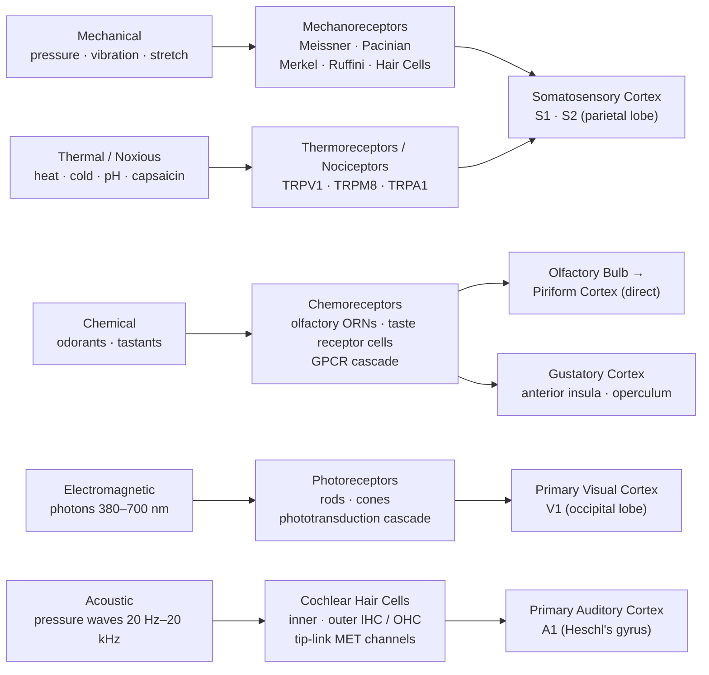

# 🔬 Sensory Systems and Transduction

> [!abstract] TL;DR
> Sensory transduction is the conversion of physical or chemical stimuli — mechanical force, photons, odorants, temperature — into graded electrical potentials that can drive action potentials in sensory neurons. Every sensory modality follows the same architectural plan: a specialized peripheral receptor encodes stimulus energy, a thalamic relay (or direct cortical projection in olfaction) filters and forwards the signal, and a dedicated cortical area constructs conscious perception. The receptor type, not the waveform of the signal, tells the brain what kind of stimulus it is — this is labeled line coding.

---

## Intuition — analogy FIRST

Think of each class of sensory receptor as a **specialized microphone tuned to a different frequency band**. A subwoofer picks up bass but ignores treble; a condenser microphone captures high-frequency transients that a dynamic microphone misses. No single microphone captures everything, and that is by design — specialization buys sensitivity. Transduction itself is the **analog-to-digital conversion stage**: a continuous physical variable (membrane deformation, photon flux, ligand concentration) is sampled and encoded as a train of discrete electrical pulses.

Just as a sound engineer adjusts the gain on a channel — turning it down when the band plays loudly so the board does not clip — sensory receptors perform **adaptation**: they continuously rescale their output to match the ambient level, maximizing sensitivity to *change* rather than absolute intensity. The result is that the nervous system is not a passive measuring instrument but an active, context-sensitive signal processor.

---

## How It Works

Transduction at the receptor membrane follows three main molecular strategies depending on stimulus modality:

1. **Mechanoreceptors** — Mechanical force directly gates stretch-activated or tip-link-gated ion channels. Membrane deformation physically tugs open the channel pore, allowing cation influx (Na⁺, K⁺, Ca²⁺), depolarizing the receptor ending and generating a **receptor potential**. No second-messenger cascade is needed, making mechanoreception the fastest sensory modality.

2. **Chemoreceptors (olfactory and gustatory)** — Odorant or tastant molecules bind to **G-protein-coupled receptors (GPCRs)**. The activated Gα subunit modulates effector enzymes (adenylyl cyclase for olfaction, phospholipase C for some taste qualities), producing second messengers (cAMP, IP₃) that open downstream ion channels. This adds a signal-amplification step: one GPCR molecule activates hundreds of G-proteins.

3. **Thermoreceptors and nociceptors** — **Transient Receptor Potential (TRP) channels** are intrinsically temperature-sensitive ion channels: their open probability changes steeply over a narrow temperature range. TRPV1 opens above ~43 °C; TRPM8 opens below ~25 °C. Capsaicin and menthol are exogenous ligands that hijack these channels, explaining why chili burns and mint cools.

In all cases the receptor potential, if sufficiently large, depolarizes the spike initiation zone (axon hillock or hemi-node) and triggers action potentials that propagate centrally.



---

## Key Concepts / Details

### Secondary Level

**The Sensory Modalities — beyond the classic five**

Humans possess at minimum nine functionally distinct sensory systems:

| Modality | Receptor Type | Primary Stimulus | Cortical Destination |
|----------|--------------|-----------------|----------------------|
| Touch / pressure | Mechanoreceptors (skin) | Mechanical deformation | S1 (SI) |
| Proprioception | Muscle spindles, Golgi tendon organs, joint receptors | Muscle length & tension | S1, cerebellum |
| Vestibular | Hair cells (otolith organs, semicircular canals) | Gravity, linear & angular acceleration | Vestibular cortex (parietal) |
| Vision | Rods and cones | Photons | V1 (occipital) |
| Hearing | Cochlear inner hair cells | Sound pressure waves | A1 (temporal) |
| Olfaction | Olfactory receptor neurons (ORNs) | Volatile chemicals | Piriform cortex (direct) |
| Gustation | Taste receptor cells (TRCs) | Dissolved chemicals | Anterior insula / operculum |
| Pain (nociception) | Free nerve endings (Aδ, C fibers) | Tissue-damaging stimuli | S1, ACC, insula |
| Thermoception | TRP-channel-expressing C fibers | Temperature | S1 |

**Receptor Potential**

When a stimulus depolarizes the receptor membrane, the resulting graded voltage change is called a *receptor potential* (or generator potential). It is:
- **Graded**: amplitude proportional to stimulus intensity (not all-or-none)
- **Local**: decrements with distance; does not propagate
- **Analog**: encodes stimulus magnitude continuously

If the receptor potential reaches threshold at the first Ranvier node (or axon hillock), it triggers an all-or-none **action potential** that propagates faithfully to the CNS. For many receptors (e.g., Pacinian corpuscle, cochlear hair cell) the receptor cell is a separate cell from the sensory neuron — receptor potential drives synaptic vesicle release at a ribbon synapse, which then depolarizes the afferent fiber.

**Sensory Threshold**

- **Absolute threshold**: the minimum stimulus intensity detected 50% of the time under ideal conditions.
- **Just Noticeable Difference (JND)**: the smallest detectable *change* in an ongoing stimulus.
- **Weber's Law**: $\Delta I / I = k$ (constant for a given modality). A heavier baseline weight requires a proportionally larger added weight to notice a difference.

**Adaptation: Fast vs Slow**

| Property | Fast-Adapting (Phasic) | Slow-Adapting (Tonic) |
|----------|----------------------|----------------------|
| Firing pattern | Burst at onset (and offset) only | Sustained firing throughout stimulus |
| Encodes | Change, velocity, vibration frequency | Sustained intensity, static position |
| Examples | Meissner (FA-1), Pacinian (FA-2), hair follicle | Merkel (SA-1), Ruffini (SA-2), muscle spindle Ia |
| Perceptual role | Detection of motion, flutter, texture | Grip force, skin stretch, posture |

Adaptation is receptor-level: channel inactivation, Ca²⁺-dependent feedback, and mechanical filtering by accessory structures (e.g., the onion-like lamellae of the Pacinian corpuscle filter out low-frequency components, making the corpuscle respond only to high-frequency vibration).

---

### Undergraduate Level

**The Four Cutaneous Mechanoreceptors**

All four primary mechanoreceptors in glabrous (hairless) skin terminate in specialized end organs that tune their frequency-response characteristics:

| Receptor | Adaptation | Receptive Field | Frequency Range | Percept |
|----------|-----------|----------------|----------------|---------|
| Meissner corpuscle (RA-1 / FA-1) | Fast | Small, sharp | 1–50 Hz | Flutter, light touch, braille reading |
| Pacinian corpuscle (RA-2 / FA-2) | Very fast | Large, diffuse | 100–300 Hz | High-frequency vibration, tool use feedback |
| Merkel disc (SA-1) | Slow | Small, sharp | 0.5–3 Hz | Sustained pressure, fine texture, form |
| Ruffini ending (SA-2) | Slow | Large, diffuse | — | Skin stretch, hand shape, finger position |

**Receptive Fields and Two-Point Discrimination**

A *receptive field* is the region of sensory epithelium that, when stimulated, changes the firing rate of a given sensory neuron. Smaller receptive fields allow finer spatial discrimination. Two-point discrimination thresholds vary inversely with receptor density:
- Fingertip: ~2 mm (densely innervated by Meissner and Merkel)
- Palm: ~15 mm
- Forearm: ~40 mm
- Back: ~60 mm

This is reflected in the **somatosensory homunculus**: fingers and lips occupy disproportionately large cortical areas because of their high innervation density.

**Lateral Inhibition — Contrast Enhancement**

When a stimulus activates a central receptor, that receptor's afferent fiber excites inhibitory interneurons that suppress activity in *adjacent* afferent channels. This **center-surround antagonism** sharpens the neural image of stimulus boundaries:
- The most-activated neuron fires maximally; its neighbors are partially silenced.
- At a transition between stimulated and unstimulated regions, the inhibition gradient creates an **illusory edge response** — neurons just inside the high-activity zone are suppressed less by the high-activity side than neurons inside the low-activity zone.
- Perceptual consequence: **Mach bands** at luminance edges in vision; enhanced edge detection in touch (two-point discrimination).

**Olfactory GPCR Cascade**

1. Volatile odorant binds **olfactory receptor (OR)** — a Class A GPCR; ~400 functional OR genes in humans, the largest gene family.
2. Gα_olf activates **adenylyl cyclase III (ACIII)** → ↑ cAMP.
3. cAMP opens **cyclic nucleotide-gated (CNG) channels** → Na⁺ and Ca²⁺ influx → depolarization.
4. Ca²⁺ opens **Ca²⁺-activated Cl⁻ channels** → further depolarization (signal amplification).
5. Ca²⁺-calmodulin feedback adapts the CNG channel (homologous desensitization).

Each ORN expresses only **one OR gene** (the "one receptor — one neuron" rule). All ORNs expressing the same OR converge on the **same glomerulus** in the olfactory bulb — creating a chemotopic map from which mitral cells transmit to piriform cortex.

**Gustatory Receptor Types**

| Taste Quality | Transduction Mechanism | Key Molecules |
|--------------|----------------------|--------------|
| Sweet | GPCR (T1R2/T1R3) → Gα_gustducin → PLCβ2 → IP₃ → Ca²⁺ | T1R2/T1R3, TRPM5 |
| Umami | GPCR (T1R1/T1R3) — same cascade | T1R1/T1R3 |
| Bitter | GPCR (T2R family, ~25 genes) — same downstream cascade | T2Rs, TRPM5 |
| Sour | H⁺ directly inhibits K⁺ channels; OTOP1 proton channel | Otopetrin-1, K2P channels |
| Salty | Direct Na⁺ entry via amiloride-sensitive ENaC channels | ENaC |

**Vestibular Hair Cells**

Type I and II hair cells in the utricle, saccule, and semicircular canal cristae bear a bundle of **stereocilia** graduated in height. Tip links (cadherin-23 / protocadherin-15 heterodimers) physically connect adjacent stereocilia to **MET (mechanoelectrical transduction) channels** at the tips. Bundle deflection toward the tallest stereocilium (kinocilium direction) stretches tip links → MET channels open → K⁺ (from high-K⁺ endolymph) and Ca²⁺ enter → depolarization → glutamate release onto VIIIth nerve. Deflection in the opposite direction closes channels → hyperpolarization → reduced glutamate release. This bidirectional modulation allows encoding of both direction and magnitude of head movement.

---

### Graduate Level

**Population Coding in Sensory Cortex**

No single cortical neuron uniquely encodes a stimulus attribute. Neurons in primary sensory cortex have **broad tuning curves** that overlap substantially. A stimulus is represented by the *pattern of activity across the population* — the **population vector**. This coding scheme provides:
- Redundancy and fault tolerance
- Smooth interpolation between discrete preferred stimuli
- Higher resolution than any single unit's tuning curve

In S1, both rate coding (mean firing frequency encodes stimulus intensity) and temporal coding (precise spike timing encodes fine texture) contribute. Rapidly oscillating local field potentials (gamma band, ~40–80 Hz) reflect synchronized population activity and may coordinate binding of stimulus features across cortical columns.

**Multisensory Integration — Superior Colliculus**

The **superior colliculus (SC)** contains topographically aligned visual, auditory, and somatosensory maps in its deep layers. Multisensory neurons obey the **inverse effectiveness principle**: the weaker each unimodal input, the greater the proportional enhancement when inputs are combined. Rules for integration:
1. **Spatial congruence**: stimuli must come from the same location to be combined (otherwise responses can be suppressed).
2. **Temporal coincidence**: stimuli must be near-simultaneous (~100–200 ms window).
3. **Semantic congruence** (especially for audiovisual): lip movement must match phoneme (McGurk effect when violated).

The SC projects to thalamus (pulvinar) and brainstem motor nuclei, orienting the eyes and head toward salient multisensory events.

**Sensory Gating and Attention Modulation**

The **thalamic reticular nucleus (TRN)** — a GABAergic shell surrounding the thalamus — acts as an attentional gate. Corticothalamic feedback from prefrontal cortex selectively inhibits TRN neurons representing unattended locations or modalities, thereby disinhibiting the corresponding thalamic relay nuclei and amplifying attended signals. Consequence: attentional modulation is visible as early as 50–70 ms after stimulus onset in evoked potential recordings (the P1/N1 complex) — far earlier than was expected if attention operated only at high cortical levels.

**TRP Channel Pharmacology**

| Channel | Activators | Temperature Threshold | Pharmacology |
|---------|-----------|----------------------|-------------|
| TRPV1 | Capsaicin, >43 °C, H⁺ (pH <6), endocannabinoids (anandamide), ethanol | >43 °C (heat pain) | Capsazepine (competitive antagonist); resiniferatoxin (ultra-potent agonist → desensitization); AMG9810 (clinical analgesic candidate) |
| TRPV2 | >52 °C, mechanical stretch, cannabinoids | >52 °C | Less pharmacologically targeted |
| TRPM8 | Menthol, icilin, <25 °C | <25 °C (cool) | WS-12 (selective agonist); AMG2850 (antagonist in development for pain) |
| TRPA1 | Allyl isothiocyanate (mustard oil, wasabi), acrolein, cold (<17 °C) | <17 °C (noxious cold) | AP18, HC-030031 (antagonists); implicated in inflammatory hyperalgesia |

Prolonged agonist exposure desensitizes TRPV1 via Ca²⁺-dependent calcineurin dephosphorylation and receptor internalization — the mechanism behind topical capsaicin analgesia for neuropathic pain.

**Somatosensory Cortex Plasticity and Phantom Limb**

Cortical somatotopic maps are not hardwired; they undergo **use-dependent plasticity** throughout life. Following limb amputation, input from the deafferented cortical territory ceases. Adjacent cortical areas (representing the face and shoulder) expand into this territory over weeks to months, driven by:
- Unmasking of latent horizontal connections (fast, hours)
- Axon sprouting of thalamocortical fibers (slow, weeks–months)
- LTP-like synaptic potentiation

The invasion of face-area axons into the hand cortex is thought to underlie **referred sensations** (touching the face evokes sensations perceived as coming from the phantom hand — Ramachandran's mirror box experiments). Chronic phantom limb pain may reflect a mismatch between motor efference and expected sensory feedback, which can be partially resolved by visual feedback therapy.

**Olfactory Map in Piriform Cortex**

Unlike every other sensory modality, the olfactory system does **not relay through thalamus** before reaching cortex. The projection is: ORN → olfactory bulb (mitral cells) → **anterior olfactory nucleus + piriform cortex** (via the lateral olfactory tract) → orbitofrontal cortex, amygdala, entorhinal cortex. Piriform cortex lacks the strict topographic organization of V1 or A1; it uses **combinatorial ensemble coding**: each odor activates a distributed pattern across many piriform neurons, and odor identity is decoded from the correlation structure of that pattern. This is consistent with the ~400 × ~400 combinatorial space of human OR pairs and the perceptual ability to distinguish ~1 trillion distinct odors.

---

## Python Demo

The following simulation shows how a center-surround inhibitory network produces **Mach band-like edge enhancement** from a uniform step-edge stimulus — the same computation performed by retinal ganglion cells and somatosensory cortical columns to sharpen stimulus boundaries.

```python
import numpy as np
import matplotlib.pyplot as plt

np.random.seed(0)

n_receptors = 120

# Input: step-edge stimulus (left half bright, right half dimmer)
stimulus = np.zeros(n_receptors)
stimulus[:60] = 1.0
stimulus[60:] = 0.5

def lateral_inhibition(signal, inhibition_weight=0.30, half_width=4):
    """
    Simulate center-surround lateral inhibition.
    Each unit excites itself and inhibits its neighbors
    in proportion to their activation.
    """
    n = len(signal)
    output = np.zeros(n)
    for i in range(n):
        lo = max(0, i - half_width)
        hi = min(n, i + half_width + 1)
        neighbor_indices = [j for j in range(lo, hi) if j != i]
        surround_mean = np.mean(signal[neighbor_indices]) if neighbor_indices else 0.0
        output[i] = signal[i] - inhibition_weight * surround_mean
    return np.clip(output, 0, None)

# Apply lateral inhibition
response = lateral_inhibition(stimulus)

# Plot comparison
fig, axes = plt.subplots(2, 1, figsize=(10, 6), sharex=True)

axes[0].fill_between(range(n_receptors), stimulus, alpha=0.4, color='steelblue')
axes[0].plot(stimulus, color='steelblue', linewidth=2, label='Raw stimulus')
axes[0].axvline(60, color='gray', linestyle='--', alpha=0.7, label='Edge location')
axes[0].set_title('Input Stimulus (step edge at position 60)', fontsize=12)
axes[0].set_ylabel('Stimulus Intensity')
axes[0].legend()
axes[0].set_ylim(-0.05, 1.2)

axes[1].fill_between(range(n_receptors), response, alpha=0.4, color='tomato')
axes[1].plot(response, color='tomato', linewidth=2, label='After lateral inhibition')
axes[1].axvline(60, color='gray', linestyle='--', alpha=0.7, label='Edge location')
axes[1].set_title('Neural Response After Lateral Inhibition (Mach Band Effect)', fontsize=12)
axes[1].set_ylabel('Neural Response (a.u.)')
axes[1].set_xlabel('Receptor Position')
axes[1].legend()

plt.tight_layout()
plt.savefig('lateral_inhibition_demo.png', dpi=150)
plt.show()

# Print where Mach bands appear
peak_idx = np.argmax(response[:60])
trough_idx = np.argmin(response[60:]) + 60
print(f"Response peak (bright side overshoot) at receptor {peak_idx}: {response[peak_idx]:.3f}")
print(f"Response trough (dark side undershoot) at receptor {trough_idx}: {response[trough_idx]:.3f}")
print(f"Raw stimulus values there: {stimulus[peak_idx]:.1f} and {stimulus[trough_idx]:.1f}")
```

Running this produces a clear overshoot just inside the bright side and an undershoot just inside the dim side — the neural correlate of the perceptual Mach band illusion. The uniform stimulus is encoded as a contrast-enhanced version, directing attention to boundaries rather than wasting dynamic range on flat regions.

---

## Real-World Applications

**Touch prosthetics and sensory feedback in BCI**
Bidirectional brain-computer interfaces (e.g., the BrainGate system combined with intracortical microstimulation) can evoke tactile percepts by electrically stimulating S1 at appropriate current levels. Encoding stimulus quality (texture, pressure) via spatiotemporal patterns of microstimulation remains an active research challenge, with population coding models guiding electrode array designs.

**Cochlear implants**
Cochlear implants bypass 3,500 destroyed inner hair cells by directly stimulating the 8th-nerve spiral ganglion via ~22 electrode contacts placed along the cochlea's tonotopic gradient. Pitch is encoded by which electrode fires (place code), and timing cues encode fine structure for voice pitch and music. Current devices achieve >80% speech intelligibility in quiet but struggle in noise — a limitation tied to the coarse frequency resolution of 22 channels versus ~3,500 IHC positions.

**Olfactory dysfunction and COVID-19**
SARS-CoV-2 infects **sustentacular (supporting) cells** in the olfactory epithelium (which express ACE2 and TMPRSS2), not ORNs directly. The resulting inflammation and supporting-cell death disrupts the metabolic microenvironment on which ORNs depend, causing anosmia. Regeneration of ORNs from basal stem cells restores function in most patients within weeks, but parosmia (distorted smell) can persist for months, likely reflecting mistargeted ORN axon regrowth in the olfactory bulb.

**Pain pharmacology — TRP channel blockers**
TRPV1 antagonists showed early promise as non-opioid analgesics but most caused hyperthermia (body temperature regulation involves TRPV1 in the preoptic area) — a major on-target side effect. Peripherally-restricted TRPV1 antagonists and selective TRPA1 blockers are in clinical trials for osteoarthritis and neuropathic pain as of 2025. Topical capsaicin 8% patches (Qutenza) work by paradoxically desensitizing TRPV1-expressing C-fibers.

**Sensory substitution devices**
The BrainPort V100 device converts a camera image into a 20×20 grid of electrotactile pulses delivered to the tongue. After ~10 hours of training, congenitally blind users can detect shapes, read large letters, and navigate obstacles. This demonstrates that the brain can interpret an unfamiliar sensory input channel if it carries spatially structured information — a striking example of cross-modal cortical plasticity.

---

## Common Pitfalls

- **Adaptation is not fatigue** — Adaptation is a stimulus-specific, actively regulated reduction in sensitivity (involving Ca²⁺-calmodulin feedback on ion channels, phosphorylation states, and accessory structure filtering). Fatigue is a non-specific cellular energy depletion. Dark-adapted photoreceptors become more sensitive — the opposite of fatigue — because bleached rhodopsin is regenerated via the retinal pigment epithelium.

- **Labeled line coding is not the only scheme** — The labeled line principle (modality = which fiber fires) is correct at a coarse level, but it cannot explain fine discrimination within a modality. Olfactory identity, auditory pitch (for complex tones), and tactile texture are all encoded by **temporal patterns and population vectors** that carry information far beyond which neuron is active.

- **"Five senses" is an oversimplification** — The classic Aristotelian five (vision, hearing, touch, smell, taste) omit proprioception, vestibular sense, nociception, thermoception, interoception (visceral sensations), hunger, thirst, and possibly magnetoreception. Clinically, isolating which modality is impaired requires testing these separately; a patient with normal "touch" may have lost proprioception entirely (sensory ataxia, as in large-fiber neuropathy).

- **Receptor potential ≠ action potential** — Receptor potentials are graded and local; they fail to propagate beyond a millimeter. Only when the summed receptor potential crosses threshold at the spike initiation zone (first Ranvier node for encapsulated receptors) is an action potential generated. Suprathreshold receptor potentials do not produce larger action potentials — only higher firing frequencies.

- **Olfaction bypasses the thalamus** — Every other sensory modality has a mandatory thalamic relay before reaching cortex (VPLc for somatosensory, MGN for auditory, LGN for visual). Olfactory signals project directly from the olfactory bulb to the piriform cortex, amygdala, and entorhinal cortex via the lateral olfactory tract. This direct limbic access is thought to underlie the unusually strong emotional and memory associations of odors (Proust effect).

---

## Related Concepts

- [[_MOC_Systems_Neuroscience|↑ Systems Neuroscience MOC]] — section map; start here to orient across all sensory, motor, and autonomic notes in this section
- [[Visual_System_and_Visual_Cortex]] — the complete transduction-to-perception pathway for vision, including phototransduction, retinal processing, LGN, V1 orientation columns, and ventral/dorsal streams
- [[Auditory_System_and_Sound_Processing]] — cochlear mechanics and tonotopy, hair cell transduction, auditory brainstem nuclei, A1 spectrotemporal processing, and pitch/speech coding
- [[Pain_and_Nociception]] — Aδ and C-fiber nociceptors, spinal cord gate control theory, ascending pain pathways (spinothalamic tract), descending modulation, and chronic pain mechanisms
- [[Spinal_Cord_and_Peripheral_Nervous_System]] — dorsal horn circuitry, sensory fiber classification (Aβ/Aδ/C), dorsal column-medial lemniscal pathway vs spinothalamic tract, and peripheral neuropathy
- [[Neural_Coding_and_Spike_Trains]] — rate coding, temporal coding, population coding, mutual information, and decoding methods that apply to all sensory systems at the cortical level

---

## Review Questions

1. **Secondary**: A Pacinian corpuscle and a Merkel disc are both activated by pressing a finger onto a rough surface. Predict the firing pattern of each over a 2-second sustained press, and explain which one is better suited to detecting the moment you pick up a vibrating phone.

2. **Undergraduate**: A patient presents with loss of two-point discrimination and fine texture perception on the fingertips, but intact vibration sense and crude pressure sensation. (a) Which mechanoreceptor type(s) are most likely impaired? (b) Which peripheral nerve fiber types are affected? (c) Which ascending spinal pathway carries each of these submodalities, and where in the CNS would you predict a lesion?

3. **Graduate**: Cortical reorganization following upper-limb amputation has been proposed to cause referred sensations and phantom limb pain. (a) Describe the cellular and synaptic mechanisms that could produce rapid (<24 h) versus slow (weeks) cortical map reorganization. (b) How does the inverse effectiveness principle of multisensory integration in the superior colliculus relate to sensory substitution devices such as the BrainPort? (c) What prediction does population coding theory make about the minimum number of microstimulation electrodes needed to evoke a perceptually distinct tactile texture in S1?

---

## Sources

- Bear MF, Connors BW, Paradiso MA — *Neuroscience: Exploring the Brain*, 4th ed. (2015), Chs. 12–14
- Kandel ER, Schwartz JH, Jessell TM, Siegelbaum SA, Hudspeth AJ — *Principles of Neural Science*, 6th ed. (2021), Unit IV (Chs. 21–32)
- Julius D, Basbaum AI — "Molecular mechanisms of nociception." *Nature* 413, 203–210 (2001)
- Mountcastle VB — "The columnar organization of the neocortex." *Brain* 120, 701–722 (1997)
- Ramachandran VS, Hirstein W — "The perception of phantom limbs: the D.O. Hebb lecture." *Brain* 121, 1603–1630 (1998)

---

#Neuroscience #SystemsNeuroscience #SensorySystems #Transduction
