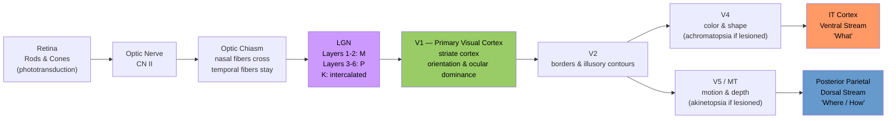

# Visual System and Visual Cortex

> [!abstract] TL;DR
> The visual system converts light into conscious perception through a 12-stage hierarchy: photoreceptors transduce photons into electrical signals, the thalamus relays and filters them, and the cortex decomposes them into orientation, color, motion, and identity across dozens of specialized areas. The system splits into a ventral "what" stream for object recognition and a dorsal "where/how" stream for spatial action, with each stage adding abstraction. Understanding this pathway underpins everything from clinical lesion diagnosis to the design of convolutional neural networks.

---

## Intuition

**Analogy:** Think of the eye as a digital camera system where the retina is the image sensor, the optic nerve is the USB cable, the lateral geniculate nucleus (LGN) is a hardware preprocessor that filters and gates the signal, V1 is raw feature-extraction firmware detecting edges and gratings, and higher cortical areas are the operating system's object-recognition software recognizing faces, scenes, and motion.

Just as a camera sensor does not "see" — it only counts photons per pixel — the retina does not perceive. Perception is constructed upstream, and every stage discards irrelevant information and amplifies the signal that matters for behavior. The firmware analogy is precise: damage to V1 (the firmware) leaves the camera functional but the object recognition software blind to an entire quadrant of the screen.

---

## How It Works

### Phototransduction: From Photons to Action Potentials

The conversion of light to a neural signal happens in five tightly coupled steps inside photoreceptor outer segments:

1. **Absorption.** A photon isomerizes 11-*cis*-retinal to all-*trans*-retinal, activating **rhodopsin** (rods) or **cone opsin**.
2. **G-protein cascade.** Activated opsin couples to **transducin** (G_t), which activates **phosphodiesterase (PDE)**.
3. **cGMP hydrolysis.** PDE cleaves cyclic GMP to 5′-GMP, rapidly lowering cytoplasmic cGMP concentration.
4. **Channel closure and hyperpolarization.** In the dark, high cGMP held Na⁺/Ca²⁺ channels open (the "dark current," ~40 pA), keeping the photoreceptor depolarized (~−40 mV). Falling cGMP closes these channels; the cell hyperpolarizes to ~−70 mV.
5. **Disinhibition of downstream cells.** Hyperpolarized photoreceptors reduce glutamate release onto bipolar cells. **On-center bipolar cells** (expressing metabotropic mGluR6) interpret reduced glutamate as a disinhibitory signal and depolarize. **Off-center bipolar cells** (ionotropic AMPA receptors) hyperpolarize. Bipolar cells drive **retinal ganglion cells**, whose axons form the optic nerve and fire action potentials.

### Retinotopy

Every area from retina to V1 and beyond preserves a topographic map of visual space. The fovea (central 1–2° of the visual field) has the highest cone density and is dramatically over-represented in cortex — roughly 25% of V1 processes the central 5% of visual angle. This **cortical magnification factor** is why reading requires foveal fixation and why peripheral processing is coarse.

### Visual Pathway

The complete relay: **Retina → Optic Nerve (CN II) → Optic Chiasm → Optic Tract → LGN (thalamus) → Optic Radiation → V1 → V2 → V4/V5-MT → Ventral or Dorsal Stream**



---

## Key Concepts

### Secondary Level

**Rods vs Cones**

| Property | Rods (~120 million) | Cones (~6 million) |
|---|---|---|
| Location | Peripheral retina | Fovea (concentrated) |
| Photopigment | Rhodopsin (single type) | S, M, L opsins (3 types) |
| Sensitivity | Very high (single photon) | Low (requires bright light) |
| Acuity | Low | High |
| Function | Scotopic (night) vision | Photopic vision, color |
| Convergence | High (many → 1 ganglion) | Low (1:1 in fovea) |

**Optic Nerve and Chiasm**

The ~1.2 million retinal ganglion cell axons bundle into the optic nerve. At the **optic chiasm**, axons from the nasal half of each retina cross to the contralateral hemisphere; axons from the temporal half stay ipsilateral. The result: the **left visual hemifield** (information arriving on the temporal retina of the right eye and nasal retina of the left eye) is processed entirely by the **right hemisphere**, and vice versa. Partial chiasm lesions produce characteristic visual field deficits used to localize pituitary tumors.

**Visual Fields and Hemianopia**

- Retinal lesion → monocular scotoma (one eye only)
- Optic nerve lesion → monocular blindness
- Chiasm midline lesion (e.g., pituitary macroadenoma) → **bitemporal hemianopia** (tunnel vision)
- Optic tract / LGN / optic radiation lesion → **contralateral homonymous hemianopia**
- V1 lesion → homonymous hemianopia often with **macular sparing** (dual blood supply)

**V1 in the Occipital Lobe**

V1 (Brodmann area 17, striate cortex) lies along the calcarine sulcus of the medial occipital lobe. The lower visual field maps to the upper bank, the upper field to the lower bank. V1 receives the first cortical input from the visual thalamus (LGN), and its output drives all subsequent visual processing.

**Color and Motion Processing**

Color perception begins with the three cone types (S, M, L) and is encoded as opponent signals (L−M = red-green; S−(L+M) = blue-yellow) in the retina and LGN. Motion is detected by direction-selective ganglion cells and elaborated in area V5/MT, which contains neurons tuned to direction and speed of moving stimuli.

---

### Undergraduate Level

**Center-Surround Retinal Ganglion Cells**

Retinal ganglion cells have concentric antagonistic receptive fields. **On-center / off-surround** cells fire maximally to a small bright spot on a dark background; **off-center / on-surround** cells respond to small dark spots. This arrangement, implemented by bipolar and horizontal cells, performs spatial contrast enhancement (lateral inhibition) — the neural substrate of the Mach band illusion. The center-surround mechanism is effectively a difference-of-Gaussians spatial filter.

**M / P / K Pathways Through LGN**

The primate LGN has six layers and three functionally distinct parallel channels:

| Channel | Layers | Cell size | Properties |
|---|---|---|---|
| Magnocellular (M) | 1–2 | Large | Fast, transient, high contrast sensitivity, achromatic, motion/depth |
| Parvocellular (P) | 3–6 | Small | Slow, sustained, color-opponent (L-M), fine spatial detail |
| Koniocellular (K) | Intercalated | Tiny | Blue-yellow (S-ON), project to V1 layers 2/3 cytochrome oxidase blobs |

**Retinotopic Map in V1 and Cortical Magnification**

V1 is the most precisely retinotopic area in the brain. The central 10° of visual field occupies roughly half of V1's surface area (~15 cm²). The cortical magnification factor M(e) ≈ (7.99 + 0.14e)⁻¹ mm per degree (e = eccentricity in degrees). This is why crowding — the interference of flanking objects — increases with eccentricity.

**Simple and Complex Cells (Hubel and Wiesel, 1959)**

David Hubel and Torsten Wiesel (Nobel Prize 1981) discovered two principal cell types in V1:

- **Simple cells:** Linear spatial summation; have elongated on- and off-subregions; fire to a bar or edge at a **specific orientation** in a **specific retinal position**. Their responses are well modeled by Gabor filters (see Python Demo).
- **Complex cells:** Orientation selective but **position invariant** — fire to an oriented edge anywhere within a broader receptive field. Classically explained as pooling over many simple cells (energy model).
- **End-stopped / hypercomplex cells:** Also selective for **length** — respond to short bars but are inhibited by long bars. Critical for detecting corners and terminators.

**Ocular Dominance and Orientation Columns**

V1 is organized into functional columns perpendicular to the cortical surface:

- **Ocular dominance columns:** ~0.5 mm wide alternating bands, each preferring input from one eye. Disrupting normal binocular input during the **critical period** (≈ 6 months–6 years in humans) causes permanent ocular dominance shift — the mechanism of **amblyopia** ("lazy eye").
- **Orientation columns:** Preferred orientation rotates continuously by ~180° every ~0.75 mm (a "hypercolumn"). Occasional "pinwheel" singularities where all orientations converge.
- **Cytochrome oxidase blobs:** Periodic regions in layers 2/3 with high metabolic activity; connected to K-cells; process color (wavelength) independently of orientation.

**Color Opponency**

Hering's opponent-color theory (1878) was vindicated at the cellular level. Ganglion cells compare cone outputs:
- **Red-green opponency:** L-cone vs M-cone (midget system, P pathway) → perceive redness and greenness
- **Blue-yellow opponency:** S-cone vs (L+M) (bistratified system, K pathway) → perceive blueness and yellowness

Color constancy (the stability of perceived color under different illuminants) is a cortical computation performed mainly in **V4**, involving comparisons across spatial regions of the image.

---

### Graduate Level

**Ventral Stream: "What" Pathway**

V1 → V2 → V4 → TEO → **IT cortex (inferotemporal cortex)**

- **V4:** Selective for color, curvature, and intermediate shape complexity. Bilateral V4 lesions cause **cerebral achromatopsia** (loss of color perception with intact wavelength discrimination) and loss of shape constancy.
- **IT cortex (TE/TEO):** Contains neurons with extremely large receptive fields (up to entire visual field), selective for complex objects, faces, and body parts. Represents objects in a high-dimensional feature space tolerant of size, position, and rotation transformations.
- **Fusiform Face Area (FFA):** Region in the right fusiform gyrus disproportionately active for faces. Damage causes **prosopagnosia** — inability to recognize familiar faces (including one's own reflection) while object recognition and emotion detection from faces remain intact. Debate continues over whether FFA is face-specific (domain specificity) or expertise-dependent (domain generality).

**Dorsal Stream: "Where/How" Pathway**

V1 → V2 → V5/MT → MST → **Posterior parietal cortex (PPC)**

- **V5/MT:** Direction-selective neurons encoding speed and direction of motion; receives dominant M-pathway input. Bilateral MT lesions cause **akinetopsia** (Zihl's patient): static perception of a moving world — pouring water appears frozen, faces mid-conversation appear as strobed stills.
- **MST (medial superior temporal):** Processes optic flow (the global pattern of visual motion during self-movement); central to heading perception and figure-ground separation.
- **Parietal cortex (LIP, VIP, AIP):** Encodes spatial location, coordinates visually-guided reaching and grasping (visuomotor transformation). Damage → **hemispatial neglect** (contralateral space ignored), **optic ataxia** (misreaching under visual guidance), **Balint's syndrome**.

**Feedforward vs Recurrent Connections**

The canonical view of the visual system as a purely feedforward hierarchy is an oversimplification. In primate cortex:

- **Feedforward:** Layer 4 → layers 2/3 → layer 5/6 → next area. Drives initial fast response (~45–90 ms to IT). Sufficient for coarse categorization.
- **Feedback/recurrent:** Higher areas project massively back to lower areas (feedback connections outnumber feedforward in terms of synapse count). Feedback arrives 50–100 ms later and modulates responses based on context, attention, and task demands.
- **Lateral connections within V1:** ~6 mm horizontal connections link columns with similar orientation preferences — the substrate of contour integration (collinear facilitation).

**Predictive Coding in Visual Cortex**

Rao and Ballard (1999) proposed that the visual hierarchy implements **predictive coding**: each level sends its **prediction** (top-down) to the level below, and the level below sends back only the **prediction error** (what was not predicted). Under this framework:

- Feedback connections carry predictions (expected features)
- Feedforward connections carry residual errors (surprise)
- Neural responses in V1 are suppressed by stimuli that match top-down predictions (repetition suppression, mismatch negativity)
- Attention amplifies prediction errors for behaviorally relevant stimuli

This framework unifies suppression effects, attentional modulation, and hallucinations within a single computational principle.

**Deep Learning CNNs as Models of Visual Cortex**

Convolutional neural networks (CNNs) were inspired by, and have converged with, models of the visual system:

- **Layer 1 conv filters** trained on natural images spontaneously develop Gabor-like filters matching V1 simple cells (Olshausen & Field 1996; LeCun et al.)
- **Layer 2–3 filters** resemble V2 and V4 texture/color tuning
- Yamins & DiCarlo (2014) showed that CNN layer representations predict neural responses in V4 and IT cortex with r² > 0.5
- The **energy model** of complex cells is formally equivalent to a CNN layer with learned pooling
- Deep CNNs now serve as **encoder models** in neural system identification, used to map which CNN neurons best predict individual V1/V4/IT neurons across thousands of images

However, CNNs fail to replicate: recurrent dynamics, robustness to adversarial perturbations, few-shot generalization, and attention-dependent suppression — all features of biological visual cortex that likely require feedback connections.

**Blindsight**

After complete V1 destruction (striate cortex), patients report total blindness in the contralateral visual field (a scotoma). However, they can still detect the location, motion direction, and emotion of stimuli presented in the blind field when forced to guess — without any conscious awareness. This **blindsight** (Weiskrantz 1974) is mediated by an alternative pathway: **retina → superior colliculus → pulvinar → MT/V5**, bypassing V1 entirely. It demonstrates that conscious visual awareness, unlike unconscious visual guidance, is V1-dependent.

---

## Python Demo

Simulate a bank of V1 simple and complex cell Gabor filters. The orientation tuning curve peaks at the grating's orientation, reproducing the hallmark selectivity Hubel and Wiesel recorded in cat striate cortex.

```python
import numpy as np
import matplotlib.pyplot as plt
from scipy.signal import fftconvolve

def gabor_kernel(size, wavelength, orientation_deg, sigma=3.0, gamma=0.5, phase=0.0):
    """
    2D Gabor filter kernel — model of a V1 simple cell receptive field.
    Args:
        size            : kernel side length in pixels (odd integer)
        wavelength      : sinusoidal carrier wavelength (pixels/cycle)
        orientation_deg : preferred orientation in degrees
        sigma           : Gaussian envelope half-width
        gamma           : spatial aspect ratio (elongation)
        phase           : carrier phase (0 = symmetric even, pi/2 = odd)
    Returns:
        2D numpy array of shape (size, size)
    """
    half = size // 2
    x = np.arange(-half, half + 1, dtype=float)
    X, Y = np.meshgrid(x, x)
    theta = np.deg2rad(orientation_deg)
    Xr =  X * np.cos(theta) + Y * np.sin(theta)
    Yr = -X * np.sin(theta) + Y * np.cos(theta)
    envelope = np.exp(-(Xr**2 + (gamma * Yr)**2) / (2 * sigma**2))
    carrier  = np.cos(2 * np.pi * Xr / wavelength + phase)
    return envelope * carrier

# --- Build a 45-degree sine grating (the "image") ---
img_size = 128
x = np.linspace(-np.pi, np.pi, img_size)
X, Y = np.meshgrid(x, x)
img = 0.5 * (1 + np.sin(4 * (X + Y)))   # diagonal stripes at 45 degrees

# --- Apply Gabor filters at four cardinal + diagonal orientations ---
orientations = [0, 45, 90, 135]
kernel_size  = 21

fig, axes = plt.subplots(3, 4, figsize=(14, 9))

for col, angle in enumerate(orientations):
    even_k = gabor_kernel(kernel_size, wavelength=8, orientation_deg=angle)
    odd_k  = gabor_kernel(kernel_size, wavelength=8, orientation_deg=angle, phase=np.pi / 2)
    # Simple cell (even-phase) response
    even_resp = fftconvolve(img - img.mean(), even_k, mode='same')
    # Complex cell energy = sqrt(even^2 + odd^2)  [Adelson & Bergen 1985]
    odd_resp  = fftconvolve(img - img.mean(), odd_k,  mode='same')
    energy    = np.sqrt(even_resp**2 + odd_resp**2)

    axes[0, col].imshow(even_k, cmap='RdBu_r', vmin=-1, vmax=1)
    axes[0, col].set_title(f'Gabor kernel {angle}°', fontsize=9)
    axes[0, col].axis('off')

    axes[1, col].imshow(img, cmap='gray')
    axes[1, col].set_title('Input (45° grating)', fontsize=9)
    axes[1, col].axis('off')

    axes[2, col].imshow(energy, cmap='hot')
    axes[2, col].set_title(f'Complex-cell energy {angle}°', fontsize=9)
    axes[2, col].axis('off')

fig.suptitle(
    'V1 Gabor Filters — Orientation Selectivity\n'
    'Row 1: filter kernels  |  Row 2: input image  |  Row 3: complex-cell energy response',
    fontsize=11
)
plt.tight_layout()
plt.show()

# --- Orientation tuning curve: should peak at 45 degrees ---
angles_fine = np.arange(0, 180, 5)
mean_energy = []
for angle in angles_fine:
    ev = fftconvolve(img - img.mean(),
                     gabor_kernel(kernel_size, 8, angle), mode='same')
    od = fftconvolve(img - img.mean(),
                     gabor_kernel(kernel_size, 8, angle, phase=np.pi / 2), mode='same')
    mean_energy.append(float(np.mean(np.sqrt(ev**2 + od**2))))

fig2, ax = plt.subplots(figsize=(6, 4))
ax.plot(angles_fine, mean_energy, lw=2.5, color='steelblue')
ax.axvline(45, color='red', linestyle='--', label='True grating orientation (45°)')
ax.set_xlabel('Filter orientation (degrees)')
ax.set_ylabel('Mean energy response (a.u.)')
ax.set_title('Orientation Tuning Curve — V1 Complex Cell Model')
ax.legend()
ax.grid(alpha=0.3)
plt.tight_layout()
plt.show()
# Expected output: sharp peak near 45°, half-width ~20-30° (matches physiology)
```

**What the code shows:** The energy response is highest for the filter whose orientation matches the input grating (45°). The tuning half-bandwidth of ~25° reproduces the physiological measurements of Hubel and Wiesel. The "complex cell" energy model squares and sums quadrature-phase simple cells, achieving phase invariance — a property real complex cells exhibit and CNNs replicate with max-pooling.

---

## Real-World Applications

**1. Visual Field Deficits and Lesion Localization**
The pathway's strict retinotopic organization is a diagnostic tool: the pattern of visual field loss (monocular, bitemporal, homonymous quadrantanopia, hemianopia, macular sparing) pinpoints the lesion to within centimeters along the optic pathway. This is one of the most powerful localizing signs in clinical neurology.

**2. Amblyopia and the Critical Period**
Amblyopia ("lazy eye", ~3% prevalence) results from abnormal binocular experience during the critical period. Monocular deprivation causes the deprived eye's ocular dominance columns to shrink and the open eye's to expand — irreversibly, after the critical period closes. The treatment — patching the strong eye to force the weak eye's columns to recover — only works before age ~7–8. This is the canonical example of **experience-dependent synaptic plasticity** with a hard developmental deadline.

**3. Convolutional Neural Networks**
AlexNet (2012) and its successors were designed with explicit reference to the visual cortex hierarchy: local receptive fields (V1 simple cells), pooling (complex cells), and increasing feature abstraction (V2/V4/IT progression). Training on ImageNet spontaneously produces Gabor-like filters in layer 1, color-opponent cells in layer 2, and texture detectors in layer 3 — an independent confirmation that the visual cortex architecture is near-optimal for natural image statistics.

**4. Retinal Prosthetics (Bionic Eye)**
Devices such as the Argus II implant a microelectrode array on the epiretinal surface, bypassing damaged photoreceptors and stimulating surviving retinal ganglion cells electrically. Second-generation subretinal implants (Alpha AMS) target the photoreceptor layer. Current limitations: spatial resolution is ~1500 electrodes vs. ~1.2 million retinal ganglion cells; phosphene perceptions are coarse. Research on cortical implants (Orion V1 cortical stimulator) bypasses the retina entirely.

**5. Agnosias**
Selective cortical lesions dissociate visual capacities:
- **Visual object agnosia** (IT lesion): cannot recognize objects from vision alone despite intact acuity
- **Prosopagnosia** (right FFA / right anterior temporal lesion): face-specific recognition failure
- **Akinetopsia** (V5/MT bilateral lesion): motion blindness — the world is a series of frozen frames
- **Cerebral achromatopsia** (V4/V8 bilateral lesion): world appears in shades of grey, though wavelength discrimination at threshold is often intact

---

## Common Pitfalls

- **Optic chiasm crossing rule.** Nasal (not temporal) retinal fibers cross. Because the lens inverts the image, nasal retina receives light from the temporal visual field. A chiasm lesion therefore knocks out the temporal visual fields of both eyes — **bitemporal hemianopia** — not the nasal fields. Students frequently invert this.

- **V1 lesion causes blindsight, not total blindness.** After complete striate cortex destruction, patients have no conscious perception in the contralateral hemifield, but retain unconscious visual guidance (target localization, motion detection) via the superior colliculus → pulvinar → MT route. Declaring a V1-lesioned patient "functionally blind" is clinically and scientifically inaccurate.

- **Color is not a single wavelength map.** The brain does not simply map wavelength → color. Color perception is computed relative to the surrounding scene (color constancy), uses opponent coding (not RGB), and depends critically on V4 and higher areas. A pure wavelength detector in V1 is physiologically incoherent — V1 cells are orientation-selective, not simply wavelength-selective, although blobs in layers 2/3 are less orientation-selective and more color-sensitive.

- **The "two streams" are not independent.** The ventral and dorsal streams are not anatomically or functionally segregated after V2. They share projections, communicate bidirectionally, and act on the same scene representation. Milner and Goodale's patient D.F. (visual form agnosia with intact visuomotor guidance) supports dissociation, but the streams interact continuously in intact brains.

- **LGN is not a passive relay.** The LGN has 6 layers, receives massive feedback from V1 (10:1 ratio of cortical feedback to retinal afferents) and from the brainstem reticular formation. It gates visual information based on arousal and attention, not just passively forwarding retinal signals.

---

## Related Concepts

- [[_MOC_Systems_Neuroscience|↑ Systems Neuroscience MOC]] — section map; start here to orient across all sensory, motor, and autonomic notes in this section
- [[Sensory_Systems_and_Transduction]] — the general principles of receptor transduction that this note instantiates for the visual modality; compare to auditory and somatosensory transduction
- [[Cerebral_Cortex_and_Lobes]] — the occipital lobe is the anatomical home of V1–V5; the parietal and temporal lobes house the terminal nodes of the dorsal and ventral streams
- [[Neural_Coding_and_Spike_Trains]] — rate coding, temporal coding, and population codes as applied to orientation, direction, and identity signals in the visual hierarchy
- [[Attention_and_Executive_Function]] — top-down attentional modulation gates visual responses from V1 onward; spatial attention doubles firing rates in V4/IT for attended stimuli
- [[Electromagnetic_Waves_and_Radiation]] (Physics) — visible light is EM radiation at 380–700 nm; the physics of optics and photon absorption underpins rhodopsin photochemistry
- [[CNN_Fundamentals]] (AI-ML) — CNNs are the computational abstraction of the retina-V1-V2-IT hierarchy; convolution, pooling, and feature maps have direct neural correlates
- [[Sensation_and_Perception]] (Psychology) — covers the psychological and psychophysical consequences of visual processing including signal detection theory, Gestalt organization, and perceptual constancies

---

## Review Questions

**Secondary / Conceptual**
1. A patient loses all vision in their left visual field following a stroke. The deficit is identical in both eyes (homonymous). List three possible lesion locations along the visual pathway (posterior to the chiasm) that could produce this deficit, and explain how you would clinically distinguish between them.

**Undergraduate / Integrative**
2. Hubel and Wiesel found that prolonged monocular deprivation in kittens during the critical period causes a permanent shift in ocular dominance columns. (a) Describe the cellular mechanism at the synaptic level. (b) Why does the same deprivation in an adult cat produce minimal effect? (c) How does this relate to the clinical management of amblyopia in children?

**Graduate / Trade-off**
3. The predictive coding framework (Rao & Ballard 1999) proposes that feedforward connections carry prediction errors and feedback connections carry predictions. (a) What experimental observations support this model over the purely feedforward hierarchical model? (b) A CNN trained on ImageNet achieves near-human performance on object recognition using only feedforward computation. Does this falsify predictive coding as a description of biological visual cortex? Justify your answer with reference to specific failure modes of feedforward CNNs.

---

## Sources

- Hubel, D.H. (1995). *Eye, Brain, and Vision*. W.H. Freeman. (accessible introduction from the Nobel laureate)
- Kandel, E.R. et al. (2021). *Principles of Neural Science*, 6th ed. McGraw-Hill. (Chapters 23–28 cover the retina through ventral/dorsal streams)
- Zeki, S. (1993). *A Vision of the Brain*. Blackwell Scientific. (visual area specialization and the two-streams model)
- Hubel, D.H. & Wiesel, T.N. (1962). Receptive fields, binocular interaction and functional architecture in the cat's visual cortex. *Journal of Physiology*, 160, 106–154.
- Rao, R.P.N. & Ballard, D.H. (1999). Predictive coding in the visual cortex. *Nature Neuroscience*, 2, 79–87.
- Yamins, D.L.K. & DiCarlo, J.J. (2016). Using goal-driven deep learning models to understand sensory cortex. *Nature Neuroscience*, 19, 356–365.
- Weiskrantz, L. et al. (1974). Visual capacity in the hemianopic field following a restricted occipital ablation. *Brain*, 97, 709–728.

---

#Neuroscience #SystemsNeuroscience #VisualSystem #VisualCortex
