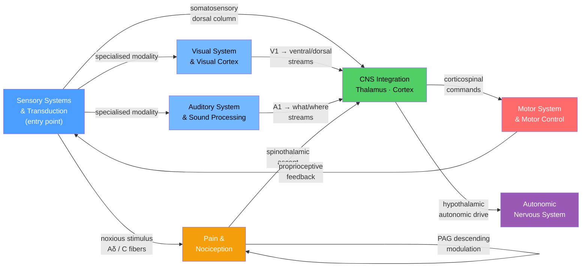

# Systems Neuroscience — Map of Content

> [!abstract] Section Overview
> Systems neuroscience studies how the nervous system receives information from the world, transforms it into perception and internal state, and translates it into action. This section covers the full sensory-motor arc — from peripheral receptor transduction through cortical processing to voluntary motor output — alongside the parallel channels of autonomic homeostasis and the nociceptive alarm system. Together these six notes explain why the same tissue injury can be agonising in one context and unfelt in another, why a stroke in the internal capsule produces spastic weakness rather than floppy paralysis, and how a cochlear implant can restore speech comprehension by mimicking the tonotopic map of the basilar membrane.

---

## Concept Map

*(Blue = foundational sensory entry, Green = CNS integration hub, Red = motor output, Purple = autonomic channel, Amber = nociceptive alarm channel; arrows show "leads to" or "feeds back into")*

---

## Learning Paths

### (a) Sensory Path — building perception from receptors to cortex

1. [[Sensory_Systems_and_Transduction]] — start here; establishes the universal receptor-potential-to-action-potential logic, labeled-line coding, and adaptation that every downstream note assumes
2. [[Visual_System_and_Visual_Cortex]] — the most elaborated sensory system; introduces retinotopic maps, parallel pathways (M/P/K), V1 orientation columns, and the ventral/dorsal cortical stream model that recurs in auditory processing
3. [[Auditory_System_and_Sound_Processing]] — mirrors the visual pathway but in the frequency domain; cochlear tonotopy, binaural ITD/ILD computation, and the auditory what/where cortical streams
4. [[Pain_and_Nociception]] — nociception as a specialised, modulatable branch of somatosensory transduction; gate control theory, central sensitisation, and descending opioidergic control close the sensory arc

### (b) Motor and Autonomic Path — from CNS command to bodily output

1. [[Motor_System_and_Motor_Control]] — the voluntary output side; M1 population coding, the corticospinal tract, cerebellar error correction, and basal ganglia gating; clinical lesion localisation follows directly from this hierarchy
2. [[Autonomic_Nervous_System]] — the involuntary output side; sympathetic/parasympathetic/enteric divisions, the baroreflex, heart rate variability, and the gut-brain axis; pairs naturally with motor control as the two efferent arms of the CNS

---

## All Notes in This Section

| Note | Core Concept | Level |
|------|-------------|-------|
| [[Sensory_Systems_and_Transduction]] | Universal principles of stimulus-to-spike conversion — mechanoreceptors, chemoreceptors, TRP channels, receptor potentials, and adaptation | Beginner |
| [[Visual_System_and_Visual_Cortex]] | Phototransduction, retinogeniculate pathway, V1 orientation columns, and ventral ("what") / dorsal ("where") cortical streams | Intermediate |
| [[Auditory_System_and_Sound_Processing]] | Cochlear tonotopy and hair-cell transduction, binaural processing in the superior olive, and spectrotemporal coding in auditory cortex | Intermediate |
| [[Motor_System_and_Motor_Control]] | Corticospinal hierarchy from M1 to NMJ, stretch reflex servo control, cerebellar internal models, and basal ganglia gating | Intermediate |
| [[Autonomic_Nervous_System]] | Sympathetic / parasympathetic / enteric divisions, preganglionic-to-postganglionic relay, baroreflex, and the gut-brain axis | Intermediate |
| [[Pain_and_Nociception]] | Nociceptor-to-cortex ascending pathway, gate control theory, central sensitisation (wind-up / spinal LTP), and PAG-RVM descending modulation | Advanced |

---

## Key Questions This Section Answers

- How does the nervous system convert physical energy — photons, pressure waves, mechanical force, temperature, tissue damage — into graded electrical signals and ultimately into conscious perception?
- Why are there two separate visual cortical streams, and what happens to perception when each is selectively damaged?
- Why does the cochlea produce a spatial frequency map, and how do cochlear implants exploit that map to restore speech comprehension?
- What distinguishes an upper motor neuron lesion from a lower motor neuron lesion, and why does the corticospinal system produce contralateral deficits?
- How does the autonomic nervous system balance sympathetic and parasympathetic tone, and what does heart rate variability reveal about that balance?
- Why does the same tissue injury cause drastically different pain in different contexts, and what cellular mechanisms underlie chronic pain and central sensitisation?

---

## Connections to Other Topics

- [[_MOC_Neuroscience_Master]] — parent master map for the full Neuroscience vault; Systems Neuroscience is Section 03
- Section 02 (Cellular Neuroscience) — action potentials, ion channels, and synaptic transmission are the cellular substrate on which every transduction and motor mechanism in this section runs
- Section 04 (Higher Brain Functions) — attention, working memory, and executive control exert top-down modulation on sensory gating (thalamic reticular nucleus) and motor planning (SMA, PFC), extending the circuits introduced here
- Section 05 (Neurological Disorders) — stroke, Parkinson's disease, ALS, neuropathic pain, and migraine are all clinical expressions of specific failures in the motor, autonomic, or nociceptive pathways described in this section

---

#MOC #Neuroscience #SystemsNeuroscience #SectionMOC
