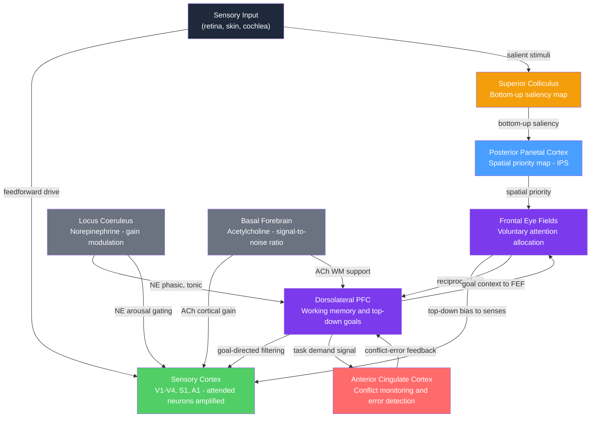

# Attention and Executive Function

> [!abstract] TL;DR
> Attention is the brain's mechanism for selectively amplifying task-relevant signals while suppressing irrelevant ones — implemented by top-down biasing signals from the prefrontal and parietal cortices that modulate firing rates throughout sensory hierarchies. Executive function is the suite of cognitive control processes — working memory, inhibition, and cognitive flexibility — that allow goal-directed regulation of thought and action in the face of competing responses or changing task demands. Both systems are anchored in the prefrontal cortex, whose sustained, context-sensitive activity is the defining neural signature of voluntary, deliberate control over behaviour.

---

## Intuition — analogy FIRST

Imagine a sold-out football stadium at night with every floodlight turned off. A single spotlight crew operates from the control booth. The spotlight can only illuminate one patch of the field at a time — wherever it shines, you can see every blade of grass in sharp detail; outside the beam, the players are invisible shadows. That spotlight is **attention**: it does not create information, it selects which information gets fully processed.

Now add a stage director in the booth who decides in real time where to point the beam, how long to hold it on a given player, and when to swing it elsewhere — overriding the operators who might otherwise chase the most dramatic movement anywhere on the field. That director is **executive function**: the meta-level controller that holds a goal ("track the goalkeeper"), suppresses distracting impulses ("ignore the cheerleaders"), and flexibly updates the plan when the situation changes ("the ball moved — re-point now"). Without the director, the spotlight chases noise. Without the spotlight, the director's instructions reach an empty stage.

In neural terms, attention is a modulation of sensory processing; executive function is the prefrontal-driven governance of that modulation and of all other goal-directed behaviour. The two are deeply intertwined but separable: attention can be captured by a sudden loud bang with no executive involvement at all, and executive function operates in non-attentional domains such as motor planning and social decision-making.

---

## How It Works

### Top-down vs Bottom-up Attention

Attention is driven by two competing sources of control that interact continuously in a dynamic circuit.

**Top-down (voluntary, endogenous):**
1. The dorsolateral prefrontal cortex (dlPFC) and frontal eye fields (FEF) hold an internal representation of the current goal and direct attentional resources accordingly.
2. These areas send strong feedback projections to the posterior parietal cortex (intraparietal sulcus, IPS), which maintains a spatial **priority map** that integrates top-down goal signals with bottom-up sensory salience.
3. The parietal cortex and FEF together project back to sensory cortices (V4, MT for vision; S1 for touch; A1 for audition), boosting the firing rate of neurons responding to attended stimuli by 2–4× relative to identical, simultaneously presented unattended stimuli.

**Bottom-up (reflexive, exogenous):**
1. A sudden flash, loud sound, or unexpected motion produces a rapid response in the superior colliculus (SC) and parietal cortex — even when the observer is actively trying to attend elsewhere.
2. The SC computes a saliency map and sends rapid signals (~50 ms) to parietal and frontal areas that can override endogenous attention goals.
3. This pathway is mediated partly via the thalamic **pulvinar**, which gates access to cortical areas for behaviourally relevant inputs.

**Neuromodulatory gating:**
- **Norepinephrine (NE)**, released by the locus coeruleus (LC), controls the signal-to-noise gain of cortical representations. Phasic LC firing follows unexpected task-relevant stimuli; tonic LC activity tracks global arousal level. Optimal NE via alpha-2A adrenergic receptors on PFC dendritic spines strengthens working-memory representations by closing HCN channels that would otherwise allow the maintained signal to decay.
- **Acetylcholine (ACh)**, released by the basal forebrain nucleus basalis (activated by task demands), suppresses background spontaneous cortical activity while enhancing driven responses to stimuli — effectively raising the signal-to-noise ratio for attended inputs across the cortex.



*The circuit combines a fast bottom-up pathway (input → SC → parietal → ~50 ms) with a slower but more powerful top-down pathway (dlPFC/FEF → sensory cortex → ~150 ms). Conflict detected by the ACC feeds back to dlPFC, enabling dynamic reallocation of control on a trial-by-trial basis.*

---

## Key Concepts

### Secondary Level

**Types of Attention**

| Type | Description | Example |
|------|-------------|---------|
| **Selective** | Focus on one stream; filter others | Reading on a noisy train |
| **Divided** | Simultaneously process two streams | Talking while driving |
| **Sustained (vigilance)** | Maintain focus over time | Air traffic controller monitoring radar for hours |
| **Spatial** | Direct processing to a location | Looking left at an intersection |
| **Feature-based** | Select by a feature (colour, pitch, shape) | Finding the red car in a parking lot |

**Role of the Prefrontal Cortex**

The PFC — especially the **dorsolateral PFC (dlPFC)** — is essential for holding task-relevant information "online" in the temporary buffer called working memory. Damage to the dlPFC does not cause blindness or paralysis but disrupts the ability to stay on task, plan sequences, or resist immediate impulses. A person with PFC damage can see a plate of food, know they are not hungry, yet find themselves reaching for it involuntarily when it is placed in front of them (utilisation behaviour). This captures what the PFC provides: not basic perception, but governance of action by goals in the face of competing signals.

**ADHD as an Attention Disorder**

Attention-deficit/hyperactivity disorder (ADHD) is characterised by persistent inattention, impulsivity, and hyperactivity arising from underactivity in prefrontal circuits and their dopaminergic/noradrenergic inputs. Stimulant medications (methylphenidate, amphetamine) block the dopamine and norepinephrine reuptake transporters (DAT, NET), raising extracellular catecholamine levels in the PFC and striatum. This restores the optimal neuromodulatory tone required for dlPFC function — essentially placing the brain back onto the peak of Arnsten's inverted-U (see Graduate Level below) and thereby improving sustained attention and impulse control.

---

### Undergraduate Level

**Posner Spatial Attention Cuing Paradigm (1980)**

Participants fixate centrally while a peripheral cue (valid 80% of trials) predicts the target location. Key result:
- **Valid cue**: RT ~250 ms — attention pre-deployed to the correct location speeds detection
- **Invalid cue**: RT ~300 ms — attention must disengage, shift, and re-engage at a new location
- **Neutral cue**: RT ~275 ms — attentional baseline

The **benefit** (neutral − valid ≈ 25 ms) measures facilitation from attention; the **cost** (invalid − neutral ≈ 25 ms) measures the penalty for misallocation. Crucially, lesion studies showed that right parietal damage produces **spatial neglect**: inability to disengage attention from the ipsilesional side even when the patient consciously knows something is on the contralesional side. The parietal cortex is therefore the site of attentional disengagement and re-engagement, not of the perceptual representation itself.

**Attentional Blink**

If two targets (T1, T2) are embedded in a rapid serial visual stream at a rate of ~100 ms per item, and T2 appears within 200–500 ms of T1, T2 is often missed entirely — even though it is physically visible. The attentional system is occupied consolidating T1 into working memory during this critical window. The attentional blink reveals a temporal bottleneck: only one item at a time can cross the threshold into full conscious processing. The bottleneck is not perceptual (T2 is detected pre-attentively) but arises at the stage of **working-memory consolidation**.

**Change Blindness**

When a brief visual disruption (a blink, a film edit, a "mudsplash") occurs simultaneously with a large change in a scene, observers typically fail to notice the change — even when it involves the main subject of the image. Change blindness demonstrates that without active attention directed to an object, its properties are not stored with sufficient fidelity to detect changes. Attention is thus necessary for **binding** features into stable, change-detectable object representations.

**Inhibition of Return (IOR)**

After attention has been drawn to a peripheral location and then released, that location is suppressed for approximately 300–1,500 ms — RTs to targets reappearing there are slower than to entirely new locations. IOR acts as an anti-perseveration mechanism, preventing attention from dwelling on already-examined locations and promoting systematic search across the visual field.

**Executive Function: the Miyake Three-Factor Model (2000)**

Using confirmatory factor analysis across a battery of EF tasks, Miyake et al. demonstrated three partially separable but correlated executive functions — the "unity and diversity" of executive control:

1. **Updating (Working Memory)**: monitoring and manipulating information held in short-term buffers. Tested by n-back, letter-number sequencing, and running-memory tasks.
2. **Inhibition**: suppressing dominant, prepotent, or no-longer-relevant responses. Tested by Stroop, stop-signal, and anti-saccade tasks.
3. **Shifting (Cognitive Flexibility)**: switching between mental sets or task rules in response to changing demands. Tested by Wisconsin Card Sorting, plus/minus task-switching paradigms.

The "unity" — shared variance across all three — is thought to reflect common prefrontal mechanisms (possibly dlPFC-ACC interactions); the "diversity" reflects separable circuit contributions and distinct clinical dissociations.

**Wisconsin Card Sorting Test (WCST)**

Cards are sorted by shape, colour, or number of symbols; the sorting rule shifts covertly after ten consecutive correct sorts and is signalled only by the examiner's feedback. Healthy adults shift rules quickly after three or four errors. Patients with **frontal lobe lesions** perseverate: they continue sorting by the previous rule despite repeated negative feedback, sometimes explicitly acknowledging they are sorting incorrectly. The WCST is the gold-standard behavioural measure of cognitive flexibility and set-shifting, and WCST perseveration is one of the most robust markers of frontal executive impairment.

**Stroop Task**

Name the ink colour of a printed colour word (e.g., the word "RED" printed in blue ink → correct answer: "blue"). Word-reading is a highly automatic, fast process; colour-naming is slower and requires controlled attention. The two responses compete, creating an interference effect of ~50–100 ms on incongruent trials (the Stroop interference effect). The task selectively activates the **ACC** (conflict detection) and the left **inferior frontal gyrus** (response inhibition) during incongruent conditions.

**Role of dlPFC and ACC**

- The **dlPFC** (Brodmann areas 9 and 46) maintains task representations in a sustained, delay-period activity that persists across blank intervals without sensory input — the neural "scratchpad" of working memory. It exerts top-down biasing over sensory and premotor areas by amplifying task-relevant neural populations and suppressing task-irrelevant ones.
- The **ACC** (Brodmann areas 24 and 32) monitors for **response conflict**: when two competing response representations are simultaneously active, ACC activity increases proportionally to the overlap. This conflict signal then recruits additional dlPFC control on the subsequent trial — the **Gratton effect** (congruency sequences effects), where the Stroop cost is reduced following a high-conflict trial.

**Norepinephrine and the Locus Coeruleus**

The locus coeruleus is a small brainstem nucleus (~1,500 neurons per hemisphere) sending diffuse NE projections to virtually every cortical and subcortical area. It operates in two modes:
- **Tonic high**: sustained high firing → high arousal but degraded signal-to-noise; attention is unfocused and the organism responds to many stimuli indiscriminately (hypervigilance)
- **Phasic burst**: brief high-frequency discharge time-locked to task-relevant events → sharpens cortical responses and improves performance on the current demanding trial

Arnsten's work showed that alpha-2A NE receptor agonists (guanfacine, clonidine) stabilise dlPFC working-memory networks by closing HCN (hyperpolarisation-activated cyclic nucleotide-gated) channels on pyramidal neuron dendritic spines — channels that, when open, generate membrane "noise" that degrades the maintained firing representing task-relevant information.

---

### Graduate Level

**Neural Correlates of Attention: Firing Rates and Local Field Potentials**

Single-unit recordings in awake, behaving monkeys during spatial attention tasks reveal two distinct neural signatures:

1. **Firing rate enhancement**: Neurons in areas V4 and MT that respond to an attended stimulus fire 2–4× faster than to an identical, simultaneously presented unattended stimulus. Critically, this modulation is **multiplicative** (a gain change), not additive — the same percentage increase applies across the entire tuning curve. This is consistent with a gain-control mechanism rather than a simple excitatory offset.

2. **Gamma-band LFP power (30–80 Hz)**: Local field potential gamma power increases in attended cortical regions, reflecting synchronised excitatory drive. Gamma coherence between PFC and V4 increases selectively when attention is directed toward the neurons' receptive field, consistent with the **communication-through-coherence** framework (Fries, 2005): gamma-frequency synchrony between sender and receiver areas creates overlapping excitability windows that amplify synaptic transmission without additional spiking.

3. **Alpha-band suppression (8–12 Hz)**: Posterior alpha power decreases over task-relevant cortical areas and increases over task-irrelevant areas. This is not passive — TMS pulses that artificially increase alpha power over one hemisphere reproduce spatial attention biases resembling mild neglect. Alpha oscillations likely implement **pulsed inhibition**: periodic membrane hyperpolarisation every ~100 ms suppresses cortical output in unattended regions while attended regions remain in an out-of-phase, maximally excitable state.

**Biased Competition Model (Desimone and Duncan, 1995)**

Multiple stimuli in the visual field compete for limited cortical representation via mutual lateral inhibition within sensory areas. In the absence of attention, the competition is resolved by stimulus-driven factors (contrast, novelty, prior expectation). Top-down attention introduces a "bias signal" from PFC that amplifies representations of task-relevant stimuli, tipping the competition in their favour. This accounts for a key empirical regularity: attention effects are larger when a distractor is simultaneously present than when only a single stimulus appears — the neural competition is what creates the attentional benefit, not simple amplification.

**Top-down vs Bottom-up Attention Networks: The Corbetta-Shulman Model (2002)**

Corbetta and Shulman proposed a two-network architecture based on neuroimaging meta-analyses and patient lesion data:

- **Dorsal attention network (DAN)**: bilateral FEF and IPS — implements top-down, goal-directed spatial attention. Activated when deploying attention to predictable locations or features. Corresponds to voluntary spotlight control.
- **Ventral attention network (VAN)**: right-lateralised temporoparietal junction (TPJ) and inferior frontal gyrus (IFG) — detects unexpected, behaviourally relevant events that violate current attentional set; generates a "circuit-breaker" signal that interrupts DAN and redirects attention.

The VAN is the neural substrate of attentional capture by salient stimuli; its strong right lateralisation explains why right-hemisphere damage causes global spatial neglect (the right VAN cannot interrupt the left-hemisphere DAN to redirect attention leftward). The interaction of the two networks — DAN maintains focus, VAN detects emergencies — explains how sustained attention and alertness to novelty coexist.

**Anterior Cingulate Conflict Monitoring (Botvinick et al., 2001)**

The ACC does not resolve conflict directly; it detects it and signals its magnitude. In connectionist models of the Stroop task, the "conflict" signal is computed as the Hopfield energy or the dot product of simultaneous competing response-unit activations. High conflict → large ACC BOLD signal → recruitment of additional prefrontal control → reduced conflict on the next trial. This trial-by-trial adaptation (conflict-monitoring theory) explains the Gratton effect and predicts that ACC lesions should impair the ability to recruit compensatory control — which they do, producing greater Stroop interference costs without the typical sequential adaptation.

**Executive Control Network and the Frontoparietal Network (FPN)**

Resting-state fMRI functional connectivity identifies the **frontoparietal network** (also called the executive control network) as including dlPFC, posterior parietal cortex (IPS/SPL), anterior insula, and anterior temporal cortex. The FPN:
- Is **anti-correlated** with the default mode network (DMN) at rest: as FPN activity increases during demanding cognitive tasks, the DMN (medial PFC, posterior cingulate cortex, angular gyrus) deactivates. The strength of this anti-correlation predicts individual differences in fluid intelligence and cognitive performance.
- Shows reduced connectivity in ADHD, schizophrenia, and normal aging — all associated with executive dysfunction.
- The DMN being active corresponds to mind-wandering, self-referential processing, and internally directed thought. Failure to suppress DMN during a demanding task predicts cognitive errors in real time.

**Prefrontal D1/D2 Dopamine Balance: Arnsten's Inverted-U**

Sustained activity of dlPFC layer III pyramidal neurons during working-memory delay periods is the cellular substrate of "keeping information in mind." This persistent firing is maintained by recurrent excitation through NMDA receptors and is exquisitely sensitive to catecholamine tone:

- **Optimal D1 receptor stimulation**: Strengthens recurrent NMDA-mediated excitation, stabilises the pattern of active neurons representing the current working-memory content, and enables accurate delayed responding.
- **Insufficient DA** (stress depletion, aging, low D1 occupancy): Reduced NMDA activation; PFC neurons cannot sustain task-relevant firing across the delay → WM fails. ADHD partly reflects this state.
- **Excessive DA** (high catecholamine release under acute stress, D1 saturation): Excessive feed-forward interneuron inhibition overrides recurrent excitation and collapses WM representations → also impairs WM.

This **inverted-U function** has direct pharmacological implications: low-dose stimulants (amphetamine) move the brain from the left limb toward the peak; high doses push past it to the right limb, explaining dose-dependent WM impairment. The NE alpha-2A agonist guanfacine stabilises WM by closing HCN channels on spines without D1 saturation — a pharmacologically cleaner intervention.

**Alpha Oscillations as a Gating Mechanism**

The ~10 Hz alpha rhythm dominates EEG over posterior cortex at rest but was long dismissed as "idle" noise. Contemporary work has recast it as an active attentional gate:
- Voluntary covert spatial attention to the left visual field decreases alpha power over right occipital cortex and increases it over left occipital cortex — a lateralised asymmetry that predicts detection performance before the target appears (Jensen and Mazaheri, 2010).
- Causal evidence: alpha-frequency TMS entrainment over one occipital hemisphere impairs visual detection selectively in that hemisphere.
- Computational models propose that alpha provides periodic inhibitory pulses (~100 ms cycle) that gate sensory processing windows. Attended regions are driven into a phase relationship with their input that maximises coincident excitation; unattended regions are locked into a phase that co-incides with inhibitory alpha troughs, suppressing processing without the energy cost of constant inhibitory firing.

---

## Python Demo

```python
import numpy as np
import matplotlib.pyplot as plt

# -----------------------------------------------------------------------
# Stroop Task: Drift-Diffusion Competition Model
#
# Two pathways contribute to the net drift toward the correct response:
#   - Color-naming channel: task-relevant but less practiced (lower drift)
#   - Word-reading channel: automatic and highly practiced (higher drift)
#
# Congruent:   both channels drive the SAME response  -> fast RT
# Neutral:     only color channel active               -> medium RT
# Incongruent: word channel drives the WRONG response -> slow RT
#
# Net evidence on each trial = color_drift + word_contribution
# A single threshold accumulator models the response-selection process.
# -----------------------------------------------------------------------

np.random.seed(42)

N_TRIALS  = 2000    # simulated trials per condition
DT        = 1e-3    # time step: 1 ms
T_MAX     = 3.0     # maximum allowed RT: 3 s
THRESHOLD = 1.0     # decision boundary (arbitrary units)
NOISE     = 0.35    # diffusion noise amplitude (scaled by sqrt(dt))

# Drift-rate parameters — all in arbitrary units per second
COLOR_DRIFT          = 2.0   # color-naming: task-relevant but effortful
WORD_BOOST_CONGRUENT = 1.2   # congruent word reading adds to color signal
WORD_INTERFERENCE    = 0.8   # incongruent word reading subtracts from color signal


def simulate_rts(net_drift, n_trials, dt, t_max, threshold, noise):
    """
    Euler integration of a noisy drift-diffusion process.
    Returns array of response times in milliseconds;
    NaN marks trials that did not reach threshold within t_max.
    """
    max_steps = int(t_max / dt)
    rts = np.full(n_trials, np.nan)
    for i in range(n_trials):
        x = 0.0
        for step in range(max_steps):
            x += net_drift * dt + noise * np.sqrt(dt) * np.random.randn()
            if x >= threshold:
                rts[i] = (step + 1) * dt * 1000   # convert steps -> ms
                break
    return rts


# Simulate three Stroop conditions
congruent_rts   = simulate_rts(COLOR_DRIFT + WORD_BOOST_CONGRUENT, N_TRIALS, DT, T_MAX, THRESHOLD, NOISE)
neutral_rts     = simulate_rts(COLOR_DRIFT,                         N_TRIALS, DT, T_MAX, THRESHOLD, NOISE)
incongruent_rts = simulate_rts(COLOR_DRIFT - WORD_INTERFERENCE,     N_TRIALS, DT, T_MAX, THRESHOLD, NOISE)


def report(rts, label):
    valid = rts[~np.isnan(rts)]
    print(f"{label:<15}  mean={np.nanmean(rts):6.0f} ms  "
          f"SD={np.std(valid):5.0f} ms  "
          f"timeouts={np.sum(np.isnan(rts)):3d}/{len(rts)}")


print(f"{'Condition':<15}  {'Mean RT':>9}  {'SD':>7}  {'Timeouts':>10}")
print("-" * 58)
report(congruent_rts,   "Congruent")
report(neutral_rts,     "Neutral")
report(incongruent_rts, "Incongruent")

stroop_effect       = np.nanmean(incongruent_rts) - np.nanmean(congruent_rts)
facilitation_effect = np.nanmean(neutral_rts)     - np.nanmean(congruent_rts)

print(f"\nStroop interference effect (Incongruent - Congruent): {stroop_effect:.0f} ms")
print(f"Stroop facilitation effect (Neutral - Congruent):     {facilitation_effect:.0f} ms")

# --- Visualisation ---
fig, (ax1, ax2) = plt.subplots(1, 2, figsize=(14, 5))

# Panel A: RT distributions
bins = np.linspace(0, 1500, 60)
for rts, color, label in [
    (congruent_rts,   "steelblue", f"Congruent   (mean={np.nanmean(congruent_rts):.0f} ms)"),
    (neutral_rts,     "goldenrod", f"Neutral     (mean={np.nanmean(neutral_rts):.0f} ms)"),
    (incongruent_rts, "tomato",    f"Incongruent (mean={np.nanmean(incongruent_rts):.0f} ms)"),
]:
    ax1.hist(rts[~np.isnan(rts)], bins=bins, alpha=0.65, color=color, label=label)

ax1.set_xlabel("Response Time (ms)", fontsize=11)
ax1.set_ylabel("Trial Count", fontsize=11)
ax1.set_title("Stroop Task — Simulated RT Distributions\n(Drift-Diffusion Model)", fontsize=11)
ax1.legend(fontsize=9)

# Panel B: exemplar single-trial accumulator traces
steps = 2000
t_ms  = np.arange(steps) * DT * 1000

for drift, color, label in [
    (COLOR_DRIFT + WORD_BOOST_CONGRUENT, "steelblue", "Congruent"),
    (COLOR_DRIFT,                         "goldenrod", "Neutral"),
    (COLOR_DRIFT - WORD_INTERFERENCE,    "tomato",    "Incongruent"),
]:
    trace = np.cumsum(drift * DT + NOISE * np.sqrt(DT) * np.random.randn(steps))
    ax2.plot(t_ms, trace, color=color, alpha=0.85, lw=1.8, label=label)

ax2.axhline(THRESHOLD, color="black", ls="--", lw=1.5, label="Decision threshold")
ax2.axhline(0, color="gray", ls=":", lw=1)
ax2.set_xlabel("Time (ms)", fontsize=11)
ax2.set_ylabel("Accumulated Evidence", fontsize=11)
ax2.set_title("Single-Trial Accumulator Traces\n(Stroop Conditions)", fontsize=11)
ax2.legend(fontsize=9)
ax2.set_xlim(0, t_ms[-1])

plt.tight_layout()
plt.savefig("stroop_drift_diffusion.png", dpi=150)
print("\nFigure saved: stroop_drift_diffusion.png")
```

The model captures the two hallmark Stroop results: an **interference effect** (incongruent slower than neutral, driven by the automatic word-reading pathway subtracting from the color-naming accumulator) and a **facilitation effect** (congruent faster than neutral, driven by the same pathway adding to the accumulator). The asymmetry between the two — interference > facilitation — arises naturally because the word-reading channel's strength (1.8 units) is distributed differently when it helps (adds 1.2 units in the congruent model) versus hurts (subtracts 0.8 units).

---

## Real-World Applications

**ADHD: Pharmacological Restoration of PFC Catecholamine Tone**

Methylphenidate (Ritalin) blocks DAT and NET, raising extracellular dopamine and norepinephrine in the PFC and striatum. Amphetamine additionally reverses the transporters and increases vesicular release. Both mechanisms restore optimal catecholamine levels for dlPFC function — placing the brain onto the productive region of the inverted-U curve. Guanfacine (an alpha-2A agonist) addresses the NE arm of the same circuit, specifically strengthening PFC delay-period firing without the cardiovascular side effects of broad catecholamine elevation. The therapeutic action of all three drugs is thus anchored in the same basic neuroscience: restoring prefrontal signal-to-noise for sustained, goal-directed attention.

**Frontal Lobe Injury: Phineas Gage (1848)**

A railroad tamping accident drove an iron rod through Gage's skull, destroying bilateral ventromedial PFC and orbitofrontal cortex. Gage survived with intact sensory and motor function, intact speech, and preserved long-term memory and IQ — but underwent a complete personality transformation. He became impulsive, profane, unable to plan or keep social commitments, and could not sustain goal-directed behaviour against competing impulses. His case established the first clinical dissociation between basic cognitive faculties and executive control of behaviour. Damasio's somatic marker hypothesis later reframed the orbitofrontal/vmPFC damage as disrupting the ability to integrate emotional body-state signals (somatic markers) into decision-making — a theory that generated decades of research into emotion-cognition interactions in the PFC.

**Dementia and Executive Dysfunction**

In Alzheimer's disease, hippocampal and entorhinal damage disrupts episodic memory encoding, but executive dysfunction appears early because the hippocampus and PFC are tightly coupled. In **frontotemporal dementia (FTD)**, the PFC and anterior temporal cortex are the primary targets of tau or TDP-43 pathology; FTD therefore presents with executive dysfunction (planning failures, impulsivity, disinhibited social behaviour) before significant memory loss — the reverse of typical Alzheimer's. FTD often goes undiagnosed for years because standard cognitive tests emphasise memory; proper evaluation requires executive function batteries including the WCST, Stroop, and verbal fluency tasks.

**Mindfulness Meditation**

Longitudinal neuroimaging studies show that mindfulness training (8-week MBSR, long-term practice) increases grey-matter density in the ACC, anterior insula, and dlPFC, and reduces spontaneous DMN activity during task performance. Functionally, experienced meditators detect mind-wandering episodes sooner (meta-attentional monitoring) and redirect attention with less apparent effort. The neural mechanism is likely more efficient ACC-dlPFC conflict signalling: meditators show greater ACC activity during mind-wandering detection episodes and faster suppression of DMN, consistent with a training-induced strengthening of the top-down control loop.

**Cognitive Training and Near/Far Transfer**

N-back training, action video-game training (NeuroRacer), and working-memory intervention programs (Cogmed) robustly improve performance on trained tasks (near transfer) but show inconsistent generalisation to untrained tasks (far transfer). The brain mechanism appears to be more efficient use of existing PFC-parietal circuitry — reduced trial-by-trial variability and faster suppression of task-irrelevant DMN activity — rather than increases in "WM capacity" per se. Transfer is largest when trained and transfer tasks share a common executive-function bottleneck.

---

## Common Pitfalls

- **"The PFC is just the working-memory module"** — The PFC supports any goal-directed behaviour: motor planning, emotion regulation, social cognition, delay of gratification, and moral reasoning. Working memory is one output of goal-directed maintenance; the PFC is better characterised as a domain-general **goal-representation and bias-signal generator** (Miller and Cohen, 2001). Restricting PFC to WM misses its role in every executive function.

- **"Executive function equals intelligence"** — EF and IQ overlap substantially but are separable. Patients with focal frontal lesions can score in the normal or superior range on standard IQ tests — which reward crystallised knowledge, vocabulary, and pattern completion — while failing catastrophically at real-world planning and WCST set-shifting. Conversely, people with average IQ can have strong EF. EF predicts life outcomes (health, income, relationships) over and above IQ.

- **"Attention is just concentration"** — Attention encompasses multiple dissociable processes: selective filtering, spatial deployment, feature binding, temporal gating, and meta-attentional monitoring. Many of these operate without awareness or effort (pre-attentive feature detection), and all of them can be modulated pharmacologically, neurologically, and developmentally independently. "Try harder" specifically addresses sustained attention but does not improve the automatic components of selective attention or the efficiency of bottom-up capture.

- **"The spotlight metaphor is complete"** — Spatial attention is the best-studied form but not the only one. **Feature-based attention** (attending to all red objects regardless of location), **object-based attention** (spreading attention across a whole object even at unattended locations), and **temporal attention** (selectively processing events at predicted time points) are all well-documented and involve partially distinct circuits. A complete account of attention must explain all three spatial, feature, and temporal dimensions.

- **"Alpha oscillations mean the brain is idle"** — Pre-event alpha power over task-irrelevant cortex actively predicts suppressed processing and reduced false-alarm rates on subsequent stimuli — a controlled, goal-directed operation, not relaxation. The historical association of alpha with drowsiness arose because global alpha increases at rest, but local, lateralised alpha dynamics are an active attentional tool.

---

## Related Concepts

- [[_MOC_Cognitive_Neuroscience|↑ Cognitive Neuroscience MOC]] — section map linking all seven cognitive neuroscience topics in this vault section
- [[Cerebral_Cortex_and_Lobes]] — the anatomical organisation of PFC, parietal, and ACC that houses the circuits described here; layer-specific connectivity of dlPFC and IPS
- [[Learning_and_Memory_Systems]] — the interaction between working memory (a PFC function) and long-term memory consolidation in the hippocampus; how attention determines what enters long-term storage
- [[Consciousness_and_Neural_Correlates]] — the relationship between attention and awareness: biased competition theory claims attended representations reach the threshold for conscious access; the global workspace model links attention with cortical ignition
- [[Psychiatric_Disorders_and_Neurobiology]] — ADHD, schizophrenia (impaired dlPFC-hippocampal coupling and WM), and frontotemporal dementia as disorders of the executive control network
- [[Neural_Oscillations_and_Synchrony]] — the mechanistic role of gamma coherence (attention-driven communication), alpha suppression (gating), and theta (WM maintenance) in implementing attentional modulation

---

## Review Questions

### Secondary Tier

1. Using the spotlight analogy, explain why dividing attention between two simultaneous tasks produces worse performance on both than focusing on one at a time. What does this tell you about the spotlight's fundamental nature?
2. A student can read a textbook perfectly when sitting in a quiet library but misses whole paragraphs in a noisy cafe every time a nearby conversation gets interesting. Which specific type of attention is failing? Which brain region is most directly responsible for filtering the irrelevant conversation, and which neuromodulator could be depleted to explain this sensitivity?

### Undergraduate Tier

3. In Posner's cuing paradigm, the cost of an invalid cue (RT slow-down compared to neutral) is roughly equal to the benefit of a valid cue (RT speed-up compared to neutral). Using the three-stage model of attentional orienting — disengage, shift, engage — explain which stage is the bottleneck that makes re-orienting costly, and what evidence from parietal lesion patients supports your account.
4. A patient with a right temporoparietal junction (TPJ) lesion ignores all stimuli on the left side of space even when the examiner points to them. Using the Corbetta-Shulman two-network model, explain why TPJ damage produces spatial neglect rather than left-sided blindness, and why the neglect is more severe for stimuli appearing unexpectedly than for stimuli the patient is told to expect.
5. You want to design a single cognitive task that measures **inhibition** with minimal contribution from updating or shifting. Describe the task, justify why it isolates inhibition, and explain what RT pattern and neural signature (BOLD region) you would expect.

### Graduate Tier

6. Gamma-band coherence between dlPFC and V4 increases when a stimulus is attended. According to the communication-through-coherence (CTC) framework, what specific prediction does this make about the spike-phase relationship between PFC neurons and V4 LFP? Design an optogenetic experiment in a rodent visual system model that would causally test whether gamma synchrony drives, rather than merely correlates with, enhanced V4 spike rates.
7. Arnsten's inverted-U model predicts that both insufficient and excessive catecholamine stimulation in dlPFC impair working memory. Describe the cellular mechanism underlying each limb of the U separately (which receptor, which ion channel, what effect on persistent firing), and predict the specific pattern of dose-dependent WM impairment you would observe across a range of amphetamine doses in a healthy human subject.
8. Alpha power over right occipital cortex decreases and over left occipital cortex increases when covert spatial attention is directed leftward. Propose a mechanistic circuit model explaining how changes in a 10 Hz thalamocortical oscillation produce this spatially specific pattern, state what causal prediction your model makes about alpha phase (not just power) and detection thresholds, and describe the experiment you would run to test it.

---

## Sources

- Posner, M.I. and Petersen, S.E. (1990) "The attention system of the human brain." *Annual Review of Neuroscience*, 13, 25–42. — Foundational two-system (posterior/anterior) attention model; defines the orienting, alerting, and executive networks.
- Arnsten, A.F.T. (1998) "Catecholamine modulation of prefrontal cortical cognitive function." *Trends in Cognitive Sciences*, 2(11), 436–447. — Inverted-U model for DA/NE in PFC; alpha-2A receptor mechanism for WM stabilisation.
- Miller, E.K. and Cohen, J.D. (2001) "An integrative theory of prefrontal cortex function." *Annual Review of Neuroscience*, 24, 167–202. — Unified account of PFC as a bias-signal generator for goal-directed behaviour across all domains.
- Miyake, A., Friedman, N.P., Emerson, M.J., Witzki, A.H., Howerter, A. and Wager, T.D. (2000) "The unity and diversity of executive functions and their contributions to complex frontal lobe tasks." *Cognitive Psychology*, 41(1), 49–100. — Latent-variable analysis establishing the three-factor EF model.
- Corbetta, M. and Shulman, G.L. (2002) "Control of goal-directed and stimulus-driven attention in the brain." *Nature Reviews Neuroscience*, 3(3), 201–215. — Dorsal (top-down) / ventral (bottom-up) two-network attention model; explains spatial neglect.
- Botvinick, M.M., Braver, T.S., Barch, D.M., Carter, C.S. and Cohen, J.D. (2001) "Conflict monitoring and cognitive control." *Psychological Review*, 108(3), 624–652. — ACC conflict-monitoring theory; connectionist implementation of the Stroop and sequential adaptation.
- Desimone, R. and Duncan, J. (1995) "Neural mechanisms of selective visual attention." *Annual Review of Neuroscience*, 18, 193–222. — Biased competition model of visual attention; neural competition for representation.

---

#Neuroscience #CognitiveNeuroscience #Attention #ExecutiveFunction #PrefrontalCortex
