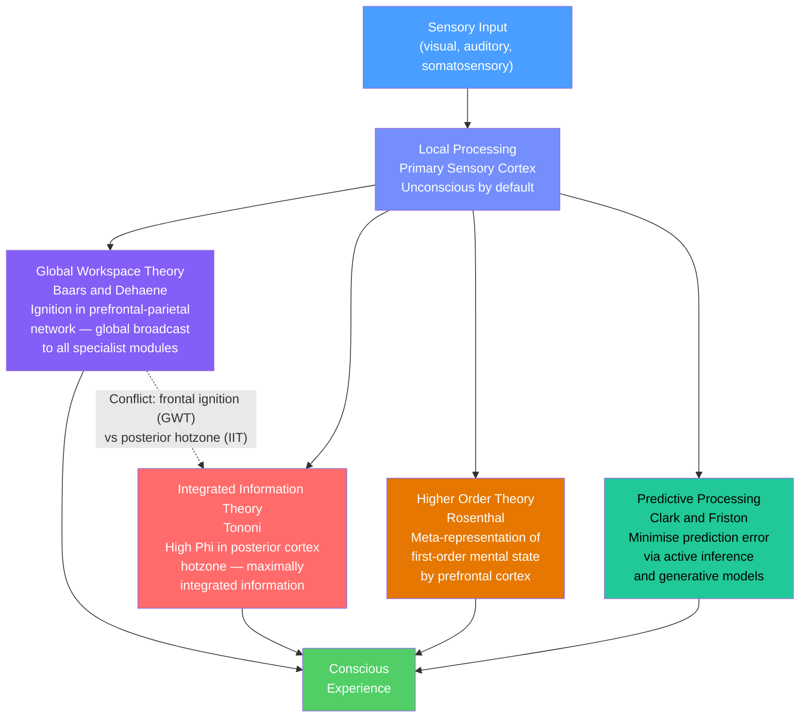

# Consciousness and Neural Correlates

> [!abstract] TL;DR
> Consciousness is the capacity for subjective, first-person experience — the fact that there is *something it is like* to be a brain processing information — and it remains one of the deepest unsolved problems in science and philosophy. Neural Correlates of Consciousness (NCCs) are the minimal brain states jointly sufficient for any specific conscious experience, and decades of research have identified strong candidates across cortex, thalamus, and their interactions. However, identifying correlates does not explain why any physical process gives rise to subjective experience at all — this "hard problem" (Chalmers) stands unresolved and separates consciousness science from almost every other field of empirical inquiry.

---

## Intuition — analogy FIRST

Imagine trying to explain the colour red to someone who has been blind from birth. You can give them every physical fact: the wavelength (700 nm), the photoreceptor activation pattern in the retina, the V4 cortex response, the pulvinar relay, the feedforward sweep into higher visual cortex. You can hand them a complete wiring diagram of the human visual system. None of this tells you — or them — why there is a subjective *redness*, a felt quality, a *what-it-is-likeness* to seeing red. That gap between the complete physical description and the felt experience is the hard problem.

A second analogy helps explain how *collective* conscious experience arises from neurons: picture a stadium full of 70,000 football fans doing a Mexican wave. No single fan is the wave. You can describe every individual fan's motion perfectly. Yet the wave is real, it travels, it has direction and speed, and it carries information visible from satellite. The wave is an *emergent global state* of a local system. Consciousness may work similarly — distributed neural populations produce a global broadcast that is more than any local region, yet the "wave" is still real and causally potent.

---

## How It Works

Consciousness research distinguishes two separable questions. **Easy problems** (Chalmers' term — not actually easy, just tractable in principle) concern *how the brain processes information*: how we integrate sensory signals, report mental states, control attention, and produce verbal behaviour. These yield to standard cognitive neuroscience tools. The **hard problem** is why any of this processing is accompanied by subjective experience at all — why the lights are "on inside."

The empirical programme attacks the easy problems by identifying NCCs: brain states reliably correlated with conscious reports using carefully designed paradigms (binocular rivalry, visual masking, no-report paradigms) that control for attention and motor response. Four major theoretical frameworks then compete to explain the NCC observations.



---

## Key Concepts / Details

### Secondary Level

**Consciousness vs unconsciousness:** A stimulus can enter the nervous system and influence behaviour without ever being consciously perceived. Classic examples include priming (an unseen word biases a subsequent response), blindsight (a patient with V1 damage can reach correctly for an object they deny seeing), and sleep learning (limited). This shows the brain does enormous work without consciousness; consciousness appears to add something selective, flexible, and reportable.

**States of consciousness — the arousal dimension:** Consciousness is not binary. Clinical medicine recognises a spectrum: full wakefulness → drowsiness → light sleep → deep slow-wave sleep → REM sleep → sedation → general anaesthesia → minimally conscious state → vegetative state → coma → brain death. The critical variable is not just cortical activity but *connectivity* — whether prefrontal and parietal cortices are communicating with each other and with thalamus.

**Anaesthesia:** General anaesthetics (propofol, ketamine, isoflurane) impair consciousness not by silencing the brain uniformly but by disrupting long-range cortico-cortical communication. EEG during propofol anaesthesia shows a characteristic surge of slow-wave (delta, <1 Hz) activity and loss of alpha rhythms — a signature of broken thalamo-cortical loops and posterior-frontal disconnection.

**Vegetative state vs locked-in syndrome:** A patient in a vegetative state has a functioning brainstem (awake-sleep cycles, eye opening) but shows no behavioural evidence of awareness. Locked-in syndrome is the mirror image: full awareness with intact cognition trapped in a paralysed body (usually basilar artery stroke; eye movements preserved). The two are catastrophically misdiagnosed without careful neuroimaging.

**The hard problem vs easy problems:** David Chalmers (1995) partitioned consciousness research into "easy" problems — explaining cognition, reportability, attention, perceptual integration — and the "hard" problem: why any physical state gives rise to subjective experience (qualia). The hard problem resists functionalist explanations because, in principle, every function could be implemented by a system with no inner experience (a "philosophical zombie"). This distinction motivates the entire NCC programme and the competing theories below.

**Attention vs consciousness:** A critical experimental distinction: attention and consciousness are often conflated but are empirically separable. Inattentional blindness shows you can miss a gorilla in a visual scene even while fully conscious. Conversely, you can be conscious of peripheral stimuli you are not attending to. No-report paradigms (measuring NCCs without asking participants to respond) help control for the motor and attentional demands of reporting.

---

### Undergraduate Level

**Neural Correlates of Consciousness — definition:** An NCC is the minimal set of neural events and mechanisms jointly sufficient for a specific conscious percept. "Minimal" is critical — the whole brain is not the NCC; rather, researchers seek to strip away components necessary only for input, output, and reportability, isolating the core neural signature of the experience itself. NCCs can be studied at multiple levels: spike rates, local field potentials, EEG/MEG source activity, fMRI BOLD signal.

**Binocular rivalry paradigm:** When different images are shown to the left and right eye simultaneously (a face to one, a house to the other), perception alternates spontaneously between the two — you see a face, then a house, roughly every 2–4 seconds — while the physical stimulus remains constant. This dissociation between percept and stimulus is the key: neurons whose firing tracks the perceptual report (not the fixed retinal image) are NCC candidates. Rivalry studies in macaques identified V4, IT cortex, and prefrontal neurons as tracking the conscious percept; V1 neurons tracked the retinal image with only weak perceptual modulation.

**Visual masking and the attentional blink:** In backward masking, a brief target stimulus (e.g., a word) is immediately followed by a mask (random noise). If the mask arrives within ~100 ms, the target is not consciously perceived despite identical retinal processing. The attentional blink (Raymond et al., 1992) shows that during a rapid serial visual presentation stream, identifying one target makes a second target invisible for ~200–500 ms — a temporal bottleneck in conscious access.

**P300 and the event-related potential signature of consciousness:** The P300 is a positive voltage deflection in the EEG ~300–500 ms after a stimulus, generated across frontal and parietal scalp electrodes. It appears for consciously perceived targets and absent for masked (unconscious) stimuli matched for physical intensity. The P3b sub-component is linked to global workspace ignition and the updating of working memory representations. Its amplitude correlates with subjective visibility ratings and disappears under anaesthesia and in vegetative state patients.

**Global Workspace Theory (GWT — Baars 1988, Dehaene 2014):** The brain is conceptualised as a "theatre" with many specialist, unconscious processors (vision, audition, motor control, language) running in parallel. Consciousness arises when information is broadcast on a *global workspace* — a shared resource accessible to all processors simultaneously. In neural terms (Global Neuronal Workspace Theory, GNWT), this broadcast corresponds to a late (~300 ms), all-or-none ignition in the prefrontal-parietal network, propagating back to sensory cortex and thalamus. Conscious access is thus discrete and non-linear — a phase transition, not a gradient.

**Dorsal and ventral attention networks:** Two fronto-parietal networks govern attention. The *dorsal attention network* (FEF, IPS) supports voluntary, top-down attention orienting. The *ventral attention network* (TPJ, right IFG) is an alerting/reorienting system, triggered automatically by salient unexpected stimuli. Both modulate NCC amplitudes and thresholds, explaining why attention and consciousness co-vary strongly in most natural conditions while being mechanistically distinct.

**Default Mode Network (DMN) and consciousness:** The DMN (medial prefrontal cortex, posterior cingulate cortex, angular gyrus, hippocampus) is active during rest, mind-wandering, and self-referential processing. During focused attention to an external task, the DMN is suppressed. Crucially, patients in a vegetative state show dramatically reduced DMN connectivity compared to both healthy controls and minimally conscious patients — suggesting DMN integrity is a marker of conscious self-related processing, not just arousal.

**Split-brain patients (Sperry and Gazzaniga):** In the 1960s, Roger Sperry and Michael Gazzaniga studied patients who had undergone corpus callosotomy (surgical severing of the corpus callosum) to treat severe epilepsy. Information presented to the left visual field (right hemisphere) could not be verbally reported (left hemisphere controls speech) but could guide the left hand. The two hemispheres appeared to have separate streams of consciousness — each hemisphere an independent observer with its own perceptual and volitional states. This challenged unitary theories of consciousness and suggested it requires not just activation but intra-hemispheric integration.

---

### Graduate Level

**Integrated Information Theory (IIT — Tononi 2004, 2008, 2016):** IIT proposes that consciousness IS integrated information, defined by the quantity Φ (phi) — a measure of how much information is generated by a system above and beyond the information generated by its parts independently. A system has maximal Φ when its elements are both highly differentiated (many possible states) and highly integrated (no partition into independent modules explains its state). IIT predicts that consciousness is localised to the *posterior cortical hotzone* (occipital, parietal, temporal cortex) rather than prefrontal cortex, because lesion and perturbation data show that posterior damage specifically impairs perceptual content while large prefrontal lesions leave consciousness largely intact. Φ is substrate-independent in principle — highly integrated artificial systems could be conscious — but is computationally intractable for networks larger than ~30 nodes, making empirical tests challenging.

**Global Neuronal Workspace Theory (GNWT — Dehaene, Changeux, Sergent):** GNWT is the neural implementation of Baars' GWT. Key prediction: conscious access involves a *late cortical ignition* (~300–500 ms post-stimulus) in which prefrontal and parietal "workspace neurons" with long-range axons abruptly increase firing and send re-entrant feedback to sensory cortex. This creates a transient global brain state measurable by sudden increase in high-frequency gamma power, long-range synchrony, and P3b in EEG. Below threshold, only local sensory responses are observed; above threshold, ignition is all-or-none. The key prediction distinguishing GNWT from IIT is that prefrontal cortex participates in the NCC — a claim IIT disputes.

**Higher Order Theories (HOT — Rosenthal 1997, Lau and Rosenthal 2011):** HOT proposes that a mental state is conscious only when it is represented by a higher-order mental state — a meta-representation that the first-order state exists. On this view, a perceptual state (e.g., a V4 colour response) becomes conscious only when prefrontal circuits produce a higher-order representation of that colour perception. This aligns with frontal lobe data and explains why lesions to prefrontal cortex impair subjective visibility without necessarily disrupting behaviour driven by the stimulus. The "perceptual reality monitoring" framework (Lau 2022) operationalises HOT as prefrontal modulation of sensory cortex gain.

**Predictive Processing (Clark 2016, Friston 2010):** The brain is a hierarchical Bayesian prediction machine. Every level of cortical hierarchy sends top-down predictions to the level below; sensory input provides prediction errors that propagate upward to revise the generative model. On this framework, consciousness is linked to *precision-weighted prediction errors* — the brain's best hypothesis about the current state of the world and body. Perceptual inference (recognising a stimulus) corresponds to suppressing prediction errors; failures of predictive precision management underlie hallucinations and disorders of consciousness. Active inference extends this to action: behaviour is chosen to minimise anticipated prediction errors (free energy minimisation).

**No-report paradigms to dissociate attention from consciousness:** Classic NCC experiments asked participants to press a button for conscious percepts, confounding consciousness with attention, working memory, and motor preparation. No-report paradigms (Tsuchiya et al. 2015; Lamme 2010) remove the report requirement and measure neural responses directly — e.g., frequency-tagging to track rivalry alternations from EEG without any key press. Results suggest that some NCC signatures (late P3, frontal gamma ignition) disappear when the report requirement is removed, implicating them in *reportability* rather than consciousness per se. This is a live controversy that directly tests GNWT vs IIT predictions.

**Neural ignition and the prefrontal-parietal network:** fMRI studies of subliminal vs supraliminal stimuli matched for retinal input show that conscious perception is associated with a sudden, non-linear increase in BOLD signal across a widespread network: dorsolateral PFC, inferior frontal gyrus, anterior cingulate, inferior parietal lobule (IPL/TPJ), and anterior insula. This network shows all-or-nothing threshold behaviour — small stimulus changes near threshold produce categorical changes in network activation — consistent with a phase transition. Local sensory cortex activation ramps with stimulus strength even below threshold; the ignition adds a categorical, late component.

**Perturbational Complexity Index (PCI — Casali et al. 2013):** PCI is a consciousness measure developed for clinical use. TMS is applied to the cortex and the EEG response (TMS-evoked potential, TEP) is recorded. PCI is the algorithmic complexity (Lempel-Ziv) of the spatiotemporal pattern of TEP activation, normalised by total signal amplitude. A conscious brain produces a complex, differentiated, widely spreading cortical response; an unconscious brain (deep sleep, anaesthesia, vegetative state) produces a simple, stereotyped, local response. PCI discriminates consciousness states with >95% accuracy across healthy sleep stages, anaesthetic depths, and disorders of consciousness — including differentiating vegetative state from minimally conscious state where clinical assessment is unreliable.

**Optogenetics in NCC research:** Optogenetic tools (channelrhodopsin, halorhodopsin) expressed in specific cell types allow circuit-level dissection of consciousness-related activity. In rodents, optogenetic suppression of layer 5/6 pyramidal neurons (the output cells of the global workspace) disrupts behavioural evidence of conscious sensory processing while leaving thalamo-cortical input intact. Conversely, layer 6 corticothalamic neurons can be activated to modulate thalamic relay gain, shifting the threshold for sensory awareness. These experiments move beyond correlation into causal circuit manipulation of states that approximate conscious processing.

**The adversarial collaboration — IIT vs GNWT:** In a pre-registered adversarial collaboration published in *Nature* (Melloni et al. 2023), over 250 researchers designed experiments to test distinguishing predictions of IIT and GNWT. Preliminary results found that posterior cortex showed earlier and more sustained NCC activity (consistent with IIT) while late frontal ignition was tied to reportability (consistent with no-report critiques of GNWT). Neither theory was decisively confirmed or refuted — the field remains genuinely open.

---

## Python Demo

```python
import numpy as np
import matplotlib.pyplot as plt

# Simulate Global Workspace ignition: local subthreshold processing
# transitions to an all-or-none global broadcast when threshold is crossed.
# Each "module" is a cortical specialist (visual, auditory, motor, etc.).

np.random.seed(42)

N     = 8      # number of cortical modules
T     = 300    # simulation time steps
leak  = 0.08   # passive activation decay per step
noise = 0.015  # stochastic fluctuation amplitude
stim  = 0.10   # sustained sensory drive to module 0 starting at step 50

ignition_thresh  = 0.60  # activation level triggering ignition
broadcast_gain   = 0.80  # activation injected to all modules at ignition

act = np.zeros((N, T))
act[:, 0] = np.random.uniform(0.0, 0.03, N)

broadcast = np.zeros(T, dtype=bool)
ignition_t = None

for t in range(1, T):
    prev = act[:, t - 1].copy()

    drive = np.zeros(N)
    if t >= 50:
        drive[0] = stim  # only module 0 receives sensory input

    if broadcast[t - 1]:
        # During sustained broadcast: all modules kept at high activation
        broadcast[t] = True
        act[:, t] = np.clip(
            prev * (1 - leak) + drive + np.random.normal(0, noise, N) + 0.15,
            0, 1
        )
    else:
        act[:, t] = np.clip(
            prev * (1 - leak) + drive + np.random.normal(0, noise, N),
            0, 1
        )
        # Ignition: driven module crosses threshold
        if act[0, t] >= ignition_thresh and ignition_t is None:
            ignition_t = t
            broadcast[t] = True
            act[:, t] = np.clip(act[:, t] + broadcast_gain, 0, 1)

# --- Plot ---
fig, (ax1, ax2) = plt.subplots(2, 1, figsize=(11, 6), sharex=True)

colors = plt.cm.tab10(np.linspace(0, 0.9, N))
for i in range(N):
    lbl = "Module 1 (sensory input)" if i == 0 else f"Module {i + 1}"
    ax1.plot(act[i], color=colors[i], lw=1.6, alpha=0.85, label=lbl)

ax1.axhline(ignition_thresh, color="red", ls="--", lw=1.5, label="Ignition threshold")
if ignition_t:
    ax1.axvline(ignition_t, color="darkred", ls=":", lw=2.0,
                label=f"Ignition at t = {ignition_t}")
ax1.axvline(50, color="gray", ls=":", lw=1.2, label="Sensory onset (t=50)")
ax1.set_ylabel("Activation (a.u.)")
ax1.set_title("Global Workspace Ignition — Subthreshold Local to All-or-None Global Broadcast")
ax1.legend(fontsize=7, ncol=4, loc="upper left")
ax1.set_ylim(-0.05, 1.1)

ax2.fill_between(range(T), broadcast.astype(float),
                 step="post", alpha=0.65, color="steelblue",
                 label="Global broadcast ON (conscious access)")
ax2.set_ylabel("Broadcast state")
ax2.set_xlabel("Time step")
ax2.set_title("Discrete Phase Transition — Broadcast Is All-or-None, Not Graded")
ax2.legend()

plt.tight_layout()
plt.show()

# Key insight: before t=50 all modules are near zero (no input).
# From t=50 module 0 ramps slowly — subthreshold, unconscious processing.
# When module 0 crosses the ignition threshold, all modules jump simultaneously
# to high activation — the global broadcast. This is the neural correlate of
# sudden conscious access: the same discontinuity seen in P3 EEG ignition.
```

---

## Real-World Applications

**Anaesthesia monitoring — Bispectral Index (BIS):** The BIS monitor analyses the EEG power spectrum and cross-frequency coupling to output a single number (0–100) reflecting depth of anaesthesia. Values above 80 indicate awake; 40–60 is adequate surgical anaesthesia; below 20 is burst suppression (near-isoelectric cortex). While imperfect, BIS reduces the incidence of intraoperative awareness — conscious experience during surgery — which occurs in roughly 1–2 per 1,000 general anaesthetic procedures and causes lasting PTSD.

**Disorders of consciousness — PCI for bedside diagnosis:** Patients in vegetative or minimally conscious states are catastrophically misdiagnosed by clinical examination alone in up to 40% of cases (functional MRI and EEG studies consistently find covert awareness in patients clinically classified as vegetative). PCI (TMS-EEG complexity) now provides a brain-based consciousness measure independent of the patient's ability to move or speak. PCI scores reliably separate healthy wakefulness (>0.44) from vegetative state (<0.31) and minimally conscious state (intermediate), guiding prognosis and treatment decisions.

**Psychedelic neuroscience — psilocybin and network disruption:** Psilocybin (a 5-HT2A agonist) produces profound alterations in consciousness: ego dissolution, synaesthesia, mystical experiences, and visual hallucinations. fMRI studies show psilocybin dramatically *increases* global signal variability and *decreases* DMN functional connectivity — the opposite of the reduced complexity seen in unconscious states. This "entropic brain" signature (Carhart-Harris 2014) suggests psychedelics increase the brain's repertoire of accessible states, consistent with IIT (increased Φ) and predictive processing (reduced top-down prior precision, allowing unconstrained generative model sampling).

**Near-death experiences (NDEs):** A 2023 *PNAS* study (Borjigin et al.) recorded a surge of gamma oscillations and cross-frequency coupling in the posterior cortex of cardiac arrest patients moments after cardiac arrest — a paradoxical burst of organised neural activity in a dying brain that correlates with reported NDEs and may represent a last surge of conscious processing as metabolic support fails.

**AI consciousness debate — IIT applied to large language models:** IIT provides a substrate-independent definition of consciousness via Φ, which in principle applies to any physical system — including artificial neural networks. Several theorists (Tegmark, Kleiner) have applied IIT formalism to transformer architectures. The near-universal conclusion is that current LLMs have extremely low Φ due to their feedforward, non-recurrent connectivity (high feedforward, low feedback integration = low Φ). This remains deeply contested, as IIT is itself challenged within consciousness science.

---

## Common Pitfalls

- **Attention is not consciousness, and conflating them corrupts NCC interpretations.** Most early NCC experiments required participants to press a button for perceived stimuli, meaning the measured "NCC" included attention, working memory maintenance, motor preparation, and decision-making. No-report paradigms reveal that some frontal NCC signatures may be correlates of *reporting* rather than of *experiencing*. Always ask whether the paradigm controls for attentional demands independently of conscious access.
- **Unconscious processing is far more extensive than intuition suggests.** Complex computations — face identification, semantic categorisation, arithmetic, emotional valence — can proceed without consciousness. Assuming that conscious access is required for any complex cognitive operation is empirically wrong. Consciousness appears to serve a specific role in flexible, novel, and cross-domain integration, not just processing complexity.
- **IIT and GNWT make directly conflicting predictions about the anatomical location of consciousness.** IIT identifies the posterior cortex (occipito-temporal-parietal hotzone) as the seat of conscious content; GNWT places ignition in the prefrontal-parietal network. Experiments cannot simply show frontal or posterior correlates as evidence for one theory without ruling out the other. The adversarial collaboration (Melloni et al. 2023) was precisely designed to adjudicate this conflict and produced ambiguous results.
- **Φ (phi) is computationally intractable for large systems.** Calculating Φ exactly requires partitioning a network into all possible bipartitions and computing integrated information for each. For a network of N nodes, this scales super-exponentially. IIT proponents use approximations (ΦID, Φ*), but different approximations can give very different results for the same system. Empirical claims based on Φ estimates should be interpreted cautiously.
- **Correlation is not causation in NCC research.** Finding a brain region that tracks conscious perception in a rivalry study means the region's activity *correlates* with the percept, not that the region *causes* consciousness. The region might be downstream of the true NCC and merely reflect the broadcast of conscious content. Causal tools (TMS disruption, lesion studies, optogenetics) are needed to move from correlation to mechanism.
- **The hard problem is not a gap-in-knowledge problem.** Some researchers assume the hard problem will dissolve once we understand the easy problems well enough — a view called "weak emergence" or "illusionism" (Frankish 2016). Others (Chalmers, Nagel, Jackson) argue the explanatory gap is principled: no third-person physical description logically entails a first-person phenomenal fact. Conflating these positions leads to unproductive debates that talk past each other.

---

## Related Concepts

- [[_MOC_Cognitive_Neuroscience|↑ Cognitive Neuroscience MOC]] — section map linking all seven cognitive neuroscience topics in this vault section
- [[Gross_Anatomy_of_the_Brain]] — the prefrontal cortex, parietal lobes, and thalamus that host the global workspace are anatomically defined here; understanding lobe boundaries is prerequisite for localising NCC regions
- [[Cerebral_Cortex_and_Lobes]] — the dorsolateral prefrontal cortex, inferior parietal lobule, and posterior hotzone (occipito-temporal cortex) are the primary NCC anatomical substrates; cortical layering is relevant to top-down feedback signals
- [[Limbic_System_and_Diencephalon]] — intralaminar thalamic nuclei provide the arousal drive and thalamo-cortical relay loops that maintain the baseline state necessary for cortical ignition; disrupting thalamo-cortical connectivity (as in propofol anaesthesia) switches off conscious access
- [[Synaptic_Plasticity_and_LTP]] — binocular rivalry involves competition between synaptic inputs from the two eyes mediated by LTP/LTD-like winner-take-all dynamics; predictive coding relies on synaptic weight updates encoding generative model priors
- [[Neuron_Structure_and_Function]] — action potential generation and dendritic integration in layer 2/3 and layer 5 pyramidal neurons are the building blocks of NCC measurements; backpropagating action potentials provide the recurrent signal essential for conscious ignition
- [[Attention_and_Executive_Function]] — executive attention networks (FEF, IPS, TPJ) overlap heavily with the global workspace; dissociating attention from consciousness requires understanding both systems
- [[Neuroimaging_Methods]] — fMRI, EEG, MEG, TMS-EEG (PCI), and single-unit electrophysiology are the primary tools for measuring NCCs; understanding their spatial-temporal resolution tradeoffs is essential
- [[Sleep_and_Circadian_Rhythms]] — NREM slow waves and K-complexes represent a state of local, bistable cortical activity that provides a natural model of the transition between consciousness and unconsciousness

---

## Review Questions

1. **(Secondary)** A neuroscientist shows two different images simultaneously to your left and right eye. Your perception alternates between them every few seconds, even though the physical stimulus does not change. Explain what this paradigm reveals about the relationship between retinal input and conscious experience, and why neurons in primary visual cortex are probably NOT the neural correlates of consciousness in this experiment.

2. **(Undergraduate)** A patient is admitted to an ICU following cardiac arrest. Clinically she shows no purposeful movements, no command following, and no communication — meeting criteria for a vegetative state. An fMRI study is conducted in which she is asked to imagine playing tennis (a task known to activate the supplementary motor area distinctively). Her brain shows clear supplementary motor area activation matching that of healthy controls. (a) What does this finding imply about the clinical classification of vegetative state? (b) Which theoretical framework best predicts that covert awareness could exist without behavioural output? (c) Which consciousness measure (PCI, BIS, or P3 ERP) would you choose to monitor this patient daily at bedside, and why?

3. **(Graduate)** Integrated Information Theory and Global Neuronal Workspace Theory agree that consciousness requires both *differentiation* (a system can be in many different states) and *integration* (the system's parts are not informationally independent). They disagree sharply on anatomical localisation and on what exactly unifies these properties. Outline the single most diagnostic experimental prediction that distinguishes the two theories, describe the no-report paradigm you would use to test it, and explain what result would force each theory to revise its core claims.

---

## Sources

- Dehaene, S. (2014). *Consciousness and the Brain: Deciphering How the Brain Codes Our Thoughts*. Viking.
- Chalmers, D.J. (1996). *The Conscious Mind: In Search of a Fundamental Theory*. Oxford University Press.
- Tononi, G., Boly, M., Massimini, M., & Koch, C. (2016). "Integrated information theory: from consciousness to its physical substrate." *Nature Reviews Neuroscience*, 17(7), 450–461.
- Koch, C. (2019). *The Feeling of Life Itself: Why Consciousness Is Widespread but Can't Be Computed*. MIT Press.
- Baars, B.J. (1988). *A Cognitive Theory of Consciousness*. Cambridge University Press.
- Casali, A.G. et al. (2013). "A theoretically based index of consciousness independent of sensory processing and behavior." *Science Translational Medicine*, 5(198), 198ra105.
- Melloni, L. et al. (2023). "An adversarial collaboration protocol for empirically adjudicating between theories of consciousness." *PLOS ONE*, 18(2), e0268577.
- Tsuchiya, N., Wilke, M., Frassle, S., & Lamme, V.A.F. (2015). "No-report paradigms: extracting the true neural correlates of consciousness." *Trends in Cognitive Sciences*, 19(12), 757–770.
- Friston, K. (2010). "The free-energy principle: a unified brain theory?" *Nature Reviews Neuroscience*, 11(2), 127–138.
- Carhart-Harris, R.L. et al. (2014). "The entropic brain: a theory of conscious states informed by neuroimaging research with psychedelic drugs." *Frontiers in Human Neuroscience*, 8, 20.

---

#Neuroscience #CognitiveNeuroscience #Consciousness #Philosophy
