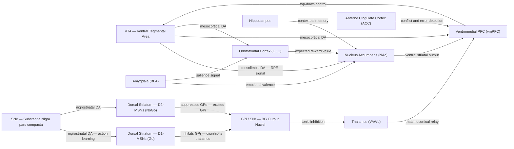

# Decision-Making and Reward Circuits

> [!abstract] TL;DR
> Reward circuits use dopamine not to signal pleasure itself, but to broadcast a prediction error — the difference between the reward that was expected and the reward that actually arrived — which drives learning about which actions are worth repeating. Decision-making integrates value signals computed across the orbitofrontal cortex (OFC), anterior cingulate cortex (ACC), and striatum, comparing options by their expected reward and selecting actions through the basal ganglia direct and indirect pathways. Addiction, depression, and impulsive disorders each represent a specific failure mode of this system: drugs artificially inflate the prediction error signal, hijacking the mesolimbic circuit and progressively eroding goal-directed choice in favour of compulsive habit.

---

## Intuition — analogy FIRST

Picture dopamine not as a "pleasure molecule" but as the brain's **surprise alarm**. The alarm stays silent when exactly what you expected happens. It fires loudly upward when something unexpectedly good occurs — and it fires a sharp negative blip when an expected reward fails to arrive. Over time, the brain learns to predict rewards so well that the alarm shifts back in time: eventually it fires at the moment you see the reward cue rather than at the reward itself, because the cue is now the first news of something good. This is the reward prediction error, and it is the master signal driving almost all motivated behavior.

Decision-making is a second intuition: think of it as a **continuous auction** running in your head. Every time you face a choice, each option places a bid equal to its estimated value — a number that folds together past experience, current body state, emotional tone, and cognitive appraisal. The brain's bidding floor is the orbitofrontal cortex; the auctioneer that picks the winner is the basal ganglia. The auction happens in milliseconds, and you experience the outcome as a seemingly effortless "I'll have the salad" or "I'll skip the gym today" — but underneath, an enormous circuit has just settled a competition.

---

## How It Works

### The Mesolimbic Dopamine Pathway

Dopamine neurons in the **ventral tegmental area (VTA)** project to the **nucleus accumbens (NAc)** — the core of the ventral striatum — via the mesolimbic pathway, and to the prefrontal cortex via the mesocortical pathway. These neurons are the biological substrate of the reward prediction error (RPE).

A parallel dopamine pathway runs from the **substantia nigra pars compacta (SNc)** along the **nigrostriatal pathway** to the **dorsal striatum (caudate nucleus and putamen)**, where it gates action selection through the direct and indirect pathways of the basal ganglia.

The four key stages of a learning trial:

1. **Before learning** — A reward arrives unexpectedly. VTA dopamine neurons fire a burst. δ > 0 (positive prediction error). The NAc releases dopamine, strengthening the synaptic weights on the neural representation of the just-preceding state. This is Hebb's rule implemented in dopaminergic chemistry.
2. **After partial learning** — A cue (conditioned stimulus) reliably predicts reward. When the cue appears, VTA neurons burst at cue onset. When the reward arrives at the expected time, dopamine neurons show no increase — the prediction has cancelled the signal. δ ≈ 0 at reward time; δ > 0 at cue time.
3. **Reward omission** — An expected reward fails to arrive. VTA dopamine neurons show a **pause** below baseline firing at the expected reward time. δ < 0. This drives avoidance learning — the brain updates its model to predict less from that cue.
4. **Habitual action** — After extensive training, behavior transfers from the ventral striatum (goal-directed, outcome-sensitive) to the dorsal striatum (habitual, outcome-insensitive). The circuit is now automatic and highly efficient but inflexible.

### Cortical Contributions to Value and Choice

- **Orbitofrontal cortex (OFC)** encodes the expected value of outcomes — how much reward a specific stimulus or option predicts, moment to moment. OFC neurons track value in real time and are critical for reversal learning: if reward contingencies change, OFC rapidly updates. Patients with OFC lesions persist in choosing now-suboptimal options (perseveration).
- **Anterior cingulate cortex (ACC)** monitors performance — specifically, it detects conflict between response options and signals when extra cognitive control is needed. Its ERP signature, the error-related negativity (ERN), fires within 100 ms of a wrong response. It also integrates effort cost into value computation: high-effort rewards recruit ACC strongly.
- **Ventromedial PFC (vmPFC)** integrates OFC value signals with emotional input from the amygdala, producing a summary "good/bad" signal. vmPFC damage is the lesion that disrupts the Iowa Gambling Task, underlying Damasio's somatic marker hypothesis.
- **Amygdala (basolateral complex, BLA)** assigns emotional valence — it reads the motivational significance of stimuli, particularly threats and appetitive cues. BLA projects to both NAc and OFC, modulating value computation with emotional weight.

### Basal Ganglia Action Selection

The basal ganglia implement a **winner-takes-all competition** through two parallel pathways:

- **Direct pathway (Go):** Cortex activates D1-receptor medium spiny neurons (MSNs) in the striatum. D1-MSNs inhibit the GPi/SNr (output nuclei), which releases the thalamus from inhibition — thalamus excites cortex and the action is executed.
- **Indirect pathway (NoGo):** Cortex activates D2-receptor MSNs. D2-MSNs inhibit GPe, releasing the subthalamic nucleus (STN), which then excites GPi/SNr — increasing inhibition on the thalamus and suppressing competing actions.

Dopamine from SNc acts as the **teaching signal for the basal ganglia**: it potentiates the direct (Go) pathway via D1 receptors and depresses the indirect (NoGo) pathway via D2 receptors. When dopamine is lost (Parkinson's disease), the NoGo pathway dominates — action initiation becomes effortful and slow (bradykinesia, akinesia).

### Circuit Diagram



---

## Key Concepts

### Secondary Level

**Dopamine and reward.** Dopamine is often called the "pleasure chemical" but this is a simplification. What dopamine actually encodes is the *discrepancy* between expected and received reward — the prediction error. More dopamine is released when a reward is better than expected; less than baseline is released when an expected reward is missed. This asymmetry is what makes dopamine a teaching signal rather than a happiness signal.

**Pleasure versus motivation: wanting vs. liking.** Kent Berridge's microdialysis and pharmacology work in rats separated two components of reward: *wanting* (incentive salience — the drive to pursue a reward, mediated by dopamine in the NAc) and *liking* (hedonic impact — the pleasure of receiving the reward, mediated by opioid and endocannabinoid systems in the hedonic hot-spots of the NAc shell). You can have massive dopamine surges (wanting) while experiencing minimal liking — which is exactly the state of a drug addict: intensely compelled yet barely enjoying the drug.

**Habit versus goal-directed behavior.** Behavior is goal-directed when it is sensitive to the current value of the outcome (devalue the food and the behavior stops). Behavior is habitual when it runs automatically regardless of outcome value. The neural substrate shifts from the prelimbic PFC and NAc core (goal-directed) to the infralimbic PFC and dorsolateral striatum (habitual) with overtraining. Drug addiction is partly a pathological entrenchment of habit control.

**Orbitofrontal cortex and decision-making.** The OFC codes the current expected value of options and is essential for flexible updating of that value. A classic test is a reversal learning task: subjects learn that stimulus A is rewarded; then reward switches to stimulus B. Humans and animals with OFC lesions keep choosing A well after the switch, indicating that OFC is necessary to update value representations, not merely to hold them.

**Drug addiction basics.** Drugs of abuse (cocaine, amphetamines, opioids, alcohol) all elevate dopamine in the NAc — some by blocking the dopamine transporter (cocaine, amphetamine), others via disinhibition of VTA (opioids, alcohol, cannabis). Each use creates a supraphysiological prediction error signal that is never matched by natural rewards. Over time, D2 receptor downregulation blunts the reward system's response to natural rewards (anhedonia), while drug cues acquire enormous incentive salience. The person is left wanting the drug intensely but liking almost nothing else.

---

### Undergraduate Level

**Schultz's dopamine prediction error neurons.** In 1997, Wolfram Schultz published a landmark *Science* paper recording from VTA/SNc dopamine neurons in behaving monkeys. The critical finding: in an untrained animal, a juice reward causes a burst of dopamine firing. After conditioning, when a CS reliably predicts juice, the burst shifts to the CS onset. When the CS is presented but juice is withheld, neurons show a *pause* below baseline at the expected reward time. This confirmed that these neurons compute a temporal difference prediction error — the brain's version of the Bellman equation.

**Temporal difference (TD) learning.** Schultz's data maps almost perfectly onto the TD(0) algorithm from reinforcement learning theory (Sutton & Barto, 1988). The TD error is:

$$\delta(t) = R(t) + \gamma \cdot V(t+1) - V(t)$$

where R(t) is immediate reward, V(t) is the estimated value of the current state, and γ is a temporal discount factor. When δ > 0, the previous state (or cue) was undervalued — strengthen its prediction. When δ < 0, the previous state was overvalued — weaken its prediction. The dopaminergic system implements this by modulating synapse strength on MSNs in the striatum through D1/D2 receptor signaling cascades.

**Mesolimbic versus mesocortical pathways.** Both arise from the VTA, but they differ in function:

| Pathway | Projection Target | Primary Function | Clinical Relevance |
|---------|------------------|------------------|--------------------|
| Mesolimbic | NAc, amygdala, hippocampus | Reward prediction error, incentive salience | Addiction, schizophrenia (positive symptoms — excess DA) |
| Mesocortical | PFC (dlPFC, OFC, ACC) | Working memory, cognitive flexibility, effort-based valuation | Schizophrenia (negative symptoms — DA deficit in PFC), depression, ADHD |

**OFC and reward value encoding.** OFC neurons fire in proportion to the subjective value of the expected reward — and this value is modulated by satiety, novelty, and context. Orbitofrontal neurons have been shown to encode specific sensory properties of rewards (flavour, texture, smell), not just abstract value, making OFC a rich sensory-value interface. The OFC's value map feeds into the NAc and vmPFC to bias choice.

**ACC error detection and conflict monitoring.** The dorsal ACC (dACC, Brodmann area 24) generates the error-related negativity (ERN) — a large negative EEG deflection peaking at ~80 ms after a commission error. Carter et al. (1998) showed with fMRI that ACC activates on conflict trials (e.g., incongruent Stroop stimuli), proportional to response conflict rather than error per se. Botvinick's conflict-monitoring theory: ACC detects the conflict signal; dorsolateral PFC then implements control. The ACC also tracks effort cost, signaling when a goal requires high cognitive expenditure.

**Risk versus ambiguity — the Ellsberg paradox.** Humans are willing to bet on risky gambles with known probabilities, but are strongly averse to ambiguous gambles with unknown probabilities. This is the Ellsberg paradox. Neuroimaging studies (Hsu et al., 2005) show that ambiguity (relative to risk) recruits the orbitofrontal cortex and amygdala more strongly, and the striatum less strongly, consistent with the view that ambiguity aversion is driven by an emotional alarm response rather than a rational probability calculation.

**Somatic marker hypothesis (Damasio / Iowa Gambling Task).** Antonio Damasio proposed that decision-making in complex social and financial situations relies not only on explicit valuation but on body-state signals ("somatic markers") that tag options with emotional associations from past experience. Evidence: patients with vmPFC damage perform normally on explicit reasoning tasks but fail the Iowa Gambling Task (IGT) — they keep selecting from decks with large immediate rewards but ruinous long-term losses, and they never develop the normal anticipatory skin conductance response (SCR) before making a bad choice. The SCR reflects the somatic marker generated by the amygdala-vmPFC circuit.

---

### Graduate Level

**Reinforcement learning algorithms mapped to neural circuits.** The actor-critic architecture (Barto 1983; Sutton & Barto 1998) provides the most influential mapping of RL to the brain:
- **Critic** (evaluates current policy) → VTA dopamine neurons computing δ. The critic receives input from NAc and vmPFC, estimates V(s), and broadcasts δ throughout the striatum.
- **Actor** (selects actions based on policy) → Dorsal striatum (putamen and caudate) updating action values Q(s,a) based on received δ. Direct-pathway MSNs learn to select actions that previously produced δ > 0; indirect-pathway MSNs learn to suppress actions that produced δ < 0.

The alternative **Q-learning** mapping assigns full Q(s,a) values to striatal neurons directly, without a separate critic. Controversy remains about which algorithm best describes individual animal behavior, but the actor-critic framework explains why dopaminergic lesions impair new learning (by eliminating the critic's error signal) more than they impair the execution of overlearned habits (which reside in the actor's stored policy).

**Prospect theory neural correlates.** Kahneman and Tversky's prospect theory holds that humans evaluate outcomes relative to a reference point, show diminishing sensitivity to gains and losses, and are loss-averse (losses feel roughly twice as bad as equivalent gains feel good). Neuroimaging maps these features onto specific circuits: the **convex value function for gains** (risk-aversion in gains) correlates with striatal activation that saturates for large rewards; **loss aversion** correlates with amygdala and insula responses to loss, over and above striatal reward signals. Tom et al. (2007) found that the slope of the striatal BOLD response to varying gains predicted individual differences in gain sensitivity, while the slope of amygdala deactivation to gains predicted loss aversion — the first neural decomposition of a behavioral economic parameter.

**Delay discounting — hyperbolic versus exponential.** Humans discount future rewards steeply, and do so in a *hyperbolic* manner (value ∝ 1/(1 + kD) where D = delay), not the exponential manner predicted by standard economic theory. Hyperbolic discounting creates dynamic inconsistency: a person prefers $10 now to $11 in a week, but when both are in the future, they prefer the $11. The neural basis: ventral striatum and vmPFC encode both immediate and delayed rewards but weight immediate rewards disproportionately (McClure et al., 2004). Dorsolateral PFC activation is associated with choosing delayed rewards, suggesting a competition between limbic-striatal immediacy and prefrontal patience. Impulsivity (trait measure) correlates with steeper discounting and lower D2 receptor binding in the striatum.

**Addiction as aberrant prediction error learning.** The incentive salience theory (Robinson & Berridge) and the prediction error hijacking model together explain addiction's hallmarks:
1. **Sensitization of wanting:** With repeated drug use, the mesolimbic circuit becomes sensitized — the same drug dose produces progressively larger dopamine surges in NAc (opposite to tolerance in the hedonic system). Drug cues acquire enormous incentive salience.
2. **Blunting of the natural reward signal:** Sustained dopamine elevation downregulates D2 receptors in the striatum and reduces baseline dopamine synthesis. Natural rewards (food, sex, socializing) now produce inadequate prediction errors — they are experienced as flat (anhedonia). The drug remains the only stimulus capable of producing a large δ.
3. **Compulsive habit formation:** With thousands of drug-taking trials, the behavior shifts from goal-directed (vmPFC/NAc-controlled) to habitual (infralimbic/dorsolateral striatum-controlled). Even if the addict no longer values the drug consciously, drug-taking is now a habit that context cues can trigger automatically.

**Optogenetics to probe VTA-NAc circuits.** Optogenetic tools have been transformative in dissecting mesolimbic function:
- **Optogenetic activation of VTA DA neurons** (channelrhodopsin, 20 Hz light pulses) at the time of a neutral CS is sufficient to cause that CS to acquire positive valence — conditioning in a single session.
- **Phasic inhibition of VTA DA neurons** (halorhodopsin) at expected reward time produces the behavioral equivalent of reward omission — animals learn to avoid cues that predict the inhibition.
- **Pathway-specific activation of VTA→NAc vs VTA→PFC projections** reveals dissociable roles: NAc-projecting DA encodes reward magnitude; PFC-projecting DA modulates cognitive flexibility. This anatomical specificity is invisible to systemic pharmacology.

**Individual differences in impulsivity — D2 receptor density.** Positron emission tomography (PET) studies using D2/D3 receptor radioligands (e.g., [11C]raclopride) consistently find that low striatal D2 receptor availability predicts impulsive decision-making and vulnerability to addiction across species. In non-human primates, low D2 availability assessed *before* cocaine exposure predicts subsequent escalation of drug self-administration. In humans, obese individuals show reduced striatal D2/D3 binding analogous to cocaine-addicted individuals — supporting the hypothesis that obesity and addiction share a common reward-circuit hypofunctionality. DRD2 Taq1A polymorphism (which reduces D2 receptor expression) is associated with increased impulsivity and substance use disorder risk.

---

## Python Demo

```python
# Temporal Difference (TD) Learning — Schultz Dopamine Prediction Error
#
# Classic Sutton-Barto TD(0) applied to Pavlovian conditioning:
#   Trial structure (T=10 time steps):
#       t=0-4  pre-cue baseline
#       t=5    conditioned stimulus (CS) onset
#       t=6-7  delay
#       t=8    unconditioned stimulus (US) = reward
#       t=9    post-reward
#
#   δ(t) = R(t) + γ·V(t+1) − V(t)   <-- the "dopamine" TD error
#   V(t) ← V(t) + α·δ(t)            <-- value update
#
# Key prediction verified: in early trials δ > 0 only at t=8 (reward).
# As V(cue) builds, δ shifts backward to t=5 (CS onset).
# At asymptote, δ ≈ 0 at reward time and peaks at cue time.
# This replicates Schultz et al. (1997) single-unit VTA recordings.

import numpy as np
import matplotlib.pyplot as plt

np.random.seed(0)

N_TRIALS = 60
T = 10
CUE_T = 5
REW_T = 8
ALPHA = 0.15   # learning rate
GAMMA = 0.95   # temporal discount

V = np.zeros(T)

td_errors_history = np.zeros((N_TRIALS, T))
value_history = np.zeros((N_TRIALS, T))

for trial in range(N_TRIALS):
    R = np.zeros(T)
    R[REW_T] = 1.0

    delta = np.zeros(T)
    for t in range(T - 1):
        delta[t] = R[t] + GAMMA * V[t + 1] - V[t]
        V[t] += ALPHA * delta[t]
    delta[T - 1] = R[T - 1] - V[T - 1]
    V[T - 1] += ALPHA * delta[T - 1]

    td_errors_history[trial] = delta.copy()
    value_history[trial] = V.copy()

fig, axes = plt.subplots(1, 2, figsize=(14, 5))

# Left: heatmap of TD error — rows = trials, cols = time steps
im = axes[0].imshow(
    td_errors_history.T, aspect="auto", origin="lower",
    cmap="RdBu_r", vmin=-0.6, vmax=0.6
)
axes[0].set_xlabel("Trial Number")
axes[0].set_ylabel("Time Step Within Trial")
axes[0].set_title("TD Error δ(t) Across Learning\n(Dopamine Prediction Error)")
axes[0].axhline(CUE_T - 0.5, color="gold", lw=2, ls="--", label="CS / Cue onset (t=5)")
axes[0].axhline(REW_T - 0.5, color="lime", lw=2, ls="--", label="US / Reward (t=8)")
axes[0].legend(fontsize=8, loc="upper right")
plt.colorbar(im, ax=axes[0], label="TD Error δ")

# Right: error profile at three stages of learning
t_axis = np.arange(T)
stages = [
    ("Early (trials 1-5)",   slice(0,  5),  "#E91E63"),
    ("Mid  (trials 25-30)", slice(25, 30), "#FF9800"),
    ("Late  (trials 55-60)", slice(55, 60), "#2196F3"),
]
for label, sl, color in stages:
    axes[1].plot(t_axis, td_errors_history[sl].mean(axis=0),
                 marker="o", lw=2, color=color, label=label)

axes[1].axvline(CUE_T, color="gold", lw=2, ls="--", label="CS onset (t=5)")
axes[1].axvline(REW_T, color="lime", lw=2, ls="--", label="US / Reward (t=8)")
axes[1].axhline(0, color="grey", lw=1)
axes[1].set_xlabel("Time Step Within Trial")
axes[1].set_ylabel("Mean TD Error δ")
axes[1].set_title("RPE Shifts from Reward to Cue\nas Learning Progresses")
axes[1].legend(fontsize=8)
axes[1].set_xticks(t_axis)

plt.tight_layout()
plt.savefig("td_learning_dopamine_shift.png", dpi=150)
plt.show()

print(f"Early peak delta at t = {np.argmax(td_errors_history[:5].mean(0))}")
print(f"Late  peak delta at t = {np.argmax(td_errors_history[55:].mean(0))}")
# Expected output:
#   Early peak delta at t = 8   (reward time)
#   Late  peak delta at t = 5   (cue time) -- the Schultz shift
```

The left heatmap shows the red positive error propagating backward from t=8 toward t=5 over trials, matched by a growing green negative error at t=8 at asymptote (because V(8) now correctly predicts the reward so no surprise remains). This is the computational signature of dopamine neurons performing temporal credit assignment.

---

## Real-World Applications

**Drug addiction.** Cocaine blocks the dopamine transporter (DAT), preventing reuptake and flooding the NAc with dopamine — a supraphysiological RPE signal that no natural reward can replicate. Heroin and opioids activate mu-opioid receptors on GABAergic interneurons in the VTA, disinhibiting dopamine neurons and causing indirect dopamine flooding. After chronic use, D2 receptor downregulation means the basal level of NAc dopamine signaling is chronically insufficient — the addict is anhedonic without the drug. Treatment with D2 partial agonists (e.g., aripiprazole) or naltrexone (opioid antagonist blocking drug-induced RPE) partially restores signaling tone.

**Depression and anhedonia.** Major depressive disorder is associated with blunted striatal activation to anticipated rewards (BOLD response reduced in NAc and caudate), reduced baseline dopamine synthesis in the striatum, and reduced connectivity between vmPFC and striatum. The hedonic "wanting" signal is partially intact (patients still report preferring one option), but the sharpness of the RPE signal is diminished — everything feels flat. Ketamine's rapid antidepressant effect (within hours) is partly attributed to rapid restoration of synaptic plasticity in mPFC and recovery of reward-circuit sensitivity.

**ADHD and impulsivity.** ADHD involves dopaminergic dysfunction in the prefrontal-striatal circuit: reduced dopamine availability in the dlPFC (impairing working memory and inhibitory control) and altered D1/D2 signaling in the striatum (increasing impulsivity and reward-seeking). Methylphenidate and amphetamine both raise synaptic dopamine by blocking DAT, restoring PFC dopamine to an optimal level — the inverted-U dose-response of PFC dopamine (too little or too much both impair function) explains why therapeutic doses improve cognition while street doses worsen it.

**Behavioral economics and nudge design.** Because the reward circuit discounts future rewards hyperbolically and is loss-averse, decision environments ("choice architectures") can be designed to exploit or counteract these biases. Automatic enrollment in pension plans leverages status quo bias (inertia). Default organ donation ("opt-out") exploits the same mechanism. Commitment devices (Ulysses contracts, e.g., Stickk.com) help people in a state of patient deliberation bind their future impulsive selves — exploiting the knowledge that the PFC-controlled patient self and the limbic-driven impulsive self have different preferences at different time points.

**Deep brain stimulation for OCD.** In treatment-resistant OCD, the hyperactive indirect pathway creates excessive suppression of thalamic activity, preventing goal-directed action completion and causing compulsive behavioral loops. DBS of the anterior limb of the internal capsule (ALIC) or the nucleus accumbens disrupts this hypersynchrony. In ~50-60% of cases, DBS substantially reduces OCD symptom severity. The same target (NAc/ventral striatum) has shown preliminary results in treatment-resistant depression, consistent with the reward circuit framework of both disorders.

**Neuroeconomics.** Neuroeconomics uses neuroimaging and patient studies to test the mechanistic assumptions of economic models. Key findings: (1) The brain does not use a single currency for all decisions — the vmPFC computes subjective value but this is influenced by social context, framing, and somatic state, not just probability × magnitude. (2) Neural value signals can predict individual choices better than the best economic model when the latter does not account for loss aversion or ambiguity aversion. (3) Causal manipulations (TMS to dlPFC, OFC lesions) show dissociable effects on specific parameters — separating decision-theoretic constructs in a way that behavioral data alone cannot.

---

## Common Pitfalls

- **Dopamine is not a pleasure signal** — The most common lay and clinical misconception. Dopamine encodes the *prediction error*, not the hedonic experience. Hedonic impact ("liking") is mediated by opioid and endocannabinoid systems in the nucleus accumbens shell and parabrachial nucleus. You can have high dopamine with zero liking (e.g., addicts in withdrawal craving with no enjoyment). Conversely, dopamine blockade with antipsychotics reduces "wanting" (motivation, incentive salience) without necessarily reducing "liking." This distinction matters clinically: anhedonia in depression involves blunted liking, but the motivational deficit (not wanting to do anything) involves blunted dopaminergic wanting.

- **NAc is not just a "drug reward structure"** — The nucleus accumbens mediates incentive salience for ALL motivated behavior: food, sex, social interaction, novelty, music, monetary reward. Drugs hijack a general-purpose value circuit; they do not activate a dedicated "pleasure center." Framing NAc as a drug-reward organ obscures its role in everyday decision-making and motivated action.

- **Wanting does not imply liking (Berridge dissociation)** — Selective ablation of dopaminergic neurons with 6-OHDA in the rat's NAc abolishes food-seeking behavior (wanting) while leaving hedonic reactions to sucrose intact (liking, measured by tongue protrusions). Conversely, microinjection of amphetamine into the NAc greatly amplifies food-seeking without enhancing hedonic impact. This double dissociation is one of the strongest proofs that wanting and liking are separable neural processes, not two faces of the same coin.

- **OFC damage does not abolish decision-making** — OFC lesion patients are still capable of choosing between options, understanding probabilities, and reasoning verbally about outcomes. What fails is the flexible *updating* of value representations when contingencies change (impaired reversal learning) and the use of somatic markers in complex, ambiguous, emotionally relevant real-life decisions. Simple lottery tasks with explicit probabilities may be performed normally, which has misled clinicians into concluding that OFC patients have intact decision-making. The deficit emerges when rapid value updating and emotional guidance are required.

- **Conflating the direct and indirect pathways with "reward and punishment"** — The direct (Go) pathway facilitates the currently selected action; the indirect (NoGo) pathway suppresses competing actions. Neither is purely "reward" or "punishment." Both pathways learn from prediction errors; both are modulated by dopamine. The confusion arises because D1 (direct) is potentiated by dopamine and D2 (indirect) is depressed by it, so high dopamine favors execution — but this is about action selection, not hedonic valence.

---

## Related Concepts

- [[_MOC_Cognitive_Neuroscience|↑ Cognitive Neuroscience MOC]] — section map linking all seven cognitive neuroscience topics in this vault section
- [[Limbic_System_and_Diencephalon]] — provides the anatomical substrate for reward circuits: the amygdala (emotional valence), hippocampus (contextual memory), and hypothalamus (homeostatic drive) all feed directly into the mesolimbic dopamine system
- [[Cerebellum_and_Basal_Ganglia]] — basal ganglia direct and indirect pathways implement the action-selection competition that decision-making resolves; cerebellar forward models contribute to effort cost estimation
- [[Learning_and_Memory_Systems]] — dopaminergic prediction error learning is the reward-specific instantiation of Hebbian synaptic plasticity; memory consolidation in the hippocampus is modulated by NAc dopamine during emotionally salient experiences
- [[Psychiatric_Disorders_and_Neurobiology]] — addiction, depression, ADHD, schizophrenia, and OCD each represent a distinct failure mode of the reward-decision circuit described here
- [[Motor_System_and_Motor_Control]] — the basal ganglia's direct/indirect pathway architecture is shared between reward-driven action selection and voluntary motor control; dopaminergic loss in Parkinson's impairs both
- [[Synaptic_Plasticity_and_LTP]] — NMDA-receptor LTP is the cellular mechanism underlying prediction error learning in the striatum; dopamine gates corticostriatal LTP/LTD by modulating the threshold for potentiation in MSNs
- [[Reinforcement_Learning]] (AI-ML vault) — the mathematical framework (TD learning, Q-learning, actor-critic) that the dopaminergic reward circuit appears to implement; the biological system directly inspired the algorithmic one
- [[Behavioral_Economics_Psychology]] (Psychology vault) — prospect theory, delay discounting, and loss aversion are behavioral signatures that the reward circuit's architecture predicts and that neuroeconomics has localized to specific neural substrates

---

## Review Questions

1. **(Secondary)** A rat is trained until it reliably presses a lever for food. You then devalue the food reward by pairing it with illness (conditioned taste aversion). If the rat continues pressing the lever at the same rate despite the devaluation, what does this tell you about which neural circuit now controls the behavior? What would you have to do experimentally to confirm this interpretation?

2. **(Undergraduate)** A patient with a bilateral OFC lesion and a patient with a bilateral amygdala lesion are both given the Iowa Gambling Task and a standard reversal learning task. Predict which task each patient will fail, which they will pass, and the expected pattern of skin conductance responses. Justify your predictions using the anatomical projections of OFC and amygdala described in this note.

3. **(Graduate)** In the actor-critic framework, the dopaminergic RPE signal (δ) is broadcast diffusely to both the ventral and dorsal striatum. Yet addiction produces a selective sensitization of mesolimbic (ventral) circuits while cognitive control via mesocortical circuits degrades. Using what you know about D1/D2 receptor distribution, pathway-specific optogenetic findings, and receptor downregulation dynamics, propose a mechanistic account of why the same dopamine signal produces opposite long-term changes in these two circuits after chronic drug exposure.

---

## Sources

- [Schultz, W. "A neural substrate of prediction and reward." *Science* 275, 1593–1599 (1997)](https://www.science.org/doi/10.1126/science.275.5306.1593)
- [Rangel, A., Camerer, C. & Montague, P.R. "A framework for studying the neurobiology of value-based decision making." *Nature Reviews Neuroscience* 9, 545–556 (2008)](https://www.nature.com/articles/nrn2357)
- [Dayan, P. & Niv, Y. "Reinforcement learning: The Good, the Bad and the Ugly." *Current Opinion in Neurobiology* 18, 185–196 (2008)](https://www.sciencedirect.com/science/article/pii/S0959438808000767)
- [Sutton, R.S. & Barto, A.G. *Reinforcement Learning: An Introduction*, 2nd ed. MIT Press (2018)](http://incompleteideas.net/book/the-book-2nd.html)
- [Berridge, K.C. & Robinson, T.E. "What is the role of dopamine in reward: hedonic impact, reward learning, or incentive salience?" *Brain Research Reviews* 28, 309–369 (1998)](https://www.sciencedirect.com/science/article/pii/S0165017398000198)
- [Damasio, A.R. *Descartes' Error: Emotion, Reason, and the Human Brain.* Putnam (1994)](https://www.penguinrandomhouse.com/books/74399/descartes-error-by-antonio-r-damasio/)
- [Tom, S.M. et al. "The neural basis of loss aversion in decision-making under risk." *Science* 315, 515–518 (2007)](https://www.science.org/doi/10.1126/science.1134239)
- [McClure, S.M. et al. "Separate neural systems value immediate and delayed monetary rewards." *Science* 306, 503–507 (2004)](https://www.science.org/doi/10.1126/science.1100907)
- [Hsu, M. et al. "Neural systems responding to degrees of uncertainty in human decision-making." *Science* 310, 1680–1683 (2005)](https://www.science.org/doi/10.1126/science.1115327)

---

#Neuroscience #CognitiveNeuroscience #DecisionMaking #RewardCircuits #Dopamine
