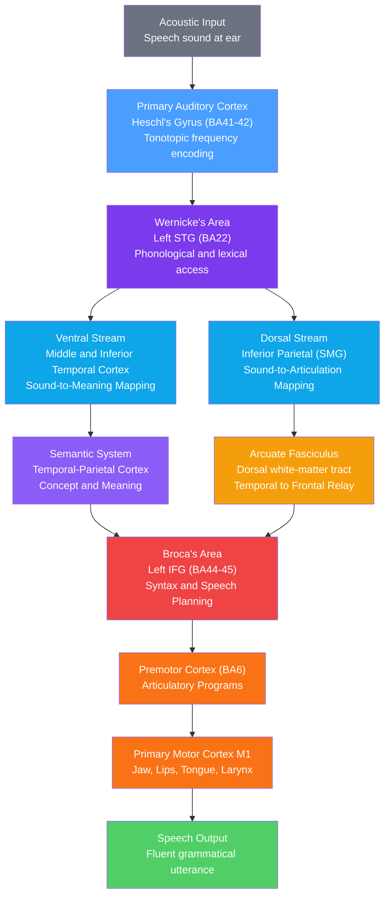

# Language and the Brain

> [!abstract] TL;DR
> Language is lateralized to the left hemisphere in approximately 95% of right-handers and ~70% of left-handers, making it the most strongly lateralized of all higher cognitive functions. Within the left perisylvian cortex, Broca's area (inferior frontal gyrus, BA44/45) drives speech production and syntactic computation while Wernicke's area (superior temporal gyrus, BA22) underpins speech comprehension and lexical-semantic access. The arcuate fasciculus — a white-matter dorsal-stream tract — connects these two regions, and its selective damage produces conduction aphasia: fluent speech with intact comprehension but a profound inability to repeat.

---

## Intuition — analogy FIRST

Think of a large research library. The **reference section** holds every word, meaning, and concept the library owns — this is **Wernicke's area**, the brain's dictionary and comprehension engine. When you hear speech, you are searching that library for matching entries. The **printing press and grammar department** on the other side of the building is **Broca's area**: it takes ideas from the library, assembles them into grammatical sentences, and drives the physical act of speaking. Connecting the two departments is a dedicated internal telephone line — the **arcuate fasciculus**. If the library burns down you cannot understand speech (Wernicke's aphasia). If the printing press breaks you cannot produce fluent speech (Broca's aphasia). If only the telephone line is cut you can understand perfectly and still speak fluently, but you cannot relay a message verbatim — you cannot repeat (conduction aphasia).

Two things make this analogy richer than it first appears. First, the telephone line is not a simple wire: it is the **dorsal stream**, one of two parallel highways (the other is the **ventral stream**) that carry speech information to different destinations for different purposes. Second, neither "department" works alone — language recruits a distributed bilateral network, and the left hemisphere's dominance is a statistical tendency, not an absolute rule.

---

## How It Works

### Classic Wernicke-Lichtheim Model (19th century)

Carl Wernicke (1874) proposed that aphasia syndromes arise from damage to two cortical centers or the fiber tract linking them:

1. **Broca's area** — motor speech center in left IFG; drives articulation
2. **Wernicke's area** — auditory speech center in left STG; stores sound patterns of words
3. **Arcuate fasciculus** — the fiber tract; damage produces conduction aphasia

Ludwig Lichtheim extended this to include a third "concept center," producing a taxonomy of seven aphasia types depending on which node or connection is lesioned (Lichtheim, 1885). This box-and-arrow model is conceptually powerful but anatomically oversimplified.

### Modern Dual-Stream Model (Hickok & Poeppel, 2007)

Contemporary neuroimaging and lesion studies replace the single-tract model with **two parallel processing streams** originating from bilateral auditory cortex:

| Stream | Pathway | Function | Key areas |
|--------|---------|----------|-----------|
| **Dorsal** | STG → inferior parietal (SMG/AG) → premotor/IFG | Sound-to-articulation mapping; sensorimotor integration; repetition | Left posterior STG, Spt area, Broca's BA44 |
| **Ventral** | STG → middle/inferior temporal → IFG | Sound-to-meaning mapping; word recognition; semantics | Bilateral MTG/ITG, anterior temporal lobe |

The dorsal stream is strongly left-lateralized and is critical for speech production, repetition, and the processing of syntactically complex sentences. The ventral stream is more bilateral and handles lexico-semantic access — explaining why semantic comprehension survives right hemisphere damage better than phonological processing does.

### Speech Comprehension Pathway

Acoustic energy activates the cochlea → auditory nerve → medial geniculate nucleus → **primary auditory cortex** (Heschl's gyrus, BA41/42). From there, auditory information fans out bilaterally to **belt and parabelt regions** (posterior STG). In the left hemisphere, this feeds into Wernicke's area for phonological analysis and then into the ventral stream for semantic retrieval.

### Speech Production Pathway

Intended meaning is assembled in conceptual-semantic regions (posterior temporal and parietal cortex) and fed to **Broca's area** (left BA44/45) for syntactic sequencing and phonological encoding. Broca's area projects to **premotor cortex (BA6)**, which generates the motor programs for articulation, then to **primary motor cortex (M1)** which commands the jaw, lips, tongue, velum, and larynx in millisecond-precise coordination.

### Pathway Diagram



---

## Key Concepts / Details

### Secondary Level

**Broca's Area — Left Inferior Frontal Gyrus (BA44/45)**

Broca's area occupies the **pars opercularis (BA44)** and **pars triangularis (BA45)** of the left inferior frontal gyrus. Paul Broca described it in 1861 based on his patient "Tan" (Louis Victor Leborgne), who could say only the syllable "tan" despite preserved comprehension. Broca's aphasia is characterised by:

- **Non-fluent, effortful, telegraphic speech**: short phrases, omission of grammatical function words and inflections ("agrammatism")
- **Relatively preserved comprehension**: patients understand simple sentences but struggle with syntactically complex ones (e.g., passive constructions, centre-embedded relative clauses)
- **Impaired repetition**
- Typically caused by infarction of the left MCA territory (inferior division)

**Wernicke's Area — Left Superior Temporal Gyrus (BA22)**

Carl Wernicke described it in 1874. Wernicke's aphasia is characterised by:

- **Fluent speech**: normal rate, rhythm, and phrase length — but filled with **paraphasias** (phonemic substitutions: "treen" for "green"; semantic substitutions: "chair" for "table"; neologisms: invented non-words)
- **Severely impaired comprehension**: patients cannot reliably follow commands or answer yes/no questions
- **Impaired repetition**
- Jargon aphasia (in severe cases): continuous, fluent, meaningless speech output

**The Aphasia Classification Table**

| Type | Fluency | Comprehension | Repetition | Naming | Lesion site |
|------|---------|---------------|------------|--------|-------------|
| Broca's | Non-fluent | Relatively preserved | Impaired | Impaired | Left IFG (BA44/45) |
| Wernicke's | Fluent | Severely impaired | Impaired | Impaired | Left posterior STG (BA22) |
| Conduction | Fluent | Preserved | Severely impaired | Impaired | Arcuate fasciculus / SMG |
| Global | Non-fluent | Severely impaired | Impaired | Impaired | Large left perisylvian |
| Transcortical motor | Non-fluent | Preserved | Preserved | Impaired | Anterior supplementary motor area |
| Transcortical sensory | Fluent | Impaired | Preserved | Impaired | Posterior temporal-parietal junction |
| Anomic | Fluent | Preserved | Preserved | Severely impaired | Angular gyrus / MTG |

**Arcuate Fasciculus and Conduction Aphasia**

The arcuate fasciculus is the primary white-matter component of the dorsal stream, sweeping from posterior STG/MTG around the Sylvian fissure into Broca's area and premotor cortex. Damage (typically from embolic stroke) disconnects phonological output encoding (Broca's) from phonological input representation (Wernicke's), producing conduction aphasia: fluent, paraphasic speech with good comprehension but a striking inability to repeat words or sentences verbatim. Patients often show **conduite d'approche**: successive attempts to correct their own phonemic errors, spiralling toward but never reaching the target.

**Handedness and Hemispheric Lateralization**

- Right-handers: ~95% left hemisphere language dominant
- Left-handers: ~70% left, ~15% right, ~15% bilateral
- Ambidextrous individuals: more variable, slightly higher rates of bilateral representation
- Lateralization is present even in infants (planum temporale asymmetry at birth) and in fetal brains

---

### Undergraduate Level

**The Dual-Stream Model in Detail (Hickok & Poeppel, 2007)**

The conceptual shift from Wernicke-Lichtheim to the dual-stream model mirrors the vision science distinction between the dorsal ("where/how") and ventral ("what") streams:

- **Dorsal stream (dorsal-to-frontal)**: posterior STG → Spt (Sylvian-parietal-temporal junction) → premotor cortex → Broca's BA44. Critically left-lateralized. Supports: auditory-motor integration, speech repetition, mapping of phonological sequences onto articulatory gestures, syntactically complex sentence processing. Damage → repetition deficits, conduction aphasia.
- **Ventral stream (temporal-to-temporal/frontal)**: bilateral STG → MTG/ITG → anterior temporal lobe → BA47/45. More bilateral. Supports: lexical access, semantic processing, word meaning. Damage → word-finding deficits, semantic paraphasia.

An important implication: semantic comprehension should survive small left-hemisphere lesions better than phonological repetition, which it does clinically.

**The Perisylvian Language Network**

The "language areas" cluster around the Sylvian fissure (lateral sulcus):
- Anterior: Broca's area (left IFG)
- Superior: primary auditory cortex + planum temporale
- Posterior: Wernicke's area (left STG), supramarginal gyrus (SMG, BA40), angular gyrus (AG, BA39)
- Connecting white matter: arcuate fasciculus, superior longitudinal fasciculus, uncinate fasciculus

The **planum temporale** (posterior STG within the Sylvian fissure) shows a marked left-right asymmetry (larger on the left in ~65% of people) and is considered part of the phonological processing substrate.

**Wada Test and Hemispheric Lateralization**

Before epilepsy surgery or tumor resection near language cortex, surgeons must confirm which hemisphere is language-dominant. The **Wada test** (sodium amobarbital test):
1. Inject sodium amobarbital into the internal carotid artery
2. The drug temporarily anesthetizes the ipsilateral hemisphere (~5-10 minutes)
3. Test the patient's language production, comprehension, and memory during anesthesia of each hemisphere
4. The hemisphere whose anesthesia disrupts language = dominant hemisphere

The Wada test is invasive (intra-arterial catheter) and has been largely replaced by **task-based fMRI lateralization indices** in many centers, though Wada remains the gold standard where surgical stakes are highest.

**Intraoperative Language Mapping (Awake Craniotomy)**

Tumors or epileptic foci in or near Broca's/Wernicke's areas require **awake craniotomy**: the patient is kept conscious during cortical resection and asked to perform language tasks (picture naming, sentence reading) while the surgeon applies **direct cortical stimulation (DCS)**. When stimulation of a cortical site disrupts language performance (speech arrest, anomia, paraphasia), that site is marked as a "positive language site" and avoided during resection. DCS works by transiently disrupting local function — the functional inverse of an ablation. This approach preserves language while maximising tumor or seizure-focus removal.

**Prosody and the Right Hemisphere**

The emotional tone of speech — its **prosody** (rhythm, intonation, stress, emotional coloring) — is processed preferentially by the **right hemisphere**. Right-hemisphere damage causes **aprosodia**: patients speak in a flat, emotionless monotone and cannot interpret the emotional intonation of others. This shows that language is not solely a left-hemisphere phenomenon; the right hemisphere contributes the music to the left hemisphere's words.

**Second Language Acquisition and Cortical Representation**

- **Early bilinguals** (acquired L2 before age ~5): both languages represented in overlapping regions within Broca's area
- **Late bilinguals** (acquired L2 after puberty): L1 and L2 show slightly spatially segregated but adjacent representations within Broca's area; L2 activates more extensive prefrontal cortex, reflecting greater cognitive effort
- The **critical/sensitive period** for native-like phonological acquisition closes around puberty (Lenneberg hypothesis); it closes later for syntax and vocabulary
- After extensive L2 use, cortical representations converge — supporting neuroplasticity in language networks throughout adulthood

**Sign Language Uses the Same Neural Architecture**

One of the most powerful demonstrations that language is an abstract cognitive system, not a modality-specific sensorimotor one: deaf native signers of American Sign Language (ASL) or British Sign Language (BSL) show **left-hemisphere dominance** for sign processing, with Broca's and Wernicke's areas activated by signed language production and comprehension respectively. Deaf signers with left-hemisphere strokes develop signing aphasias that mirror spoken aphasias — including sign-language versions of agrammatism. Language is in the brain, not in the mouth.

---

### Graduate Level

**Neural Correlates of Chomsky's Minimalist Program**

Chomsky's Minimalist Program posits that the core syntactic operation is **Merge**: combining two syntactic objects into a new hierarchically structured object. External merge builds phrase structure; internal merge (movement) creates dependencies across a sentence (e.g., wh-movement, passivization). Neuroimaging evidence:

- Left BA44 (posterior Broca's): preferentially activated by syntactic structure-building — more active for hierarchically structured word sequences than for lists or scrambled sequences (Pallier et al., 2011)
- Left BA45/47: more activated by semantic composition and integration with context
- The **left anterior temporal lobe**: activated by combinatorial (phrase-level) semantics — the composition of word meanings — suggesting it implements **internal merge or semantic composition** (Pylkkanen, 2019)
- Long-distance syntactic dependencies (centre-embedded relative clauses) increase bilateral IFG and left posterior temporal cortex activity, reflecting working-memory demands of maintaining unfilled syntactic positions

**Predictive Processing in Language: the N400 ERP Component**

The **N400** is a negative-going event-related potential (ERP) component peaking ~400 ms after word onset, first described by Kutas & Hillyard (1980). Key properties:

- **Distribution**: maximal over central-posterior scalp (Cz, Pz), bilaterally
- **Generators**: middle and superior temporal gyri (MEG/fMRI localisation)
- **Functional significance**: inversely related to the **contextual predictability (cloze probability)** of a word. A word that completes "She spread butter on the \_\_\_" with "bread" produces a small N400; completing with "socks" produces a large N400
- **Interpretation**: the N400 reflects the effort required to access and integrate a word's meaning into the current discourse context — it is a neural index of **semantic prediction error**
- N400 amplitude is modulated by: word frequency, semantic priming, discourse coherence, sentence position, and working memory

**The P600 ERP Component: Syntactic Processing**

The **P600** is a positive-going component peaking ~600 ms post-word-onset, maximal over posterior scalp:

- Elicited by **syntactic violations** ("The cat was chased the dog" — agreement error, phrase structure error)
- Also elicited by **syntactic ambiguities requiring reanalysis** (garden-path sentences: "The horse raced past the barn fell")
- Interpreted as reflecting syntactic reanalysis, revision of the initial parse, or repair processes in the syntactic parser
- Distinct from the N400: a sentence can elicit a large P600 and a small N400 (syntactically anomalous but semantically plausible) or vice versa

**Individual Differences in Language Lateralization**

Lateralization is not binary. The **laterality index (LI)** computed from fMRI activation asymmetry:

$$LI = \frac{A_{left} - A_{right}}{A_{left} + A_{right}}$$

where $A$ is activation magnitude in a ROI. LI ranges from +1 (fully left-lateralized) to −1 (fully right-lateralized). Population distribution is roughly bimodal (peak near +0.7 for right-handers) but with substantial variance. Factors affecting LI:

- Handedness (strongest predictor, but many left-handers are still left-dominant)
- Sex (women show slightly more bilateral language on average, though effect sizes are small)
- Task type (phonological > semantic for degree of left-lateralization)
- Age (development: lateralization increases from childhood to adolescence)

**Reading Networks and the Visual Word Form Area (VWFA)**

Written language is a cultural technology (~5,400 years old) too recent to have a dedicated genetic substrate. The brain repurposes pre-existing networks:

- **Visual Word Form Area (VWFA)**: left fusiform gyrus (occipito-temporal sulcus, BA37). Responds preferentially to strings of letters, especially real words > consonant strings > symbol strings. Dubbed the "letterbox" by Dehaene. Connects visual input to the left temporal language system via the inferior longitudinal fasciculus.
- **Phonological pathway**: VWFA → left inferior temporal → left STG (Wernicke's) — grapheme-to-phoneme conversion
- **Semantic pathway**: VWFA → left inferior temporal → angular gyrus → semantic system

**Dyslexia: Phonological Deficit Hypothesis**

Developmental dyslexia (prevalence ~5-10%) is characterized by difficulty acquiring fluent reading despite adequate intelligence and instruction. The dominant neurocognitive account is the **phonological deficit hypothesis** (Shaywitz, Ramus, Snowling):

- Core deficit in the ability to segment and manipulate phonemes (phonological awareness)
- Impairs grapheme-to-phoneme mapping — the foundation of alphabetic reading
- Neural correlates: hypoactivation of left posterior temporal cortex (VWFA, angular gyrus, posterior STG) during reading; compensatory hyperactivation of right hemisphere and left inferior frontal cortex
- Diffusion tensor imaging (DTI) shows reduced fractional anisotropy in left arcuate fasciculus and superior longitudinal fasciculus in dyslexic readers

**Embodied Semantics**

The "embodied" or "grounded" view of semantics holds that word meanings are not stored as amodal symbols but are partially constituted by sensorimotor simulations:

- Action words ("kick," "pick," "lick") preferentially activate premotor cortex regions organized somatotopically (leg, hand, mouth regions respectively) — Tettamanti et al., 2005
- Colour words activate early visual cortex (V4)
- Smell words activate primary olfactory cortex
- This challenges classical localist models where Wernicke's area is the sole semantic repository; semantics is distributed across modality-specific cortices, with temporal-parietal junction as a convergence hub

**Large Language Models vs. Neural Language Processing**

Transformer-based LLMs (GPT, BERT) and the brain's language system share some computational principles but differ fundamentally:

| Feature | Brain | LLM |
|---------|-------|-----|
| Architecture | Recurrent, hierarchical, layered cortex | Feedforward transformer layers |
| Temporal processing | Millisecond-resolution sequential processing | Parallel token processing |
| Learning signal | Prediction error + neuromodulation + sleep consolidation | Gradient descent on next-token prediction |
| N400 analog | Contextual prediction error, ~400 ms | Surprisal score (negative log probability) |
| Embodiment | Grounded in sensorimotor experience | None — text-only training |
| Syntax vs. semantics | Partially dissociated (N400/P600, Broca/Wernicke) | Entangled in attention heads |

EEG studies using LLM surprisal values as predictors of N400 amplitude show that transformer surprisal accounts for substantial variance in neural prediction-error responses — suggesting overlapping computational strategies despite divergent implementations.

---

## Python Demo

```python
import numpy as np
import matplotlib.pyplot as plt

# Simulate the N400 ERP: semantic prediction error for expected vs unexpected words
# Sentence frame: "She spread butter on the ___"
# Congruent target: "BREAD"  (high cloze probability ~ expected)
# Incongruent target: "SOCKS" (zero cloze probability ~ semantic anomaly)
#
# The N400 is modelled as a Gaussian deflection (negative polarity in EEG convention)
# with amplitude proportional to semantic prediction error.

np.random.seed(42)

# Time axis: -200 to 800 ms relative to critical word onset
t = np.linspace(-200, 800, 1000)
dt = t[1] - t[0]

def erp_template(t, n400_amp, p600_amp=0.0,
                 n400_peak=400, n400_width=80,
                 p600_peak=600, p600_width=100):
    """
    Composite ERP: N400 (negative Gaussian) + optional P600 (positive Gaussian)
    plus a small earlier positivity (P200 for word recognition).
    """
    p200 = 0.8 * np.exp(-0.5 * ((t - 200) / 40) ** 2)
    n400 = -n400_amp * np.exp(-0.5 * ((t - n400_peak) / n400_width) ** 2)
    p600 = p600_amp * np.exp(-0.5 * ((t - p600_peak) / p600_width) ** 2)
    return p200 + n400 + p600

n_trials = 40
noise_sd = 0.6

# --- Condition 1: Congruent word ("BREAD") ---
# Small N400 (low prediction error), no P600 (no syntactic violation)
congruent_trials = np.array([
    erp_template(t, n400_amp=1.2) + noise_sd * np.random.randn(len(t))
    for _ in range(n_trials)
])

# --- Condition 2: Semantic anomaly ("SOCKS") ---
# Large N400 (high prediction error), no syntactic violation
anomaly_trials = np.array([
    erp_template(t, n400_amp=4.5) + noise_sd * np.random.randn(len(t))
    for _ in range(n_trials)
])

# --- Condition 3: Syntactic violation ("She spread butter on the was") ---
# Small N400 (word-level semantics recoverable), large P600 (syntactic reanalysis)
syntactic_trials = np.array([
    erp_template(t, n400_amp=1.5, p600_amp=3.5) + noise_sd * np.random.randn(len(t))
    for _ in range(n_trials)
])

# Grand-average ERPs
erp_cong   = congruent_trials.mean(axis=0)
erp_anom   = anomaly_trials.mean(axis=0)
erp_syn    = syntactic_trials.mean(axis=0)
diff_n400  = erp_anom  - erp_cong   # N400 difference wave
diff_p600  = erp_syn   - erp_cong   # P600 difference wave

# --- Plotting ---
fig, axes = plt.subplots(3, 1, figsize=(11, 10), sharex=True)

# Panel 1: Three ERP waveforms
ax1 = axes[0]
ax1.plot(t, erp_cong, color='steelblue',  lw=2.0, label='Congruent ("BREAD")')
ax1.plot(t, erp_anom, color='firebrick',  lw=2.0, label='Semantic anomaly ("SOCKS")')
ax1.plot(t, erp_syn,  color='darkorange', lw=2.0, label='Syntactic violation')
ax1.axvline(0,   color='gray', ls='--', lw=1.0, label='Word onset')
ax1.axvspan(300, 500, alpha=0.08, color='blue',   label='N400 window')
ax1.axvspan(500, 750, alpha=0.08, color='orange', label='P600 window')
ax1.invert_yaxis()   # EEG convention: negative deflections plotted upward
ax1.axhline(0, color='black', lw=0.5)
ax1.set_ylabel('Amplitude (µV, negative up)')
ax1.set_title('Simulated ERP: Three Conditions at Central-Posterior Electrode')
ax1.legend(fontsize=8, loc='lower left')
ax1.set_xlim(-200, 800)

# Panel 2: N400 difference wave (anomaly - congruent)
ax2 = axes[1]
ax2.plot(t, diff_n400, color='firebrick', lw=2.0,
         label='N400 difference (anomaly − congruent)')
ax2.fill_between(t, diff_n400, 0,
                  where=(t >= 300) & (t <= 500),
                  alpha=0.25, color='firebrick', label='N400 effect')
ax2.axvline(0, color='gray', ls='--', lw=1.0)
ax2.invert_yaxis()
ax2.axhline(0, color='black', lw=0.5)
ax2.set_ylabel('Amplitude difference (µV)')
ax2.set_title('N400 Difference Wave — Semantic Prediction Error')
ax2.legend(fontsize=8)

# Panel 3: P600 difference wave (syntactic - congruent)
ax3 = axes[2]
ax3.plot(t, diff_p600, color='darkorange', lw=2.0,
         label='P600 difference (syntactic − congruent)')
ax3.fill_between(t, diff_p600, 0,
                  where=(t >= 500) & (t <= 750),
                  alpha=0.25, color='darkorange', label='P600 effect')
ax3.axvline(0, color='gray', ls='--', lw=1.0)
ax3.invert_yaxis()
ax3.axhline(0, color='black', lw=0.5)
ax3.set_xlabel('Time relative to word onset (ms)')
ax3.set_ylabel('Amplitude difference (µV)')
ax3.set_title('P600 Difference Wave — Syntactic Reanalysis Signal')
ax3.legend(fontsize=8)

plt.tight_layout()
plt.savefig('n400_p600_erp_simulation.png', dpi=150)

# Quantify effects
n400_window = (t >= 300) & (t <= 500)
p600_window = (t >= 500) & (t <= 750)

n400_effect = diff_n400[n400_window].mean()
p600_effect = diff_p600[p600_window].mean()

print("=== ERP Effect Quantification ===")
print(f"N400 mean amplitude (congruent):       {erp_cong[n400_window].mean():.2f} µV")
print(f"N400 mean amplitude (anomaly):         {erp_anom[n400_window].mean():.2f} µV")
print(f"N400 effect (anomaly - congruent):     {n400_effect:.2f} µV  [expect < 0]")
print()
print(f"P600 mean amplitude (congruent):       {erp_cong[p600_window].mean():.2f} µV")
print(f"P600 mean amplitude (syntactic):       {erp_syn[p600_window].mean():.2f} µV")
print(f"P600 effect (syntactic - congruent):   {p600_effect:.2f} µV  [expect > 0]")
```

The key insight this demo encodes: the N400 and P600 are **dissociable** — semantic and syntactic violations drive different components at different latencies, providing electrophysiological evidence that the brain maintains partially separable semantic and syntactic parsing streams. Broca's area is linked more to P600-generating syntactic processes; Wernicke's area and the temporal cortex to N400-generating semantic processes.

---

## Real-World Applications

**Aphasia Rehabilitation**

Post-stroke aphasia affects ~30% of stroke survivors and is one of the most disabling acquired conditions. Evidence-based interventions:

- **Constraint-Induced Aphasia Therapy (CIAT)**: massed practice of verbal communication in constraint-based games, forcing use of the impaired modality; produces measurable cortical reorganization (left hemisphere activation recovery) measured with fMRI
- **Transcranial direct current stimulation (tDCS)**: anodal stimulation over left IFG during naming therapy enhances naming recovery; likely works by increasing cortical excitability to potentiate therapy-driven plasticity
- **Script training**: rehearsal of personally relevant scripts (e.g., ordering coffee, greeting family) exploits residual procedural memory and right-hemisphere language capacity

**Augmentative and Alternative Communication (AAC)**

Patients with severe non-fluent aphasia (or ALS, locked-in syndrome) use AAC devices ranging from picture boards to sophisticated **brain-computer interfaces (BCIs)**. Recent work has achieved real-time speech synthesis from intracortical recordings in the speech motor cortex (Chang lab, UCSF, 2023: ~78 words/minute from ECoG signals in a patient with anarthria), directly translating neural motor intentions into synthesized speech.

**Intraoperative Language Mapping**

Awake craniotomy with direct cortical stimulation is standard of care for resections within 1 cm of language cortex. It has been applied in >10,000 patients worldwide and demonstrates that:

- Language-positive cortex extends well beyond classic Broca/Wernicke boundaries
- Considerable inter-individual variation exists: up to 3 cm displacement of naming-positive sites from predicted anatomical locations
- White-matter tractography (DT-MRI) now enables pre-surgical virtual dissection of the arcuate fasciculus, guiding surgical approach

**Cochlear Implants and Language Development**

Children with congenital profound deafness who receive cochlear implants before age 2-3 years develop near-normal spoken language; implantation after age 5-6 produces dramatically poorer outcomes. This is direct behavioral evidence for the phonological sensitive period: early auditory input is necessary for normal organization of the perisylvian language network. fMRI studies show that early-implanted children activate left STG during speech perception; late-implanted children show reduced or right-lateralized activation.

**Dyslexia Interventions**

Phonologically-based reading interventions (e.g., Orton-Gillingham, Wilson Reading, RAVE-O) that explicitly train grapheme-phoneme correspondences produce both behavioral gains and measurable increases in left posterior temporal cortex activation — moving dyslexic readers toward a more neurotypical reading network profile. This is one of the clearest examples in cognitive neuroscience of evidence-based educational intervention producing cortical change.

**Natural Language Processing (Brain-Inspired)**

The N400's sensitivity to contextual word predictability inspired the use of **surprisal** (negative log probability from language models) as a neural predictor in computational psycholinguistics. BERT and GPT surprisal values correlate significantly with N400 amplitude across sentences, suggesting that Transformers and the brain converge on similar statistical regularities in language — though through fundamentally different mechanisms. This convergence has fuelled the emerging field of **neural language modeling**, using brain recordings to evaluate and improve artificial language models.

---

## Common Pitfalls

- **"Broca's area is only for production"** — This is the 19th-century view. Broca's area (especially BA44) is also recruited during comprehension of syntactically complex sentences, even when no speech is produced. TMS disruption of left IFG impairs parsing of non-canonical sentences (e.g., object-relative clauses) in comprehension tasks. Broca's area is a general syntactic processor; its production role is prominent but not exclusive.

- **"Wernicke's area is purely left-lateralized"** — The right STG is also activated by speech and contributes to prosodic and coarse temporal processing. The left STG shows a preference for fine-grained spectrotemporal analysis (important for phoneme discrimination); the right STG shows a preference for slow temporal modulations (important for prosody and connected speech rhythm). Bilateral lesions of STG (rare) produce cortical deafness. Left-only lesions produce Wernicke's aphasia; right-only lesions may impair prosodic comprehension.

- **"Language is a left-brain function"** — This oversimplification misses: (a) right hemisphere prosodic processing; (b) right hemisphere contributions to discourse-level coherence, metaphor comprehension, and pragmatic inference; (c) right-hemisphere compensatory reorganization after left-hemisphere stroke; (d) ~15% of left-handers and ~5% of right-handers with right-hemisphere language. Language is strongly left-lateralized at the phonological and syntactic core but is a bilateral, distributed, and variable system at its boundaries.

- **"Lesion location perfectly predicts aphasia type"** — The classical clinicoanatomical correlations (Broca's area → Broca's aphasia) hold probabilistically, not deterministically. Large lesions rarely produce pure single syndromes. White-matter involvement, contralateral hemisphere state, lesion dynamics, and individual anatomical variation all modulate the clinical picture. The arcuate fasciculus, not just cortical Broca's area, is often the critical lesion site for severe non-fluent aphasia.

- **"Language areas are fixed after childhood"** — The left hemisphere is the default language system, but significant plasticity persists. After left-hemisphere stroke, chronic aphasia recovery often involves right-hemisphere homologs of Broca's and Wernicke's areas. In children with early left-hemisphere damage, language can fully reorganize to the right hemisphere, with near-normal outcomes — plasticity is inversely related to age at injury.

---

## Related Concepts

- [[_MOC_Cognitive_Neuroscience|↑ Cognitive Neuroscience MOC]] — section map linking all seven cognitive neuroscience topics in this vault section
- [[Cerebral_Cortex_and_Lobes]] — the macroscopic anatomy of the frontal and temporal lobes that house Broca's and Wernicke's areas; cytoarchitectural Brodmann areas BA44, BA45, BA22, BA39, BA40
- [[Auditory_System_and_Sound_Processing]] — the ascending auditory pathway from cochlea through MGB to primary auditory cortex (Heschl's gyrus), which provides the acoustic input that feeds into Wernicke's area
- [[Attention_and_Executive_Function]] — prefrontal and parietal networks recruited for language switching in bilinguals, pragmatic inference, and the working-memory demands of parsing complex sentences
- [[Stroke_and_Traumatic_Brain_Injury]] — the primary cause of acquired aphasia; left MCA territory infarctions account for >80% of clinically significant aphasia cases
- [[Neuron_Structure_and_Function]] — the cellular substrate of all language circuits described here; myelinated pyramidal cell axons constitute the arcuate fasciculus and other language tracts
- [[Synaptic_Plasticity_and_LTP]] — the synaptic mechanisms that underlie language learning, lexical acquisition, and the cortical reorganization observed in aphasia recovery

---

## Review Questions

### Secondary Tier

1. A patient speaks in short, halting phrases with normal comprehension but omits articles, prepositions, and verb endings. Which aphasia syndrome is this, which cortical area is most likely damaged, and which cerebral artery territory does it lie in?
2. A right-handed patient suffers a right MCA stroke and their speech sounds flat and emotionless, though they can name objects and follow commands normally. What language-related deficit does this represent, and which hemisphere is responsible for this function?

### Undergraduate Tier

3. The dual-stream model proposes two parallel pathways from auditory cortex. A patient with an arcuate fasciculus lesion can understand speech and produce fluent speech but cannot repeat sentences. Which stream is selectively damaged, and what does this tell us about the functional role of that stream versus the intact stream?
4. A researcher designs an EEG experiment presenting sentences ending in either a highly predictable word (cloze probability ~0.85) or a semantically anomalous word (cloze probability ~0.0). Describe the expected N400 result and explain what the amplitude difference reflects about the brain's language processing strategy. How would you distinguish this from a P600 effect?
5. A left-handed patient needs surgery near their left inferior frontal gyrus. How would you establish their language dominance preoperatively, and why might the classical assumption of left dominance be unreliable for this patient?

### Graduate Tier

6. Chomsky's Minimalist Program identifies Merge as the core syntactic operation. Neuroimaging evidence links left BA44 to hierarchical structure-building. Design an fMRI experiment using non-linguistic stimuli (e.g., musical sequences, visual fractals) to test whether BA44 implements a domain-general Merge operation or a language-specific syntactic processor. What contrasts would you use, and what results would support each hypothesis?
7. The N400 amplitude is inversely proportional to word predictability. Large language models show high correlation between surprisal and N400 amplitude across naturalistic sentences. Does this correlation support the claim that LLMs are good models of human language processing? Identify at least three confounds or dissociations that would need to be resolved before drawing this conclusion, and propose an experiment using EEG and a carefully controlled stimulus set to address one of them.
8. You are treating a patient with chronic Broca's aphasia (18 months post-stroke). Task-based fMRI shows that during picture naming, activation is right-lateralized (right IFG homolog), unlike typical left-lateralized naming in controls. Discuss whether this right-hemisphere activation represents (a) successful compensatory reorganization, (b) maladaptive compensation that should be suppressed, or (c) epiphenomenal bystander activity — and describe how you would use rTMS to distinguish these three possibilities empirically.

---

## Sources

- Kandel, E.R., Koester, J.D., Mack, S.H. & Siegelbaum, S.A. — *Principles of Neural Science*, 6th ed. (2021), McGraw-Hill. Ch. 60 (Language and the Dominant Hemisphere), Ch. 61 (Disorders of Language: Aphasia).
- Hickok, G. & Poeppel, D. (2007). The cortical organization of speech processing. *Nature Reviews Neuroscience*, 8(5), 393–402. https://doi.org/10.1038/nrn2113
- Friederici, A.D. (2017). *Language in Our Brain: The Origins of a Uniquely Human Capacity*. MIT Press.
- Kutas, M. & Hillyard, S.A. (1980). Reading senseless sentences: Brain potentials reflect semantic incongruity. *Science*, 207(4427), 203–205.
- Dehaene, S. (2009). *Reading in the Brain: The Science and Evolution of a Human Invention*. Viking/Penguin.
- Shaywitz, S.E. & Shaywitz, B.A. (2008). Paying attention to reading: The neurobiology of reading and dyslexia. *Development and Psychopathology*, 20(4), 1329–1349.

---

#Neuroscience #CognitiveNeuroscience #Language #Aphasia
