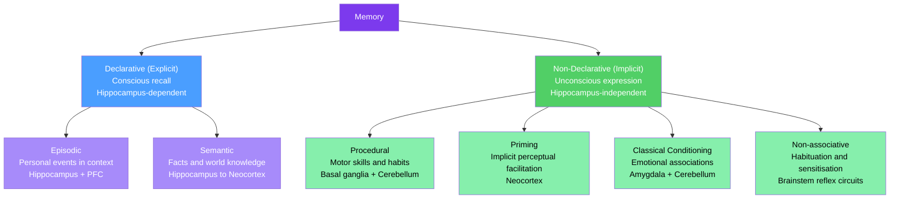

# Learning and Memory Systems

> [!abstract] TL;DR
> Memory is not a single system but a collection of distinct, parallel biological mechanisms — declarative memory for facts and episodes, procedural memory for skills, and working memory for on-line cognitive manipulation — each depending on different brain structures and subject to different failure modes. The process unfolds in three stages: **encoding** (formation of a new trace), **consolidation** (stabilisation from minutes to years), and **retrieval** (reconstruction of the stored pattern). Understanding these systems has direct implications for treating Alzheimer's disease, PTSD, and educational inefficiency, and has directly inspired mechanisms in modern machine learning.

---

## Intuition — analogy FIRST

Imagine a large library with several very different sections. Your **working memory** is the reading desk: it holds only the three or four books you have open right now, and anything you do not actively engage with slides off the desk within seconds. The **procedural memory** section is shelved differently — it stores muscle-memory instructions, like how to ride a bike, and you cannot retrieve those instructions by reading a description; you have to *do* the movement. Once learned, they are remarkably durable — you never forget how to ride. The **declarative memory** section holds two kinds of books: your **episodic memory** is your personal memoir ("I visited Rome in the summer of 2019"), while your **semantic memory** is a reference encyclopedia ("Rome is the capital of Italy"). Both memoir and encyclopedia live in the same main library wing, but they are catalogued and retrieved differently — and the same index system, the hippocampus, governs access to both.

The critical insight is that the library does not store photographs. Every time you "read" a memory, the brain reconstructs it from fragments, filling gaps with plausible inference. The reading desk is small and volatile; the memoir is narrative and reconstructive; the encyclopedia can be updated by experience; and the muscle-memory cabinet is largely inaccessible to conscious revision.

---

## How It Works

The classical **Atkinson-Shiffrin multi-store model** (1968) proposed three sequential stores: sensory register → short-term store → long-term store, linked by rehearsal. Modern neuroscience replaces this single-pipeline view with **multiple parallel systems**, each encoded by distinct neural circuits and subject to independent lesions.

The universal pipeline of **encoding → consolidation → retrieval** applies across all systems:

- **Encoding**: Synaptic modifications during or shortly after an experience, driven by NMDA-receptor-dependent Ca²⁺ influx and downstream kinase cascades (see [[Synaptic_Plasticity_and_LTP]]).
- **Consolidation**: Two-phase stabilisation. *Synaptic consolidation* (minutes to hours) involves local protein synthesis and AMPA-receptor trafficking. *Systems consolidation* (weeks to years) involves hippocampal replay during slow-wave sleep, redistributing the trace into neocortex.
- **Retrieval**: Reactivation of the stored pattern. Each retrieval transiently destabilises the trace — opening a reconsolidation window — before re-stabilising it with minor updates.

**Key neural substrates:**

| Memory type | Primary structure | Landmark evidence |
|---|---|---|
| Declarative (episodic + semantic) | Hippocampus, medial temporal lobe, PFC | Patient H.M.; selective hippocampal lesion studies |
| Procedural (skills, habits) | Basal ganglia (striatum), cerebellum | Parkinson's patients impaired at skill learning; cerebellar lesions abolish eyeblink conditioning |
| Emotional memory (fear) | Amygdala | Focal amygdala lesions eliminate conditioned fear; intact in H.M. |
| Working memory | Prefrontal cortex, parietal cortex | PFC lesions cause WM deficits; persistent delay-period firing in monkeys |
| Priming | Neocortex (sensory association areas) | Preserved in dense amnesiacs who cannot form explicit memories |

**Patient H.M. (Henry Molaison, 1926–2008):** Bilateral medial temporal lobe resection in 1953 — including the hippocampus, amygdala, and surrounding entorhinal cortex — eliminated his ability to form new declarative memories (anterograde amnesia). He could not remember having met his surgeon the day before. Yet he successfully learned new motor tasks (mirror drawing improved over sessions) and showed normal priming — demonstrating that procedural and implicit memory systems are anatomically independent of the hippocampus. This single case established the hippocampus as necessary for declarative memory consolidation and remains the most influential patient study in the history of neuroscience.



*H.M.'s lesion selectively destroyed the left branch (declarative) while leaving the right branch (non-declarative) entirely intact — the most instructive natural experiment in memory neuroscience.*

---

## Key Concepts / Details

### Secondary Level

**Short-term vs Long-term Memory**

Short-term memory (STM) holds a small amount of information in an accessible state for a brief period (seconds to minutes). Capacity is limited to approximately 7 ± 2 items (Miller, 1956) — more accurately around 4 chunks (Cowan, 2001) — and information is lost through displacement by new material and passive decay. Long-term memory (LTM) stores information for periods ranging from hours to a lifetime, appears to have no fixed capacity limit, and is encoded in modified synaptic weights distributed across cortical networks.

**Declarative vs Procedural Memory**

*Declarative memory* (explicit memory) contains information that can be consciously retrieved and stated in words: facts, events, faces, and places. It requires the hippocampus for formation and is tested by recall or recognition tasks.

*Procedural memory* (part of implicit memory) contains skills and habits — motor sequences, cognitive routines, and conditioned responses — expressed through improved performance rather than verbal report. It does not require the hippocampus. H.M. could not remember practising mirror drawing, but his performance improved measurably every day.

**Episodic vs Semantic Memory** (Endel Tulving, 1972)

| Feature | Episodic | Semantic |
|---|---|---|
| Content | Personal events bound to time and place | General facts and concepts |
| Retrieval cue | Contextual ("Where were you when...?") | Conceptual ("What is the capital of...?") |
| Perspective | First-person (autobiographical) | Third-person (objective) |
| Development | Later in childhood | Earlier in childhood |
| Vulnerability to amnesia | Highly vulnerable | Relatively preserved in semantic dementia |

**Explicit vs Implicit Memory**

Explicit memory requires conscious awareness during retrieval. Implicit memory is demonstrated by changes in performance, perceptual fluency, or conditioned responses without conscious recall. Priming (facilitated processing of a stimulus by prior exposure to a related one), procedural learning, and classical conditioning are all implicit and survive hippocampal damage.

**H.M. and the Hippocampus**

Henry Molaison's bilateral hippocampectomy (surgeon: William Beecher Scoville, 1953; studied by Brenda Milner and later Suzanne Corkin at MIT) is the most studied case in neuroscience history. Key findings:

- Severe anterograde amnesia: unable to encode new episodic or semantic memories
- Temporally graded retrograde amnesia: could not recall events from the ~11 years before surgery; remote childhood memories were spared
- Preserved: working memory (digit span normal), procedural learning, priming, remote semantic knowledge
- IQ remained above average (~110); personality and language were unchanged

This profile demonstrates the double dissociation between hippocampus-dependent and hippocampus-independent memory systems.

---

### Undergraduate Level

**Atkinson-Shiffrin Multi-Store Model (1968)**

Richard Atkinson and Richard Shiffrin proposed that information flows through three sequential stores:

1. **Sensory register** — modality-specific (iconic for vision ~0.5 s; echoic for hearing ~3–4 s); large capacity, rapid decay; pre-attentive
2. **Short-term store (STS)** — limited capacity (~7 items), duration ~15–30 s without rehearsal, phonologically coded, subject to displacement
3. **Long-term store** — unlimited capacity, potentially permanent, semantically coded

**Rehearsal** transfers information from STS to LTS. The model's main limitations are: (a) treating LTM as a unitary store ignoring the declarative/procedural/priming split; and (b) underestimating the active, multi-component nature of the short-term store. Neuropsychological double dissociations (patients with intact LTM but impaired STS, and vice versa) further challenged the linear flow assumption.

**Baddeley Working Memory Model (Baddeley & Hitch, 1974; updated Baddeley, 2000)**

Alan Baddeley replaced the unitary STS with a multi-component working memory system:

| Component | Function | Capacity and properties |
|---|---|---|
| **Central executive** | Attentional control; coordinates subsidiary systems; interfaces with LTM | Limited capacity; domain-general; relies on DLPFC and ACC |
| **Phonological loop** | Temporary verbal/acoustic storage | Phonological store (~2 s passive decay) + articulatory rehearsal loop (inner speech refreshes the store) |
| **Visuospatial sketchpad** | Temporary visual and spatial storage | Distinct from phonological; spatial and object components partially dissociable |
| **Episodic buffer** (added 2000) | Integrates information across modalities and from LTM; provides conscious awareness of working memory contents | Limited capacity; binds features across modalities and time into coherent episodes |

Working memory capacity — especially the central executive — is a strong predictor of fluid intelligence, reading comprehension, and mathematical reasoning. Its anatomical correlate is DLPFC sustained activity during delay periods in monkeys and humans.

**Hippocampal Place Cells (O'Keefe & Dostrovsky, 1971)**

John O'Keefe discovered that individual hippocampal CA1 neurons fire selectively when a rat occupies a specific spatial location (the cell's "place field"). An ensemble of place cells tiles the environment into a cognitive map. This framework extended to:

- **Grid cells** (medial entorhinal cortex, Moser lab 2005): firing fields arranged in a hexagonal lattice — a metric coordinate system
- **Head-direction cells** (postsubiculum): fire for specific allocentric head orientations — a compass
- **Border cells**: fire near environmental boundaries

The spatial map provides a canonical model of episodic memory organisation: episodes are encoded as patterns of co-active hippocampal neurons bound to a spatial-temporal context. O'Keefe and the Mosers shared the 2014 Nobel Prize in Physiology or Medicine.

**Memory Consolidation: Synaptic vs Systems**

*Synaptic consolidation* (minutes to hours):

- Ca²⁺ influx through NMDA receptors activates CaMKII, PKA, and MAPK cascades
- Phosphorylation of CREB drives transcription of immediate-early genes (*c-fos*, *Arc*, *zif268*)
- Requires de novo protein synthesis: anisomycin infusion into the hippocampus immediately after training blocks LTM formation without affecting short-term memory
- Consolidates individual synapses at the molecular level (see CREB in Graduate section)

*Systems consolidation* (weeks to years):

- **Standard model (Squire)**: hippocampus repeatedly reactivates cortical representations during offline states (especially NREM slow-wave sleep), gradually strengthening direct cortical-cortical connections until the hippocampus is no longer required for retrieval
- **Multiple Trace Theory (Nadel & Moscovitch)**: hippocampus permanently stores highly contextual episodic memories, while semantic memories become hippocampus-independent
- **Ribot's Law**: retrograde amnesia is temporally graded — remote memories resist hippocampal damage more than recent ones, consistent with systems consolidation timelines

**Sleep-Dependent Memory Consolidation**

Sleep plays a mechanistic, not merely permissive, role in memory consolidation:

- **Slow-wave sleep (SWS/NREM stage 3)**: hippocampal sharp-wave ripples (80–120 Hz) replay waking neural sequences at compressed timescales (~20× faster) during slow cortical oscillations (~0.8 Hz "up" states) and thalamo-cortical sleep spindles (12–15 Hz). This three-frequency coupling — ripple nested within spindle nested within slow oscillation — is thought to drive NMDA-dependent plasticity in neocortex. Disrupting SWS or targeted memory reactivation during SWS impairs next-day declarative memory recall.
- **REM sleep**: important for procedural learning, emotional memory processing, and integration of new memories with existing schemas. REM deprivation impairs fear extinction consolidation.
- **Targeted Memory Reactivation (TMR)**: Rasch et al. (2007) presented an odour cue during SWS that had been paired with a spatial learning task during waking — this selectively improved recall of the cued items, providing direct evidence that hippocampal replay during sleep is functional.

**Memory Reconsolidation**

When a consolidated memory is reactivated by a reminder cue, it enters a transient labile state (lasting ~6 hours in rodents) before being re-stabilised — a process called reconsolidation. During this window, the memory is susceptible to disruption or modification.

Discovery: Nader, Schafe & LeDoux (2000) showed that infusing anisomycin (protein synthesis inhibitor) into the basolateral amygdala immediately after reactivating a fear memory abolished subsequent fear expression — but only if the memory had been reactivated. Injection without reactivation had no effect. This demonstrated that retrieval itself reinstates a consolidation requirement.

Clinical implication: propranolol (β-blocker) administered during PTSD memory reactivation attenuates the emotional strength of the memory in subsequent tests — a potential intervention for trauma (multiple RCTs ongoing with mixed results and active ethical debate).

---

### Graduate Level

**Hippocampal Indexing Theory (Teyler & DiScenna, 1986; Teyler & Rudy, 2007)**

The hippocampus does not store the content of memories; it stores an **index** — a sparse, pattern-completed pointer to the neocortical representations that were co-active during encoding. During retrieval, reactivation of a partial cue in hippocampus triggers pattern completion (via CA3 recurrent collaterals) and reinstates the original cortical ensemble via back-projections.

Key predictions from indexing theory:

- Hippocampal lesions made after consolidation spare memories that have become neocortex-sufficient (consistent with Ribot's Law)
- CA3 lesions specifically impair one-shot pattern completion from partial cues; dentate gyrus lesions impair discrimination of similar contexts (pattern separation)
- Adult dentate gyrus neurogenesis contributes to pattern separation by providing sparsely coding, non-overlapping new neurons — ablating neurogenesis increases interference between similar spatial memories

**Complementary Learning Systems Theory (McClelland, McNaughton & O'Reilly, 1995)**

CLS proposes two fundamentally different learning algorithms operating in parallel:

1. **Hippocampus**: rapid one-shot learning with sparse, non-overlapping representations. Prevents catastrophic interference between similar episodes. High learning rate; prone to forgetting without rehearsal.
2. **Neocortex**: slow, incremental learning that accumulates statistical regularities across many experiences. Builds generalised semantic schemas. Low learning rate; resistant to catastrophic forgetting.

The neocortex requires a slow learning rate to avoid overwriting existing weights when new patterns overlap with old — the same problem that plagues artificial neural networks (catastrophic forgetting, McCloskey & Cohen, 1989). Hippocampal sleep replay "teaches" the neocortex by interleaving new experiences with replays of old ones, preventing interference.

CLS directly inspired **experience replay** in deep reinforcement learning (DQN, Mnih et al., 2015): a replay buffer preserves past agent transitions, which are sampled randomly during training to stabilise gradient updates — a direct computational analogue of hippocampal SWS replay. See [[Reinforcement_Learning]].

**Engram Cells and Optogenetic Memory Manipulation (Tonegawa Lab)**

An **engram** is the physical trace of a memory — the ensemble of neurons that were active during encoding and whose reactivation alone is sufficient to trigger recall. The Tonegawa group used:

- **TRAP (targeted recombination in active populations)**: a Fos-tTA transgenic mouse line that permanently labels activity-tagged cells with channelrhodopsin-2 (ChR2) during a defined time window (controlled by doxycycline withdrawal)
- **Liu et al. (2012)**: optogenetically reactivating contextual fear engram cells in the dentate gyrus triggered freezing behaviour even in a neutral context — demonstrating that the engram is sufficient for recall
- **False memory implantation (Ramirez et al., 2013, *Science*)**: mice explored neutral context A (engram cells tagged with ChR2) and then received foot shocks in context B while optogenetically reactivating context A's engram. On subsequent test in A, mice froze — a fear memory had been linked to context A's representation. A false memory had been implanted by pairing one engram with a new experience, demonstrating that subjective memory content is determined by which engram cells fire, not by some veridical record of events.

**Memory Schema and Assimilation (Bartlett → Tse et al., 2007)**

Frederic Bartlett (1932) demonstrated that memory is reconstructive: subjects systematically misremembered stories to fit cultural schemas, suggesting top-down prior knowledge shapes encoding and retrieval. Tse et al. (2007) provided the neural mechanism: rats trained on a hippocampus-dependent paired-associate task for several weeks developed a **schema** — a structured cortical representation of the task structure. New paired associates could then be acquired in a single trial and rendered hippocampus-independent within 48 hours (instead of the usual weeks), because they were assimilated into the existing schema via medial PFC-hippocampal interactions. Schema-based learning bypasses the slow standard systems consolidation timeline.

**Predictive Coding and Memory**

Within Karl Friston's predictive coding framework, the brain is a generative model that predicts incoming sensory inputs and propagates only prediction errors upward. Memory encoding corresponds to updating the weights of the generative model to reduce future error. Retrieval is a top-down generative process — the model "hallucinates" the stored pattern from partial evidence — which explains why memories are reconstructive, why they are distorted by expectations and priors (Loftus misinformation effects), and why prediction error at retrieval drives new learning (prediction error as a teaching signal, linking memory to the basal ganglia reward system). This framework also unifies memory consolidation (reducing model complexity) and episodic memory (maintaining high-precision copies of recent experiences as detailed generative models).

**CREB and the Molecular Gate for Long-Term Memory**

cAMP response element-binding protein (CREB) is a transcription factor activated by phosphorylation at Ser133 downstream of PKA and CaMKIV. It is the conserved molecular gate for LTM formation across species:

- *Drosophila* (Yin et al., 1994): expressing dominant-negative CREB (dCREB2-b) specifically blocked LTM formation (tested at 24 h) without affecting short-term memory (tested at 3 h); overexpressing an active CREB isoform dramatically reduced the number of training trials needed for LTM
- *Aplysia* (Dash et al., 1990): injecting CREB antibody into sensory neurons blocked long-term facilitation induced by serotonin
- *Mice* (Bourtchuladze et al., 1994): CREB mutant mice showed impaired LTM in contextual fear conditioning and spatial memory

CREB drives expression of BDNF, which activates TrkB → sustained MAPK/ERK signalling → synaptic growth and insertion of additional AMPA receptors. The "molecular switch" metaphor is apt: high CREB activity opens a gate from transient synaptic modifications to permanent structural changes. The balance between kinases (PKA, CaMKIV) and phosphatases (PP1, calcineurin) determines whether a given experience crosses the LTM threshold.

**Transcranial Stimulation and Memory**

- **tACS (transcranial alternating current stimulation)**: Marshall et al. (2006) applied 0.75 Hz tACS over frontal cortex during SWS and found enhanced next-day declarative memory, providing causal evidence that slow oscillations drive consolidation (not merely correlating with it). The proposed mechanism: tACS entrains endogenous slow oscillations, increasing the probability of hippocampal ripple events falling in the cortical "up" state, thereby enhancing Hebbian plasticity at hippocampal-cortical synapses.
- **tDCS (transcranial direct current stimulation)**: anodal tDCS over DLPFC during encoding modestly improves recognition memory (~5–10%) in some studies; effects are variable and replication failures are common.
- **TMS (transcranial magnetic stimulation)**: repetitive TMS over the hippocampal-entorhinal complex disrupts pattern separation during encoding (causal probe); combined TMS-EEG measures the ripple-spindle-slow oscillation coupling non-invasively and is now used to identify optimal stimulation phase targets.

---

## Python Demo

```python
import numpy as np
import matplotlib.pyplot as plt

# Ebbinghaus forgetting curve: R(t) = exp(-t / S)
# S = memory stability (days), t = time elapsed since last encoding or review
# Spaced repetition: each review at the retrieval threshold multiplies S by K_BOOST

THRESHOLD = 0.80   # schedule next review when retention falls to this level
K_BOOST   = 2.5    # stability multiplier per successful review (SM-2 inspired)

def retention(t_elapsed, S):
    """Fraction retained after t_elapsed days with stability S."""
    return np.exp(-t_elapsed / S)

def days_until_threshold(S):
    """Solve exp(-t/S) = THRESHOLD for t."""
    return -S * np.log(THRESHOLD)

# ── Single-study forgetting curve ─────────────────────────────────────────────
S_init   = 1.0                        # initial stability: 1 day
t_plot   = np.linspace(0, 30, 500)
R_single = retention(t_plot, S_init)

# ── Spaced repetition simulation ──────────────────────────────────────────────
S = S_init
t_now = 0.0
review_times = [0.0]   # t=0 is the initial study event
stabilities  = [S]     # stability active during each inter-review segment

while True:
    dt     = days_until_threshold(S)
    t_next = t_now + dt
    if t_next > 30.0:
        break
    t_now  = t_next
    S     *= K_BOOST            # stability grows with each successful review
    review_times.append(t_now)
    stabilities.append(S)

# Build piecewise retention curve: after each review, retention resets to 1.0
# and decays with the updated (boosted) stability
t_spaced, R_spaced = [], []
for i, (t_rev, S_seg) in enumerate(zip(review_times, stabilities)):
    t_end = review_times[i + 1] if i + 1 < len(review_times) else 30.0
    t_seg = np.linspace(t_rev, t_end, 200)
    t_spaced.extend(t_seg)
    R_spaced.extend(retention(t_seg - t_rev, S_seg))

# ── Plot ──────────────────────────────────────────────────────────────────────
fig, ax = plt.subplots(figsize=(10, 5))

ax.plot(t_plot,   R_single, color='tomato',    lw=2,
        label='Single study  (S = 1 day)')
ax.plot(t_spaced, R_spaced, color='steelblue', lw=2,
        label='Spaced repetition  (K = 2.5x)')
ax.axhline(THRESHOLD, color='gray', ls='--', lw=1.2,
           label=f'Review threshold ({THRESHOLD:.0%})')

for rt in review_times[1:]:
    ax.axvline(rt, color='steelblue', alpha=0.25, lw=0.8)
    ax.scatter(rt, THRESHOLD, color='steelblue', s=45, zorder=5)

ax.set_xlabel('Days since initial study')
ax.set_ylabel('Retention  R(t) = exp(-t / S)')
ax.set_title('Ebbinghaus Forgetting Curve vs. Spaced Repetition')
ax.legend(fontsize=9)
ax.set_ylim(0, 1.05)
ax.set_xlim(0, 30)
plt.tight_layout()
plt.savefig('forgetting_curve.png', dpi=150)

gaps = [round(review_times[i + 1] - review_times[i], 1)
        for i in range(len(review_times) - 1)]
print(f"Review schedule (days):    {[round(r, 1) for r in review_times[1:]]}")
print(f"Inter-review gaps (days):  {gaps}")
print(f"Final stability:           {S:.1f} days  ({len(review_times) - 1} reviews)")
```

The output shows geometrically expanding inter-review intervals — each gap is approximately 2.5 times the previous — which is the hallmark of spaced repetition algorithms (Anki's SM-2). Without spacing, retention drops below threshold within ~0.2 days; with five strategically spaced reviews across 30 days the material ends with a stability of ~98 days. This models the spacing effect, the most robust finding in the cognitive psychology of learning: distributing practice over time produces far more durable retention than equivalent massed practice, because each review at the moment of near-forgetting provides a larger memory-strengthening signal than reviewing while the trace is still strong.

---

## Real-World Applications

**Alzheimer's Disease and Declarative Memory Failure**

Alzheimer's disease attacks the hippocampal-entorhinal circuit first (Braak staging I–II), then spreads along memory-related cortices (Braak III–IV) before affecting the whole neocortex. The consequence is a canonical declarative memory collapse: patients lose the ability to form new episodic memories (anterograde amnesia) years before they lose procedural skills or remote semantic knowledge. This dissociation maps exactly onto the memory taxonomy — the hippocampus-dependent declarative branch fails while basal ganglia-dependent procedural memory survives into late disease stages. See [[Neurodegenerative_Diseases]] for the molecular pathology of tau and amyloid.

**PTSD and Fear Memory Reconsolidation**

Post-traumatic stress disorder involves an over-consolidated, intrusive fear memory that resists extinction. The reconsolidation framework offers a therapeutic window: reactivating the trauma memory under controlled conditions (trauma narrative, VR exposure) and blocking reconsolidation pharmacologically (propranolol) or with extinction training during the labile window can attenuate the emotional valence of the memory. Several randomised controlled trials report reduced PTSD symptom scores after propranolol-augmented memory reactivation, though effect sizes remain debated. See [[Limbic_System_and_Diencephalon]] for the amygdala circuitry underlying fear encoding.

**Spaced Repetition Learning (Anki)**

Anki implements the SM-2 algorithm (Piotr Wozniak), which estimates individual item stability from inter-repetition intervals and self-reported difficulty, scheduling reviews to keep retention above ~90%. Medical students using Anki for anatomy and pharmacology report learning efficiencies 2–4 times higher than massed re-reading. This is the practical application of the spacing effect, the generation effect (producing an answer is more effective than recognising it), and the testing effect (Roediger & Karpicke, 2006: taking a retrieval practice test produces more durable learning than an equivalent period of re-study).

**Eyewitness Testimony Unreliability**

Elizabeth Loftus's experiments (1974 onward) demonstrated that episodic memory is easily distorted by post-event information. Subjects shown a film of a car accident and asked "How fast were the cars going when they *smashed* into each other?" reported higher speeds and were more likely to falsely remember broken glass compared to those asked with the word "hit." The reconstructive nature of episodic memory — each retrieval is effectively a re-encoding — creates systematic vulnerability to misinformation effects and false memories. Courts now recognise the low reliability of eyewitness identification: wrongful convictions in approximately 70% of DNA exoneration cases (Innocence Project) involved eyewitness testimony.

**Deep Brain Stimulation for Memory**

Preliminary clinical trials used DBS of the fornix (white-matter tract connecting hippocampus to septal nuclei) to attempt to slow cognitive decline in Alzheimer's disease. Phase I results (Laxton et al., 2010) showed increased hippocampal glucose metabolism and possible attenuation of hippocampal volume loss. Phase II results were mixed. More targeted work by Suthana et al. (2012) applied DBS directly to the entorhinal cortex in epilepsy patients during spatial memory encoding and found improved subsequent recall — the proposed mechanism is entrainment of hippocampal theta oscillations (4–8 Hz), which gate NMDA-dependent encoding plasticity.

**Memory Training and Neurogenesis**

"Brain training" products (Lumosity, Cogmed) consistently show near-transfer to trained tasks but minimal far-transfer to real-world outcomes or fluid intelligence (meta-analysis: Melby-Lervåg et al., 2016). The reliable exception is **aerobic exercise**: sustained cardiovascular exercise increases hippocampal BDNF, promotes adult dentate gyrus neurogenesis, and improves pattern separation performance in both rodents and humans. Six months of aerobic exercise reliably increases hippocampal volume by ~2% and improves spatial memory — the most well-validated behavioural intervention for hippocampal function. See [[Sleep_and_Circadian_Rhythms]] for how sleep architecture interacts with and amplifies all consolidation mechanisms above.

---

## Common Pitfalls

- **"The hippocampus stores memories"** — The hippocampus is an *index*, not a storage device. Memories are distributed across neocortical networks corresponding to the sensory, motor, and affective content of the experience. The hippocampus binds these cortical fragments at encoding and coordinates their reactivation at retrieval. After systems consolidation, neocortical connections support retrieval without hippocampal involvement. Treating the hippocampus as a hard drive leads to incorrect predictions: it predicts, wrongly, that hippocampal lesions should abolish all memories, and that memory capacity should be proportional to hippocampal volume.

- **"Procedural memory requires the hippocampus"** — The clearest refutation is H.M.: he improved at mirror drawing and rotary pursuit tracking over successive sessions despite having no memory of ever practising. The basal ganglia (specifically the dorsal striatum) and cerebellum encode procedural learning through dopamine-dependent reinforcement and error-based adjustment respectively. Parkinson's disease (dopaminergic loss in the nigrostriatal pathway) selectively impairs procedural learning while hippocampus-dependent spatial memory is relatively preserved until late stages.

- **"Working memory and short-term memory are the same thing"** — Working memory is an active, attention-controlled system for *manipulating* information on-line; short-term memory refers simply to brief passive retention. They dissociate both neuropsychologically (patients with intact digit span but severely impaired complex span and n-back performance) and neuroanatomically (simple phonological storage recruits the phonological loop; working memory manipulation recruits the central executive and DLPFC). Using the terms interchangeably obscures a distinction with major clinical and educational consequences.

- **"Long-term memory is permanent"** — Reconsolidation research shows that every retrieval event destabilises the memory and requires re-consolidation. Repeated reactivation in a new context allows the memory to drift, update, and occasionally become distorted or overwritten. Extinction does not erase fear memories but creates a new inhibitory memory — the original fear trace remains and can be retrieved under stress (spontaneous recovery), in the original context (renewal), or after re-exposure to the unconditioned stimulus (reinstatement).

- **"Forgetting is failure"** — Bjork's "desirable difficulties" framework reframes forgetting as adaptive: the brain actively inhibits retrieval of competing memories (retrieval-induced forgetting, RIF). The forgetting that results from inhibition facilitates selective retention of useful information and prevents catastrophic interference in neocortical networks. The slow learning rate of the neocortex in the CLS framework is not a flaw but a principled design choice to prevent new learning from overwriting existing representations.

---

## Related Concepts

- [[_MOC_Cognitive_Neuroscience|↑ Cognitive Neuroscience MOC]] — section map linking all seven cognitive neuroscience topics in this vault section
- [[Synaptic_Plasticity_and_LTP]] — LTP is the synaptic-level implementation of encoding; NMDA receptor activation, CaMKII autophosphorylation, and AMPA receptor insertion are the molecular steps that instantiate a memory trace at individual synapses, feeding directly into the CREB cascade described in the Graduate section
- [[Limbic_System_and_Diencephalon]] — the hippocampus and amygdala are core components of the limbic system; the diencephalon (mammillary bodies, anterior thalamus) are critical relay stations in the Papez circuit and are specifically damaged in Korsakoff syndrome, producing a pure amnesic state
- [[Sleep_and_Circadian_Rhythms]] — slow-wave sleep slow oscillations, thalamo-cortical spindles, and hippocampal sharp-wave ripples jointly orchestrate the transfer of memories from hippocampus to neocortex during offline consolidation; circadian timing modulates memory encoding efficiency across the day
- [[Neurodegenerative_Diseases]] — Alzheimer's disease, frontotemporal dementia, and Korsakoff syndrome are primarily memory disorders traceable to the specific anatomical circuits mapped in this note; the Braak staging of Alzheimer's follows the memory-relevant hierarchy of hippocampus → entorhinal cortex → association cortex
- [[Decision_Making_and_Reward_Circuits]] — the basal ganglia double as procedural memory circuits and reward-based decision-making circuits; dopaminergic prediction error signals (RPE) drive habit formation and constitute the biological substrate of model-free reinforcement learning
- [[Neuron_Structure_and_Function]] — the action potential, synaptic transmission, and dendritic computation mechanisms that underlie any form of memory storage at the cellular level; NMDA receptor as coincidence detector is the link between cellular biophysics and Hebbian plasticity
- [[Reinforcement_Learning]] (AI/ML) — model-free RL algorithms (Q-learning, SARSA) are directly inspired by the dopaminergic RPE signal in the basal ganglia; experience replay in DQN implements the CLS hippocampal replay hypothesis computationally; the catastrophic forgetting problem in neural networks motivated CLS theory in reverse

---

## Review Questions

### Secondary Tier

1. Henry Molaison (H.M.) could not remember meeting his doctor the day before, yet his performance on the mirror-drawing task improved measurably over successive sessions. Name the two memory systems that explain this dissociation, identify the brain structure responsible for each, and explain why the lesion affected one system but not the other.
2. Describe the difference between episodic and semantic memory. Give one original example of each. Why does severe hippocampal damage tend to destroy the ability to form new episodic memories more than it damages remote semantic knowledge such as language and general facts?

### Undergraduate Tier

3. A student is simultaneously reading a textbook sentence, mentally rehearsing a phone number, and imagining the spatial layout of a building they need to navigate to after class. Map each of these tasks onto a component of Baddeley's working memory model. If you added a demanding cognitive arithmetic problem to the same moment, which component would be most disrupted, and which would be least affected? Justify your answer.
4. A rat is trained on a hippocampus-dependent Morris water maze for three weeks and then receives a hippocampal lesion. When tested on the previously learned maze, the rat performs normally. When introduced to a new version of the maze, it fails to learn. What does this double dissociation reveal about systems consolidation and the time-dependency of hippocampal involvement? Which theory — Standard Model or Multiple Trace Theory — does this result better support, and why?
5. Nader et al. infused anisomycin into the amygdala immediately after reactivating a fear memory and found the fear memory was subsequently abolished — but the same infusion given without reactivation had no effect. What does this demonstrate about the stability of consolidated memories, and what are the immediate therapeutic implications for PTSD treatment?

### Graduate Tier

6. Complementary Learning Systems theory proposes that the hippocampus and neocortex use fundamentally different learning rates for principled reasons related to catastrophic interference. If you were designing a deep learning architecture to solve the same catastrophic forgetting problem, what two architectural choices would you implement, and how do they map onto the biological mechanisms? Then design a neurophysiological experiment — specifying recording methods, stimulation protocol, and behavioural task — to test whether hippocampal sharp-wave ripple replay during sleep is causally necessary for the slow integration of new information into neocortical schema representations.
7. Tonegawa's group used optogenetics to implant a false fear memory by pairing context A's engram with a shock in context B. Design a follow-up experiment using chemogenetics (DREADDs) to test two specific hypotheses: (a) that the false memory trace is stored in the same dentate gyrus engram cells as a genuine contextual fear memory formed under identical conditions; and (b) that reconsolidation of the false memory requires the same amygdala-dependent protein synthesis cascade as reconsolidation of a genuine one. Specify your controls, dependent measures, and what results would confirm or falsify each hypothesis.
8. You find that 0.75 Hz tACS applied over frontal cortex during the first slow-wave sleep episode of the night improves next-day performance on a verbal paired-associate task by 20%. Propose a mechanistic hypothesis at the level of neural circuits and synaptic plasticity rules. Design a combined closed-loop EEG-tACS study — specifying the phase-locking condition, the sham control, the neurophysiological measures (ripple rate, spindle coupling, slow oscillation amplitude), and the prediction of your hypothesis about which parameter should correlate with memory improvement. What single result would most convincingly falsify your hypothesis?

---

## Sources

- Squire, L.R. & Kandel, E.R. — *Memory: From Mind to Molecules*, 2nd ed. (2009), Roberts & Company. The canonical accessible account of memory neuroscience from LTP to patient studies.
- Baddeley, A. — *Working Memory, Thought, and Action* (2007), Oxford University Press. The definitive exposition of the multi-component working memory model including the episodic buffer.
- Tonegawa, S., Liu, X., Ramirez, S. & Redondo, R. — "Memory engram cells have come of age," *Neuron* 87(5): 918–931 (2015). Comprehensive review of engram cell research from the Tonegawa lab covering optogenetics, false memories, and engram competition.
- Ramirez, S. et al. — "Creating a false memory in the hippocampus," *Science* 341: 387–391 (2013). Original demonstration of optogenetic false memory implantation.
- McClelland, J.L., McNaughton, B.L. & O'Reilly, R.C. — "Why there are complementary learning systems in the hippocampus and neocortex: insights from the successes and failures of connectionist models," *Psychological Review* 102(3): 419–457 (1995). Foundational CLS theory paper.
- Kandel, E.R., Koester, J.D., Mack, S.H. & Siegelbaum, S.A. — *Principles of Neural Science*, 6th ed. (2021), McGraw-Hill. Chapters 51–55 cover explicit memory, implicit memory, cellular mechanisms of storage, and the hippocampal system in depth.
- Nader, K., Schafe, G.E. & LeDoux, J.E. — "Fear memories require protein synthesis in the amygdala for reconsolidation after retrieval," *Nature* 406: 722–726 (2000). Discovery of reconsolidation as a distinct consolidation process.

---

#Neuroscience #CognitiveNeuroscience #Memory #Learning
